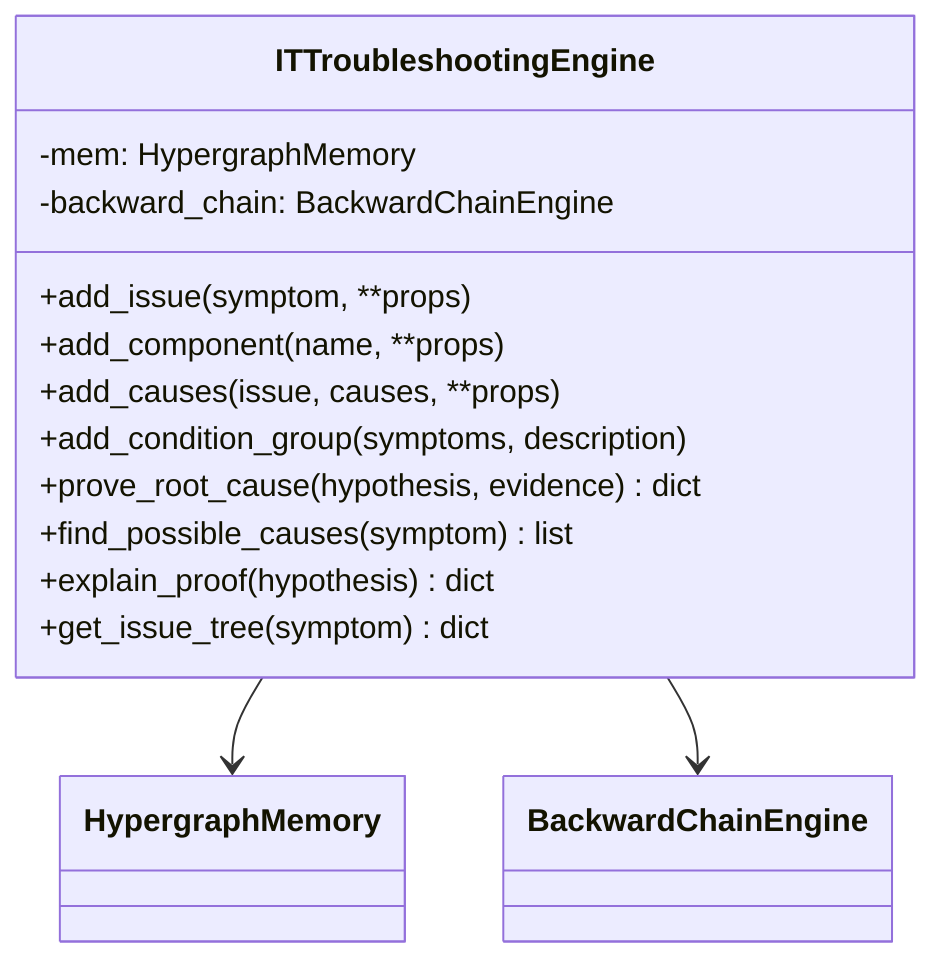
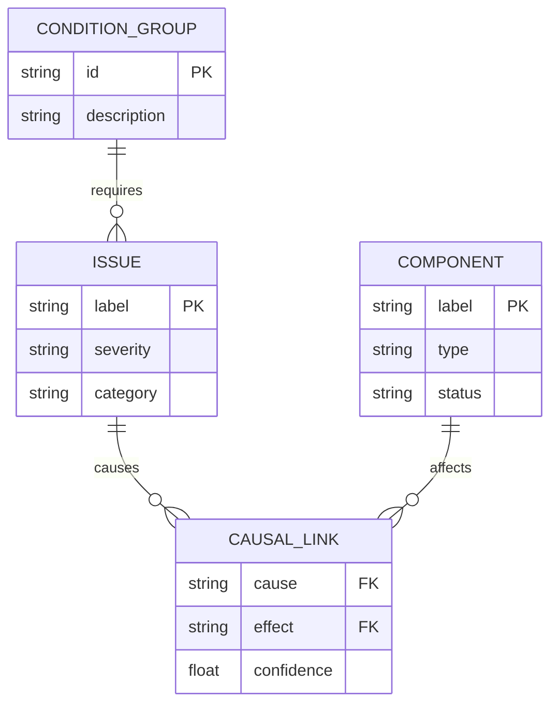

# IT Troubleshooting Engine - Design Document

## Overview

A local-first IT troubleshooting system that demonstrates Hyper3's **backward chaining** capability using the `BackwardChainEngine`. This is fundamentally different from transitive reasoning - instead of finding chains A→B→C, it starts from a goal/hypothesis and works backward to prove it by finding required conditions.

**Why This Domain:**
- Every IT person understands troubleshooting
- Natural goal-directed reasoning: "Is the root cause X?" → check if required conditions exist
- Demonstrates backward chaining's "prove a hypothesis" capability
- Completely different from our transitive relationship examples

## Competitive Advantage

| Feature | Hyper3 | XGI | HyperNetX | HyperX |
|---------|--------|-----|-----------|--------|
| Backward chaining | ✅ BackwardChainEngine | ❌ | ❌ | ❌ |
| Goal-directed reasoning | ✅ prove() method | ❌ | ❌ | ❌ |
| N-ary condition groups | ✅ Native hyperedges | ✅ (no reasoning) | ✅ (no reasoning) | ✅ (cloud) |
| Root cause analysis | ✅ Provenance for proofs | ❌ | ❌ | ⚠️ Basic |
| Local-first (no API/cloud) | ✅ Zero deps | ✅ | ✅ | ❌ |

## Architecture



## How Backward Chaining Works

**Transitive (forward):** A→B, B→C, so A→C exists
**Backward (goal-directed):** "Is A the cause?" → Check if A→B→C conditions are met

Example:
- Hypothesis: "Network failure is root cause"
- Backward chain: To prove network failure, need "no connectivity" → to get no connectivity, need "router down" → to get router down, need "power failure"
- If we find evidence for all conditions in the chain, the hypothesis is PROVEN

## Data Model

### Node Types



### Hypergraph Representation

1. **Issue nodes**: `mem.store("no_network", data={"severity": "high", "category": "network"})`
2. **Component nodes**: `mem.store("router", data={"type": "network", "status": "down"})`
3. **Causal edges** (pairwise): `mem.relate("power_failure", "router_down", label="causes", weight=0.9)`
4. **Condition groups** (n-ary): `mem.relate_hyperedge(sources={"router_down"}, targets={"no_network", "no_wifi"}, label="produces")`

## Key Workflows

### 1. Building the Troubleshooting Graph

```python
engine = ITTroubleshootingEngine()

# Add issues (symptoms)
engine.add_issue("server_wont_boot", severity="critical", category="hardware")
engine.add_issue("no_network", severity="high", category="network")
engine.add_issue("slow_performance", severity="medium", category="software")

# Add components
engine.add_component("power_supply", type="hardware", status="failed")
engine.add_component("router", type="network", status="down")

# Add causal relationships (forward direction)
engine.add_causes("power_failure", "server_wont_boot", confidence=0.95)
engine.add_causes("router_down", "no_network", confidence=0.90)
engine.add_causes("network_congestion", "slow_performance", confidence=0.85)

# Add condition groups (n-ary: multiple symptoms require same cause)
engine.add_condition_group(["no_network", "no_wifi"], "Complete network failure")
```

### 2. Proving a Root Cause (Backward Chaining)

```python
# Prove: "Is power failure the root cause of server_wont_boot?"
result = engine.prove_root_cause(
    hypothesis="power_failure",
    evidence={"server_wont_boot": True}
)

# Returns:
# {
#     "proven": True,
#     "confidence": 0.95,
#     "proof_path": ["server_wont_boot", "power_failure"],
#     "missing_conditions": [],
#     "reason": "All required conditions met: power_failure → server_wont_boot"
# }
```

### 3. Finding Possible Causes

```python
# Find all possible causes for a symptom
causes = engine.find_possible_causes("no_network")
# Returns list of issues that could lead to no_network
```

### 4. Getting Issue Tree

```python
# Get full causal tree for an issue
tree = engine.get_issue_tree("server_wont_boot")
# Returns nested dict showing all upstream causes
```

## Class Design

```python
class ITTroubleshootingEngine:
    """Local-first IT troubleshooting engine with backward chaining.

    Demonstrates Hyper3's unique capabilities:
    - BackwardChainEngine for goal-directed reasoning
    - N-ary condition groups for complex issue relationships
    - Root cause analysis with confidence scoring
    - Provenance tracking for explainable proofs
    """

    def __init__(self):
        """Initialize engine with HypergraphMemory and BackwardChainEngine."""
        self.mem = HypergraphMemory(evolve_interval=0)

    def add_issue(self, name: str, **properties) -> str:
        """Add issue/symptom with metadata."""

    def add_component(self, name: str, **properties) -> str:
        """Add hardware/software component."""

    def add_causes(self, cause: str, effect: str, *, confidence: float = 0.8) -> None:
        """Add causal relationship: cause leads to effect."""

    def add_condition_group(self, issues: list[str], description: str) -> None:
        """Add n-ary group: multiple symptoms can come from same cause."""

    def prove_root_cause(self, hypothesis: str, evidence: dict[str, bool]) -> dict:
        """Prove/disprove a root cause hypothesis using backward chaining."""

    def find_possible_causes(self, symptom: str) -> list[dict]:
        """Find all issues that could cause the given symptom."""

    def explain_proof(self, hypothesis: str) -> dict:
        """Explain the proof chain for a hypothesis."""

    def get_issue_tree(self, symptom: str) -> dict:
        """Get full causal tree for a symptom."""
```

## File Structure

```
examples/domain/it_troubleshooting/
├── __init__.py
├── engine.py          # ITTroubleshootingEngine class
└── demo.py            # Demonstration script
```

## Example Output

```
=== IT TROUBLESHOOTING ENGINE DEMO ===

SECTION 1: Building troubleshooting graph...
  Added 8 issues/symptoms
  Added 4 causal relationships
  Added 2 condition groups

SECTION 2: Proving root cause: power_failure → server_wont_boot
  Proving: "Is power_failure causing server_wont_boot?"
  Result: PROVEN (confidence: 0.95)
  Proof path: server_wont_boot → power_failure
  Missing conditions: []

SECTION 3: Finding possible causes for 'no_network'
  Found 2 possible causes:
    - network_congestion (confidence: 0.85)
    - router_down (confidence: 0.90)

SECTION 4: Getting full issue tree for 'slow_performance'
  slow_performance
  └── network_congestion
      └── high_latency
          └── dns_timeout
              └── dns_server_down
              └── network_card_fault
          └── application_overload

SECTION 5: Explaining proof for hypothesis
  Hypothesis: power_failure
  Status: PROVEN
  Root cause confidence: 0.95
  Evidence chain: server_wont_boot ← power_failure (95%)

==========================================
DEMO COMPLETE
==========================================
```

## Design Decisions

1. **Backward chaining vs transitive**: This uses goal-directed reasoning (prove X) not chain discovery (A→B→C). Completely different paradigm from our other examples.

2. **N-ary condition groups**: A single cause can produce multiple symptoms. Using `relate_hyperedge()` captures this natively.

3. **Confidence scoring**: Each causal link has a confidence weight, propagated through the proof chain to give overall confidence.

4. **Prove vs Find**: `prove_root_cause()` returns PROVEN/DISPROVEN with confidence. `find_possible_causes()` just returns potential causes without proving them.

## Why This Is Different

| Aspect | Recipe/Job Examples | Medical Timeline | IT Troubleshooting |
|--------|---------------------|------------------|---------------------|
| **Core mechanism** | Transitive A→B→C | Allen time intervals | Backward chain proof |
| **Question type** | "What connects to what?" | "When does this overlap?" | "Is X the cause of Y?" |
| **Hyper3 feature** | BFS traversal | TemporalReasoner | BackwardChainEngine |
| **Output** | Chain of connections | Temporal relations | PROVEN/DISPROVEN with confidence |

This example showcases Hyper3's **goal-directed reasoning** - the ability to take a hypothesis and PROVE it by working backward through the causal graph.