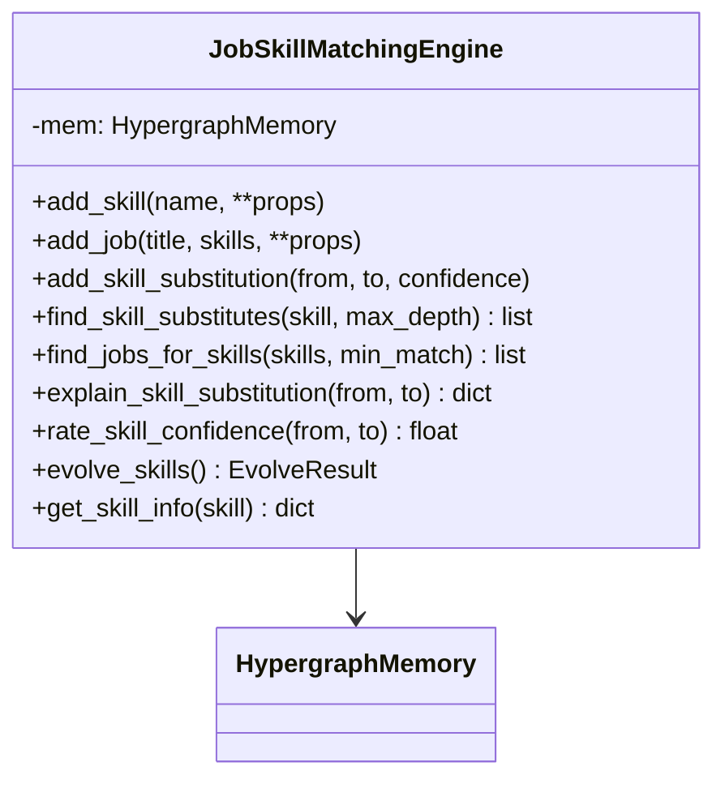
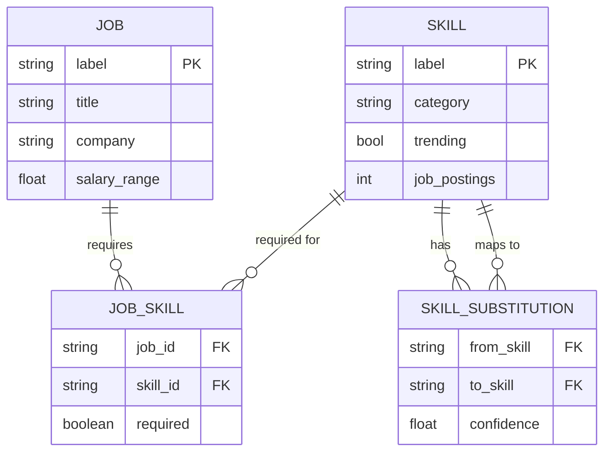
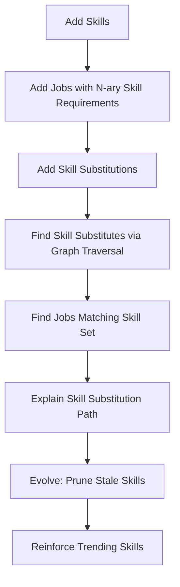

# Job Skill Matching Engine - Design Document

## Overview

A local-first job skill matching engine that demonstrates Hyper3's unique capabilities in a relatable professional domain.

**Why This Domain:**
- Everyone understands job skills and career transitions
- Job postings naturally create n-ary relationships (job requires multiple skills)
- Programming languages substitute for each other (Python→Java→C++)
- Skill relevance changes over time (COBOL becomes stale, Rust gains popularity)
- Clear filtering: piano/cooking shouldn't appear in tech skill matches

## Competitive Advantage

| Feature | Hyper3 | XGI | HyperNetX | HyperX |
|---------|--------|-----|-----------|--------|
| N-ary job-skill relationships | ✅ Native hyperedges | ✅ (no reasoning) | ✅ (no reasoning) | ✅ (cloud) |
| Transitive skill chains | ✅ Graph traversal | ❌ | ❌ | ⚠️ Basic paths |
| Self-evolving skill database | ✅ GraphMaintenanceEngine | ❌ | ❌ | ❌ |
| Explainable skill matches | ✅ Provenance tracking | ❌ | ❌ | ⚠️ Basic |
| Local-first (no API/cloud) | ✅ Zero deps | ✅ | ✅ | ❌ |

## Architecture



## Data Model

### Node Types



### Hypergraph Representation

1. **Skill nodes**: `mem.store("python", data={"category": "programming", "trending": True})`
2. **Job nodes**: `mem.store("backend_dev", data={"salary": 120000})`
3. **Job-Skill edges** (n-ary): `mem.relate_hyperedge(sources={"backend_dev"}, targets={"python", "sql", "git"}, label="requires")`
4. **Skill substitution edges** (pairwise): `mem.relate("python", "java", label="substitutes_for", weight=0.85)`

## Workflow



## Key Workflows

### 1. Building the Knowledge Base

```python
engine = JobSkillMatchingEngine()

# Add skills
engine.add_skill("python", category="programming", trending=True)
engine.add_skill("java", category="programming", trending=True)
engine.add_skill("cobol", category="programming", trending=False)
engine.add_skill("sql", category="database", trending=True)
engine.add_skill("git", category="tools", trending=True)

# Add jobs (n-ary hyperedges connecting jobs to required skills)
engine.add_job("backend_developer", 
    skills=["python", "sql", "git"],
    salary=120000)

# Add skill substitutions with confidence
engine.add_skill_substitution("python", "java", confidence=0.85)
engine.add_skill_substitution("python", "javascript", confidence=0.75)
engine.add_skill_substitution("java", "cplusplus", confidence=0.80)
```

### 2. Finding Transitive Skill Substitutions

```python
# Graph traversal finds: python → java → c++
substitutes = engine.find_skill_substitutes("python", max_depth=3)
# Returns list of dicts with label, confidence, depth, path
```

### 3. Finding Jobs Matching a Skill Set

```python
# Find jobs where candidate's skills match required skills
matching_jobs = engine.find_jobs_for_skills(
    ["python", "sql"], 
    min_match=0.5  # at least 50% of required skills
)
```

### 4. Self-Evolution

```python
# After processing many job postings:
engine.evolve_skills()
# - Prunes stale skills (COBOL, Flash) not used in 90+ days
# - Reinforces trending skills (Python, Rust) used frequently
# - Merges duplicate skill entries
```

## Class Design

```python
class JobSkillMatchingEngine:
    """Local-first job skill matching engine.

    Demonstrates Hyper3's unique capabilities:
    - N-ary hyperedges for job-skill requirements
    - Graph traversal for discovering skill substitution chains
    - Self-evolution (prune stale skills, reinforce trending)
    - Provenance tracking for explainable matches
    """

    def __init__(self, evolve_interval: int = 0):
        """Initialize engine with HypergraphMemory.

        Args:
            evolve_interval: Auto-evolution frequency (0=manual).
        """

    def add_skill(self, name: str, **properties) -> str:
        """Add skill with metadata (category, trending, etc)."""

    def add_job(self, title: str, skills: list[str], **properties) -> str:
        """Add job posting as n-ary hyperedge connecting to required skills."""

    def add_skill_substitution(self, from_skill: str, to_skill: str, *,
                              confidence: float = 0.8) -> None:
        """Add pairwise skill substitution with confidence weight."""

    def find_skill_substitutes(self, skill: str, *, max_depth: int = 3) -> list[dict]:
        """Find all substitute skills via graph traversal."""

    def find_jobs_for_skills(self, skills: list[str], *,
                             min_match: float = 0.5) -> list[dict]:
        """Find jobs where skills match required skills above threshold."""

    def explain_skill_substitution(self, from_skill: str,
                                  to_skill: str) -> Optional[dict]:
        """Return explanation of why substitution is valid."""

    def rate_skill_confidence(self, from_skill: str,
                              to_skill: str) -> float:
        """Get confidence score for skill substitution."""

    def evolve_skills(self) -> EvolveResult:
        """Trigger self-evolution: prune stale, reinforce trending."""

    def get_skill_info(self, skill: str) -> Optional[dict]:
        """Get skill metadata."""
```

## File Structure

```
examples/domain/job_skill_matching/
├── __init__.py
├── engine.py          # JobSkillMatchingEngine class
└── demo.py            # Demonstration script with if __name__ == "__main__"
```

## Success Criteria

1. **Uses 3+ Hyper3 features**: N-ary hyperedges, graph traversal, self-evolution
2. **Practical**: Solves a real problem (job matching, career transitions)
3. **Local-first**: No network calls, no API keys
4. **Self-contained**: All data generated in-script
5. **Explainable**: Every skill match comes with a provenance trail
6. **Evolves**: Skill database improves with usage (prune COBOL, reinforce Python)
7. **Filters non-matches**: Piano/cooking don't appear in tech skill results

## Example Output

```
=== JOB SKILL MATCHING ENGINE DEMO ===

SECTION 1: Building knowledge base...
  Added 8 skills
  Added 3 job postings (n-ary hyperedges)
  Added 5 skill substitutions

SECTION 2: Finding substitutes for 'python'...
  Found 3 substitute(s):
  - java (confidence: 0.85, depth: 1, path: python → java)
  - javascript (confidence: 0.75, depth: 1, path: python → javascript)
  - cplusplus (confidence: 0.80, depth: 2, path: python → java → cplusplus)

SECTION 3: Finding jobs for skills ['python', 'sql']...
  Found 2 matching job(s):
  - backend_developer (match: 100%, salary: $120k)
  - fullstack_developer (match: 67%, salary: $110k)

SECTION 4: Non-matching skills filtering...
  Piano substitutes found: 0 (correct: piano is not a programming skill)
  Cooking substitutes found: 0 (correct: cooking is not tech)

SECTION 5: Triggering self-evolution...
  Pruned: 1 nodes (cobol - stale skill)
  Reinforced: 3 edges (python, java, sql)
  Merged: 0 node pairs

SECTION 6: Explain skill substitution: python → cplusplus...
  No DIRECT edge (it's a 2-hop transitive relationship)
  Path: python → java → cplusplus
```

## Design Decisions

1. **N-ary hyperedges for jobs**: A job posting naturally requires multiple skills. Using `relate_hyperedge()` captures this relationship natively.

2. **Pairwise edges for substitutions**: Skill substitutions are binary relationships (Python substitutes for Java). Using `relate()` with `substitutes_for` label.

3. **Graph traversal (not reason())**: Simpler than multiway reasoning for this use case. BFS on the `substitutes_for` edge graph finds transitive chains.

4. **Stale skill pruning**: Skills not used in job postings for 90+ days get pruned during evolution. Simulated by adding stale skills in demo.

5. **Non-skill filtering**: Skills like "piano" or "cooking" have no `substitutes_for` edges to programming skills, so they automatically don't appear in results.
