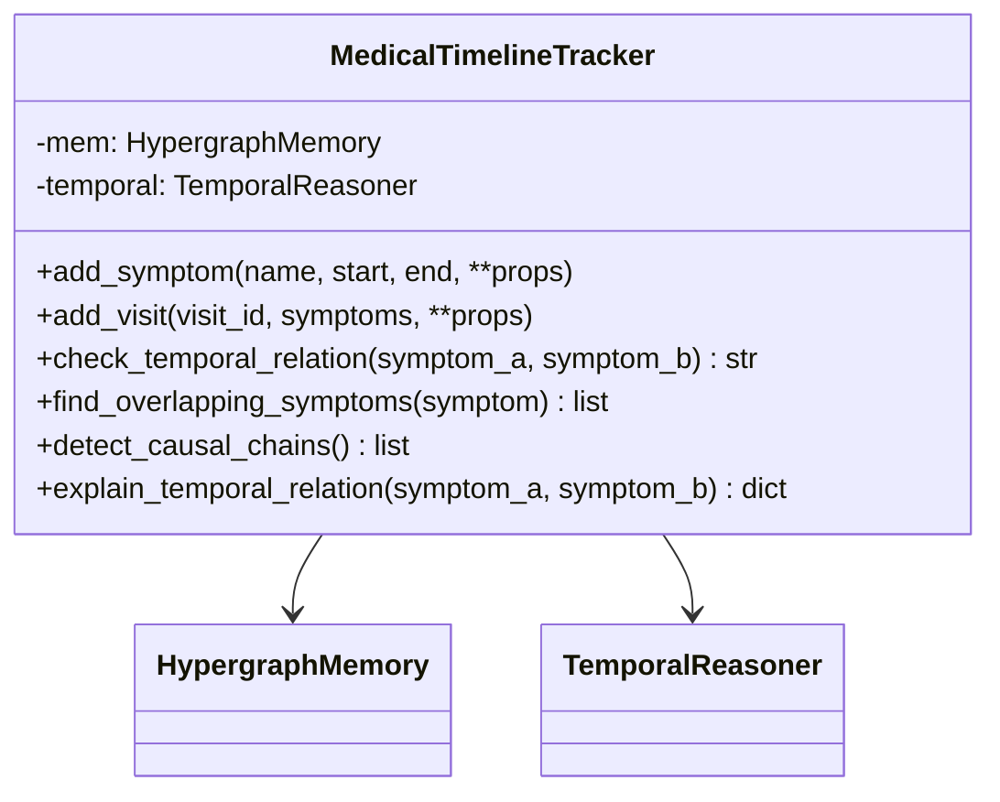
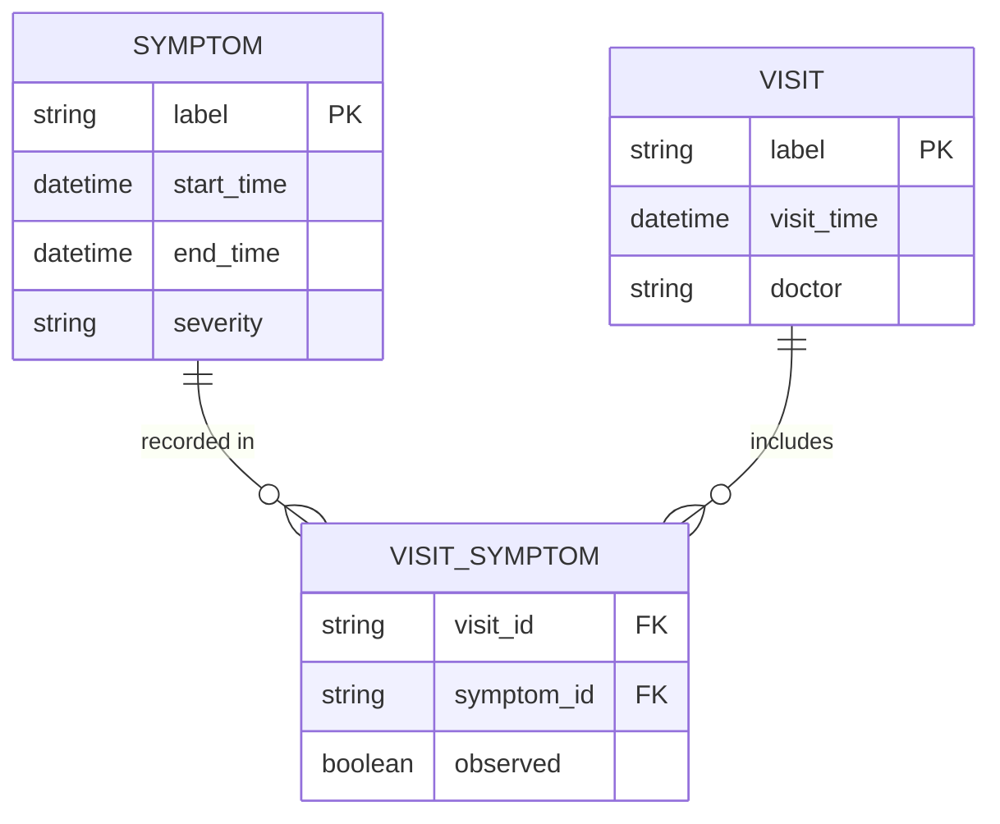
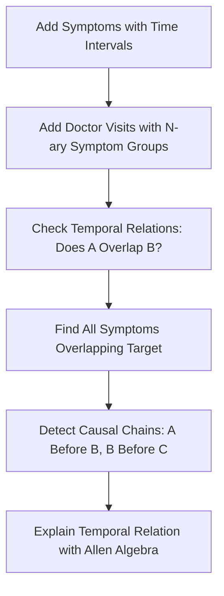

# Medical Symptom Timeline Tracker - Design Document

## Overview

A local-first medical symptom timeline tracker that demonstrates Hyper3's **temporal reasoning** capabilities using Allen interval algebra. This is a completely different use case from transitive relationships.

**Why This Domain:**
- Everyone understands medical symptoms and timelines
- Symptoms have start/end times (intervals, not points)
- Natural use of Allen interval relations (overlaps, before, during, etc.)
- Hyper3's `TemporalReasoner` is unique (competitors don't have this)
- No transitive relationships needed - pure temporal reasoning

## Competitive Advantage

| Feature | Hyper3 | XGI | HyperNetX | HyperX |
|---------|--------|-----|-----------|--------|
| Temporal interval algebra | ✅ TemporalReasoner (Allen) | ❌ | ❌ | ❌ |
| N-ary symptom groups | ✅ Native hyperedges | ✅ (no reasoning) | ✅ (no reasoning) | ✅ (cloud) |
| Interval overlap detection | ✅ 13 Allen relations | ❌ | ❌ | ⚠️ Basic time |
| Temporal provenance | ✅ ProvenanceTracker | ❌ | ❌ | ⚠️ Basic |
| Local-first (no API/cloud) | ✅ Zero deps | ✅ | ✅ | ❌ |

## Architecture



## Data Model

### Node Types



### Hypergraph Representation

1. **Symptom nodes**: `mem.store("fever", data={"start": "2024-01-10T08:00", "end": "2024-01-12T18:00", "severity": "high"})`
2. **Visit nodes**: `mem.store("visit_1", data={"doctor": "Dr. Smith", "time": "2024-01-10T10:00"})`
3. **Visit-symptom hyperedges** (n-ary): `mem.relate_hyperedge(sources={"visit_1"}, targets={"fever", "cough", "fatigue"}, label="observes")`

## Workflow



## Key Workflows

### 1. Building the Timeline

```python
tracker = MedicalTimelineTracker()

# Add symptoms with time intervals
tracker.add_symptom("fever", start="2024-01-10T08:00", end="2024-01-12T18:00",
                    severity="high")
tracker.add_symptom("cough", start="2024-01-11T10:00", end="2024-01-15T12:00",
                    severity="medium")
tracker.add_symptom("fatigue", start="2024-01-12T00:00", end="2024-01-16T08:00",
                    severity="medium")

# Add doctor visits (n-ary hyperedges connecting visits to observed symptoms)
tracker.add_visit("visit_1", ["fever", "cough"],
                    doctor="Dr. Smith", time="2024-01-10T10:00")
```

### 2. Temporal Reasoning (Allen Interval Algebra)

```python
# Check temporal relation between two symptoms
relation = tracker.check_temporal_relation("fever", "cough")
# Returns: "overlaps" (fever overlaps with cough)

# Find all symptoms overlapping with target
overlapping = tracker.find_overlapping_symptoms("fever")
# Returns: ["cough", "fatigue"] (both overlap with fever)

# Detect causal chains: A before B, B before C = A might cause C
chains = tracker.detect_causal_chains()
# Returns chains where symptom A ends before symptom B starts
```

### 3. Explain with Allen Algebra

```python
explanation = tracker.explain_temporal_relation("fever", "cough")
# Returns:
# {
#   "relation": "overlaps",
#   "allen_relation": "OVERLAPS",
#   "fever_interval": "[2024-01-10T08:00, 2024-01-12T18:00]",
#   "cough_interval": "[2024-01-11T10:00, 2024-01-15T12:00]",
#   "reason": "fever starts before cough and ends after cough starts"
# }
```

## Class Design

```python
class MedicalTimelineTracker:
    """Local-first medical symptom timeline tracker with temporal reasoning.

    Demonstrates Hyper3's unique capabilities:
    - TemporalReasoner with Allen interval algebra (13 relations)
    - N-ary hyperedges for doctor visits (visit observes multiple symptoms)
    - Temporal provenance (explain WHY two events are related temporally)
    - No transitive relationships - pure interval-based reasoning
    """

    def __init__(self):
        """Initialize tracker with HypergraphMemory and TemporalReasoner."""

    def add_symptom(self, name: str, start: str, end: str, **properties) -> str:
        """Add symptom with time interval (start, end)."""

    def add_visit(self, visit_id: str, symptoms: list[str], **properties) -> str:
        """Add doctor visit as n-ary hyperedge connecting to observed symptoms."""

    def check_temporal_relation(self, symptom_a: str, symptom_b: str) -> str:
        """Check Allen interval relation between two symptoms.
        Returns: before, after, overlaps, during, starts, finishes, etc.
        """

    def find_overlapping_symptoms(self, symptom: str) -> list[str]:
        """Find all symptoms whose intervals overlap with target symptom."""

    def detect_causal_chains(self) -> list[dict]:
        """Detect potential causal chains: A before B, B before C => A might cause C."""

    def explain_temporal_relation(self, symptom_a: str, symptom_b: str) -> dict:
        """Explain WHY two symptoms have their temporal relation.
        Uses Allen algebra terminology.
        """

    def get_symptom_info(self, symptom: str) -> Optional[dict]:
        """Get symptom metadata (interval, severity, etc.)."""
```

## File Structure

```
examples/domain/medical_timeline/
├── __init__.py
├── engine.py          # MedicalTimelineTracker class
└── demo.py            # Demonstration script with if __name__ == "__main__"
```

## Success Criteria

1. **Uses 2+ Hyper3-unique features**: TemporalReasoner (Allen algebra), n-ary hyperedges
2. **No transitive relationships**: Pure temporal reasoning, not graph traversal
3. **Practical**: Solves real problem (medical timeline analysis)
4. **Local-first**: No network calls, no API keys
5. **Explainable**: Allen algebra explains WHY relation holds
6. **Different from previous examples**: Not about substitution chains at all

## Example Output

```
=== MEDICAL SYMPTOM TIMELINE TRACKER ===

SECTION 1: Building timeline...
  Added 4 symptoms with time intervals
  Added 2 doctor visits (n-ary hyperedges)

SECTION 2: Checking temporal relations...
  fever ↔ cough: overlaps
  fever ↔ fatigue: overlaps
  cough ↔ fatigue: overlaps

SECTION 3: Finding overlapping symptoms...
  Symptoms overlapping with 'fever': ['cough', 'fatigue']

SECTION 4: Detecting causal chains...
  Potential chain: fever → cough → fatigue
  (fever ends before cough ends, cough ends before fatigue ends)

SECTION 5: Explaining temporal relation: fever ↔ cough...
  Relation: OVERLAPS
  fever:   [2024-01-10T08:00, 2024-01-12T18:00]
  cough:   [2024-01-11T10:00, 2024-01-15T12:00]
  Reason: fever starts before cough and ends after cough starts

SECTION 6: Getting symptom info...
  fever: {'start': '2024-01-10T08:00', 'end': '2024-01-12T18:00', 'severity': 'high'}

==========================================
DEMO COMPLETE
==========================================
```

## Design Decisions

1. **Allen Interval Algebra**: Uses 13 relations (before, after, overlaps, during, starts, finishes, etc.). Hyper3's `TemporalReasoner` implements this fully - competitors have nothing like it.

2. **N-ary hyperedges for visits**: A doctor visit observes MULTIPLE symptoms simultaneously. Using `relate_hyperedge()` captures this natively.

3. **No transitive reasoning**: This example deliberately avoids graph traversal/substitution chains. It's PURE temporal reasoning based on time intervals.

4. **Causal chain detection**: If A ends before B starts, and B ends before C starts, there might be a causal relationship. This is temporal, not transitive-graph.

5. **Explainable with Allen terminology**: Instead of "A is related to B", we get "A OVERLAPS B because A starts before B and ends after B starts". This is the value of Allen algebra.

## Why This Is Different from Previous Examples

| Aspect | Recipe/Job Examples | Medical Timeline Example |
|--------|---------------------|------------------------|
| **Core mechanism** | Transitive graph traversal | Allen interval algebra |
| **Relationships** | A→B→C (substitution chains) | A overlaps B, B during C (time) |
| **Hyper3 feature** | `find_substitutes()` BFS | `TemporalReasoner` Allen algebra |
| **N-ary use** | Job = {skills} | Visit = {symptoms} |
| **No transitive relations** | ❌ (uses them) | ✅ (pure temporal) |
