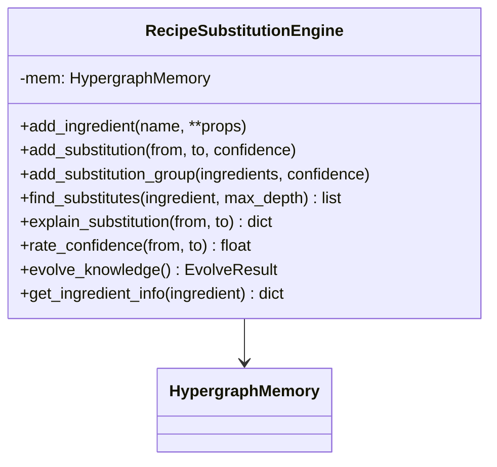
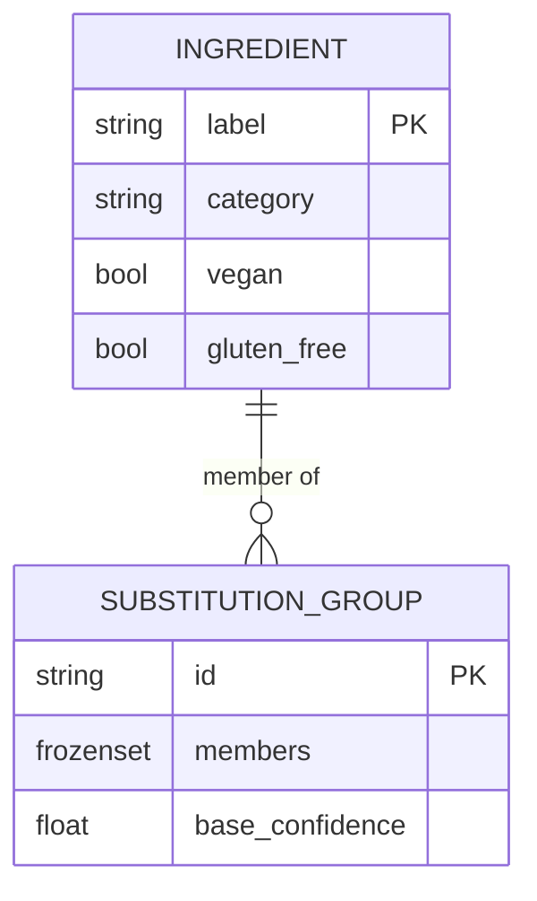
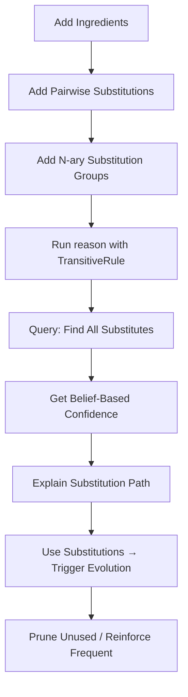

# Recipe Substitution Engine - Design Document

## Overview

A local-first ingredient substitution engine that demonstrates Hyper3's unique capabilities in a practical, relatable domain.

**Why This Domain:**
- Everyone understands ingredient substitutions
- Substitution chains are transitive by nature (A→B→C)
- Usage patterns emerge over time (frequent substitutions should be reinforced)
- Confidence in substitutions varies (butter→margarine is high, butter→applesauce is lower)

## Competitive Advantage

| Feature | Hyper3 | XGI | HyperNetX | HyperX |
|---------|--------|-----|-----------|--------|
| N-ary substitution groups | ✅ relate_hyperedge | ✅ (no reasoning) | ✅ (no reasoning) | ✅ (cloud) |
| Graph traversal for substitutes | ✅ BFS on Hypergraph | ❌ | ❌ | ⚠️ Basic paths |
| Self-evolving knowledge base | ✅ GraphMaintenanceEngine | ❌ | ❌ | ❌ |
| Explainable substitutions | ✅ Provenance tracking | ❌ | ❌ | ⚠️ Basic |
| Local-first (no API/cloud) | ✅ Zero deps | ✅ | ✅ | ❌ |

## Architecture



## Data Model

### Node Types



### Hypergraph Representation

1. **Ingredient nodes**: `mem.store("butter", data={"category": "dairy", "vegan": False})`
2. **Pairwise substitutions**: `mem.relate("butter", "margarine", label="substitutes_for", weight=0.95)`
3. **N-ary substitution groups**: `mem.relate_hyperedge(sources={"butter", "margarine", "coconut_oil"}, targets=set(), label="substitutes_group")`

## Workflow



## Key Workflows

### 1. Building the Knowledge Base

```python
engine = RecipeSubstitutionEngine()

# Add ingredients
engine.add_ingredient("butter", category="dairy", vegan=False)
engine.add_ingredient("margarine", category="dairy_substitute", vegan=True)
engine.add_ingredient("coconut_oil", category="oil", vegan=True)
engine.add_ingredient("applesauce", category="fruit", vegan=True)

# Add direct substitutions with confidence
engine.add_substitution("butter", "margarine", confidence=0.95)
engine.add_substitution("butter", "coconut_oil", confidence=0.80)
engine.add_substitution("margarine", "coconut_oil", confidence=0.85)
engine.add_substitution("coconut_oil", "applesauce", confidence=0.60)

# Or add n-ary groups directly (all members substitute for each other)
engine.add_substitution_group(["butter", "margarine", "coconut_oil"], confidence=0.85)
```

### 2. Finding Substitutes via BFS

```python
# BFS traversal finds all substitutes:
# butter → margarine (depth 1)
# butter → coconut_oil (depth 1)
# butter → applesauce (depth 2, via coconut_oil)

result = engine.find_substitutes("butter", max_depth=3)
# Returns list of dicts with label, confidence, depth, path
```

### 3. Self-Evolution

```python
# After using substitutions multiple times:
engine.evolve_knowledge()
# - Decays unused edges
# - Prunes unused ingredients
# - Reinforces frequently-used substitutions
# - Merges duplicate ingredient entries
```

### 2. Finding Transitive Substitutions

```python
# TransitiveRule discovers: butter → margarine → coconut_oil → applesauce
result = engine.find_substitutes("butter", max_depth=3)
# Returns: ["margarine", "coconut_oil", "applesauce"]
# Each with confidence scores and provenance
```

### 3. Self-Evolution

```python
# After using substitutions multiple times:
result = engine.evolve_knowledge()
# - Prunes ingredients not used recently
# - Reinforces frequently-used substitutions (increases weight)
# - Merges duplicate ingredient entries
```

## Class Design

```python
class RecipeSubstitutionEngine:
    """Local-first ingredient substitution engine.

    Demonstrates Hyper3's unique capabilities:
    - N-ary hyperedges for substitution groups
    - Graph traversal for discovering substitution chains
    - Self-evolution (prune stale, reinforce frequent)
    - Provenance tracking for explainable substitutions
    """

    def __init__(self, evolve_interval: int = 0):
        """Initialize engine with HypergraphMemory.

        Args:
            evolve_interval: Auto-evolution frequency (0=manual).
        """

    def add_ingredient(self, name: str, **properties) -> str:
        """Add ingredient with metadata (category, dietary flags, etc)."""

    def add_substitution(self, from_ingredient: str, to_ingredient: str, *,
                        confidence: float = 0.8) -> None:
        """Add pairwise substitution with confidence weight."""

    def add_substitution_group(self, ingredients: list[str], *,
                               confidence: float = 0.8) -> None:
        """Add n-ary group where all ingredients substitute for each other."""

    def find_substitutes(self, ingredient: str, *, max_depth: int = 3) -> list[dict]:
        """Find all substitutes via graph traversal."""

    def explain_substitution(self, from_ingredient: str,
                            to_ingredient: str) -> Optional[dict]:
        """Return explanation of why substitution is valid."""

    def rate_confidence(self, from_ingredient: str,
                        to_ingredient: str) -> float:
        """Get confidence score for substitution."""

    def evolve_knowledge(self) -> EvolveResult:
        """Trigger self-evolution: prune stale, reinforce frequent."""

    def get_ingredient_info(self, ingredient: str) -> Optional[dict]:
        """Get ingredient metadata."""
```

## File Structure

```
examples/domain/recipe_substitution/
├── __init__.py
├── engine.py          # RecipeSubstitutionEngine class
└── demo.py            # Demonstration script with if __name__ == "__main__"
```

## Success Criteria

1. **Uses 4+ Hyper3-unique features**: TransitiveRule, BeliefLayer, GraphMaintenanceEngine, ProvenanceTracker
2. **Practical**: Solves a real problem (dietary restrictions, missing ingredients)
3. **Local-first**: No network calls, no API keys
4. **Self-contained**: All data generated in-script
5. **Explainable**: Every substitution comes with provenance
6. **Evolves**: Knowledge base improves with usage

## Example Output

```
=== Recipe Substitution Engine Demo ===

Building knowledge base...
  Added 8 ingredients
  Added 6 pairwise substitutions
  Added 2 substitution groups

Finding substitutes for 'butter':
  margarine (confidence: 0.95, direct)
  coconut_oil (confidence: 0.85, direct)
  applesauce (confidence: 0.60, via: coconut_oil)

Explain: butter → applesauce
  Path: butter → coconut_oil → applesauce
  Rule: TransitiveRule applied at depth 2
  Confidence: 0.60 (bottleneck: coconut_oil → applesauce)

Evolving knowledge base...
  Pruned: 0 nodes, 0 edges
  Reinforced: 4 substitution edges
  Merged: 0 duplicate entries
```
