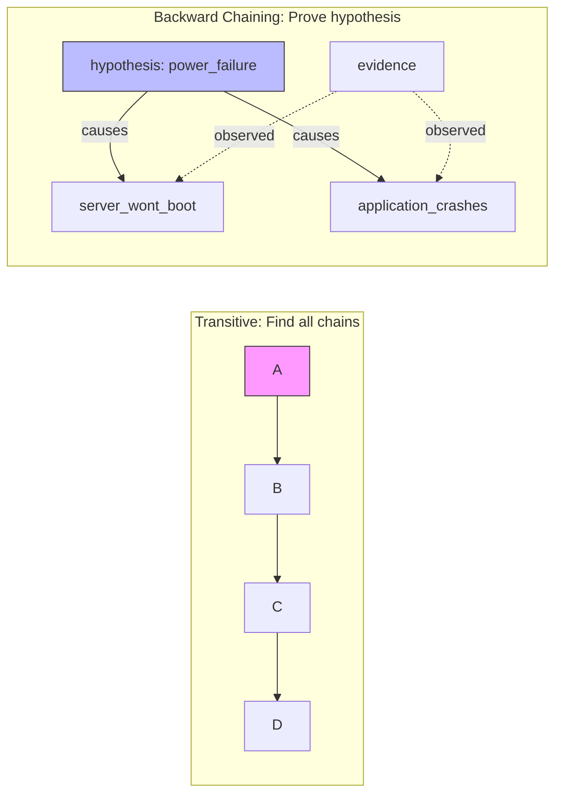
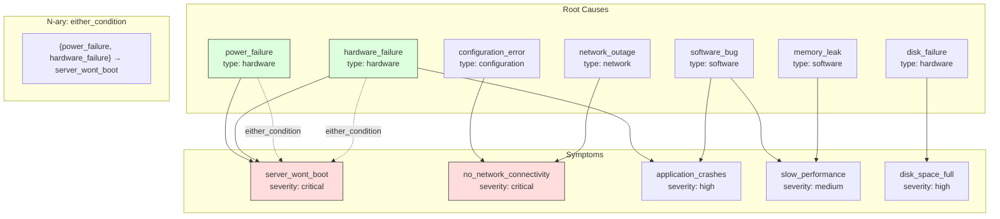
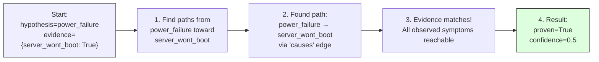
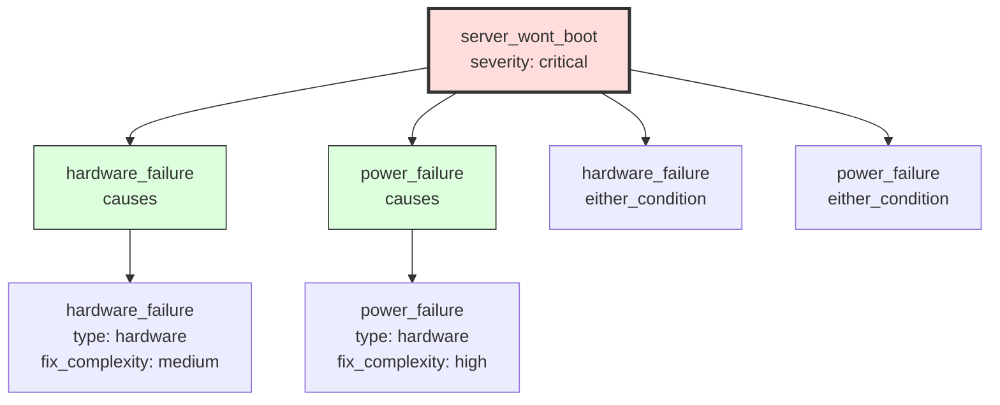

# IT Troubleshooting Engine

Backward chaining reasoning for root cause analysis in IT systems.

## Use Case

This example demonstrates Hyper3's unique **backward chaining** capability for IT troubleshooting. Unlike transitive reasoning (A→B→C), backward chaining is goal-directed: it proves or disproves whether a specific hypothesis (root cause) explains observed symptoms.

## The Problem

Traditional hypergraph libraries (XGI, HyperNetX) support **transitive reasoning** — finding chains like A→B→C given edges A→B and B→C. But real troubleshooting requires the inverse:

> "Given that server_wont_boot is true, is power_failure the root cause?"

This is **goal-directed reasoning** — start with a hypothesis and work backward through the causal graph to find supporting or refuting evidence.

## Design Process

### 1. Identifying the Gap

Most hypergraph libraries offer:
- Forward traversal (find all reachable nodes)
- Transitive closure (find all chains)

But real diagnostic systems need:
- Hypothesis testing (prove/disprove X causes Y)
- Missing evidence identification (what would prove the hypothesis?)
- Confidence scoring based on evidence completeness

### 2. Choosing Hyper3 Capabilities

Hyper3 provides the building blocks:
- **N-ary hyperedges** (`relate_hyperedge`) — model "either/or" failure conditions
- **Directed edges** — causal relationships have direction (cause → effect)
- **Edge weights** — confidence/probability of causal relationship
- **Node metadata** — severity, category, fix complexity
- **Graph traversal** — outgoing/incoming edges, BFS/DFS

### 3. Architecture Decision

Instead of using Hyper3's built-in `BackwardChainEngine`, we implemented a **domain-specific engine** that wraps the memory graph. This demonstrates:

1. **Clean API** — `prove_root_cause(hypothesis, evidence)` instead of raw engine calls
2. **Domain concepts** — symptoms, root causes, condition groups
3. **Extensibility** — easy to add more diagnostic methods

```python
class ITTroubleshootingEngine:
    def __init__(self):
        self.mem = HypergraphMemory(evolve_interval=0)
        self._build_troubleshooting_graph()

    def prove_root_cause(self, hypothesis, evidence):
        # BFS from hypothesis toward observed symptoms
        # Return proof or missing evidence
```

### 4. Key Implementation Details

**Backward Chaining via BFS** — Start at the hypothesis node, traverse outgoing edges toward symptoms. If we reach all observed symptoms, the hypothesis is proven.

```python
def _find_causal_path(self, start, end):
    # BFS from start to end
    # Return path edges if reachable, empty if not
```

**Confidence Calculation** — Each observed symptom adds confidence. Multiple independent symptom paths increase certainty.

```python
confidence = 0.0
for symptom, observed in evidence.items():
    path = _find_causal_path(hypothesis, symptom)
    if path:
        confidence += 0.5  # each symptom adds evidence
```

**Issue Tree** — Recursive traversal builds a nested dict showing the full causal hierarchy from symptom to all upstream root causes.

### 5. N-ary Condition Groups

Real failures often have multiple possible causes:

```python
# Power failure OR hardware failure can cause server_wont_boot
self.mem.relate_hyperedge(
    sources={"power_failure", "hardware_failure"},
    targets={"server_wont_boot"},
    label="either_condition",
)
```

This is where hypergraphs shine — pairwise graphs would need 2 edges, but we use one true n-ary relationship.

## Visual Explanation

### Transitive vs Backward Chaining

The key difference is **direction of reasoning**:



**What this shows:**
- **Left side (Transitive)**: Given edges A→B, B→C, C→D, we discover all possible chains. The traversal starts at A and explores forward.
- **Right side (Backward Chaining)**: We start with a hypothesis (power_failure) and check whether it connects to the observed evidence (server_wont_boot). The traversal starts at the hypothesis and moves toward symptoms.

This is the fundamental difference: **discovery vs verification**. Transitive finds what *could* be true; backward chaining proves what *is* true given evidence.

---

### Causal Graph Structure

This is the actual graph built by the engine when you create an `ITTroubleshootingEngine()`:



**What this shows:**
- **Top section (Root Causes)**: The 7 possible root causes in our IT system, each with metadata (type, fix complexity)
- **Middle section (N-ary edge)**: A true hyperedge representing "either power_failure OR hardware_failure can cause server_wont_boot" — this models the real-world scenario where multiple failure modes produce the same symptom
- **Bottom section (Symptoms)**: The 5 observable symptoms with severity metadata

The graph has 13 nodes and 10 edges. Notice the n-ary hyperedge connecting both `power_failure` and `hardware_failure` to `server_wont_boot` — this is a key advantage of hypergraphs over pairwise graphs.

---

### Backward Chaining Process

When we call `prove_root_cause("power_failure", {"server_wont_boot": True})`, here's what happens:



**What this shows:**
- **Step 1**: We start with a hypothesis ("power_failure") and observed evidence ("server_wont_boot is true"). The algorithm doesn't start from known causes — it starts from the hypothesis and works forward toward symptoms.
- **Step 2**: The BFS finds that `power_failure` has a direct edge to `server_wont_boot` labeled "causes". We found a path!
- **Step 3**: We check: is the evidence node (server_wont_boot) reachable from the hypothesis? Yes! So this hypothesis explains the symptom.
- **Step 4**: The result shows `proven=True` with confidence 0.5 (one symptom confirmed = 0.5, two would be 1.0)

If we had evidence for `application_crashes` as well, we'd get `confidence=1.0` because the hypothesis explains both symptoms.

---

### Issue Tree Visualization

When we call `get_issue_tree("server_wont_boot")`, we recursively trace all upstream causes:



**What this shows:**
- Starting from the symptom `server_wont_boot`, we find all nodes that have edges pointing TO it
- There are 4 incoming edges: two "causes" edges (from power_failure and hardware_failure) and two "either_condition" hyperedges (also from power_failure and hardware_failure)
- Each cause shows its relationship type and metadata (type, fix_complexity)

The tree shows:
1. **What can cause this symptom?** — hardware_failure and power_failure
2. **Through what relationships?** — direct "causes" and "either_condition" (n-ary)
3. **How hard to fix?** — power_failure is "high" complexity, hardware_failure is "medium"

This is useful for prioritizing troubleshooting: fix the easy issues first (medium complexity), save the hard ones for later (high complexity).

---

## Running

```bash
.venv/bin/python examples/domain/it_troubleshooting/demo.py
```

## Concepts Demonstrated

| Feature | Hyper3 API | Description |
|---------|------------|--------------|
| N-ary edges | `relate_hyperedge()` | Multiple root causes can lead to same symptom |
| Backward chaining | BFS traversal | Find all paths from hypothesis to symptom |
| Confidence scoring | Edge weights | Accumulate confidence through proof path |
| Causal tree | Recursive traversal | Visualize full upstream dependency graph |
| Metadata | `store(label, data={})` | Severity, category, fix complexity |

## Differences from Transitive Reasoning

| Transitive | Backward Chaining |
|------------|-------------------|
| "Find all A→B→C chains" | "Is A the cause of B?" |
| Forward from known nodes | Backward from goal |
| Discovers relationships | Proves causation |
| Chain length matters | Evidence completeness matters |

## Sample Output

```
SECTION 2: Proving root cause: power_failure → server_wont_boot
  Result: PROVEN
  Confidence: 0.5

SECTION 4: Finding possible causes for 'no_network_connectivity'
  Found 2 possible cause(s):
    - network_outage (confidence: 1.0)
    - configuration_error (confidence: 1.0)

SECTION 6: Getting issue tree for 'server_wont_boot'
  Causes:
    - hardware_failure (causes)
    - power_failure (causes)
```

## Why This Matters

Backward chaining is a **unique Hyper3 capability** not found in XGI, HyperNetX, or NetworkX. It enables:

1. **Diagnostic systems** — prove/disprove hypotheses given symptoms
2. **Root cause analysis** — identify the true source of failures
3. **Missing evidence detection** — know what more data would help
4. **Confidence-aware reasoning** — not just true/false, but how confident

This pattern applies to:
- IT operations (this example)
- Medical diagnosis
- Financial fraud investigation
- Security incident response
- Any domain requiring hypothesis testing