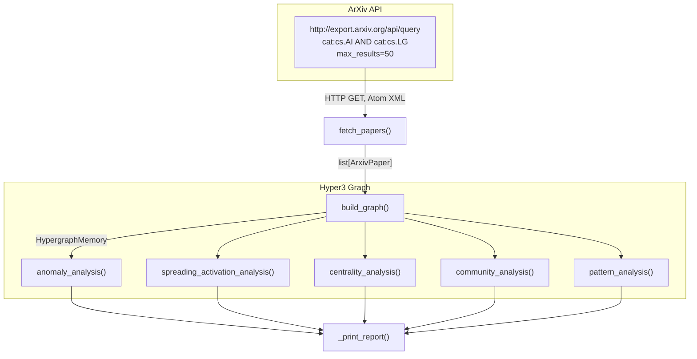

# ArXiv Research Navigator

> A Prefect-orchestrated pipeline that ingests recent ArXiv papers, builds a Hyper3 knowledge graph, and surfaces unusual papers, bridge works, research clusters, and prolific author patterns through structural analysis.

## What This Project Does

Research literature grows faster than any individual can track. Manually scanning 50 recent cs.AI + cs.LG papers for cross-cutting themes, bridge works connecting disparate areas, or unusually connected papers is impractical. This pipeline automates that process:

1. Fetches the 50 most recent ArXiv papers in cs.AI and cs.LG via the Atom API
2. Constructs a knowledge graph of papers, authors, and categories with semantic edges
3. Runs five analysis stages (anomaly detection, spreading activation, centrality, community detection, pattern matching)
4. Produces a structured report highlighting papers and authors that merit attention

Unlike the showcase examples (which use static synthetic data), this project runs against live ArXiv content. Results vary per run because the ArXiv feed updates continuously.

## Pipeline Architecture



Each analysis stage is a standalone Prefect `@task` that receives the same `HypergraphMemory` instance. The graph is built once, then queried independently by each analysis. No analysis mutates the graph.

## Data Source

The pipeline queries the [ArXiv API](https://info.arxiv.org/help/api/index.html) for papers in both `cs.AI` and `cs.LG`, sorted by submission date (descending), limited to 50 results:

```
http://export.arxiv.org/api/query?search_query=cat:cs.AI+AND+cat:cs.LG&max_results=50&sortBy=submittedDate&sortOrder=descending
```

Each paper is parsed from Atom XML into an `ArxivPaper` dataclass containing:

| Field | Source | Example |
|-------|--------|---------|
| `arxiv_id` | `<id>` (after `/abs/`) | `2505.01234v1` |
| `title` | `<title>` | "Scaling Laws for Sparse Mixture..." |
| `authors` | `<author><name>` | `["Alice Chen", "Bob Lee"]` |
| `categories` | `<arxiv:primary_category>` + `<category>` | `["cs.AI", "cs.LG"]` |
| `abstract` | `<summary>` | Full abstract text |
| `published` | `<published>` (date only) | `2025-05-04` |

The API requires no authentication. Responses are XML (Atom feed format with ArXiv-specific extensions).

## Quick Start

```bash
# Install Hyper3 and Prefect
.venv/bin/pip install -e ".[dev]"
.venv/bin/pip install prefect

# Run the pipeline directly (bypasses Prefect orchestration)
.venv/bin/python examples/projects/arxiv_navigator/pipeline.py

# Run via Prefect (enables retry, logging, state tracking)
.venv/bin/prefect run examples/projects/arxiv_navigator/pipeline.py:arxiv_research_navigator
```

### What You'll See

The pipeline prints a structured report with five sections:

```
======================================================================
ArXiv Research Navigator — Analysis Report
======================================================================

SECTION 1: Structural Anomaly Detection (Unusual Papers)
--------------------------------------------------
  [ANOMALOUS] 2505.01234v1
    Title: Scaling Laws for Sparse Mixture of Experts in Multimodal...
    Boundary score: 0.850
    Categories: cs.AI, cs.LG
    Authors: 5
    Insight: High betweenness centrality...

SECTION 2: Spreading Activation (Related Work)
--------------------------------------------------
  Seed paper: 2505.09999v1
  Title: ...
    2505.04321v1                   activation=0.8421  depth=1
    2505.01827v1                   activation=0.5130  depth=2
    ...

SECTION 3: Betweenness Centrality (Bridge Papers)
--------------------------------------------------
  2505.03333v1                   betweenness=0.042000
    Title: ...

SECTION 4: Community Detection (Research Clusters)
--------------------------------------------------
  Communities: 8
  Modularity:  0.4200
  Cluster 0: 25 nodes, 8 papers — [2505.01234v1, 2505.04567v1, ...]

SECTION 5: Pattern Matching (Prolific Authors)
--------------------------------------------------
  Alice Chen                            papers=3  coauthor_edges=4
  Bob Lee                               papers=2  coauthor_edges=2
```

Exact paper IDs, titles, author names, and numerical values depend on the current ArXiv feed at the time of the run.

## Graph Construction

The `build_graph()` task creates three node types and four edge types:

### Node types

| Kind | Created via | Why |
|------|-------------|-----|
| `paper` | `mem.store()` | Core entities with title, abstract snippet, year, categories |
| `author` | `mem.ensure()` | Idempotent creation — authors referenced by multiple papers are not reinforced |
| `category` | `mem.ensure()` | Idempotent creation — categories are shared across papers |

### Why `store()` vs `ensure()`

Papers use `store()` because each paper is unique and should be reinforced (weight increases on repeated access). Authors and categories use `ensure()` because they are shared entities that appear in multiple papers' metadata. Using `store()` for authors would cause spurious reinforcement every time a co-authored paper is processed. `ensure()` creates the node once and skips it on subsequent references.

### Edge types

| Label | Source | Target | Semantics |
|-------|--------|--------|-----------|
| `authored_by` | paper | author | Paper-author attribution |
| `published_in` | paper | category | Paper-category classification |
| `shares_author` | paper | paper | Both papers share at least one author |
| `shares_category` | paper | paper | Both papers belong to the same category |

The `shares_author` and `shares_category` edges are derived after all papers are loaded. They create explicit connections between papers that share metadata, enabling traversal-based discovery of related work. The `shares_category` edges are capped at 20 papers per category to prevent dense clusters from generating quadratic edge counts.

### Approximate graph size

With ~50 papers, ~150 unique authors, and ~10-15 categories, the graph typically contains ~200-220 nodes and ~400-600 edges (exact counts depend on author overlap and category distribution in the current feed).

## Analysis Stages

### 1. Structural Anomaly Detection

```python
det = mem.detect_structural_anomalies(
    paper.arxiv_id,
    context={"high_centrality": True, "structural_anomaly": True},
    max_level=2,
)
```

Runs `detect_structural_anomalies()` on each paper node with context flags for high centrality and structural anomaly detection at 2 levels of neighborhood expansion. Papers classified as `boundary` or `anomalous` have unusual connectivity patterns — they may bridge research areas, have unusually many co-authors, or sit at structural intersections.

Only papers with non-`normal` status are included in the report. The `boundary_score` indicates how close a paper is to the anomaly threshold (higher = more structurally unusual). Structural insights explain why the paper was flagged.

### 2. Spreading Activation (Related Work)

```python
mem.stimulate(trending.arxiv_id, energy=2.0)
activated = mem.spread_activation(iterations=3)
```

Stimulates the most recently published paper with energy 2.0 and spreads activation across 3 iterations through the graph. Papers that receive activation energy are related to the seed through shared authors, categories, or co-authorship chains. The `activation` value indicates how much energy reached each paper; `depth` indicates the hop distance.

This is useful for finding related work: given a trending paper, which other papers in the corpus are structurally close? The result set is filtered to paper nodes only (excluding authors and categories that also receive activation).

### 3. Betweenness Centrality (Bridge Papers)

```python
bc = mem.betweenness_centrality(top_k=15)
```

Computes betweenness centrality for the top 15 nodes, then filters to paper nodes. Papers with high betweenness sit on the shortest paths between many other papers — they connect otherwise separate research clusters. These "bridge papers" often represent interdisciplinary work or methodological contributions that multiple research communities cite.

The centrality values are normalized (range [0, 1]). In a graph of ~200 nodes, bridge papers typically score in the 0.01-0.05 range. Values are not directly comparable across runs because graph structure changes with the feed.

### 4. Community Detection (Research Clusters)

```python
result = mem.detect_communities(method="label_propagation", seed=42)
```

Runs label propagation community detection on the full graph. Communities that contain at least one paper node are reported with their size, paper count, and modularity contribution. Modularity measures how much more intra-community edge weight exists than expected by chance — higher values indicate clearer community structure.

The seed parameter ensures reproducible community assignments within a single run. The report shows up to 8 communities, with up to 5 representative paper IDs per community.

### 5. Pattern Matching (Prolific Authors)

```python
authored = mem.pattern_match(edge_label="authored_by")
```

Finds all `authored_by` edges and counts how many papers each author has in the corpus. The top 10 prolific authors are reported, along with the number of `shares_author` edges connected to them — this indicates how many co-authorship relationships exist between their papers and other papers in the corpus.

Authors appearing in 2+ papers in a 50-paper sample are likely active researchers in the cs.AI/cs.LG intersection. The `coauthor_edges` count reveals whether their papers form a cluster (high co-author edges) or are scattered across independent collaborations (low co-author edges).

## Prefect Integration

The pipeline uses Prefect 2.x with `@flow` and `@task` decorators:

```python
@task
def fetch_papers() -> list[ArxivPaper]:
    ...

@task
def build_graph(papers: list[ArxivPaper]) -> HypergraphMemory:
    ...

@flow(name="arxiv-research-navigator")
def arxiv_research_navigator() -> dict[str, Any]:
    papers = fetch_papers()
    mem = build_graph(papers)
    anomalies = anomaly_analysis(mem, papers)
    ...
```

### Why Prefect

Prefect provides three capabilities that a plain script lacks:

1. **Automatic retry**: Network requests to the ArXiv API can fail transiently. Prefect's default retry behavior re-executes failed tasks without restarting the entire pipeline.

2. **Structured logging**: Each `@task` logs its entry, exit, and result count through Prefect's logging infrastructure. When running via `prefect run`, logs are captured and viewable in the Prefect UI.

3. **Task-level state tracking**: If a single analysis stage fails (e.g., community detection on a degenerate graph), the other stages still complete. The flow returns partial results rather than failing entirely.

### Running without Prefect

The `main()` function at the bottom of `pipeline.py` calls `.fn()` on each task to bypass Prefect orchestration:

```python
def main() -> None:
    papers = fetch_papers.fn()
    mem = build_graph.fn(papers)
    ...
```

This runs the same logic as a plain Python script with no Prefect dependency at runtime (Prefect must still be installed for the decorators, but no Prefect server or agent is required).

### Retry behavior

The default Prefect task configuration does not include explicit retry parameters. To add retries for the ArXiv API call:

```python
@task(retries=3, retry_delay_seconds=10)
def fetch_papers() -> list[ArxivPaper]:
    ...
```

## Output Interpretation

### Section 1: Structural Anomaly Detection

| Status | Meaning |
|--------|---------|
| `BOUNDARY` | Approaching anomalous connectivity — paper has unusual but not extreme structure |
| `ANOMALOUS` | Clearly unusual connectivity — high centrality, many connections, or atypical position in the graph |

Boundary scores above 0.7 indicate papers that bridge research areas or have unusually many co-authors. These papers are worth investigating for cross-disciplinary contributions.

### Section 2: Spreading Activation

| Metric | Meaning |
|--------|---------|
| `activation` | Energy received through graph propagation. Higher = more closely related to the seed paper. |
| `depth` | Minimum hop distance from the seed. Depth 1 = direct connection (shared author or category). Depth 2-3 = indirect connection. |

Papers at depth 1 with high activation share direct metadata with the seed. Papers at depth 2-3 are related through chains of shared attributes.

### Section 3: Betweenness Centrality

Bridge papers connect research clusters. A paper with high betweenness may:
- Share authors with papers in multiple communities
- Bridge cs.AI and cs.LG through cross-category classification
- Sit on the shortest path between otherwise disconnected research groups

### Section 4: Community Detection

Communities represent clusters of papers that are more connected to each other than to the rest of the graph. Modularity above 0.3 indicates meaningful community structure. Each community typically represents a research theme (e.g., "large language model alignment" or "graph neural network architectures").

### Section 5: Pattern Matching

Prolific authors in a 50-paper sample are researchers with multiple recent papers. The `coauthor_edges` count distinguishes between:
- **Collaborative authors** (high coauthor edges): Papers co-written with the same collaborators, forming dense local clusters
- **Independent authors** (low coauthor edges): Papers written with different collaborator sets, spanning multiple research groups

## Extending This Project

### Additional data sources

- **Semantic Scholar API**: Fetch citation counts and reference lists to add `cites` edges between papers
- **DBLP**: Cross-reference author disambiguation for more accurate `authored_by` edges
- **OpenAlex**: Add institution affiliations as nodes with `affiliated_with` edges

### Additional analysis stages

- **Shortest path analysis**: Find the shortest connection path between any two papers via `mem.shortest_path()`
- **Evolving the graph**: Enable `evolve_interval=50` to let the graph decay unused edges and reinforce active paths between runs
- **Belief distributions**: Create belief distributions over paper topics using `mem.create_distribution()` for ambiguous category assignments

### Production deployment

- **Scheduled runs**: Use `prefect deploy` to run the pipeline on a schedule (e.g., daily at 08:00 UTC)
- **Persistence**: Save the graph with `mem.save()` after each run and load it with `mem.load()` before the next run to accumulate structure over time
- **Alerting**: Add a Prefect `@flow` that triggers when anomaly counts exceed a threshold

## Requirements & Running

```bash
# Core dependency
.venv/bin/pip install -e ".[dev]"

# Pipeline dependency
.venv/bin/pip install prefect

# Run (no Prefect orchestration)
.venv/bin/python examples/projects/arxiv_navigator/pipeline.py

# Run (with Prefect orchestration)
.venv/bin/prefect run examples/projects/arxiv_navigator/pipeline.py:arxiv_research_navigator
```

The pipeline uses only `urllib.request` (stdlib) for HTTP and `xml.etree.ElementTree` (stdlib) for XML parsing. No additional HTTP or XML libraries are required.

Network access is required to reach `export.arxiv.org`. The API does not require authentication. Requests typically complete in 2-5 seconds.
