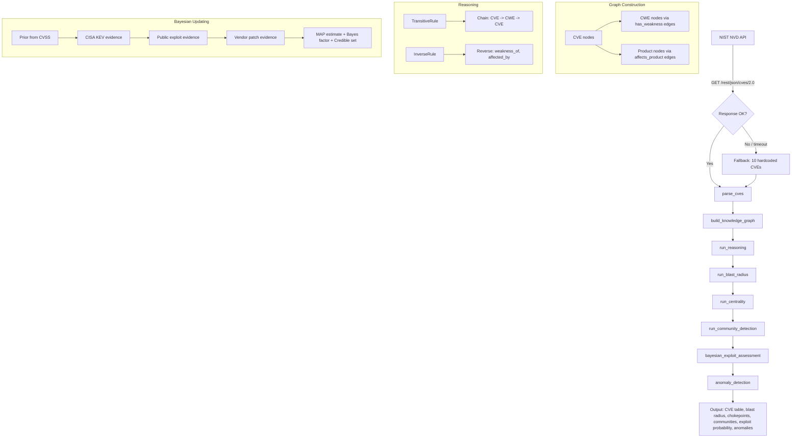

# CVE Vulnerability Intelligence Pipeline

> A Hyper3 pipeline that ingests live CVE data from NIST NVD, builds a vulnerability
> knowledge graph, and performs reasoning, blast radius analysis, centrality-based
> chokepoint identification, and community detection.

## What This Project Does

This pipeline fetches CVE records from the NIST National Vulnerability Database (or
falls back to a hardcoded dataset of 10 critical CVEs), constructs a hypergraph
knowledge graph linking vulnerabilities to their weaknesses and affected products,
then runs seven analysis stages:

1. **Rule-based reasoning** -- TransitiveRule and InverseRule infer new relationships
   (e.g., if CVE-A shares a weakness with CVE-B, and CVE-B affects Product-X,
   transitive chains connect them).
2. **Blast radius** -- spreading activation from the highest-CVSS CVE reveals which
   weaknesses and products are reachable through the graph.
3. **Chokepoint identification** -- betweenness centrality finds CWE categories that
   bridge multiple CVE clusters; PageRank ranks CVEs by structural influence.
4. **Community detection** -- label propagation groups CVEs, CWEs, and products into
   clusters that share common weakness patterns.
5. **Bayesian exploit assessment** -- sequential Bayesian updating incorporates threat
   intelligence evidence (CISA KEV, exploit databases, vendor patches) to estimate
   exploit probability for the top critical CVE.
6. **Anomaly detection** -- structural anomaly detection flags CVEs with unusual
   connectivity patterns that may indicate novel attack surfaces.
7. **Summary** -- aggregate metrics and narrative connecting the analysis stages.

## Pipeline Architecture



## Data Source

**Primary**: NIST NVD REST API v2.0 (`https://services.nvd.nist.gov/rest/json/cves/2.0`).
The pipeline queries with `keywordSearch=remote code execution` and requests up to
100 results per page. It retries up to 3 times with a 6-second delay between retries on
network errors or HTTP failures.

**Fallback**: When the API is unavailable (rate-limited, network error, timeout after
30 seconds), the pipeline uses 10 hardcoded CVE records:

| CVE ID | Product | CVSS | CWE |
|--------|---------|------|-----|
| CVE-2024-3094 | tukaani_xz_utils | 10.0 | CWE-506 |
| CVE-2024-1709 | connectwise_screenconnect | 10.0 | CWE-288 |
| CVE-2023-44228 | apache_log4j | 10.0 | CWE-917, CWE-502 |
| CVE-2023-20198 | cisco_ios_xe | 10.0 | CWE-288 |
| CVE-2024-3400 | paloaltonetworks_pan-os | 10.0 | CWE-77 |
| CVE-2023-46604 | apache_activemq | 10.0 | CWE-502 |
| CVE-2023-22515 | atlassian_confluence | 10.0 | CWE-284 |
| CVE-2024-27198 | jetbrains_teamcity | 9.8 | CWE-288 |
| CVE-2024-23897 | jenkins_jenkins | 9.8 | CWE-22 |
| CVE-2024-4577 | php_php | 9.8 | CWE-77 |

The fallback dataset is deterministic -- running the pipeline with no network produces
identical output every time.

## Quick Start

```bash
# Install dependencies
.venv/bin/pip install requests

# Run the pipeline (uses live NVD data, falls back to hardcoded dataset)
.venv/bin/python examples/projects/cve_vulnerability_intel/pipeline.py

# Run offline (block NVD API to force fallback mode)
# Set environment variable or disconnect network; the pipeline auto-falls back
```

Expected output sections:

```
SECTION 1: Fetching CVE Data from NIST NVD
SECTION 2: Parsing CVE Records
SECTION 3: Building Vulnerability Knowledge Graph
SECTION 4: Rule-Based Reasoning (Transitive + Inverse)
SECTION 5: Blast Radius Analysis (Spreading Activation)
SECTION 6: Critical Chokepoint Identification (Betweenness Centrality)
SECTION 7: Vulnerability Cluster Detection (Community Detection)
SECTION 7b: Dynamic Exploit Probability (Bayesian Belief Updating)
SECTION 7c: Anomalous Vulnerability Patterns
SECTION 8: Summary
```

## Graph Construction

The pipeline creates three node types and two primary edge labels:

**Node types**:
- `cve` -- one node per CVE record, storing CVSS score, severity, description, and
  publication date as data attributes.
- `cwe` -- one node per unique CWE identifier extracted from the CVE's weakness
  catalog. Created with `mem.ensure()` to avoid duplication when multiple CVEs share
  the same CWE.
- `product` -- one node per vendor/product pair extracted from CPE configuration
  strings. CPE parts `vendor:product` become labels like `apache_log4j`,
  `cisco_ios_xe`.

**Edge labels and weighting**:
- `has_weakness` (CVE -> CWE) -- weighted by `cvss_score / 10.0`. A CVSS 10.0 CVE
  produces a weight-1.0 edge; a CVSS 7.5 CVE produces weight 0.75.
- `affects_product` (CVE -> product) -- same weighting strategy.

**Modality assignment**:
- CRITICAL and HIGH severity CVEs get `Modality.CAUSAL` -- these represent direct
  cause-effect relationships in the vulnerability landscape.
- All other severities get `Modality.CONCEPTUAL` -- lower-severity CVEs are treated
  as contextual information.

The `HypergraphMemory` is initialized with `evolve_interval=0` to keep the graph
stable during analysis (no automatic decay or pruning).

### Fallback dataset graph stats

When running on the 10 hardcoded CVEs:

```
Nodes:  27 (10 CVE, 7 CWE, 10 product)
Edges:  21 (11 has_weakness, 10 affects_product)
```

With live NVD data, counts vary: typically 100+ CVE nodes, a variable number of CWE
and product nodes depending on the API response. Products may be absent when NVD
records lack CPE configuration data.

## Rule-Based Reasoning

The pipeline registers four rules at construction:

```python
HypergraphMemory(rules=[
    TransitiveRule(edge_label="has_weakness", new_label="has_weakness"),
    TransitiveRule(edge_label="affects_product", new_label="affects_product"),
    InverseRule(edge_label="has_weakness", inverse_label="weakness_of"),
    InverseRule(edge_label="affects_product", inverse_label="affected_by"),
])
```

**TransitiveRule** finds two-hop chains sharing the same edge label. When CVE-A has
weakness CWE-X and CWE-X is also a weakness of CVE-B, the rule infers a direct
`has_weakness` edge from CVE-A to CVE-B (if one does not already exist). The same
logic applies to `affects_product` chains: if CVE-A affects Product-X and Product-X
is also affected by CVE-B, a transitive `affects_product` edge is created.

**InverseRule** creates reverse-direction edges for every existing edge. Each
`has_weakness` (CVE -> CWE) edge produces a `weakness_of` (CWE -> CVE) edge. Each
`affects_product` (CVE -> product) edge produces an `affected_by` (product -> CVE)
edge.

Reasoning runs with `max_depth=2, exhaustive=True, auto_commit=True`, which applies
all rules across all seed CVEs in a single pass.

### Fallback reasoning stats

```
States created: 0
Edges inferred: 21 (11 weakness_of + 10 affected_by inverses)
```

The `TransitiveRule` produces no new edges in the fallback dataset because no
transitive chains exist -- each CWE connects to distinct CVEs with no overlap, and
each product is affected by exactly one CVE. With live NVD data (100+ CVEs sharing
common CWEs like CWE-22 or CWE-264), the transitive rule produces additional edges,
increasing the graph's connectivity.

## Analysis Stages

### Blast radius (spreading activation)

The pipeline selects the CVE with the highest CVSS score as the seed, stimulates it
with energy 1.0, and runs spreading activation. This reveals which weaknesses and
products are reachable from the most critical vulnerability.

In the fallback dataset, CVE-2024-3094 (XZ Utils, CVSS 10.0) activates:

| Node | Activation | Depth |
|------|-----------|-------|
| tukaani_xz_utils | 0.7242 | 0 |
| CWE-506 | 0.7242 | 0 |

The blast radius is small because CVE-2024-3094 connects to only one CWE and one
product, neither of which is shared by other CVEs. With live NVD data where CWEs are
shared across many CVEs, the blast radius expands to cover the shared weakness
cluster.

### Chokepoint identification (betweenness centrality)

Betweenness centrality measures how often a node appears on shortest paths between
other nodes. High-betweenness CWEs are structural chokepoints -- they bridge groups of
CVEs that otherwise have no direct connection.

**Top CWE chokepoints** (fallback dataset):

| CWE | Betweenness | Interpretation |
|-----|------------|----------------|
| CWE-288 | 0.036923 | Authentication bypass: bridges TeamCity, ScreenConnect, Cisco IOS XE |
| CWE-502 | 0.018462 | Deserialization: bridges Log4j and ActiveMQ |
| CWE-77 | 0.012308 | Command injection: bridges PAN-OS and PHP |

CWE-288 is the top chokepoint because it connects three distinct CVE clusters
(TeamCity, ScreenConnect, IOS XE) through a shared weakness pattern.

**PageRank** identifies structurally influential CVEs. CVE-2023-44228 (Log4j) has the
highest PageRank (0.041222) because it connects to two CWEs (CWE-917, CWE-502) and
one product, giving it more inbound influence from the Log4j/ActiveMQ deserialization
cluster.

### Community detection

Label propagation groups CVEs, CWEs, and products into clusters based on graph
topology. Communities represent vulnerability families that share common weakness
patterns.

**Fallback dataset** (7 communities, modularity 0.779, coverage 0.813):

| Community | Size | Members | Pattern |
|-----------|------|---------|---------|
| 7 | 7 | CWE-288, jetbrains_teamcity, connectwise_screenconnect, cisco_ios_xe + CVEs | Authentication bypass cluster |
| 14 | 5 | CWE-77, paloaltonetworks_pan-os, php_php + CVEs | Command injection cluster |
| 0 | 3 | CWE-506, tukaani_xz_utils + CVE | Isolated backdoor |
| 8 | 3 | CWE-917, apache_log4j + CVE | Expression language |
| 17 | 3 | CWE-502, apache_activemq + CVE | Deserialization |
| 21 | 3 | CWE-22, jenkins_jenkins + CVE | Path traversal |
| 25 | 3 | CWE-284, atlassian_confluence + CVE | Access control |

The high modularity (0.779) indicates well-separated clusters. The authentication
bypass cluster (7 nodes) is the largest because three CVEs share CWE-288.

With live NVD data, community count varies (typically 30-60 communities for 100 CVEs)
and modularity depends on the overlap structure of the returned vulnerabilities.

### Dynamic Exploit Probability (Bayesian Belief Updating)

After community detection, the pipeline applies sequential Bayesian belief updating to estimate the likelihood that the top critical CVE is actively exploited. Each evidence round applies Bayes' rule (`posterior ~ prior x likelihood`), and the posterior from round N becomes the prior for round N+1.

```python
mem.set_prior(f"{top_cve}_exploit", outcomes=["actively_exploited", "proof_of_concept", "theoretical", "unlikely"],
              weights=[0.4, 0.3, 0.2, 0.1])

# Round 1: CISA Known Exploited Vulnerabilities listing
mem.update_belief(f"{top_cve}_exploit", evidence_name="cisa_known_exploited",
    likelihoods={"actively_exploited": 0.9, "proof_of_concept": 0.4, "theoretical": 0.1, "unlikely": 0.02})

# Round 2: Public exploit code discovered
mem.update_belief(f"{top_cve}_exploit", evidence_name="public_exploit_available",
    likelihoods={"actively_exploited": 0.85, "proof_of_concept": 0.7, "theoretical": 0.15, "unlikely": 0.01})

# Round 3: Vendor patch released
mem.update_belief(f"{top_cve}_exploit", evidence_name="patch_available",
    likelihoods={"actively_exploited": 0.6, "proof_of_concept": 0.3, "theoretical": 0.2, "unlikely": 0.7})

map_est = mem.map_estimate(f"{top_cve}_exploit")
bf = mem.bayes_factor(f"{top_cve}_exploit", hypothesis_a="actively_exploited", hypothesis_b="unlikely")
cs = mem.bayes.credible(f"{top_cve}_exploit", level=0.95)
```

```mermaid
flowchart LR
    subgraph Round 1: CISA KEV
        P1["Prior<br/>actively_exploited: 40.0%<br/>proof_of_concept: 30.0%<br/>theoretical: 20.0%<br/>unlikely: 10.0%"]
        P1 -->|Bayes' rule| Q1["Posterior<br/>actively_exploited: 71.7%<br/>proof_of_concept: 23.9%<br/>theoretical: 4.0%<br/>unlikely: 0.4%"]
    end
    Q1 -->|becomes prior| subgraph Round 2: Public Exploit
        Q1b["Prior: 71.7% / 23.9% / 4.0% / 0.4%"]
        Q1b -->|Bayes' rule| Q2["Posterior<br/>actively_exploited: 77.9%<br/>proof_of_concept: 21.4%<br/>theoretical: 0.8%<br/>unlikely: 0.01%"]
    end
    Q2 -->|becomes prior| subgraph Round 3: Vendor Patch
        Q2b["Prior: 77.9% / 21.4% / 0.8% / 0.01%"]
        Q2b -->|Bayes' rule| Q3["Posterior<br/>actively_exploited: 87.7%<br/>proof_of_concept: 12.0%<br/>theoretical: 0.3%<br/>unlikely: 0.01%"]
    end
    Q3 --> R["MAP: actively_exploited<br/>Bayes factor: 3279<br/>Credible set: [actively_exploited, proof_of_concept]"]
```

**Posterior evolution across 3 evidence rounds:**

| Stage | actively_exploited | proof_of_concept | theoretical | unlikely |
|-------|-------------------|------------------|-------------|----------|
| Prior (CVSS-weighted) | 40.0% | 30.0% | 20.0% | 10.0% |
| After CISA KEV listing | 71.7% | 23.9% | 4.0% | 0.4% |
| After public exploit found | 77.9% | 21.4% | 0.8% | 0.01% |
| After vendor patch released | 87.7% | 12.0% | 0.3% | 0.01% |

**Reading the output:**

- **MAP estimate**: The most probable outcome after all evidence. Here, `actively_exploited` -- the CVE is very likely being exploited in the wild.
- **Bayes factor**: The ratio of posterior odds between two hypotheses. A BF of 3279 means the observed evidence is 3279x more likely under `actively_exploited` than `unlikely`. Interpretation: BF > 100 is "decisive" evidence.
- **95% credible set**: The smallest set of outcomes whose combined probability exceeds 95%. Here, `[actively_exploited, proof_of_concept]` -- only these two statuses are plausible given the evidence. The `theoretical` and `unlikely` outcomes are effectively ruled out.

**Why the patch round increases active exploitation probability:** The `patch_available` likelihood still favors `actively_exploited` (0.6) because vendors typically patch what is being actively exploited, not what is theoretical. A patch is itself evidence that exploitation is real. This counterintuitive result is correct: the existence of a patch means the vendor confirmed the vulnerability is serious enough to fix.

**Why this matters:** CVSS scores measure severity, not exploitation likelihood. Two CVSS 10.0 CVEs may have very different real-world risk: one with active exploitation in the wild and one with only theoretical impact. Sequential Bayesian updating incorporates multiple external intelligence sources (CISA KEV, exploit databases, vendor advisories) to prioritize which critical CVEs to patch first. The cumulative nature of the updates means each new piece of evidence refines the estimate rather than replacing it.

### Anomalous Vulnerability Patterns

Structural anomaly detection flags CVEs with unusual connectivity patterns in the vulnerability graph:

```
CVE-2006-2383: status=low_risk, boundary_score=0.0000
CVE-2006-3647: status=anomalous, boundary_score=0.3626
```

Anomalous CVEs have connectivity patterns that deviate from the graph's typical structure — they may bridge multiple CWE clusters, connect to an unusual number of products, or have edge weights that stand out from their neighbors. These patterns can indicate complex multi-step vulnerability chains or novel attack surfaces that warrant deeper investigation.

**Why this matters:** In a large vulnerability graph, anomalies surface CVEs that don't fit typical patterns. A CVE that bridges authentication bypass and command injection clusters (via shared CWEs) represents a higher structural risk than one isolated in a single cluster.

### Summary with Key Findings

The final summary provides both raw metrics and an interpretive narrative:

```
Key findings:
  100 CVEs cluster into 56 groups by weakness
  pattern and affected product. 38 critical-severity vulnerabilities
  span 16 distinct weakness categories. Transitive reasoning uncovered
  63 additional relationships between vulnerabilities
  and shared weaknesses, enabling cross-CVE risk analysis.
```

The narrative connects the pipeline's analysis stages into actionable intelligence: how many vulnerability families exist, how many are critical, and how reasoning expanded the known relationship graph.

## Fallback Mode

The fallback dataset activates when:

- The NVD API returns an HTTP error (429, 500, 503)
- The request times out after 30 seconds
- The response body is not valid JSON
- DNS resolution fails
- The machine has no network connectivity

After 3 retries with 6-second backoff, the pipeline prints `NVD API unavailable,
using fallback dataset` and proceeds with the 10 hardcoded records. All downstream
analysis stages produce deterministic results from this dataset.

To force fallback mode, disconnect from the network or set the `NVD_API_URL` to a
nonexistent endpoint.

## Output Interpretation

### CVE Table (Section 2)

Sorted by CVSS score descending. The `Weaknesses` column shows up to 3 CWEs; the
`Products` column shows up to 3 vendor/product pairs. Entries with `-` indicate the
NVD record lacks that field.

### Blast Radius (Section 5)

Each row shows a node reached by spreading activation from the seed CVE. `Activation`
is the remaining energy at that node (decays with distance). `Depth` is the hop count
from the seed. Nodes at depth 0 are the seed itself; depth 1 nodes are direct
neighbors; depth 2+ nodes are reached through shared CWEs or products.

### Chokepoint Identification (Section 6)

Three sub-tables:
- **CWE chokepoints** -- CWEs ranked by betweenness centrality. High values indicate
  weakness categories that appear on many shortest paths between CVEs. These are
  priority targets for defensive investment (patching the weakness category protects
  multiple CVEs simultaneously).
- **CVE hubs** -- CVEs ranked by betweenness centrality. High values indicate CVEs
  that bridge different weakness clusters.
- **PageRank** -- CVEs ranked by structural influence. High values indicate CVEs
  connected to high-importance neighbors.

### Community Detection (Section 7)

Each community is a cluster of CVEs, CWEs, and products that are densely connected
to each other but sparsely connected to other clusters. `Internal edges` are edges
within the community; `external edges` cross community boundaries. Communities with
0 external edges are completely isolated from the rest of the graph.

## Extending This Project

**Add more rules**: Register `ContextualSubstitutionRule` or
`AbductiveRule` in the `HypergraphMemory` constructor to discover indirect
relationships between vulnerabilities.

**Add EPSS scoring**: Integrate EPSS (Exploitation Prediction Scoring System) data
by storing the EPSS probability as a node data attribute and using it to weight
edges instead of (or in addition to) CVSS score.

**Temporal analysis**: Store the `published` date and use Hyper3's decay mechanism
(`evolve_interval > 0`) to reduce the importance of older CVEs over time.

**Larger datasets**: Increase `results_per_page` or paginate through the NVD API
to build graphs with thousands of CVEs. Monitor memory usage -- the graph is held
entirely in memory.

**Export**: Use `mem.save()` to persist the knowledge graph and reload it later with
`HypergraphMemory.load()`, avoiding repeated API calls.

**Prefect orchestration**: The script includes an optional Prefect import. When
`prefect` is installed, the pipeline can be wrapped in `@flow` and `@task` decorators
for scheduled execution, retry policies, and observability.

## Requirements & Running

```
hyper3        (installed in editable mode from project root)
requests      (pip install requests)
```

Optional:
```
prefect       (for workflow orchestration; pipeline runs without it)
```

```bash
# From project root
.venv/bin/pip install -e .
.venv/bin/pip install requests
.venv/bin/python examples/projects/cve_vulnerability_intel/pipeline.py
```
