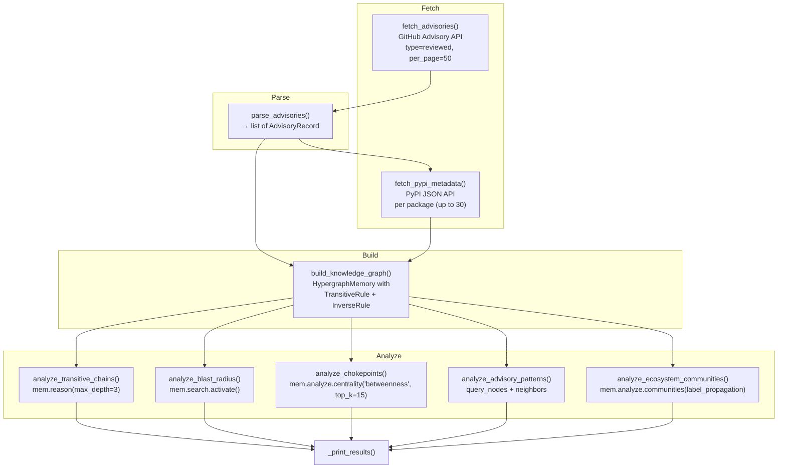

# Software Dependency Security Scanner

> Ingesting live GitHub Advisory Database and PyPI metadata into a Hyper3 knowledge graph to trace vulnerability blast radii, dependency chokepoints, and ecosystem-level risk clusters

## What This Project Does

This pipeline fetches reviewed security advisories from the GitHub Advisory Database API, enriches affected packages with metadata from PyPI, and builds a Hyper3 knowledge graph connecting advisories, packages, CVE identifiers, fixed versions, and transitive dependencies. It then applies rule-based inference, spreading activation, centrality analysis, pattern matching, and community detection to surface:

- Which critical advisories reach the most packages (blast radius)
- Which packages sit on the most dependency paths (chokepoints)
- Which packages accumulate the most advisories (pattern density)
- How the ecosystem clusters by vulnerability type (communities)
- What transitive dependency chains reasoning discovers

Output varies with each run because the GitHub Advisory Database is a live, continually updated source.

## Pipeline Architecture



Each analysis stage operates on the same `HypergraphMemory` instance. The graph is the single representation; each stage queries it through a different lens.

## Data Sources

### GitHub Advisory Database

- **Endpoint**: `https://api.github.com/advisories?type=reviewed&per_page=50`
- **Authentication**: Unauthenticated requests (60 req/hr rate limit)
- **Rate limit handling**: On HTTP 403, the pipeline sleeps 60 seconds and retries once
- **Fields extracted**: `ghsa_id`, `cve_id`, `summary`, `severity`, `vulnerabilities[].package.name`, `vulnerabilities[].package.ecosystem`, `vulnerabilities[].first_patched_version.identifier`
- **Filtering**: Only advisories with a non-empty `ghsa_id` and at least one vulnerability are retained

### PyPI JSON API

- **Endpoint**: `https://pypi.org/pypi/{package}/json`
- **Throttle**: 250ms sleep between requests
- **Scope**: Only PyPI/PIP ecosystem packages are enriched (up to 30 per run)
- **Fields extracted**: `info.version`, `info.requires_dist`
- **Fallback**: Packages not found on PyPI are stored with `version="unknown"` and no dependency edges

## Quick Start

```bash
# Install dependencies
pip install prefect requests hyper3

# Run without Prefect orchestration (direct function calls)
.venv/bin/python examples/projects/dependency_scanner/pipeline.py

# Run with Prefect orchestration (retries, observability)
.venv/bin/python -c "from examples.projects.dependency_scanner.pipeline import dependency_security_scanner; dependency_security_scanner()"
```

### What You Will See

The pipeline prints a structured report:

```
======================================================================
DEPENDENCY SECURITY SCANNER — RESULTS
======================================================================

────────────────────────────────────────────────────────────────────────
  Advisories processed: 42
    CRITICAL: 5
    HIGH: 18
    MODERATE: 15
    LOW: 4

────────────────────────────────────────────────────────────────────────
  BLAST RADIUS (critical advisories)
────────────────────────────────────────────────────────────────────────
  GHSA-xxxx-xxxx-xxxx:
    Reaches 12 packages: pkg_a, pkg_b, pkg_c, ...
  GHSA-yyyy-yyyy-yyyy:
    Reaches 8 packages: pkg_d, pkg_e, ...

────────────────────────────────────────────────────────────────────────
  DEPENDENCY CHOKEPOINTS (betweenness centrality)
────────────────────────────────────────────────────────────────────────
    some_package                             0.2341
    another_package                          0.1829
    ...

────────────────────────────────────────────────────────────────────────
  PACKAGES WITH MOST ADVISORIES
────────────────────────────────────────────────────────────────────────
    some_package                             5 advisories
    another_package                          3 advisories

────────────────────────────────────────────────────────────────────────
  ECOSYSTEM COMMUNITIES (vulnerability clusters)
────────────────────────────────────────────────────────────────────────
  Community 1 (size=14):
    Ecosystems: pip=10, npm=4
    Node types: package=8, advisory=4, dependency=2
    Members: pkg_a, pkg_b, GHSA-xxxx, ...

────────────────────────────────────────────────────────────────────────
  TRANSITIVE INFERENCES
────────────────────────────────────────────────────────────────────────
    Total inferred edges: 7
```

## Graph Construction

### Node types

| Type | Label pattern | Data fields | Created by |
|------|--------------|-------------|------------|
| Advisory | `GHSA-xxxx-xxxx-xxxx` | `type`, `cve_id`, `severity`, `summary`, `patched_versions` | `mem.add()` |
| CVE | `CVE-YYYY-NNNNN` | `type` | `mem.add()` |
| Package | package name (e.g., `requests`) | `type`, `version`, `ecosystem` | `mem.add()` |
| Fixed version | `package==1.2.3` | `type`, `package`, `version` | `mem.add()` |
| Dependency | normalized dep name | `type`, `extras`, `ecosystem` | `mem.ensure()` |

Dependencies extracted from PyPI `requires_dist` are normalized (lowercased, hyphens to underscores) and created with `mem.ensure()` to avoid duplicate nodes when the same dependency appears across multiple packages. `mem.add()` is used for all other node types, which reinforces the node and triggers evolution if configured.

### Edge types

| Label | Direction | Weight | Meaning |
|-------|-----------|--------|---------|
| `affects` | advisory → package | severity-mapped (CRITICAL=10.0, HIGH=7.0, MODERATE=4.0, LOW=1.0) | Advisory affects this package |
| `depends_on` | package → dependency | 1.0 (default) | Package depends on this dependency |
| `identified_as` | CVE → advisory | 1.0 (default) | CVE identifier maps to this advisory |
| `fixes` | advisory → fixed_version | 1.0 (default) | Advisory is resolved by this version |

Severity-weighted edges on `affects` ensure that centrality and activation algorithms prioritize critical vulnerabilities over low-severity ones.

### CVE cross-references

When an advisory has a `cve_id`, the pipeline creates a CVE node and links it to the advisory with an `identified_as` edge. This allows traversals to find all advisories associated with a given CVE.

## Reasoning

The knowledge graph is initialized with two inference rules:

```python
HypergraphMemory(
    evolve_interval=0,
    rules=[
        TransitiveRule(edge_label="depends_on", new_label="depends_on"),
        InverseRule(edge_label="affects", inverse_label="affected_by"),
    ],
)
```

**TransitiveRule on `depends_on`**: Discovers multi-hop dependency chains. If `requests` depends on `urllib3` and `urllib3` depends on `certifi`, the rule infers a `depends_on` edge from `requests` to `certifi`. This reveals transitive exposure: an advisory affecting `certifi` also affects everything that transitively depends on it.

**InverseRule on `affects`**: Creates reverse `affected_by` edges. If advisory GHSA-xxx affects `requests`, the rule infers that `requests` is affected_by GHSA-xxx. This enables forward traversal from packages to find all their advisories.

Reasoning runs with `max_depth=3` and `exhaustive=True`, exploring all possible rule applications across the graph.

## Analysis Stages

### Blast Radius

For each of the top 5 critical (HIGH or CRITICAL) advisories, the pipeline:

1. Calls `mem.search.activate()` on the advisory node with energy 1.0
2. Collects up to 20 reachable node labels from the activation result
3. Clears activations before the next advisory

The blast radius reveals how far a vulnerability's influence extends through the dependency graph. An advisory that reaches 15 packages is more dangerous than one that reaches 2, even if both are CRITICAL severity.

### Dependency Chokepoints

Computes `mem.analyze.centrality("betweenness", top_k=15)` on the full graph. Packages with high betweenness sit on many shortest paths between other nodes. A vulnerability in a high-betweenness package fragments the dependency network more than one in a peripheral package.

Only nodes with betweenness > 0 are reported, filtering out leaf nodes that no paths pass through.

### Advisory Patterns

Uses `query_nodes(type="advisory")` to get all advisory nodes, then for each package queries its incoming `affects` neighbors to count how many advisories target it. Results are ranked with `top_k(k=10)`.

Packages with the most advisories may indicate poor security hygiene, complex attack surfaces, or popularity making them frequent targets.

### Ecosystem Communities

Runs `mem.analyze.communities(method="label_propagation", seed=42)` on the graph. Each community is summarized by:

- Size (number of member nodes)
- Ecosystem breakdown (count of nodes per ecosystem: pip, npm, etc.)
- Node type breakdown (advisory, package, dependency, etc.)
- Up to 10 sample member labels

Communities are sorted by size (largest first). Communities that mix multiple ecosystems indicate cross-ecosystem vulnerability clusters where a shared dependency pattern exposes packages in different languages.

## Prefect Integration

The pipeline uses Prefect 2.x for orchestration. Each pipeline stage is a `@task`-decorated function:

| Task | Retries | Retry delay | Purpose |
|------|---------|-------------|---------|
| `fetch_advisories` | 3 | 5s | GitHub API with rate-limit recovery |
| `fetch_pypi_metadata` | 2 | 3s | Per-package PyPI lookup |
| `parse_advisories` | 0 | — | Pure data transformation |
| `build_knowledge_graph` | 0 | — | Graph construction |
| `analyze_*` | 0 | — | Graph analysis stages |

The `@flow`-decorated `dependency_security_scanner()` wires tasks together. Running via Prefect provides:

- Automatic retry on transient API failures
- Structured logging through Prefect's log handler
- Observability via Prefect UI (if a Prefect server is running)

For environments without a Prefect server, the `main()` function calls task functions directly via `.fn()`, bypassing Prefect orchestration entirely.

### Rate limiting strategy

GitHub's unauthenticated API returns 403 when the hourly rate limit is exceeded. The `fetch_advisories` task handles this by sleeping 60 seconds and retrying once before raising. Combined with Prefect's 3 retries at 5-second intervals, this gives up to 4 total attempts. PyPI requests are throttled to 4/second (250ms sleep) to stay well within PyPI's rate limits.

## Output Interpretation

### Severity breakdown

| Severity | Typical weight | Edge impact |
|----------|---------------|-------------|
| CRITICAL | 10.0 | Highest centrality contribution; preferentially activated |
| HIGH | 7.0 | Strong centrality contribution |
| MODERATE | 4.0 | Moderate contribution |
| LOW | 1.0 | Same as default weight |

### Blast radius

The blast radius for an advisory is the set of nodes reachable via `mem.search.activate()`, capped at 20 nodes. Higher counts indicate broader vulnerability propagation through the dependency graph.

### Betweenness centrality

Normalized betweenness centrality measures what fraction of all shortest paths pass through a node. Values range from 0 to 1. A value of 0.23 means roughly 23% of shortest paths route through that package.

| Range | Interpretation |
|-------|---------------|
| 0.15+ | Major bottleneck — many dependency paths depend on it |
| 0.05–0.15 | Moderate chokepoint — significant routing role |
| Below 0.05 | Peripheral — few paths pass through |

### Transitive inferences

The "Total inferred edges" count reflects edges added by `TransitiveRule` and `InverseRule` during `mem.reason()`. These edges represent dependency chains and reverse-affected-by relationships that were not in the original data. Higher counts indicate deeper dependency trees in the scanned packages.

## Extending This Project

### Additional data sources

- **OSV (Open Source Vulnerabilities)**: `https://api.osv.dev/v1/query` — aggregates advisories from multiple databases including GitHub, PyPA, and npm
- **npm audit API**: For JavaScript ecosystem packages
- **Cargo audit**: For Rust crate dependencies
- **Maven Central**: For Java dependency trees

### Deeper dependency resolution

The current pipeline parses `requires_dist` from PyPI metadata, which lists direct dependencies. Transitive dependencies of dependencies are not fetched. A production scanner would resolve the full dependency tree by recursively querying PyPI for each discovered dependency.

### Continuous scanning

Wrap the pipeline in a Prefect deployment with a schedule:

```python
from prefect.deployments import Deployment

deployment = Deployment.build_from_flow(
    flow=dependency_security_scanner,
    name="daily-scan",
    parameters={"per_page": 100},
    schedule={"cron": "0 6 * * *"},
)
deployment.apply()
```

### Alerting

Add a post-analysis step that compares blast radii against a threshold and sends notifications for new CRITICAL advisories affecting high-betweenness packages.

### Version-aware edges

Store version constraints as edge data and use them to determine whether a specific installed version is affected, rather than treating each package as a single node.

## Requirements and Running

### Dependencies

```
pip install prefect requests hyper3
```

- `prefect` — task orchestration, retries, logging
- `requests` — HTTP client for GitHub and PyPI APIs
- `hyper3` — knowledge graph, reasoning, analysis

### Running

```bash
# Direct execution (no Prefect server needed)
.venv/bin/python examples/projects/dependency_scanner/pipeline.py

# With Prefect orchestration
.venv/bin/python -c "from examples.projects.dependency_scanner.pipeline import dependency_security_scanner; dependency_security_scanner()"

# Custom advisory count
.venv/bin/python -c "from examples.projects.dependency_scanner.pipeline import main; main(per_page=100)"
```

### Environment

- Python 3.11+
- Network access to `api.github.com` and `pypi.org`
- No authentication tokens required (unauthenticated GitHub API access)
- No Prefect server required (falls back to direct function calls)
