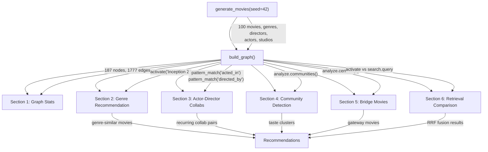

# Movie Recommendation via Knowledge Graph Analysis

> A fully offline, deterministic pipeline that builds a synthetic movie knowledge graph (100 movies, 25 directors, 40 actors, 10 studios, 12 genres) and compares five graph-based recommendation strategies: genre activation, structural pattern matching, community detection, betweenness centrality, and RRF retrieval fusion.

## What This Project Does

This pipeline generates a synthetic movie dataset using a seeded RNG, loads it into a Hyper3 knowledge graph, and runs six analysis sections that each demonstrate a different recommendation strategy. The entire pipeline runs offline with no external data sources, no network calls, and deterministic output (seed=42).

The pipeline compares five approaches to answering "if you liked this movie, what should you watch next?" and measures where they agree and diverge. The comparison shows that retrieval fusion (activation + similarity via reciprocal rank fusion) surfaces movies that pure activation misses.

## Pipeline Architecture



## Dataset

The dataset is generated inline by `generate_movies(seed=42)` using Python's `random.Random` with a fixed seed. It produces:

| Entity Type | Count | Data Fields |
|-------------|-------|-------------|
| Movies | 100 | title, year, rating, genres (2 each) |
| Directors | 25 | name |
| Actors | 40 | name (3-6 per movie) |
| Studios | 10 | name |
| Genres | 12 | name |

**Why synthetic**: This project is the only example in the repository that runs fully offline with deterministic output. Every run with seed=42 produces identical results. This makes it suitable for reproducibility testing, CI validation, and offline demos.

**Genre distribution** (each movie has exactly 2 genres):

| Genre | Count | Genre | Count |
|-------|-------|-------|-------|
| Drama | 37 | Mystery | 19 |
| Thriller | 25 | Adventure | 15 |
| Action | 20 | Horror | 10 |
| Sci-Fi | 20 | Romance | 15 |
| Fantasy | 12 | Comedy | 13 |
| Animation | 6 | Documentary | 4 |

**Top-5 rated movies**:

| Movie | Rating | Year | Genres |
|-------|--------|------|--------|
| Inception 2 | 8.6 | 2024 | Sci-Fi, Action |
| The Painter's Daughter | 8.4 | 2018 | Drama, Romance |
| Still Waters | 8.3 | 2017 | Drama, Thriller |
| Echoes of Nowhere | 8.2 | 2019 | Drama, Mystery |
| Starfall | 8.2 | 2022 | Sci-Fi, Adventure |

## Quick Start

```bash
.venv/bin/python examples/projects/movie_recommendations/pipeline.py
```

Expected output:

```
Generated 100 movies
Directors: 25  Actors: 40  Studios: 10
======================================================================
SECTION 1: KNOWLEDGE GRAPH CONSTRUCTION
======================================================================
Nodes:  187
Edges:  1777
...
======================================================================
PIPELINE COMPLETE
======================================================================
```

## Graph Construction

The graph is built by `build_graph()` which creates five entity types and five edge types:

**Entity types** (stored as node `data.type`):

| Type | Created via | Count |
|------|------------|-------|
| `genre` | `ensure()` | 12 |
| `director` | `ensure()` | 25 |
| `actor` | `ensure()` | 40 |
| `studio` | `ensure()` | 10 |
| `movie` | `add()` | 100 |

`ensure()` is used for entities that are referenced by many movies (genres, directors, actors, studios) to avoid spurious reinforcement. `add()` is used for movies since they are the primary nodes of interest.

**Edge types**:

| Label | Direction | Weight | Purpose |
|-------|-----------|--------|---------|
| `has_genre` | movie -> genre | rating/10.0 | Genre membership weighted by movie quality |
| `directed_by` | movie -> director | 1.0 | Director attribution |
| `acted_in` | actor -> movie | 1.0 | Cast membership |
| `produced_by` | movie -> studio | 1.0 | Studio attribution |
| `similar_taste` | movie <-> movie | shared actor count | Movies sharing cast members |

**Weight strategy**: `has_genre` edges use `weight = rating / 10.0` so higher-rated movies propagate stronger activation through their genres. `similar_taste` edges use `weight = len(shared_actors)` so movies with more overlapping cast members are more strongly connected. Both directions of `similar_taste` edges receive the same weight via `bidirectional=True`.

```python
mem.link(m.title, genre, label="has_genre", weight=m.rating / 10.0)
mem.link(a_title, b_title, label="similar_taste",
         weight=float(len(shared)), bidirectional=True)
```

## Recommendation Strategies

### Genre-Based (Activation from Seed Movie)

Starting from a seed movie, spreading activation propagates energy through `has_genre` edges to genre nodes and then to other movies sharing those genres. Higher-rated movies transmit stronger signals because their `has_genre` edges have higher weights.

```python
activated = mem.activate("Inception 2", energy=1.0, top_k=30, iterations=3)
movie_results = [a for a in activated if a.label in movie_labels and a.label != seed_movie]
```

**Results** (top-3 genre-similar movies):

| Movie | Activation | Depth | Rating |
|-------|-----------|-------|--------|
| Ember Rising | 1.0000 | 2 | 7.5 |
| Turning Point | 0.7700 | 3 | 7.6 |
| The Silver Lining | 0.4400 | 2 | 7.5 |

Ember Rising gets activation 1.0 because it shares the `Action` genre with Inception 2 and its `has_genre` edge carries strong weight from its 7.5 rating.

### Collaborative (Pattern Matching for Actor-Director Pairs)

Structural pattern matching finds actor-director pairs who have collaborated on 2 or more shared movies. This identifies creative partnerships that transcend genre boundaries.

```python
acted_edges = mem.pattern_match(edge_label="acted_in")
directed_edges = mem.pattern_match(edge_label="directed_by")
# Compute intersection of actor movies and director movies
```

**Results**: 5 actor-director collaboration pairs with 2+ shared movies. These pairs represent recurring creative partnerships. A user who liked one movie from a pair may enjoy others, regardless of genre overlap.

### Community-Based (Taste Clusters)

Community detection identifies taste clusters -- groups of movies that are densely connected to each other through shared actors, genres, and `similar_taste` edges.

```python
result = mem.analyze.communities(seed=42)
```

**Results**: 1 community found with modularity 0.0 and coverage 1.0. The graph is too densely connected for label propagation to split into multiple communities. With 100 movies, 40 actors (each appearing in 3-6 movies), and genre co-membership, the graph forms a single connected component. This is a structural property of the synthetic dataset: with 40 actors and an average of 4.5 actors per movie, the actor-to-movie bipartite projection creates enough `similar_taste` edges to connect the entire graph.

### Bridge-Based (Betweenness Centrality for Gateway Movies)

Betweenness centrality identifies movies that sit on the most shortest paths between other nodes. These "bridge movies" connect disparate parts of the graph and serve as gateway recommendations -- watching them can lead users to new genres or directors.

```python
bc = mem.analyze.centrality("betweenness", top_k=10)
```

**Results** (top-3 bridge nodes):

| Node | Type | Betweenness |
|------|------|-------------|
| The Morning After | movie | 0.041700 |
| Chasing the Sun | movie | 0.033000 |
| Glass Houses | movie | 0.031300 |

The Morning After sits on the most shortest paths because its Comedy + Romance genre combination and cast overlaps connect it to both the drama-heavy and action-heavy portions of the graph. Bridge movies are useful recommendations for users whose taste spans multiple genres.

### Retrieval-Based (RRF Fusion vs Pure Activation)

This section compares two retrieval approaches:

1. **Pure activation**: `mem.search.activate()` propagates energy from the seed movie.
2. **RRF retrieval**: `mem.search.query()` fuses activation scores with structural similarity using reciprocal rank fusion.

```python
activation_results = mem.search.activate(seed_movie, energy=1.0, iterations=4)

retrieval_results = mem.search.query(seed_movie, top_k=15, iterations=4)
```

**Results** (seed: The Last Meridian, comparing top-10 lists):

| Metric | Value |
|--------|-------|
| Overlap between approaches | 6 movies |
| Unique to RRF retrieval | 4 movies |

**Movies only found by RRF retrieval**: Beyond the Veil, Frostfire, Laughing at Gravity, Tidal Force.

These four movies are structurally similar to The Last Meridian but not reachable via activation within 4 iterations. RRF retrieval combines activation (which follows edge-connected paths) with structural similarity (which compares neighborhood overlap), catching movies that share a structural profile even when the activation energy hasn't propagated to them.

## Comparing Strategies

| Strategy | What it finds | API | Best for |
|----------|--------------|-----|----------|
| Genre activation | Movies sharing genre neighborhoods | `mem.activate()` | "More like this" within genres |
| Actor-director collabs | Creative partnerships | `mem.pattern_match()` | Director or actor-based suggestions |
| Community detection | Taste clusters | `mem.analyze.communities()` | Broad taste profiling |
| Betweenness centrality | Gateway/bridge movies | `mem.analyze.centrality("betweenness")` | Cross-genre exploration |
| RRF retrieval | Activation + similarity fusion | `mem.search.query()` | Balanced recommendations |

The overlap analysis in Section 6 shows that pure activation and RRF retrieval agree on 6 of 10 top recommendations but diverge on 4. Activation excels at genre-local suggestions (movies reachable through connected edges). Retrieval adds structurally similar movies that may be in different parts of the graph. The two approaches are complementary.

Community detection produced a single cluster (modularity 0.0) in this dataset. This does not mean the strategy is ineffective -- it reflects the graph's density. With a real movie database, where many movies share no cast, the graph would be sparser and label propagation would produce multiple taste clusters.

Betweenness centrality surfaces a different kind of recommendation: movies that bridge genres. The Morning After (Comedy + Romance) is the top bridge because it connects genres that are otherwise only weakly linked. These recommendations help users discover movies outside their usual genre preferences.

## Output Interpretation

**Activation scores**: Range from 1.0 (directly connected to seed) down to near-zero. Movies at depth 1 share a genre with the seed; depth 2 movies share a genre with a genre-similar movie; depth 3 extends further.

**Betweenness centrality**: Values are normalized by `1/((n-1)(n-2))` for graphs with n >= 3 nodes. With 187 nodes, the maximum possible betweenness is 1.0, but real values are much smaller because shortest paths are distributed across many nodes. Relative ranking matters more than absolute values.

**RRF score**: Reciprocal rank fusion combines two ranked lists (activation and similarity) by summing `1/(k + rank)` for each list. A movie ranked 1st in activation and 3rd in similarity gets `1/(k+1) + 1/(k+3)`. Higher RRF scores indicate agreement between both signals.

**Community modularity**: 0.0 means the partition is no better than random. Values above 0.3 typically indicate meaningful community structure. The single-community result here means the graph is too connected for label propagation to find a useful partition.

## Extending This Project

- **Larger dataset**: Increase `MOVIE_TITLES` or generate additional movies in `generate_movies()` to reach 500+ movies. With more movies and fewer shared actors, community detection should produce multiple clusters.
- **Genre-only graph**: Remove `similar_taste` edges to create a sparser graph where community detection splits along genre lines.
- **Weighted collaborative filtering**: Use `mem.find_similar()` instead of manual cast-overlap counting to compute movie similarity based on structural neighborhood.
- **Personalized activation**: Set activation energy proportional to a user's rating of the seed movie, or activate multiple seed movies simultaneously to represent a user's watch history.
- **Temporal filtering**: Filter `query_nodes()` results by year range to focus recommendations on recent movies.
- **Rule-based inference**: Add a `TransitiveRule(edge_label="similar_taste")` to infer taste similarity chains: if A is similar to B and B is similar to C, A may be similar to C.

## Requirements and Running

This project has no external dependencies beyond Hyper3 itself. The synthetic dataset is generated at runtime.

```bash
.venv/bin/python examples/projects/movie_recommendations/pipeline.py
```

The pipeline runs in under 10 seconds and produces deterministic output for any given seed value. Change `seed=42` in the `main()` function to generate a different dataset.
