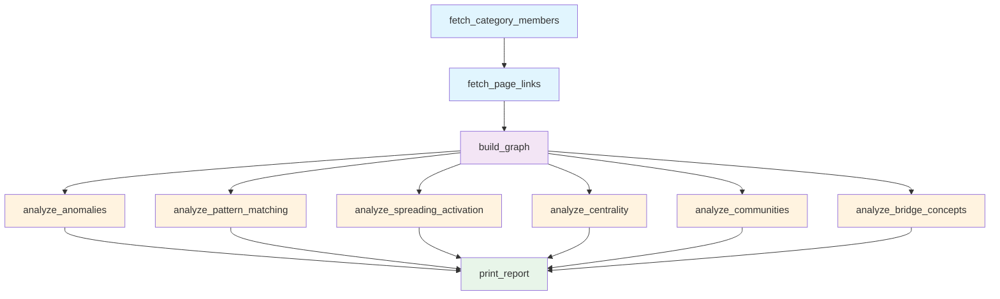

# Wikipedia Concept Knowledge Graph

A data pipeline that builds a concept knowledge graph from Wikipedia's Machine Learning category and uses Hyper3's structural analysis to discover hubs, anomalies, communities, and bridge concepts.

## What This Project Does

1. Fetches articles from Wikipedia's `Category:Machine_learning` and their outgoing page links
2. Constructs a directed concept graph: articles as nodes, `links_to` as edges
3. Runs six structural analyses: anomaly detection, hub discovery, spreading activation, degree centrality, community detection, and bridge concept identification

The pipeline runs offline by default (hardcoded concept graph of 50 ML seed concepts). When orchestrated through Prefect, it fetches live data from the Wikipedia API.

## Pipeline Architecture



Blue = data acquisition, purple = graph construction, orange = analysis, green = output.

## Data Sources

**Online mode** (Prefect orchestration): Queries the Wikipedia API (`en.wikipedia.org/w/api.php`) for `Category:Machine_learning` members, then fetches outgoing page links for each article. Rate-limited with retries (3 attempts, exponential backoff on 429/5xx).

**Offline mode** (default): Uses `OFFLINE_CONCEPTS`, a dictionary of 50 seed ML articles and their outgoing link targets. Produces 120 nodes and 301 edges. Deterministic -- no network calls, no randomness.

## Quick Start

```bash
# From the project root
.venv/bin/python examples/projects/wikipedia_concepts/pipeline.py
```

This runs offline mode (`__main__` entry point). No internet connection required.

## Graph Construction

Both modes follow the same pattern:

1. Collect all article titles (seed articles + their link targets)
2. `mem.ensure(title)` for each -- idempotent, no reinforcement
3. `mem.link(source, target, label="links_to")` for each directed link where both endpoints exist

In offline mode, `build_graph_from_offline()` reads from `OFFLINE_CONCEPTS`. In online mode, `build_graph()` reads from the link map returned by the Wikipedia API tasks. Both produce the same edge structure.

## Analysis Stages

### Anomaly Detection

`analyze_anomalies()` computes degree centrality, selects the top-10 concepts, and runs `analyze.anomalies()` on each. This identifies structurally unusual articles -- concepts whose connectivity pattern deviates from the norm.

Offline results:

| Concept | Degree Centrality | Anomaly Status | Boundary Score |
|---------|-------------------|----------------|----------------|
| Machine learning | 0.3782 | anomalous | 0.322 |
| All others | varies | low_risk | varies |

Machine learning is flagged because its connectivity (incoming + outgoing links to most of the graph) creates a structural outlier.

### Hub Discovery

`analyze_pattern_matching()` calls `pattern_match(edge_label="links_to")` to find all directed concept links, then counts incoming links per target concept. Concepts with the most incoming links are hubs -- frequently referenced across the domain.

Offline results -- top hubs by incoming links:

| Concept | Incoming Links | Outgoing Links | Seed Article |
|---------|---------------|----------------|--------------|
| Deep learning | 11 | 12 | Y |
| Natural language processing | 6 | 8 | Y |
| Artificial neural network | 5 | 9 | Y |

### Spreading Activation

`analyze_spreading_activation()` runs `mem.activate(seed, energy=1.0)` for each of 5 seed concepts (`Artificial intelligence`, `Neural network`, `Deep learning`, `Supervised learning`, `Reinforcement learning`), accumulating results across all seeds. Activation spreads through the graph, discovering concept clusters by propagating energy along edges.

Only concepts present in the graph are activated (checked via `concept in mem`). Activation decays with distance, revealing which concepts are structurally close to the seeds.

### Degree Centrality

`analyze_centrality()` calls `analyze.centrality("degree", top_k=20)` to rank concepts by total connectivity (in + out edges, normalized by graph size).

Offline top-4:

| Concept | Score |
|---------|-------|
| Machine learning | 0.3782 |
| Deep learning | 0.2437 |
| Natural language processing | 0.1765 |
| Neural network | 0.1345 |

### Community Detection

`analyze_communities()` calls `analyze.communities(method="label_propagation", seed=42)` to partition the graph into sub-topics. Communities with fewer than 3 members are filtered out.

Offline results: 9 communities (modularity=0.548, coverage=0.738)

| Community | Members | Sample Concepts |
|-----------|---------|-----------------|
| 115 | 30 | Feature extraction, clustering, cognitive science, representation learning, centroid |
| 89 | 26 | Deep learning, backpropagation, LSTM, RNN, neural network, autoencoder |
| 11 | 16 | GPT, transformer, BERT, NLP, text mining, large language model |
| 37 | 14 | Supervised learning, ensemble, bagging, random forest, gradient boosting |
| 4 | 11 | Overfitting, regularization, bias-variance tradeoff, cross-validation |
| 36 | 9 | Gradient descent, loss function, SGD, Adam optimizer, learning rate |
| 59 | 6 | Bayesian inference, prior probability, posterior probability, MCMC |
| 116 | 5 | Word embedding, Word2vec, GloVe, semantic similarity |
| 1 | 3 | Knowledge graph, semantic web, ontology |

### Bridge Concepts

`analyze_bridge_concepts()` calls `analyze.centrality("betweenness", top_k=15)` to identify concepts that sit on the shortest paths between otherwise disconnected parts of the graph.

Offline results:

| Concept | Betweenness |
|---------|-------------|
| Machine learning | 0.241 |
| Deep learning | 0.113 |
| Natural language processing | 0.066 |
| Reinforcement learning | 0.043 |

Machine learning has the highest betweenness because it connects to every sub-topic community in the graph.

## Offline Mode

Offline mode activates when the script is invoked as `__main__`:

```
.venv/bin/python examples/projects/wikipedia_concepts/pipeline.py
```

It calls `build_graph_from_offline()` with the `OFFLINE_CONCEPTS` dictionary (50 seed articles + their link targets, totaling 120 nodes and 301 edges). Each analysis task is called directly via `.fn()` to bypass Prefect task wrapping.

Offline mode is deterministic: the same graph topology is produced every run, and community detection uses `seed=42` for reproducibility. No network calls are made.

## Prefect Integration

The `wiki_concept_graph` function is a Prefect `@flow`. Each pipeline stage is a Prefect `@task` with retry configuration:

- `fetch_category_members`: 3 retries, 5s delay -- handles transient Wikipedia API failures
- `fetch_page_links`: 3 retries, 5s delay, 0.5s rate limit between requests -- respects Wikipedia's rate limits
- Analysis tasks: no retries (pure computation)

To run with Prefect orchestration:

```bash
.venv/bin/prefect run examples/projects/wikipedia_concepts/pipeline.py:wiki_concept_graph
```

This uses live Wikipedia data instead of the offline fallback. The HTTP session is configured with retry adapters (backoff on 429/5xx, User-Agent header set).

## Output Interpretation

The pipeline prints a formatted report with six sections:

1. **Structural Anomaly Detection** -- Concepts with connectivity patterns that deviate from the norm. `anomalous` status indicates a concept that is structurally central enough to be flagged.
2. **Hub Concepts** -- Articles that many other articles link to. High incoming-link count means the concept is foundational.
3. **Spreading Activation Clusters** -- Concepts close to the seed set in graph distance. Higher activation values indicate stronger structural proximity.
4. **Degree Centrality Ranking** -- Raw importance ranking by total edge count.
5. **Community Detection** -- Partitioned sub-topics. Each community represents a coherent area within machine learning.
6. **Bridge Concepts** -- Concepts that connect disparate communities. High betweenness indicates a concept that links otherwise separate sub-topics.

## Extending This Project

- **Different domains**: Change `CATEGORY` to any Wikipedia category (e.g., `Category:Physics`, `Category:Philosophy`)
- **More articles**: Increase `MAX_ARTICLES` (default 50). Note: more articles means longer API fetch time.
- **Additional analysis**: Add new `@task` functions that call other Hyper3 methods (`shortest_path`, `pagerank`, `recall` with `SliceConfig`, `reason` with custom rules)
- **Custom edge types**: The current pipeline uses a single `links_to` label. Extend `fetch_page_links` to capture link context and use multiple labels.
- **Persistence**: Call `mem.save("path.json")` after graph construction to cache the built graph for repeated analysis.

## Requirements & Running

```bash
# Install dependencies
.venv/bin/pip install -e ".[dev]" prefect requests

# Run offline (no network required)
.venv/bin/python examples/projects/wikipedia_concepts/pipeline.py

# Run online with Prefect (requires network)
.venv/bin/prefect run examples/projects/wikipedia_concepts/pipeline.py:wiki_concept_graph
```

The script is at `examples/projects/wikipedia_concepts/pipeline.py`.
