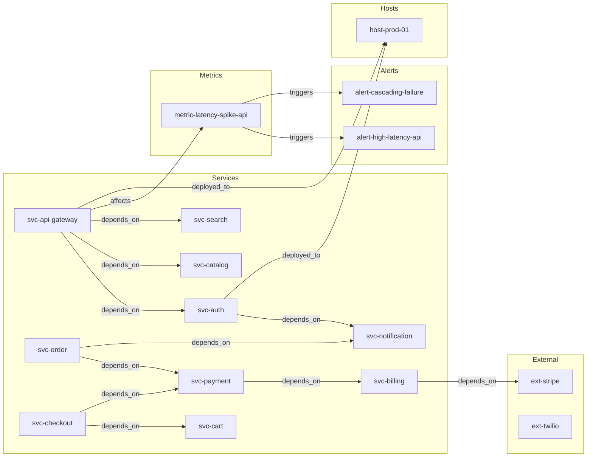

# Advanced Inference Rules for Infrastructure Monitoring

> Demonstrating how four rule types discover hidden dependency chains, causal patterns, service abstractions, and structural analogies in a 125-node production infrastructure graph.

## 1. The Approach

Infrastructure monitoring data contains multiple kinds of hidden relationships: multi-hop dependencies between services, causal links between metric anomalies, structural similarities between services that share operational profiles, and analogies where one subgraph's topology mirrors another's. No single inference strategy finds all of these. Transitive chains recover dependency paths that span hops. Hub inference finds nodes that consistently co-occur with downstream effects. Generalization groups services with similar operational profiles into abstractions. Structural projection finds topological analogies between subgraphs.

This showcase applies all four rule types to a synthetic infrastructure graph and measures what each discovers. The `auto_discover_and_apply()` method inspects the graph's edge structure and registers matching rules automatically, rather than requiring manual specification of which rules apply to which edge labels.

## 2. A Simple Analogy

Imagine a city's road network. You know the direct streets (A connects to B), but three other patterns matter:

- **Transitive chains**: If you can drive from A to B and B to C, you can reach C from A — even without a direct road. These are the *hidden routes*.
- **Hub patterns**: An intersection where six streets converge is structurally different from a dead-end cul-de-sac. Hub inference identifies these convergence points and their downstream effects.
- **Generalization**: Two neighborhoods with identical street layouts, population density, and zoning may share infrastructure needs even if they never interact. Grouping them lets you apply findings from one to the other.
- **Structural analogies**: The road pattern around the hospital (many incoming, few outgoing) may mirror the pattern around the fire station — suggesting similar emergency-response strategies.

## 3. Key Concepts

| Rule Type | What It Discovers | Why That Matters |
|---|---|---|
| **TransitiveRule** | Two-hop chains: if A depends_on B and B depends_on C, then A has a transitive dependency on C | Reveals hidden dependency depth — services that appear independent may share a deep dependency on the same downstream service |
| **HubInferenceRule** | Nodes with high fan-out that consistently co-occur with downstream effects | Identifies causal bottlenecks — when a hub node's anomalies propagate, many downstream services are affected |
| **GeneralizationRule** | Node pairs with similar data attributes (above a similarity threshold) | Groups services into operational categories — useful for applying uniform policies or predicting failure modes |
| **StructuralProjectionRule** | Subgraph analogies (A:B :: C:D) via embedding arithmetic | Finds structural parallels between unrelated parts of the graph, suggesting transferable operational patterns |
| **InverseRule** | Bidirectional edge pairs (e.g., `mitigates` / `follows`) | Recovers semantic inverses, doubling the navigability of the graph |

## 4. Quick Start

```bash
.venv/bin/python examples/showcase/advanced_rules/12_advanced_rules.py
```

```
======================================================================
SUMMARY
======================================================================
  Infrastructure:  125 nodes, 229 edges
  Auto-discovery:  18 patterns
    hub: 11
    inverse: 4
    transitive: 3
  Transitive chains:  55 hidden dependency paths
  Causal links:       8 co-occurrence patterns
  Abstractions:       22 similar-service pairs
  Analogies:          5 structural (A:B::C:D)
  Final graph:        130 nodes, 284 edges
```

## 5. The Scenario

The graph models a production microservices deployment with 125 nodes across 7 categories:

| Category | Count | Examples |
|---|---|---|
| Services | 35 | `svc-api-gateway`, `svc-auth`, `svc-order`, `svc-payment` |
| Hosts | 20 | `host-prod-01` through `host-prod-20` |
| Metrics | 15 | `metric-latency-spike-api`, `metric-error-burst-order` |
| Alerts | 15 | `alert-high-latency-api`, `alert-cascading-failure` |
| Deployments | 15 | `deploy-v2.3.1` through `deploy-hotfix-002` |
| External dependencies | 10 | `ext-stripe`, `ext-sendgrid`, `ext-aws-s3` |
| Correlations | 15 | `corr-api-auth-latency`, `corr-order-payment-error` |

The 229 edges span 10 relationship types: `depends_on` (50), `deployed_to` (35), `triggers` (28), `causes` (23), `follows` (23), `mitigates` (15), `monitors` (10), `affects` (15), `correlates_with` (22), `indicates` (8).



The diagram above shows a subset of the 125-node graph. Key structural features: `svc-api-gateway` is a dependency hub (4 outgoing `depends_on` edges), `alert-cascading-failure` is a convergence point (7 incoming `triggers` edges), and the correlation nodes create multi-labeled bridges between alerts and metrics.

## 6. Analysis Pipeline

### Section 1: Graph Construction

The script constructs 125 nodes and 229 edges across the 10 edge types listed above. Correlation nodes (`corr-*`) are connected to both alerts and metrics via multiple edge labels (`triggers`, `correlates_with`, `follows`, `causes`), creating the multi-labeled structures that `auto_discover_and_apply()` later detects.

### Section 2: Auto-Discovery

`auto_discover_and_apply()` inspects the graph's edge structure and finds 18 patterns across 3 categories:

- **3 transitive patterns**: `depends_on` (63 two-hop chains), `follows` (7 chains), `mitigates` (4 chains). The `depends_on` label produces the most chains because 50 edges create many two-hop paths.
- **4 inverse patterns**: `follows`/`mitigates` (4 mutual pairs), `causes`/`indicates` (7 mutual pairs). These pairs represent semantically opposite directions in the operational graph — a deployment `causes` a metric anomaly, and that same metric `indicates` the deployment.
- **11 hub patterns**: Services like `svc-order` (4 outgoing `depends_on` edges), `svc-api-gateway` (4 outgoing `depends_on` + 3 outgoing `affects`), and `alert-cascading-failure` (4 outgoing `mitigates` edges). Hub detection matters because these nodes have disproportionate blast radius — when they fail or change, many downstream nodes are affected.

7 new rules are added to the active set from the 18 discovered patterns.

### Section 3: TransitiveRule — Multi-Hop Dependencies

Applying `TransitiveRule(edge_label="depends_on")` to the full graph finds **55 transitive dependency chains**. These are paths where A depends on B and B depends on C, revealing that A transitively depends on C — a relationship not explicitly stored.

**Why transitive chains matter for infrastructure**: Direct dependencies are documented in service registries, but transitive dependencies are often invisible. When `svc-support` depends on `svc-order` which depends on `svc-inventory`, a failure in `svc-inventory` affects `svc-support` through a path that may not appear in any runbook.

The most-reached transitive targets:

| Target | Chains reaching it |
|---|---|
| `svc-inventory` | 9 |
| `svc-pricing` | 7 |
| `svc-review` | 5 |
| `svc-notification` | 3 |
| `svc-payment` | 3 |
| `svc-shipping` | 3 |

`svc-inventory` is the most transitively-depended-upon service — 9 chains reach it through intermediate services. This makes it a high-priority candidate for redundancy and monitoring investment, even though its direct dependency count is modest.

Sample chains include `svc-docs -> svc-catalog -> svc-review`, `svc-search -> svc-catalog -> svc-inventory`, and `svc-support -> svc-order -> svc-payment`.

### Section 4: HubInferenceRule — Causal Co-Occurrence

`HubInferenceRule(min_support=2, confidence_threshold=0.6)` finds **8 causal relationships**. Each correlation node that connects to both an alert and a metric via multiple edge labels is identified as a causal hub.

**Why hub inference matters**: Correlation nodes in this graph were constructed with multi-labeled edges (`triggers`, `correlates_with`, `follows`, `causes`) connecting them to both alerts and metrics. Hub inference detects that these nodes have consistent co-occurrence patterns — the same correlation node appears as a common cause across multiple downstream effects. Without this rule, the correlation would remain a static labeled node rather than being recognized as a causal agent.

All 8 causal links have support=3 and confidence=0.75, connecting correlation nodes to their downstream alerts:

| Correlation Node | Downstream Alert |
|---|---|
| `corr-api-auth-latency` | `alert-high-latency-api` |
| `corr-order-payment-error` | `alert-order-errors` |
| `corr-checkout-cart-fail` | `alert-cascading-failure` |
| `corr-search-index-delay` | `alert-search-degraded` |
| `corr-cache-queue-backlog` | `alert-queue-overflow` |
| `corr-deploy-cpu-spike` | `alert-cpu-critical` |
| `corr-external-gateway-timeout` | `alert-gateway-timeout` |
| `corr-memory-connection-leak` | `alert-connection-leak` |

### Section 5: GeneralizationRule — Service Abstractions

`GeneralizationRule(similarity_threshold=0.8)` finds **22 service abstraction pairs** across 6 groups. Services with matching `team`, `tier`, and similar numeric attributes (response time, error rate, throughput) are grouped.

**Why generalization matters**: When two services share similar operational profiles, they likely share failure modes and capacity requirements. Grouping `svc-scheduler`, `svc-cache`, and `svc-queue` (all `team: infra`, `tier: critical`, similar throughput ~50000) into a category means monitoring policies and incident playbooks can be applied uniformly rather than duplicated.

The groups by team:

| Team | Pairs | Example |
|---|---|---|
| `commerce` | 5 | `svc-order ~ svc-checkout`, `svc-catalog ~ svc-inventory` |
| `data` | 3 | `svc-search ~ svc-analytics ~ svc-recommendation` |
| `infra` | 4 | `svc-scheduler ~ svc-cache ~ svc-queue` |
| `messaging` | 3 | `svc-sms ~ svc-push ~ svc-email` |
| `platform` | 3 | `svc-auth ~ svc-user ~ svc-audit` |
| `unknown` | 4 | Cross-type metric/alert pairs (similarity=1.00) |

5 category nodes are applied to the graph, growing it from 125 to 130 nodes and 229 to 234 edges.

### Section 6: StructuralProjectionRule — Structural Analogies

`StructuralProjectionRule(similarity_threshold=0.7)` with `HashEmbeddingProvider(dim=32)` finds **5 structural analogies**. These are subgraph pairs where the embedding arithmetic `emb(A) - emb(B) ≈ emb(C) - emb(D)`, meaning the relationship between A and B structurally resembles the relationship between C and D.

**Why structural analogies matter**: An analogy like `svc-shipping : host-prod-07 :: host-prod-16 : svc-notification` suggests that the deployment relationship pattern between shipping and its host mirrors a pattern between the host for queue/cache services and the notification service. These parallels can reveal unexpected operational similarities — the same class of deployment risk may apply to both subgraphs.

The 5 analogies (scores 0.700–0.726):

| Analogy | Score |
|---|---|
| `svc-shipping:host-prod-07 :: host-prod-16:svc-notification` | 0.726 |
| `metric-error-burst-payment:alert-payment-declines :: deploy-v2.4.0:host-prod-06` | 0.710 |
| `svc-order:metric-error-burst-order :: corr-external-gateway-timeout:alert-search-degraded` | 0.703 |
| `deploy-v2.3.2:deploy-v2.3.1 :: metric-cpu-spike-prod-01:alert-cpu-critical` | 0.702 |
| `corr-deploy-cpu-spike:metric-cpu-spike-prod-01 :: deploy-v3.1.1:alert-cpu-critical` | 0.700 |

Note: Hash embeddings produce structural analogies based on topology, not semantic meaning. Production deployments using sentence-transformer embeddings would find semantically meaningful analogies.

### Section 7: Full Reasoning with All Rules Combined

All rules are registered and `reason()` is called with 7 seed concepts (chosen to form `depends_on` chains), `max_depth=3`, and `max_total_states=50`:

| Metric | Value |
|---|---|
| States created | 51 |
| Rules applied | 50 |
| Max depth reached | 2 |
| Overlay committed | 0 nodes, 50 edges |

The graph grows from 130 nodes / 234 edges to 130 nodes / 284 edges — a net gain of 50 inferred edges with no new nodes. The inferred edges break down as:

- **50 `inferred_depends_on`** edges from transitive rule application
- **5 `generalizes`** edges from generalization rule application

55 total inferred edges are present in the final graph (the 5 from the earlier direct application plus 50 from reasoning).

## 7. Understanding Output

### Match Counts

| Rule | Matches | What It Means |
|---|---|---|
| TransitiveRule | 55 chains | 55 pairs of services where a hidden dependency exists through an intermediate service |
| HubInferenceRule | 8 links | 8 correlation nodes with statistically significant co-occurrence (support >= 2, confidence >= 0.6) |
| GeneralizationRule | 22 pairs | 22 node pairs with data attribute similarity >= 0.8 |
| StructuralProjectionRule | 5 analogies | 5 subgraph pairs where embedding arithmetic yields analogy score >= 0.7 |

### Auto-Discovery Output

The 18 discovered patterns break into 3 transitive patterns (edge labels with enough two-hop chains), 4 inverse patterns (pairs of edge labels with mutual connections), and 11 hub patterns (nodes with high fan-out on a single edge label). The 7 rules added to the active set are the unique rules generated from these patterns — some patterns produce the same rule type (e.g., multiple hub nodes produce a single HubInferenceRule).

## 8. Key Metrics

| Metric | Value |
|---|---|
| Initial nodes | 125 |
| Initial edges | 229 |
| Edge types | 10 |
| `depends_on` edges | 50 |
| `deployed_to` edges | 35 |
| `triggers` edges | 28 |
| `correlates_with` edges | 22 |
| `causes` edges | 23 |
| `follows` edges | 23 |
| `mitigates` edges | 15 |
| `affects` edges | 15 |
| `monitors` edges | 10 |
| `indicates` edges | 8 |
| Auto-discovered patterns | 18 |
| New rules added | 7 |
| Transitive patterns | 3 (`depends_on`: 63 chains, `follows`: 7 chains, `mitigates`: 4 chains) |
| Inverse patterns | 4 (`follows`/`mitigates`: 4 pairs, `causes`/`indicates`: 7 pairs) |
| Hub patterns | 11 |
| Transitive dependency chains | 55 |
| Top transitive target | `svc-inventory` (9 chains) |
| Causal links found | 8 (all support=3, confidence=0.75) |
| Service abstraction pairs | 22 (threshold >= 0.8) |
| Structural analogies | 5 (scores 0.700–0.726) |
| Category nodes created | 5 |
| Reasoning states created | 51 |
| Rules applied during reasoning | 50 |
| Reasoning max depth | 2 |
| Final nodes | 130 |
| Final edges | 284 |
| Inferred edges | 55 (50 `inferred_depends_on`, 5 `generalizes`) |

## 9. What Makes This Different

**Auto-discovery of applicable rules** — The `auto_discover_and_apply()` method inspects edge structure and registers rules that match the data, rather than requiring manual specification of which rules apply to which edge labels. The graph's 10 edge types produce 18 structural patterns automatically.

**Multi-strategy inference** — Four rule types operate simultaneously on the same graph. Transitive chains find paths, hub inference finds causal bottlenecks, generalization finds operational groupings, and structural projection finds topological parallels. Each strategy surfaces a different kind of hidden relationship.

**Composable rule pipeline** — Rules are pure queries (`find_matches()`) that the multiway engine applies to produce expansions. Adding a new rule type means implementing the `Rule` interface — no changes to the engine are needed. The `reason()` call applies all registered rules in a single pass.

**Typed result dataclasses** — Every rule produces typed match objects with bindings and context, not unstructured dicts. The `HubInferenceRule` matches carry `support` and `confidence` in their context; the `GeneralizationRule` matches carry `similarity` and `label_a`/`label_b`. This makes downstream processing and filtering deterministic.

## 10. Code Implementation

### Auto-discovery

```python
from hyper3 import HypergraphMemory

mem = HypergraphMemory(evolve_interval=0)
# ... construct graph ...

discovery_result = mem.auto_discover_and_apply()
print(discovery_result.total_patterns)   # 18
print(discovery_result.new_rules_added)  # 7
```

### Transitive dependency chains

```python
from hyper3 import TransitiveRule

transitive = TransitiveRule(edge_label="depends_on", new_label="inferred_depends_on")
all_ids = frozenset(n.id for n in mem.graph.nodes)
matches = transitive.find_matches(mem.graph, all_ids)
# Each match has bindings["A"], bindings["B"], bindings["C"]
```

### Hub-based causal inference

```python
from hyper3 import HubInferenceRule

causal = HubInferenceRule(min_support=2, confidence_threshold=0.6, causes_label="causes")
matches = causal.find_matches(mem.graph, all_ids)
for m in matches:
    print(m.context["support"], m.context["confidence"])
```

### Service generalization

```python
from hyper3 import GeneralizationRule

gen = GeneralizationRule(similarity_threshold=0.8, label_prefix="category_")
matches = gen.find_matches(mem.graph, all_ids)
for m in matches[:5]:
    gen.apply(mem.graph, m)
```

### Structural analogies

```python
from hyper3 import StructuralProjectionRule, HashEmbeddingProvider

mem.set_embedding_provider(HashEmbeddingProvider(dim=32))
analogical = StructuralProjectionRule(similarity_threshold=0.7)
analogical.set_embedding_engine(mem.embedding_engine)
matches = analogical.find_matches(mem.graph, all_ids)
# Each match has bindings["A"], bindings["B"], bindings["C"], bindings["D"]
```

### Full reasoning with combined rules

```python
from hyper3 import InverseRule

mem.add_rules(transitive, causal, gen, analogical,
              InverseRule(edge_label="mitigates", inverse_label="resolved_by"))

result = mem.reason(
    seed_concepts={"svc-api-gateway", "svc-auth", "svc-order"},
    max_depth=3,
    max_total_states=50,
)
```

## 11. Real-World Gap

- **Alert correlation is synthetic**: The 15 correlation nodes were placed manually with multi-labeled edges. In production, correlations would need to be discovered from time-series co-occurrence of metric anomalies, requiring a streaming data pipeline and statistical correlation engine.
- **Metric time-series integration**: This graph uses single-point metric representations (e.g., `metric-latency-spike-api` with `severity: high`). Real infrastructure metrics are continuous time-series. Integrating time-series data would require a windowing and aggregation layer between the monitoring system and the graph.
- **Static service profiles**: Service attributes (response time, error rate, throughput) are fixed at construction. In production, these change continuously and would need periodic refresh from observability systems.
- **Hash embeddings for analogies**: The `HashEmbeddingProvider` produces structural analogies based on topology, not semantic meaning. Production use would benefit from sentence-transformer or domain-trained embeddings for semantically meaningful analogies.
- **Scale**: The graph has 125 nodes. Performance at 10K+ nodes (typical for large microservices deployments) is untested.
- **Causal confidence is uniform**: All 8 causal links have identical support and confidence because the correlation nodes were constructed symmetrically. Real operational data would produce varying confidence levels reflecting actual co-occurrence rates.

## 12. Reference

### API Methods

| Method | Description |
|---|---|
| `mem.auto_discover_and_apply()` | Inspects edge structure, discovers transitive/inverse/hub patterns, registers matching rules |
| `mem.add_rules(*rules)` | Registers inference rules for use by `reason()` |
| `mem.reason(seed_concepts, max_depth, max_total_states)` | Applies all registered rules via multiway expansion from seed concepts |
| `mem.set_embedding_provider(provider)` | Sets the embedding provider for vector-based operations |
| `mem.discovery.get_discovered_rules()` | Returns list of `DiscoveredRule` objects from the last auto-discovery |
| `TransitiveRule(edge_label, new_label)` | Finds two-hop chains with matching edge labels |
| `HubInferenceRule(min_support, confidence_threshold, causes_label)` | Finds causal co-occurrence patterns with statistical thresholds |
| `GeneralizationRule(similarity_threshold, label_prefix)` | Finds node pairs with similar data attributes |
| `StructuralProjectionRule(similarity_threshold)` | Finds structural analogies via embedding arithmetic |
| `InverseRule(edge_label, inverse_label)` | Creates inverse edges for a given label |
| `HashEmbeddingProvider(dim)` | Hash-based embedding provider for structural similarity |

### Related Examples

- `examples/showcase/knowledge_basics/` — Basic hypergraph construction and traversal
- `examples/showcase/threat_intelligence/` — Rule application in a threat intelligence domain
