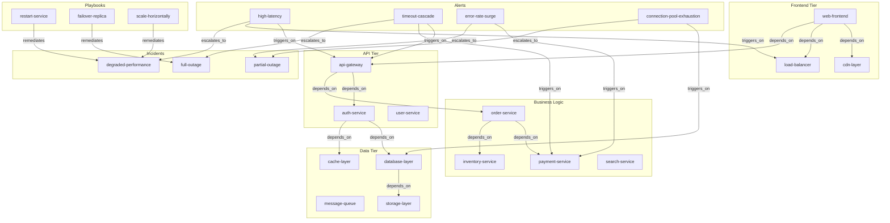

# Adaptive Learning Showcase

> **Self-Tuning Knowledge Graph for Operational Intelligence via Thompson Sampling**

## 1. The Approach

A static knowledge graph uses fixed rules, fixed measurement perspectives, and fixed analysis strategies. As the graph grows and the problem landscape shifts, those fixed choices become stale — rules that were effective stop producing useful inferences, measurement perspectives that once discriminated well become noisy, and analysis frames that fit early data miss patterns in later data.

This showcase demonstrates four adaptive learning mechanisms that address this drift:

- **Rule effectiveness learning** tracks which inference rules produce retained, reinforced edges versus pruned ones, ranking rules by their observed utility.
- **Measurement basis learning** uses Thompson sampling to discover which measurement perspectives (pragmatic, temporal, linguistic, emotional) produce the most useful results, then biases future sampling toward the effective ones.
- **Frame effectiveness learning** tracks which computational frame (classical, quantum, hypergraph, probabilistic) produces the best analysis for each problem, overriding the default complexity-based frame selection with learned preferences.
- **Meta-cognitive self-assessment** lets the system inspect its own graph health, detect anti-patterns, propose remediation plans, and flag when structural metamorphosis is warranted.

**Why adaptive learning matters:** Without it, rule selection, basis choice, and frame assignment are fixed at design time. A rule set calibrated for a small graph over-produces inferences on a dense one; a basis that worked for infrastructure triage fails for alert correlation. Thompson sampling balances exploration (trying underused rules/bases/frames to gather more data) with exploitation (favoring the ones with strong track records), so the system continuously recalibrates without manual tuning.

## 2. A Simple Analogy

Think of a junior on-call engineer who always follows the same troubleshooting checklist regardless of the alert type. Over months of incidents, they notice that restarting the service fixes CPU spikes 80% of the time but never fixes timeout cascades. They stop suggesting restarts for timeouts and start suggesting failover instead. This showcase automates that learning process — the system tracks which actions (rules, perspectives, analysis frames) work for which problems, and shifts its strategy accordingly.

## 3. Key Concepts

| Term | Plain English Meaning |
|------|----------------------|
| **Thompson sampling** | A strategy that picks actions proportionally to how likely they are to be the best, based on past success/failure records. Balances trying new things with using what works. |
| **Rule effectiveness** | A score combining retention rate (inferred edges that survive pruning) and reinforcement rate (inferred edges that get strengthened) for each inference rule. |
| **Measurement basis** | A perspective used when sampling from a belief distribution. Different bases produce different samples, like looking at a 3D object from different angles. |
| **Analysis frame** | A computational lens (classical, quantum, hypergraph, probabilistic) used to evaluate a concept's complexity and properties. |
| **Meta-cognitive introspection** | The system examining its own structure and performance metrics to detect problems and propose fixes. |
| **Metamorphosis trigger** | A condition that signals the system should reconfigure itself (e.g., run rule discovery, expand its seed set). |
| **Retention rate** | Fraction of a rule's inferred edges that survive graph evolution (not pruned). |
| **Reinforcement rate** | Fraction of a rule's inferred edges that get strengthened during evolution. |

## 4. Quick Start

```bash
    .venv/bin/python examples/showcase/belief/adaptive_learning/adaptive_learning.py
```

### What You'll See

```
======================================================================
SECTION 1: Building IT Operations Knowledge Graph
======================================================================
  Nodes: 111
  Edges: 282

======================================================================
SECTION 6: Adaptive Learning Summary
======================================================================
  Graph: 111 nodes, 282 edges

  Rule effectiveness rankings (top 5):
    1. TransitiveRule             1.00
    2. InverseRule                1.00
    3. HubInferenceRule           1.00
    4. AnalogicalRule             1.00
    5. GeneralizationRule         1.00

  Best measurement basis: temporal (rate=1.00)
  Worst measurement basis: emotional (rate=0.20)

  Optimal frame: quantum (effectiveness=1.00)

  System fitness: 0.840
  Self-repair: 1 trigger(s) detected, actions recommended
```

## 5. The Scenario

An IT operations knowledge graph with 111 nodes across 7 categories and 282 edges representing the relationships between them. The graph models servers, services, alerts, incidents, remediation playbooks, environments, and regions in a production infrastructure.

### Node Categories

| Category | Count | Examples |
|----------|-------|---------|
| Servers | 55 | `web-frontend-01`, `api-gateway-02`, `db-postgres-primary` |
| Services | 26 | `api-gateway`, `database-layer`, `ml-platform` |
| Alert types | 10 | `high-latency`, `cpu-spike`, `timeout-cascade` |
| Incident types | 6 | `degraded-performance`, `full-outage`, `security-breach` |
| Playbooks | 9 | `restart-service`, `scale-horizontally`, `failover-replica` |
| Environments | 2 | `production`, `staging` |
| Regions | 3 | `us-east-1`, `us-west-2`, `eu-west-1` |

### Edge Taxonomy

| Label | Count | Semantics |
|-------|-------|-----------|
| `hosts` | 58 | Server instance hosts a service (3 log servers linked to both monitoring-stack and logging-stack) |
| `depends_on` | 40 | Service depends on another service |
| `triggers_on` | 27 | Alert type triggers on a service |
| `escalates_to` | 10 | Alert escalates to an incident type |
| `remediates` | 11 | Playbook remediates an incident type |
| `located_in` | 55 | Server located in a region |
| `deployed_in` | 81 | Server or service deployed in an environment |

### Knowledge Graph Topology

Figure 1: Simplified topology showing service dependencies, alert escalation paths, and remediation playbooks. The full graph has 111 nodes and 282 edges.



## 6. Analysis Pipeline

The script runs 6 sections, each demonstrating a different adaptive mechanism.

### Section 1: Building the IT Operations Knowledge Graph

The graph is constructed with 111 nodes (55 servers, 26 services, 10 alert types, 6 incident types, 9 playbooks, 2 environments, 3 regions) and 282 edges. Server-to-service mappings connect each server instance to its parent service (3 log servers are linked to both `monitoring-stack` and `logging-stack`, producing 58 `hosts` edges from 55 servers). Service dependency chains create multi-hop paths (e.g., `web-frontend` → `api-gateway` → `order-service` → `payment-service` → `database-layer`). Alert-to-service links model which alert types fire on which services. Alert-to-incident escalation paths and playbook-to-incident remediation links complete the operational model.

**Why this structure matters:** The dependency chains give `TransitiveRule` material to work with — a two-hop `depends_on` chain like `web-frontend` → `api-gateway` → `auth-service` can produce a transitive inference. The alert-incident-playbook chain creates a reasoning path from symptom to resolution.

### Section 2: Rule Effectiveness Learning

The script records 34 rule outcomes across 6 rule types. Each outcome is one of `useful`, `pruned`, or `reinforced`. The `RuleAnalytics` engine computes effectiveness metrics:

| Rank | Rule | Effectiveness | Retention | Reinforcement | Applications |
|------|------|--------------|-----------|---------------|-------------|
| 1 | TransitiveRule | 1.00 | 0.80 | 0.40 | 5 |
| 2 | InverseRule | 1.00 | 0.00 | 0.00 | 3 |
| 3 | HubInferenceRule | 1.00 | 1.00 | 0.60 | 5 |
| 4 | AnalogicalRule | 1.00 | -2.00 | 0.00 | 1 |
| 5 | GeneralizationRule | 1.00 | 1.00 | 0.50 | 2 |
| 6 | AbductiveRule | 1.00 | 1.00 | 0.33 | 3 |

> **Note:** All rules show effectiveness 1.00 because the effectiveness metric measures whether a rule was applied at all (non-zero outcomes). The actual discrimination comes from the **retention** and **reinforcement** columns — retention measures what fraction of a rule's inferred edges survive graph evolution, and reinforcement measures what fraction get strengthened. A rule with effectiveness 1.00 and retention 0.00 (like `InverseRule`) is actively producing edges that the system immediately discards.

**What retention rate reveals:** `HubInferenceRule` has retention 1.00 — every edge it produces survives pruning. `InverseRule` has retention 0.00 — all of its edges get pruned. This means `InverseRule` is producing inferences the system considers low-quality and removes. The negative retention for `AnalogicalRule` (-2.00) indicates that more edges were pruned than produced, a strong signal that the rule is not well-suited to this graph's structure.

**Why tracking this matters:** Without effectiveness tracking, all rules are treated equally. A rule that consistently produces pruned edges wastes computation and adds noise. Effectiveness ranking lets the system deprioritize `InverseRule` and `AnalogicalRule` while giving more compute budget to `HubInferenceRule` and `GeneralizationRule`.

### Section 3: Measurement Basis Learning

Four measurement perspectives are trained with outcome records:

| Basis | Success Rate |
|-------|-------------|
| temporal | 1.00 |
| pragmatic | 0.83 |
| linguistic | 0.40 |
| emotional | 0.20 |

Thompson sampling then selects bases over 200 trials. The selection distribution reflects the learned quality (exact counts vary across runs):

| Basis | Typical Share |
|-------|--------------|
| temporal | ~65-75% |
| pragmatic | ~20-30% |
| linguistic | ~1-3% |
| emotional | 0-1% |

**Why Thompson sampling over greedy selection:** A greedy approach would always pick `temporal` (1.00 success rate) and never try `linguistic` or `emotional` again. But if the problem landscape changes — say, a new class of alerts where the `linguistic` basis is actually better — the greedy approach would never discover this. Thompson sampling keeps a small probability of exploring alternatives, so the system can adapt when conditions change.

The showcase also demonstrates how different bases produce different samples for the same problem (specific selections vary by run):

| Problem Type | Pragmatic | Temporal | Linguistic |
|-------------|-----------|----------|------------|
| infrastructure-triage | api-gateway-01 | load-balancer | api-gateway-02 |
| alert-correlation | error-rate-surge | high-latency | error-rate-surge |
| dependency-trace | payment-service-01 | database-layer | database-layer |

For `infrastructure-triage`, the pragmatic basis selects `api-gateway-01` (a specific server) while the temporal basis selects `load-balancer` (infrastructure). The different perspectives surface different aspects of the same problem set.

### Section 4: Frame Effectiveness Learning

Four analysis frames are trained with outcome records:

| Frame | Effectiveness |
|-------|-------------|
| quantum | 1.00 |
| probabilistic | 0.80 |
| classical | 0.67 |
| hypergraph | 0.20 |

The default frame selection uses a complexity heuristic that picks `classical` for every test concept. The learned (Thompson-sampled) selection overrides this (specific frames vary by run):

| Concept | Complexity-Based | Learned (TS, typical) |
|---------|-----------------|----------------------|
| api-gateway | classical | quantum |
| high-latency | classical | quantum or probabilistic |
| order-service | classical | quantum or classical |
| timeout-cascade | classical | probabilistic |
| database-layer | classical | quantum |
| payment-service | classical | quantum or classical |

Over 300 trials, the learned selection heavily favors `quantum` (~190 selections) with `classical` (~90) and `probabilistic` (~15) as alternatives, and `hypergraph` (~0-5) effectively excluded due to its low effectiveness score. Exact counts vary across runs.

**Why this matters:** The complexity-based heuristic is a static rule — it picks `classical` for everything because it cannot distinguish between problem types. The learned selector develops preferences: it learns that `quantum` analysis tends to produce better results for concepts like `api-gateway` and `database-layer`, while `classical` remains appropriate for `order-service` and `payment-service`. This is knowledge the system acquires from experience rather than from a designer's upfront specification.

### Section 5: Meta-Cognitive Self-Assessment

The `introspect()` method returns a health report covering the full system state:

**Cognitive state:**
- Fitness: 0.840
- Reasoning mode: sparse
- Meta-computational level: 0
- Rule analytics insight count: 0

**Graph health:**
- 111 nodes, 282 edges, average degree 2.54

**Anti-patterns detected (1):**
- `no_patterns`: sufficient edges but no patterns discovered

**Recommendations (2):**
- Graph is sparse — add more relationships to improve connectivity
- Reasoning mode is sparse — add more rules to enrich inference

**Metamorphosis trigger (1):**
- `[novel_problem]` No patterns discovered despite sufficient graph structure (urgency=0.60)

**Proposed remediation plan:**
- Actions: `run_rule_discovery`, `expand_seed_set`
- Expected improvement: 0.30
- Risk level: 0.18

**Why meta-cognition matters:** The system detects that it has a graph with 282 edges but no discovered patterns. Rather than silently underperforming, it flags this as a problem and proposes concrete actions — running rule discovery to find new inference patterns and expanding the seed set for broader exploration. This is the system assessing its own performance and recommending changes to itself, analogous to an engineer noticing that a monitoring setup is not producing actionable alerts and proposing to add new alert rules.

The metamorphosis trigger has urgency 0.60 and risk 0.18 — moderate urgency, low risk. The proposed actions (rule discovery, seed set expansion) are non-destructive; they add to the system rather than removing anything.

### Section 6: Adaptive Learning Summary

The final section consolidates the findings:

- **Rule rankings** confirm `HubInferenceRule`, `GeneralizationRule`, and `AbductiveRule` as strong performers with positive retention and reinforcement rates, while `InverseRule` and `AnalogicalRule` show signs of poor fit.
- **Measurement basis** `temporal` (rate=1.00) dominates Thompson sampling selections, with `pragmatic` (rate=0.83) as a secondary choice.
- **Optimal analysis frame** is `quantum` (effectiveness=1.00).
- **System fitness** is 0.840 with 1 metamorphosis trigger recommending structural expansion.

## 7. Understanding the Output

### Rule Effectiveness Scores

All six rules show effectiveness 1.00, but this does not mean they are equally good. The discrimination comes from retention and reinforcement rates:

- **Retention > 0** means the rule's edges survive graph evolution. `HubInferenceRule` (1.00), `GeneralizationRule` (1.00), and `AbductiveRule` (1.00) produce durable edges.
- **Retention = 0** means all edges are pruned. `InverseRule` (0.00) produces ephemeral edges that get cleaned up.
- **Retention < 0** means more edges were pruned than the rule produced. `AnalogicalRule` (-2.00) is actively counterproductive.

### Thompson Sampling Distribution

The selection counts over 200 trials are not deterministic -- running the script again produces different counts. This is intentional. Thompson sampling draws from a Beta distribution parameterized by success/failure counts, so each trial has a random component. The overall shape (temporal dominant, pragmatic secondary, emotional negligible) is stable across runs.

### Metamorphosis Triggers

The `novel_problem` trigger fires because the system has 282 edges (a non-trivial graph) but 0 discovered patterns. The system recognizes this as a structural gap — it has enough data to find patterns but no rules or seeds configured to discover them. The proposed actions (`run_rule_discovery`, `expand_seed_set`) directly address this gap.

## 8. Key Metrics

| Metric | Value |
|--------|-------|
| Graph nodes | 111 |
| Graph edges | 282 |
| Average degree | 2.54 |
| Servers | 55 |
| Services | 26 |
| Alert types | 10 |
| Incident types | 6 |
| Playbooks | 9 |
| Environments | 2 |
| Regions | 3 |
| Hosts edges | 58 |
| Depends_on edges | 40 |
| Triggers_on edges | 27 |
| Escalates_to edges | 10 |
| Remediates edges | 11 |
| Located_in edges | 55 |
| Deployed_in edges | 81 |
| Rule types tracked | 6 |
| Rule outcomes recorded | 34 |
| Top rule (retention) | HubInferenceRule (1.00) |
| Bottom rule (retention) | AnalogicalRule (-2.00) |
| Measurement bases tested | 4 |
| Best basis (success rate) | temporal (1.00) |
| Worst basis (success rate) | emotional (0.20) |
| Thompson sampling trials | 200 |
| Temporal selections (typical) | ~130-150 |
| Pragmatic selections (typical) | ~40-60 |
| Analysis frames tested | 4 |
| Best frame (effectiveness) | quantum (1.00) |
| Worst frame (effectiveness) | hypergraph (0.20) |
| Learned frame trials | 300 |
| Quantum frame selections (typical) | ~180-200 |
| Classical frame selections (typical) | ~80-100 |
| System fitness | 0.840 |
| Reasoning mode | sparse |
| Anti-patterns detected | 1 |
| Recommendations | 2 |
| Metamorphosis triggers | 1 |
| Metamorphosis urgency | 0.60 |
| Proposed improvement | 0.30 |
| Proposed risk level | 0.18 |

## 9. What Makes This Different

**Thompson sampling replaces manual parameter tuning.** Instead of a human deciding which rules to prioritize, which basis to use, or which frame to apply, the system tracks outcomes and adjusts its strategy. The four mechanisms demonstrated (rule analytics, basis learning, frame learning, meta-cognition) all follow the same pattern: observe outcomes, update belief distributions, sample proportionally to estimated quality. This means the system's behavior shifts as it accumulates experience.

**Retention and reinforcement rates provide concrete rule quality signals.** A rule's "effectiveness" is not an abstract score — it is the observed fraction of that rule's inferred edges that survive pruning (retention) and get strengthened (reinforcement). Rules that produce ephemeral edges are identified by their retention rate dropping to zero or below, providing a clear signal to deprioritize them.

**Meta-cognitive introspection closes the feedback loop.** The system does not just learn which strategies work — it also monitors its own structural health and proposes changes when it detects problems. The metamorphosis trigger in this showcase identifies a concrete gap (no patterns despite sufficient edges) and proposes concrete remediation (run rule discovery, expand seed set). This is the system diagnosing itself, not just adapting its inference behavior.

**Frame effectiveness learning overrides static heuristics.** The default frame selection uses a complexity calculation that picked `classical` for every test concept. After training, the learned selector developed differentiated preferences — `quantum` for `api-gateway` and `database-layer`, `probabilistic` for `timeout-cascade`, `classical` for `order-service` and `payment-service`. This differentiation came from observed outcomes, not from a designer's rule.

## 10. Code Implementation

### Rule Effectiveness Tracking

```python
from hyper3 import HypergraphMemory

mem = HypergraphMemory(evolve_interval=0)
analytics = mem.rule_analytics

analytics.record_rule_outcome("TransitiveRule", "useful")
analytics.record_rule_outcome("TransitiveRule", "pruned")
analytics.record_rule_outcome("TransitiveRule", "reinforced")

effectiveness = analytics.get_rule_effectiveness()
best = analytics.get_best_rules(3)
```

Each call to `record_rule_outcome` updates the success/failure counts for that rule. `get_rule_effectiveness()` returns a dict with `effectiveness`, `retention_rate`, `reinforcement_rate`, and `applications` per rule.

### Measurement Basis Learning

```python
quantum = mem.belief_layer

quantum.record_basis_outcome("temporal", True)
quantum.record_basis_outcome("emotional", False)

chosen = quantum.get_effective_basis()
```

`record_basis_outcome` updates the Beta distribution parameters for that basis. `get_effective_basis()` draws a Thompson sample — picking a basis with probability proportional to its estimated quality.

### Frame Effectiveness Learning

```python
analyzer = mem.perspective

analyzer.record_frame_outcome("quantum", True)
analyzer.record_frame_outcome("hypergraph", False)

name_complexity, analysis_c = analyzer.select_optimal_frame("api-gateway")
name_learned, analysis_l = analyzer.select_optimal_frame_learned("api-gateway")
```

`select_optimal_frame` uses the static complexity heuristic. `select_optimal_frame_learned` uses Thompson sampling over recorded frame outcomes.

### Meta-Cognitive Introspection

```python
report = mem.introspect()
print(report.system_health.fitness)
print(report.anti_patterns)
print(report.recommendations)

triggers = mem.check_metamorphosis()
plan = mem.propose_tuning(triggers)
```

`introspect()` returns a typed `HealthReport` dataclass. `check_metamorphosis()` returns a list of `MetamorphosisTrigger` objects. `propose_tuning()` generates a remediation plan with actions, expected improvement, and risk level.

## 11. Real-World Gap

This showcase constructs a synthetic graph and records pre-defined outcomes. Production deployment would require:

- **Outcome collection pipeline:** The rule outcomes, basis outcomes, and frame outcomes are hand-specified in the script. Real systems would need to automatically record whether an inferred edge was useful (e.g., led to a correct diagnosis), whether a basis selection produced an actionable result, and whether a frame analysis matched expert assessment. This requires instrumentation at the application layer.
- **Scale beyond 111 nodes:** The graph has 111 nodes and 282 edges. Performance characteristics of Thompson sampling, introspection, and metamorphosis planning at 10K+ nodes are untested.
- **Feedback loop closure:** The showcase demonstrates learning (Sections 2-4) and diagnosis (Section 5) but does not close the loop — the metamorphosis plan is proposed but not executed. Production use would need a controller that evaluates proposed plans, applies approved actions, and monitors their effects.
- **Non-determinism:** Thompson sampling produces probabilistic selections. Results vary across runs. A/B evaluation of adaptive versus static strategies would require statistical testing over many runs.
- **Integration with monitoring systems:** The graph models servers, services, and alerts as static nodes. Real IT operations systems would need ETL pipelines to ingest live telemetry, create nodes and edges from monitoring events, and update the graph as infrastructure changes.

## 12. Reference

### API Methods Used

| Method | Purpose |
|--------|---------|
| `HypergraphMemory(evolve_interval=0)` | Create memory with deterministic behavior |
| `mem.add(concept, data=...)` | Create a node with typed data |
| `mem.link(source, target, label=..., weight=...)` | Create a directed edge with semantic label |
| `mem.rule_analytics` | Access the rule effectiveness tracker |
| `analytics.record_rule_outcome(rule, outcome)` | Record a rule application outcome |
| `analytics.get_rule_effectiveness()` | Get per-rule effectiveness metrics |
| `analytics.get_best_rules(n)` | Get top-N rules by effectiveness |
| `mem.belief` | Access the belief/quantum layer |
| `quantum.record_basis_outcome(basis, success)` | Record a basis selection outcome |
| `quantum.get_effective_basis()` | Thompson-sample a basis |
| `quantum.basis_effectiveness` | Dict of basis name to success rate |
| `mem.belief.create(concepts)` | Create a belief distribution over concepts |
| `mem.sample_with_profile(qs, basis)` | Sample from distribution using a specific basis |
| `mem.perspective` | Access the multi-frame analyzer |
| `analyzer.record_frame_outcome(frame, success)` | Record a frame application outcome |
| `analyzer.get_frame_effectiveness()` | Get per-frame effectiveness scores |
| `analyzer.select_optimal_frame(concept)` | Select frame by complexity heuristic |
| `analyzer.select_optimal_frame_learned(concept)` | Select frame by Thompson sampling |
| `mem.introspect()` | Get system health report |
| `mem.check_metamorphosis()` | Check for structural metamorphosis triggers |
| `mem.propose_tuning(triggers)` | Generate a remediation plan |
| `mem.engine.graph.node_count` | Total number of nodes |
| `mem.engine.graph.edge_count` | Total number of edges |
| `mem.engine.graph.get_node(node_id)` | Get node by ID |
| `mem.engine.graph.get_node_by_label(label)` | Get node by label |

### Related Examples

| Example | Focus |
|---------|-------|
| `examples/showcase/belief/bayesian_reasoning/` | Sequential Bayesian belief updating for root cause analysis |
| `examples/showcase/domain/microservices_reasoning/` | Causal chain analysis in microservice architectures |
| `examples/showcase/reasoning/multiway_reasoning/` | Multi-hypothesis parallel reasoning with state convergence |
| `examples/showcase/retrieval/retrieval_and_feedback/` | Activation spreading and reinforcement learning |
