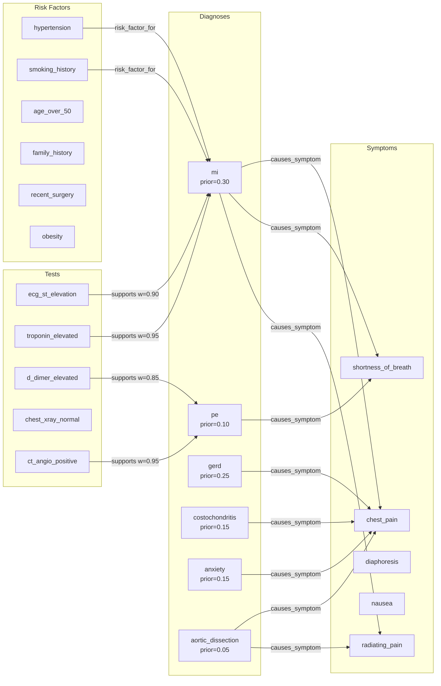

# Bayesian Medical Diagnosis Pipeline

> Emergency department chest pain evaluation using Bayesian posterior updating, belief distributions, and confidence assessment on a 26-node medical knowledge graph.

## 1. The Approach

A patient presents to the emergency department with chest pain. Six diagnoses are plausible: myocardial infarction (MI), pulmonary embolism (PE), GERD, costochondritis, anxiety, and aortic dissection. Evidence arrives sequentially (symptoms, ECG, lab results). The Bayesian subsystem updates the posterior probability of each diagnosis as each piece of evidence arrives, converging on MI with 99.2% probability after four updates.

This is the first Hyper3 example demonstrating the full Bayesian subsystem: `set_prior`, `update_belief`, `map_estimate`, `bayes_factor`, and `credible_set`. It also demonstrates belief distributions for ambiguous symptom interpretation and confidence assessment for identifying knowledge gaps.

## 2. A Simple Analogy

Imagine an ER doctor evaluating chest pain. Before running any tests, the doctor has prior beliefs based on prevalence: GERD is common, heart attacks are less frequent but more dangerous. Each test result revises those beliefs — an ECG showing ST elevation makes heart attack far more likely, while a normal D-dimer makes pulmonary embolism unlikely. The Bayesian framework formalizes this incremental reasoning: each test result updates a probability distribution over diagnoses, converging on the most probable cause.

## 3. Key Concepts

| Term | What it does |
|------|-------------|
| **Bayesian prior** | Initial probability distribution over diagnoses based on prevalence |
| **Posterior update** | Apply Bayes' rule to update probabilities as evidence arrives |
| **MAP estimate** | Most probable diagnosis after all evidence |
| **Bayes factor** | Quantifies how strongly evidence favors one hypothesis over another |
| **Credible set** | Smallest set of diagnoses covering 95% probability mass |
| **Belief distribution** | Holds multiple interpretations of an ambiguous concept with weighted probabilities |
| **Confidence assessment** | Scores each concept in the knowledge graph for reliability |

## 4. Quick Start

```bash
.venv/bin/python examples/showcase/belief/bayesian_medical_diagnosis/bayesian_medical_diagnosis.py
```

### What You'll See

```
======================================================================
SUMMARY
======================================================================
  1. Prior distribution established from prevalence data
  2. Sequential Bayesian updates converge to MI diagnosis
  3. MAP estimate and Bayes factor confirm MI
  4. Belief distributions handle ambiguous symptom interpretation
  5. Confidence assessment identifies knowledge gaps
  6. Graph: 26 nodes, 32 edges
```

## 5. The Scenario

A 26-node medical knowledge graph (22 built in Section 1, 1 Bayesian analysis node added in Section 2, 3 pain interpretations added in Section 5) with 32 edges covering six entity categories:

| Category | Count | Section added | Examples |
|----------|-------|--------------|---------|
| Symptoms | 5 | Section 1 | chest_pain, shortness_of_breath, radiating_pain |
| Diagnoses | 6 | Section 1 | mi, pe, gerd, costochondritis, anxiety, aortic_dissection |
| Test results | 5 | Section 1 | ecg_st_elevation, troponin_elevated, d_dimer_elevated |
| Risk factors | 6 | Section 1 | hypertension, smoking_history, age_over_50 |
| Bayesian analysis | 1 | Section 2 | differential_diagnosis |
| Pain interpretations | 3 | Section 5 | cardiac_chest_pain, gi_chest_pain, musculoskeletal_chest_pain |

Edge types: `causes_symptom` (diagnosis to symptom), `supports` (test to diagnosis), `risk_factor_for` (risk factor to diagnosis).

### Knowledge Graph Topology

Figure 1: Core graph of diagnoses, symptoms, tests, and risk factors (22 nodes, 32 edges). The `differential_diagnosis` node and pain interpretation nodes are added later.



## 6. Analysis Pipeline

### Section 1: Building the Medical Knowledge Graph
Creates 22 nodes (5 symptoms, 6 diagnoses, 5 tests, 6 risk factors) and 32 weighted edges representing diagnostic relationships. Edge weights represent the strength of each relationship (e.g., troponin_elevated supports mi with weight 0.95).

### Section 2: Initial Differential Diagnosis (Prior)
A Bayesian prior is established over six diagnoses using prevalence data: MI (0.30), GERD (0.25), costochondritis (0.15), anxiety (0.15), PE (0.10), aortic_dissection (0.05).

### Section 3: Evidence Accumulation
Four sequential Bayesian updates:

| Evidence | MI probability | KL divergence |
|----------|---------------|---------------|
| Prior | 0.300 | - |
| Chest pain + radiating pain | 0.444 | 0.084 bits |
| ECG ST elevation | 0.898 | 0.704 bits |
| Troponin elevated | 0.986 | 0.100 bits |
| D-dimer normal | 0.992 | 0.005 bits |

The posterior after ECG (0.444 to 0.898) is the largest single jump, reflecting the high specificity of ST elevation for MI (likelihood 0.90 for MI vs 0.10 for PE).

### KL Divergence per Evidence Piece

The KL divergence column shows how much each evidence piece shifts the distribution: chest pain symptoms (0.084 bits), ECG (0.704 bits), troponin (0.100 bits), D-dimer (0.005 bits). The ECG dominates because its likelihood distribution is the most peaked -- it strongly supports MI (0.90) while being near-zero for most alternatives.

### Bayes Factor Interpretation

A Bayes factor of 410.40 between MI and PE is classified as "decisive" (>100 on the standard scale). This means the accumulated evidence makes MI over 400 times more likely than PE relative to their prior odds. In clinical practice, this level of evidence is sufficient to rule in the diagnosis and begin treatment.

### Belief Distribution Sampling

The chest pain interpretation sampling (Section 5) is probabilistic. Given cardiac context weights (`cardiac_chest_pain: 3.0`, `gi_chest_pain: 0.5`, `musculoskeletal_chest_pain: 0.3`), the cardiac interpretation is most likely to be sampled, but non-cardiac interpretations occasionally appear. This reflects the real-world ambiguity of chest pain presentation.

## 8. Key Metrics

| Metric | Value |
|--------|-------|
| Graph nodes | 26 |
| Graph edges | 32 |
| Diagnoses | 6 |
| Bayesian evidence updates | 4 |
| Final MI posterior | 0.992 |
| Bayes factor (MI vs PE) | 410.40 |
| 95% credible set | `['mi']` |

## 9. What Makes This Different

**Sequential Bayesian updating** provides a principled framework for incremental evidence accumulation. Each update shifts the posterior via Bayes' rule, and KL divergence quantifies how much each piece of evidence changes beliefs. This is mathematically rigorous compared to ad hoc scoring systems.

**Formal hypothesis testing** via Bayes factors. A Bayes factor of 410 between MI and PE is not just "MI is more likely" -- it quantifies exactly how much the evidence favors MI over PE, allowing clinicians to distinguish between "moderately confident" and "decisively confirmed."

**Ambiguity-preserving representation.** Chest pain is not forced into a single interpretation. The belief distribution holds cardiac, GI, and musculoskeletal interpretations simultaneously, collapsing to a specific interpretation only when context demands it.

## 10. Code Implementation

```python
from hyper3 import HypergraphMemory

mem = HypergraphMemory(evolve_interval=0)

mem.add("mi", data={"type": "diagnosis"})
mem.add("pe", data={"type": "diagnosis"})
mem.link("ecg_st_elevation", "mi", label="supports", weight=0.90)
mem.link("troponin_elevated", "mi", label="supports", weight=0.95)

mem.add("differential_diagnosis", data={"type": "bayesian_analysis"})
mem.set_prior("differential_diagnosis", outcomes=["mi", "pe", "gerd"], weights=[0.30, 0.10, 0.25])

mem.update_belief("differential_diagnosis", evidence_name="ecg_st_elevation",
    likelihoods={"mi": 0.90, "pe": 0.10, "gerd": 0.05})

print(mem.map_estimate("differential_diagnosis"))
print(mem.bayes_factor("differential_diagnosis", hypothesis_a="mi", hypothesis_b="pe"))
```

## 11. Real-World Gap

- **Synthetic likelihoods.** The likelihood values (e.g., P(ST elevation | MI) = 0.90) are representative but should come from clinical studies.
- **No temporal dynamics.** Test results arrive sequentially in practice, and the timing matters (troponin peaks at specific hours post-onset).
- **Binary test results.** Real lab values are continuous; the example treats them as positive/negative.
- **Single patient.** A production system would maintain distributions across populations.
- **No learning from outcomes.** The priors are fixed; a real system would update priors based on confirmed diagnoses.

## 12. Reference

### API Methods

| Method | Purpose |
|--------|---------|
| `mem.set_prior(concept, outcomes, weights)` | Create a Bayesian prior distribution over named outcomes |
| `mem.update_belief(concept, evidence_name, likelihoods)` | Apply evidence via Bayes' rule |
| `mem.get_belief(concept)` | Retrieve current posterior distribution |
| `mem.map_estimate(concept)` | Return the most probable hypothesis |
| `mem.bayes_factor(concept, hypothesis_a, hypothesis_b)` | Compute cumulative Bayes factor |
| `mem.credible_set(concept, level)` | Smallest set covering probability mass |
| `mem.compute_all_confidences()` | Score every concept in the graph |
| `mem.flag_low_confidence(threshold)` | Find concepts below confidence threshold |

### Related Examples

| Example | Topic |
|---------|-------|
| `examples/showcase/belief/quantum_diagnostics/` | Belief layer for hypothesis management |
| `examples/showcase/reasoning/knowledge_reasoning/` | Rule-based inference and contradiction detection |
