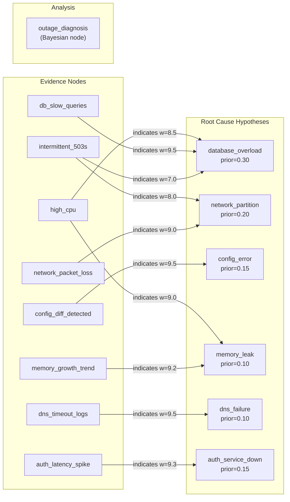

# Bayesian Belief Updating Showcase

> **Sequential Bayesian Reasoning for Incident Root Cause Analysis**

## 1. The Approach

During a production outage, evidence arrives piecemeal: first intermittent 503s, then high CPU, then slow database queries. Each observation changes which root cause is most likely. Bayesian updating formalizes this — each new piece of evidence revises the probability distribution over candidate root causes through Bayes' theorem.

**Why Bayesian updating instead of simple scoring?** A static scoring system assigns fixed weights to each symptom and sums them. This fails when symptoms are correlated (high CPU and slow queries both point at database overload) or when a single piece of evidence strongly discriminates between hypotheses (a config diff almost certainly means `config_error`). Bayesian updating accounts for these interactions: the posterior after observing high CPU already shifts probability toward `database_overload`, so when slow queries arrive next, they reinforce an already-strong hypothesis rather than adding an independent vote. The sequential structure also means the same evidence can be reinterpreted as priors change — `memory_growth_trend` barely moves the posterior at step 2, but after `db_slow_queries` concentrates probability, it becomes the signal that elevates `memory_leak` at step 4.

## 2. A Simple Analogy

Think of a doctor running a differential diagnosis. Before any tests, the doctor has prior beliefs based on symptoms and prevalence (flu is more likely than malaria in winter). Each lab result updates those beliefs — a positive strep test shifts probability away from flu toward bacterial infection. By the final test, the probability distribution has converged on a diagnosis. Bayesian updating does the same thing for infrastructure incidents.

## 3. Key Concepts

| Term | Plain English Meaning |
|------|----------------------|
| **Prior** | Initial belief about root cause probabilities, based on historical data |
| **Posterior** | Updated belief after observing evidence |
| **MAP estimate** | The root cause with the highest posterior probability |
| **Credible set** | The smallest set of root causes covering 95% of posterior probability |
| **Bayes factor** | How much the evidence favors one hypothesis over another, relative to prior odds |
| **Information gain** | How much a piece of evidence shifts the distribution, measured as KL divergence |
| **KL divergence** | A measure of how different two probability distributions are, in bits |

## 4. Quick Start

```bash
    .venv/bin/python examples/showcase/belief/bayesian_reasoning/bayesian_reasoning.py
```

### What You'll See

```
======================================================================
SUMMARY
======================================================================
  Graph: 15 nodes, 48 edges
  Root causes analyzed: 6
  Evidence observed:    6
  MAP root cause:       database_overload (P = 0.9299)
  95% credible set:     database_overload, memory_leak
  Bayes factor (H1/H2): 14.63 (strong)
  Most informative:     config_diff_detected (KL = 1.0200)
  Entropy reduction:    2.471 -> 0.501 bits
```

## 5. The Scenario

A production outage with 6 candidate root causes and 8 observable evidence types. Each evidence type has a likelihood (probability of observing that evidence given each root cause), and each root cause has a prior probability based on historical incident frequency.

### Knowledge Graph Topology

Figure 1: 15 nodes (6 root causes, 8 evidence types, 1 Bayesian analysis node) connected by 48 weighted indicator edges.



The graph stores likelihoods as edge weights (scaled to 1-10). Each evidence node connects to all 6 root causes with weights proportional to `P(evidence | cause)`. The `outage_diagnosis` node holds the Bayesian prior and posterior state.

## 6. Analysis Pipeline

The script runs 6 sections, each building on the previous. All Bayesian computations use Hyper3's built-in Bayesian subsystem (`bayes.set_prior`, `bayes.update`, `bayes.map`, `bayes.factor`, `bayes.credible`).

### Section 1: Building the Knowledge Graph

The graph has 15 nodes (6 root causes + 8 evidence types + 1 Bayesian analysis node) and 48 edges (each evidence node connects to all 6 causes via `indicates` edges with weights proportional to likelihoods). Every evidence node reaches all 6 causes — the discrimination comes from the weight differences.

### Section 2: Setting Prior Beliefs

`mem.bayes.set_prior("outage_diagnosis", outcomes=ROOT_CAUSES, weights=prior_weights)` creates a Bayesian prior distribution on the `outage_diagnosis` node. Priors reflect historical incident frequency: `database_overload` starts at 0.3000, `network_partition` at 0.2000, `config_error` and `auth_service_down` at 0.1500 each, `memory_leak` and `dns_failure` at 0.1000 each. The prior entropy is 2.471 bits out of a maximum 2.585 bits (near-uniform), meaning the priors provide little discrimination.

### Section 3: Sequential Evidence-Driven Updates

Six pieces of evidence arrive in order. Each call to `mem.bayes.update("outage_diagnosis", evidence=..., likelihoods=...)` applies Bayes' rule and returns an `UpdateResult` with the prior snapshot, posterior snapshot, and KL divergence from the update. The posterior shifts after each:

| Step | Evidence | Top Cause | P(top) | Key Shift |
|------|----------|-----------|--------|-----------|
| 1 | `intermittent_503s` | `database_overload` | 0.3256 | `network_partition` rises to 0.2481 (503s are consistent with network issues) |
| 2 | `high_cpu` | `database_overload` | 0.6018 | `database_overload` jumps +0.2762 — high CPU strongly discriminates toward DB and memory_leak |
| 3 | `db_slow_queries` | `database_overload` | 0.8441 | Near-certainty for DB — slow queries are the strongest DB signal (likelihood 0.95) |
| 4 | `memory_growth_trend` | `database_overload` | 0.7993 | `memory_leak` rises from 0.0627 to 0.1821 — memory evidence competes with DB |
| 5 | `network_packet_loss` | `database_overload` | 0.9099 | DB recovers — packet loss lowers memory_leak probability and confirms DB over network |
| 6 | `config_diff_detected` | `database_overload` | 0.9299 | `config_error` rises from 0.0022 to 0.0211, but DB remains dominant |

**Why the order matters:** At step 4, `memory_growth_trend` pulls probability toward `memory_leak` because the high likelihood (0.92) for memory_leak combined with its moderate prior produces a meaningful update. If this evidence had arrived before `db_slow_queries`, the intermediate posterior would have been more uncertain. The Bayesian framework handles this correctly — the final posterior is the same regardless of observation order (commutativity of multiplication).

### Section 4: MAP Estimate and Credible Set

`mem.bayes.map("outage_diagnosis")` returns `database_overload` with P = 0.9299. `mem.bayes.credible("outage_diagnosis", level=0.95)` returns a 2-member credible set:

| Root Cause | P(cause\|data) | Cumulative |
|------------|----------------|------------|
| `database_overload` | 0.9299 | 0.9299 |
| `memory_leak` | 0.0212 | 0.9511 |

Four causes are excluded: `config_error` (0.0211), `network_partition` (0.0197), `auth_service_down` (0.0079), `dns_failure` (0.0001). The credible set covering 95.11% with only 2 members reflects how concentrated the posterior has become.

### Section 5: Bayes Factor Comparison

`mem.bayes.factor("outage_diagnosis", hypothesis_a=..., hypothesis_b=...)` computes the cumulative Bayes factor for `database_overload` over each alternative, accounting for prior odds:

| Hypothesis | BF | Strength |
|------------|-----|----------|
| vs `memory_leak` | 14.63 | strong |
| vs `config_error` | 22.04 | strong |
| vs `network_partition` | 31.40 | strong |
| vs `auth_service_down` | 58.88 | strong |
| vs `dns_failure` | 2355.21 | decisive |

The prior odds for `database_overload` vs `memory_leak` were 3.0000 (0.30/0.10). The posterior odds are 43.8859. The Bayes factor of 14.63 means the evidence multiplies the prior odds by 14.63x. Against `dns_failure`, the Bayes factor is 2355.21 — the evidence overwhelmingly rules out DNS failure as a plausible cause.

**Bayes factor thresholds:**

| BF Range | Strength | Interpretation |
|----------|----------|----------------|
| 1-3 | weak | Evidence barely favors one hypothesis |
| 3-10 | substantial | Evidence moderately favors one hypothesis |
| 10-100 | strong | Evidence clearly favors one hypothesis |
| > 100 | decisive | Evidence overwhelmingly favors one hypothesis |

### Section 6: Information Gain Analysis

Each evidence piece is ranked by how much it shifts the prior distribution (KL divergence, measured independently in bits):

| Evidence | KL(posterior\|\|prior) |
|----------|------------------------|
| `config_diff_detected` | 1.0200 |
| `memory_growth_trend` | 0.7505 |
| `network_packet_loss` | 0.4123 |
| `db_slow_queries` | 0.4107 |
| `high_cpu` | 0.3651 |
| `intermittent_503s` | 0.0415 |

`config_diff_detected` is the most informative single piece of evidence (KL = 1.0200 bits) because its likelihood distribution is the most peaked — it strongly favors `config_error` (0.95) and is near-zero for everything else. This makes it a powerful discriminator even though `config_error` ended up unlikely given the other evidence.

The cumulative information gain across sequential updates is 1.0047 bits. Each update's KL divergence is available from the `UpdateResult.kl_divergence` field returned by `update_belief()`. Entropy drops from 2.471 bits (prior) to 0.501 bits (final posterior) — a reduction of 1.970 bits, meaning the 6 observations eliminated roughly 80% of the initial uncertainty.

## 7. Understanding the Output

### Posterior Probability Shifts

The delta columns in Section 3 show how each evidence observation redistributes probability. Positive deltas mean a cause became more likely; negative deltas mean it became less likely. The key pattern: `database_overload` steadily accumulates probability except at step 4, where `memory_growth_trend` temporarily shifts some probability to `memory_leak`.

### Why Step 4 Temporarily Lowers the Leader

`memory_growth_trend` has likelihood 0.92 for `memory_leak` but only 0.30 for `database_overload`. When it arrives while `database_overload` is at 0.8441, the update pulls probability toward `memory_leak` (+0.1194). Step 5 (`network_packet_loss`) then reverses this — it has low likelihood for `memory_leak` (0.05) and moderate likelihood for `database_overload` (0.25), shifting probability back.

### Credible Set Interpretation

A 2-member credible set from 6 candidates means the evidence has concentrated 95.11% of the probability mass onto just `database_overload` and `memory_leak`. In an operational context, this means: investigate the database first, keep memory leak as a fallback, and deprioritize the other four causes.

### KL Divergence Units

All KL divergence values in this showcase use base-2 logarithms (bits). The `UpdateResult.kl_divergence` field from `update_belief()` measures KL(posterior || prior) in bits. The independent information gain in Section 6 also uses bits, computed via the same formula applied against the original prior.

## 8. Key Metrics

| Metric | Value |
|--------|-------|
| Graph nodes | 15 |
| Graph edges | 48 |
| Root cause nodes | 6 |
| Evidence nodes | 8 |
| Prior entropy | 2.471 bits |
| Max entropy | 2.585 bits |
| Observations applied | 6 |
| Final posterior (database_overload) | 0.9299 |
| Final posterior (memory_leak) | 0.0212 |
| Final posterior (config_error) | 0.0211 |
| Final posterior (network_partition) | 0.0197 |
| Final posterior (auth_service_down) | 0.0079 |
| Final posterior (dns_failure) | 0.0001 |
| MAP estimate | database_overload |
| 95% credible set size | 2 / 6 |
| Credible set coverage | 0.9511 |
| Bayes factor (H1/H2) | 14.63 (strong) |
| Bayes factor (H1 vs dns_failure) | 2355.21 (decisive) |
| Most informative evidence | config_diff_detected (KL = 1.0200) |
| Cumulative information gain | 1.0047 bits |
| Final posterior entropy | 0.501 bits |
| Entropy reduction | 1.970 bits |

## 9. What Makes This Different

**Sequential updating produces a progressively refining diagnosis.** After just 3 observations (intermittent 503s, high CPU, slow queries), the posterior for `database_overload` is already 0.8441. An on-call engineer could start investigating the database with high confidence while the system continues to process incoming evidence. Steps 4-6 then test that hypothesis against alternatives (memory leak, config error, network issues) and confirm it.

**Static scoring cannot do this.** If you scored each root cause by summing likelihoods across all evidence, the scores would not be probabilities — they would not sum to 1, would not account for prior frequency, and would not show how confidence changes as evidence accumulates. Bayesian updating produces a proper probability distribution at every step, with clear uncertainty quantification (credible sets, entropy).

**Information gain ranking identifies the most diagnostic observations.** Knowing that `config_diff_detected` has the highest KL divergence (1.0200 bits) tells you which observation to prioritize collecting first in future incidents. This is actionable: if you can only run one diagnostic check, check for config diffs first.

**Built-in Bayesian API.** This showcase uses Hyper3's Bayesian subsystem directly — `set_prior`, `update_belief`, `map_estimate`, `bayes_factor`, and `credible_set` — rather than implementing Bayes' rule manually. The knowledge graph stores the likelihood network as weighted `indicates` edges for reference, but the actual inference uses the library's `BayesianLayer` engine.

## 10. Code Implementation

```python
from hyper3 import HypergraphMemory

mem = HypergraphMemory(evolve_interval=0)

for cause in ROOT_CAUSES:
    mem.add(cause, data={"type": "root_cause", "prior": PRIORS[cause]})

for evidence in EVIDENCE_NODES:
    mem.add(evidence, data={"type": "evidence"})

mem.add("outage_diagnosis", data={"type": "bayesian_analysis"})
mem.bayes.set_prior("outage_diagnosis", outcomes=ROOT_CAUSES,
              weights=[0.30, 0.20, 0.15, 0.10, 0.10, 0.15])

for evidence_name in OBSERVATION_ORDER:
    result = mem.bayes.update(
        "outage_diagnosis",
        evidence=evidence_name,
        likelihoods=LIKELIHOODS[evidence_name],
    )
    print(f"KL divergence: {result.kl_divergence:.4f} bits")

map_est = mem.bayes.map("outage_diagnosis")
bf = mem.bayes.factor("outage_diagnosis", hyp_a="database_overload",
                      hyp_b="memory_leak")
credible = mem.bayes.credible("outage_diagnosis", level=0.95)
```

The knowledge graph stores the likelihood network as weighted `indicates` edges (weights = likelihood x 10). The Bayesian updates use `bayes.update()`, which applies Bayes' rule: `P(cause | evidence) proportional to P(evidence | cause) * P(cause)`. Each `UpdateResult` contains the prior snapshot, posterior snapshot, KL divergence, and per-hypothesis Bayes factors.

## 11. Real-World Gap

This showcase uses hand-specified likelihoods and priors. Production deployment would require:

- **Likelihood calibration:** The likelihood values (e.g., P(high_cpu | database_overload) = 0.85) are expert estimates. Real systems would need to learn these from historical incident data — for each past incident, record which root cause was confirmed and which symptoms were observed, then compute empirical conditional frequencies.
- **Prior specification:** Priors reflect historical base rates. New services or rare failure modes have unreliable priors. Organizations would need to maintain and update prior distributions as their infrastructure evolves.
- **Continuous evidence streams:** This showcase treats evidence as binary (observed or not). Real monitoring produces continuous signals (latency percentiles, error rates over time). Extending the framework to continuous likelihood functions or thresholded evidence would be required.
- **Conditional independence:** The Bayesian update assumes evidence is conditionally independent given the root cause. In practice, `high_cpu` and `memory_growth_trend` are correlated even when conditioning on the cause. Naive Bayes can still produce well-calibrated posteriors for ranking purposes, but the absolute probabilities may be overconfident.
- **Multiple simultaneous causes:** The framework assumes a single root cause. Real incidents often involve cascading failures where multiple causes contribute simultaneously.

## 12. Reference

### API Methods Used

| Method | Purpose |
|--------|---------|
| `HypergraphMemory(evolve_interval=0)` | Create memory with deterministic behavior |
| `mem.add(concept, data=...)` | Create a node with typed data |
| `mem.link(source, target, label=..., weight=...)` | Create a directed edge with semantic label and weight |
| `mem.bayes.set_prior(concept, outcomes, weights)` | Create a Bayesian prior distribution over named outcomes |
| `mem.bayes.update(concept, evidence, likelihoods)` | Apply evidence via Bayes' rule, returning `UpdateResult` with prior, posterior, and KL divergence |
| `mem.bayes.get(concept)` | Retrieve current posterior distribution |
| `mem.bayes.map(concept)` | Return the label of the most probable hypothesis |
| `mem.bayes.factor(concept, hyp_a, hyp_b)` | Compute the cumulative Bayes factor between two hypotheses |
| `mem.bayes.credible(concept, level)` | Return smallest hypothesis set exceeding probability threshold |
| `mem.neighbors(concept, edge_label=..., direction=...)` | Query neighbors filtered by edge label and direction |

### Related Examples

| Example | Focus |
|---------|-------|
| `examples/showcase/reasoning/multiway_reasoning/` | Multi-hypothesis parallel reasoning |
| `examples/showcase/domain/microservices_reasoning/` | Causal chain analysis in microservices |
| `examples/showcase/belief/bayesian_medical_diagnosis/` | Bayesian updating for medical diagnosis |
| `examples/showcase/belief/adaptive_learning/adaptive_learning.py` | Thompson sampling for adaptive parameter selection
