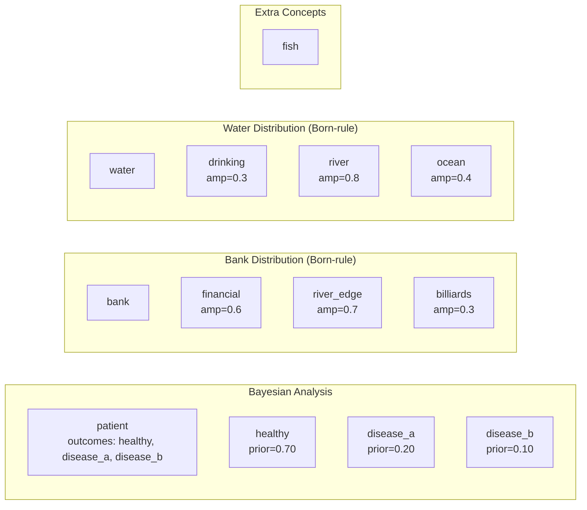

# Belief Distributions and Bayesian Updating

> **Born-Rule Sampling and Sequential Bayesian Inference on a 13-Node Graph**

## 1. The Approach

This showcase demonstrates two probabilistic reasoning mechanisms: Bayesian belief updating (where evidence revises a prior distribution over hypotheses) and Born-rule belief distributions (where ambiguous concepts are represented as complex-amplitude states sampled via the Born rule). Both operate on the hypergraph's belief layer -- no edges are required. The 13-node graph stores concepts as nodes, and all probabilistic state lives in the belief/Bayesian subsystem.

**Why Bayesian updating instead of fixed rules?** A rule-based system assigns static labels (e.g., "if fever then flu"). This breaks when multiple hypotheses explain the same evidence (fever is consistent with flu, COVID, and strep). Bayesian updating multiplies prior probabilities by likelihoods for each observed piece of evidence, producing a posterior that accounts for all competing explanations simultaneously. Each new observation revises the distribution, and the MAP estimate shifts only when the evidence genuinely favors one hypothesis over others.

**Why Born-rule distributions?** Ambiguous concepts like "bank" have multiple valid interpretations (financial institution, river edge, billiards shot). Representing these as discrete categories with equal weight ignores that some interpretations are more salient. Born-rule distributions assign complex amplitudes to each outcome, and sampling produces outcomes with probability proportional to |amplitude|^2. This gives a principled mechanism for context-dependent disambiguation -- correlated distributions bias sampling so that observing one concept's outcome shifts another's probabilities.

## 2. A Simple Analogy

Think of a doctor running a differential diagnosis. Before any tests, the doctor has prior beliefs based on prevalence (healthy is most likely). Each test result updates those beliefs -- a positive fever result shifts probability away from healthy toward disease. By the final test, the probability distribution has converged on a diagnosis. Bayesian updating does this with math instead of intuition.

For ambiguous words, imagine looking at the word "bank" next to a river vs. in a financial district. Your brain resolves the meaning from surrounding context. Born-rule distributions formalize this: each interpretation has a weight, and correlation between word senses propagates context from one concept to another.

## 3. Key Concepts

| Term | Plain English Meaning |
|------|----------------------|
| **Prior** | Initial probability distribution over hypotheses before evidence |
| **Posterior** | Updated distribution after applying Bayes' theorem to evidence |
| **MAP estimate** | The hypothesis with the highest posterior probability |
| **Bayes factor** | Ratio of posterior odds to prior odds -- measures how much evidence shifts relative belief between two hypotheses |
| **Born-rule distribution** | Probabilistic state with complex amplitudes; sampling probability = \|amplitude\|^2 |
| **Concept correlation** | Linking two Born-rule distributions so sampling one biases the other |
| **Credible set** | Smallest set of hypotheses whose cumulative probability exceeds a threshold (e.g., 90%) |
| **Reset** | Return a distribution to uniform, allowing reuse of the same node |

## 4. Quick Start

```bash
    .venv/bin/python examples/showcase/belief/belief_and_bayesian/belief_and_bayesian.py
```

### What You'll See

```
======================================================================
SECTION 1: BAYESIAN BELIEF UPDATING
======================================================================

  Setting prior and updating with evidence

prior:
  healthy                   0.7000
  disease_a                 0.2000
  disease_b                 0.1000

posterior (after fever evidence):
  disease_a                 0.6154
  healthy                   0.2692
  disease_b                 0.1154

MAP estimate: disease_a

posterior (after lab results):
  disease_a                 0.9028
  disease_b                 0.0752
  healthy                   0.0219

updated MAP estimate: disease_a
Bayes factor (disease_a vs disease_b): 6.00

======================================================================
SECTION 2: BORN-RULE BELIEF DISTRIBUTIONS
======================================================================
...
sampling distribution (100 trials):
     river_edge:  53 ( 53.0%) ...
      financial:  32 ( 32.0%) ...
      billiards:  15 ( 15.0%) ...

======================================================================
SECTION 4: CREDIBLE SET
======================================================================
 90% credible set for patient diagnosis: ['disease_a']
...
======================================================================
DONE
```

Exact sampling counts in Section 2 vary across runs due to probabilistic sampling. The rank order (river_edge > financial > billiards) is stable.

## 5. The Scenario

A 13-node graph with two independent subsystems and no edges. All probabilistic state lives in the belief/Bayesian layer, not in graph edges.

### Node Categories

| Category | Count | Examples |
|----------|-------|---------|
| Bayesian entities | 4 | patient, healthy, disease_a, disease_b |
| Ambiguous senses (bank) | 4 | bank, financial, river_edge, billiards |
| Ambiguous senses (water) | 3 | drinking, river, ocean |
| Extra concepts | 2 | water, fish |

### Knowledge Graph Topology

Figure 1: The 13 nodes form two independent groups. Bayesian analysis operates on the patient group (left). Born-rule distributions operate on the sense groups (right). No edges connect any nodes.



The correlation link between `river_edge` and `river` (correlation = +0.9) is not shown as a graph edge -- it lives in the belief layer's correlation matrix, separate from the hypergraph topology.

## 6. Analysis Pipeline

### Section 1: Bayesian Belief Updating

A patient has three possible states: `healthy` (prior 0.700), `disease_a` (prior 0.200), and `disease_b` (prior 0.100). The prior heavily favors healthy -- disease is unlikely before seeing any evidence.

First evidence: fever. The likelihoods encode how probable fever is under each hypothesis: `healthy` = 0.1, `disease_a` = 0.8, `disease_b` = 0.3. After updating, the posterior shifts to `disease_a` = 0.615 -- fever is 8x more likely under `disease_a` than under `healthy`, which overwhelms the prior. The MAP estimate becomes `disease_a`.

Second evidence: lab results. Likelihoods: `healthy` = 0.05, `disease_a` = 0.9, `disease_b` = 0.4. The posterior for `disease_a` rises to 0.903. The Bayes factor for `disease_a` vs `disease_b` is 6.00 -- the accumulated evidence multiplies the prior odds (2:1) by 6x, producing posterior odds of 12:1.

**Why this matters:** The prior said healthy was most likely (70%). Two pieces of evidence reversed that completely. Without Bayesian updating, there is no principled way to combine the prior base rate with the likelihoods from fever and lab results into a single probability distribution.

### Section 2: Born-Rule Belief Distributions

The ambiguous concept "bank" is represented as a Born-rule distribution over three outcomes: `financial` (amplitude 0.6), `river_edge` (amplitude 0.7), `billiards` (amplitude 0.3). Sampling produces each outcome with probability proportional to |amplitude|^2:

| Outcome | Amplitude | \|Amp\|^2 | Normalized P | Observed (100 samples) |
|---------|-----------|-----------|--------------|----------------------|
| `river_edge` | 0.7 | 0.49 | 0.521 | ~53% |
| `financial` | 0.6 | 0.36 | 0.383 | ~34% |
| `billiards` | 0.3 | 0.09 | 0.096 | ~13% |

**Why this matters:** A simple categorical distribution assigns fixed probabilities. Born-rule amplitudes support interference effects -- when distributions are correlated (Section 3), the effective probabilities shift based on observations of related concepts. This provides a mechanism for context-dependent interpretation that flat probability weights cannot reproduce.

### Section 3: Concept Correlation

Two fresh distributions are created and linked with pairwise correlation coefficients. The "bank" distribution (`financial`, `river_edge`, `billiards`) is correlated with a water-context distribution (`drinking`, `river`, `ocean`). High positive correlation between `river_edge` and `river` (0.9) means that sampling `river_edge` from the bank distribution biases the water distribution toward `river`, and vice versa.

Sampling from the bank distribution yields an outcome (probabilistic -- varies across runs). The correlation structure means that if `river_edge` is sampled, the water distribution is biased toward `river`.

**Why this matters:** Without correlation, each distribution samples independently. This means disambiguating "bank" as `river_edge` has no effect on the interpretation of nearby water-related terms. Correlation creates a mechanism where one observation propagates context to related concepts -- the same mechanism that allows humans to resolve ambiguous words from surrounding context.

### Section 4: Credible Set and Reset

The 90% credible set for the patient's diagnosis is `['disease_a']` alone -- `disease_a`'s posterior (0.903) exceeds 90%, so no other hypothesis is needed to reach the threshold. This means a decision-maker can act on `disease_a` with 90%+ confidence without hedging.

After calling `bayes.reset`, the distribution returns to uniform (0.333 each). This allows reusing the same concept for a new inference session without creating a new node.

## 7. Understanding the Output

### Bayesian Posterior Values

The posteriors are computed via Bayes' rule: `P(hypothesis | evidence) proportional to P(evidence | hypothesis) * P(hypothesis)`. After fever, the numerator for `disease_a` is `0.8 * 0.2 = 0.16`, while the total across all hypotheses is `0.07 + 0.16 + 0.03 = 0.26`, giving `0.16 / 0.26 = 0.6154`. These are exact values, not approximations.

### Born-Rule Sampling Variability

The sampling counts (e.g., river_edge: 53/100) vary across runs because sampling is probabilistic. Over many runs, the counts converge to the normalized probabilities (river_edge: 52.1%, financial: 38.3%, billiards: 9.6%). The rank order is stable: river_edge always dominates.

### Bayes Factor Interpretation

| BF Range | Strength |
|----------|----------|
| 1-3 | Weak |
| 3-10 | Substantial |
| 10-100 | Strong |
| > 100 | Decisive |

A Bayes factor of 6.00 is "substantial" -- the evidence clearly favors `disease_a` over `disease_b` but is not yet decisive. Additional evidence (e.g., a highly specific test) could push the factor above 10.

### Credible Set

A 90% credible set containing a single hypothesis means that hypothesis alone accounts for >90% of the posterior probability. No fallback plan is needed. If the credible set contained two hypotheses, both would need to be prepared for.

## 8. Key Metrics

| Metric | Value |
|--------|-------|
| Graph nodes | 13 |
| Graph edges | 0 |
| Prior (healthy) | 0.700 |
| Prior (disease_a) | 0.200 |
| Prior (disease_b) | 0.100 |
| Posterior after fever (healthy) | 0.269 |
| Posterior after fever (disease_a) | 0.615 |
| Posterior after fever (disease_b) | 0.115 |
| Posterior after lab results (healthy) | 0.022 |
| Posterior after lab results (disease_a) | 0.903 |
| Posterior after lab results (disease_b) | 0.075 |
| MAP estimate | disease_a |
| Bayes factor (disease_a vs disease_b) | 6.00 |
| 90% credible set | ['disease_a'] |
| Born-rule expected P (river_edge) | 0.521 |
| Born-rule expected P (financial) | 0.383 |
| Born-rule expected P (billiards) | 0.096 |
| Prior after reset | uniform (0.333 each) |

## 9. What Makes This Different

**Bayesian updating produces calibrated probabilities, not scores.** The posterior after fever evidence is 0.615 for `disease_a` -- this means the hypothesis has 61.5% of the total probability mass. A scoring system that sums likelihoods (0.8 + 0.9 = 1.7 for `disease_a`) produces unbounded numbers with no probabilistic semantics. The Bayesian posterior sums to 1.0 across all hypotheses and updates correctly as evidence accumulates.

**Born-rule distributions provide context-sensitive disambiguation.** Standard approaches to ambiguous concepts pick the most frequent interpretation or use a fixed weight vector. Born-rule amplitudes support correlation between distributions -- sampling one concept biases related concepts through the correlation matrix. This creates a disambiguation mechanism that responds to surrounding context, not just individual word frequencies.

**Credible sets quantify decision confidence.** Knowing that the 90% credible set contains only `disease_a` tells a decision-maker they can act on that diagnosis without maintaining fallback plans. If the credible set contained two hypotheses, the decision-maker would know to prepare for both. This is actionable uncertainty quantification that point estimates (MAP alone) do not provide.

## 10. Code Implementation

### Bayesian updating

```python
from hyper3 import HypergraphMemory

mem = HypergraphMemory(evolve_interval=0)

mem.add("patient", data={"type": "entity"})
mem.add("healthy", data={"type": "state"})
mem.add("disease_a", data={"type": "state"})
mem.add("disease_b", data={"type": "state"})

mem.bayes.set_prior("patient", outcomes=["healthy", "disease_a", "disease_b"],
              weights=[0.7, 0.2, 0.1])

mem.bayes.update("patient", evidence="fever",
                  likelihoods={"healthy": 0.1, "disease_a": 0.8, "disease_b": 0.3})

estimate = mem.bayes.map("patient")
bf = mem.bayes.factor("patient", hyp_a="disease_a", hyp_b="disease_b")
cs = mem.bayes.credible("patient", level=0.9)
```

### Born-rule distributions and correlation

```python
mem.add("bank", data={"type": "ambiguous"})
mem.belief.create(
    ["financial", "river_edge", "billiards"],
    amplitudes=[0.6, 0.7, 0.3],
)
sample = mem.belief.sample("financial")

mem.belief.correlate(
    ["financial", "river_edge", "billiards"],
    ["drinking", "river", "ocean"],
    correlations={
        ("river_edge", "river"): 0.9,
        ("financial", "river"): -0.5,
    },
)
```

## 11. Real-World Gap

This showcase uses hand-specified likelihoods, priors, and correlation coefficients. Production deployment would require:

- **Likelihood calibration:** The values `P(fever | disease_a) = 0.8` are expert estimates. Real systems would learn likelihoods from historical data -- for each past case, record which diagnosis was confirmed and which symptoms were observed, then compute empirical conditional frequencies.
- **Prior maintenance:** Priors reflect base rates (healthy is 70% likely before evidence). New diseases, changing populations, and seasonal effects make priors stale. Organizations would need to periodically re-estimate priors from recent case data.
- **Continuous evidence:** This showcase treats evidence as discrete observations (fever present or absent). Real clinical data includes continuous signals (temperature, lab values). Extending the framework to continuous likelihood functions would be required.
- **Conditional independence assumption:** The Bayesian update assumes evidence is conditionally independent given the diagnosis. In practice, fever and lab results may be correlated even when conditioning on the disease. Naive Bayes can still produce well-calibrated rankings, but absolute probabilities may be overconfident.
- **Sampling variability:** Born-rule sampling is stochastic. Two runs with the same amplitudes produce different sample counts. Applications requiring deterministic disambiguation would need to use the amplitude weights directly rather than sampling.

## 12. Reference

### API Methods Used

| Method | Purpose |
|--------|---------|
| `HypergraphMemory(evolve_interval=0)` | Create memory with deterministic behavior |
| `mem.add(concept, data=...)` | Create a node with typed data |
| `mem.bayes.set_prior(concept, outcomes, weights)` | Set initial probability distribution over outcomes |
| `mem.bayes.update(concept, evidence, likelihoods)` | Apply Bayesian update with evidence likelihoods |
| `mem.bayes.get(concept)` | Retrieve current belief distribution |
| `mem.bayes.map(concept)` | Return the outcome with highest posterior probability |
| `mem.bayes.factor(concept, hyp_a, hyp_b)` | Compute evidence ratio between two hypotheses |
| `mem.bayes.credible(concept, level)` | Return smallest hypothesis set exceeding probability threshold |
| `mem.bayes.reset(concept)` | Reset distribution to uniform |
| `mem.belief.create(outcomes, amplitudes)` | Create Born-rule distribution with complex amplitudes |
| `mem.belief.sample(concept)` | Sample an outcome via the Born rule |
| `mem.belief.correlate(outcomes_a, outcomes_b, correlations)` | Link two distributions with pairwise correlations |

### Related Examples

| Example | Focus |
|---------|-------|
| `examples/showcase/belief/bayesian_reasoning/` | Multi-hypothesis root cause analysis with information gain |
| `examples/showcase/reasoning/multiway_reasoning/` | Parallel rule application with state convergence |
| `examples/showcase/belief/adaptive_learning/adaptive_learning.py` | Thompson sampling for adaptive parameter selection |
