# Managing Competing Hypotheses Under Uncertainty

> Production outage hypothesis management using belief distributions, weighted sampling, correlation, interference detection, entropy, Bayesian posterior updating, and confidence assessment on a 63-node incident graph.

## 1. The Approach

When a production service goes down, multiple root causes are plausible. Evidence arrives incrementally and is often noisy. The belief layer in Hyper3 represents each hypothesis as an outcome in a probability distribution with complex-valued amplitudes. Sampling selects a hypothesis proportional to `|amplitude|^2` (the Born rule). Correlation records pairwise relationships between hypothesis groups. Interference detection flags whether evidence sources reinforce or contradict each other. Von Neumann entropy quantifies the overall uncertainty of the belief state.

This is not quantum computing. It is classical probability with notation borrowed from quantum mechanics. The script's own Section 7 compares the belief layer against Bayesian inference and finds them mathematically equivalent for this use case. The belief layer adds value when hypotheses have genuine interference (negative correlations between outcomes), not for simple hypothesis ranking.

## 2. A Simple Analogy

Imagine five doctors looking at the same patient. Each has a different diagnosis. Instead of arguing, they write their confidence on a whiteboard and normalize so the confidences sum to 100%. When a lab result arrives, the doctor whose diagnosis it supports becomes more confident, and the others become less confident. The whiteboard always shows the current aggregate belief. Sampling picks a diagnosis proportional to the updated confidences.

If two lab results agree (both point to the same diagnosis), the confidence goes up more than either alone -- constructive interference. If they disagree, confidence goes down -- destructive interference. The entropy score tells you how spread out the beliefs are: low entropy means the doctors are converging, high entropy means they are still uncertain.

## 3. Key Concepts

| Term | What it actually does |
|------|----------------------|
| Distribution | Holds multiple candidate hypotheses with weights, normalized so total probability = 1. Without explicit amplitudes, you get a uniform prior modified by spreading activation. |
| Sample | Weighted random selection. The Born rule (`p ~ |amplitude|^2`) produces a probability distribution. Sampling picks one outcome proportional to that distribution. |
| Context weights | Multipliers applied during sampling. Higher context weight means a hypothesis is more likely to be selected. This is equivalent to multiplying a prior by a likelihood. |
| Correlation | A pairwise correlation matrix between two groups of hypotheses. When one hypothesis is observed, `predict()` returns the correlated value for each partner hypothesis. |
| Interference | Compares `|sum(amplitudes)|^2` vs `sum(|amplitude|^2)` for a hypothesis that appears with multiple amplitudes. Constructive = agreeing evidence, destructive = conflicting evidence. |
| Density matrix | The outer product `rho = |psi><psi|` of the amplitude vector. For pure states, has one nonzero eigenvalue (=1). For mixed states, eigenvalues reflect the probability distribution. |
| Von Neumann entropy | `S = -Tr(rho log2 rho)`. For pure states, always 0. For mixed states, equals Shannon entropy. Measures uncertainty of the state (pure vs mixed), not uncertainty of the distribution. |
| Born rule | Sampling probability = `|amplitude|^2`. This is the mathematical rule that converts complex amplitudes into observable probabilities. |

## 4. Quick Start

```bash
.venv/bin/python examples/showcase/belief/quantum_diagnostics/11_quantum_diagnostics.py
```

Expected output (7 sections):

```
SECTION 1: Building the Incident Knowledge Graph
  Nodes: 62
  Edges: 104
  Root cause hypotheses: 5
  Evidence nodes: 14

SECTION 2: Distribution = Maintaining Competing Hypotheses
  Distribution of 5 hypotheses (uniform prior + spreading activation):
    certificate_expiry        prob=0.2213
    memory_leak_api           prob=0.2229
    dns_resolution_failure    prob=0.2116
    db_connection_pool_exhaustion  prob=0.2006
    kafka_partition_rebalance prob=0.1435
  Total probability: 1.0000

SECTION 3: Sample = Evidence-Driven Hypothesis Selection
  certificate_expiry sampled 40.7% (highest context weight = 3.5)
  dns_resolution_failure sampled 20.8%
  db_connection_pool_exhaustion sampled 18.3%
  memory_leak_api sampled 11.3%
  kafka_partition_rebalance sampled 8.9%

SECTION 4: Correlation = Correlated Hypotheses
  dns_failure <-> db_pool_exhaustion: +0.6
  cert_expiry <-> memory_leak: +0.2
  cert_expiry <-> db_pool_exhaustion: -0.1

SECTION 5: Interference = Evidence Reinforcement and Contradiction
  Constructive (amplitudes +0.7, +0.5): net=1.3950
  Destructive (amplitudes +0.7, -0.5): net=0.2325

SECTION 6: Density Matrix and Von Neumann Entropy
  Confident mixed state (90/8/2): 0.541188 bits
  Moderate mixed state (60/30/10): 1.295462 bits
  Maximally uncertain (4 equal): 2.000000 bits
  Pure state: ~0 bits (always 0 for pure states)

SECTION 7: Honest Comparison with Bayesian Inference
  For this use case, belief layer is equivalent to Bayesian inference.
```

## 5. The Scenario

A production outage investigation with 62 nodes and 104 edges across six categories:

| Category | Count | Examples |
|----------|-------|---------|
| Root causes | 6 | `certificate_expiry`, `dns_resolution_failure`, `memory_leak_api` |
| Symptoms | 9 | `error_rate_spike`, `connection_timeouts`, `ssl_handshake_failures` |
| Evidence | 14 | `log_ssl_cert_invalid`, `alert_ssl_expiry_0_days`, `metric_dns_timeout_5s` |
| Services | 6 | `auth_service`, `payment_service`, `order_service` |
| Infrastructure | 6 | `postgres_primary`, `redis_cluster`, `kafka_cluster` |
| Responders + Runbooks | 9 | `oncall_sre`, `runbook_cert_rotation`, `incident_commander` |
| Timeline | 8 | `t0_alert_triggered` through `t7_resolved` |
| Impact | 4 | `customer_facing_errors`, `revenue_at_risk`, `sla_breach_risk` |

Edge types: `causes_symptom` (root cause to symptom), `supports` (evidence to root cause), `depends_on` (service to infrastructure), `affects` (root cause to infrastructure), `correlated_with` (root cause to root cause), `assigned_to` (responder/runbook to cause), `timeline_link` (event to entity), `causes_impact` (symptom to impact), `affects_service` (outage to service).

```mermaid
graph TD
    subgraph Root Causes
        CE[certificate_expiry]
        DNS[dns_resolution_failure]
        DB[db_connection_pool_exhaustion]
        ML[memory_leak_api]
        KP[kafka_partition_rebalance]
        DC[deploy_bad_config]
    end

    subgraph Symptoms
        ERS[error_rate_spike]
        CT[connection_timeouts]
        SHF[ssl_handshake_failures]
        LI[latency_increase]
        MP[memory_pressure]
        QB[queue_backlog]
        PO[partial_outage]
    end

    subgraph Evidence
        LCI[log_ssl_cert_invalid]
        ASE[alert_ssl_expiry_0_days]
        LCR[log_connection_refused]
        ACB[alert_circuit_breaker_open]
        MDB[metric_db_pool_active_95pct]
        MDT[metric_dns_timeout_5s]
        MHG[metric_heap_growth_trend]
        MKC[metric_kafka_consumer_lag]
        DLC[deploy_last_commit_config_change]
        LDR[log_dns_resolution_slow]
        MGP[metric_gc_pause_increase]
        LKR[log_kafka_rebalance_event]
        ERD[evidence_recent_deploy_rollback]
        END[evidence_no_dns_issues_other_services]
    end

    subgraph Services
        AUTH[auth_service]
        PAY[payment_service]
        ORD[order_service]
    end

    subgraph Infrastructure
        PG[postgres_primary]
        RED[redis_cluster]
        KAF[kafka_cluster]
        DNS_S[dns_server]
        VLT[vault_secrets]
        LB[load_balancer]
    end

    CE --> SHF
    CE --> CT
    CE --> ERS
    CE --> PO
    DNS --> CT
    DNS --> LI
    DNS --> ERS
    DB --> CT
    DB --> ERS
    DB --> PO
    DB --> QB
    ML --> MP
    ML --> LI
    ML --> ERS
    KP --> QB
    KP --> LI
    KP --> PO

    LCI --> CE
    ASE --> CE
    LCR --> CE
    LCR --> DB
    ACB --> DB
    ACB --> DNS
    ACB --> DC
    MDB --> DB
    MDT --> DNS
    MHG --> ML
    MKC --> KP
    DLC --> DC

    CE -.-> VLT
    CE -.-> LB
    DNS -.-> DNS_S
    DB -.-> PG
    KP -.-> KAF
    ML -.-> AUTH
    ML -.-> ORD

    CE ~~~ DNS
    DB ~~~ ML
    DC ~~~ KP
```



## 6. Analysis Pipeline

### Section 1: Building the Incident Knowledge Graph

The script constructs a 62-node, 104-edge hypergraph representing a production outage. Six root cause hypotheses are stored with severity, MTTR, and frequency metadata. Nine observed symptoms connect to causes via `causes_symptom` edges. Fourteen evidence nodes carry source, timestamp, and confidence fields. The graph includes service dependency chains, responder assignments, timeline events, and impact nodes.

Why this structure matters: the edges provide the connectivity that spreading activation uses to shift initial distribution weights. A root cause with more supporting evidence and symptom connections receives slightly higher activation, producing a non-uniform prior even without explicit amplitudes.

### Section 2: Distribution = Maintaining Competing Hypotheses

The script creates a distribution over five root cause hypotheses (excluding `deploy_bad_config`). Without explicit amplitudes, the distribution starts from spreading activation rather than a flat uniform prior:

| Hypothesis | Amplitude | Probability |
|------------|-----------|-------------|
| `memory_leak_api` | 0.4721 | 0.2229 |
| `certificate_expiry` | 0.4705 | 0.2213 |
| `dns_resolution_failure` | 0.4600 | 0.2116 |
| `db_connection_pool_exhaustion` | 0.4479 | 0.2006 |
| `kafka_partition_rebalance` | 0.3789 | 0.1435 |

The probabilities are close to uniform (0.20 each) but `kafka_partition_rebalance` is lower (0.1435) due to less graph connectivity. Total probability is 1.0000.

Why this matters: the distribution maintains all hypotheses simultaneously. No hypothesis is discarded until evidence forces a choice. Without this, an engineer would need to track a mental list of candidates and manually update confidences.

### Section 3: Sample = Evidence-Driven Hypothesis Selection

Context weights derived from evidence severity are applied during sampling:

| Hypothesis | Context Weight | Expected Posterior |
|------------|---------------|-------------------|
| `certificate_expiry` | 3.5 | 40.7% |
| `dns_resolution_failure` | 1.8 | 20.9% |
| `db_connection_pool_exhaustion` | 1.5 | 17.4% |
| `memory_leak_api` | 1.0 | 11.6% |
| `kafka_partition_rebalance` | 0.8 | 9.3% |

The high weight for `certificate_expiry` reflects strong SSL-related evidence (confidence 0.92 for `log_ssl_cert_invalid`, 0.95 for `alert_ssl_expiry_0_days`). Over 1000 sampling trials, `certificate_expiry` is selected 40.7% of the time. A comparison with `np.random.choice` using the same probabilities produces a matching distribution (41.7% for certificate_expiry).

Why this matters: sampling converts a multi-valued belief into a concrete decision point. The context mechanism lets you inject evidence without modifying the underlying distribution -- the same distribution can be sampled with different context weights for different evidence scenarios.

### Section 4: Correlation = Correlated Hypotheses

The script creates a correlation matrix between two groups of hypotheses:

- **Group A** (network/security): `certificate_expiry`, `dns_resolution_failure`
- **Group B** (application/database): `memory_leak_api`, `db_connection_pool_exhaustion`

Key correlations:

| Pair | Correlation | Interpretation |
|------|------------|---------------|
| `dns_failure` <-> `db_pool_exhaustion` | +0.6 | DNS issues stress the DB pool |
| `cert_expiry` <-> `memory_leak` | +0.2 | Weak positive |
| `cert_expiry` <-> `db_pool_exhaustion` | -0.1 | Slightly anti-correlated |
| `dns_failure` <-> `memory_leak` | +0.15 | Weak positive |

When `certificate_expiry` is observed via `sample_correlated()`, the system returns predictions for the correlated hypotheses in Group B.

Why this matters: real incidents often involve multiple interacting causes. A DNS failure can cascade into a database connection pool exhaustion. The correlation matrix captures these dependencies explicitly, so observing one hypothesis updates expectations about others.

### Section 5: Interference = Evidence Reinforcement and Contradiction

The script creates two distributions with duplicate hypotheses to demonstrate interference:

**Constructive** (both evidence sources agree on `certificate_expiry`):
- Amplitudes: `[+0.70, +0.50]`
- Net amplitude: 1.3950
- Classification: CONSTRUCTIVE

**Destructive** (one source supports `dns_resolution_failure`, another contradicts):
- Amplitudes: `[+0.70, -0.50]`
- Net amplitude: 0.2325
- Classification: DESTRUCTIVE

The interference computation compares `|sum(amplitudes)|^2` against `sum(|amplitude|^2)`. When amplitudes point in the same direction (both positive or both negative), the result is larger. When they oppose, the result is smaller.

Why this matters: during an incident, you may receive conflicting evidence. The same metric (connection timeouts) could support DNS failure or certificate expiry. Interference detection surfaces this conflict rather than hiding it in an aggregate score.

### Section 6: Density Matrix and Von Neumann Entropy

Entropy values for different belief states:

| State Type | Distribution | Entropy (bits) |
|-----------|-------------|---------------|
| Mixed, confident | 90% / 8% / 2% | 0.541188 |
| Mixed, moderate | 60% / 30% / 10% | 1.295462 |
| Mixed, maximally uncertain | 25% / 25% / 25% / 25% | 2.000000 |
| Pure state | any | ~0 (always) |

The maximally uncertain state has entropy = `log2(4) = 2.000000` bits, the theoretical maximum for 4 outcomes.

The pure state caveat: the script creates a distribution with amplitudes `[0.6, 0.3, 0.1]` (Shannon entropy 0.857331 bits), but the Von Neumann entropy is ~0. This is because a pure state has full knowledge of the amplitude vector -- the "uncertainty" is in the measurement outcome, not in the state description itself. For practical hypothesis uncertainty, use Shannon entropy of the probability distribution.

Why this matters: entropy gives a single number for "how uncertain are we?" A confident diagnosis has low entropy; a wild guess has high entropy. Tracking entropy over time shows whether the investigation is converging.

### Section 7: Bayesian Posterior Updating

While the belief layer represents uncertainty, the Bayesian subsystem reduces it by applying Bayes' rule as evidence arrives. Starting from a uniform prior over five root causes, three sequential evidence updates converge on certificate_expiry:

| Evidence | certificate_expiry | db_pool | dns_failure | memory_leak | kafka |
|----------|-------------------|---------|-------------|-------------|-------|
| Prior | 0.200 | 0.200 | 0.200 | 0.200 | 0.200 |
| SSL alert + cert logs | 0.727 | 0.086 | 0.128 | 0.043 | 0.017 |
| No DNS issues other services | 0.913 | 0.046 | 0.023 | 0.015 | 0.003 |
| DB pool metrics moderate | 0.922 | 0.056 | 0.009 | 0.012 | 0.001 |

After all evidence, certificate_expiry has 92.2% posterior probability with a Bayes factor of 99.17 against the second hypothesis (strong evidence). The 95% credible set contains certificate_expiry and db_connection_pool_exhaustion.

Why this matters: the Bayesian subsystem provides the same functionality as `sample()` with context weights, but with explicit prior-posterior tracking, KL divergence measurement, and formal hypothesis testing. It is the clearer API for sequential evidence accumulation.

### Section 8: Confidence Assessment and Knowledge Gaps

After Bayesian analysis identifies the most probable root cause, the confidence subsystem evaluates how reliable each part of the knowledge graph is. Each concept receives a confidence score based on provenance depth and graph structure. The section traces confidence chains from root causes to impact nodes and flags low-confidence areas as knowledge gaps.

Why this matters: even when Bayesian analysis converges on a diagnosis, individual concepts in the knowledge graph may have varying reliability. Confidence scoring surfaces weak areas where additional relationships or evidence would improve diagnostic quality.

### Section 9: Honest Comparison with Bayesian Inference

The script explicitly compares the belief layer against Bayesian inference:

| Belief Layer Operation | Bayesian Equivalent |
|-----------------------|-------------------|
| Distribution | Prior distribution over hypotheses |
| Sample with context | Sampling from posterior (context = likelihood) |
| Correlation | Structured prior over correlated hypotheses |
| Interference | Bayes factor aggregation |
| Von Neumann entropy (mixed states) | Shannon entropy |

Advantages of the belief layer:
- Natural syntax for correlated hypothesis groups
- Built-in uncertainty quantification via entropy
- Density matrix provides a full covariance-like state descriptor

Disadvantages:
- Mathematical overhead for what is fundamentally Bayesian updating
- No quantum speedup (runs on classical hardware)
- Von Neumann entropy is 0 for pure states, which is counterintuitive
- Unitary evolution (Hadamard, phase gates) has no clear Bayesian analog and is hard to interpret in a hypothesis management context

## 7. Understanding Output

### Distribution probabilities

Probabilities near 0.20 with spreading activation mean the graph provides weak evidence. A probability of 0.14 (as for `kafka_partition_rebalance`) indicates less graph connectivity supporting that hypothesis.

### Sampling frequency

A sampling frequency matching the expected posterior (e.g., 40.7% vs 40.7%) confirms the context mechanism works as intended. Minor deviations (e.g., 18.3% vs 17.4%) are normal sampling variance over 1000 trials.

### Correlation predictions

`sample_correlated()` returns predictions for partner hypotheses when one hypothesis is observed. A prediction value of `certific` or `opposite` indicates the label was truncated in display -- the actual prediction values reflect the correlation coefficients.

### Interference classification

- **CONSTRUCTIVE**: net amplitude > expected from individual amplitudes. Evidence sources agree.
- **DESTRUCTIVE**: net amplitude < expected. Evidence sources disagree.
- **NEUTRAL**: neither constructive nor destructive.

### Entropy values

- Below 1.0 bit: investigation is converging, one hypothesis dominates.
- 1.0-1.5 bits: moderate uncertainty, 2-3 hypotheses are plausible.
- Above 1.5 bits: high uncertainty, evidence is inconclusive.
- 0 bits for a pure state: mathematical property, not a meaningful uncertainty measure.

## 8. Key Metrics

| Metric | Value |
|--------|-------|
| Graph nodes | 63 |
| Graph edges | 104 |
| Root cause hypotheses | 5 |
| Evidence nodes | 14 |
| Services | 6 |
| Infrastructure nodes | 6 |
| Responders + runbooks | 9 |
| Timeline events | 8 |
| Impact nodes | 4 |
| Distribution outcomes | 5 |
| Max hypothesis probability (spreading activation) | 0.2229 (`memory_leak_api`) |
| Min hypothesis probability (spreading activation) | 0.1435 (`kafka_partition_rebalance`) |
| Certificate expiry context weight | 3.5 |
| Certificate expiry sampling frequency (1000 trials) | 40.7% |
| DNS resolution failure sampling frequency | 20.8% |
| DB pool exhaustion sampling frequency | 18.3% |
| Memory leak sampling frequency | 11.3% |
| Kafka rebalance sampling frequency | 8.9% |
| Constructive interference net amplitude | 1.3950 |
| Destructive interference net amplitude | 0.2325 |
| Confident mixed state entropy | 0.541188 bits |
| Moderate mixed state entropy | 1.295462 bits |
| Maximally uncertain entropy (4 outcomes) | 2.000000 bits |
| Pure state entropy | ~0 bits |
| Shannon entropy of pure state probs | 0.857331 bits |
| Max correlation | +0.6 (`dns_failure` <-> `db_pool_exhaustion`) |
| Min correlation | -0.1 (`cert_expiry` <-> `db_pool_exhaustion`) |
| Bayesian MAP estimate | `certificate_expiry` (92.2% posterior) |
| Bayes factor (cert_expiry vs dns_failure) | 99.17 (strong evidence) |
| 95% credible set | [`certificate_expiry`, `db_connection_pool_exhaustion`] |

## 9. What Makes This Different

**Ambiguity-preserving representation.** The distribution maintains all hypotheses simultaneously with probability weights. No hypothesis is discarded until evidence forces a collapse. This is useful when early evidence is noisy and premature elimination of a hypothesis would delay the investigation.

**Interference detection for conflicting evidence.** When two evidence sources disagree about a hypothesis, the destructive interference pattern surfaces this conflict. Standard aggregation (averaging, voting) hides the disagreement behind a single score. The amplitude-based computation makes the conflict visible through the `is_constructive` / `is_destructive` flags.

**Correlation between hypothesis groups.** The correlation matrix links hypothesis groups (e.g., network causes and database causes) so that observing one cause updates expectations about the other group. Without this, each hypothesis is evaluated independently, and cascading failures are harder to reason about.

**Honesty about limitations.** The belief layer is mathematically equivalent to Bayesian inference for this use case. The quantum formalism (amplitudes, density matrices, Born rule) provides notation, not additional computational power. For simple hypothesis ranking, plain Bayesian code is clearer and faster. The formalism adds value when concepts have genuine interference patterns (negative correlations between outcomes).

## 10. Code Implementation

```python
from hyper3 import HypergraphMemory
import numpy as np

mem = HypergraphMemory(evolve_interval=0)

mem.add("certificate_expiry", data={"category": "security", "severity": "critical"})
mem.add("dns_resolution_failure", data={"category": "network", "severity": "critical"})
mem.link("log_ssl_cert_invalid", "certificate_expiry", label="supports")
mem.link("alert_ssl_expiry_0_days", "certificate_expiry", label="supports")

hypotheses = [
    "certificate_expiry", "dns_resolution_failure",
    "db_connection_pool_exhaustion", "memory_leak_api",
    "kafka_partition_rebalance",
]

qs = mem.belief.create(outcomes=hypotheses)
for outcome in qs.outcomes:
    print(f"{outcome.label}: probability={outcome.probability:.4f}")

context = {
    "certificate_expiry": 3.5,
    "dns_resolution_failure": 1.8,
    "db_connection_pool_exhaustion": 1.5,
    "memory_leak_api": 1.0,
    "kafka_partition_rebalance": 0.8,
}
answer = mem.sample(qs, context=context)

ent = mem.belief.correlate(
    group_a=["certificate_expiry", "dns_resolution_failure"],
    group_b=["memory_leak_api", "db_connection_pool_exhaustion"],
    correlations={
        ("dns_resolution_failure", "db_connection_pool_exhaustion"): 0.6,
        ("certificate_expiry", "db_connection_pool_exhaustion"): -0.1,
    },
)

qs_agg = mem.belief.create(
    outcomes=["certificate_expiry", "certificate_expiry"],
    amplitudes=[0.7, 0.5],
    use_context=False,
)
patterns = mem.belief.interactions(qs_agg)
for p in patterns:
    print(f"{p.is_constructive}: net={p.net_amplitude:.4f}")

rho = np.eye(3, dtype=complex) / 3
entropy = mem.belief.von_neumann_entropy(rho)
print(f"Max entropy for 3 outcomes: {entropy:.6f} bits")
```

## 11. Real-World Gap

- **Synthetic graph.** The 62-node graph is hand-constructed. A real incident graph would need ETL from monitoring systems (Prometheus, Datadog), log aggregators (ELK, Splunk), and ticketing systems (PagerDuty, Jira). The belief layer operates on whatever graph you construct; it does not automate evidence collection.
- **Evidence weights are manual.** Context weights (3.5 for certificate_expiry, 0.8 for kafka_partition_rebalance) are assigned by the script, not learned from historical incidents. A production system would need a feedback loop that adjusts weights based on past incident resolution accuracy.
- **Correlation is specified, not discovered.** The correlation matrix (e.g., DNS failure correlates +0.6 with DB pool exhaustion) is hand-coded. Discovering these correlations from incident history would require a separate statistical analysis pipeline.
- **Scale is untested.** The showcase runs on 62 nodes. Performance with thousands of hypotheses and evidence nodes is uncharacterized. The density matrix computation is O(n^2) in the number of hypotheses.
- **No temporal dynamics.** The script models a single point in time. Real incidents evolve: evidence arrives sequentially, hypotheses gain and lose support. The belief layer supports temporal decay (`decay_stale_states()`) but the showcase does not demonstrate it.
- **Interference is a proxy.** The constructive/destructive classification is a heuristic for evidence agreement. It does not detect subtle contradictions (e.g., evidence that is consistent individually but jointly impossible).
- **Sampling is non-deterministic.** Results vary across runs. The 40.7% sampling frequency for `certificate_expiry` was observed in one run; a different seed produces different counts. Statistical testing (chi-squared) would be needed to verify the distribution in production.

## 12. Reference

### API Methods

| Method | Purpose |
|--------|---------|
| `mem.belief.create(concepts, amplitudes, use_context_field)` | Creates a belief state over the given concepts. Without amplitudes, uses spreading activation from graph connectivity. |
| `mem.sample(qs, context)` | Samples one outcome proportional to `|amplitude|^2 * context_weight`. Returns the selected node. |
| `mem.correlate(group_a, group_b, correlations)` | Creates a correlation matrix between two hypothesis groups. |
| `mem.sample_correlated(qs, observed_label)` | Samples correlated outcomes given an observation. |
| `mem.compute_interactions(qs)` | Computes interference patterns for duplicate hypotheses in a distribution. Returns `is_constructive`, `is_destructive`, `net_amplitude`. |
| `mem.belief.von_neumann_entropy(rho)` | Computes `S = -Tr(rho log2 rho)` for a density matrix. |
| `mem.belief.compute_density_matrix(qs_id)` | Computes `rho = |psi><psi|` for a quantum state. |
| `mem.set_prior(concept, outcomes, weights)` | Creates a Bayesian prior distribution over named outcomes. |
| `mem.update_belief(concept, evidence_name, likelihoods)` | Applies evidence via Bayes' rule, returning posterior and KL divergence. |
| `mem.get_belief(concept)` | Retrieves the current posterior distribution. |
| `mem.map_estimate(concept)` | Returns the label of the most probable hypothesis. |
| `mem.bayes_factor(concept, hypothesis_a, hypothesis_b)` | Computes the cumulative Bayes factor between two hypotheses. |
| `mem.credible_set(concept, level)` | Returns the smallest set of hypotheses covering `level` probability mass. |
| `mem.compute_all_confidences()` | Computes confidence scores for every concept in the graph. |
| `mem.compute_confidence(concept)` | Computes a single concept's confidence score. |
| `mem.flag_low_confidence(threshold)` | Finds concepts below a confidence threshold. |
| `mem.trace_confidence_chain(source, target)` | Finds the highest-confidence path between two concepts. |

### Related Examples

- `examples/showcase/` -- additional belief layer demonstrations
- `ai/agents_conventions.md` -- Born rule sampling conventions and probabilistic testing guidelines

### Glossary

- **Born rule**: Probability of sampling an outcome = `|amplitude|^2`. This converts complex amplitudes to real probabilities.
- **Density matrix**: Matrix `rho = |psi><psi|` (pure state) or `sum(w_i |psi_i><psi_i|)` (mixed state). Encodes the full state of a belief.
- **Von Neumann entropy**: `S = -Tr(rho log2 rho)`. 0 for pure states, equals Shannon entropy for mixed states.
- **Pure state**: A single amplitude vector. Entropy is always 0 because the state is fully specified.
- **Mixed state**: A statistical ensemble of pure states. Entropy measures the spread of the ensemble.
- **Constructive interference**: Evidence sources agree. `|a1 + a2|^2 > |a1|^2 + |a2|^2`.
- **Destructive interference**: Evidence sources disagree. `|a1 + a2|^2 < |a1|^2 + |a2|^2`.
