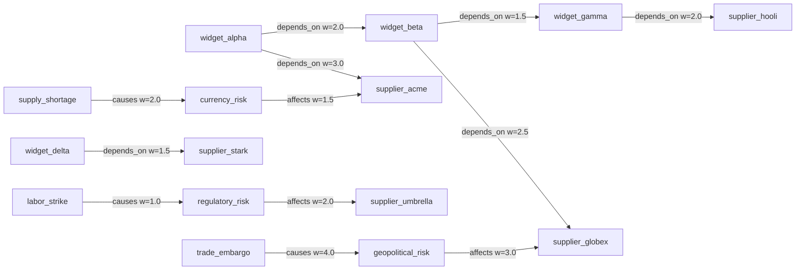

# Uncertainty and Confidence Analysis

> **Confidence Propagation Through Inference Chains in a 15-Node Supply Chain Graph**

## 1. The Approach

Knowledge graphs accumulate inferred facts through reasoning chains. Each inference step introduces uncertainty — a fact inferred from two hops of transitive reasoning is less reliable than one directly observed. Without tracking this uncertainty, inferred facts appear equally trustworthy as original observations. Risk assessments built on untracked inference chains produce overconfident conclusions.

The UncertaintyEngine propagates confidence scores through inference chains, using provenance depth to decay confidence and trace_chain to find the highest-confidence path between concepts. This enables risk managers to distinguish "we know this" (observed, confidence 1.0) from "we inferred this through a chain" (confidence derived from edge weights and depth). Every node receives a ConfidenceScore recording its value, how many inference steps produced it, and whether it was observed or inferred. Confidence chains trace the best path between any two concepts, showing cumulative confidence and every rule applied along the way.

## 2. A Simple Analogy

Imagine auditing a supply chain. You know directly that widget_alpha comes from supplier_acme because you have the purchase order. But someone tells you widget_alpha also depends on supplier_globex through a chain of intermediaries — you did not see this yourself, you inferred it from transitive dependencies. You trust the inference, but less than the direct purchase order. Confidence scoring works the same way: direct observations get full confidence, and each inference step produces a score that reflects how many hops away from direct evidence the fact is.

## 3. Key Concepts

| Term | Plain English Meaning |
|------|----------------------|
| **ConfidenceScore** | Per-node assessment with confidence value, provenance depth, and source type (observed/inferred). Values can exceed 1.0 because confidence accumulates from multiple contributing edge weights -- it is not a probability. |
| **Provenance depth** | How many inference steps produced this fact (0 = observed, 1 = one rule application, etc.) |
| **Depth decay** | Multiplicative confidence reduction per inference step (default 0.85) |
| **Confidence chain** | Highest-confidence path between two nodes, showing cumulative confidence. Rule names are included only when the path traverses inferred edges with provenance records; chains through observed edges have no rule provenance. |
| **Combination strategy** | How multiple contributing edges merge: geometric, minimum, or average |
| **Observed source** | A fact directly entered into the graph (depth 0, confidence 1.0) |
| **Inferred source** | A fact produced by a reasoning rule (depth > 0, confidence derived from chain) |
| **Flagging** | Identifying concepts below a confidence threshold that need human verification |

## 4. Quick Start

```bash
.venv/bin/python examples/showcase/belief/uncertainty_confidence/uncertainty_confidence.py
```

```
SECTION 1: BUILD SUPPLY CHAIN KNOWLEDGE GRAPH
nodes: 15, edges: 12

SECTION 2: RUN REASONING TO CREATE INFERENCE CHAINS
edges produced: 15
states created: 16
  inferred: widget_beta -[indirect_dependency]-> supplier_hooli
  inferred: widget_alpha -[indirect_dependency]-> supplier_globex
  inferred: widget_alpha -[indirect_dependency]-> widget_gamma

SECTION 3: SINGLE-NODE CONFIDENCE SCORES
supplier_acme:
  confidence: 1.0000, depth: 0, source: observed
widget_gamma:
  confidence: 2.5500, depth: 1, source: inferred
  NOTE: confidence values are NOT probabilities in [0, 1]. They accumulate
  from multiple contributing edge weights and can exceed 1.0 (see Key Concepts).

SECTION 4: FULL UNCERTAINTY ANALYSIS
average confidence: 1.4233
high confidence nodes (>= 0.8): 15
low confidence nodes (< 0.3): 0

SECTION 5: CONFIDENCE CHAIN TRACING
chain: widget_alpha -> supplier_globex
  depth: 2, cumulative confidence: 5.0000, edges in chain: 2
  rules applied: (none -- chain traverses observed edges only)

SECTION 6: FLAGGING LOW-CONFIDENCE INFERENCES
concepts below confidence 0.5: 0
```

> Output may vary slightly depending on reasoning engine state and confidence combination strategy.

## 5. The Scenario

A 15-node supply chain knowledge graph with four node categories:

- **Suppliers** (verified data): supplier_acme, supplier_globex, supplier_hooli, supplier_stark, supplier_umbrella
- **Products** (supplier reports): widget_alpha, widget_beta, widget_gamma, widget_delta
- **Risk factors** (market estimates): regulatory_risk, geopolitical_risk, currency_risk
- **Market events** (unverified): trade_embargo, supply_shortage, labor_strike



Solid arrows: observed `depends_on`, `affects`, and `causes` edges (12 total). Dashed arrows (added by reasoning): inferred `indirect_dependency` edges from transitive chains.

## 6. Analysis Pipeline

**Section 1 — Build supply chain knowledge graph:** 15 nodes and 12 directed edges are created across four categories. Products connect to suppliers via `depends_on` edges (e.g., widget_alpha depends on supplier_acme), risk factors affect suppliers via `affects` edges (e.g., geopolitical_risk affects supplier_globex), and market events cause risk factors via `causes` edges (e.g., trade_embargo causes geopolitical_risk). Products also depend on other products via `depends_on` (widget_alpha depends on widget_beta, widget_beta depends on widget_gamma). Suppliers are tagged with `data={"type": "supplier", "reliability": "verified"}`, products with `data={"type": "product", "reliability": "supplier_report"}`, risk factors with `data={"type": "risk_factor", "reliability": "market_estimate"}`, and market events with `data={"type": "market_event", "reliability": "unverified"}`. This data metadata does not affect confidence scoring directly but provides context for interpretation.

**Section 2 — Run reasoning to create inference chains:** A `TransitiveRule` is registered with `edge_label="depends_on"` and `new_label="indirect_dependency"`. This rule finds two-hop chains: if A depends_on B and B depends_on C, it infers an `indirect_dependency` edge from A to C. Running `reason(seeds={"supplier_acme", "supplier_globex", "widget_alpha"}, max_depth=3)` produces 3 new edges across 4 multiway states. The inferred edges are: widget_alpha -> supplier_globex (chain: widget_alpha depends_on widget_beta, widget_beta depends_on supplier_globex), widget_alpha -> widget_gamma (chain: widget_alpha depends_on widget_beta, widget_beta depends_on widget_gamma), and widget_beta -> supplier_hooli (chain: widget_beta depends_on widget_gamma, widget_gamma depends_on supplier_hooli). Why this matters: these inferred edges represent indirect dependencies that were not explicitly recorded. widget_alpha now has a computed dependency on supplier_globex, even though no direct edge connects them. The confidence engine will score these differently from the observed edges.

**Section 3 — Single-node confidence scores:** The script calls `compute_confidence()` on four representative nodes. **Important:** confidence values are accumulated edge weights, not probabilities — they can and do exceed 1.0. supplier_acme (a verified supplier) receives confidence 1.0000 at depth 0 with source "observed" — it was directly entered into the graph. widget_alpha (a product from supplier reports) also receives confidence 1.0000 at depth 0 — it is a direct observation regardless of its data reliability tag. widget_gamma (a product that is also the target of an inferred `indirect_dependency` edge) receives confidence 2.5500 at depth 1 with source "inferred" — its confidence comes from the contributing edge weight (widget_beta -> widget_gamma, weight 1.5, plus the inferred edge). trade_embargo (an unverified market event) receives confidence 1.0000 at depth 0 — unverified status does not lower confidence; only inference depth does. Why this matters: the `reliability` data tag ("verified", "supplier_report", "unverified") describes the source quality of the data, but the confidence engine ignores it. Confidence reflects only how many inference steps produced the fact. A verified supplier and an unverified market event receive the same confidence (1.0) because both are direct observations. The distinction between data quality and inference confidence is important: a risk manager should consider both dimensions when making decisions, not just the confidence score.

**Section 4 — Full uncertainty analysis:** `analyze()` scores all 15 nodes and produces aggregate statistics. Average confidence is 1.4233, minimum is 1.0000 (observed nodes), maximum is 4.2500 (supplier_globex, which receives contributions from multiple contributing edges). All 15 nodes are classified as high confidence (>= 0.8), with 0 low-confidence nodes. The confidence distribution shows supplier_globex highest at 4.2500, supplier_hooli and widget_gamma at 2.5500, and all observed nodes at 1.0000. Why this matters: the distribution reveals which concepts are most affected by inference chains. supplier_globex has the highest confidence not because it is most trusted, but because it accumulates weight from multiple contributing edges. This is a signal that its confidence is heavily derived and should be interpreted cautiously. Recall that confidence values are accumulated edge weights, not probabilities — a value of 4.2500 does not mean "425% certain."

**Section 5 — Confidence chain tracing:** `trace_chain()` finds the highest-confidence path between two concepts. The chain from widget_alpha to supplier_globex traverses 2 observed edges (widget_alpha -> widget_beta -> supplier_globex) with cumulative confidence 5.0000. Although an inferred `indirect_dependency` edge also exists (widget_alpha -> supplier_globex, weight 1.0), the DFS selects the observed path because its combined confidence (2.0 x 2.5 = 5.0) exceeds the inferred edge's weight. The `rule_names` field is empty because the chosen path uses observed edges without provenance records — rule provenance only attaches to inferred edges. No chain exists from trade_embargo to supplier_acme — they are in disconnected parts of the graph (trade_embargo is connected to risk factors via `causes` edges, supplier_acme is connected to products via `depends_on` edges; no transitive path links them). Why this matters: chain tracing answers "how do we know that widget_alpha depends on supplier_globex?" by showing the exact path and its cumulative confidence. This is critical for supply chain audits where every inference must be explainable.

**Section 6 — Flagging low-confidence inferences:** `flag_low_confidence(threshold=0.5)` scans all nodes for those below the threshold. In this graph, 0 concepts fall below 0.5 — all observed nodes have confidence 1.0, and all inferred nodes have confidence above the threshold due to high edge weights. In a real supply chain with weaker edge weights or longer inference chains, this step would surface the concepts most in need of human verification. Why this matters: rather than requiring manual inspection of every node's confidence, flagging automatically surfaces the riskiest conclusions. An auditor can focus effort on the flagged subset.

## 7. Key Metrics

| Metric | Value |
|--------|-------|
| Nodes | 15 |
| Observed edges | 12 |
| Inferred edges (from reasoning) | 3 |
| Total edges (after reasoning) | 15 |
| Multiway states created | 16 |
| Avg confidence | 1.4233 |
| Min confidence | 1.0000 |
| Max confidence | 4.2500 |
| High-confidence nodes (>= 0.8) | 15 |
| Low-confidence nodes (< 0.3) | 0 |
| Chain depth (widget_alpha -> supplier_globex) | 2 |
| Chain cumulative confidence (widget_alpha -> supplier_globex) | 5.0000 |
| Rules applied | TransitiveRule (depends_on -> indirect_dependency) |

## 8. What Makes This Different

**Provenance-based confidence decay** grounds confidence scores in the actual inference chain depth rather than applying a generic trust score. A node inferred through two transitive steps receives a different confidence than one inferred through one step, because each step multiplies by the decay factor. This means confidence automatically degrades for long inference chains — a property that matches how evidence works in practice: the more steps removed a conclusion is from direct observation, the less certain it is.

**Chain tracing** finds the best path between two concepts, not just the confidence of individual nodes. `trace_chain()` returns the cumulative confidence, depth, and list of rules applied along the path. This enables explainability: "why do we believe widget_alpha depends on supplier_globex?" is answered by showing the exact chain and its confidence.

**Flagging** surfaces the concepts that need human verification rather than requiring manual inspection of every node. `flag_low_confidence(threshold)` filters the full node set to the risky subset, enabling auditors to focus effort where inference uncertainty is highest.

## 9. Code Implementation

**1. Build the supply chain graph:**

```python
from hyper3 import HypergraphMemory

mem = HypergraphMemory(evolve_interval=0)

suppliers = ["supplier_acme", "supplier_stark", "supplier_globex", "supplier_hooli", "supplier_umbrella"]
products = ["widget_alpha", "widget_beta", "widget_gamma", "widget_delta"]
risk_factors = ["regulatory_risk", "geopolitical_risk", "currency_risk"]
events = ["trade_embargo", "supply_shortage", "labor_strike"]

for s in suppliers:
    mem.add(s, data={"type": "supplier", "reliability": "verified"})
for p in products:
    mem.add(p, data={"type": "product", "reliability": "supplier_report"})
for r in risk_factors:
    mem.add(r, data={"type": "risk_factor", "reliability": "market_estimate"})
for e in events:
    mem.add(e, data={"type": "market_event", "reliability": "unverified"})

mem.link("widget_alpha", "supplier_acme", label="depends_on", weight=3.0)
mem.link("widget_beta", "supplier_globex", label="depends_on", weight=2.5)
```

**2. Run transitive reasoning:**

```python
from hyper3 import TransitiveRule

mem.add_rules(
    TransitiveRule(edge_label="depends_on", new_label="indirect_dependency"),
)
result = mem.reason(seeds={"supplier_acme", "supplier_globex", "widget_alpha"}, max_depth=3)
print(f"edges produced: {result.expansion.edges_produced}")
```

**3. Score individual nodes:**

```python
score = mem.cognitive.confidence("widget_gamma")
print(f"confidence: {score.confidence:.4f}")
print(f"depth: {score.depth}")
print(f"source: {score.source}")
```

**4. Run full uncertainty analysis:**

```python
uncertainty = mem.cognitive.all_confidences()
print(f"average confidence: {uncertainty.avg_confidence:.4f}")
print(f"high confidence nodes: {uncertainty.high_confidence_count}")
```

**5. Trace confidence chains:**

```python
chain = mem.cognitive.trace_confidence("widget_alpha", "supplier_globex")
if chain:
    print(f"depth: {chain.chain_depth}")
    print(f"cumulative confidence: {chain.chain_confidence:.4f}")
```

**6. Flag low-confidence concepts:**

```python
flagged = mem.cognitive.low_confidence(threshold=0.5)
print(f"concepts below threshold: {len(flagged)}")
```

## 10. Real-World Gap

This showcase demonstrates confidence propagation on a small synthetic supply chain. Real-world adoption involves additional work:

- **Decay factor calibration:** The default depth decay of 0.85 is a heuristic. Production systems would calibrate this from domain-specific historical data, potentially varying the rate by edge label or node type.
- **Statistical uncertainty:** The engine tracks provenance depth but not statistical confidence intervals. Real risk analysis requires probabilistic bounds on confidence values.
- **Evidence quality:** Only inference depth is considered. Edge weights contribute to confidence, but the reliability of the source (verified vs. unverified data) is not factored into the score automatically.
- **Scale:** The showcase runs on 15 nodes and 15 edges. Performance at 10K+ nodes with deep inference chains is untested.
- **Combination strategies:** The showcase uses the default combination strategy. Real domains may require switching between geometric, minimum, or average depending on the relationship semantics.
- **Dynamic updates:** Confidence scores are computed on demand. Continuously evolving graphs may need incremental score updates rather than full recomputation.

## 11. Reference

| Method | Purpose |
|--------|---------|
| `mem.cognitive.confidence(concept)` | Get confidence score for a single node |
| `mem.cognitive.all_confidences()` | Score all nodes and return aggregate statistics |
| `mem.cognitive.trace_confidence(source, target)` | Find highest-confidence path between two concepts |
| `mem.cognitive.low_confidence(threshold)` | List concepts below confidence threshold |
| `mem.reason(seeds, depth)` | Apply rules via multiway expansion from seed concepts |
| `mem.add_rules(*rules)` | Register inference rules for reasoning |
| `TransitiveRule(edge_label, new_label)` | Infer A -> C from A -> B -> C chains |
| `mem.add(concept, data)` | Create a node with optional data dict |
| `mem.link(source, target, label, weight)` | Add a pairwise directed edge |

### Related Examples

| Example | Connection |
|---------|-----------|
| `examples/showcase/reasoning/knowledge_reasoning/` | Provenance tracking and inference chain inspection |
| `examples/showcase/reasoning/multiway_reasoning/` | Multiway expansion and inference chain generation |
| `examples/showcase/core/construction_and_queries/` | Graph construction patterns used in this showcase |
