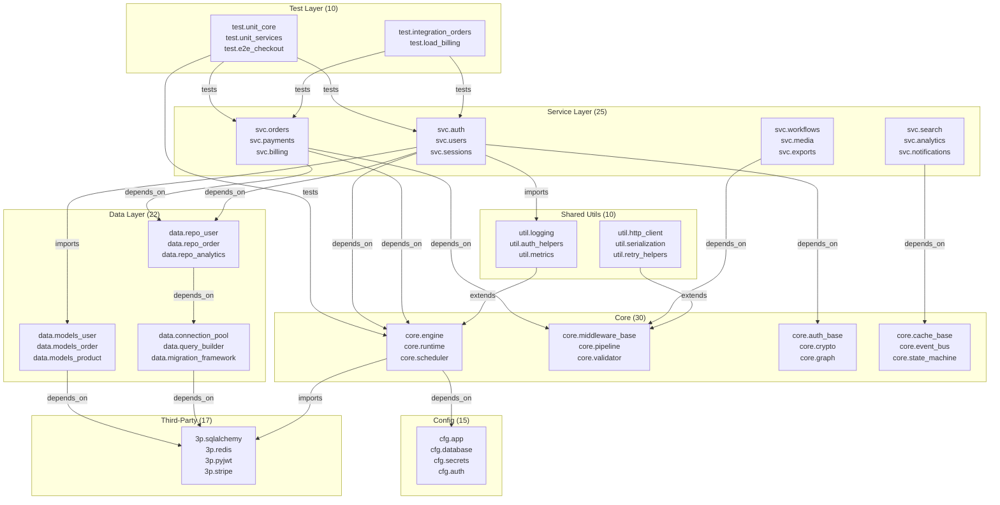

# Code Dependency & Blast Radius Analysis

> **Modeling a 129-node monorepo as a hypergraph to find blast radii, circular dependencies, coupling hotspots, and test-coverage gaps**

## 1. The Approach

Monorepos accumulate hidden dependencies over time. A module you have never edited may sit in the critical path of the service you are deploying tonight. Circular dependencies create build-order deadlocks. Test-coverage gaps mean a breaking change in a low-level utility propagates to dozens of services without any test catching it first.

Traditional dependency tools list direct imports. They do not answer the questions that matter during an incident: "If this core module changes, what breaks?" or "Which modules are both undertested and depended on by many others?"

**The Hyper3 approach:** Model every module as a node and every import/configure/extend/test relationship as a labeled directed edge. Then apply centrality analysis, cycle detection, BFS blast-radius traversal, and transitive rule inference on a single graph. The graph holds the full picture; each analysis is a different query over the same structure.

## 2. A Simple Analogy

Imagine a city's water pipe network. Each building (module) connects to mains (core libraries), which connect to reservoirs (third-party packages). A pipe break at the reservoir level is obvious. But a break at a junction box three streets over may silently cut water to a neighborhood nobody thought to check — because nobody mapped the transitive path from reservoir through junction to that neighborhood.

Dependency graphs are that pipe map. Centrality tells you which junction boxes matter most. Cycle detection finds loops where water would flow in circles. Blast radius tells you how many buildings go dry if a given pipe breaks.

## 3. Key Concepts

| Term | Plain English Meaning |
|------|-----------------------|
| **Module node** | A single package or library in the monorepo (e.g., `core.engine`, `svc.auth`) |
| **Dependency edge** | A directed relationship: `depends_on`, `imports`, `configures`, `extends`, `tests` |
| **Blast radius** | Number of modules reachable from a given node — how many things a change could affect |
| **Circular dependency** | A cycle: A depends on B, B depends on A — causes build-order problems |
| **Degree centrality** | How many direct connections a module has (popularity) |
| **Betweenness centrality** | How many shortest paths pass through a module (bottleneck) |
| **Coupling matrix** | Count of edges between subsystem pairs — shows which areas are tightly coupled |
| **TransitiveRule** | Discovers indirect chains: A→B, B→C means A indirectly depends on C |
| **Test-coverage gap** | A module with low test coverage and many dependents — changes propagate unverified |

## 4. Quick Start

Run the showcase to build the monorepo graph and execute all 10 analysis sections:

```bash
.venv/bin/python examples/showcase/code_dependency_analysis/code_dependency_analysis.py
```

### What You'll See

```
======================================================================
SECTION 1: Generating Monorepo Module Graph
======================================================================
  Stored 129 modules

======================================================================
SECTION 2: Creating Dependency Edges
======================================================================
  129 nodes, 343 edges

...

======================================================================
SUMMARY
======================================================================
  Graph: 129 nodes, 393 edges
  Circular dependencies: 8 cycles
  Connected components: 3
  Indirect dependencies found: 50
  Outdated packages: 17
  Low-coverage at-risk modules: 18

  Highest-risk module: core.engine (criticality=0.103)
  Its blast radius: 116 modules affected by a change
```

## 5. The Scenario

The showcase models a monorepo with **129 nodes across 7 categories and 343 dependency edges** (393 after transitive inference):

| Category | Count | Examples | Purpose |
|----------|-------|----------|---------|
| **Core** | 30 | `core.engine`, `core.auth_base`, `core.graph` | Framework primitives: scheduling, validation, serialization, caching |
| **Service** | 25 | `svc.auth`, `svc.orders`, `svc.payments` | Domain services: each owns an API surface and team |
| **Data** | 22 | `data.repo_order`, `data.models_user`, `data.connection_pool` | ORM models, repositories, migration framework |
| **Third-party** | 17 | `3p.sqlalchemy`, `3p.redis`, `3p.stripe` | External packages with version, license, update year |
| **Config** | 15 | `cfg.app`, `cfg.database`, `cfg.secrets` | Environment-specific configuration modules |
| **Shared utils** | 10 | `util.logging`, `util.auth_helpers`, `util.metrics` | Cross-cutting utilities that extend core base classes |
| **Test** | 10 | `test.unit_core`, `test.e2e_checkout`, `test.smoke` | Unit, integration, E2E, load, and smoke tests |

### Monorepo Topology

Figure 1: Dependency flow from services through core and utilities to third-party packages and config.



### Edge Label Taxonomy

| Label | Count (approx.) | Meaning |
|-------|-----------------|---------|
| `depends_on` | ~200 | Module requires another to function |
| `imports` | ~70 | Code-level import (lighter than depends_on) |
| `configures` | ~20 | Module reads configuration from a config node |
| `extends` | ~15 | Module inherits or extends a base class |
| `tests` | ~20 | Test module exercises the target |
| `implements` | ~8 | Config module implements core config interface |
| `indirectly_depends_on` | 50 | Inferred by TransitiveRule |

## 6. The Analysis Pipeline

The showcase runs 10 analysis sections that build on each other.

### Section 1-2: Graph Construction

Store 129 module nodes with category, team, language, test coverage, and other metadata. Wire them with 343 unique dependency edges across 6 relationship types.

```python
for label, data in all_modules.items():
    mem.store(label, data=data)

for src, tgt, label in unique_edges:
    mem.relate(src, tgt, label=label)
```

**Result:** 129 nodes, 343 edges. The graph is the single representation; every subsequent section queries it differently.

### Section 3: Centrality Analysis

Combine degree centrality (how many direct connections) and betweenness centrality (how many shortest paths pass through) to rank modules by criticality:

```python
degree = mem.degree_centrality()
betweenness = mem.betweenness_centrality()

combined = {}
for label in all_modules:
    d = degree.get(label, 0.0)
    b = betweenness.get(label, 0.0)
    combined[label] = d * 0.4 + b * 0.6
```

**Why both matter:** Degree counts connections (who has the most edges). Betweenness measures structural bottleneck potential (who sits on the most shortest paths). A module with high betweenness but moderate degree is a hidden chokepoint — not obviously popular, but everything routes through it.

**Result:** `core.engine` ranks first with criticality 0.103 (degree 0.242, betweenness 0.010). `core.config_base` ranks second at 0.102. The top 10 includes 4 core modules, 4 service modules, 1 utility, and 1 third-party package (`3p.sqlalchemy`).

### Section 4: Circular Dependencies

Detect cycles that create build-order problems:

```python
cycles = mem.detect_cycles(max_cycles=10)
```

**Why this matters:** Circular dependencies mean neither module can be built, tested, or deployed independently. In a monorepo, they often appear as "temporary" convenience imports that become permanent.

**Result:** 8 cycles found. The two distinct cycles are:
- `core.resolver` <-> `core.handler` (7 variants of the same cycle through different edge labels)
- `svc.orders` <-> `svc.billing` (bidirectional dependency between order processing and billing)

### Section 5: Blast Radius Analysis

For each critical module, count how many modules are reachable via BFS:

```python
for target in blast_targets:
    neighborhood = mem.query(target, strategy="bfs", max_depth=6, max_nodes=200)
    affected = [n.label for n in neighborhood
                if n.label != target and n.data.get("category") != "test"]
```

**Why this matters:** The blast radius quantifies the cost of a breaking change. A module with a blast radius of 116 means 116 non-test modules could be affected by any API change, deprecation, or removal.

**Result:** All 6 analyzed core modules (`core.engine`, `core.config_base`, `core.auth_base`, `core.event_bus`, `core.cache_base`, `util.logging`) have a blast radius of 116 modules — they are connected to nearly the entire monorepo. This is expected for foundational modules that everything depends on, directly or transitively.

### Section 6: Transitive Dependency Discovery

Apply `TransitiveRule` to find indirect dependency chains:

```python
mem.add_rules(TransitiveRule(edge_label="depends_on",
                              new_label="indirectly_depends_on"))
result = mem.reason(
    seed_concepts=chain_seeds,
    max_depth=3,
    max_total_states=50,
)
```

**Why this matters:** Direct dependencies are visible in import statements. Indirect dependencies are not. If `svc.auth` depends on `core.auth_base`, and `core.auth_base` depends on `cfg.auth`, then `svc.auth` indirectly depends on `cfg.auth`. The transitive rule makes this explicit.

**Result:** 50 indirect dependencies discovered across 51 states. The rule reached depth 2. Examples include `cfg.queue -> cfg.endpoints`, `svc.auth -> core.registry`, and `svc.auth -> core.event_bus`.

### Section 7: Outdated Third-Party Dependencies

Identify packages not updated in 2+ years and count their dependents:

```python
for label, data in third_party.items():
    age = current_year - data["last_updated"]
    if age >= 2:
        deps_count = sum(
            1 for le in mem.graph.labeled_edges
            if le["label"] in ("depends_on", "imports")
            and label in le["target_labels"]
        )
```

**Why this matters:** An outdated package with many dependents is a security and compatibility risk. The graph provides the dependent count that a package manifest alone does not — `3p.sqlalchemy` has 14 dependents and is 2 years old.

**Result:** All 17 third-party packages are 2+ years old (current year is 2026). The oldest are `3p.psycopg2` and `3p.urllib3` at 5 years (last updated 2021). `3p.sqlalchemy` has the most dependents at 14. Only 5 of 17 are pinned to specific versions.

### Section 8: Test Coverage Risk Analysis

Find modules with low test coverage (below 70%) that have many dependents (3+):

```python
for label, data in all_modules.items():
    tc = data.get("test_coverage", 1.0)
    if tc > 0.7:
        continue
    neighborhood = mem.query(label, strategy="bfs", max_depth=3, max_nodes=50)
    dep_count = len([n for n in neighborhood if n.label != label])
    if dep_count >= 3:
        at_risk.append((label, tc, dep_count))
```

**Why this matters:** A module with 40% test coverage and 49 dependents is a risk multiplier. Any change to it propagates to 49 other modules with minimal automated verification. The graph combines coverage data (on nodes) with dependency data (edges) to find these risk intersections.

**Result:** 18 modules qualify as at-risk. The highest-impact gaps are:
- `core.crypto` — 40% coverage, 37 dependents (authentication and security)
- `core.engine` — 46% coverage, 49 dependents (everything depends on it)
- `core.retry` — 52% coverage, 49 dependents (resilience logic)
- `core.cache_base` — 46% coverage, 40 dependents (caching infrastructure)

### Section 9: Subsystem Coupling Analysis

Build a matrix counting edges between each pair of subsystem categories:

```python
for src_sub, src_labels in subsystems.items():
    for tgt_sub, tgt_labels in subsystems.items():
        count = 0
        for e in mem.graph.labeled_edges:
            if e["label"] not in ("depends_on", "imports", "extends"):
                continue
            if (e["source_labels"][0] in src_labels
                    and e["target_labels"][0] in tgt_labels):
                count += 1
```

**Why this matters:** High cross-subsystem edge counts reveal tight coupling. Services that directly depend on third-party packages (11 edges) bypass the abstraction layer that core and utilities provide. The 93 service-to-core edges show the intended dependency direction; the 53 service-to-shared edges show utilities being used directly.

**Result:** The coupling matrix shows:
- Services depend on core 93 times — the intended dependency direction
- Services import shared utilities 53 times — direct coupling to cross-cutting code
- Services depend on data layer 17 times and third-party packages 11 times
- Config depends on third-party (`3p.django`) 5 times — configuration framework coupling
- Data layer depends on third-party 15 times — ORM and driver dependencies

### Section 10: Summary

The final section aggregates all findings:

```
Graph: 129 nodes, 393 edges
Circular dependencies: 8 cycles
Connected components: 3
Indirect dependencies found: 50
Outdated packages: 17
Low-coverage at-risk modules: 18

Highest-risk module: core.engine (criticality=0.103)
Its blast radius: 116 modules affected by a change
```

## 7. Understanding the Output

### Centrality Score Interpretation

The combined score uses `degree * 0.4 + betweenness * 0.6`. This weights structural bottleneck potential higher than raw connection count.

| Score Range | Meaning |
|-------------|---------|
| 0.10+ | Critical infrastructure — nearly everything depends on it |
| 0.05-0.10 | Important hub — significant dependency concentration |
| 0.03-0.05 | Moderate connector — notable but not critical |
| Below 0.03 | Peripheral module — limited downstream impact |

### Blast Radius Interpretation

The blast radius is the count of non-test modules reachable within 6 BFS hops from a given module.

| Blast Radius | Meaning (out of 129 total) |
|--------------|---------------------------|
| 100+ | Foundational — changes propagate to nearly the entire codebase |
| 30-99 | Significant — changes affect a major subsystem |
| 10-29 | Moderate — changes affect a bounded area |
| Below 10 | Isolated — changes have limited propagation |

### Test Coverage Risk

Modules are flagged as at-risk when test coverage is below 70% and they have 3+ dependents within 3 BFS hops.

| Coverage | Risk Level |
|----------|-----------|
| Below 50% | High — changes are largely unverified before propagation |
| 50-60% | Moderate — some coverage but significant gaps |
| 60-70% | Low-moderate — approaching acceptable coverage |

### Coupling Interpretation

The cross-subsystem matrix counts edges of type `depends_on`, `imports`, and `extends`. High counts between unexpected pairs indicate coupling that may need abstraction layers.

| Pattern | Interpretation |
|---------|---------------|
| Services -> Core (high) | Expected: services build on framework primitives |
| Services -> Third-party (non-zero) | Services bypass core/util abstractions for direct library access |
| Services -> Services (non-zero) | Inter-service coupling — may indicate missing shared module |
| Data -> Third-party (high) | Expected: ORM and database driver dependencies |

## 8. Key Metrics

| Metric | Value |
|--------|-------|
| Module nodes | 129 |
| Dependency edges (initial) | 343 |
| Dependency edges (after inference) | 393 |
| Connected components | 3 |
| Circular dependency cycles | 8 |
| Distinct cycle groups | 2 (core.resolver <-> core.handler, svc.orders <-> svc.billing) |
| Indirect dependencies discovered | 50 |
| Reasoning states created | 51 |
| Reasoning rules applied | 50 |
| Reasoning max depth | 2 |
| Outdated third-party packages | 17 |
| Oldest packages | `3p.psycopg2`, `3p.urllib3` (5 years) |
| Highest-dependents outdated package | `3p.sqlalchemy` (14 dependents) |
| Low-coverage at-risk modules | 18 |
| Highest-risk module | `core.engine` (criticality 0.103) |
| Blast radius of core.engine | 116 modules |
| Blast radius of core.config_base | 116 modules |
| Top centrality score | `core.engine` (degree 0.242, betweenness 0.010) |

### Module Distribution

| Category | Count |
|----------|-------|
| Core | 30 |
| Service | 25 |
| Data | 22 |
| Third-party | 17 |
| Config | 15 |
| Shared utils | 10 |
| Test | 10 |

## 9. What Makes This Different

**Labeled directed edges encode relationship semantics.** `depends_on`, `imports`, `configures`, `extends`, and `tests` carry different meanings. Cycle detection can target `depends_on` edges specifically (build-order problems), while blast radius traversal can follow all edge types to find the full impact surface.

**Transitive inference makes hidden dependencies explicit.** The `TransitiveRule` discovers that `svc.auth` indirectly depends on `core.registry` through a two-hop chain. This information exists implicitly in the graph structure, but inference materializes it as a queryable edge.

**Multi-attribute risk scoring combines graph structure with node data.** Test coverage lives on nodes as a data attribute. Dependency count comes from graph traversal. The at-risk analysis intersects both dimensions to find modules that are both undertested and heavily depended upon — a combination that neither metric alone reveals.

**Subsystem coupling is derived, not declared.** The coupling matrix is computed by counting edges between module categories. No one annotated that services depend on third-party packages 11 times — the graph structure reveals this when queried by category.

## 10. Code Implementation

**1. Define module categories with metadata**

```python
core_modules = {}
for i, name in enumerate(["core.engine", "core.runtime", ...], start=1):
    core_modules[name] = {
        "category": "core",
        "layer": "core" if i <= 15 else "infra",
        "language": "python",
        "team": ["platform", "infra", "sdk"][i % 3],
        "test_coverage": round(0.4 + (i % 10) * 0.06, 2),
        "loc": 200 + i * 120,
    }
```

**2. Store modules and create edges**

```python
for label, data in all_modules.items():
    mem.store(label, data=data)

for src, tgt, label in unique_edges:
    mem.relate(src, tgt, label=label)
```

**3. Centrality and criticality ranking**

```python
degree = mem.degree_centrality()
betweenness = mem.betweenness_centrality()

combined = {}
for label in all_modules:
    d = degree.get(label, 0.0)
    b = betweenness.get(label, 0.0)
    combined[label] = d * 0.4 + b * 0.6

for label, score in top_k(combined, k=10):
    print(f"  {label:<35s} {score:8.3f}")
```

**4. Blast radius via BFS**

```python
neighborhood = mem.query("core.engine", strategy="bfs",
                          max_depth=6, max_nodes=200)
affected = [n.label for n in neighborhood
            if n.label != "core.engine"
            and n.data.get("category") != "test"]
print(f"blast radius = {len(affected)} modules")
```

**5. Transitive inference with TransitiveRule**

```python
mem.add_rules(TransitiveRule(edge_label="depends_on",
                              new_label="indirectly_depends_on"))
result = mem.reason(seed_concepts=chain_seeds, max_depth=3,
                     max_total_states=50)
new_edges = mem.pattern_match(edge_label="indirectly_depends_on")
```

**6. Test-coverage risk intersection**

```python
for label, data in all_modules.items():
    tc = data.get("test_coverage", 1.0)
    if tc > 0.7:
        continue
    neighborhood = mem.query(label, strategy="bfs",
                              max_depth=3, max_nodes=50)
    dep_count = len([n for n in neighborhood if n.label != label])
    if dep_count >= 3:
        print(f"  {label}: coverage={tc:.0%} dependents={dep_count}")
```

## 11. Real-World Gap

The showcase constructs a synthetic 129-module graph. Real monorepos have thousands of modules with dependency relationships that change on every commit. The gaps between this showcase and production use are:

1. **Dependency extraction.** The showcase manually declares edges. Production use requires parsing import statements (Python `ast`, JS `require`, Java `import`), reading package manifests (`pyproject.toml`, `package.json`, `pom.xml`), and ingesting build-system dependency graphs (Bazel, Pants, Turborepo).

2. **Scale.** 129 nodes run in milliseconds. Monorepos with 5,000+ modules may require batched centrality computation, indexed neighbor lookups, and incremental graph updates rather than full recomputation.

3. **Freshness.** The graph is static within a run. Production dependency graphs change on every merge. Keeping the graph current requires CI integration: re-extract dependencies on each commit, update edges, and re-run critical analyses.

4. **Version resolution.** The showcase treats third-party packages as single nodes. Real dependency management involves version ranges, resolution conflicts, and transitive version constraints. These would require version-aware edge semantics.

5. **Coverage data.** Test coverage percentages come from synthetic data. Real coverage requires ingesting coverage reports (`.coverage`, `lcov`, Istanbul) and joining them with module nodes.

## 12. Reference

### API Methods Used

| Method | Purpose |
|--------|---------|
| `mem.store(label, data)` | Create a module node with metadata |
| `mem.relate(source, target, label)` | Create a labeled dependency edge |
| `mem.degree_centrality()` | Compute degree centrality for all nodes |
| `mem.betweenness_centrality()` | Compute betweenness centrality |
| `mem.detect_cycles(max_cycles)` | Find circular dependency chains |
| `mem.query(label, strategy, max_depth)` | BFS/DFS traversal for blast radius |
| `mem.add_rules(TransitiveRule(...))` | Register transitive inference rule |
| `mem.reason(seed_concepts, max_depth)` | Apply rules via multiway expansion |
| `mem.pattern_match(edge_label)` | Find edges by label |
| `mem.stats()` | Graph statistics (nodes, edges, components) |
| `top_k(scores, k)` | Return top-k items from a score dict |

### Related Examples

| Example | Focus |
|---------|-------|
| `examples/showcase/microservices_reasoning/reasoning_walkthrough.py` | Microservice blast radius with TransitiveRule and InverseRule |
| `examples/showcase/centrality_and_ranking/centrality_walkthrough.py` | Degree, betweenness, PageRank, and eigenvector centrality |
| `examples/showcase/network_analytics/graph_analytics.py` | Cycles, components, risk scoring |
| `examples/showcase/self_evolution/self_evolution.py` | Decay, prune, merge, reinforce on a dependency graph |
