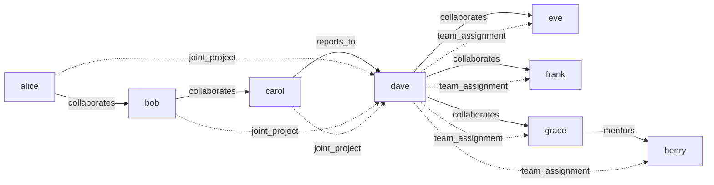

# Hypergraph Construction & Basic Queries

> **Building and Querying a Hypergraph with N-ary Edges and Semantic Metadata**

## 1. The Approach

Most graph models assume edges connect exactly two nodes. But real relationships are often collective: a joint project involves three collaborators, a team assignment covers four people, a committee decision represents five members. Collapsing these into pairwise edges loses the information that the relationship is shared — "Alice, Bob, and Carol jointly deliver a project to Dave" is not the same as three separate "delivers to Dave" edges.

Hyper3 combines pairwise and n-ary directed hyperedges with labeled relationships and data-attribute queries on a single graph. An n-ary hyperedge has a source set and a target set, each of which can contain multiple nodes. This preserves the collective semantics that pairwise decomposition destroys.

## 2. Key Concepts

| Term | Plain English Meaning |
|------|----------------------|
| **Hypergraph** | A graph where edges can connect any number of nodes |
| **N-ary hyperedge** | An edge with multiple source or target nodes (cardinality > 1) |
| **Edge label** | A semantic tag describing the relationship type (e.g. `collaborates`) |
| **Node data** | Key-value metadata attached to a node (e.g. `{"role": "engineer"}`) |
| **Neighborhood query** | Finding nodes connected to a given node, filtered by direction or label |
| **Density** | Ratio of actual edges to maximum possible edges in the graph |

## 3. Quick Start

```bash
.venv/bin/python examples/showcase/construction_and_queries/15_construction_and_queries.py
```

```
SECTION 1: CONSTRUCTION — XGI / HNX / NetworkX patterns
--- Hyper3 ---
nodes: 8, edges: 7

SECTION 2: N-ARY HYPEREDGES (Hyper3 advantage)
N-ary hyperedges (source cardinality >= 2): 1
  joint_project: {'bob', 'carol', 'alice'} -> {'dave'}

SECTION 3: BASIC QUERIES
graph description:
  nodes: 8
  edges: 9
  edge labels: {'collaborates': 5, 'reports_to': 1, 'mentors': 1, 'joint_project': 1, 'team_assignment': 1}
  density: 0.1607
  isolated nodes: 0
  components: 1

SECTION 4: SEMANTIC METADATA (Hyper3-only layer)
engineers: []
platform team: []

SECTION 5: NEIGHBORHOOD QUERIES
dave out-neighbors: ['henry', 'eve', 'grace', 'frank']
dave in-neighbors: ['bob', 'alice', 'carol']
dave all-neighbors: ['bob', 'henry', 'eve', 'grace', 'frank', 'alice', 'carol']
dave collaborators: ['frank', 'eve', 'grace']
```

## 4. The Scenario

An 8-person team with collaboration, reporting, and mentoring relationships:

- **alice, bob, carol** collaborate pairwise along a chain
- **carol** reports to **dave**
- **dave** collaborates with **eve, frank, grace**
- **grace** mentors **henry**
- **alice, bob, carol** jointly work on a project delivered to **dave** (n-ary hyperedge)
- **dave** assigns **eve, frank, grace, henry** to a team (n-ary hyperedge)



Solid arrows: pairwise edges (7). Dashed arrows: n-ary hyperedge connections (2 hyperedges expanded for visibility).

## 5. Analysis Pipeline

**Section 1 — Construction:** 8 nodes and 7 pairwise directed edges are created. Each edge connects exactly one source to one target.

**Section 2 — N-ary hyperedges:** Two hyperedges are added. `joint_project` has source cardinality 3 ({alice, bob, carol} -> {dave}), and `team_assignment` has target cardinality 4 ({dave} -> {eve, frank, grace, henry}). The `edges_labeled(min_source_cardinality=2)` filter returns 1 result — only `joint_project` has source cardinality >= 2. Edge count rises from 7 to 9. Why this matters: the `joint_project` edge represents a collective relationship. If Carol leaves the project, the edge still connects Alice and Bob to Dave — the project persists. With three pairwise edges, removing Carol would require finding and updating each edge separately.

**Section 3 — Basic queries:** `describe()` returns 8 nodes, 9 edges, density 0.1607, 0 isolated nodes, 1 connected component. The edge label distribution shows 5 distinct labels: `collaborates` (5), `reports_to` (1), `mentors` (1), `joint_project` (1), `team_assignment` (1).

**Section 4 — Semantic metadata:** The script calls `store("alice", data={"role": "engineer", ...})` after the initial `store("alice")`. However, `store()` on an existing node does not update its data dict — it only sets data at creation time. As a result, `query_nodes(data={"role": "engineer"})` returns `[]` and `query_nodes(data={"team": "platform"})` returns `[]`. To update data on an existing node, use `ensure(data={...}, update=True)`.

**Section 5 — Neighborhood queries:** Dave's neighborhood spans 7 nodes total. Direction matters here: Dave's out-neighbors (4 nodes he acts on or manages) are different from his in-neighbors (3 nodes that feed into him). Filtering to `collaborates` edges only returns 3 partners: frank, eve, grace — the people Dave works with, excluding his reports and assignments. This directional filtering is what makes neighborhood queries useful: "who does Dave manage?" and "who does Dave work with?" are different questions answered by the same graph.

## 6. Key Metrics

| Metric | Value |
|--------|-------|
| Nodes | 8 |
| Pairwise edges | 7 |
| N-ary hyperedges | 2 |
| Total edges | 9 |
| Edge labels | 5 (`collaborates`: 5, `reports_to`: 1, `mentors`: 1, `joint_project`: 1, `team_assignment`: 1) |
| Density | 0.1607 |
| Isolated nodes | 0 |
| Connected components | 1 |
| N-ary edges with source cardinality >= 2 | 1 |
| Dave out-neighbors | 4 (henry, eve, grace, frank) |
| Dave in-neighbors | 3 (bob, alice, carol) |
| Dave all-neighbors | 7 |
| Dave collaborator neighbors | 3 (frank, eve, grace) |
| Data query results | 0 (data not attached — `store()` does not update existing nodes) |

## 7. What Makes This Different

Three capabilities go beyond what pairwise graph models provide:

**N-ary directed hyperedges** capture collective relationships in a single edge. The `joint_project` edge ({alice, bob, carol} -> {dave}) means all three collaborators jointly deliver to Dave. Decomposing this into three pairwise edges would lose the collective semantics — you could no longer distinguish "three people working together on one deliverable" from "three independent deliverables."

**Semantic edge labels** make the graph self-describing. The 9 edges use 5 distinct labels (`collaborates`, `reports_to`, `mentors`, `joint_project`, `team_assignment`), each carrying a specific meaning. Queries filter by label to answer different questions on the same graph.

**Directional neighborhood queries** distinguish who a node acts on from who acts on it. Dave's out-neighbors (4) are the people he manages or assigns work to; his in-neighbors (3) are the people who collaborate with or report through him. Without direction, these are just "7 connections" — a much less useful answer.

## 8. Code Implementation

**1. Create nodes and pairwise edges:**

```python
from hyper3 import HypergraphMemory

mem = HypergraphMemory(evolve_interval=0)

mem.store("alice")
mem.store("bob")
mem.relate("alice", "bob", label="collaborates")
```

**2. Add n-ary hyperedges:**

```python
mem.relate_hyperedge(
    sources={"alice", "bob", "carol"},
    targets={"dave"},
    label="joint_project",
)
```

**3. Query graph statistics:**

```python
desc = mem.describe()
print(f"nodes: {desc.node_count}, edges: {desc.edge_count}")
print(f"density: {desc.density:.4f}")
```

**4. Query neighborhoods with direction and label filters:**

```python
out = mem.neighbors("dave", direction="out")
collabs = mem.neighbors("dave", edge_label="collaborates")
```

**5. Query nodes by data attribute (correct pattern):**

```python
mem.ensure("alice", data={"role": "engineer"}, update=True)
engineers = mem.query_nodes(data={"role": "engineer"})
```

Note: `ensure(update=True)` merges data into existing nodes. Calling `store()` with data on an already-existing node does not update its data dict.

## 9. Reference

| Method | Purpose |
|--------|---------|
| `mem.store(concept, data)` | Create a node; sets data at creation time only |
| `mem.relate(source, target, label, weight)` | Add a pairwise directed edge |
| `mem.relate_hyperedge(sources, targets, label)` | Add an n-ary directed hyperedge |
| `mem.describe()` | Return graph statistics (nodes, edges, density, components) |
| `mem.neighbors(concept, direction, edge_label)` | Query neighbors filtered by direction and/or label |
| `mem.query_nodes(data)` | Find nodes matching data attributes |
| `mem.edges_labeled(min_source_cardinality)` | List labeled edges, optionally filtering by source cardinality |
| `mem.ensure(concept, data, update)` | Create node if absent; merge data with `update=True` |
