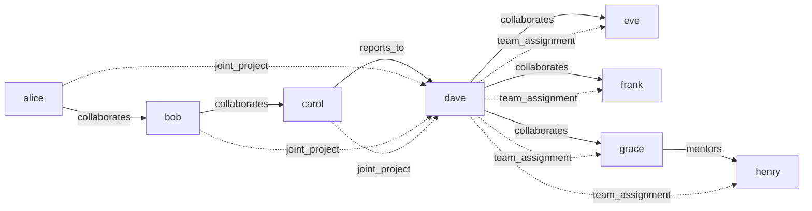

# Hypergraph Construction, Queries, and Reasoning

> **Building, Querying, Reasoning About, and Evolving a Hypergraph with N-ary Edges and Semantic Metadata**

## 1. The Approach

Most graph models assume edges connect exactly two nodes. But real relationships are often collective: a joint project involves three collaborators, a team assignment covers four people, a committee decision represents five members. Collapsing these into pairwise edges loses the information that the relationship is shared — "Alice, Bob, and Carol jointly deliver a project to Dave" is not the same as three separate "delivers to Dave" edges.

Hyper3 combines pairwise and n-ary directed hyperedges with labeled relationships, data-attribute queries, rule-based reasoning, and structural self-evolution on a single graph. An n-ary hyperedge has a source set and a target set, each of which can contain multiple nodes. This preserves the collective semantics that pairwise decomposition destroys. Reasoning rules find patterns in the graph and produce new inferred edges. Evolution decays, prunes, and merges graph structure automatically.

## 2. Key Concepts

| Term | Plain English Meaning |
|------|----------------------|
| **Hypergraph** | A graph where edges can connect any number of nodes |
| **N-ary hyperedge** | An edge with multiple source or target nodes (cardinality > 1) |
| **Edge label** | A semantic tag describing the relationship type (e.g. `collaborates`) |
| **Node data** | Key-value metadata attached to a node (e.g. `{"role": "engineer"}`) |
| **Neighborhood query** | Finding nodes connected to a given node, filtered by direction or label |
| **Density** | Ratio of actual edges to maximum possible edges in the graph |
| **Reasoning rule** | A pattern-matching rule that finds structures in the graph and produces new edges |
| **TransitiveRule** | A rule that infers A -> C from A -> B -> C chains sharing the same edge label |
| **Self-evolution** | Automatic decay, pruning, and merging of graph structure based on usage |

## 3. Quick Start

```bash
.venv/bin/python examples/showcase/core/construction_and_queries/construction_and_queries.py
```

```
======================================================================
SECTION 1: CONSTRUCTION
======================================================================
nodes: 8, edges: 7

======================================================================
SECTION 2: N-ARY HYPEREDGES
======================================================================

N-ary hyperedges (source cardinality >= 2): 1
  joint_project: {'alice', 'carol', 'bob'} -> {'dave'}

======================================================================
SECTION 3: BASIC QUERIES
======================================================================
all nodes: ['alice', 'bob', 'carol', 'dave', 'eve', 'frank', 'grace', 'henry']

graph description:
  nodes: 8
  edges: 9
  edge labels: {'collaborates': 5, 'reports_to': 1, 'mentors': 1, 'joint_project': 1, 'team_assignment': 1}
  density: 0.1607
  isolated nodes: 0
  components: 1

======================================================================
SECTION 4: SEMANTIC METADATA
======================================================================
engineers: ['alice']
platform team: ['alice', 'dave']

======================================================================
SECTION 5: NEIGHBORHOOD QUERIES
======================================================================
dave out-neighbors: ['frank', 'henry', 'eve', 'grace']
dave in-neighbors: ['alice', 'bob', 'carol']
dave all-neighbors: ['frank', 'carol', 'alice', 'henry', 'bob', 'eve', 'grace']
dave collaborators: ['frank', 'eve', 'grace']

======================================================================
SECTION 6: REASONING (Hyper3 advantage)
======================================================================

reasoning from 'alice':
  edges produced: 1
  states created: 2

indirect collaborations inferred:
  alice -[indirect_collaboration]-> carol

======================================================================
SECTION 7: SELF-EVOLUTION (Hyper3 advantage)
======================================================================

evolution cycle:
  nodes before/after: 8/6
  edges before/after: 10/10
  edges decayed: 0
  nodes pruned: 0
  nodes merged: 2

post-evolution description:
  density: 0.3333
  components: 1

======================================================================
DONE
```

## 4. The Scenario

An 8-person team with collaboration, reporting, and mentoring relationships:

- **alice, bob, carol** collaborate pairwise along a chain
- **carol** reports to **dave**
- **dave** collaborates with **eve, frank, grace**
- **grace** mentors **henry**
- **alice, bob, carol** jointly work on a project delivered to **dave** (n-ary hyperedge)
- **dave** assigns **eve, frank, grace, henry** to a team (n-ary hyperedge)



Solid arrows: pairwise edges (7). Dashed arrows: n-ary hyperedge connections (2 hyperedges expanded for visibility).

## 5. Analysis Pipeline

**Section 1 — Construction:** 8 nodes and 7 pairwise directed edges are created. Each node is stored with an empty data dict, which allows subsequent `ensure(update=True)` calls to merge metadata in later.

**Section 2 — N-ary hyperedges:** Two hyperedges are added. `joint_project` has source cardinality 3 ({alice, bob, carol} -> {dave}), and `team_assignment` has target cardinality 4 ({dave} -> {eve, frank, grace, henry}). The `edges_labeled(min_source_cardinality=2)` filter returns 1 result — only `joint_project` has source cardinality >= 2. Edge count rises from 7 to 9. Why this matters: the `joint_project` edge represents a collective relationship. If Carol leaves the project, the edge still connects Alice and Bob to Dave — the project persists. With three pairwise edges, removing Carol would require finding and updating each edge separately.

**Section 3 — Basic queries:** `describe()` returns 8 nodes, 9 edges, density 0.1607, 0 isolated nodes, 1 connected component. The edge label distribution shows 5 distinct labels: `collaborates` (5), `reports_to` (1), `mentors` (1), `joint_project` (1), `team_assignment` (1).

**Section 4 — Semantic metadata:** The script calls `ensure(data={...}, update=True)` to merge role, team, and level data into alice, dave, and eve. `query_nodes(data={"role": "engineer"})` returns `['alice']` — the one node with role=engineer. `query_nodes(data={"team": "platform"})` returns `['alice', 'dave']` — both platform team members. This works because nodes were created with `store(name, data={})` giving them an initial empty data dict, and `ensure(update=True)` merges new fields into it.

**Section 5 — Neighborhood queries:** Dave's neighborhood spans 7 nodes total. Direction matters here: Dave's out-neighbors (4 nodes he acts on or manages) are different from his in-neighbors (3 nodes that feed into him). Filtering to `collaborates` edges only returns 3 partners: grace, frank, eve — the people Dave works with, excluding his reports and assignments. This directional filtering is what makes neighborhood queries useful: "who does Dave manage?" and "who does Dave work with?" are different questions answered by the same graph.

**Section 6 — Reasoning:** A `TransitiveRule` is registered with `edge_label="collaborates"` and `new_label="indirect_collaboration"`. This rule finds two-hop chains: if A collaborates with B and B collaborates with C, it infers an `indirect_collaboration` edge from A to C. Running `reason(seeds={"alice"}, depth=3)` produces 1 new edge and creates 2 states in the multiway expansion. The inferred edge is `alice -[indirect_collaboration]-> carol`, derived from the chain alice -> bob -> carol (both edges labeled `collaborates`). Why this matters: alice and carol are not directly connected by a `collaborates` edge, but the transitive rule recognizes they are connected through bob. This inferred edge makes the indirect collaboration queryable alongside direct ones.

**Section 7 — Self-evolution:** Dave is stimulated 3 times with energy 1.0, then activation is spread for 2 iterations and Hebbian reinforcement is applied. Finally, `evolve()` runs a full evolution cycle. The result: 0 edges decayed, 0 nodes pruned, 2 nodes merged. The graph shrinks from 8 nodes to 6, while edges remain at 10 (9 original + 1 inferred). Density rises from 0.1607 to 0.3333 because the same number of edges now spans fewer nodes. Why this matters: the merge operation identified two pairs of structurally equivalent nodes and combined them, reducing redundancy without losing connectivity. In a larger graph, this process would also decay unused edges and prune disconnected nodes, keeping the graph lean over time.

## 6. Key Metrics

| Metric | Value |
|--------|-------|
| Nodes (initial) | 8 |
| Pairwise edges | 7 |
| N-ary hyperedges | 2 |
| Total edges (after construction) | 9 |
| Edge labels | 5 (`collaborates`: 5, `reports_to`: 1, `mentors`: 1, `joint_project`: 1, `team_assignment`: 1) |
| Density (initial) | 0.1607 |
| Isolated nodes | 0 |
| Connected components | 1 |
| N-ary edges with source cardinality >= 2 | 1 |
| Dave out-neighbors | 4 (grace, frank, henry, eve) |
| Dave in-neighbors | 3 (carol, alice, bob) |
| Dave all-neighbors | 7 |
| Dave collaborator neighbors | 3 (grace, frank, eve) |
| Engineer query results | 1 (alice) |
| Platform team query results | 2 (alice, dave) |
| Reasoning edges produced | 1 |
| Reasoning states created | 2 |
| Inferred edge | alice -[indirect_collaboration]-> carol |
| Evolution: edges decayed | 0 |
| Evolution: nodes pruned | 0 |
| Evolution: nodes merged | 2 |
| Nodes (post-evolution) | 6 |
| Edges (post-evolution) | 10 |
| Density (post-evolution) | 0.3333 |

## 7. What Makes This Different

**N-ary directed hyperedges** capture collective relationships in a single edge. The `joint_project` edge ({alice, bob, carol} -> {dave}) means all three collaborators jointly deliver to Dave. Decomposing this into three pairwise edges would lose the collective semantics — you could no longer distinguish "three people working together on one deliverable" from "three independent deliverables."

**Semantic edge labels** make the graph self-describing. The 9 edges use 5 distinct labels (`collaborates`, `reports_to`, `mentors`, `joint_project`, `team_assignment`), each carrying a specific meaning. Queries filter by label to answer different questions on the same graph.

**Directional neighborhood queries** distinguish who a node acts on from who acts on it. Dave's out-neighbors (4) are the people he manages or assigns work to; his in-neighbors (3) are the people who collaborate with or report through him. Without direction, these are just "7 connections" — a much less useful answer.

**Rule-based reasoning** infers new edges from structural patterns. The `TransitiveRule` detected that alice -> bob -> carol forms a `collaborates` chain and inferred an `indirect_collaboration` edge from alice to carol. This runs through a multiway expansion engine that explores all possible rule applications simultaneously, producing 2 states and 1 new edge. Without reasoning, indirect relationships like alice-carol would remain invisible to label-filtered queries.

**Structural self-evolution** keeps the graph lean over time. After stimulation, activation spreading, and Hebbian reinforcement, the evolution cycle merged 2 structurally equivalent nodes, reducing the graph from 8 to 6 nodes while preserving all 10 edges. Density rose from 0.1607 to 0.3333. In larger graphs, evolution also decays unused edges and prunes disconnected nodes, preventing structural drift.

## 8. Code Implementation

**1. Create nodes and pairwise edges:**

```python
from hyper3 import HypergraphMemory

mem = HypergraphMemory(evolve_interval=0)

for name in ["alice", "bob", "carol", "dave", "eve", "frank", "grace", "henry"]:
    mem.add(name, data={})

mem.link("alice", "bob", label="collaborates")
mem.link("bob", "carol", label="collaborates")
```

**2. Add n-ary hyperedges:**

```python
mem.link_hyper(
    sources={"alice", "bob", "carol"},
    targets={"dave"},
    label="joint_project",
)
```

**3. Query graph statistics:**

```python
desc = mem.analyze.describe()
print(f"nodes: {desc.node_count}, edges: {desc.edge_count}")
print(f"density: {desc.density:.4f}")
```

**4. Attach and query semantic metadata:**

```python
mem.ensure("alice", data={"role": "engineer", "team": "platform", "level": 5}, update=True)
engineers = mem.query_nodes(data={"role": "engineer"})
platform = mem.query_nodes(data={"team": "platform"})
```

**5. Query neighborhoods with direction and label filters:**

```python
out = mem.neighbors("dave", direction="out")
collabs = mem.neighbors("dave", edge_label="collaborates")
```

**6. Apply reasoning rules:**

```python
from hyper3 import TransitiveRule

mem.add_rules(
    TransitiveRule(edge_label="collaborates", new_label="indirect_collaboration"),
)
result = mem.reason(seeds={"alice"}, max_depth=3)
print(f"edges produced: {result.expansion.edges_produced}")
```

**7. Run self-evolution:**

```python
mem.search.activate("dave", energy=1.0)
mem.cognitive.hebbian_reinforce()
evolve_result = mem.evolve()
print(f"nodes merged: {evolve_result.merged}")
```

## 9. Real-World Gap

This showcase demonstrates Hyper3's core capabilities on a small synthetic graph. Real-world adoption involves additional work:

- **Data pipeline:** The showcase constructs nodes and edges programmatically. Production use requires ETL from live data sources (databases, APIs, event streams).
- **Scale:** The showcase runs on 8 nodes and 9-10 edges. Performance at 10K+ nodes is untested.
- **Rule selection:** The showcase uses a single `TransitiveRule`. Real domains require curated rule sets covering the relationship types that matter for that domain.
- **Evolution tuning:** Default evolution parameters work on this small graph. Larger graphs may require adjusted decay rates, merge thresholds, and stimulation strategies to avoid over-merging or excessive pruning.
- **Determinism:** The reasoning engine is deterministic, but the merge step in evolution depends on structural similarity calculations that may vary with graph size and topology.
- **External dependencies:** The showcase uses no external services. Production use requires integration work.

## 10. Reference

| Method | Purpose |
|--------|---------|
| `mem.add(concept, data)` | Create a node with optional data dict |
| `mem.link(source, target, label, weight)` | Add a pairwise directed edge |
| `mem.link_hyper(sources, targets, label)` | Add an n-ary directed hyperedge |
| `mem.describe()` | Return graph statistics (nodes, edges, density, components) |
| `mem.neighbors(concept, direction, edge_label)` | Query neighbors filtered by direction and/or label |
| `mem.query_nodes(data)` | Find nodes matching data attributes |
| `mem.edges_labeled(min_source_cardinality)` | List labeled edges, optionally filtering by source cardinality |
| `mem.ensure(concept, data, update)` | Create node if absent; merge data with `update=True` |
| `mem.add_rules(*rules)` | Register inference rules for reasoning |
| `mem.reason(seeds, depth)` | Apply rules via multiway expansion from seed concepts |
| `mem.activate(concept, energy)` | Inject activation energy into a node |
| `mem.activate(iterations)` | Propagate activation across edges |
| `mem.hebbian_reinforce()` | Strengthen edges between co-activated nodes |
| `mem.evolve()` | Run decay/prune/merge evolution cycle |
| `TransitiveRule(edge_label, new_label)` | Infer A -> C from A -> B -> C chains |
