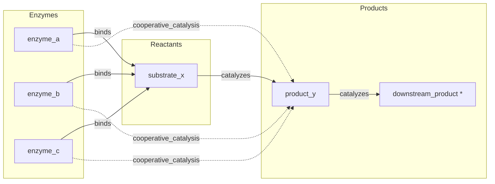

# Directed Hypergraphs with Enzyme Kinetics

> **Directed n-ary hyperedges, degree analysis, and transitive inference on a biochemical catalysis graph**

## 1. The Approach

Directed hyperedges model relationships where multiple sources jointly act on one or more targets. In biochemistry, three enzymes may cooperatively catalyze a single substrate into a product. In supply chains, multiple suppliers collectively fulfill an order. In access control, several roles jointly authorize an action.

A directed hyperedge has two distinct sets: the **tail** (sources) and the **head** (targets). Each set can contain any number of nodes. This matters because the direction carries semantic meaning: enzymes act on substrates, not the other way around. The tail/head distinction lets you ask "what does this enzyme affect?" (out-degree) separately from "what affects this substrate?" (in-degree).

Hyper3 adds semantic direction labels (`binds`, `catalyzes`, `cooperative_catalysis`), hyperedge neighbor queries (which concepts co-participate in edges), and inference rules that operate on the directed structure.

## 2. Key Concepts

| Term | Plain English Meaning |
|------|----------------------|
| **Directed hyperedge** | An edge with distinct source set (tail) and target set (head) |
| **Tail / Source** | The node set at the origin of a directed hyperedge |
| **Head / Target** | The node set at the destination of a directed hyperedge |
| **In-degree** | Number of hyperedges where a node appears in the target set |
| **Out-degree** | Number of hyperedges where a node appears in the source set |
| **Hyperedge neighbors** | Other concepts that share a hyperedge with a given node |
| **Transitive rule** | Inference rule that chains two-hop same-label edges into a new edge |

## 3. Quick Start

```bash
.venv/bin/python examples/showcase/core/directed_hypergraphs/directed_hypergraphs.py
```

### What You'll See

```
SECTION 1: DIRECTED HYPERGRAPH CONSTRUCTION
nodes: 5, edges: 5

SECTION 2: IN-DEGREE / OUT-DEGREE
       concept  out_deg   in_deg    total
      enzyme_a      2.0      0.0      2.0
      enzyme_b      2.0      0.0      2.0
      enzyme_c      2.0      0.0      2.0
     product_y      0.0      2.0      2.0
   substrate_x      1.0      3.0      4.0

SECTION 3: SOURCE / TARGET ACCESS
  binds: {'enzyme_a'} -> {'substrate_x'}  (tail=1, head=1)
  binds: {'enzyme_b'} -> {'substrate_x'}  (tail=1, head=1)
  binds: {'enzyme_c'} -> {'substrate_x'}  (tail=1, head=1)
  catalyzes: {'substrate_x'} -> {'product_y'}  (tail=1, head=1)
  cooperative_catalysis: {'enzyme_a', 'enzyme_b', 'enzyme_c'} -> {'product_y'}  (tail=3, head=1)

SECTION 4: HYPEREDGE NEIGHBORS
substrate_x co-participates in hyperedges with:
  enzyme_b: 1 shared hyperedge(s)
  product_y: 1 shared hyperedge(s)
  enzyme_c: 1 shared hyperedge(s)
  enzyme_a: 1 shared hyperedge(s)

SECTION 5: TRANSITIVE INFERENCE
reasoning from 'substrate_x':
  edges produced: 1
  rules applied: 1
  inferred: substrate_x -[enables_production]-> downstream_product
```

## 4. The Scenario

The example models a biochemical enzyme catalysis network with **5 nodes and 5 edges**:

- **3 Enzymes** (`enzyme_a`, `enzyme_b`, `enzyme_c`) — each binds the shared substrate
- **1 Substrate** (`substrate_x`) — the central reactant
- **1 Product** (`product_y`) — the catalysis output
- **1 Downstream product** (`downstream_product`) — added for transitive inference

### Reaction Topology

Figure 1: Three enzymes bind substrate_x individually and cooperatively catalyze product_y. The downstream catalyzes chain (product_y -> downstream_product) enables transitive inference in Section 5. Dashed arrows indicate the n-ary cooperative_catalysis hyperedge (not shown: pairwise expansion of the 3-source hyperedge).



> \* `downstream_product` and its `catalyzes` edge are added in Section 5 (transitive inference), not during initial construction. The diagram shows the complete graph for reference.

### Edge Taxonomy

| Label | Count | Tail | Head | Added in | Semantics |
|-------|-------|------|------|----------|-----------|
| `binds` | 3 | 1 enzyme | 1 substrate | Section 1 | Individual enzyme-substrate binding |
| `catalyzes` | 1 | 1 substrate | 1 product | Section 1 | Substrate-to-product conversion |
| `cooperative_catalysis` | 1 | 3 enzymes | 1 product | Section 1 | N-ary cooperative catalysis |
| `catalyzes` | 1 | 1 product | 1 downstream | Section 5 | Extends chain for transitive inference |

## 5. Analysis Pipeline

### Section 1: Construction

The script creates 5 nodes and 5 edges. The `link()` calls produce binary edges (tail=1, head=1), while `link_hyper()` produces the n-ary edge with tail=3, head=1 — the cooperative catalysis relationship where all three enzymes jointly contribute to product formation.

### Section 2: In-Degree / Out-Degree

Degree counts reflect each node's structural role:

- **Enzymes** have out-degree 2 (one `binds` edge + one `cooperative_catalysis` edge) and in-degree 0 — they act on other nodes but nothing acts on them.
- **product_y** has in-degree 2 (`catalyzes` from substrate_x + `cooperative_catalysis` from enzymes) and out-degree 0 until the downstream edge is added.
- **substrate_x** has the highest total degree (4): in-degree 3 from the three `binds` edges, out-degree 1 from `catalyzes`.

Why direction matters: substrate_x's in-degree (3) and out-degree (1) tell different stories. The in-degree says "three things bind to this substrate" — it's a convergence point. The out-degree says "this substrate feeds one product" — it's a single-output reactant. Without direction, substrate_x just has degree 4, which conflates these two roles.

### Section 3: Source / Target Access

Each edge is displayed with its tail (source set), head (target set), and cardinality. The `cooperative_catalysis` edge is the n-ary case: tail size 3, head size 1.

### Section 4: Hyperedge Neighbors

`hyperedge_neighbors("substrate_x")` returns the 4 other concepts that share at least one hyperedge with substrate_x — all three enzymes (via `binds`) and product_y (via `catalyzes`).

### Section 5: Transitive Inference

A `TransitiveRule` on the `catalyzes` label produces a new `enables_production` edge. The rule requires a two-hop chain sharing the same edge label: substrate_x -[catalyzes]-> product_y -[catalyzes]-> downstream_product. The single-hop `binds` edges (enzyme -> substrate_x) do not chain because no node receives a `binds` edge and also originates one. The transitive inference resolves the chain to substrate_x -[enables_production]-> downstream_product, shortcutting the intermediate product_y. The engine produces 1 edge from 1 rule application.

## 6. Key Metrics

| Metric | Value |
|--------|-------|
| Nodes | 5 (initial) + 1 (downstream_product) = 6 total |
| Edges (initial) | 5 |
| Edges (after adding downstream) | 6 |
| Edges (after inference) | 7 (5 initial + 1 downstream + 1 inferred) |
| Binary edges | 6 (`binds` x3 + `catalyzes` x2 + `enables_production` x1) |
| N-ary edges | 1 (`cooperative_catalysis`, tail=3, head=1) |
| substrate_x total degree | 4 (in=3, out=1) |
| Inference edges produced | 1 |
| Rules applied | 1 |
| Hyperedge neighbors of substrate_x | 4 |

## 7. What Makes This Different

Three capabilities go beyond undirected hyperedges or pairwise graphs:

**Semantic direction labels** assign domain meaning to edge direction. The `binds` label means "enzyme attaches to substrate" — the direction from enzyme to substrate is not arbitrary, it encodes the biochemical semantics. An undirected edge would lose this: "enzyme_a and substrate_x are connected" doesn't say which binds to which.

**Hyperedge neighbor queries** (`hyperedge_neighbors()`) find concepts that co-participate in edges, answering "which enzymes share a substrate?" without manually iterating over every edge. In the example, substrate_x's co-participants include all three enzymes (via `binds`) and product_y (via `catalyzes`) — a complete picture of its reaction neighborhood in one query. Note that the `cooperative_catalysis` hyperedge does not contribute neighbors for substrate_x because substrate_x is not a participant in that edge; the neighbor query is scoped to edges the node actually appears in.

**Inference on directed edges** chains same-label edges into new edges. The `TransitiveRule` on `catalyzes` detects the two-hop chain substrate_x -> product_y -> downstream_product and produces an `enables_production` edge from substrate_x directly to downstream_product. Direction is critical here: the rule traces forward along the catalysis chain (substrate -> product -> downstream), so the inferred edge correctly goes from substrate_x to downstream_product, not the reverse. An undirected graph would lose the causal ordering.

## 8. Code Implementation

**1. N-ary directed hyperedge**

```python
mem.link_hyper(
    sources={"enzyme_a", "enzyme_b", "enzyme_c"},
    targets={"product_y"},
    label="cooperative_catalysis",
    weight=10.0,
)
```

**2. Degree analysis**

```python
in_deg = mem.analyze.centrality("in_degree")
out_deg = mem.analyze.centrality("out_degree")
```

**3. Source/target inspection**

```python
for e in mem.analyze.edges():
    print(f"{e.label}: {set(e.source_labels)} -> {set(e.target_labels)}  (tail={e.source_cardinality}, head={e.target_cardinality})")
```

**4. Hyperedge neighbors**

```python
co_neighbors = mem.hyperedge_neighbors("substrate_x")
for neighbor, edges in co_neighbors.items():
    print(f"{neighbor}: {len(edges)} shared hyperedge(s)")
```

**5. Transitive inference**

```python
mem.add_rules(
    TransitiveRule(edge_label="catalyzes", new_label="enables_production"),
)
result = mem.reason(seeds={"substrate_x"}, max_depth=2)
```

## 9. Real-World Gap

- **Scale**: This script runs on 5-6 nodes. Biochemical pathway graphs contain thousands of metabolites and reactions.
- **Edge weights**: Weights are assigned manually. Real enzyme kinetics use Michaelis-Menten constants, reaction rates, or binding affinities.
- **Rule selection**: The script uses a single `TransitiveRule`. Real metabolic networks require domain-specific rules for inhibition, activation, and feedback loops.
- **Hyperedge semantics**: The cooperative catalysis edge treats all three enzymes as equal contributors. In reality, enzymes have different binding affinities and catalytic efficiencies that a single edge weight cannot capture.

## 10. Reference

### API Methods

| Method | Purpose |
|--------|---------|
| `mem.link(source, target, label, weight)` | Create a binary directed hyperedge |
| `mem.link_hyper(sources, targets, label, weight)` | Create an n-ary directed hyperedge |
| `mem.analyze.centrality("in_degree")` | Return dict mapping concept label to in-degree |
| `mem.analyze.centrality("out_degree")` | Return dict mapping concept label to out-degree |
| `mem.analyze.edges()` | Iterate edges with source/target labels and cardinality |
| `mem.hyperedge_neighbors(concept)` | Dict of co-participating concepts and shared edges |
| `mem.reason(seeds, depth)` | Run multiway expansion from seed nodes |
| `mem.add_rules(*rules)` | Register inference rules |

### Related Examples

| Example | Focus |
|---------|-------|
| `examples/showcase/reasoning/multiway_reasoning/` | Multi-hypothesis reasoning with multiway expansion |
| `examples/showcase/domain/threat_intelligence/` | 140-node threat intel graph with centrality and traversal |
