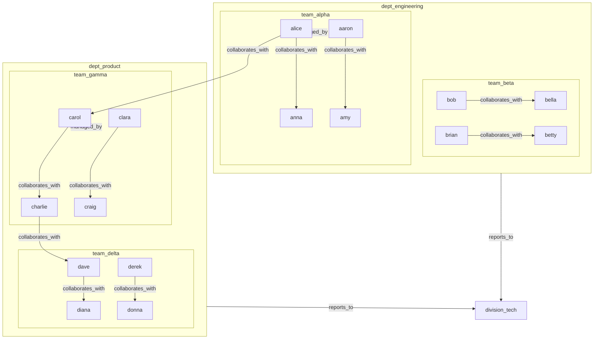

# Hierarchical Abstraction and Multi-Level Analysis

> **Collapsing 20 Employees into Teams and Departments for Multi-Level Centrality Analysis**

## 1. The Approach

Real-world graphs have natural hierarchies: employees form teams, teams form departments, departments form divisions. Analyzing 20 individual employees produces different insights than analyzing 4 teams or 2 departments. At the employee level, you see collaboration patterns between individuals. At the team level, you see inter-team dependencies. At the department level, you see organizational structure. The right granularity depends on the question.

The AbstractionNavigator enables working at the right granularity: collapsing detail nodes into summaries for big-picture analysis, then expanding back to drill down into specifics. `collapse_subgraph()` removes internal edges within a group and rewires external connections to a summary node. `expand_summary()` restores the detail nodes and recreates external edges. All structure is preserved — collapsing is lossless because the AbstractionMapping tracks which detail nodes are hidden under which summary. Centrality, paths, and other graph algorithms operate on the abstracted graph without modification, producing different results at each level.

## 2. Key Concepts

| Term | Plain English Meaning |
|------|----------------------|
| **AbstractionMapping** | Tracks which detail nodes are hidden under a summary node |
| **AbstractionSummary** | Result of a collapse: summary node, edges collapsed, internal/external edge counts |
| **ExpandResult** | Result of expanding a summary back into its detail nodes |
| **Abstraction layer** | SUMMARY or DETAIL classification on node metadata |
| **External connection rewiring** | Edges from outside the collapsed set are redirected to the summary node |
| **Internal edges** | Edges between nodes within the collapsed group (removed during collapse) |
| **External edges** | Edges connecting collapsed nodes to nodes outside the group (rewired to summary) |
| **Collapse** | Replace a group of detail nodes with a single summary node |
| **Expand** | Restore detail nodes from a summary, recreating external connections |

## 3. Quick Start

```bash
.venv/bin/python examples/showcase/core/hierarchical_abstraction/hierarchical_abstraction.py
```

```
SECTION 1: BUILD ORGANIZATIONAL GRAPH
nodes: 23, edges: 14

SECTION 2: FIRST-LEVEL ABSTRACTION - COLLAPSE TEAMS
team_alpha:
  edges collapsed: 4
  internal edges: 2
  external connections: 2
  detail labels: ['aaron', 'alice', 'amy', 'anna', 'axel']

team_beta:
  edges collapsed: 2
  internal edges: 2
  external connections: 0
  detail labels: ['bella', 'betty', 'bob', 'brian', 'bruce']

team_gamma:
  edges collapsed: 5
  internal edges: 2
  external connections: 3
  detail labels: ['carmen', 'carol', 'charlie', 'clara', 'craig']

team_delta:
  edges collapsed: 3
  internal edges: 2
  external connections: 1
  detail labels: ['dave', 'derek', 'diana', 'donna', 'dylan']

after team collapse: nodes=27, edges=6
active summaries: 4

SECTION 3: ANALYZE AT TEAM LEVEL
team-level degree centrality:
  team_alpha: 0.0769
  team_beta: 0.0000
  team_delta: 0.0385
  team_gamma: 0.1154

team-level betweenness centrality:
  team_alpha: 0.0000
  team_beta: 0.0000
  team_delta: 0.0000
  team_gamma: 0.0031

SECTION 4: SECOND-LEVEL ABSTRACTION - COLLAPSE DEPARTMENTS
dept_engineering:
  edges collapsed: 2
  internal edges: 0
  external connections: 2

dept_product:
  edges collapsed: 3
  internal edges: 1
  external connections: 2

after department collapse: nodes=29, edges=5
total active summaries: 6

SECTION 5: EXPAND AND DRILL DOWN
expanded 'dept_engineering':
  expanded nodes: 2
  expanded edges: 4
  summary removed: True

after expand: nodes=28, edges=7
remaining summaries: 5

SECTION 6: CROSS-LEVEL CENTRALITY COMPARISON
current degree centrality (mixed levels):
  dept_engineering: 0.1111
  dept_product: 0.1111
  division_tech: 0.0741
  team_alpha: 0.0741
  team_beta: 0.0741
  alice: 0.0000
  anna: 0.0000
  aaron: 0.0000
```

> Node and edge counts include detail nodes that remain in the graph (hidden but not removed).

## 4. The Scenario

A 23-node organizational graph with four node categories:

- **Employees** (20): 5 per team, distributed across 4 teams
  - team_alpha: aaron, alice, amy, anna, axel
  - team_beta: bella, betty, bob, brian, bruce
  - team_gamma: carmen, carol, charlie, clara, craig
  - team_delta: dave, derek, diana, donna, dylan
- **Departments** (2): dept_engineering (team_alpha + team_beta), dept_product (team_gamma + team_delta)
- **Division** (1): division_tech (both departments)

The hierarchy is: employees -> teams -> departments -> division.



Internal `collaborates_with` edges (within teams) are removed during collapse. External `managed_by` edges are rewired to summary nodes. Cross-team collaboration edges connect team_alpha to team_gamma and team_gamma to team_delta.

## 5. Analysis Pipeline

**Section 1 — Build organizational graph:** 23 nodes and 14 edges are created. 20 employees are stored with `data={"type": "employee"}`. 2 departments and 1 division are stored with `data={"type": "department"}` and `data={"type": "division"}`. Each team has 2 internal `collaborates_with` edges (pairing members at indices 0-1 and 2-3, with the 5th member unpaired), totaling 8 internal edges. 4 hierarchy edges connect employees to departments (alice -> dept_engineering, carol -> dept_product) and departments to the division (dept_engineering -> division_tech, dept_product -> division_tech), giving division_tech 2 incoming edges from the start. 2 cross-team `collaborates_with` edges connect team_alpha to team_gamma (alice -> carol) and team_gamma to team_delta (charlie -> dave). Why this matters: the graph encodes both the hierarchy (managed_by + reports_to) and the collaboration network (collaborates_with). Collapsing will hide the internal collaboration edges while preserving the hierarchical and cross-team connections.

**Section 2 — First-level abstraction — collapse teams:** `collapse_subgraph()` is called 4 times, once per team. For team_alpha: 5 employee nodes are collapsed into the summary node team_alpha. 4 edges are collapsed: 2 internal `collaborates_with` edges (within the team, removed) and 2 external connections (alice -> carol cross-team edge and managed_by edge, rewired to team_alpha). team_beta collapses 2 edges (2 internal + 0 external — no cross-team connections). team_gamma collapses 5 edges (2 internal + 3 external — carol managed_by, charlie -> dave cross-team, carmen internal). team_delta collapses 3 edges (2 internal + 1 external — dave managed_by edge). After collapse: 27 nodes (20 detail employees + 4 team summaries + 2 departments + 1 division) and 6 edges (4 managed_by edges to departments + 2 cross-team collaboration edges). Active summaries: 4. Why this matters: the collapse operation reduces 8 internal edges to 0 and rewires 6 external edges to summary nodes. The abstracted graph has only 6 edges, making team-level analysis tractable. Detail nodes remain in the graph (counted in the 27 total) but are not connected — they are hidden under their summaries.

**Section 3 — Analyze at team level:** Degree centrality is computed on the abstracted graph. team_gamma has the highest centrality (0.1154) — it connects to its department (dept_product), the cross-team edge from alpha (rewired alice->carol), and the cross-team edge to delta (rewired charlie->dave), giving it 3 external connections. team_alpha follows at 0.0769 (department + 1 cross-team connection). team_delta has 0.0385 (department + 1 cross-team connection from gamma). team_beta has 0.0000 — it has no cross-team connections at all, only its department link, which is not counted as a degree centrality connection since degree is normalized by the number of other nodes in the graph. Betweenness centrality is near-zero for all teams (team_gamma at 0.0031, rest at 0.0000) — the simple chain topology means no team is a bottleneck between others. Why this matters: the team-level analysis immediately reveals structural asymmetries that are invisible at the employee level. team_gamma is the best-connected team (bridging alpha and delta), while team_beta is structurally isolated. Aggregating 20 individual employee centralities would not surface this pattern as clearly.

**Section 4 — Second-level abstraction — collapse departments:** `collapse_subgraph()` is called 2 more times, collapsing team_alpha + team_beta into dept_engineering and team_gamma + team_delta into dept_product. dept_engineering collapses 2 edges: 0 internal (the managed_by edges from team_alpha and team_beta to dept_engineering are already rewired through the team summaries and do not become internal at this level) and 2 external (dept_engineering -> division_tech and the cross-team collaboration edge). dept_product collapses 3 edges: 1 internal (the managed_by edge between team_gamma/team_delta and dept_product) and 2 external (dept_product -> division_tech and the cross-team collaboration edge). After department collapse: 29 nodes and 5 edges. Total active summaries: 6 (4 team summaries + 2 department summaries). The division_tech node's original 2 incoming edges (from dept_engineering and dept_product) are now rewired to the department summary nodes, preserving its role as the root of the hierarchy. Why this matters: the second-level collapse stacks on top of the first. Team summaries become detail nodes under department summaries. The graph is now at department granularity, with only 5 edges connecting the 2 departments to the division and to each other.

**Section 5 — Expand and drill down:** `expand_summary()` is called on dept_engineering. This restores team_alpha and team_beta as active nodes, recreates the 4 edges that were rewired to dept_engineering, and removes the dept_engineering summary node. After expansion: 28 nodes and 7 edges. Remaining summaries: 5 (4 teams + dept_product). The expansion is precise — only dept_engineering is expanded; all other summaries remain collapsed. Why this matters: expansion is targeted. A user analyzing the department-level graph can expand one department to drill into its teams without affecting the rest of the abstraction. This enables interactive exploration: start at the top, identify the department of interest, expand it, analyze its teams, and expand further if needed.

**Section 6 — Cross-level centrality comparison:** Degree centrality is computed on the partially-expanded graph (dept_engineering expanded, dept_product still collapsed). dept_engineering has the highest centrality (0.1111) because it is connected to team_alpha, team_beta, division_tech, and dept_product via the remaining cross-department edges. division_tech follows at 0.0741. dept_product and team_alpha/team_beta each have 0.0370. Individual employees (alice, anna, aaron) have centrality 0.0000 — they are detail nodes with no edges. Why this matters: the mixed-level analysis shows how different abstraction levels coexist in the same graph. dept_engineering (expanded, showing teams) has higher centrality than dept_product (still collapsed) because its internal structure is visible. This is the correct result: dept_engineering is more connected because its teams have external edges that dept_product's collapsed summary hides.

## 6. Key Metrics

| Metric | Value |
|--------|-------|
| Original nodes | 23 (20 employees + 2 departments + 1 division) |
| Original edges | 14 |
| After team collapse | 27 nodes, 6 edges, 4 active summaries |
| Internal edges collapsed per team | 2 |
| External connections rewired per team | 0-3 |
| After department collapse | 29 nodes, 5 edges, 6 active summaries |
| After expanding dept_engineering | 28 nodes, 7 edges, 5 remaining summaries |
| Highest team-level centrality | team_gamma (0.1154) |
| Lowest team-level centrality | team_beta (0.0000) |
| Highest cross-level centrality | dept_engineering, dept_product (0.1111) |
| Division centrality | division_tech (0.0741) |

## 7. What Makes This Different

**Lossless collapse and expand** preserves all graph structure. Collapsing removes internal edges and rewires external connections to the summary node, but the AbstractionMapping records every detail. Expanding restores the detail nodes and recreates external edges exactly as they were. No information is lost — the graph can be collapsed and expanded any number of times without degradation.

**Multi-level stacking** enables hierarchical abstraction. Teams can be collapsed into departments, which can be collapsed into divisions, creating multiple abstraction levels in the same graph. Each level operates independently — expanding a department does not affect other departments, and collapsing a department does not require expanding its teams first. This mirrors how real organizations work: you analyze at the division level, drill into a department, then drill into a team.

**Analysis at every level** works without modification. Centrality, paths, and other graph algorithms operate on whatever nodes and edges are currently active, whether those are employees, teams, departments, or a mix. The algorithms do not need to know about the abstraction layer — they see a graph with nodes and edges and produce results accordingly. Section 6 demonstrates this: the mixed-level graph contains expanded team summaries (team_alpha, team_beta), a collapsed department (dept_product), and individual employees (alice, anna, aaron). Degree centrality ranks dept_engineering and dept_product highest (0.1111 each) because their external connections are visible, while individual employees score 0.0000 because their edges were absorbed by the collapse. The same analysis pipeline produces different insights at different granularities, all from the same underlying graph.

## 8. Code Implementation

**1. Build the organizational graph:**

```python
from hyper3 import HypergraphMemory

mem = HypergraphMemory(evolve_interval=0)

teams = {
    "team_alpha": ["alice", "anna", "aaron", "amy", "axel"],
    "team_beta": ["bob", "bella", "brian", "betty", "bruce"],
    "team_gamma": ["carol", "charlie", "clara", "craig", "carmen"],
    "team_delta": ["dave", "diana", "derek", "donna", "dylan"],
}

for members in teams.values():
    for person in members:
        mem.add(person, data={"type": "employee"})

mem.add("dept_engineering", data={"type": "department"})
mem.add("dept_product", data={"type": "department"})
mem.add("division_tech", data={"type": "division"})

for team_members in teams.values():
    for i in range(0, len(team_members) - 1, 2):
        mem.link(team_members[i], team_members[i + 1], label="collaborates_with", weight=1.0)

mem.link("alice", "carol", label="collaborates_with", weight=1.0)
mem.link("charlie", "dave", label="collaborates_with", weight=1.0)

mem.link("alice", "dept_engineering", label="managed_by", weight=1.0)
mem.link("carol", "dept_product", label="managed_by", weight=1.0)
mem.link("dept_engineering", "division_tech", label="reports_to", weight=1.0)
mem.link("dept_product", "division_tech", label="reports_to", weight=1.0)
```

**2. Collapse teams into summary nodes:**

```python
summaries = []
for team_name, members in teams.items():
    result = mem.collapse_subgraph(
        set(members),
        summary_label=team_name,
        summary_data={"type": "team"},
    )
    summaries.append(result)
    print(f"{team_name}: internal={result.internal_edge_count}, external={result.external_connections}")
```

**3. Analyze at team level:**

```python
centrality = mem.analyze.centrality("degree")
for team_name in teams:
    print(f"{team_name}: {centrality.get(team_name, 0.0):.4f}")
```

**4. Collapse departments (second level):**

```python
mem.collapse_subgraph(
    {"team_alpha", "team_beta"},
    summary_label="dept_engineering",
    summary_data={"type": "department"},
)
mem.collapse_subgraph(
    {"team_gamma", "team_delta"},
    summary_label="dept_product",
    summary_data={"type": "department"},
)
```

**5. Expand a department to drill down:**

```python
result = mem.expand_summary("dept_engineering")
print(f"expanded nodes: {len(result.expanded_nodes)}")
print(f"expanded edges: {len(result.expanded_edges)}")
```

**6. Cross-level centrality comparison:**

```python
centrality = mem.analyze.centrality("degree")
for node, score in sorted(centrality.items(), key=lambda x: -x[1])[:8]:
    print(f"  {node}: {score:.4f}")
```

## 9. Real-World Gap

This showcase demonstrates hierarchical abstraction on a small organizational graph. Real-world adoption involves additional work:

- **Detail node footprint:** Collapsed detail nodes remain in the graph (hidden but not removed). Large hierarchies with thousands of employees would retain all detail nodes, increasing memory usage. True removal with re-creation on expand would be needed for production scale.
- **Automatic hierarchy detection:** The showcase manually specifies which nodes belong to each team and department. Real organizational data would require automatic hierarchy detection from attributes (team labels, reporting lines, org charts).
- **Edge weight aggregation:** When external edges are rewired to summary nodes, the showcase preserves individual edges. Production use may need weight aggregation (sum, average, max) when multiple detail nodes connect to the same external target.
- **Scale:** The showcase runs on 23 nodes with 2 abstraction levels. Performance at 10K+ nodes with 4-5 levels is untested, particularly for the collapse/expand operations that iterate over all edges.
- **Concurrent abstraction:** The showcase serializes all collapse/expand operations. Collaborative editing with concurrent abstraction changes requires conflict resolution.
- **Persistence:** Abstraction mappings are in-memory. Persisting the mapping alongside the graph is needed for session continuity.

## 10. Reference

| Method | Purpose |
|--------|---------|
| `mem.collapse_subgraph(node_labels, summary_label, summary_data)` | Replace node set with a summary node, rewiring external edges |
| `mem.expand_summary(summary_label)` | Restore detail nodes from a summary, recreating external edges |
| `mem.analyze.centrality("degree")` | Compute degree centrality for all nodes |
| `mem.analyze.centrality("betweenness")` | Compute betweenness centrality for all nodes |
| `mem.add(concept, data)` | Create a node with optional data dict |
| `mem.link(source, target, label, weight)` | Add a pairwise directed edge |
| `mem.analyze.describe()` | Return graph statistics (nodes, edges, density, components) |
| `mem.neighbors(concept, direction, edge_label)` | Query neighbors filtered by direction and/or label |

### Related Examples

| Example | Connection |
|---------|-----------|
| `construction_and_queries` | Graph construction patterns used in this showcase |
| `centrality_and_ranking` | Centrality algorithms used in multi-level analysis |
| `communities_and_clustering` | Community detection as an alternative to manual hierarchy |
