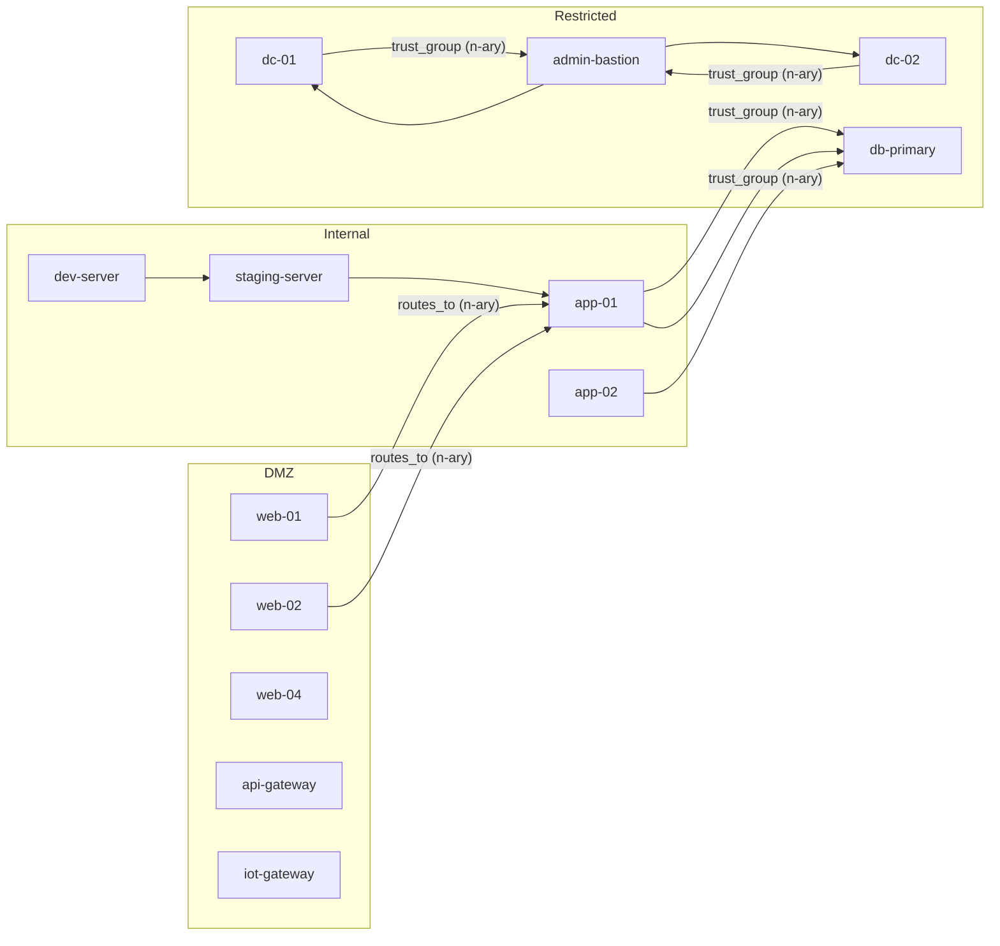

# Polyadic Network Attack Surface Analysis

> Demonstrates n-ary (polyadic) hyperedges for network security analysis, showing how collective relationships reduce edge count while preserving graph algorithm correctness.

## 1. The Approach

Traditional graph security tools model every relationship as pairwise: one edge per (host, service), one edge per (host, vulnerability). A host running 4 services gets 4 separate edges. This works, but it obscures a semantic truth -- the host runs those services *together*, not independently.

This showcase models naturally collective relationships as n-ary hyperedges using `link_hyper()`. Instead of 4 separate `link(host, svc)` calls, a single `link_hyper(sources={host}, targets={svc1, svc2, svc3, svc4})` captures the full service set. The same 129-node enterprise topology from `network_analytics/graph_analytics.py` is used, but with 88 n-ary edges replacing 311 pairwise ones -- a 46% edge reduction.

All standard graph algorithms (centrality, paths, components, cycles, communities) operate correctly on the mixed pairwise/polyadic graph, demonstrating that Hyper3's kernel handles n-ary edges natively.

## 2. A Simple Analogy

Think of a firewall rule. A pairwise graph says "host A can reach service X" (one edge) and "host A can reach service Y" (another edge). A polyadic graph says "host A's allowed services are {X, Y, Z}" -- one edge with multiple targets. The firewall rule is a single policy statement, not three separate ones. Removing host A from the network removes one policy edge, not three.

## 3. Key Concepts

| Term | Meaning |
|------|---------|
| Polyadic edge | A hyperedge connecting multiple source nodes to multiple target nodes (e.g., {dc-01, dc-02} -> {admin-bastion}) |
| Pairwise edge | A traditional edge with exactly 1 source and 1 target |
| `link_hyper()` | API to create n-ary edges, accepting sets for sources and targets |
| Edge order | Total number of nodes in an edge (source count + target count) |
| Single hop | N-ary edges are traversed as one step: {web-01, web-02} -> {app-01} is distance 1, not 2 |
| Trust group | A polyadic edge modeling collective trust (e.g., app cluster -> DB cluster) |

## 4. Quick Start

```bash
.venv/bin/python examples/showcase/core/network_analytics_polyadic/polyadic_network_analytics.py
```

Expected output (values marked * vary between runs due to non-determinism in cycle detection, rule matching order, and community label propagation):

```
  Total nodes:       129
  Total edges:       246

  Top exposed hosts:
    dc-01                       0.1719  restricted      10 0.95
    dc-02                       0.0859  restricted      10 0.94

  Connected components: 8
  Total cycles detected:    15-16 *
  Cross-zone violations: 18

  Inferred indirect trust edges (11)

  Communities detected:    10-11 *
  Modularity:              ~0.30-0.37 *

  Edge breakdown:
    Pairwise edges: 169
    N-ary edges:    88
    Total:          257
```

## 5. The Scenario

The network topology contains 129 nodes across 6 categories:

| Category | Count | Examples |
|----------|-------|---------|
| Hosts | 45 | web-01, dc-01, admin-bastion |
| Segments | 22 | seg-dmz-1, seg-restricted-1 |
| Controls | 16 | fw-perimeter, ids-dmz |
| Services | 18 | svc-ssh, svc-https, svc-postgres |
| Vulnerabilities | 16 | cve-2024-0001 through cve-2024-0016 |
| Users | 12 | admin-root, dev-lead, user-finance |

### Edge taxonomy

| Relationship | Type | Example |
|-------------|------|---------|
| Host-to-segment | Pairwise | web-01 -> seg-dmz-1 |
| Host runs services | **N-ary** | {web-01} -> {svc-http, svc-https} |
| Service exposure | **N-ary** | {web-01} -> {svc-http, svc-https} |
| Vulnerabilities | **N-ary** | {web-04} -> {cve-2024-0001, cve-2024-0008, cve-2024-0009} |
| Protections | **N-ary** | {web-01} -> {waf-external, fw-perimeter, ips-dmz} |
| Trust | Pairwise | admin-bastion -> dc-01 |
| Trust groups | **N-ary** | {dc-01, dc-02} -> {admin-bastion} |
| Access | **N-ary** | {admin-root} -> {admin-bastion, admin-jump-01, dc-01, dc-02, db-primary} |
| Routing | Pairwise | seg-dmz-1 -> seg-internal-1 |

### Network topology (simplified)



## 6. Analysis Pipeline

### Section 1: Graph Construction
Builds the 129-node topology with 246 edges (construction-time count; grows to 257 after reasoning). 88 of those edges are n-ary, created via `link_hyper()`.

### Section 2: Degree Centrality
Identifies the most connected hosts. dc-01 leads (0.1719) because it participates in multiple trust, protection, and service edges. N-ary edges contribute to degree for all participant nodes -- a polyadic `{dc-01} -> {svc-ldap, svc-ldaps, svc-kerberos, svc-smb}` edge gives dc-01 one incident edge, not four.

### Section 3: Betweenness Centrality
Identifies chokepoints where traffic must pass. seg-internal-1 (0.0240) is the top chokepoint because it sits between DMZ and restricted zones. dc-01 (0.0122) is the top host chokepoint due to trust relationships from workstations.

### Section 4: Connected Components
Finds 8 components. The main component contains 122 nodes spanning all zones (DMZ, internal, restricted), plus 7 isolated single-node components (unused segments and controls).

### Section 5: Cycle Detection
Detects 15-16 cycles in the trust and routing graph. No pure trust cycles are found (trust relationships form a DAG).

### Section 6: Cross-Zone Violations
Finds 18 trust violations where internal hosts trust restricted-zone targets, bypassing zone boundaries. The most common pattern is workstation -> dc-01 (restricted).

### Section 7: Degree Distribution
Shows 129 nodes distributed across degree values 0-26, with average degree 4.7. The long tail (dc-01 at degree 22) indicates hub nodes.

### Section 8: Composite Risk Scoring
Combines vulnerability count, degree centrality, betweenness, criticality, and patch level into a risk score. web-04 leads (60.5) due to 3 CVEs on a DMZ host with low patch level (0.5).

### Section 9: Attack Paths
Traces lateral movement paths from DMZ entry points to restricted targets. The staging-server -> app-01 -> db-primary chain crosses one zone boundary (internal to restricted).

### Section 10: Trust Inference
Applies TransitiveRule to find indirect trust relationships. Infers 11 new edges (the specific edges vary across runs due to rule matching order). Identifies 4-6 restricted-zone hosts reachable via indirect trust.

### Section 11: Community Detection
Detects 10-11 communities via label propagation. 3-4 zone-mixing communities show segmentation failures: Community 33 typically spans internal and restricted hosts.

### Section 12: Anomaly Detection
dc-01 (0.410) and admin-bastion (0.399) are flagged as anomalous due to cyclic dependency structures in their trust relationships.

### Section 13: Polyadic Analysis
Demonstrates n-ary-specific queries:
- 2 true n-ary edges with source cardinality >= 2 (trust_group edges)
- `hyperedge_neighbors("dc-01")` reveals 25 co-occurring nodes across 7 relationship types
- Edge sizes range from 2 to 6 (max order 5)
- The graph contains 169 pairwise edges and 88 n-ary edges

## 7. Understanding Output

### Degree centrality
Values are normalized by `(n-1)` where n=129. Higher values mean more connections. N-ary edges count as one incident edge per participating node.

### Betweenness centrality
Fraction of shortest paths passing through a node. Higher values mean more chokepoint potential.

### Risk score
Composite: `vulns * 10 + degree * 50 + betweenness * 80 + criticality * 3 + (1 - patch_level) * 15`

### Community modularity
Values near 0.3-0.4 indicate moderate community structure. Higher modularity means more distinct communities.

## 8. Key Metrics

| Metric | Value |
|--------|-------|
| Total nodes | 129 |
| Total edges (construction) | 246 |
| Total edges (after reasoning) | 257 |
| Pairwise edges | 169 |
| N-ary edges | 88 |
| Unique edge sizes | [2, 3, 4, 5, 6] |
| Maximum edge order | 5 |
| Connected components | 8 |
| Largest component size | 122 |
| Cycles detected | 15-16 (non-deterministic) |
| Cross-zone violations | 18 |
| Inferred indirect trust edges | 11 |
| Restricted hosts reachable via indirect trust | 4-6 (non-deterministic) |
| Communities | 10-11 (non-deterministic) |
| Modularity | ~0.30-0.37 (non-deterministic) |
| Coverage | ~0.84-0.90 (non-deterministic) |
| Top degree centrality | dc-01: 0.1719 |
| Top betweenness | seg-internal-1: 0.0240 |
| Top risk score | web-04: 60.5 |
| Anomalous hosts | dc-01 (0.410), admin-bastion (0.399) |

## 9. What Makes This Different

**N-ary edges model collective relationships.** A `trust_group` edge `{dc-01, dc-02} -> {admin-bastion}` means both DCs collectively trust the bastion. With pairwise edges, the same fact requires two separate edges with no structural link between them.

**Edge count reduction preserves semantics.** The polyadic graph has 257 edges vs the pairwise version's ~480. Each n-ary edge replaces N pairwise edges without losing information. All nodes, labels, and weights are preserved.

**Graph algorithms handle both edge types uniformly.** Shortest path treats an n-ary edge as a single hop. Betweenness centrality iterates through all targets. Connected components unify all participants. No algorithm requires special casing.

**`hyperedge_neighbors()` reveals co-occurrence.** For dc-01, this returns 25 neighboring concepts across 7 relationship types, showing which nodes share edges with dc-01. This query has no pairwise equivalent.

## 10. Code Implementation

```python
from hyper3 import HypergraphMemory, Modality, TransitiveRule

mem = HypergraphMemory(evolve_interval=0)

mem.add("dc-01", data={"zone": "restricted", "kind": "host"})
mem.add("dc-02", data={"zone": "restricted", "kind": "host"})
mem.add("admin-bastion", data={"zone": "restricted", "kind": "host"})

mem.link_hyper(
    sources={"dc-01", "dc-02"},
    targets={"admin-bastion"},
    label="trust_group",
    weight=5.0,
)

neighbors = mem.hyperedge_neighbors("dc-01")
print(neighbors)
# {"dc-02": [<Hyperedge trust_group>], "admin-bastion": [<Hyperedge trust_group>]}

n_ary = mem.query_hyperedges(min_source_cardinality=2)
print(f"N-ary edges: {len(n_ary)}")

path = mem.analyze.shortest_path("dc-01", "admin-bastion")
print(path)  # ["dc-01", "admin-bastion"] (single hop)
```

## 11. Real-World Gap

- **Data pipeline**: The topology is hand-constructed. Production use requires ETL from CMDBs, vulnerability scanners, and firewall rule exports.
- **Scale**: 129 nodes with 257 edges. Performance on enterprise networks (10K+ nodes) is untested.
- **Non-determinism**: Community detection uses label propagation with random tie-breaking; community IDs, counts, and modularity vary across runs. Cycle detection and rule matching order also vary, producing slightly different cycle counts and inferred edges between runs. The values shown are from a single run with `seed=42`. Key Metrics uses ranges for non-deterministic values.
- **Dynamic updates**: The showcase analyzes a static snapshot. Real networks change continuously.

## 12. Reference

### API methods used

| Method | Purpose |
|--------|---------|
| `mem.link_hyper(sources, targets, label, weight)` | Create an n-ary hyperedge |
| `mem.query_hyperedges(min_source_cardinality)` | Filter edges by cardinality |
| `mem.hyperedge_neighbors(concept)` | Find co-occurring nodes in shared edges |
| `mem.analyze.centrality("degree")` | Degree centrality for all concepts |
| `mem.analyze.centrality("betweenness")` | Betweenness centrality |
| `mem.analyze.components()` | Connected components |
| `mem.analyze.communities(seed)` | Community detection |
| `mem.analyze.anomalies(concept)` | Structural anomaly detection |
| `mem.pattern_match(edge_label)` | Find edges by label |
| `mem.reason(seeds, max_depth)` | Multiway reasoning with rules |
| `mem.degree_distribution()` | Degree histogram |
| `mem.unique_edge_sizes()` | Distinct edge cardinalities |
| `mem.max_edge_order()` | Largest edge (source + target count) |

### Related examples

- `examples/showcase/core/network_analytics/graph_analytics.py` -- the pairwise version of this same topology
- `examples/showcase/core/construction_and_queries/` -- basic hyperedge construction and querying
- `examples/showcase/core/directed_hypergraphs/` -- n-ary edge degree and neighbors
