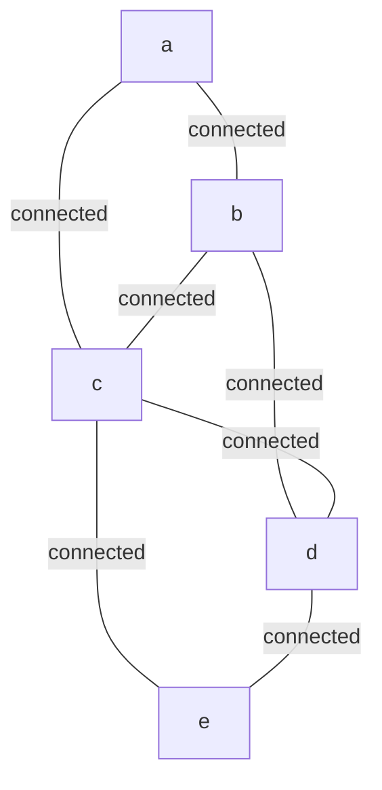
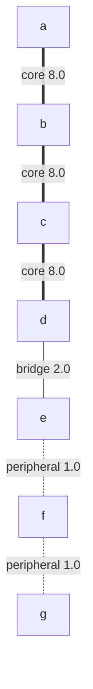

# Statistics and Metrics Showcase

> **Degree, Centrality, Evolution, and Community Detection on Hypergraphs**

## 1. The Approach

Hypergraphs require their own statistical vocabulary: degree counts incident hyperedges (not just neighbors), edge size/order distinguishes binary from higher-arity edges, and centrality metrics adapt to the n-ary structure. Beyond static statistics, the graph can evolve its own structure through decay and reinforcement, and community detection can reveal natural groupings.

This showcase demonstrates the core statistical pipeline — degree distributions, edge-size analysis, filtering, multi-stat comparison, weighted degree — and extends it with evolution impact analysis and community detection on the evolved graph.

## 2. Key Concepts

| Term | Meaning |
|------|---------|
| **Degree** | Number of edges incident to a node |
| **Edge size** | Total number of nodes participating in an edge (`len(edge.node_ids)`) |
| **Edge order** | Edge size minus 1 (size 2 = order 1 = ordinary pair edge) |
| **Degree centrality** | Normalized degree: `degree / (n - 1)` where n is node count |
| **PageRank** | Iterative weight propagation measuring structural importance |
| **Weighted degree** | Sum of incident edge weights instead of count |
| **Evolution** | Background process that decays unused edges, prunes below-threshold nodes, merges equivalents, and reinforces active paths |
| **Community detection** | Label-propagation algorithm that partitions the graph into densely-connected clusters |

## 3. Quick Start

```bash
.venv/bin/python examples/showcase/core/statistics_and_metrics/statistics_and_metrics.py
```

### Output

```
SECTION 1: DEGREE STATISTICS
degree dict:  {'a': 2, 'b': 3, 'c': 4, 'd': 3, 'e': 2}
degree list:  [2, 3, 4, 3, 2]
degree max:   4
degree mean:  2.80
degree median: 3.0

SECTION 2: EDGE SIZE / ORDER STATISTICS
edge sizes:  [2, 2, 4]
edge orders: [1, 1, 3]
unique sizes: [2, 4]

SECTION 3: FILTERING BY DEGREE
nodes with degree >= 3: ['b', 'c', 'd']
hub-type nodes: ['a', 'c']

SECTION 4: MULTI-STAT COMPARISON
 concept   degree   deg_cent   pagerank
------------------------------------------
       a        2     0.5000     0.1870
       b        3     0.7500     0.1947
       c        4     1.0000     0.2027
       d        3     0.7500     0.2034
       e        2     0.5000     0.2121

SECTION 5: WEIGHTED DEGREE
  p: 16.0
  q: 15.0
  r: 10.0
  s: 1.0

SECTION 6: EVOLUTION IMPACT ON STATISTICS
before evolution:
  nodes: 7, edges: 7
  density: 0.1667
  degrees: {'a': 2, 'b': 2, 'c': 2, 'd': 2, 'e': 3, 'f': 2, 'g': 1}

after evolution (decay weak edges, reinforce active paths):
  nodes: 7, edges: 7
  density: 0.1667
  degrees: {'a': 2, 'b': 2, 'c': 2, 'd': 2, 'e': 3, 'f': 2, 'g': 1}
  edges decayed: 0
  nodes pruned: 0
  nodes merged: 0

SECTION 7: COMMUNITY DETECTION
communities detected: 1
modularity: 0.0000
  community 0: ['a', 'b', 'c', 'd', 'e', 'f', 'g'] (7 nodes)

Note: Community detection on this small graph may report 1 or 2 communities
depending on Hebbian reinforcement state. Both results confirm weak structure.
```

## 4. The Scenario

The showcase uses small synthetic graphs to keep each metric visible.

**Graph 1 (Sections 1, 3, 4)** — 5 nodes, 7 binary edges:



Node `c` is the highest-degree node (degree 4), connected to every other node. Nodes `a` and `e` are peripheral (degree 2). Nodes `a` and `c` are tagged as hubs via `ensure(update=True)`.

**Graph 2 (Section 2)** — 4 nodes with two binary edges and one 4-node hyperedge, demonstrating mixed edge arities.

**Graph 3 (Section 5)** — 4 nodes with weighted edges (weights 1.0, 5.0, 10.0) for weighted degree comparison.

**Graph 4 (Sections 6, 7)** — 7 nodes split into a core chain (a-b-c-d, weight 8.0), a peripheral chain (e-f-g, weight 1.0), and a bridge (d-e, weight 2.0):



The core chain receives activation stimulation and Hebbian reinforcement before evolution runs.

## 5. Analysis Pipeline

### Section 1 — Degree Statistics

`mem.degree()` returns a dict mapping each label to its incident edge count. Standard library `statistics` computes mean (2.80) and median (3.0). Node `c` has the maximum degree of 4.

### Section 2 — Edge Size and Order

A separate graph with two binary edges (size 2, order 1) and one 4-node hyperedge (size 4, order 3) shows that edges are not limited to pairs. Unique sizes `[2, 4]` confirm the arity mixture.

### Section 3 — Filtering by Degree

A list comprehension selects nodes with degree >= 3, yielding `['b', 'c', 'd']`. The second filter uses `ensure(update=True)` to tag nodes `a` and `c` with `{"type": "hub"}`, then `query_nodes(data={"type": "hub"})` retrieves them as `['a', 'c']`. The `ensure()` call with `update=True` merges new data into existing nodes rather than overwriting, so previously-stored nodes gain the hub attribute without losing their graph position.

### Section 4 — Multi-Stat Comparison

`degree_centrality()` and `pagerank()` are computed on the same graph and displayed side by side. Node `c` has the highest degree centrality (1.0000) but not the highest PageRank — node `e` leads at 0.2121. Why they differ: degree centrality counts connections (who has the most edges), while PageRank weights connections by the importance of the connecting nodes. A node with fewer connections to high-importance neighbors can outrank a node with many connections to peripheral neighbors. This distinction matters when deciding what to monitor — a node with high degree but low PageRank is busy but not structurally critical.

### Section 5 — Weighted Degree

`mem.degree(weighted=True)` sums incident edge weights instead of counting edges. Node `p` has weighted degree 16.0 (edges with weight 10.0 + 5.0 + 1.0) while node `s` has 1.0 (a single weight-1.0 edge). Why this matters: unweighted degree treats every edge equally, but in real graphs some edges are much stronger than others. Weighted degree surfaces this distinction.

### Section 6 — Evolution Impact on Statistics

A 7-node graph with strong core edges (weight 8.0) and weak peripheral edges (weight 1.0) is stimulated along the core path, Hebbian-reinforced, then evolved. The `evolve()` call applies decay, pruning, merging, and reinforcement. In this small graph, all edges survive: 0 decayed, 0 pruned, 0 merged. The degrees and density remain unchanged at 0.1667.

**Why no visible change?** Evolution's decay step reduces edge weights on inactive edges. The peripheral edges (weight 1.0) are the weakest, but even they survive because the graph is too small and too well-connected — every node participates in at least one edge, and no edges fall below the pruning threshold. The Hebbian reinforcement from activating nodes a, b, c strengthens the core edges further, but they were already dominant. On larger graphs with many marginal edges (e.g., weight 0.1 connecting peripheral nodes to a core of 50+ nodes), the same evolution step would visibly prune those marginal connections and reinforce the core, shifting degree distributions. This section establishes the before/after measurement pattern so you can apply it at scale.

### Section 7 — Community Detection

After evolution, `detect_communities()` analyzes the 7-node graph. On this small, densely-connected graph, community detection typically finds 1 community (all 7 nodes, modularity 0.0000). Occasionally it may report 2 communities with low modularity (~0.14), but the structure is too weakly clustered for a stable partition.

The core edges (weight 8.0) were Hebbian-reinforced after activation of nodes a, b, and c, but the bridge edge (d-e, weight 2.0) keeps the graph connected enough that no strong community boundary emerges. The low modularity (0.0 or ~0.14) confirms the structure is weakly clustered, which is expected for a small, densely-connected graph. This section demonstrates the measurement pattern: on larger graphs with more marginal edges, community detection reveals clearer structural boundaries.

## 6. Key Metrics

### Section 1 — Degree Statistics (5-node graph)

| Metric | Value |
|--------|-------|
| Degree of `a` | 2 |
| Degree of `b` | 3 |
| Degree of `c` | 4 |
| Degree of `d` | 3 |
| Degree of `e` | 2 |
| Max degree | 4 |
| Mean degree | 2.80 |
| Median degree | 3.0 |

### Section 2 — Edge Size/Order (4-node graph)

| Metric | Value |
|--------|-------|
| Edge sizes | [2, 2, 4] |
| Edge orders | [1, 1, 3] |
| Unique sizes | [2, 4] |

### Section 3 — Degree Filtering

| Filter | Result |
|--------|--------|
| degree >= 3 | `['b', 'c', 'd']` |
| `query_nodes(data={"type": "hub"})` | `['a', 'c']` |

### Section 4 — Centrality (5-node graph)

| Node | Degree | Degree Centrality | PageRank |
|------|--------|-------------------|----------|
| a | 2 | 0.5000 | 0.1870 |
| b | 3 | 0.7500 | 0.1947 |
| c | 4 | 1.0000 | 0.2027 |
| d | 3 | 0.7500 | 0.2034 |
| e | 2 | 0.5000 | 0.2121 |

### Section 5 — Weighted Degree (4-node graph)

| Node | Weighted Degree |
|------|----------------|
| p | 16.0 |
| q | 15.0 |
| r | 10.0 |
| s | 1.0 |

### Section 6 — Evolution Impact (7-node graph)

| Metric | Before | After |
|--------|--------|-------|
| Nodes | 7 | 7 |
| Edges | 7 | 7 |
| Density | 0.1667 | 0.1667 |
| Edges decayed | — | 0 |
| Nodes pruned | — | 0 |
| Nodes merged | — | 0 |

### Section 7 — Community Detection (7-node graph)

| Metric | Value |
|--------|-------|
| Communities | 1 (occasionally 2) |
| Modularity | 0.0000 (occasionally ~0.14) |
| Community 0 | `['a', 'b', 'c', 'd', 'e', 'f', 'g']` (7 nodes) |

## 7. What Makes This Different

**Weighted degree** (`degree(weighted=True)`) sums edge weights rather than counting edges. Not all edges carry equal importance — a dependency with weight 10.0 is stronger than one with weight 1.0. Unweighted degree treats them identically; weighted degree captures the difference.

**Multi-stat on the same graph** combines `degree()`, `degree_centrality()`, and `pagerank()` without converting to a separate data structure. Degree centrality and PageRank measure different things (raw connectivity vs. structural importance), and seeing them side by side reveals nodes that are busy but not critical and vice versa.

**Edge-size statistics** distinguish binary edges (size 2) from n-ary hyperedges (size 4+). A graph with all size-2 edges could be represented as an ordinary graph; size-3+ edges are what make it a hypergraph.

**Evolution impact measurement** captures graph statistics before and after `evolve()`, showing how decay, pruning, and reinforcement shift degree distributions. Even when the visible change is small (as in this 7-node example), the measurement pattern scales to larger graphs where the effects are pronounced.

**Community detection** partitions the graph into structurally-coherent clusters, revealing groupings that are not visible from degree or centrality alone. On this small 7-node graph, the result is typically a single community with modularity 0.0, confirming that the graph is too small and uniformly connected for meaningful partitioning. On larger graphs with more marginal edges, community detection reveals clearer structural boundaries. Combined with evolution, it shows how activation and reinforcement shape which nodes cluster together.

## 8. Code Implementation

**Degree statistics:**

```python
mem = HypergraphMemory(evolve_interval=0)
degree_dict = mem.degree()
print(f"mean: {statistics.mean(degree_dict.values()):.2f}")
print(f"max:  {max(degree_dict.values())}")
```

**Filtering by data attributes:**

```python
mem.ensure("a", data={"type": "hub"}, update=True)
hubs = mem.query_nodes(data={"type": "hub"})
```

**Weighted degree:**

```python
weighted_deg = mem.degree(weighted=True)
for label, wd in sorted(weighted_deg.items()):
    print(f"  {label}: {wd:.1f}")
```

**Multi-stat comparison:**

```python
cent = mem.analyze.centrality("degree")
pr = mem.analyze.centrality("pagerank")
for label in sorted(cent.keys()):
    print(f"{label:>8} {cent[label]:>10.4f} {pr.get(label, 0.0):>10.4f}")
```

**Evolution impact:**

```python
before_deg = mem.degree()
before_density = mem.analyze.describe().density

mem.search.activate("a", energy=1.0)
mem.search.diffuse("a", iterations=2)
mem.cognitive.hebbian_reinforce()
evolve_result = mem.evolve()

after_deg = mem.degree()
after_density = mem.analyze.describe().density
print(f"edges decayed: {evolve_result.decayed}")
```

**Community detection:**

```python
comm_result = mem.analyze.communities(seed=42)
print(f"communities: {comm_result.community_count}")
for community in comm_result.communities:
    print(f"  {sorted(community.member_labels)} ({community.size} nodes)")
```

## 9. Real-World Gap

- **Scale**: The showcase runs on 4–7 node graphs. Performance at 10K+ nodes is untested.
- **Evolution visibility**: The 7-node graph shows no structural change after evolution (0 decayed, 0 pruned). Larger graphs with more marginal edges show visible pruning and reinforcement.
- **Community detection**: Uses label propagation, which is non-deterministic even with a fixed seed. On this small graph, the result is typically 1 community (modularity 0.0000), but 2 communities (modularity ~0.14) can also occur depending on hash-based node ordering. The modularity score in either case is well below the 0.3 threshold for meaningful community structure — larger, sparser graphs produce stronger partitions.
- **Data pipeline**: The showcase constructs synthetic graphs. Real adoption requires ETL from live data sources.

## 10. Reference

### API Methods

| Method | Returns | Notes |
|--------|---------|-------|
| `mem.degree()` | `dict[str, int]` | Label-to-degree mapping |
| `mem.degree(weighted=True)` | `dict[str, float]` | Sum of incident edge weights |
| `mem.analyze.centrality("degree")` | `dict[str, float]` | Normalized degree / (n-1) |
| `mem.analyze.centrality("pagerank")` | `dict[str, float]` | Iterative weight propagation |
| `mem.query_nodes(data=...)` | `list[str]` | Exact data-attribute match |
| `mem.ensure(concept, data=..., update=True)` | — | Idempotent node creation with data merge |
| `mem.engine.graph.edges` | iterable of `Hyperedge` | Access `node_ids`, `weight` |
| `mem.link_hyper(sources, targets, label)` | `Hyperedge` | Create n-ary edge |
| `mem.search.activate(concept, energy=...)` | — | Inject activation energy into a node |
| `mem.search.diffuse(concept, iterations=...)` | — | Propagate activation across edges |
| `mem.cognitive.hebbian_reinforce()` | — | Strengthen edges between co-activated nodes |
| `mem.evolve()` | `EvolveResult` | Decay, prune, merge, reinforce; returns counts |
| `mem.analyze.communities(seed=...)` | `CommunityResult` | Label-propagation partitioning with modularity |
| `mem.analyze.describe().density` | `float` | Edge-to-node ratio |

### Related Examples

| Example | Focus |
|---------|-------|
| `examples/showcase/reasoning/multiway_reasoning/` | Multiway expansion with branch scoring |
| `examples/showcase/domain/threat_intelligence/` | Centrality-based blast radius analysis |
| `examples/showcase/domain/microservices_reasoning/` | Dependency graph centrality |
