# Structural Pattern Detection and Community Analysis

> **Detecting chains, diamonds, fan-outs, and natural communities in a 76-node technology ecosystem graph**

## 1. The Approach

The shape of relationships in a graph reveals organizational patterns that raw node and edge counts cannot. Three structural motifs carry distinct meanings:

- **Chains** (A → B → C) show linear dependencies. In a technology ecosystem, a chain means a company's technology choices cascade — a vulnerability at any point in the chain propagates forward.
- **Diamonds** (A → C, B → C) show convergent dependencies. Multiple companies depending on the same technology creates shared risk — if that technology has a CVE, every dependent company is affected simultaneously.
- **Fan-outs** (A → B, A → C, A → D) show breadth of dependency. A company with high fan-out on "uses" edges has a broad technology footprint, increasing its attack surface but also its flexibility.

Community detection adds a complementary view: it finds natural clusters of closely connected nodes that cut across manually defined categories. A community might contain a company, its product, its key technologies, its employees, and its compliance standards — revealing the organic structure of how these entities relate.

## 2. A Simple Analogy

Think of a city's road network. A **chain** is a one-way street where each intersection leads to the next — a traffic jam at any point blocks everyone behind it. A **diamond** is two roads converging on the same destination — if that destination is a hospital, both roads are critical. A **fan-out** is a roundabout with many exits — it connects many places but is also a bottleneck. **Community detection** finds the neighborhoods: clusters of buildings that are more connected to each other than to the rest of the city.

## 3. Key Concepts

| Term | Plain English Meaning |
|------|----------------------|
| **Chain** | A linear sequence of edges with the same label: A → B → C → D |
| **Diamond** | Two or more paths converging on the same node: A → C, B → C |
| **Fan-out** | A single node with many outgoing edges of the same label |
| **Community detection** | Finding clusters of nodes that are more densely connected internally than externally |
| **Label propagation** | Community detection algorithm that spreads labels through edges, weighted by edge importance |
| **Modularity** | Quality score for community structure (0.0 = random, 1.0 = perfect separation) |

## 4. Quick Start

```bash
.venv/bin/python examples/showcase/core/structural_patterns/structural_patterns_and_communities.py
```

### What You'll See

```
SECTION 1: Building Technology Ecosystem Graph
  Nodes: 76
  Edges: 109

SECTION 2: Chain Detection
  'develops' chains found: 0
  'uses' chains (length >= 2): 0

SECTION 3: Fan-Out Analysis
  Companies using 3+ technologies:
    acme_cloud           fan_out=6
    zenith_fintech       fan_out=5
    nexa_ai              fan_out=4
    volt_data            fan_out=4
    ...

  SECTION 4: Diamond Detection
  Technology convergence diamonds: 10

SECTION 5: Community Detection
  Communities: 14
  Modularity:  0.594
  Coverage:    68.5%

SECTION 6: Cross-Analysis
  Largest community (10 nodes):
    Cross-community connections: 13
```

## 5. The Scenario

The example models a technology ecosystem with **76 nodes and 109 edges**:

| Entity Type | Count | Examples |
|-------------|-------|---------|
| Companies | 15 | `acme_cloud`, `nexa_ai`, `sigma_chips` |
| Products | 15 | `cloud_platform_x`, `ai_assistant_pro`, `quantum_sim` |
| Technologies | 20 | `kubernetes`, `tensorflow`, `rust_lang` |
| People | 20 | `alice_chen`, `bob_kumar`, `kate_zhao` |
| Standards | 6 | `iso_27001`, `pci_dss`, `hipaa`, `gdpr` |

### Edge Label Taxonomy

| Label | Count | Meaning |
|-------|-------|---------|
| `develops` | 15 | Company creates a product |
| `uses` | 53 | Company depends on a technology |
| `partners_with` | 10 | Strategic partnership between companies |
| `certified_for` | 8 | Company holds a compliance certification |
| `works_at` | 20 | Person employed at a company |
| `mentors` | 6 | Senior person mentors a junior person |

### Technology Ecosystem Topology

Figure 1: Company ecosystems with products, technologies, partnerships, and standards.

```mermaid
graph TB
    subgraph "Cloud & AI Cluster"
        AC["acme_cloud"]
        NX["nexa_ai"]
        CPX["cloud_platform_x"]
        AIP["ai_assistant_pro"]
        K8S["kubernetes"]
        DOCK["docker"]
        TF["terraform"]
        PY["python"]
        TORCH["pytorch"]
        TFLOW["tensorflow"]
        AC -->|develops| CPX
        NX -->|develops| AIP
        AC -->|uses| K8S
        AC -->|uses| DOCK
        NX -->|uses| TORCH
        NX -->|uses| TFLOW
        NX -->|uses| PY
        AC -.->|partners_with| NX
    end

    subgraph "Data & Security Cluster"
        VD["volt_data"]
        PS["pulse_security"]
        DLF["data_lake_fusion"]
        SV["secure_vault"]
        SPARK["apache_spark"]
        KFK["kafka"]
        RUST["rust_lang"]
        OPENSSL["openssl"]
        VD -->|develops| DLF
        PS -->|develops| SV
        VD -->|uses| SPARK
        VD -->|uses| KFK
        PS -->|uses| RUST
        PS -->|uses| OPENSSL
        AC -.->|partners_with| PS
    end

    subgraph "Fintech & Health Cluster"
        ZF["zenith_fintech"]
        HH["helix_health"]
        NB["nova_biotech"]
        PFA["payflow_api"]
        HM["health_monitor_360"]
        GA["genome_analyzer"]
        PG["postgresql"]
        REDIS["redis"]
        GRPC["grpc"]
        ZF -->|develops| PFA
        HH -->|develops| HM
        NB -->|develops| GA
        ZF -->|uses| K8S
        ZF -->|uses| PG
        HH -->|uses| TFLOW
        NB -->|uses| TFLOW
        ZF -.->|partners_with| PS
        HH -.->|partners_with| NB
    end

    subgraph "Edge & IoT Cluster"
        NE["neural_edge"]
        OI["orbit_iot"]
        ER["edge_runtime"]
        IGH["iot_gateway_hub"]
        WASM["webassembly"]
        ZMQ["zeromq"]
        NE -->|develops| ER
        OI -->|develops| IGH
        NE -->|uses| WASM
        OI -->|uses| ZMQ
        OI -->|uses| DOCK
        NE -->|uses| DOCK
        NE -.->|partners_with| OI
    end

    subgraph "Compliance Layer"
        SOC2["soc2"]
        FEDRAMP["fedramp"]
        PCI["pci_dss"]
        HIPAA["hipaa"]
        ISO["iso_27001"]
        GDPR["gdpr"]
        AC -->|certified_for| SOC2
        AC -->|certified_for| FEDRAMP
        ZF -->|certified_for| PCI
        HH -->|certified_for| HIPAA
        PS -->|certified_for| ISO
        ZF -->|certified_for| GDPR
    end
```



## 6. The Analysis Pipeline

### Section 1: Building the Graph

The script creates 76 nodes (companies, products, technologies, people, standards) and wires them with 109 semantic edges:

```python
mem = HypergraphMemory(evolve_interval=0)

for name, data in all_nodes.items():
    mem.add(name, data=data)

for src, tgt, label, weight in EDGES:
    mem.link(src, tgt, label=label, weight=weight)
```

**Result:** 76 nodes, 109 edges.

### Section 2: Chain Detection

The script searches for linear dependency chains along `develops` and `uses` edges:

```python
dev_chains = mem.match_chains(edge_label="develops", min_length=1, max_length=3, max_chains=20)
use_chains = mem.match_chains(edge_label="uses", min_length=2, max_length=4, max_chains=10)
```

**Result:** 0 `develops` chains, 0 `uses` chains (length >= 2).

This result is structurally expected: chains require the target of one edge to be the source of the next edge with the same label. In this graph, `develops` edges go from companies to products, and products have no outgoing `develops` edges. Similarly, `uses` edges go from companies to technologies, and technologies have no outgoing `uses` edges. The graph is two-hop: companies connect to products and technologies, but those leaf nodes don't chain further.

**Why this matters:** Zero chains means no cascading technology dependencies. Each company's technology choices are independent — a failure in one company's tech stack does not propagate through shared intermediate dependencies. In a real ecosystem, chains would appear if technologies themselves depend on other technologies (e.g., `tensorflow` uses `protobuf`), creating multi-hop vulnerability paths.

### Section 3: Fan-Out Analysis

Fan-out measures how many outgoing edges a node has with a given label. High fan-out on `uses` edges identifies companies with the broadest technology footprints:

```python
fan_outs = mem.match_fan_out(edge_label="uses", min_fan=3, max_results=10)
```

**Result:** 10 companies use 3+ technologies:

| Company | Fan-out | Technologies |
|---------|---------|-------------|
| `acme_cloud` | 6 | docker, golang, postgresql, redis, terraform, kubernetes |
| `zenith_fintech` | 5 | kafka, postgresql, redis, grpc, kubernetes |
| `nexa_ai` | 4 | python, tensorflow, pytorch, kubernetes |
| `volt_data` | 4 | kafka, apache_spark, arrow_format, python |
| `pulse_security` | 3 | openssl, rust_lang, grpc |
| `orbit_iot` | 3 | docker, zeromq, golang |
| `nova_biotech` | 3 | python, apache_spark, tensorflow |
| `sigma_chips` | 3 | protobuf, rust_lang, pytorch |
| `aurora_energy` | 3 | python, kafka, kubernetes |
| `helix_health` | 3 | graphql, tensorflow, react |

Partnership fan-out (2+ partners): `nexa_ai` (3), `acme_cloud` (2), `zenith_fintech` (2).

> **Note:** The script's fan-out analysis includes the source node itself in its partner list (e.g., `nexa_ai` appears in its own `partners_with` fan-out). This is a known artifact of the current `match_fan_out` implementation — the method counts all outgoing targets without excluding self-loops. The true partnership counts are one less than reported for `nexa_ai`.

**Why this matters:** `acme_cloud` has the highest technology fan-out (6), meaning it has the most diverse dependency surface. If any of those 6 technologies has a vulnerability, `acme_cloud` is exposed. Conversely, a high partnership fan-out indicates a company is well-connected in the partnership network, spreading influence but also risk.

### Section 4: Diamond Detection

Diamonds find convergence: two or more nodes that share a common target. In this ecosystem, diamonds reveal shared technology dependencies:

```python
diamonds = mem.match_diamonds(edge_label="uses", max_matches=10)
```

**Result:** 10 technology convergence diamonds. The top 5 all converge on `golang`:

| Source A | Source B | Converges On | Score |
|----------|----------|-------------|-------|
| `acme_cloud` | `orbit_iot` | golang | 0.29 |
| `acme_cloud` | `terra_logistics` | golang | 0.29 |
| `cipher_blockchain` | `orbit_iot` | golang | 0.25 |
| `cipher_blockchain` | `terra_logistics` | golang | 0.25 |
| `cipher_blockchain` | `acme_cloud` | golang | 0.14 |

**Why this matters:** All 5 displayed diamonds converge on `golang`. This means 4+ companies (`acme_cloud`, `orbit_iot`, `terra_logistics`, `cipher_blockchain`) share a foundational dependency on the Go runtime language. This is a supply-chain risk pattern: a golang runtime CVE (e.g., a memory safety vulnerability in the Go compiler or standard library) would simultaneously affect infrastructure across cloud computing, IoT, logistics, and blockchain companies. The highest-scoring diamonds (0.29) involve `acme_cloud` paired with `orbit_iot` and `terra_logistics` — these companies depend on golang with relatively high weights, making their shared exposure the most significant.

### Section 5: Community Detection

Weighted label propagation finds natural clusters in the graph:

```python
result = mem.analyze.communities(method="weighted_label_propagation", seed=42)
```

**Result:** 14 communities, modularity 0.594, coverage 68.5%.

A modularity of 0.594 indicates moderately strong community structure — communities are more densely connected internally than externally, but there is meaningful cross-community connectivity.

Top communities by size:

| Community | Size | Internal Edges | External Edges | Composition |
|-----------|------|---------------|---------------|-------------|
| 0 | 10 | 62 | 63 | acme_cloud ecosystem |
| 9 | 10 | 77 | 48 | nova_biotech + helix_health joint cluster |
| 5 | 8 | 46 | 40 | zenith_fintech ecosystem |
| 2 | 6 | 34 | 25 | volt_data ecosystem |
| 3 | 6 | 37 | 21 | pulse_security ecosystem |
| 1 | 5 | 29 | 53 | nexa_ai ecosystem |
| 14 | 5 | 26 | 16 | stellar_education ecosystem |
| 4 | 4 | 20 | 18 | orbit_iot ecosystem |

**Notable finding:** Community 9 merges `nova_biotech` and `helix_health` into a single cluster of 10 nodes — larger than community 1 (`nexa_ai`, 5 nodes) despite both being company-centric clusters. The difference is structural: the partnership edge between `helix_health` and `nova_biotech` and their shared `tensorflow` dependency pull additional nodes (products, people, technologies) into the combined cluster. The algorithm detected this cross-company relationship organically — no manual grouping was required. Community 9 also has the highest internal edge count (77) of any community, reflecting the density created by merging two connected company ecosystems.

### Section 6: Cross-Analysis — Communities + Patterns

The largest community (Community with 10 nodes) centers on `acme_cloud`:

```python
largest = max(result.communities, key=lambda c: c.size)
```

**Result:** Members include `acme_cloud`, `cloud_platform_x`, `kubernetes`, `docker`, `terraform`, `alice_chen`, `paul_nguyen`, `soc2`, and more. Cross-community connections: 13 edges.

**Why this matters:** The 13 cross-community edges indicate that the acme_cloud ecosystem is the most externally connected cluster in the graph. This is consistent with its position as the highest fan-out company (6 technologies) and its partnerships with `nexa_ai` and `pulse_security`. The acme_cloud cluster acts as a bridge between otherwise separate technology communities.

## 7. Understanding the Output

### Chain Count Interpretation

| Chain Count | Meaning |
|-------------|---------|
| 0 | Flat dependency structure — no cascading paths |
| 1-3 | Limited cascading — most dependencies are direct |
| 5+ | Significant cascading — vulnerabilities can propagate through chains |

In this graph, zero chains reflect the two-hop structure: companies connect to products and technologies, but those leaf nodes have no outgoing same-label edges.

### Fan-Out Interpretation

| Fan-out Range | Meaning |
|--------------|---------|
| 1-2 | Narrow dependency — low exposure, limited flexibility |
| 3-5 | Moderate breadth — balanced risk and capability |
| 6+ | Broad dependency — high exposure, high flexibility |

`acme_cloud` at fan-out 6 has the widest technology surface. This means more potential vulnerability exposure but also more architectural flexibility.

### Diamond Score Interpretation

Diamond scores reflect the strength of the shared dependency. Higher scores mean both source nodes have strong (high-weight) edges to the shared target. The top-scoring diamonds are `acme_cloud` + `orbit_iot` → `golang` and `acme_cloud` + `terra_logistics` → `golang`, both at 0.29. These represent the strongest shared dependencies in the graph.

### Community Modularity Interpretation

| Modularity Range | Meaning |
|-----------------|---------|
| 0.0-0.3 | Weak structure — communities overlap heavily |
| 0.3-0.5 | Moderate structure — distinct clusters with shared members |
| 0.5-0.7 | Strong structure — clear communities with limited overlap |
| 0.7+ | Very strong — nearly disconnected components |

The observed modularity of 0.594 indicates strong but not rigid community structure. Companies form distinct clusters around their technology stacks, but partnerships and shared technologies create meaningful cross-community connections.

## 8. Key Metrics

| Metric | Value |
|--------|-------|
| Graph nodes | 76 |
| Graph edges | 109 |
| Companies | 15 |
| Products | 15 |
| Technologies | 20 |
| People | 20 |
| Standards | 6 |
| Dependency chains | 0 |
| Technology hubs (fan-out >= 3) | 10 |
| Convergence diamonds | 10 |
| Communities | 14 |
| Modularity | 0.594 |
| Coverage | 68.5% |
| Largest community size | 10 nodes |
| Cross-community connections (largest) | 13 |
| Highest fan-out | `acme_cloud` (6 technologies) |
| Most converged technology | `golang` (5 diamonds) |
| Highest diamond score | `acme_cloud` + `orbit_iot` → `golang` (0.29), `acme_cloud` + `terra_logistics` → `golang` (0.29) |

## 9. What Makes This Different

Standard graph analysis operates on untyped edges: "A is connected to B." Structural pattern detection on a labeled hypergraph adds semantic context:

1. **Label-filtered patterns** restrict detection to meaningful relationships. The `uses` fan-out counts only technology dependencies, not mentorship or certification edges. This prevents semantic conflation — a company with 5 `mentors` edges is not the same as a company using 5 technologies.

2. **Weighted community detection** uses edge importance (weight) to influence community assignment. The `acme_cloud` → `golang` edge (weight 8.0) pulls golang into the acme_cloud community more strongly than the `stellar_education` → `python` edge (weight 4.0) pulls python into the stellar_education community.

3. **Pattern composition** enables multi-motif analysis. The cross-analysis in Section 6 combines community membership with fan-out counts, revealing that the highest fan-out company (`acme_cloud`, 6 technologies) also anchors the most externally connected community (13 cross-community edges). Neither pattern alone tells this story.

4. **N-ary hyperedges** allow patterns to span multi-node relationships. While this example uses binary edges, the pattern matching infrastructure operates on hyperedges where source and target sets can contain multiple nodes, enabling pattern detection on relationships like "company A and company B jointly develop product C."

## 10. Code Implementation

**1. Build the Ecosystem Graph**

```python
mem = HypergraphMemory(evolve_interval=0)

for name, data in all_nodes.items():
    mem.add(name, data=data)

for src, tgt, label, weight in EDGES:
    mem.link(src, tgt, label=label, weight=weight)
```

**2. Detect Chains**

```python
dev_chains = mem.match_chains(edge_label="develops", min_length=1, max_length=3, max_chains=20)
use_chains = mem.match_chains(edge_label="uses", min_length=2, max_length=4, max_chains=10)
```

**3. Find Fan-Out Hubs**

```python
fan_outs = mem.match_fan_out(edge_label="uses", min_fan=3, max_results=10)
partner_fans = mem.match_fan_out(edge_label="partners_with", min_fan=2, max_results=10)
```

**4. Detect Convergence Diamonds**

```python
diamonds = mem.match_diamonds(edge_label="uses", max_matches=10)
```

**5. Run Community Detection**

```python
result = mem.analyze.communities(method="weighted_label_propagation", seed=42)
print(f"Communities: {result.community_count}")
print(f"Modularity:  {result.modularity:.3f}")
print(f"Coverage:    {result.coverage:.1%}")
```

**6. Cross-Analyze Communities and Patterns**

```python
largest = max(result.communities, key=lambda c: c.size)
for edge in mem.engine.graph.edges:
    src_node = mem.engine.graph.get_node(list(edge.source_ids)[0])
    tgt_node = mem.engine.graph.get_node(list(edge.target_ids)[0])
    if src_node.label in hub_nodes and tgt_node.label not in hub_nodes:
        cross_community_edges += 1
```

## 11. Real-World Gap

This showcase uses a hand-crafted 76-node graph. Real technology ecosystem analysis faces several challenges:

1. **Data extraction from package registries:** Ingesting dependency data from npm, PyPI, Maven, or Cargo requires parsing lockfiles, manifests, and dependency trees at scale. A single npm project can have hundreds of transitive dependencies.

2. **GitHub organization mapping:** Real company-technology relationships come from analyzing repository languages, dependency files, CI configurations, and contributor patterns across thousands of repositories. This requires GitHub API integration and rate-limit handling.

3. **Version-aware dependencies:** Real ecosystems have version constraints — a company using `react@17` and another using `react@18` have different exposure to CVEs. The current graph treats each technology as a single node without version differentiation.

4. **Temporal dynamics:** Technology adoption changes over time. A static graph captures a snapshot, but real analysis needs to track when dependencies were added, updated, or removed to identify emerging risks.

5. **Scale:** Real technology ecosystems involve millions of packages and tens of millions of dependency edges. Community detection and pattern matching at that scale requires sampling, approximation, or distributed computation.

6. **Vulnerability correlation:** The diamonds detected here show shared dependencies, but connecting them to actual CVE databases (NVD, GitHub Advisory Database) requires external data integration that is outside Hyper3's scope.

**Theoretical pipeline:**

```
Package Registries (npm, PyPI, Maven, Cargo)
        ↓
  [Dependency Extraction] → technology nodes with version data
        ↓
GitHub / GitLab APIs
        ↓
  [Organization Mapping] → company nodes with repository analysis
        ↓
  [Contributor Analysis] → person nodes with role inference
        ↓
Compliance Databases
        ↓
  [Certification Mapping] → standard nodes with certification status
        ↓
    Hyper3 Graph (ready for pattern detection)
        ↓
  [Structural Analysis] → chains, diamonds, fan-outs, communities
        ↓
CVE / Advisory Databases
        ↓
  [Risk Correlation] → "golang diamond affects 4 companies with score 0.29"
```

Hyper3 provides the graph construction and structural analysis. The data extraction pipeline above is a separate engineering concern.

## 12. Reference

### API Methods

| Method | Purpose |
|--------|---------|
| `mem.add(label, data)` | Create a node with typed metadata |
| `mem.link(source, target, label, weight)` | Create a weighted semantic edge |
| `mem.match_chains(edge_label, min_length, max_length, max_chains)` | Find linear dependency chains |
| `mem.match_fan_out(edge_label, min_fan, max_results)` | Find nodes with high outgoing edge count |
| `mem.match_diamonds(edge_label, max_matches)` | Find convergence patterns (shared targets) |
| `mem.analyze.communities(method, seed)` | Detect natural clusters via label propagation |
| `mem.query_nodes(data)` | Filter nodes by data attributes |
| `mem.neighbors(concept, edge_label, direction)` | Get neighboring node labels |

### Related Examples

| Example | Focus |
|---------|-------|
| `examples/showcase/domain/microservices_reasoning/` | Transitive blast radius analysis on 82-node service graph |
| `examples/showcase/core/directed_hypergraphs/` | N-ary directed edges and degree analysis |
| `examples/showcase/domain/threat_intelligence/` | 140-node threat intel graph with centrality and traversal |
| `examples/showcase/core/construction_and_queries/` | Graph construction patterns and query strategies |
