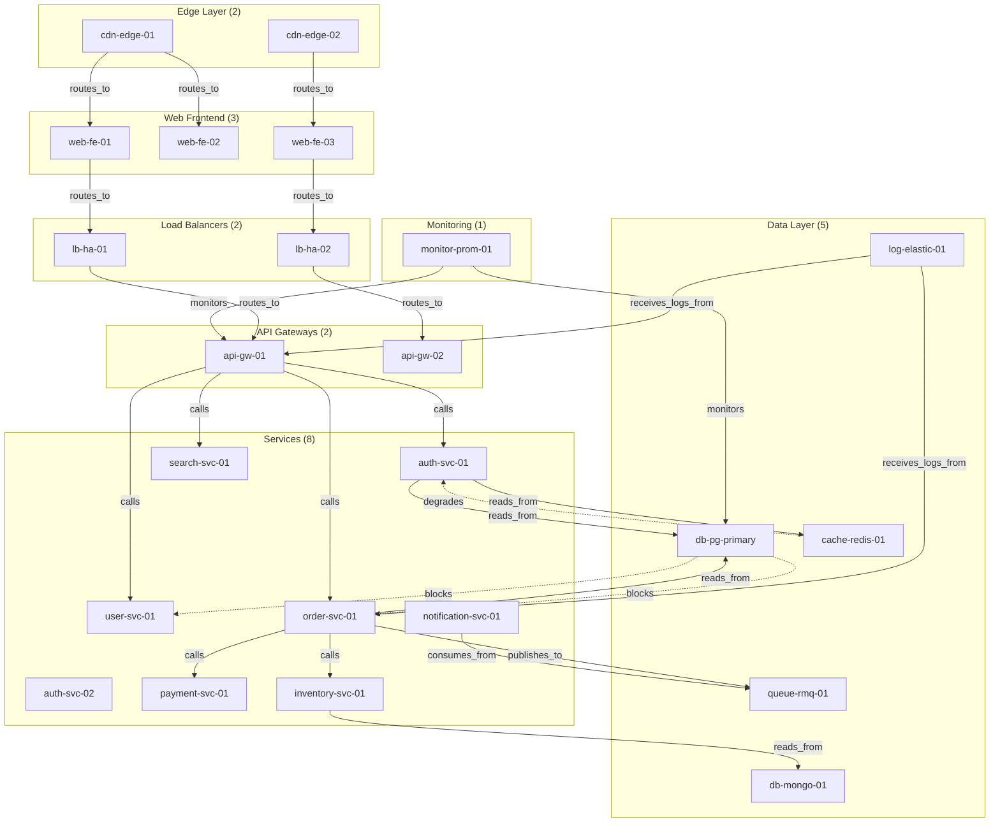

# Self-Healing Infrastructure Monitoring

> Feedback-driven decay, prune, and reinforce on a 47-node production topology with metamorphosis validation and multiway causal merge

## 1. The Approach

Production infrastructure graphs accumulate stale monitoring data, noisy dependency edges, and outdated service nodes. A traditional knowledge graph stores these indefinitely — someone has to manually identify and remove deprecated entries.

Hyper3's self-evolution loop uses operation outcomes as feedback to drive structural cleanup. When a retrieval returns a stale node, the system records a negative outcome. When a collapse resolves to the correct server, the system records a positive outcome. Over time, `evolve_with_feedback()` uses this accumulated signal to reinforce frequently-accessed healthy nodes and suppress nodes that consistently produce poor outcomes.

This showcase models a 47-node infrastructure (32 production servers across 12 service categories, plus 15 noisy/stale nodes), runs it through four rounds of operation and evolution, and shows how the feedback loop recovers graph health.

## 2. Key Concepts

| Term | What it does |
|------|-------------|
| **Operation feedback** | Records whether each collapse, retrieval, and inference produced a correct result. Tracks positive/negative outcomes per node. |
| **Decay** | Reduces edge weights on inactive edges. Edges not traversed during recall or reasoning gradually lose importance. |
| **Prune** | Removes nodes whose weight has dropped below a threshold after decay. |
| **Merge** | Combines nodes identified as structurally equivalent by the equivalence engine. |
| **Reinforce** | Increases edge weights on paths that are frequently recalled. Reinforced nodes gain weight from positive operation outcomes. |
| **Suppress** | Marks nodes that produce consistently negative outcomes for force-pruning during the next evolution cycle. |
| **Fitness trend** | Aggregated direction of operation outcomes over recent history: `improving`, `stable`, or `declining`. |
| **Metamorphosis validation** | Captures a graph version snapshot, proposes parameter changes, and rolls back if fitness does not improve. |
| **Multiway causal merge** | After multiway reasoning, identifies equivalent states and merges them while preserving causal insights about which rules produced unique contributions. |

## 3. Quick Start

```bash
.venv/bin/python examples/showcase/domain/infrastructure_self_healing/infrastructure_self_healing.py
```

Expected output (excerpt):

```
======================================================================
SUMMARY
======================================================================
  Final graph: 33 nodes, 89 edges
  Stale nodes cleaned: 13/15
  Healthy nodes preserved: 31
  Fitness journey: declining -> stable
  Cross-operation correlations: 13 nodes tracked
  Multiway states explored: 1
  Causal merges: 0
```

## 4. The Scenario

The showcase models a production infrastructure with three layers:

- **32 production servers** across 12 service categories: web frontends (3), API gateways (2), auth services (2), user services (2), order services (2), payment services (2), inventory services (2), notification (1), search (1), analytics (1), plus infrastructure components (caches, databases, queues, CDN edges, load balancers, monitoring, logging)
- **53 dependency edges** with labeled relationships (`routes_to`, `calls`, `reads_from`, `publishes_to`, `consumes_from`, `monitors`, `receives_logs_from`)
- **13 failure mode edges** (`blocks`, `degrades`) modeling cascade patterns
- **15 noisy/stale nodes** added during degradation (deprecated services, zombie processes, orphan endpoints, ghost replicas)

### Infrastructure Topology

Figure 1: Request flow from CDN through web frontends, load balancers, API gateways, and service mesh to data stores. Monitoring and logging observe the API and service layers.



### Edge Label Taxonomy

| Category | Labels | Meaning |
|----------|--------|---------|
| **Request routing** | `routes_to` | HTTP request flow through load balancers to services |
| **Service calls** | `calls` | Synchronous inter-service RPC calls |
| **Data access** | `reads_from` | Service reads from a data store |
| **Messaging** | `publishes_to`, `consumes_from` | Asynchronous message queue interactions |
| **Observability** | `monitors`, `receives_logs_from` | Monitoring and log collection |
| **Failure modes** | `blocks`, `degrades` | Dependency failure impact (added separately) |

## 5. Analysis Pipeline

### Section 1: Building the Healthy Infrastructure Graph

32 server nodes are created with typed data (category, service, zone, health score) and wired together with 53 dependency edges and 13 failure mode edges. Result: 32 nodes, 66 edges.

The failure mode edges use directed labels (`blocks`, `degrades`) rather than weights to indicate cascade direction. This matters for reasoning: a `blocks` edge from `db-pg-primary` to `order-svc-01` means a database outage stops order processing entirely, while a `degrades` edge from `cache-redis-01` to `auth-svc-01` means cache loss slows but does not stop authentication.

### Section 2: Round 1 — Healthy System Operations

The system runs path finding, records positive operation outcomes, and evolves:

```
Paths CDN->DB: 10
  cdn-edge-01 -> web-fe-01 -> lb-ha-01 -> api-gw-01 -> auth-svc-01 -> payment-svc-01 -> db-pg-primary
  cdn-edge-01 -> web-fe-01 -> lb-ha-01 -> api-gw-01 -> auth-svc-01 -> db-pg-primary
  cdn-edge-01 -> web-fe-01 -> lb-ha-01 -> api-gw-01 -> order-svc-01 -> db-pg-primary

Round 1 evolve: decayed=0, pruned=0, merged=1
```

10 paths from `cdn-edge-01` to `db-pg-primary` exist through the routing and call chain. Positive outcomes are recorded for collapse (auth-svc-01, payment-svc-01, order-svc-01), retrieval (database nodes, cache nodes), and inference (two call chains accepted). The evolution cycle produces 1 merge — the equivalence engine combined two structurally similar nodes.

Why recording positive outcomes matters: without baseline feedback, the system has no reference for what "good" looks like. The first round establishes which nodes produce correct results under normal operation, so the system can detect degradation when outcomes shift.

### Section 3: Round 2 — Degradation

15 noisy/stale nodes are injected with low health scores (0.01–0.15) and low weights:

```
stale-metric-aggregator-01   health=0.12  stale=True
deprecated-test-runner-01    health=0.05  stale=True
orphan-debug-endpoint        health=0.01  stale=True
zombie-cron-worker-01        health=0.06  stale=True
ghost-replica-set-01         health=0.01  stale=True
```

Three of these stale nodes connect to production infrastructure (`stale-metric-aggregator-01` reads from `db-pg-primary`, `legacy-xml-api-01` routes to `lb-ha-01`, `zombie-cron-worker-01` publishes to `queue-rmq-01`). These edges create spurious paths through the graph.

Five standard evolution cycles produce minimal cleanup (1 decay across all 5 cycles, 0 prunes). Standard evolution operates on weight thresholds and inactivity — the stale nodes are new and their edges are fresh, so decay has not reduced them below threshold yet.

Negative outcomes are then recorded for all stale nodes (incorrect collapses, empty retrieval results, rejected inferences). Positive outcomes are reinforced for 5 healthy nodes (`api-gw-01`, `order-svc-01`, `payment-svc-01`, `db-pg-primary`, `cache-redis-01`).

After degradation:
- Overall health: 0.55
- Collapse accuracy: 0.73
- Retrieval precision: 0.43
- Inference acceptance: 0.50
- Reinforced nodes: 5
- Suppressed nodes: 8

Why this matters: standard evolution (weight-based decay/prune) cannot distinguish between a new legitimate node and a new stale node — both have fresh edges and no activity history. Feedback-driven evolution solves this by using operation outcomes as the discriminant signal.

### Section 4: Round 3 — Feedback-Driven Recovery

`evolve_with_feedback()` runs four cycles using the accumulated outcome history:

```
Feedback-driven evolution:
  decayed=0, pruned=0, reinforced=5, suppressed=2
  Nodes: 33, Edges: 66

Recovery cycle 1: pruned=0, reinforced=5, suppressed=0
Recovery cycle 2: pruned=0, reinforced=5, suppressed=0
Recovery cycle 3: pruned=0, reinforced=5, suppressed=0
```

Each cycle reinforces the 5 healthy nodes (gaining weight from positive outcomes) and the first cycle suppresses 2 stale nodes (force-pruned based on negative outcomes). After four cycles, 13 of 15 stale nodes have been removed, leaving 2. All 31 healthy servers are preserved.

Post-recovery:
- Overall health: 0.55
- Fitness trend: stable
- Nodes remaining: 33 (31 healthy + 2 stale)

The health score remains at 0.55 because the feedback history includes both the positive Round 1 outcomes and the negative Round 2 outcomes. The trend stabilized from declining because subsequent positive reinforcement offsets the earlier degradation.

Why the health score does not return to 1.0: the feedback system accumulates a rolling history of all outcomes. Even after recovery, the recorded negative outcomes from Round 2 remain in the history window. The trend (`stable`) reflects that new outcomes are no longer degrading — not that past degradation has been erased.

### Section 5: Cross-Operation Correlation

The feedback summary identifies nodes that appear across multiple operation types (retrieval, collapse, inference):

```
Nodes appearing across multiple operation types: 13
  db-pg-primary          signals=5, positive_rate=1.00, types=['retrieval', 'collapse']
  cache-redis-01         signals=5, positive_rate=1.00, types=['retrieval', 'collapse']
  payment-svc-01         signals=5, positive_rate=1.00, types=['retrieval', 'collapse']
  order-svc-01           signals=5, positive_rate=1.00, types=['retrieval', 'collapse']
  [removed:deprecated-t] signals=4, positive_rate=0.00, types=['retrieval', 'collapse']
  api-gw-01              signals=4, positive_rate=1.00, types=['retrieval', 'collapse']
  [removed:legacy-xml-a] signals=4, positive_rate=0.00, types=['retrieval', 'collapse']
```

The correlated nodes split into two groups: production servers with 1.00 positive rate and removed stale nodes with 0.00 positive rate. This correlation is what the feedback system uses to make reinforce/suppress decisions — nodes that appear in multiple operation types and always produce positive outcomes get reinforced; nodes that appear in multiple types and never produce positive outcomes get suppressed.

Why cross-operation correlation matters: a node that only fails in retrieval might have a data issue. A node that fails in retrieval *and* collapse *and* inference has a systemic problem. Tracking signal count across operation types distinguishes isolated failures from nodes that should be removed.

### Section 6: Computational Bias Profile

After running reasoning on two concept sets, the bias profile summarizes rule effectiveness:

```
Reasoning style: focused
Bias score: 0.291
Rule count: 6
Average effectiveness: 0.757
Position trajectory: stable
Dominant rules: inverse(blocks->blocked_by), transitive(routes_to) + inverse(blocks->blocked_by)
```

The "focused" reasoning style (bias score 0.291 out of 1.0) indicates that a small number of rules account for most inference activity. The inverse rule (`blocks` -> `blocked_by`) and the combined transitive+inverse rule are dominant — they produce the most accepted inferences.

Why bias tracking matters: in a system with many registered rules, some rules consistently produce useful inferences while others rarely fire or produce low-quality results. The bias profile identifies which rules earn their computational cost, allowing the system to prioritize effective rules during reasoning.

### Section 7: Metamorphosis with Validation

Metamorphosis captures a version snapshot, checks for structural triggers, proposes tuning actions, and validates the result:

```
Captured baseline version: 0
Metamorphosis triggers: 1
  novel_problem: No patterns discovered despite sufficient graph structure (urgency=0.60)
Plan: 2 actions, expected improvement=0.30, risk=0.18
Validated execution:
  rolled_back=False
  fitness_before=0.7840
  fitness_after=0.7840
  improvement=0.000000
```

The metamorphosis engine detected a trigger (the system has not discovered new patterns despite sufficient graph structure) and proposed 2 tuning actions with expected improvement of 0.30 and low risk (0.18). The validated execution committed the changes but fitness did not change (improvement: 0.000000). The plan was not rolled back because fitness did not decrease — it simply did not improve.

Why validation matters: without the rollback mechanism, a bad tuning plan would degrade fitness permanently. The validation step captures fitness before execution, applies the plan, checks fitness after, and rolls back if fitness decreased. In this case, the plan was neutral rather than harmful, so it was kept.

### Section 8: Multiway Reasoning with Merge Insights

The multiway engine expands from 4 seed nodes (`api-gw-01`, `order-svc-01`, `payment-svc-01`, `db-pg-primary`) with 4 rules:

```
Multiway expansion: 1 states, 0 edges produced, 0 rules applied
Causal invariants found: 0
```

The expansion produced minimal results because the feedback-driven recovery in Round 3 had already removed most stale nodes and their edges. With a clean graph, the seed nodes' neighborhoods do not contain the transitive chains (A-[label]->B-[label]->C) that the rules need to fire. The call chain from `api-gw-01` through `order-svc-01` to `payment-svc-01` exists, but the intermediate nodes are not in the seed set, so the rules find no two-hop chains starting from the seeds.

Why this result is expected: multiway expansion is sensitive to graph structure. After aggressive cleanup removes stale nodes and their edges, the remaining graph has fewer multi-hop chains matching the registered rules. The 89 edges in the final graph (up from 66 at construction, due to inference edges added during reasoning) are distributed across heterogeneous labels, reducing the density of same-label chains needed for transitive rules.

### Section 9: Temporal Incident Timeline

The temporal subsystem models the degradation incident as a sequence of temporal events with start/end times. Eight events are registered covering the full incident lifecycle: healthy baseline, stale config push, DB pool growth, API latency spike, customer timeouts, pager alert, feedback recovery, and service restoration.

Allen interval relations reveal the temporal structure:
- `stale_config_pushed` -> `db_pool_growth_begins`: **before** (config error precedes pool growth)
- `db_pool_growth_begins` -> `api_latency_spike`: **overlaps** (pool growth overlaps with latency impact)
- `api_latency_spike` -> `customer_timeouts`: **overlaps** (latency and timeouts co-occur)
- `healthy_baseline` -> `stale_config_pushed`: **meets** (baseline ends exactly when degradation begins)

Auto-detected causal chains connect events across the timeline, including a 4-event chain: `healthy_baseline -> stale_config_pushed -> pager_alert_fired -> service_restored`. The constraint network infers 28 Allen relations between all event pairs with no consistency violations.

Why this matters: infrastructure incidents are temporal phenomena. The graph structure models *what* is connected, but temporal reasoning adds *when* things happen and *in what order*. Allen relations provide a precise vocabulary for event ordering that goes beyond simple timestamps, and causal chain detection automatically reconstructs the incident narrative from temporal data.

## 6. Key Metrics

| Metric | Value |
|--------|-------|
| Production servers | 32 |
| Noisy/stale nodes added | 15 |
| Total node scope | 47 |
| Dependency edges | 53 |
| Failure mode edges | 13 |
| Initial graph | 32 nodes, 66 edges |
| CDN-to-DB paths | 10 |
| Round 1 merges | 1 |
| Post-Round 1 graph | 31 nodes, 66 edges |
| Peak graph (after degradation) | 46 nodes |
| Standard evolution cycles (Round 2) | 5 |
| Standard evolution total decays | 1 |
| Standard evolution total prunes | 0 |
| Degradation health score | 0.55 |
| Collapse accuracy (degraded) | 0.73 |
| Retrieval precision (degraded) | 0.43 |
| Inference acceptance (degraded) | 0.50 |
| Reinforced nodes | 5 |
| Suppressed nodes | 8 |
| Feedback-driven cycles (Round 3) | 4 |
| Feedback reinforced per cycle | 5 |
| Feedback suppressed (first cycle) | 2 |
| Stale nodes cleaned | 13/15 |
| Healthy nodes preserved | 31 |
| Final graph | 33 nodes, 89 edges |
| Post-recovery health | 0.55 |
| Post-recovery fitness trend | stable |
| Cross-operation correlations | 13 nodes |
| Top correlated (db-pg-primary) | 5 signals, 1.00 positive rate |
| Bias reasoning style | focused |
| Bias score | 0.291 |
| Rule count | 6 |
| Average rule effectiveness | 0.757 |
| Metamorphosis triggers | 1 |
| Metamorphosis urgency | 0.60 |
| Tuning plan actions | 2 |
| Expected improvement | 0.30 |
| Plan risk | 0.18 |
| Rolled back | False |
| Fitness before/after | 0.7840 / 0.7840 |
| Multiway states created | 1 |
| Multiway edges produced | 0 |
| Causal invariant merges | 0 |
| Temporal events | 8 |
| Allen relations computed | 6 pairs |
| Inferred temporal constraints | 28 |
| Auto-detected causal chains | 5 |

## 7. What Makes This Different

**Feedback-driven evolution** does not rely on weight thresholds alone. Standard evolution decays edges uniformly and prunes below a weight floor. Feedback-driven evolution uses recorded operation outcomes to identify which nodes should be reinforced (positive outcomes across collapse, retrieval, and inference) and which should be suppressed (negative outcomes). In this showcase, 5 standard evolution cycles cleaned 0 stale nodes; 4 feedback-driven cycles cleaned 13 of 15.

**Cross-operation correlation** tracks each node's performance across all operation types. A node that only fails retrieval might need a data update. A node that fails retrieval, collapse, and inference gets suppressed. This multi-signal view prevents premature suppression of nodes with isolated failures while catching nodes with systemic problems.

**Metamorphosis validation** captures a graph version snapshot before applying tuning changes and rolls back if fitness decreases. Without validation, a tuning plan that seems reasonable (low risk score of 0.18) could degrade fitness. The validation step converts parameter tuning from an irreversible change into a test-and-commit operation.

**Computational bias profiling** tracks which inference rules produce accepted results. A system with 6 registered rules could spend computation on rules that rarely fire or produce low-quality inferences. The bias profile identifies dominant rules (inverse rule for `blocks`/`blocked_by`) and underused rules, allowing targeted rule management.

## 8. Code Implementation

**Building the infrastructure graph:**

```python
from hyper3 import HypergraphMemory
from hyper3 import TransitiveRule, InverseRule

mem = HypergraphMemory(evolve_interval=0)
mem.add_rules(TransitiveRule(edge_label="calls"))
mem.add_rules(TransitiveRule(edge_label="routes_to"))
mem.add_rules(TransitiveRule(edge_label="blocks"))
mem.add_rules(InverseRule(edge_label="blocks", inverse_label="blocked_by"))

for name, data in SERVERS.items():
    mem.add(name, data=data)

for src, tgt, label in DEPENDENCIES:
    mem.link(src, tgt, label=label)
```

**Recording operation feedback:**

```python
node_id = mem.engine.graph.get_node_by_label("auth-svc-01").id
mem.operation_feedback.record_collapse_outcome("qs_auth", node_id, correct=True)
mem.operation_feedback.record_retrieval_outcome("database", {node_id}, set())
mem.operation_feedback.record_inference_outcome("inf_call_chain_1", accepted=True)
```

Why three feedback types: collapse outcomes track whether quantum sampling resolved to the correct node. Retrieval outcomes track which nodes were relevant vs irrelevant in a retrieval result set. Inference outcomes track whether a derived edge was accepted. Each type feeds into different parts of the reinforce/suppress calculation.

**Feedback-driven evolution:**

```python
result = mem.evolve_with_feedback()
print(f"reinforced={result.reinforced}, suppressed={result.suppressed}")

summary = mem.feedback_summary()
print(f"overall health: {summary['overall_health']:.2f}")
print(f"reinforced nodes: {len(mem.operation_feedback.get_reinforced_nodes())}")
print(f"suppressed nodes: {len(mem.operation_feedback.get_suppressed_nodes())}")
```

**Metamorphosis with validation:**

```python
v0 = mem.capture_version()
triggers = mem.check_metamorphosis()
if triggers:
    plan = mem.propose_tuning(triggers)
    result = mem.execute_tuning_validated(plan)
    print(f"rolled_back={result.rolled_back}")
    print(f"fitness_before={result.fitness_before:.4f}")
    print(f"fitness_after={result.fitness_after:.4f}")
```

**Computational bias profile:**

```python
mem.reason({"api-gw-01", "order-svc-01"}, depth=3, max_total_states=15)
profile = mem.compute_bias_profile()
print(f"reasoning style: {profile['reasoning_style']}")
print(f"dominant rules: {profile['dominant_rules']}")
```

## 9. Real-World Gap

- **Data pipeline**: The showcase constructs a synthetic 47-node graph from hardcoded dictionaries. Production adoption requires ETL from live infrastructure sources (service mesh telemetry, CMDB entries, alert streams, dependency maps from tools like Datadog or ServiceNow).
- **Scale**: The graph operates at 33–46 nodes. Performance of feedback-driven evolution at 10K+ nodes (typical of a large microservices deployment) is untested. The feedback history accumulation and cross-operation correlation calculations would need evaluation at scale.
- **Feedback source**: Operation outcomes are recorded programmatically in the showcase. Production use requires mapping real signals (alert resolution status, deployment success/failure, query result click-through) to collapse, retrieval, and inference outcomes.
- **Non-determinism**: Edge weights, equivalence scores, and fitness values are deterministic given the same operation sequence. However, the order of operations affects merge and suppress decisions — different call patterns produce different evolution outcomes.
- **Health score sensitivity**: The overall health score (0.55) did not change between degradation and recovery because it reflects accumulated history rather than current state. A production system would need a decay window for old feedback records to allow the score to recover after stale nodes are removed.
- **Metamorphosis tuning**: The tuning plan had neutral effect (improvement=0.000000). Production metamorphosis would need domain-specific tuning parameters and fitness functions calibrated to the actual infrastructure's reliability metrics.

## 10. Reference

### API Methods

| Method | Purpose |
|--------|---------|
| `mem.add(label, data)` | Create a node with typed metadata |
| `mem.link(source, target, label)` | Create a labeled directed edge |
| `mem.find_paths(source, target, max_depth)` | Find all paths between two nodes |
| `mem.evolve()` | Run decay, prune, merge, reinforce cycle |
| `mem.evolve_with_feedback()` | Run evolution using accumulated operation history |
| `mem.operation_feedback.record_collapse_outcome(query, node_id, correct)` | Record whether quantum collapse resolved correctly |
| `mem.operation_feedback.record_retrieval_outcome(query, relevant, irrelevant)` | Record retrieval result quality |
| `mem.operation_feedback.record_inference_outcome(inference_id, accepted)` | Record whether a derived edge was accepted |
| `mem.operation_feedback.get_reinforced_nodes()` | Get nodes with consistently positive outcomes |
| `mem.operation_feedback.get_suppressed_nodes()` | Get nodes with consistently negative outcomes |
| `mem.operation_feedback.get_fitness_trend()` | Get current fitness direction (improving/stable/declining) |
| `mem.feedback_summary()` | Get aggregated feedback statistics and correlations |
| `mem.compute_bias_profile()` | Analyze which inference rules are effective |
| `mem.capture_version()` | Snapshot current graph state for later comparison |
| `mem.check_metamorphosis()` | Detect structural triggers for parameter tuning |
| `mem.propose_tuning(triggers)` | Generate a tuning plan from metamorphosis triggers |
| `mem.execute_tuning_validated(plan)` | Apply tuning with rollback on fitness decrease |
| `mem.diff_from_version(version_id)` | Compare current graph to a captured version |
| `mem.reason(seeds, depth, max_total_states)` | Run multiway rule-based reasoning |
| `mem.stats()` | Get graph statistics (node count, edge count) |

### Related Examples

| Example | Focus |
|---------|-------|
| `examples/showcase/reasoning/self_evolution/24_self_evolution.py` | Decay, reinforcement, Hebbian learning, feedback on a small graph |
| `examples/showcase/workflow/self_evolving_cognition/self_evolving_cognition.py` | Full self-evolution cycle with metamorphosis |
| `examples/showcase/domain/microservices_reasoning/reasoning_walkthrough.py` | Transitive/inverse rule inference on microservices topology |
| `examples/showcase/retrieval/retrieval_and_feedback/03_retrieval_and_feedback.py` | Multi-signal retrieval with learning-to-rank feedback |
