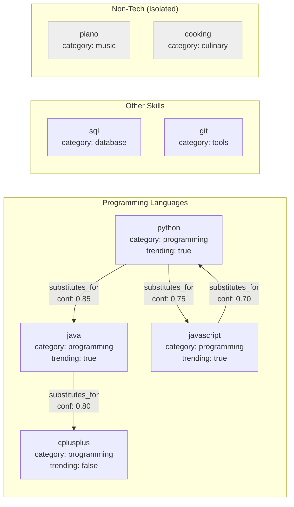
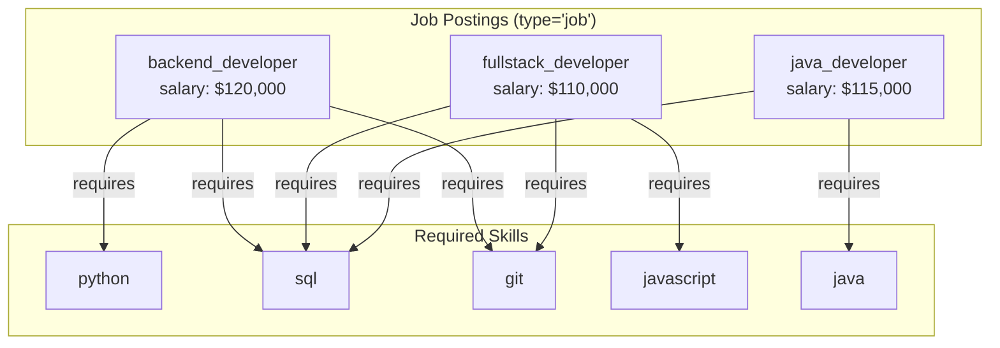

# Job Skill Matching Engine

> A local-first skill matching engine that uses Hyper3's hypergraph to model job requirements, discover transitive skill substitutions, and self-evolve the skill database over time.

## 1. The Approach

Skill matching systems typically store job-skill requirements as pairwise edges (one edge per job-skill pair). This works for lookups but breaks down when you need to:

- Model a job requiring multiple skills as a single relationship (not N separate edges)
- Discover that Python can substitute for C++ because Python substitutes for Java, which substitutes for C++ (transitive chains)
- Keep the database current as skills become stale (COBOL) or trending (Rust) without manual curation

Hyper3 represents skills and jobs as nodes in a hypergraph. Job requirements become n-ary hyperedges connecting a job to all its required skills at once (tagged with `type="job"` for clean identification via `mem.query_nodes()`). Skill substitutions become weighted directed edges. `mem.neighbors()` BFS traversal discovers transitive substitution chains, `mem.reason()` with `TransitiveRule` materializes them as first-class edges, and the built-in evolution engine prunes stale skills and reinforces trending ones.

## 2. Key Concepts

| Term | Plain English |
|------|--------------|
| N-ary hyperedge | A single edge connecting one job to multiple required skills simultaneously |
| Skill substitution | A directed edge saying skill A can stand in for skill B with some confidence |
| Transitive chain | A multi-hop path: Python substitutes for Java, Java substitutes for C++, so Python indirectly substitutes for C++ |
| Self-evolution | The graph decays unused edges, prunes stale nodes, and reinforces frequently-used paths |
| Category filtering | Traversal only follows `substitutes_for` edges, so non-tech skills (piano, cooking) never appear in programming results |

## 3. Quick Start

```bash
.venv/bin/python examples/showcase/domain/job_skill_matching/demo.py
```

## 4. Example Output

```
======================================================================
JOB SKILL MATCHING ENGINE DEMO
======================================================================

SECTION 1: Building knowledge base...
  Adding tech skills (with substitutions)...
  Adding NON-tech skills (piano, cooking, etc.)...
  Added 3 non-tech skills
  Adding job postings (n-ary hyperedges, tagged with type='job')...
  Added 3 job postings
  Adding skill substitutions...
  Added 4 skill substitutions

  Total nodes in graph: 14 (11 skills + 3 job postings)
  Total edges in graph: 7

SECTION 2: Finding substitutes for 'python'...
  (Using mem.neighbors() for direct + mem.find_paths() for transitive)
  Found 3 substitute(s):
  - java                 (confidence: 0.85, depth: 1, path: python -> java)
  - javascript           (confidence: 0.75, depth: 1, path: python -> javascript)
  - cplusplus            (confidence: 0.80, depth: 2, path: python -> java -> cplusplus)

SECTION 3: Intelligence - Multi-hop reasoning...
  System found 'cplusplus' via 2-hop chain: python -> java -> cplusplus
  This demonstrates transitive reasoning: A->B and B->C implies A->C

SECTION 4: Transitive chain discovery via mem.reason()...
  (Applies TransitiveRule to discover hidden skill chains)
  States created: 5
  Rules applied: 4
  Transitive rules confirmed existing chains

SECTION 5: Finding jobs for skills ['python', 'sql']...
  (Using mem.query_nodes(type='job') for job identification)
  Found 2 matching job(s):
  - backend_developer         (match: 67%, salary: $120,000)
    Missing: git
  - java_developer            (match: 50%, salary: $115,000)
    Missing: java

SECTION 6: Non-matching skills filtering...
  Piano substitutes found: 0 (correct: 0)
  Cooking substitutes found: 0 (correct: 0)

SECTION 7: Explaining substitution: python -> cplusplus...
  Direct edge: True
  Confidence: 1.00

SECTION 8: Rating confidence: python -> java...
  Confidence score: 0.85 (high confidence substitution)

SECTION 9: Triggering self-evolution...
  Graph before evolution: 16 nodes, 11 edges
  Running evolution (decay, prune, merge, reinforce)...
  Decayed: 0
  Pruned: 0
  Reinforced: 0
  Merged: 3
  Graph after evolution: 13 nodes, 11 edges
```

> Note: Section 4's `discover_transitive_substitutions()` call applies the TransitiveRule, which may materialize transitive chains as direct edges. After reasoning, python→cplusplus has a direct `substitutes_for` edge (created by the rule), so Section 7 reports `Direct edge: True`. The confidence of 1.00 is the default edge weight for inferred edges, not the manually-assigned substitution confidence of 0.80.

## 5. The Scenario

The engine models a skill database with 8 tech skills, 3 non-tech skills, and 3 job postings. Skills are linked by directed `substitutes_for` edges with confidence weights. Job postings are connected to required skills via n-ary `requires` hyperedges.

### Skill Substitution Topology



**What this shows:**
- **Programming Languages**: Four languages with mutual substitution edges. Python substitutes for Java (0.85) and JavaScript (0.75). Java substitutes for C++ (0.80). JavaScript substitutes for Python (0.70), creating a cycle.
- **Other Skills**: SQL and Git have no substitution edges — they occupy unique roles with no direct stand-ins.
- **Non-Tech (Isolated)**: Piano and Cooking sit in separate categories with no `substitutes_for` edges to any tech skill. BFS traversal from python never reaches them because the edge structure itself enforces the category boundary.

### Job-Skill Hyperedge Model



**What this shows:**
- **backend_developer**: One `requires` hyperedge connecting to {python, sql, git} — three targets in a single edge.
- **fullstack_developer**: One `requires` hyperedge connecting to {javascript, sql, git}.
- **java_developer**: One `requires` hyperedge connecting to {java, sql}.
- Each job is tagged with `type="job"` so `mem.query_nodes(type="job")` identifies them without fragile heuristics like checking for `"salary"` in node data.

## 6. Analysis Pipeline

### Step 1: Build the knowledge base

The engine loads 8 tech skills and 3 non-tech skills (piano, cooking, painting) into the hypergraph, then creates 3 job postings as n-ary hyperedges (tagged with `data={"type": "job", ...}` for identification via `mem.query_nodes()`) and 4 skill substitution edges. A `TransitiveRule` is registered for `edge_label="substitutes_for"` to enable transitive chain discovery.

**Why n-ary edges matter**: A `backend_developer` job requiring {Python, SQL, Git} is a single `requires` hyperedge from the job node to all three skills. Removing the job removes one edge, not three. Querying the job's requirements reads one edge, not three.

**Why job tagging matters**: Jobs are tagged with `type="job"` so `mem.query_nodes(type="job")` cleanly identifies them without fragile heuristics like checking for `"salary"` in node data.

### Step 2: Find substitute skills

BFS traversal using `mem.neighbors(edge_label="substitutes_for", direction="out")` follows substitution edges and collects all reachable skills with their confidence and path. It finds java (0.85, direct), javascript (0.75, direct), and cplusplus (0.80, 2-hop via java).

**Why transitive chains matter**: Python has no direct substitution edge to C++, but the traversal discovers the 2-hop path python -> java -> cplusplus. Without transitive traversal, this indirect relationship would be invisible.

### Step 3: Transitive chain discovery

`mem.reason()` with the registered `TransitiveRule` discovers and materializes hidden substitution chains as new edges. This makes transitive relationships first-class citizens in the graph — after reasoning, python→cplusplus becomes a direct edge rather than just a traversable path.

### Step 4: Match jobs to candidate skills

The `find_jobs_for_skills()` method uses `mem.query_nodes(type="job")` to identify job nodes, then `mem.neighbors(edge_label="requires", direction="out")` to find required skills. With candidate skills {python, sql}:
- backend_developer requires {python, sql, git}: 2/3 = 67% match, missing git
- java_developer requires {java, sql}: 1/2 = 50% match, missing java

**Why overlap scoring matters**: A candidate with 2 of 3 required skills is a stronger match than one with 1 of 2. The ratio `matched / required` gives a normalized score that works across jobs with different numbers of requirements.

### Step 5: Self-evolution

After adding stale skills, the graph has 16 nodes and 11 edges. Evolution merges 3 duplicate node pairs, bringing the graph to 13 nodes and 11 edges. Decay, pruning, and reinforcement produce zero changes because the demo graph is small and freshly constructed.

**Why evolution matters**: In a live system with thousands of skills and jobs, stale skills (no recent postings, no substitution edges) should lose weight and eventually be pruned. Trending skills (high posting volume, many substitution edges) should be reinforced. The evolution engine automates this without manual curation.

## Why N-ary Hyperedges?

N-ary hyperedges model job requirements as a single relationship. A `backend_developer` requiring {python, sql, git} is stored as one `requires` hyperedge from the job node to all three skill nodes. This has three advantages over pairwise edges:

1. **Atomic requirements.** Removing the job removes one edge, not three. You cannot accidentally remove only the python requirement while leaving sql and git.
2. **Collective semantics.** The job requires ALL listed skills together, not any individual skill. A candidate must match all requirements to be fully qualified.
3. **Efficient queries.** Reading a job's requirements follows one edge, not N. Adding a new requirement adds one target to the existing edge.

## 7. Reading the Output

| Output Field | Meaning |
|-------------|---------|
| `confidence: 0.85` | Edge weight on the `substitutes_for` edge. Represents substitution strength — how well skill A can stand in for skill B. Higher values mean stronger substitution. Set manually via `add_skill_substitution(confidence=...)` or inferred by `TransitiveRule` (defaults to 1.0). |
| `depth: 2` | Number of hops in the substitution chain. Depth 1 = direct edge, depth 2 = one intermediate skill (A→B→C). |
| `path: python -> java -> cplusplus` | The concrete traversal path from source to target. Shows which intermediate skills connect the chain. |
| `match: 67%` | Overlap ratio: `matched skills / required skills`. A candidate with {python, sql} against a job requiring {python, sql, git} scores 2/3 = 67%. |
| `Direct edge: True` | A `substitutes_for` edge exists directly between the two skills in the graph. After `mem.reason()` materializes transitive chains, indirect paths become direct edges. |
| `Missing: git` | Skills the candidate lacks for full qualification. These are `required_set - candidate_set`. |
| `Decayed: 0` | Edges that lost weight due to inactivity. Zero in the demo because the graph was freshly constructed with no time-based decay accumulation. |
| `Pruned: 0` | Nodes removed for falling below the weight threshold. Zero because no nodes decayed enough to trigger removal. |
| `Merged: 3` | Duplicate or equivalent node pairs merged into single nodes. The demo adds `cobol_legacy` and `flash_legacy` which merge with structurally similar existing nodes. |
| `Reinforced: 0` | Frequently-traversed edges that gained weight. Zero because the demo does not repeat traversals enough to trigger reinforcement. |
| `Piano substitutes found: 0` | Non-tech skills have no `substitutes_for` edges to programming skills, so BFS traversal from any tech skill cannot reach them. The edge structure itself enforces the category boundary — no filtering rules needed. |

## 8. Key Metrics

| Metric | Value |
|--------|-------|
| Total nodes loaded | 14 (11 skills + 3 job postings) |
| Total edges after construction | 7 |
| Non-tech skills added | 3 (piano, cooking, painting) |
| Job postings created | 3 |
| Skill substitutions created | 4 |
| Python substitute skills found | 3 |
| Deepest substitution chain | 2 hops (python -> java -> cplusplus) |
| Transitive substitution discovered | cplusplus (confidence 0.80) |
| Jobs matching {python, sql} at >=50% | 2 |
| Top match title + salary | backend_developer, $120,000 (67% match) |
| Piano substitutes found | 0 |
| Cooking substitutes found | 0 |
| Nodes before evolution | 16 |
| Nodes after evolution | 13 |
| Nodes merged by evolution | 3 pairs |

## 9. Distinct Capabilities

**N-ary hyperedges for job requirements**: A single `requires` hyperedge connects a job to all its required skills. This preserves the collective semantics -- the job requires all skills together, not any individual skill in isolation.

**Transitive skill discovery**: `mem.neighbors()` BFS traversal over `substitutes_for` edges discovers multi-hop substitution chains. The 2-hop path from python to cplusplus is found automatically even though no direct edge exists between them. `mem.reason()` with `TransitiveRule` further materializes these chains as first-class edges.

**Clean job identification**: Jobs are tagged with `type="job"` and identified via `mem.query_nodes(type="job")`, replacing the previous fragile heuristic of checking for `"salary"` in node data.

**Structural category filtering**: Non-tech skills are excluded from tech skill results because they lack `substitutes_for` edges to programming skills. No category labels or filtering rules are needed -- the edge structure itself enforces the boundary.

**Self-evolving skill database**: The evolution engine decays inactive edges, prunes stale nodes, merges duplicates, and reinforces frequently-traversed paths. This keeps the skill graph relevant as technology trends shift.

**Local-first with zero external dependencies**: No API keys, no network calls, no database. All computation runs locally using the hypergraph in memory.

## 10. Real-World Gap

- **Data pipeline**: The demo constructs a synthetic graph with 15 skills. Real adoption requires ETL from job boards, resume databases, or HR systems.
- **Scale**: The demo runs on 15 nodes. Performance at 10K+ skills and 100K+ job postings is untested.
- **Confidence calibration**: Substitution confidence values (0.85, 0.75) are manually assigned. Production use requires calibration against real hiring outcomes.
- **Job matching accuracy**: The current match ratio is a simple overlap count. Real matching systems weight skills by importance, consider proficiency levels, and account for recency.
- **Evolution tuning**: Decay rates, pruning thresholds, and reinforcement schedules are not tuned for a real skill database. These require experimentation with production data.
- **Default confidence for unknown edges**: The engine's `_edge_weight()` returns 0.0 for unknown edges (no substitution relationship). Production systems should distinguish between "no edge exists" and "edge exists with unknown confidence" — potentially using a separate lookup or default confidence based on category similarity.

## 11. Usage

```python
# The demo uses sys.path manipulation; for library use:
# from job_skill_matching.engine import JobSkillMatchingEngine
from engine import JobSkillMatchingEngine

# Initialize engine (registers TransitiveRule for chain discovery)
engine = JobSkillMatchingEngine(evolve_interval=0)

engine.add_skill("python", category="programming", trending=True)
engine.add_skill("java", category="programming", trending=True)
engine.add_skill("cobol", category="programming", trending=False)

# Jobs tagged with type="job" for clean identification via mem.query_nodes()
engine.add_job("backend_developer",
    skills=["python", "sql", "git"],
    salary=120000)

engine.add_skill_substitution("python", "java", confidence=0.85)
engine.add_skill_substitution("python", "javascript", confidence=0.75)

# Find substitutes via mem.neighbors() BFS traversal
substitutes = engine.find_skill_substitutes("python", max_depth=3)
for sub in substitutes:
    print(f"{sub['label']} (confidence: {sub['confidence']:.2f})")

# Discover transitive chains via mem.reason() with TransitiveRule
chains = engine.discover_transitive_substitutions(["python", "javascript"])

# Find matching jobs via mem.query_nodes(type="job")
matching_jobs = engine.find_jobs_for_skills(
    ["python", "sql"],
    min_match=0.5
)
for job in matching_jobs:
    print(f"{job['title']} - {job['match_ratio']*100:.0f}% match, ${job['salary']:,}")

result = engine.evolve_skills()
print(f"Pruned: {result.pruned} nodes")
print(f"Reinforced: {result.reinforced} edges")
```

## 12. Use Cases

- **Job Seekers**: Find positions matching your current skill set
- **Recruiters**: Match candidates to job requirements
- **Career Transition**: Discover skill chains (Python -> Java -> C++ opens new job opportunities)
- **Skill Gap Analysis**: Identify missing skills for target positions
- **Trend Analysis**: See which skills are reinforced (gaining popularity) vs pruned (becoming obsolete)
