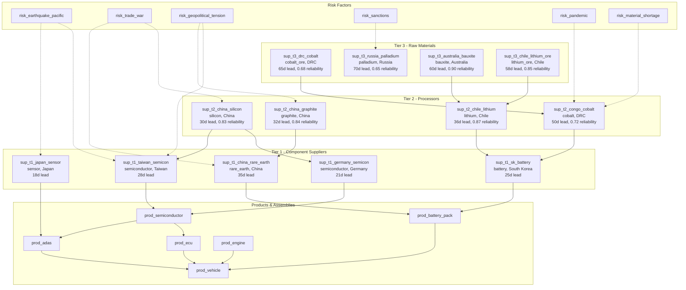

# Supply Chain Resilience Showcase

> **Risk Cascade Analysis, Single-Point-of-Failure Identification, and Diversification Recommendations for a 126-Node Multi-Tier Global Supply Chain**

## 1. The Approach

Supply chains are networks of dependencies: tier-3 raw material suppliers feed tier-2 processors, which feed tier-1 component manufacturers, which feed factories, distribution centers, and finally customers. When a disruption hits one node — a trade war, earthquake, or pandemic — the impact cascades through these dependencies to nodes that seem unrelated on the surface.

**The Visibility Problem:** Traditional supply chain tools track direct supplier relationships (who ships to whom). They do not propagate risk across multi-hop paths. A tariff on Chinese silicon sounds like a tier-2 problem, but silicon feeds semiconductor production, semiconductors feed ECUs, and ECUs feed the final vehicle. That chain is invisible in a flat supplier list.

**The Hyper3 Approach:** Model the supply chain as a hypergraph with typed, directed edges. Apply `TransitiveRule` to discover multi-hop cascade paths (risk → supplier → product → assembly → vehicle). Apply `InverseRule` to trace upstream dependencies. Use centrality metrics to identify chokepoints. The result is a ranked list of single points of failure with concrete diversification recommendations.

## 2. A Simple Analogy

Think of a supply chain like a river system. Tier-3 suppliers are mountain springs, tier-2 suppliers are tributaries, tier-1 suppliers are rivers, and the factory is the reservoir. If a spring dries up (supplier failure), the tributary drops, the river slows, and the reservoir level falls. You cannot see the connection from the reservoir alone — you need to trace the water back to its source. This showcase does exactly that: traces disruptions from risk events back through every tier to the final product.

## 3. Key Concepts

| Term | Plain English Meaning |
|------|----------------------|
| **Tier-1/2/3 Supplier** | Direct, sub-, and raw-material suppliers in the chain hierarchy |
| **Single-source supplier** | A supplier with `single_source=True` — no alternative exists |
| **Risk cascade** | A multi-hop path from a risk event to affected products via `affected_by` edges |
| **Betweenness centrality** | How many shortest paths pass through a node — high values indicate bottlenecks |
| **Degree centrality** | How many direct connections a node has — high values indicate wide ripple potential |
| **TransitiveRule** | Discovers chains: A supplies_to B, B supplies_to C → A indirectly_supplies C |
| **InverseRule** | Reverses edges: A supplies_to B → B supplied_by A |
| **Lead time** | Days from order to delivery; longer chains accumulate higher total lead times |
| **Backup coverage** | Whether a supplier or distribution center has a named backup in the network |

## 4. Quick Start

Run the showcase to build a 126-node global supply chain graph and analyze risk cascades:

```bash
.venv/bin/python examples/showcase/domain/supply_chain_resilience/supply_chain_resilience.py
```

### What You'll See

The showcase builds a multi-tier supply chain and runs 7 analysis sections:

```
======================================================================
SECTION 1: Supply Chain Network Construction
======================================================================
  Nodes: 126
  Edges: 268
    supplies_to:      61
    manufactured_at:   16
    stored_at:         24
    transported_via:   20
    affected_by:       68
    depends_on:        39
    serves:            25
    backup_for:        15
```

## 5. The Scenario

The example models a global automotive supply chain with **126 nodes and 268 edges** across 7 categories:

- **32 Suppliers** across 3 tiers in 15 countries (US, Germany, Taiwan, Japan, China, South Korea, Mexico, Chile, Vietnam, India, Canada, Australia, Brazil, DRC, Indonesia, Thailand, Kazakhstan, Peru, South Africa, Mongolia, Russia, Argentina)
- **22 Products** from raw materials to finished vehicle
- **16 Factories** in 12 cities on 4 continents
- **16 Distribution centers** across 11 regions
- **16 Transport routes** (ship, rail, truck, air)
- **12 Risk factors** (natural, geopolitical, regulatory, climate)
- **12 Customer markets** across 8 regions

### Edge Taxonomy

| Edge Label | Count | Semantics |
|-----------|-------|-----------|
| `supplies_to` | 61 | Tier-3 → Tier-2 → Tier-1 → Product material flow |
| `affected_by` | 68 | Risk → Supplier/Product/Factory/Transport exposure |
| `depends_on` | 39 | Product → Product component dependencies |
| `serves` | 25 | Distribution center → Customer market coverage |
| `stored_at` | 24 | Product → Distribution center inventory |
| `transported_via` | 20 | Factory → Transport route usage |
| `manufactured_at` | 16 | Product → Factory production |
| `backup_for` | 15 | Supplier/DC backup relationships |

### Supply Chain Topology

Figure 1: The multi-tier supply chain with risk exposure and product assembly flow.



## 6. Analysis Pipeline

The showcase runs 7 analysis sections, each building on the previous.

### Section 1: Network Construction

Builds the 126-node, 268-edge hypergraph. Nodes carry typed data: suppliers have `tier`, `country`, `lead_time_days`, `reliability_score`, `single_source`, and `material` attributes. Products have `criticality` and `alternate_count`. Factories have `utilization` and `automation_level`. Risks have `probability` and `impact`.

This data structure enables every subsequent analysis. Without typed node data, centrality metrics would identify important nodes but not explain *why* they are important or what to do about them.

### Section 2: Centrality Analysis

Computes degree and betweenness centrality across the full network.

**Degree centrality** identifies `prod_vehicle` (0.240) as the most connected node — expected for a final product. More revealing: `prod_semiconductor` and `prod_ecu` tie at 0.104, indicating that semiconductors and electronic control units are hub materials feeding multiple assemblies.

**Betweenness centrality** reveals `prod_vehicle` (0.164) as the dominant bottleneck, but `prod_battery_pack` (0.072) and `prod_ecu` (0.051) rank second and third — meaning these intermediate assemblies sit on many shortest paths between risks and the final product. Disrupting either of these two nodes fragments the network more than disrupting any individual supplier.

Why this matters: a node with high betweenness but low degree is a *bridge* — removing it disconnects parts of the graph. `prod_battery_pack` has degree 0.080 but betweenness 0.072, meaning it occupies a structurally critical bridging position despite not being the most connected node.

### Section 3: Single Points of Failure

Identifies 11 single-source suppliers, 9 critical products with 1 or fewer alternates, and 9 single-source suppliers with no backup coverage.

The most exposed suppliers are `sup_t3_russia_palladium` (reliability 0.65, 70-day lead time, no backup) and `sup_t3_drc_cobalt` (reliability 0.68, 65-day lead time, no backup). These combine low reliability, long lead times, and zero redundancy — the three ingredients that make a disruption unrecoverable.

Why this matters: filtering by `single_source=True` alone would flag 11 suppliers, but the `backup_for` edge data reveals that only 2 of the 11 have backup coverage. The remaining 9 are true single points of failure with no safety net.

### Section 4: Risk Cascade Reasoning

Applies `TransitiveRule` to discover multi-hop cascade paths. Two reasoning phases run:

- **Phase 1** (risk cascade): `TransitiveRule` on `affected_by` edges, producing `cascade_affected_by` edges. Explores 51 states, applies 50 rules, produces 50 new edges. Discovers 25 cascade edges linking risks to indirectly affected products.
- **Phase 2** (indirect supply): `TransitiveRule` on `supplies_to` edges, producing `indirectly_supplies` edges. Discovers 70 indirect supply relationships.

The cascade analysis reveals that `risk_cyber_attack` reaches 2 products (both `prod_semiconductor` through different suppliers), `risk_earthquake_pacific` reaches 2 products (`prod_semiconductor` and `prod_sensor`), and five other risks each reach 1 product through cascade paths. Without transitive reasoning, these multi-hop impacts would remain hidden — the direct `affected_by` edges only connect risks to their immediate targets.

### Section 5: Risk Cascade Path Tracing

Traces concrete paths from the highest-impact risks to `prod_vehicle` using `find_paths()`:

- **`risk_trade_war`** reaches `prod_vehicle` in 5 hops: `risk_trade_war → sup_t2_china_silicon → prod_ecu → prod_sensor → prod_vehicle` (30-day cumulative lead time)
- **`risk_geopolitical_tension`** reaches `prod_vehicle` in 4 hops: `risk_geopolitical_tension → sup_t2_china_graphite → prod_battery_pack → prod_vehicle` (32-day cumulative lead time) and in 8 hops through the full component chain
- **`risk_sanctions`** reaches `prod_vehicle` in 7 hops: `risk_sanctions → sup_t3_russia_palladium → sup_t2_sa_platinum → prod_circuit_board → prod_ecu → prod_sensor → prod_vehicle` (112-day cumulative lead time)
- **`risk_material_shortage`** reaches `prod_vehicle` in 4 hops through battery cells

The sanctions path is notable: it spans 3 supplier tiers and 2 product assemblies before reaching the vehicle, with a 112-day cumulative lead time. This means a sanctions event today would take over 3 months to fully propagate through inventory buffers.

The network forms a single connected component of 126 nodes, meaning any disruption can theoretically reach any part of the chain.

### Section 6: Lead Time Analysis

Computes cumulative lead times across supplier tiers:

| Tier | Average Lead Time | Max | Min | Count |
|------|------------------|-----|-----|-------|
| Tier 1 | 21 days | 35d | 10d | 12 |
| Tier 2 | 40 days | 55d | 25d | 12 |
| Tier 3 | 53 days | 70d | 20d | 8 |

The worst-case 3-tier chain is `sup_t3_drc_cobalt → sup_t2_congo_cobalt → sup_t1_sk_battery` with a cumulative lead time of 140 days (65 + 50 + 25). Every day of delay at any tier compounds — a 10-day delay at the tier-3 source adds 10 days to the total chain.

The supplier reliability risk ranking scores each supplier by `(1 - reliability) * lead_time * 1.5` for single-source nodes. The top 6 highest-risk suppliers are all single-source, confirming that the combination of sole dependency and low reliability creates the highest exposure.

### Section 7: Backup Coverage & Diversification Recommendations

Identifies 5 distribution centers without backup coverage and ranks the top 5 diversification priorities:

| Priority | Supplier | Country | Material | Risk Score | Has Backup |
|----------|----------|---------|----------|------------|------------|
| 1 | sup_t3_russia_palladium | Russia | palladium | highest | No |
| 2 | sup_t3_drc_cobalt | DRC | cobalt_ore | high | No |
| 3 | sup_t2_congo_cobalt | DRC | cobalt | high | No |
| 4 | sup_t2_kazakhstan_uranium | Kazakhstan | uranium | moderate | No |
| 5 | sup_t1_china_rare_earth | China | rare_earth | moderate | No |

All 5 priorities lack backup coverage and are single-source. The ranking accounts for reliability, lead time, risk exposure (number and severity of connected risk events), and whether a backup exists.

## 7. Understanding Output

### Centrality Scores

| Metric | What It Measures | High Value Means |
|--------|-----------------|-----------------|
| Degree centrality | Direct connections (weighted by network size) | Wide ripple effect — disruption spreads to many neighbors |
| Betweenness centrality | Fraction of shortest paths passing through | Bridge node — removal fragments the network |

### Risk Scores

The diversification priority score combines:
- `(1 - reliability_score)` — lower reliability increases urgency
- `lead_time_days` — longer lead times increase recovery difficulty
- `risk_exposure` — sum of connected risk impact values
- `2x penalty` if no backup exists

### Cascade Edge Labels

| Label | Produced By | Meaning |
|-------|-------------|---------|
| `cascade_affected_by` | TransitiveRule on `affected_by` | Multi-hop risk propagation |
| `indirectly_supplies` | TransitiveRule on `supplies_to` | Indirect material flow across tiers |
| `supplied_by` | InverseRule on `supplies_to` | Reverse direction of supply |

## 8. Key Metrics

| Metric | Value |
|--------|-------|
| Total nodes | 126 |
| Total edges (initial) | 268 |
| Total edges (after reasoning) | 368 |
| Connected components | 1 |
| Supplier tiers | 3 (T1: 12, T2: 12, T3: 8) |
| Single-source suppliers | 11 |
| Critical products with <=1 alternate | 9 |
| Single-source suppliers without backup | 9 |
| Distribution centers without backup | 5 |
| Risk cascade edges discovered | 25 |
| Indirect supply edges discovered | 70 |
| States explored (Phase 1) | 51 |
| Rules applied (Phase 1) | 50 |
| New edges (Phase 1) | 50 |
| States explored (Phase 2) | 51 |
| Worst-case cumulative lead time | 140 days |
| Worst-case chain | sup_t3_drc_cobalt → sup_t2_congo_cobalt → sup_t1_sk_battery |
| Highest degree centrality | prod_vehicle (0.240) |
| Highest betweenness centrality | prod_vehicle (0.164) |
| Second highest betweenness | prod_battery_pack (0.072) |
| Seed nodes for reasoning | 60 |

## 9. What Makes This Different

**Typed, directed hypergraph edges** distinguish supply chain relationships. The 8 edge labels (`supplies_to`, `affected_by`, `depends_on`, `serves`, `stored_at`, `transported_via`, `manufactured_at`, `backup_for`) carry distinct semantics that a single generic "connected_to" relationship would lose. Reasoning rules operate on specific edge labels, so the `TransitiveRule` on `supplies_to` discovers supply chains while the same rule on `affected_by` discovers risk cascades — without mixing the two.

**Transitive inference reveals hidden dependencies.** The 70 indirect supply edges and 25 cascade edges are not stored in the original data. They are computed by following chains across tiers. A spreadsheet listing direct supplier relationships would show 61 supply links; the transitive closure reveals 70 additional indirect links that show the full material provenance.

**Multi-hop path tracing quantifies disruption timelines.** The `find_paths()` output includes cumulative lead time along each path. The sanctions-to-vehicle path accumulates 112 days of lead time — a concrete number for how long the buffer lasts before the disruption hits the final product.

**Node data attributes enable priority ranking.** Suppliers carry `reliability_score`, `lead_time_days`, and `single_source` attributes. The diversification ranking combines these with graph-derived `risk_exposure` to produce an actionable priority list, not just a list of names.

## 10. Code Implementation

### Building the Supply Chain

```python
mem = HypergraphMemory(evolve_interval=0)

suppliers = {
    "sup_t1_germany_semicon": {"category": "supplier", "tier": 1, "country": "Germany",
                                "lead_time_days": 21, "reliability_score": 0.95,
                                "single_source": True, "material": "semiconductor"},
}
for name, data in suppliers.items():
    mem.add(name, data=data)

mem.link("sup_t2_china_silicon", "sup_t1_germany_semicon", label="supplies_to")
```

### Identifying Single Points of Failure

```python
single_source_suppliers = [
    (name, data) for name, data in suppliers.items()
    if data.get("single_source")
]
```

### Running Risk Cascade Reasoning

```python
mem.add_rules(
    TransitiveRule(edge_label="affected_by", new_label="cascade_affected_by"),
    TransitiveRule(edge_label="supplies_to", new_label="indirectly_supplies"),
)

result = mem.reason(
    seeds=cascade_seeds,
    max_depth=3,
    max_total_states=50,
)

cascades = mem.pattern_match(edge_label="cascade_affected_by")
```

### Tracing Disruption Paths

```python
paths = mem.find_paths("risk_sanctions", "prod_vehicle", max_depth=8, max_paths=3)
for path in paths:
    lead_total = sum(
        mem.engine.graph.get_node_by_label(step).data.get("lead_time_days", 0)
        for step in path
    )
```

## 11. Real-World Gap

- **Data pipeline**: The showcase constructs a synthetic 126-node graph. Real deployment requires ETL from ERP, procurement, and logistics systems to build the initial graph.
- **Scale**: The analysis runs on 126 nodes with 368 edges. Performance at 10K+ nodes (large enterprise supply chains) is untested.
- **Dynamic data**: Real supply chains change daily — suppliers are added, lead times fluctuate, risk probabilities shift with current events. This showcase uses static snapshots.
- **Probability weighting**: Risk `probability` and `impact` are stored as node attributes but are not incorporated into the cascade scoring or path tracing. A production system would weight cascade paths by expected loss.
- **Inventory buffers**: The model does not account for safety stock, reorder points, or inventory policies that absorb short disruptions.
- **Temporal dynamics**: Lead times are cumulative sums, not simulation-based. Actual disruption propagation depends on order timing, shipping schedules, and in-transit inventory.

## 12. Reference

### API Methods Used

| Method | Purpose |
|--------|---------|
| `HypergraphMemory(evolve_interval=0)` | Create memory with deterministic behavior |
| `mem.add(name, data=...)` | Add a typed node with attributes |
| `mem.link(src, tgt, label=...)` | Create a directed edge between nodes |
| `mem.analyze.centrality("degree")` | Compute normalized degree for all nodes |
| `mem.analyze.centrality("betweenness")` | Compute normalized betweenness for all nodes |
| `mem.add_rules(...)` | Register inference rules |
| `mem.reason(seeds=..., depth=..., max_total_states=...)` | Run multiway reasoning |
| `mem.pattern_match(edge_label=...)` | Find edges matching a label |
| `mem.find_paths(src, tgt, depth=..., max_paths=...)` | Trace paths between nodes |
| `mem.connected_components()` | Find connected subgraphs |
| `mem.engine.graph.get_node_by_label(name)` | Look up a node by its label |
| `top_k(scores, k=N)` | Get top N items from a centrality dict |

### Related Showcases

- **Microservices Reasoning** — TransitiveRule and InverseRule applied to service dependency blast radius
- **Centrality and Ranking** — Degree, betweenness, and PageRank on network graphs
- **Paths and Connectivity** — Path tracing, connected components, and network connectivity
- **Multiway Reasoning** — Deep dive into the multiway expansion engine
