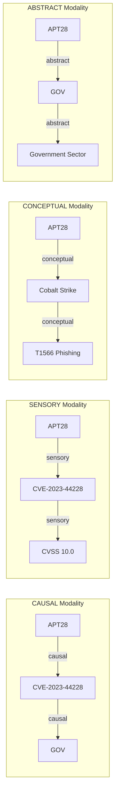
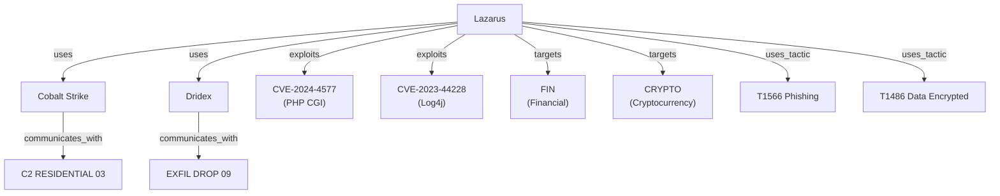
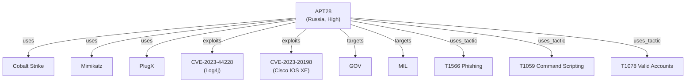
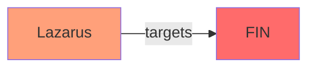
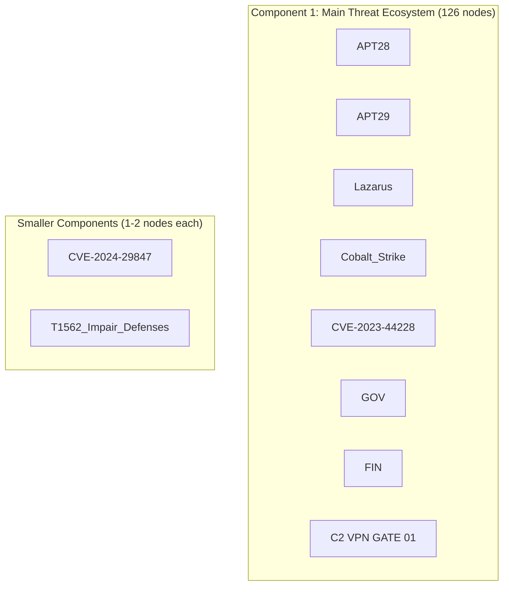

# Threat Intelligence Knowledge Base Showcase

> **Building and Querying a Cyber Threat Intelligence Graph with 140+ Nodes and 309+ Edges**

## 1. The Approach

Security teams typically manage threat intelligence as flat lists: CVEs in one spreadsheet, threat actors in another, and TTPs in a third. Correlating across these silos requires manual cross-referencing that doesn't scale.

**The Silo Bottleneck:** Traditional threat intel tools force analysts to query each data type separately. Finding that APT28 exploits Log4j to target government networks requires three separate queries and mental joins. By the time you correlate the data, the attack may have already spread.

**The Hyper3 Approach:** Store all entities as nodes in a unified hypergraph with semantic edge labels. One query traverses from threat actor -> malware -> CVE -> target industry, revealing attack chains that span multiple data types in a single traversal. Rule-based inference extends the graph with indirect relationships. Community detection identifies operational clusters. Structural anomaly detection flags actors with unusual connectivity patterns.

## 2. A Simple Analogy

Think of this like a social network graph where people (threat actors) use tools (malware), exploit vulnerabilities (CVEs), and target organizations (industries). Just as LinkedIn shows you how you're connected to a recruiter through mutual connections, Hyper3 shows you how APT28 is connected to your industry through a chain of malware and vulnerabilities. The inference engine is like LinkedIn's "People You May Know" -- it discovers connections you didn't manually add.

## 3. Key Concepts

| Term | Plain English Meaning |
|------|----------------------|
| **Threat Actor** | APT groups, ransomware operators (e.g., APT28, Lazarus, Conti) |
| **CVE** | Published vulnerability with CVSS score (e.g., Log4j CVE-2023-44228) |
| **Malware** | RATs, ransomware, trojans used by actors (e.g., Cobalt Strike, Emotet) |
| **TTP** | MITRE ATT&CK tactics and techniques (e.g., T1566 Phishing) |
| **Infrastructure** | C2 servers, botnets, exfiltration servers |
| **Modality** | The lens through which you view a node (CAUSAL, SENSORY, CONCEPTUAL, ABSTRACT) |
| **Pattern Match** | Finding edges by label or source node |
| **Centrality** | How connected a node is -- high centrality = high impact |
| **Subgraph** | Extracting a subset of the graph around a specific node |
| **Connected Component** | A cluster of nodes where every node can reach every other |
| **Inference Rule** | A pattern that generates new edges from existing structure |
| **Community** | A group of nodes with dense internal connections, detected algorithmically |
| **Anomaly Status** | Classification along low_risk / boundary / anomalous based on structural analysis |

## 4. Quick Start

Run the showcase to build a 140-node threat intelligence graph:

```bash
.venv/bin/python examples/showcase/domain/threat_intelligence/knowledge_basics.py
```

### What You'll See

The example builds a realistic threat intel graph and demonstrates 12 analysis sections:

```
======================================================================
SECTION 1: Building the Threat Intelligence Knowledge Base
======================================================================
  Stored 140 nodes
  Created 293 edges (293 requested)
```

## 5. The Scenario & Topology

The example models a comprehensive threat intelligence ecosystem with **140 nodes**. Manual edge construction produces **293 edges**; rule-based inference adds 16 more for a final total of **309 edges**.

- **32 Threat Actors:** APT groups from Russia, China, Iran, North Korea, Eastern Europe
- **32 CVEs:** High-severity vulnerabilities (CVSS 7.5-10.0) from 2023-2024
- **22 Malware Families:** RATs, ransomware, trojans, backdoors
- **23 TTPs:** MITRE ATT&CK techniques (phishing, exploitation, credential dumping)
- **16 Infrastructure Nodes:** C2 servers, botnets, exfiltration servers
- **15 Target Industries:** Government, financial, healthcare, energy, telecom, etc.

### Threat Intelligence Graph Topology

Figure 1: The knowledge graph connects six entity types through eight edge relationships.

```mermaid
graph TD
    subgraph "Threat Actors"
        APT28["APT28<br/>(Russia, High)"]
        Lazarus["Lazarus<br/>(North Korea, High)"]
        Conti["Conti<br/>(Eastern Europe, High)"]
        APT29["APT29<br/>(Russia, High)"]
    end

    subgraph "Malware"
        CS["Cobalt Strike<br/>(RAT, Windows)"]
        Emotet["Emotet<br/>(Trojan, Windows)"]
        Ryuk["Ryuk<br/>(Ransomware, Windows)"]
    end

    subgraph "CVEs"
        Log4j["CVE-2023-44228<br/>(CVSS 10.0, Log4j)"]
        FortiOS["CVE-2024-21762<br/>(CVSS 9.8, FortiOS)"]
        PAN["CVE-2024-3400<br/>(CVSS 10.0, PAN-OS)"]
    end

    subgraph "TTPs"
        Phish["T1566 Phishing<br/>(Initial Access)"]
        Exploit["T1190 Exploit Public App<br/>(Initial Access)"]
        CredDump["T1003 Credential Dumping<br/>(Credential Access)"]
    end

    subgraph "Infrastructure"
        C2VPN["C2 VPN GATE 01<br/>(Russia)"]
        Botnet["BOTNET EMOTET MESH<br/>(Distributed)"]
        Exfil["EXFIL CLOUD STORAGE 13<br/>(AWS S3)"]
    end

    subgraph "Target Industries"
        GOV["GOV<br/>(Government)"]
        FIN["FIN<br/>(Financial)"]
        HC["HC<br/>(Healthcare)"]
        ENERGY["ENERGY<br/>(Energy)"]
    end

    APT28 --"uses"--> CS
    APT28 --"exploits"--> Log4j
    APT28 --"targets"--> GOV
    Lazarus --"uses"--> CS
    Lazarus --"exploits"--> Log4j
    Lazarus --"targets"--> FIN
    Conti --"uses"--> Ryuk
    Conti --"targets"--> HC

    CS --"communicates_with"--> C2VPN
    Emotet --"communicates_with"--> Botnet
    Ryuk --"communicates_with"--> Exfil

    APT28 --"uses_tactic"--> Phish
    APT28 --"uses_tactic"--> Exploit
    Lazarus --"uses_tactic"--> Phish
    Lazarus --"uses_tactic"--> CredDump

    C2VPN --"attributed_to"--> APT28
    Botnet --"attributed_to"--> Emotet
```



### Edge Label Taxonomy

| Category | Labels | Meaning |
|----------|---------|---------|
| **Attribution** | `uses`, `exploits`, `targets` | Primary attack relationships |
| **Lineage** | `variant_of` | Malware family relationships |
| **Infrastructure** | `communicates_with`, `attributed_to` | C2 and infrastructure usage |
| **Tactics** | `uses_tactic` | MITRE ATT&CK technique usage |
| **Defense** | `mitigates` | Which TTPs mitigate which CVEs |
| **Inferred** | `attributed_to_inverse` | Reverse attribution from reasoning (Section 10) |

### Multi-Modal Storage

Figure 2: The same node can be viewed through different modalities, each revealing different neighbors.



## 6. The Analysis Pipeline (Narrative Walkthrough)

The example walks through 12 sections that demonstrate progressively sophisticated queries.

### Phase 1: Building the Knowledge Base

Bulk-create 140 nodes across 6 entity types, then wire them together with 293 semantic edges:

```python
mem = HypergraphMemory(evolve_interval=0)

for actor in THREAT_ACTORS:
    mem.add(actor["label"], data=actor["data"], modalities={Modality.CAUSAL})

for rel_label, pairs in RELATIONSHIP_MAP.items():
    for src, tgt in pairs:
        mem.link(src, tgt, label=rel_label)
```

**Result:** 140 nodes, 293 edges representing a complete threat intel ecosystem.

### Phase 2: Recall and Neighborhood Traversal

Explore what's connected to Lazarus in 2 hops:

```python
lazarus_neighborhood = mem.recall("Lazarus", max_depth=2, max_nodes=30)
```

Figure 3: Recall from Lazarus reveals 10 nodes connected through malware, CVEs, and target sectors.



**Discovery:** Lazarus connects to Financial and Cryptocurrency sectors through 2-hop paths via malware and CVEs.

### Phase 3: Pattern Matching for Attack Chains

Find all edges by label to understand attack surfaces:

```python
exploits_edges = mem.pattern_match(edge_label="exploits")  # 43 edges
uses_edges = mem.pattern_match(edge_label="uses")          # 66 edges
targets_edges = mem.pattern_match(edge_label="targets")    # 62 edges
```

**The Discovery:** CVE-2023-44228 (Log4j) enables attacks on 12 different industry sectors -- the most broadly connected vulnerability in the graph. 11 threat actors exploit it, spanning multiple regions.

### Phase 4: Top 5 Most Connected CVEs

Use degree centrality to find the highest-impact vulnerabilities:

```python
centrality = mem.analyze.centrality("degree")
cve_centrality = {k: v for k, v in centrality.items() if k in cve_set}
top_cves = top_k(cve_centrality, k=5)
```

| Rank | CVE | Centrality | CVSS | Product |
|------|-----|-----------|------|---------|
| 1. | CVE-2023-44228 | 0.0863 | 10.0 | Apache Log4j2 |
| 2. | CVE-2024-3400 | 0.0360 | 10.0 | PAN-OS |
| 3. | CVE-2024-1709 | 0.0288 | 10.0 | ConnectWise ScreenConnect |
| 4. | CVE-2023-34362 | 0.0216 | 9.8 | MOVEit Transfer |
| 5. | CVE-2023-46805 | 0.0216 | 8.1 | Ivanti Connect Secure |

**Key Insight:** Log4j's centrality is 2.4x higher than the next CVE -- it's the single most critical vulnerability in the dataset.

### Phase 5: Subgraph Extraction -- APT28 Full Profile

Extract a complete profile of APT28 by gathering all its connections:

```python
apt28_exploits = mem.pattern_match(source_label="APT28", edge_label="exploits")
apt28_uses = mem.pattern_match(source_label="APT28", edge_label="uses")
apt28_targets = mem.pattern_match(source_label="APT28", edge_label="targets")
apt28_ttps = mem.pattern_match(source_label="APT28", edge_label="uses_tactic")

apt28_labels = {"APT28"}
for edges in [apt28_exploits, apt28_uses, apt28_targets, apt28_ttps]:
    for e in edges:
        apt28_labels.update(e.source_labels)
        apt28_labels.update(e.target_labels)

sg = mem.subgraph(apt28_labels)
```

Figure 4: APT28's subgraph reveals its complete attack profile -- 11 nodes and 10 edges.



### Phase 6: Attack Paths -- Tracing Threats to Industries

Find paths from threat actors to target industries:

```python
paths = mem.analyze.paths("Lazarus", "FIN", max_depth=4, max_paths=10)
```

Figure 5: Attack paths from Lazarus to Financial sector.



**Result:** The direct `targets` edge from Lazarus to Financial sector is found. Additional paths through intermediate nodes (CVEs, malware) would require edges connecting those intermediaries to the target sector.

### Phase 7: Isolated Indicators Needing Enrichment

Find nodes with no edges -- these are isolated indicators that need more context:

```python
all_labels = {n.label for n in mem.engine.graph.nodes}
connected_labels: set[str] = set()
for edge in mem.analyze.edges():
    connected_labels.update(edge["source_labels"])
    connected_labels.update(edge["target_labels"])

isolated = all_labels - connected_labels
```

**Discovery:** 12 isolated nodes lack context -- they may be stale indicators, false positives, or entities that need additional relationship mapping.

### Phase 8: Connected Components -- Threat Ecosystems

Identify threat ecosystems -- clusters of actors, malware, and infrastructure that operate together:

```python
components = mem.analyze.components()
components_sorted = sorted(components, key=len, reverse=True)
```

Figure 6: The largest component contains 126 nodes spanning multiple threat actors and their shared infrastructure.



**Discovery:** The main ecosystem (126 nodes) connects 32 threat actors through shared malware (Cobalt Strike) and CVEs (Log4j). 12 isolated nodes lack edges entirely and need enrichment.

### Phase 9: Modality-Filtered Traversal

Query the same node through different modalities to see different slices:

```python
causal_nodes = mem.query("CVE-2023-44228", modality=Modality.CAUSAL, max_depth=2, max_nodes=20)
sensory_nodes = mem.query("CVE-2023-44228", modality=Modality.SENSORY, max_depth=2, max_nodes=20)
conceptual_nodes = mem.query("CVE-2023-44228", modality=Modality.CONCEPTUAL, max_depth=2, max_nodes=20)
```

| Modality | Returns | Purpose |
|----------|---------|---------|
| **CAUSAL** | 11 threat actors who exploit this CVE | "Who causes this?" |
| **SENSORY** | The CVE node itself (CVSS data) | "Technical metadata" |
| **CONCEPTUAL** | Related TTPs (1 node) | "What techniques are involved?" |
| **ABSTRACT** | High-level categories | "Strategic impact" |

### Phase 10: Indirect Attack Chain Inference

Apply rule-based inference to discover edges not manually added. Three rules are registered:

```python
mem.add_rules(
    TransitiveRule(edge_label="exploits", new_label="exploits_indirectly"),
    TransitiveRule(edge_label="uses", new_label="uses_indirectly"),
    InverseRule(edge_label="attributed_to", inverse_label="attributed_to_inverse"),
)

reason_result = mem.reason(seeds={"APT28", "Lazarus", "Conti"}, max_depth=3)
```

**Result:** 16 inferred edges produced across 17 states with 16 rule applications.

The InverseRule reversed all 16 `attributed_to` edges (infrastructure -> actor) into `attributed_to_inverse` edges (actor -> infrastructure). This enables traversal directly from a threat actor to infrastructure attributed to them, without needing to follow the original direction.

The TransitiveRules for `exploits` and `uses` found 0 same-label two-hop chains. This is expected: `exploits` edges only go from actors to CVEs (no CVE exploits another node), and `uses` edges only go from actors to malware (no malware uses another entity). Transitive inference requires chain structures like A-[exploits]->B-[exploits]->C.

**Why this matters:** In a production threat intel graph with longer chains (e.g., actor exploits CVE, CVE affects product, product is deployed in sector), the TransitiveRule would infer indirect attack paths. The InverseRule already provides value here by enabling bidirectional traversal of attribution relationships. Without inference, discovering that APT28 can reach C2_VPN_GATE_01 requires knowing to traverse the `attributed_to` edge in reverse. With the inferred `attributed_to_inverse` edge, a forward traversal from APT28 directly reaches its infrastructure.

### Phase 11: Threat Ecosystem Communities

Detect communities using label propagation to identify operational clusters beyond what connected components reveal:

```python
comm_result = mem.analyze.communities(seed=42)
```

**Note:** Community detection uses label propagation, which is non-deterministic. The number of communities, modularity, and community assignments vary across runs. The structural patterns described below are representative.

**Typical results:** 15-16 communities with modularity 0.04-0.32 and coverage 0.85-0.98. The consistent structural findings across runs are:

| Community | Typical Size | Key Characteristics |
|-----------|-------------|-------------------|
| Largest | 80-120 nodes | Main ecosystem containing most actors (28-30), majority of CVEs (20-23), and nearly all industry sectors (14-15) |
| Mid-size | 5-13 nodes | Often groups Carbanak with its unique infrastructure (C2_CUSTOM_PROTO_08), or clusters Eastern European financial actors (FIN12, FIN6, TA505) with shared Zeus-lineage malware and botnet infrastructure |
| Small | 2 nodes | CVE-TTP pairs linked via `mitigates` edges (e.g., CVE-2024-29847 + T1562_Impair_Defenses) |
| Singleton | 1 node | Isolated CVEs with no connections |

**Why this matters:** Community detection reveals operational clusters that connected components alone don't. The main component (126 nodes from Phase 8) typically splits into a large core community and one or more smaller clusters. When Eastern European financial actors (FIN12, FIN6, TA505) separate into their own community, they group with shared malware (Emotet, TrickBot, QakBot, Dridex -- all Zeus variants) and shared botnet infrastructure (BOTNET_EMOTET_MESH, BOTNET_TRICKBOT_POOL). This clustering reflects real operational overlap.

Without community detection, all 126 nodes in the main component appear as one undifferentiated mass. Community detection identifies the sub-structure within it.

### Phase 12: Structural Anomaly Detection on Threat Actors

Analyze threat actors for structural anomalies that indicate unusual connectivity patterns:

```python
result = mem.analyze.anomalies("APT28")
```

| Actor | Status | Score | Key Insight |
|-------|--------|-------|-------------|
| APT28 | anomalous | 0.3729 | Cyclic dependency structure (uses Cobalt Strike -> communicates with C2_VPN_GATE_01 -> attributed to APT28) |
| Conti | anomalous | 0.3708 | Cyclic dependency structure (uses Conti_Ransomware -> communicates with C2_VPN_GATE_01 -> attributed to Conti) |
| Volt_Typhoon | anomalous | 0.3719 | Cyclic dependency structure (uses Mimikatz -> communicates with C2_WEB_SHELL_12 -> attributed to Volt_Typhoon) |
| Lazarus | low_risk | 0.0097 | No structural anomalies detected |
| Sandworm | low_risk | 0.0097 | No structural anomalies detected |

**Why this matters:** The three anomalous actors share a structural signature: they use malware that communicates with infrastructure attributed back to themselves, forming cycles. APT28 uses Cobalt Strike, which communicates with C2_VPN_GATE_01, which is attributed to APT28 -- a closed loop. This self-referential pattern is structurally distinct from actors like Lazarus, whose infrastructure paths don't loop back.

In production use, anomalous structural patterns can flag actors whose infrastructure is well-documented (many attribution edges form cycles), or detect unusual graph topology around specific campaigns. Low-risk actors like Lazarus and Sandworm may simply have less complete attribution data, or their infrastructure paths don't form cycles in the current graph.

## 7. Understanding the Output

### Centrality Interpretation

| Centrality Range | Meaning |
|------------------|---------|
| 0.08+ | Extremely well-connected -- critical node, high impact if compromised |
| 0.04-0.08 | Well-connected -- significant role in attack chains |
| 0.02-0.04 | Moderately connected -- part of multiple attack paths |
| < 0.02 | Peripheral -- limited connections |

### Component Analysis

| Component Size | Interpretation |
|----------------|----------------|
| 100+ nodes | Major threat ecosystem -- multiple actors sharing infrastructure |
| 20-50 nodes | Regional/medium cluster -- related actors or shared campaigns |
| 5-20 nodes | Small cluster -- specific campaign or malware family |
| 1-5 nodes | Isolated or emerging -- needs enrichment |

### Attack Path Analysis

| Path Length | Meaning |
|-------------|---------|
| 1 hop | Direct relationship (actor targets sector directly) |
| 2 hops | Indirect via malware or CVE (actor -> malware -> sector) |
| 3-4 hops | Complex chain (actor -> malware -> CVE -> infrastructure -> sector) |

### Community Analysis

| Metric | Interpretation |
|--------|---------------|
| Multiple communities in main component | Operational sub-clusters exist within the globally connected ecosystem |
| Coverage 0.85+ | Most nodes assigned to a community; singletons remain unassigned |
| Large community (80+) | Core ecosystem with global connectivity across actor origins |
| Small community (5-13) | Operationally distinct cluster -- often a single actor or regional group |
| Singleton community | Isolated node -- no structural similarity to neighbors |

Note: community counts, sizes, and modularity vary across runs due to non-deterministic label propagation.

### Anomaly Score Interpretation

| Score Range | Status | Meaning |
|-------------|--------|---------|
| 0.37+ | anomalous | Cyclic or high-centrality structure detected -- unusual connectivity pattern |
| 0.10-0.37 | boundary | Some structural features worth investigating |
| < 0.10 | low_risk | No unusual structural patterns detected |

## 8. Key Metrics

| Metric | Value |
|--------|-------|
| Graph nodes | 140 |
| Graph edges (initial) | 293 |
| Graph edges (after reasoning) | 309 |
| Threat actors | 32 |
| CVEs | 32 |
| Malware families | 22 |
| TTPs | 23 |
| Infrastructure nodes | 16 |
| Target industries | 15 |
| Event log entries | 435 |
| Connected components | 14 |
| Has cycles | True |
| Most central CVE | CVE-2023-44228 (0.0863) |
| Inferred edges (reasoning) | 16 |
| Reasoning states created | 17 |
| Communities detected | 15-16 (non-deterministic) |
| Largest community | 80-120+ nodes (varies by run) |
| Anomalous actors | 3 (APT28: 0.3729, Volt_Typhoon: 0.3719, Conti: 0.3708) |
| Low-risk actors | 2 (Lazarus: 0.0097, Sandworm: 0.0097) |

## 9. What Makes This Different

Traditional threat intel platforms store data in siloed tables:

```
Threat Actors Table:  APT28, Lazarus, Conti, ...
CVEs Table:          CVE-2023-44228, CVE-2024-3400, ...
Malware Table:        Cobalt Strike, Emotet, Ryuk, ...
```

Finding that APT28 -> Cobalt Strike -> CVE-2023-44228 -> GOV requires 3 separate queries and manual correlation.

**Hyper3's hypergraph approach** stores everything as a unified graph where one traversal reveals the full chain:

1. **Semantic edges** (`uses`, `exploits`, `targets`) preserve relationship meaning
2. **Multi-modal storage** lets you query the same graph through different lenses
3. **Pattern matching** finds all edges of a given type in one operation
4. **Subgraph extraction** isolates complete profiles around any node
5. **Path finding** reveals attack chains that span multiple entity types
6. **Component analysis** identifies threat ecosystems automatically
7. **Rule-based inference** discovers indirect relationships through TransitiveRule and InverseRule, extending the graph with edges that were not manually added
8. **Community detection** identifies operational clusters within connected components, grouping actors that share tooling and infrastructure
9. **Structural anomaly detection** flags threat actors with unusual connectivity patterns (cycles, high centrality), surfacing actors whose infrastructure documentation creates self-referential loops

This matters in incident response: instead of manually correlating that a new CVE affects your industry through multiple APT groups, a path query can reveal connections that would require manual cross-referencing across separate data sources. Rule-based inference extends this further by discovering indirect paths. Community detection identifies which actors operate together. Anomaly detection highlights actors whose structural position makes them worth investigating first.

## 10. Code Implementation

Building a threat intelligence graph in Hyper3 requires minimal boilerplate.

**1. Define Your Entity Types**

```python
THREAT_ACTORS = [
    {"label": "APT28", "data": {"sophistication": "high", "origin": "Russia"}},
    {"label": "Lazarus", "data": {"sophistication": "high", "origin": "North_Korea"}},
    # ...
]

CVES = [
    {"label": "CVE-2023-44228", "data": {"cvss": 10.0, "product": "Apache_Log4j2"}},
    # ...
]
```

**2. Store Nodes with Modalities**

```python
for actor in THREAT_ACTORS:
    mem.add(actor["label"], data=actor["data"], modalities={Modality.CAUSAL})

for cve in CVES:
    mem.add(cve["label"], data=cve["data"], modalities={Modality.SENSORY})
```

**3. Create Semantic Relationships**

```python
RELATIONSHIP_MAP = {
    "uses": [("APT28", "Cobalt_Strike"), ...],
    "exploits": [("APT28", "CVE-2023-44228"), ...],
    "targets": [("APT28", "GOV"), ...],
}

for rel_label, pairs in RELATIONSHIP_MAP.items():
    for src, tgt in pairs:
        mem.link(src, tgt, label=rel_label)
```

**4. Query and Analyze**

```python
exploits = mem.pattern_match(edge_label="exploits")
centrality = mem.analyze.centrality("degree")
top_cves = top_k(centrality, k=5)
paths = mem.analyze.paths("Lazarus", "FIN", max_depth=4, max_paths=10)
profile_subgraph = mem.subgraph(apt28_labels)
```

**5. Infer Indirect Relationships**

```python
mem.add_rules(
    TransitiveRule(edge_label="exploits", new_label="exploits_indirectly"),
    InverseRule(edge_label="attributed_to", inverse_label="attributed_to_inverse"),
)
reason_result = mem.reason(seeds={"APT28", "Lazarus", "Conti"}, max_depth=3)
```

**6. Detect Communities and Anomalies**

```python
comm_result = mem.analyze.communities(seed=42)
print(f"Communities: {comm_result.community_count}, Modularity: {comm_result.modularity:.4f}")

anomaly_result = mem.analyze.anomalies("APT28")
print(f"Status: {anomaly_result.anomaly_status}, Score: {anomaly_result.boundary_score:.4f}")
```

## 11. The Enrichment Gap (Real-World Integration)

Hyper3 provides traversal and analysis once the threat intel graph exists. The real-world challenge is the data pipeline required to keep it current:

1. **Feed Integration:** Ingesting CVE feeds (NIST NVD), threat actor reports (MITRE ATT&CK), malware databases (VirusTotal)
2. **Entity Resolution:** Merging duplicate entities (APT28 = Fancy Bear = Sofacy)
3. **Relationship Extraction:** Parsing threat reports to extract "uses", "exploits", "targets" relationships
4. **Attribution Confidence:** Tracking confidence levels on attribution edges
5. **Temporal Decay:** Deprecating stale indicators and retired malware

**Theoretical pipeline:**

```
CVE Feeds (NVD, MITRE)
        |
  [Entity Extraction] -> nodes with types and CVSS
        |
Threat Reports (PDF, STIX)
        |
  [Relationship Inference] -> raw edges
        |
  [Entity Resolution] -> merge APT28/FancyBear
        |
  [Attribution Scoring] -> confidence weights
        |
  [Validation] -> check graph consistency
        |
    Hyper3 Graph (ready for traversal)
```

**Current state in Hyper3:** The showcase demonstrates what's possible **once the graph exists**. The pipeline above is **out of scope** for Hyper3 core -- it's the data engineering layer that feeds Hyper3.

**For real-world adoption**, organizations would need to integrate:
- STIX/TAXII feeds for structured threat intel
- NLP pipelines for parsing unstructured reports
- Entity resolution services (e.g., Recorded Future, Anomali)
- Automated attribution confidence scoring

Hyper3 provides the **knowledge graph engine**; the data engineering pipeline that feeds it is a separate concern.

**Limitations specific to inference and detection:**
- **Transitive inference requires chain structure:** The TransitiveRule only fires when same-label edges form consecutive hops. Flat actor->CVE graphs produce zero transitive matches. Production graphs with deeper chains (actor->CVE->product->sector) would yield more inferred edges.
- **Community detection is probabilistic:** Label propagation uses random initialization. Results vary across runs without a fixed seed. Community assignments are partitionings of the graph, not ground-truth groupings.
- **Anomaly detection is structural:** It detects graph topology patterns (cycles, centrality), not semantic threat levels. An "anomalous" actor has unusual connectivity structure, which may indicate thorough documentation rather than heightened threat.

## 12. Reference Taxonomy & API

### Core Concept Glossary

| Term | Semantic Definition |
|------|---------------------|
| **Threat Actor** | An APT group, ransomware operator, or threat campaign |
| **CVE** | A published vulnerability with CVSS score and affected product |
| **Malware** | A malicious tool (RAT, ransomware, trojan) used in attacks |
| **TTP** | A MITRE ATT&CK technique or tactic |
| **Modality** | CAUSAL (causation), SENSORY (details), CONCEPTUAL (concepts), ABSTRACT (categories) |
| **Pattern Match** | Find edges by source label, target label, or edge label |
| **Centrality** | Degree-based importance score for ranking nodes |
| **Subgraph** | A subset of the graph extracted around specific nodes |
| **Inference Rule** | A pattern-matching rule (TransitiveRule, InverseRule) that generates new edges |
| **Community** | A group of nodes with dense internal connections detected by label propagation |
| **Anomaly Status** | Structural classification: low_risk, boundary, or anomalous |

### Key API Methods

| Method | Purpose |
|--------|---------|
| `mem.add(label, data, modalities)` | Create a node with metadata and modalities |
| `mem.link(source, target, label)` | Create a semantic edge between nodes |
| `mem.recall(concept, max_depth)` | BFS traversal from a node |
| `mem.query(concept, modality, strategy)` | Modality-filtered traversal |
| `mem.pattern_match(edge_label, source_label)` | Find edges matching criteria |
| `mem.analyze.centrality("degree")` | Compute centrality scores for all nodes |
| `mem.subgraph(labels)` | Extract a subgraph around specific nodes |
| `mem.analyze.paths(source, target, max_depth)` | Find attack paths between nodes |
| `mem.analyze.components()` | Identify threat ecosystems (clusters) |
| `mem.stats()` | Get graph statistics |
| `mem.add_rules(*rules)` | Register inference rules for reasoning |
| `mem.reason(seeds, depth)` | Apply rules to infer new edges |
| `mem.analyze.communities(seed)` | Detect communities via label propagation |
| `mem.analyze.anomalies(concept)` | Analyze structural anomaly status |

### Related Examples

| Example | Focus |
|---------|-------|
| `examples/showcase/domain/threat_intel_full_chain/threat_intel_full_chain.py` | Full-chain analysis with rule inference, spreading activation, and self-evolution |
| `examples/showcase/core/network_analytics/graph_analytics.py` | Centrality, cycles, components, risk scoring |
| `examples/showcase/workflow/self_evolving_cognition/self_evolving_cognition.py` | Feedback-driven evolution, metamorphosis validation |
| `examples/showcase/reasoning/knowledge_reasoning/knowledge_reasoning.py` | Transitive inference, backward chaining, belief revision |
| `examples/showcase/domain/fraud_detection/fraud_detection_intelligence.py` | Suspicious clusters, circular flows, ring leader identification |
