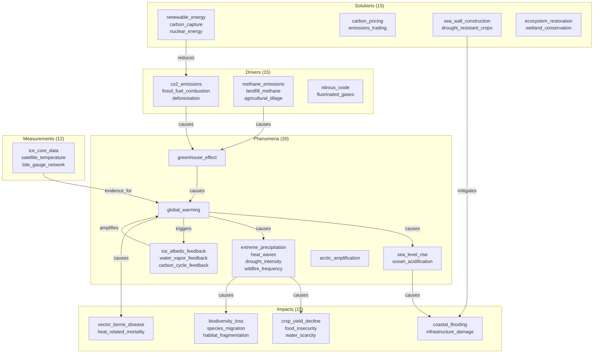

# Explore a Research Topic with ConceptSet

> **Navigating a 77-node climate science knowledge graph using ConceptSet's chainable exploration API to discover causal chains, feedback loops, solution gaps, and evidence coverage**

## 1. The Approach

Research topics have dense interconnections: causes cascade into effects, feedback loops amplify change, solutions target specific drivers, and measurement evidence supports certain claims but not others. Navigating this web manually requires tracing edges one concept at a time.

**The Hyper3 approach:** Use `ConceptSet` — a chainable, scored set of concept labels — to explore the graph fluently. Start from a seed concept, expand through neighbors, filter by score or attribute, trace causal paths, rank by centrality, and identify structural gaps. Each step returns another ConceptSet, composing into a single pipeline.

This showcase uses the full three-layer API: `mem.find()` (Layer 3: ConceptSet entry point), namespace methods like `mem.reason()` and `mem.analyze.centrality()` (Layer 2: namespaces), and `mem.add()`/`mem.link()` (Layer 1: data access).

## 2. A Simple Analogy

Think of exploring a research topic like exploring a city you have never visited. You start at a landmark (your seed concept). From there, you walk to neighboring blocks (`.neighbors()`). At each block, you can continue walking, take a bus to a different neighborhood (`.paths_to()`), or look up which blocks have the most foot traffic (`.centrality()`). You carry a notepad and cross off streets you have already seen (`.unique()`). Eventually, you want a summary of what you found — which areas are well-lit (evidenced), which are dark (gaps), and which are connected in a loop (feedback).

ConceptSet is the notepad. It records where you have been, scores what you found, and chains your next move from your current position — without ever requiring you to write a loop or manage intermediate lists.

## 3. Key Concepts

| Term | Plain English Meaning |
|------|-----------------------|
| **ConceptSet** | A scored, deduplicated set of concept labels returned by `mem.find()` |
| **Seed** | The starting concept for exploration (e.g., `"global_warming"`) |
| **Selector** | A method that narrows the set: `.top(k)`, `.filter(fn)`, `.exclude(...)` |
| **Explorer** | A method that expands the set: `.neighbors()`, `.similar()`, `.paths_to()` |
| **Terminal** | A method that breaks the chain: `.communities()`, `.describe()`, `.labels` |
| **Causal chain** | A sequence of `causes` edges from driver to impact |
| **Feedback loop** | A path from a concept back to itself through its downstream effects |
| **Solution gap** | An impact concept with no incoming `mitigates` edge from any solution |
| **Evidence gap** | A phenomenon with no incoming `evidence_for` edge from any measurement |
| **TransitiveRule** | Discovers indirect chains: A causes B, B causes C means A indirectly causes C |

## 4. Quick Start

Run the showcase to build the climate graph and execute all 11 analysis sections:

```bash
.venv/bin/python examples/showcase/domain/topic_exploration/topic_exploration.py
```

### What You'll See

```
======================================================================
SECTION 1: Building Climate Science Knowledge Graph
======================================================================
  Stored 77 concepts across 5 domains

======================================================================
SECTION 2: Creating Knowledge Relationships
======================================================================
  77 nodes, 116 edges

...

======================================================================
SECTION 6: Centrality-Guided Prioritization
======================================================================
  Phenomena neighbors ranked by degree centrality:
    global_warming                           centrality=0.329  [phenomenon]
    co2_emissions                            centrality=0.158  [driver]
    greenhouse_effect                        centrality=0.145  [phenomenon]
    ...

======================================================================
SUMMARY
======================================================================
  Graph: 77 nodes, 148 edges
  Connected components: 1
  Indirect causal links inferred: 32
  Unaddressed impacts: 12
  Unevidenced phenomena: 10

  Most central concept in phenomena network: global_warming (centrality=0.329)
```

## 5. The Scenario

The showcase models a climate science knowledge graph with **77 concepts across 5 domains and 116 relationship edges** (148 after transitive inference):

| Domain | Count | Examples | Purpose |
|--------|-------|----------|---------|
| **Phenomena** | 20 | `global_warming`, `sea_level_rise`, `ice_albedo_feedback` | Physical processes and events with impact level and certainty |
| **Drivers** | 15 | `co2_emissions`, `deforestation`, `aviation_emissions` | Emission sources with sector, mitigation cost, and abatement potential |
| **Impacts** | 15 | `coral_bleaching`, `food_insecurity`, `economic_displacement` | Consequences with affected system, irreversibility, and adaptation capacity |
| **Solutions** | 15 | `renewable_energy`, `carbon_pricing`, `ecosystem_restoration` | Interventions with type, readiness level, and co-benefits |
| **Measurements** | 12 | `ice_core_data`, `satellite_temperature`, `climate_model_output` | Evidence sources with method, temporal resolution, and uncertainty |

### Knowledge Topology

Figure 1: Causal flow from drivers through phenomena to impacts, with solutions and measurements connected laterally.



### Edge Label Taxonomy

| Label | Count (approx.) | Meaning |
|-------|-----------------|---------|
| `causes` | 37 | Direct causal relationship |
| `contributes_to` | 14 | Partial causal contribution |
| `triggers` | 4 | Initiates a feedback mechanism |
| `amplifies` | 3 | Magnifies an existing effect |
| `accelerates` | 1 | Speeds up a process |
| `drives` | 1 | Primary forcing mechanism |
| `modulates` | 3 | Influences timing or strength |
| `weakens` | 1 | Reduces strength |
| `exacerbates` | 1 | Worsens severity |
| `reduces` / `absorbs` / `displaces` | 9 | Solution mitigates driver |
| `mitigates` / `addresses` | 6 | Solution addresses impact |
| `counteracts` / `reverses` | 3 | Solution opposes impact |
| `evidence_for` / `measures` / `monitors` / `projects` / `quantifies` | 22 | Measurement supports phenomenon |
| `complements` / `requires` | 5 | Solution interdependencies |
| `replaces` / `enables` | 2 | Structural relationships |
| `indirectly_causes` | 32 | Inferred by TransitiveRule |

## 6. The Analysis Pipeline

The showcase runs 11 analysis sections that demonstrate ConceptSet's chaining capabilities.

### Section 1-2: Graph Construction

Store 77 concepts with domain-specific metadata and wire them with 116 unique relationship edges across 15+ edge label types.

```python
for label, data in concepts.items():
    mem.add(label, data=data)

for src, tgt, label in unique_edges:
    mem.link(src, tgt, label=label)
```

**Result:** 77 nodes, 116 edges. Single connected component.

### Section 3: Seeded Exploration with ConceptSet

Start from a seed concept and expand through neighbors:

```python
seed = mem.find("global_warming")
immediate = seed.neighbors(direction="out")
second_order = immediate.neighbors(direction="out").exclude("global_warming").unique()
```

**Why this matters:** ConceptSet chains replace manual loops. Instead of collecting neighbors, deduplicating, collecting their neighbors, and filtering, a single pipeline does it all. The `.unique()` call deduplicates by label, keeping the highest score.

**Result:** 18 direct consequences of global warming, 18 second-order consequences (including cascade targets like `methane_emissions` from the permafrost feedback).

### Section 4: Causal Chain Discovery

Trace causal paths between specific concepts:

```python
chain = (mem.find("co2_emissions")
         .paths_to("coastal_flooding", label="causes", max_depth=6))
```

**Why this matters:** `.paths_to()` delegates to `mem.analyze.paths()` for each concept in the set, collecting all intermediate concepts across every discovered path. The result is a ConceptSet of every concept that appears on any path from source to target.

**Result:** The CO2-to-coastal-flooding chain includes `greenhouse_effect`, `global_warming`, `extreme_precipitation`, `hurricane_intensity`, and `sea_level_rise` — multiple causal routes through the graph.

### Section 5: Multi-Hop Impact Analysis

Follow specific edge labels across multiple hops:

```python
co2_neighbors = (mem.find("co2_emissions")
                 .neighbors(edge_label="causes", direction="out")
                 .neighbors(edge_label="causes", direction="out")
                 .unique())
```

**Why this matters:** Filtering by `edge_label="causes"` traces only direct causal relationships, not contribution or modulation edges. This reveals the strictly deterministic causal chain as opposed to the broader influence network.

**Result:** One-hop `causes` from CO2 reaches `greenhouse_effect`; two-hop reaches `global_warming`. Broader analysis of critical-impact phenomena shows 21 downstream concepts.

### Section 6: Centrality-Guided Prioritization

Rank concepts by graph centrality:

```python
all_phenomena = mem.find(data={"domain": "phenomenon"})
phenomena_centrality = all_phenomena.neighbors().unique().centrality("degree")
```

**Why this matters:** `.centrality()` delegates to `mem.analyze.centrality()`, then filters results to only concepts in the current ConceptSet. This provides a ranked view of the neighborhood surrounding phenomena.

**Result:** `global_warming` dominates with degree centrality 0.329 — twice as connected as the next concept (`co2_emissions` at 0.158). The PageRank analysis confirms `sea_level_rise` and `biodiversity_loss` as the highest-impact downstream consequences.

### Section 7: Solution Coverage and Gap Analysis

Find impacts that have no adaptation solutions targeting them:

```python
adaptation_solutions = mem.find(data={"type": "adaptation"})
adapted_impacts = (adaptation_solutions
                   .neighbors(edge_label="mitigates", direction="out")
                   .unique())
all_impacts = mem.find(data={"domain": "impact"})
unaddressed = set(all_impacts.labels) - set(adapted_impacts.labels)
```

**Why this matters:** Set arithmetic on `.labels` reveals structural gaps in the knowledge graph. Concepts in `unaddressed` represent impacts that no registered solution directly mitigates — this is a gap in coverage, not necessarily a gap in reality, but it highlights where the graph's knowledge is incomplete.

**Result:** 12 of 15 impacts have no direct adaptation solution. Only `coastal_flooding`, `crop_yield_decline`, and `heat_related_mortality` are directly addressed. High-irreversibility gaps include `freshwater_contamination` (0.9), `species_migration` (0.9), and `food_insecurity` (0.8).

### Section 8: Feedback Loop Mapping

Detect self-reinforcing feedback loops by checking whether a concept reappears in its own 2-hop downstream:

```python
feedback_concepts = mem.find(data={"category": "feedback"})
for concept in feedback_concepts.labels:
    loop = (mem.find(concept)
            .neighbors(direction="out")
            .neighbors(direction="out")
            .unique())
    loop_back = loop.filter(lambda l, _: l == concept)
    is_cyclic = len(loop_back) > 0
```

**Why this matters:** Climate feedbacks are self-reinforcing: global warming triggers a feedback, which amplifies warming further. Detecting these loops in the graph structure identifies positive feedback cycles that accelerate change.

**Result:** `carbon_cycle_feedback` is self-reinforcing: it amplifies `global_warming`, which triggers more carbon cycle feedback. `ice_albedo_feedback` and `water_vapor_feedback` are not self-reinforcing at 2 hops but contribute to warming through longer chains.

### Section 9: Transitive Causal Inference

Apply TransitiveRule to discover indirect causal chains:

```python
mem.add_rules(TransitiveRule(edge_label="causes", new_label="indirectly_causes"))
result = mem.reason(
    seeds={"co2_emissions", "methane_emissions", "deforestation",
           "global_warming", "permafrost_thaw"},
    depth=4,
    max_states=80,
)
```

**Why this matters:** Direct `causes` edges capture first-order relationships. Transitive inference reveals that `co2_emissions` indirectly causes `arctic_amplification` through the chain `co2 → greenhouse_effect → global_warming → arctic_amplification`. These indirect links make implicit chains explicit.

**Result:** 32 indirect causal links discovered across 33 states at depth 2. Examples include `greenhouse_effect → vector_borne_disease`, `crop_yield_decline → economic_displacement`, and `hurricane_intensity → economic_displacement`.

### Section 10: Cross-Domain Exploration Pipeline

Chain exploration across domain boundaries:

```python
pipeline = (mem.find("fossil_fuel_combustion")
            .neighbors(direction="out")
            .unique()
            .neighbors(direction="out")
            .unique()
            .neighbors(direction="out")
            .unique()
            .exclude("fossil_fuel_combustion"))
```

**Why this matters:** A 3-hop expansion from a driver reaches across the driver → phenomenon → impact boundary. The ConceptSet records the domain of each discovered concept, revealing how influence spreads across domain categories.

**Result:** 28 concepts reached across 2 domains (15 phenomena, 13 impacts). The solutions pipeline finds 4 solutions that mitigate downstream impacts — all are adaptation or nature-based solutions with readiness levels 3-6/9.

### Section 11: Evidence Mapping

Identify which phenomena have measurement evidence and which do not:

```python
measurements_set = mem.find(data={"domain": "measurement"})
evidence_targets = (measurements_set
                    .neighbors(edge_label="evidence_for", direction="out")
                    .unique())
unevidenced = set(all_phenomena_labels) - set(evidence_targets.labels)
```

**Why this matters:** The graph encodes not just what is known, but how it is known. Phenomena without `evidence_for` edges from measurement nodes represent areas where the graph lacks observational backing — either because evidence exists but was not modeled, or because the phenomenon is harder to measure directly.

**Result:** 10 of 20 phenomena have direct evidence. `global_warming` has the most evidence sources (3: ice cores, satellites, tree rings). 10 phenomena lack direct measurement evidence, including feedback mechanisms (`water_vapor_feedback`, `ice_albedo_feedback`, `carbon_cycle_feedback`) and oscillations (`el_nino`, `la_nina`).

## 7. Understanding the Output

### ConceptSet Chain Output

Each ConceptSet method returns a new ConceptSet. The `.labels` property extracts the final list of deduplicated concept names.

| Method | Returns | Chain continues? |
|--------|---------|-----------------|
| `.neighbors()` | ConceptSet | Yes |
| `.paths_to()` | ConceptSet | Yes |
| `.similar()` | ConceptSet | Yes |
| `.activate()` | ConceptSet | Yes |
| `.diffuse()` | ConceptSet | Yes |
| `.query()` | ConceptSet | Yes |
| `.top(k)` | ConceptSet | Yes |
| `.filter(fn)` | ConceptSet | Yes |
| `.threshold(min)` | ConceptSet | Yes |
| `.exclude(...)` | ConceptSet | Yes |
| `.unique()` | ConceptSet | Yes |
| `.centrality()` | ConceptSet | Yes |
| `.communities()` | CommunityResult | No (terminal) |
| `.anomalies()` | list | No (terminal) |
| `.describe()` | GraphDescription | No (terminal) |
| `.labels` | list[str] | No (terminal) |
| `.scores` | dict[str, float] | No (terminal) |
| `.items` | list[tuple] | No (terminal) |

### Centrality Score Interpretation

| Score Range | Meaning |
|-------------|---------|
| 0.25+ | Central hub — connects to a large fraction of the graph |
| 0.10-0.25 | Important connector — significant structural role |
| 0.05-0.10 | Moderate — notable but not dominant |
| Below 0.05 | Peripheral — limited connectivity |

### Impact Irreversibility

Irreversibility scores range from 0.3 to 0.9 and represent how difficult it is to reverse an impact once it occurs.

| Score Range | Meaning |
|-------------|---------|
| 0.8-0.9 | Near-permanent — extremely difficult to reverse |
| 0.5-0.7 | Significant — costly or slow to reverse |
| 0.3-0.4 | Moderate — reversible with targeted intervention |

## 8. Key Metrics

### Initial Graph (Sections 1-2)

| Metric | Value |
|--------|-------|
| Concept nodes | 77 |
| Relationship edges (initial) | 116 |
| Edge label types | 15+ |

### ConceptSet Operations (Sections 3-8, 10-11)

| Metric | Value |
|--------|-------|
| Direct consequences of `global_warming` | 18 |
| Second-order consequences | 18 |
| Concepts in CO2-to-coastal-flooding chain | 7 |
| Two-hop causal targets of CO2 | 1 |
| Downstream of critical-impact phenomena | 21 |
| Unaddressed impacts (no adaptation) | 12 |
| Feedback mechanisms | 3 |
| Self-reinforcing feedbacks | 1 (`carbon_cycle_feedback`) |

### After Transitive Inference (Section 9)

| Metric | Value |
|--------|-------|
| Indirect causal links | 32 |
| States explored | 33 |
| Max reasoning depth | 2 |

### Final Graph (Summary)

| Metric | Value |
|--------|-------|
| Total nodes | 77 |
| Total edges (after inference) | 148 |
| Connected components | 1 |
| Most central concept | `global_warming` (degree 0.329) |
| Downstream influence of `global_warming` | 27 concepts |
| Evidence-backed phenomena | 10 |
| Unevidenced phenomena | 10 |

### Concept Distribution

| Domain | Count |
|--------|-------|
| Phenomena | 20 |
| Drivers | 15 |
| Impacts | 15 |
| Solutions | 15 |
| Measurements | 12 |

## 9. What Makes This Different

**ConceptSet chains replace manual graph traversal loops.** Without ConceptSet, finding "all second-order consequences of global warming, excluding global warming itself" requires: get neighbors of global warming, iterate over each to get their neighbors, collect into a set, remove global warming. With ConceptSet: `mem.find("global_warming").neighbors().neighbors().exclude("global_warming").unique().labels`.

**Selectors compose with explorers.** `.top(5).neighbors()` first narrows to the 5 highest-scored concepts, then expands each of their neighborhoods. `.neighbors().threshold(0.5)` expands then filters by score. The ordering changes the result.

**Broadcast semantics handle multi-concept sets.** When a ConceptSet contains multiple labels, `.neighbors()` calls `mem.neighbors()` for each label and merges results. This means `mem.find(["a", "b"]).neighbors()` returns the union of neighbors of both `a` and `b`.

**Centrality scopes to the current set.** `.centrality("pagerank")` computes PageRank for the full graph, then filters to only concepts present in the ConceptSet. This provides ranked views of specific subgraphs without custom scoring logic.

**Set arithmetic on `.labels` reveals structural gaps.** The solution gap analysis (Section 7) computes `set(all_impacts.labels) - set(adapted_impacts.labels)` to find impacts with no adaptation solution. This is pure set arithmetic on the ConceptSet terminal output.

**Transitive inference makes implicit chains explicit.** The `TransitiveRule` discovers that `co2_emissions` indirectly causes `vector_borne_disease` through a three-hop chain. ConceptSet's `.paths_to()` can then trace these paths explicitly.

## 10. Code Implementation

**1. Seed exploration with ConceptSet chains**

```python
seed = mem.find("global_warming")
immediate = seed.neighbors(direction="out")
second_order = immediate.neighbors(direction="out").exclude("global_warming").unique()
```

**2. Causal path tracing**

```python
chain = (mem.find("co2_emissions")
         .paths_to("coastal_flooding", label="causes", max_depth=6))
print(chain.unique().labels)
```

**3. Multi-hop filtered expansion**

```python
co2_neighbors = (mem.find("co2_emissions")
                 .neighbors(edge_label="causes", direction="out")
                 .neighbors(edge_label="causes", direction="out")
                 .unique())
```

**4. Centrality-scoped ranking**

```python
all_phenomena = mem.find(data={"domain": "phenomenon"})
ranked = all_phenomena.neighbors().unique().centrality("degree")
for label, score in ranked.top(10).items:
    print(f"  {label}: {score:.3f}")
```

**5. Gap analysis via set arithmetic**

```python
adapted = mem.find(data={"type": "adaptation"}).neighbors(edge_label="mitigates", direction="out").unique()
all_impacts = mem.find(data={"domain": "impact"})
unaddressed = set(all_impacts.labels) - set(adapted.labels)
```

**6. Feedback loop detection**

```python
for concept in mem.find(data={"category": "feedback"}).labels:
    loop = mem.find(concept).neighbors(direction="out").neighbors(direction="out").unique()
    is_cyclic = concept in loop
```

**7. Transitive inference**

```python
mem.add_rules(TransitiveRule(edge_label="causes", new_label="indirectly_causes"))
result = mem.reason(seeds={"co2_emissions", "global_warming"}, depth=4, max_states=80)
```

**8. Cross-domain pipeline**

```python
pipeline = (mem.find("fossil_fuel_combustion")
            .neighbors(direction="out").unique()
            .neighbors(direction="out").unique()
            .neighbors(direction="out").unique()
            .exclude("fossil_fuel_combustion"))
```

**9. Evidence mapping**

```python
evidence_targets = (mem.find(data={"domain": "measurement"})
                    .neighbors(edge_label="evidence_for", direction="out")
                    .unique())
unevidenced = set(phenomena_labels) - set(evidence_targets.labels)
```

## 11. Real-World Gap

The showcase constructs a synthetic climate science graph. Real research knowledge graphs have different challenges:

1. **Knowledge extraction.** The showcase manually declares concepts and edges. Production use requires ingesting from literature databases (Semantic Scholar, PubMed, arXiv), extracting relationships via NLP (dependency parsing, relation extraction), and normalizing entity names across sources.

2. **Scale.** 77 nodes run instantly. Research domains have tens of thousands of papers with overlapping terminology. Deduplication and disambiguation become critical.

3. **Temporal evolution.** Scientific understanding changes. The graph needs version tracking (which claims were supported in 2020 but challenged in 2024?), temporal edge semantics (superseded_by, confirmed_by), and recency weighting.

4. **Confidence and provenance.** The showcase uses binary edge labels. Real knowledge graphs need confidence scores, evidence strength, and citation provenance on every edge.

5. **Cross-domain terminology.** Climate science draws on physics, chemistry, biology, economics, and policy. The same concept may have different names in different disciplines. Alignment requires ontology mapping.

6. **Interactive exploration.** The showcase runs a fixed pipeline. Real exploration is interactive: researchers refine queries based on intermediate results, drill into surprising connections, and annotate findings. ConceptSet's chaining supports this interactively in a notebook.

## 12. Reference

### API Methods Used

| Method | Layer | Purpose |
|--------|-------|---------|
| `mem.add(label, data)` | 1 (Data) | Create a concept node with metadata |
| `mem.link(source, target, label)` | 1 (Data) | Create a labeled relationship edge |
| `mem.find(label)` / `mem.find(data=...)` | 3 (ConceptSet) | Entry point for chainable exploration |
| `mem.info(label)` | 1 (Data) | Get node metadata |
| `mem.neighbors(label, ...)` | 1 (Data) | Get neighbor labels |
| `cs.neighbors()` | 3 (ConceptSet) | Expand ConceptSet to neighbors |
| `cs.paths_to(target)` | 3 (ConceptSet) | Find path concepts between set and target |
| `cs.top(k)` / `cs.filter(fn)` / `cs.exclude(...)` | 3 (ConceptSet) | Narrow the concept set |
| `cs.unique()` | 3 (ConceptSet) | Deduplicate, keeping best score |
| `cs.centrality(method)` | 3 (ConceptSet) | Score by graph centrality |
| `cs.labels` / `cs.scores` / `cs.items` | 3 (ConceptSet) | Terminal extraction |
| `mem.add_rules(TransitiveRule(...))` | 2 (Reason) | Register transitive inference rule |
| `mem.reason(seeds, depth, ...)` | 2 (Reason) | Apply rules via multiway expansion |
| `mem.pattern_match(edge_label)` | 1 (Data) | Find edges by label |
| `mem.stats()` | 1 (Data) | Graph statistics |

### Related Examples

| Example | Focus |
|---------|-------|
| `examples/showcase/domain/code_dependency_analysis/` | Dependency blast radius with centrality, cycles, subgraph collapse |
| `examples/showcase/domain/microservices_reasoning/` | Microservice blast radius with TransitiveRule and InverseRule |
| `examples/showcase/core/centrality_and_ranking/` | Degree, betweenness, PageRank, and eigenvector centrality |
