# Financial Risk Network Showcase

> **Community Detection for Exposure Clusters, Graph Diffing for Risk Evolution, Hierarchical Abstraction for Portfolio Rollups, Hebbian Learning for Risk Correlation Strengthening, Probabilistic Default Risk Assessment, and Multi-Frame Risk Analysis across a 76-Node Cross-Asset Risk Network**

## 1. The Approach

Financial institutions manage risk across counterparties, instruments, risk factors, and regulators. A counterparty default does not stay contained — it propagates through shared instruments, correlated risk factors, and settlement chains. Traditional risk management examines each dimension in isolation: credit risk teams track counterparty exposures, market risk teams monitor factor sensitivities, and operations teams manage settlement flows. The correlations between these dimensions remain hidden.

**The Silo Problem:** A hedge fund holds equity index futures and volatility futures through a prime broker. Credit risk sees the counterparty exposure. Market risk sees the volatility sensitivity. But the combination — a default during a volatility spike — falls through the gap. Aggregating across silos requires manual correlation that does not happen at scale.

**The Hyper3 Approach:** Model every entity (counterparties, instruments, risk factors, regulators) as nodes in a directed hypergraph with typed edges (`holds`, `exposed_to`, `amplifies`, `regulates`). Community detection identifies natural risk clusters that span silos. Graph diffing tracks how the risk structure evolves when new exposures appear. Hierarchical abstraction rolls up individual positions into portfolio-level summaries. Hebbian learning strengthens edges along risk paths that activate together. Belief distributions represent default risk as probabilistic outcomes sampled via the Born rule. Multi-frame analysis evaluates counterparties through classical, quantum, hypergraph, and probabilistic lenses, selecting the frame best suited to the entity's connectivity structure.

## 2. A Simple Analogy

Imagine a bank's trading floor as a room of desks. The credit desk tracks who owes money, the rates desk tracks bond positions, the equities desk tracks stock futures, and compliance tracks regulatory filings. Each desk keeps its own spreadsheet. Now imagine someone defaults: the credit desk flags it, but the rates desk does not know their bonds are affected, the equities desk does not know their futures positions are exposed through the same prime broker, and compliance does not know the regulator needs notification. Hyper3 connects all those spreadsheets into a single map. Pull on the default node and every affected position, risk factor, and regulatory obligation lights up.

## 3. Key Concepts

| Term | Plain English Meaning |
|------|----------------------|
| **Community Detection** | Groups nodes that are densely connected to each other and sparsely connected to other groups — identifies natural risk clusters |
| **Modularity** | Measures how well a partition separates communities; higher values mean cleaner separation |
| **Graph Diffing** | Compares two snapshots of the graph and reports what changed (nodes/edges added or removed) |
| **Version Capture** | Saves a snapshot of the graph's structure at a point in time for later comparison |
| **Hierarchical Abstraction** | Collapses a group of nodes into a single summary node, preserving external connections |
| **Summary Node** | A node that represents a collapsed subgraph; can be expanded back to the original nodes |
| **Hebbian Learning** | Strengthens edges between nodes that activate together ("fire together, wire together") |
| **Spreading Activation** | Propagates energy from a source node through edges, decaying with distance |
| **Risk Amplification** | A directed edge indicating one risk factor intensifies another (e.g., recession amplifies default risk) |
| **Belief Distribution** | Assigns complex amplitudes to multiple outcomes; sampling via the Born rule (|amplitude|^2) collapses to a single result |
| **Multi-Frame Analysis** | Evaluates a problem through several computational lenses (classical, quantum, hypergraph, probabilistic) and picks the best one |

## 4. Quick Start

Run the showcase to build a 76-node cross-asset risk network and analyze its structure:

```bash
.venv/bin/python examples/showcase/financial_risk_network/financial_risk_network.py
```

### What You Will See

The showcase builds a risk network and runs 7 analysis sections:

```
======================================================================
SECTION 1: Building Financial Risk Network
======================================================================
  Nodes: 75
  Edges: 104

======================================================================
SECTION 2: Community Detection - Risk Clusters
======================================================================
  Communities found: 17
  Modularity: 0.532
  Coverage: 72.5%
  Largest community: 17 nodes

======================================================================
SECTION 3: Graph Diffing - Tracking Risk Evolution
======================================================================
  Changes from baseline:
    Nodes added:    1
    Edges added:    5
    Total changes:  6

======================================================================
SECTION 5: Hebbian Learning - Risk Correlation Strengthening
======================================================================
  Edges strengthened: 40
  Edges weakened:     29
  Co-activation pairs: 69
  Avg weight change:  0.6313

======================================================================
SECTION 6: Probabilistic Default Risk Assessment
======================================================================
  Default risk distribution (4 outcomes):
    credit_suisse             P(default) = 0.582
    deutsche_bank             P(default) = 0.263
    goldman_sachs             P(default) = 0.107
    jp_morgan                 P(default) = 0.048

======================================================================
SECTION 7: Multi-Frame Risk Analysis
======================================================================
  Optimal frame: hypergraph (complexity=0.718)
```

## 5. The Scenario

The example models a cross-asset risk network with **75 nodes and 104 edges** initially, growing to **76 nodes and 109 edges** after adding a crisis exposure. The network covers four entity categories:

- **24 Counterparties:** 16 banks (US, EU, APAC), 2 asset managers, 2 hedge funds, 2 private equity funds, plus 1 added during the crisis scenario (Archegos Capital). Each carries `credit_rating`, `region`, and `type` attributes.
- **21 Instruments:** Government bonds (5), equity index futures (3), FX pairs (3), commodities (3), crypto (2), CDS indices (2), volatility futures (1), rate swaps (2). Each carries `currency` and `type` attributes.
- **20 Risk Factors:** Market risk (6), credit risk (3), operational risk (3), model risk (2), portfolio risk (1), macro risk (3), compliance risk (1), plus correlation and basis risk.
- **10 Regulators:** SEC, CFTC, Fed (US), ECB, ESMA (EU), BoE, FCA (UK), MAS (APAC), FSA Japan, BIS (Global).

### Edge Label Taxonomy

| Category | Label | Count | Meaning |
|----------|-------|-------|---------|
| **Exposure** | `holds` | 41 | Counterparty holds or is exposed to an instrument, weighted by position size |
| **Risk Sensitivity** | `exposed_to` | 23 | Instrument is sensitive to a risk factor |
| **Risk Amplification** | `amplifies` | 14 | One risk factor intensifies another |
| **Regulatory** | `regulates` | 26 | Regulator has jurisdiction over a counterparty |
| **Crisis** | `holds` (new) | 3 | New positions added during the Archegos scenario |
| **Crisis** | `regulated_by` | 1 | New regulatory link for the crisis entity |
| **Crisis** | `prime_broker_for` | 1 | Prime broker relationship exposed during crisis |

### Risk Network Topology

Figure 1: The cross-asset risk network connects counterparties, instruments, risk factors, and regulators through five edge types.

```mermaid
graph TD
    subgraph "US Banks"
        GS["goldman_sachs<br/>(bank, A+)"]
        JPM["jp_morgan<br/>(bank, A+)"]
        MS["morgan_stanley<br/>(bank, A)"]
    end

    subgraph "EU Banks"
        DB["deutsche_bank<br/>(bank, BBB+)"]
        BARC["barclays<br/>(bank, A)"]
        HSBC["hsbc<br/>(bank, A+)"]
    end

    subgraph "APAC Banks"
        NOM["nomura<br/>(bank, A-)"]
        ICBC["icbc<br/>(bank, A)"]
    end

    subgraph "Asset Managers & Funds"
        BLK["blackrock<br/>(asset_manager, AA)"]
        VANG["vanguard<br/>(asset_manager, AA)"]
        BW["bridgewater<br/>(hedge_fund)"]
        CIT["citadel<br/>(hedge_fund)"]
    end

    subgraph "Instruments"
        UST10["us_treasury_10y<br/>(bond, USD)"]
        SP["sp500_futures<br/>(equity_index, USD)"]
        VIX["vix_futures<br/>(volatility, USD)"]
        USDEUR["usd_eur_fx<br/>(fx, USD/EUR)"]
        GOLD["gold_futures<br/>(commodity, USD)"]
        BUND["german_bund_10y<br/>(bond, EUR)"]
        NK["nikkei_futures<br/>(equity_index, JPY)"]
        CDX["cdx_ig<br/>(cds_index, USD)"]
    end

    subgraph "Risk Factors"
        IR["interest_rate_risk<br/>(market)"]
        EQ["equity_risk<br/>(market)"]
        FX["fx_risk<br/>(market)"]
        VOL["volatility_risk<br/>(market)"]
        CS["credit_spread_risk<br/>(credit)"]
        TAIL["tail_risk<br/>(market)"]
        REC["recession_risk<br/>(macro)"]
        CDSK["counterparty_default_risk<br/>(credit)"]
    end

    subgraph "Regulators"
        SEC["sec<br/>(US)"]
        ECB["ecb<br/>(EU)"]
        FSA["fsa_japan<br/>(APAC)"]
    end

    GS --"holds"--> UST10
    GS --"holds"--> SP
    GS --"holds"--> VIX
    GS --"holds"--> CDX
    JPM --"holds"--> UST10
    JPM --"holds"--> SP
    BLK --"holds"--> SP
    BLK --"holds"--> UST10
    CIT --"holds"--> VIX
    CIT --"holds"--> SP
    DB --"holds"--> BUND
    DB --"holds"--> USDEUR
    NOM --"holds"--> NK
    BW --"holds"--> USDEUR

    UST10 --"exposed_to"--> IR
    SP --"exposed_to"--> EQ
    USDEUR --"exposed_to"--> FX
    VIX --"exposed_to"--> VOL
    VIX --"exposed_to"--> TAIL
    CDX --"exposed_to"--> CS

    IR --"amplifies"--> CS
    EQ --"amplifies"--> VOL
    VOL --"amplifies"--> TAIL
    REC --"amplifies"--> CDSK
    REC --"amplifies"--> EQ

    SEC --"regulates"--> GS
    SEC --"regulates"--> JPM
    ECB --"regulates"--> DB
    FSA --"regulates"--> NOM
```



## 6. Analysis Pipeline

The showcase runs 7 sections that progressively analyze the risk network.

### Section 1: Building the Financial Risk Network

Construct the graph from four entity dictionaries and four edge groups:

```python
mem = HypergraphMemory(evolve_interval=0)

all_entities = {**COUNTERPARTIES, **INSTRUMENTS, **RISK_FACTORS, **REGULATORS}
for name, data in all_entities.items():
    mem.store(name, data=data)

for src, tgt, label, weight in EXPOSURES:
    mem.relate(src, tgt, label=label, weight=weight)
```

**Result:** 75 nodes, 104 edges. Every counterparty carries credit rating and region data. Every instrument carries type and currency. Every risk factor carries its category. These attributes enable filtering and composition analysis in later sections.

### Section 2: Community Detection — Risk Clusters

Run weighted label propagation to identify natural clusters in the risk network:

```python
result = mem.detect_communities(method="weighted_label_propagation", seed=42)
```

**Why this matters:** Risk reports group exposures by asset class (bonds, equities, FX). But real risk clusters cross asset-class boundaries. Community detection discovers that Deutsche Bank, HSBC, BNP Paribas, Bridgewater, their shared instruments, connected risk factors, and regulators form a single cluster — a cross-regional banking ecosystem whose risk profile emerges from the interaction of credit, market, and regulatory dimensions. Without community detection, this cluster is invisible in reports that list positions by instrument type.

**Result:** 17 communities found with modularity 0.532 and coverage 72.5%. The largest community (17 nodes) contains EU and cross-border counterparties (Deutsche Bank, HSBC, BNP Paribas, Bridgewater) alongside 7 instruments, 4 risk factors, and 2 regulators. The second largest (12 nodes) groups 6 US counterparties (Goldman Sachs, Morgan Stanley, Citigroup, Bank of America, BlackRock, Vanguard) with 2 instruments and 4 regulators. Smaller communities include Citadel with volatility and tail risk (7 nodes), Nomura/Mizuho with Japan-specific instruments and risk factors (10 nodes), and Barclays with UK gilt and EUR/GBP FX (4 nodes).

### Section 3: Graph Diffing — Tracking Risk Evolution

Capture a baseline version, simulate a crisis event, and measure the structural change:

```python
v0 = mem.capture_version()

mem.store("archegos_capital", data={"category": "counterparty", "type": "hedge_fund"})
mem.relate("archegos_capital", "sp500_futures", label="holds")
mem.relate("archegos_capital", "nikkei_futures", label="holds", weight=10.0)
mem.relate("archegos_capital", "vix_futures", label="holds")
mem.relate("archegos_capital", "sec", label="regulated_by")
mem.relate("credit_suisse", "archegos_capital", label="prime_broker_for")

v1 = mem.capture_version()
delta = mem.diff_from_version(v0["version_id"])
```

**Why this matters:** When a new counterparty enters the network with large positions, risk managers need to understand what changed. Graph diffing answers this precisely: 1 node added (archegos_capital), 5 edges added (3 instrument exposures, 1 regulatory link, 1 prime broker relationship), 6 total changes. Without diffing, the risk team would need to manually compare two snapshots of 76 nodes and 109 edges to find the differences.

The scenario mirrors the 2021 Archegos Capital collapse: a family office with concentrated equity positions that defaulted, causing billions in losses for its prime brokers. The `prime_broker_for` edge from Credit Suisse to Archegos is the specific contagion channel — a relationship that exists outside traditional counterparty exposure reports.

### Section 4: Hierarchical Abstraction — Portfolio Rollups

Collapse 5 US banks into a single summary node, run community detection at the abstracted level, then expand back:

```python
us_banks = {"goldman_sachs", "jp_morgan", "morgan_stanley", "citigroup", "bank_of_america"}
summary = mem.collapse_subgraph(us_banks, summary_label="us_banking_sector",
                                 summary_data={"type": "sector_summary", "region": "US"})
```

**Why this matters:** A portfolio manager overseeing US banking exposure does not need to see 5 individual bank nodes. Collapsing them into `us_banking_sector` reduces visual and computational complexity while preserving the 12 external connections to instruments, risk factors, and regulators. Community detection on the abstracted graph finds 22 communities (versus 17 at full granularity) because the collapsed sector node changes the connectivity pattern. Expanding back restores the original community structure. This round-trip validates that abstraction is lossless for the external connections that matter.

**Result:** 5 US banks collapsed into 1 summary node. 0 internal edges collapsed (the banks share no direct edges with each other). 12 external connections preserved. Community detection on the abstracted graph produces 22 communities; after expansion, the original structure returns with 15 communities.

### Section 5: Hebbian Learning — Risk Correlation Strengthening

Stimulate risk factors, spread activation across the network, and apply Hebbian reinforcement:

```python
mem.stimulate("recession_risk", energy=2.0)
mem.stimulate("equity_risk", energy=1.5)
mem.stimulate("volatility_risk", energy=1.0)
mem.spread_activation()

hebbian_result = mem.hebbian_reinforce()
```

**Why this matters:** Risk factors that activate together in a stress scenario are correlated in practice. Recession risk amplifies both equity risk and counterparty default risk. When all three activate simultaneously, the edges connecting them should be stronger — reflecting the empirical observation that these risks compound. Hebbian reinforcement automates this: edges between co-activated nodes are strengthened (40 edges), edges between nodes where only one activated are weakened (29 edges). The result is a network where the strongest correlations reflect actual stress scenarios, not just topological adjacency.

**Result:** 40 edges strengthened, 29 edges weakened across 69 co-activation pairs. Average weight change 0.6313. The strongest associations from `recession_risk` are `equity_risk` (weight=1.00) and `counterparty_default_risk` (weight=1.00) — the two risk factors directly amplified by recession via the `amplifies` edges in the network.

### Section 6: Probabilistic Default Risk Assessment

Create belief distributions over default candidates and sample from them using the Born rule:

```python
qs = mem.create_distribution(
    ["credit_suisse", "deutsche_bank", "goldman_sachs", "jp_morgan"],
    amplitudes=[0.7, 0.4, 0.15, 0.10],
    use_context_field=True,
)

for i in range(10):
    answer = mem.sample(qs)
    node = mem.engine.graph.get_node(answer.node_id)
    print(node.label if node else answer.node_id)
```

**Why this matters:** Credit ratings assign discrete categories (AAA, BBB+, etc.) that collapse a continuum of default probabilities into coarse buckets. Two banks rated "BBB+" may have very different actual default likelihoods depending on their positions, concentrations, and contagion channels. Belief distributions represent this uncertainty as amplitudes over specific counterparties, and the Born rule (probability = |amplitude|^2, normalized) maps those amplitudes to calibrated probabilities. In this showcase, Credit Suisse receives the highest default probability (0.582) — reflecting its actual credit rating of BBB (the lowest among the four candidates) and its connection to Archegos via the prime broker relationship established in Section 3. Goldman Sachs and JP Morgan receive much lower probabilities (0.107 and 0.048) consistent with their A+ ratings and diversified holdings.

A second distribution over risk factors shows that interest rate risk dominates (0.596), followed by credit spread risk (0.260). Without belief distributions, a risk report would list all four risk factors equally — with no mechanism to express that one is more likely to be the primary driver of the next stress event.

**Result:** Default risk distribution with 4 outcomes. Credit Suisse P(default)=0.582, Deutsche Bank 0.263, Goldman Sachs 0.107, JP Morgan 0.048. Over 10 stochastic draws, Credit Suisse is sampled 6 times, consistent with its dominant probability. Risk factor distribution assigns interest_rate_risk P(dominant)=0.596, credit_spread_risk 0.260, fx_risk 0.106, liquidity_risk 0.038.

### Section 7: Multi-Frame Risk Analysis

Evaluate Credit Suisse through four computational lenses and select the most informative frame:

```python
frames = mem.multi_frame_analysis("credit_suisse")
for frame_name, analysis in frames.items():
    print(f"[{frame_name}] complexity={analysis.complexity:.3f}")

optimal_name, optimal_analysis = mem.select_optimal_frame("credit_suisse")
```

**Why this matters:** Different analytical lenses reveal different aspects of a counterparty's risk profile. A classical frame sees Credit Suisse as a node in a graph and attempts exhaustive traversal (complexity 0.769) — comprehensive but susceptible to state explosion. A quantum frame treats the counterparty's multiple risk exposures as a superposition (complexity 1.000) — good at parallel hypothesis exploration but non-deterministic. A hypergraph frame exploits the multi-arity of the edges (Credit Suisse connects to CDS indices, has a prime broker relationship to Archegos, and is regulated by ESMA) to do dimension-aware traversal at lower cost (complexity 0.718). A probabilistic frame uses importance sampling weighted by edge importance (complexity 0.876) — uncertainty-aware but with incomplete coverage.

The system selects the hypergraph frame as optimal because Credit Suisse's risk profile is best understood through its multi-dimensional connectivity: the CDS index exposures, the prime broker contagion channel, and the regulatory jurisdiction all interact, and the hypergraph frame is designed to traverse these dimensions together. Without multi-frame analysis, an analyst would pick one approach and miss insights available through other lenses.

**Result:** 4 frames evaluated. Classical complexity 0.769, quantum 1.000, hypergraph 0.718, probabilistic 0.876. The hypergraph frame is selected as optimal with the lowest complexity score.

## 7. Understanding Output

### Community Metrics

| Metric | Range | Meaning |
|--------|-------|---------|
| Modularity | 0.0-1.0 | How well communities are separated; 0.532 indicates moderate-to-strong structure |
| Coverage | 0%-100% | Fraction of nodes assigned to a community; 72.5% means 27.5% of nodes are unassigned |
| Internal edges | — | Edges within the community; higher values indicate denser internal connectivity |
| External edges | — | Edges crossing community boundaries; higher values indicate inter-community exposure |

### Graph Diff Metrics

| Metric | Meaning |
|--------|---------|
| Nodes added | New entities in the network since baseline |
| Edges added | New relationships (exposures, regulations, amplification paths) |
| Total changes | Sum of nodes and edges added |

### Hebbian Learning Metrics

| Metric | Meaning |
|--------|---------|
| Edges strengthened | Connections between co-activated nodes |
| Edges weakened | Connections where only one endpoint activated |
| Co-activation pairs | Total pairs of simultaneously active nodes |
| Average weight change | Mean weight adjustment across all modified edges |

### Belief Distribution Metrics

| Metric | Meaning |
|--------|---------|
| Outcome count | Number of possible outcomes in the distribution |
| P(outcome) | Born-rule probability for each outcome, computed as \|amplitude\|^2 normalized across all outcomes |
| Stochastic draws | Individual samples from the distribution; frequencies should approximate probabilities |

### Multi-Frame Metrics

| Metric | Meaning |
|--------|---------|
| Complexity | Estimated computational cost of analysis in that frame (lower is more efficient) |
| Solution approach | The strategy the frame would use (e.g., exhaustive_analysis, importance_sampling) |
| Strengths | Capabilities the frame brings to the analysis |
| Weaknesses | Limitations of the frame for this problem |
| Optimal frame | The frame with the lowest complexity, selected by Thompson sampling over learned effectiveness |

## 8. Key Metrics

| Metric | Value |
|--------|-------|
| Graph nodes (initial) | 75 |
| Graph edges (initial) | 104 |
| Graph nodes (after Archegos) | 76 |
| Graph edges (after Archegos) | 109 |
| Graph nodes (final) | 76 |
| Graph edges (final) | 149 |
| Counterparties | 24 (16 banks, 2 asset managers, 2 hedge funds, 2 PE funds, 1 added + Archegos) |
| Instruments | 21 |
| Risk factors | 20 |
| Regulators | 10 |
| Communities detected | 17 |
| Modularity | 0.532 |
| Coverage | 72.5% |
| Largest community | 17 nodes |
| Second largest community | 12 nodes |
| Graph diff — nodes added | 1 |
| Graph diff — edges added | 5 |
| Graph diff — total changes | 6 |
| US banks collapsed | 5 |
| External connections preserved | 12 |
| Communities after abstraction | 22 |
| Communities after expansion | 15 |
| Hebbian — edges strengthened | 40 |
| Hebbian — edges weakened | 29 |
| Hebbian — co-activation pairs | 69 |
| Hebbian — avg weight change | 0.6313 |
| Strongest recession correlation | equity_risk (1.00), counterparty_default_risk (1.00) |
| Default distribution — credit_suisse | P(default) = 0.582 |
| Default distribution — deutsche_bank | P(default) = 0.263 |
| Default distribution — goldman_sachs | P(default) = 0.107 |
| Default distribution — jp_morgan | P(default) = 0.048 |
| Risk factor — interest_rate_risk | P(dominant) = 0.596 |
| Risk factor — credit_spread_risk | P(dominant) = 0.260 |
| Risk factor — fx_risk | P(dominant) = 0.106 |
| Risk factor — liquidity_risk | P(dominant) = 0.038 |
| Multi-frame — classical complexity | 0.769 |
| Multi-frame — quantum complexity | 1.000 |
| Multi-frame — hypergraph complexity | 0.718 |
| Multi-frame — probabilistic complexity | 0.876 |
| Multi-frame — optimal frame | hypergraph (complexity=0.718) |

## 9. What Makes This Different

**Community detection on a multi-entity risk graph** reveals clusters that cross traditional risk silos. The largest community (17 nodes) mixes counterparties, instruments, risk factors, and regulators because community detection operates on the actual connectivity structure, not on predetermined asset-class buckets. A report that groups positions by instrument type would place German Bunds in "fixed income" and EUR/USD FX in "currencies" — but they share counterparty exposure through Deutsche Bank and HSBC, which community detection captures.

**Graph diffing tracks structural evolution** rather than just price changes. Adding Archegos Capital introduces 6 changes to a 109-edge network. The diff identifies each change individually: which new positions were created, which prime broker relationship was exposed, which regulator gained a new entity. Without diffing, the only signal is that the network grew — the structural implications of the new exposure are invisible.

**Hierarchical abstraction preserves external connectivity** when collapsing subgraphs. The 5 US banks have 12 external connections to instruments, risk factors, and regulators. Collapsing them into `us_banking_sector` does not lose these connections — they attach to the summary node instead. This means community detection, centrality ranking, and path finding all work correctly on the abstracted graph. Expanding back restores the full granularity.

**Hebbian learning adapts the network to stress scenarios.** After stimulating recession, equity, and volatility risk factors, the edges between them strengthen. This is not static analysis — the network's edge weights reflect which correlations have been activated, making the graph a living model of observed stress patterns rather than a fixed snapshot of positions.

**Belief distributions represent default uncertainty probabilistically.** Rather than assigning a single default probability to each counterparty, the distribution encodes relative likelihoods as amplitudes. The Born rule converts amplitudes to calibrated probabilities: Credit Suisse at 0.582 (highest risk, BBB rating, Archegos exposure), JP Morgan at 0.048 (lowest risk, A+ rating, diversified). Stochastic sampling from the distribution produces outcomes consistent with these probabilities. Without this approach, a risk manager would rely on discrete rating categories with no mechanism to express that Credit Suisse is more than five times more likely to default than JP Morgan.

**Multi-frame analysis selects the right lens for each counterparty.** Credit Suisse's risk profile is multi-dimensional (CDS exposure, prime broker relationship, regulatory jurisdiction). The hypergraph frame, which exploits multi-arity edges to do dimension-aware traversal, achieves the lowest complexity (0.718) — lower than classical exhaustive analysis (0.769) or probabilistic sampling (0.876). Without multi-frame analysis, the analyst would use a single method and accept its limitations (state explosion for classical, non-determinism for quantum, incomplete coverage for probabilistic) regardless of whether those limitations are appropriate for the counterparty being analyzed.

## 10. Code Implementation

### Building the Risk Network

```python
mem = HypergraphMemory(evolve_interval=0)

counterparties = {
    "goldman_sachs": {"category": "counterparty", "type": "bank", "credit_rating": "A+", "region": "US"},
    "jp_morgan": {"category": "counterparty", "type": "bank", "credit_rating": "A+", "region": "US"},
}

instruments = {
    "us_treasury_10y": {"category": "instrument", "type": "bond", "duration": 10, "currency": "USD"},
    "sp500_futures": {"category": "instrument", "type": "equity_index", "currency": "USD"},
}

risk_factors = {
    "interest_rate_risk": {"category": "risk_factor", "type": "market"},
    "equity_risk": {"category": "risk_factor", "type": "market"},
}

for name, data in {**counterparties, **instruments, **risk_factors}.items():
    mem.store(name, data=data)

mem.relate("goldman_sachs", "us_treasury_10y", label="holds", weight=5.0)
mem.relate("us_treasury_10y", "interest_rate_risk", label="exposed_to")
mem.relate("interest_rate_risk", "credit_spread_risk", label="amplifies")
```

### Detecting Risk Communities

```python
result = mem.detect_communities(method="weighted_label_propagation", seed=42)
for comm in result.communities:
    print(f"Community {comm.community_id}: {comm.size} nodes, "
          f"internal={comm.internal_edges}, external={comm.external_edges}")
```

### Tracking Risk Evolution with Graph Diffing

```python
v0 = mem.capture_version()

mem.store("archegos_capital", data={"category": "counterparty", "type": "hedge_fund"})
mem.relate("archegos_capital", "sp500_futures", label="holds")
mem.relate("credit_suisse", "archegos_capital", label="prime_broker_for")

delta = mem.diff_from_version(v0["version_id"])
print(f"Changes: {len(delta.nodes_added)} nodes, {len(delta.edges_added)} edges")
```

### Collapsing and Expanding Subgraphs

```python
us_banks = {"goldman_sachs", "jp_morgan", "morgan_stanley", "citigroup", "bank_of_america"}
summary = mem.collapse_subgraph(us_banks, summary_label="us_banking_sector",
                                 summary_data={"type": "sector_summary", "region": "US"})

mem.expand_summary("us_banking_sector")
```

### Hebbian Reinforcement of Risk Correlations

```python
mem.stimulate("recession_risk", energy=2.0)
mem.stimulate("equity_risk", energy=1.5)
mem.spread_activation()

hebbian_result = mem.hebbian_reinforce()
strongest = mem.strongest_associations("recession_risk", top_k=5)
```

### Probabilistic Default Risk Assessment

```python
qs = mem.create_distribution(
    ["credit_suisse", "deutsche_bank", "goldman_sachs", "jp_morgan"],
    amplitudes=[0.7, 0.4, 0.15, 0.10],
    use_context_field=True,
)

answer = mem.sample(qs)
node = mem.engine.graph.get_node(answer.node_id)
print(f"Sampled default: {node.label if node else answer.node_id}")
```

### Multi-Frame Risk Analysis

```python
frames = mem.multi_frame_analysis("credit_suisse")
for frame_name, analysis in frames.items():
    print(f"[{frame_name}] complexity={analysis.complexity:.3f}")

optimal_name, optimal_analysis = mem.select_optimal_frame("credit_suisse")
print(f"Best frame: {optimal_name}")
```

## 11. Real-World Gap

1. **Data Pipeline:** The showcase constructs a synthetic graph from dictionaries. Real deployment requires ETL from trading systems (OOMS, execution platforms), risk engines (VaR calculators, stress test frameworks), market data feeds, and regulatory reporting databases.

2. **Scale:** The showcase operates on 76 nodes and 149 edges. A real bank's risk network spans tens of thousands of positions, counterparties, and instruments. Performance at that scale is untested.

3. **Real-Time Risk Monitoring:** The showcase uses static snapshots and manual version captures. Production use requires continuous ingestion of position changes, market data updates, and credit rating migrations with automatic version diffing.

4. **Weight Calibration:** Edge weights are set manually in the showcase. In production, weights should reflect actual exposure amounts, volatility sensitivities, or default probabilities calibrated from historical data.

5. **Probabilistic Community Detection:** Weighted label propagation is non-deterministic. The showcase uses `seed=42` for reproducibility, but production results may vary across runs.

6. **Regulatory Integration:** The showcase models regulator-counterparty relationships but does not generate regulatory filings (e.g., FR Y-14Q, EMIR trade reporting, MiFID transaction reports). Integration with reporting systems is a separate concern.

7. **Belief Distribution Calibration:** Amplitudes are set manually in the showcase. In production, amplitudes should be calibrated from credit default swap spreads, historical default frequencies, or internal rating models. The Born rule's mapping from amplitudes to probabilities assumes the amplitudes faithfully represent relative risk — garbage in, garbage out.

8. **Sampling Non-Determinism:** The 10 stochastic draws in Section 6 are probabilistic. Different runs produce different draw sequences even with the same distribution. Production use requires statistical aggregation over many draws rather than relying on any single sample.

## 12. Reference

### Core Concept Glossary

| Term | Semantic Definition |
|------|---------------------|
| **Weighted Label Propagation** | Community detection algorithm that propagates community labels along edges, weighted by edge importance |
| **Modularity** | Fraction of intra-community edges minus the expected fraction under random assignment |
| **Version Capture** | Snapshot of graph node/edge counts and structure at a point in time |
| **Graph Diff** | Set of structural changes (nodes/edges added, removed, or modified) between two versions |
| **Subgraph Collapse** | Replace a set of nodes with a single summary node, redirecting external edges to the summary |
| **Summary Expansion** | Restore a collapsed summary node back to its original constituent nodes and edges |
| **Hebbian Reinforcement** | Increase edge weights between co-activated node pairs, decrease weights between non-co-activated pairs |
| **Spreading Activation** | Propagate activation energy through edges, decaying with distance, to find related nodes |
| **Belief Distribution** | A quantum-inspired state assigning complex amplitudes to discrete outcomes over graph nodes |
| **Born Rule Sampling** | Probabilistic collapse of a belief distribution to a single outcome, with probability proportional to \|amplitude\|^2 |
| **Multi-Frame Analysis** | Evaluation of a concept through multiple computational reference frames (classical, quantum, hypergraph, probabilistic) |
| **Optimal Frame Selection** | Thompson sampling over learned frame effectiveness to pick the best analysis frame for a given concept |

### Key API Methods

| Method | Purpose |
|--------|---------|
| `HypergraphMemory(evolve_interval=0)` | Create memory with deterministic behavior |
| `mem.store(label, data=...)` | Create a node with metadata attributes |
| `mem.relate(src, tgt, label=..., weight=...)` | Create a directed edge with a semantic label and importance weight |
| `mem.detect_communities(method=..., seed=...)` | Identify clusters of densely connected nodes |
| `mem.capture_version()` | Save a snapshot of the current graph structure |
| `mem.diff_from_version(version_id)` | Compute structural changes since a saved version |
| `mem.collapse_subgraph(labels, summary_label=..., summary_data=...)` | Replace nodes with a summary node |
| `mem.expand_summary(summary_label)` | Restore a collapsed subgraph |
| `mem.list_summaries()` | List all active summary nodes |
| `mem.stimulate(concept, energy=...)` | Inject activation energy into a node |
| `mem.spread_activation()` | Propagate activation through the graph |
| `mem.hebbian_reinforce()` | Strengthen edges between co-activated nodes |
| `mem.strongest_associations(concept, top_k=...)` | Find the strongest weighted neighbors of a node |
| `mem.create_distribution(labels, amplitudes=..., use_context_field=...)` | Create a belief distribution over outcomes |
| `mem.sample(distribution)` | Sample a single outcome from a belief distribution via the Born rule |
| `mem.multi_frame_analysis(concept)` | Analyze a concept through all computational frames |
| `mem.select_optimal_frame(concept)` | Select the best frame based on learned effectiveness |
| `mem.stats()` | Get graph statistics (node count, edge count) |

### Related Showcases

| Example | Focus |
|---------|-------|
| `examples/showcase/communities_and_clustering/` | Community detection algorithms and cluster analysis |
| `examples/showcase/network_analytics/` | Centrality, cycles, components, risk scoring |
| `examples/showcase/fraud_detection/` | Activation-based alert triage and suspect ranking |
| `examples/showcase/centrality_and_ranking/` | Degree, betweenness, PageRank, community detection |
| `examples/showcase/self_evolution/` | Decay, prune, merge, reinforce cycle on graph structure |
