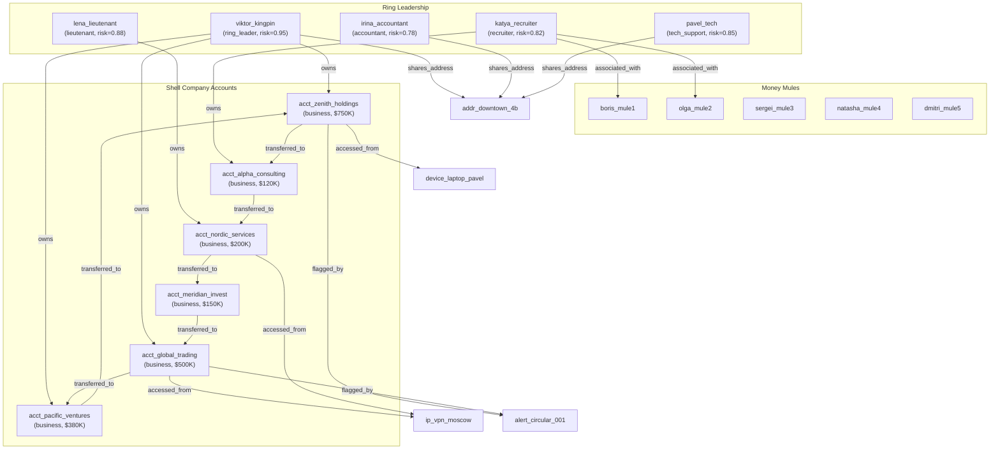

# Fraud Ring Investigation Showcase

> **Activation-Based Alert Triage, Reasoning for Hidden Connections, Cycle Detection for Circular Money Flows, and Betweenness Centrality for Suspect Ranking across a 119-Node Fraud Network**

## 1. The Approach

Fraud investigators face a network problem: the entities they track (persons, accounts, transactions, devices, addresses) are connected, but those connections are scattered across transaction logs, KYC records, device fingerprints, and alert queues. Traditional analysis examines each data source in isolation and relies on the investigator to mentally join them.

**The Manual Bottleneck:** Spotting that three accounts share a VPN IP, funnel money through a shell company, and cycle it back to the ringleader requires correlating transaction records, access logs, corporate registrations, and alert histories. In a case with hundreds of entities, manual cross-referencing misses connections.

**The Hyper3 Approach:** Store every entity as a labeled node in a directed hypergraph with typed edges (`transferred_to`, `shares_address`, `accessed_from`). A single spreading activation query from an alert surfaces all related entities. Reasoning rules infer hidden transfer chains. Cycle detection finds circular money flows. Betweenness centrality ranks suspects by how much they broker between clusters.

## 2. A Simple Analogy

Imagine a detective's corkboard with photos of suspects, bank account numbers, and addresses pinned to it, connected by colored strings. Red strings mean "transferred money to," blue strings mean "shares an address," and green strings mean "accessed from the same device." Pull on one string and the whole web vibrates. Hyper3 is that corkboard, but the strings light up automatically when you touch one node, and the board can tell you which suspect sits at the intersection of every cluster.

## 3. Key Concepts

| Term | Plain English Meaning |
|------|----------------------|
| **Spreading Activation** | Energy propagates from a starting node through edges, decaying with distance. High-activation nodes are closely related to the origin. |
| **Pattern Match** | Find all edges with a given label (e.g., all `transferred_to` edges) |
| **Transitive Rule** | If A transfers to B and B transfers to C, infer that A transfers indirectly to C |
| **Cycle Detection** | Find circular paths where money flows back to its origin (A→B→C→A) |
| **Funnel Account** | An account that receives money from multiple sources and sends it to multiple destinations (high in-degree and out-degree) |
| **Betweenness Centrality** | Measures how often a node sits on the shortest path between other nodes. High betweenness = broker between clusters. |
| **Connected Component** | A cluster of nodes where every node can reach every other through edges |
| **Subgraph** | A subset of the graph extracted around specific nodes |

## 4. Quick Start

Run the showcase to build a 119-node fraud investigation graph:

```bash
.venv/bin/python examples/showcase/fraud_detection/fraud_detection_intelligence.py
```

### What You'll See

The example builds a fraud network and demonstrates 7 analysis sections:

```
======================================================================
SECTION 1: Fraud Network Construction
======================================================================
  Nodes: 119
  Edges: 237

======================================================================
SECTION 2: Alert Triage and Activation
======================================================================
  Spreading activation from alert_circular_001:
    acct_zenith_holdings                activation=1.000 depth=1 [business]
    acct_global_trading                 activation=0.941 depth=1 [business]
    ...

======================================================================
SECTION 7: Investigation Summary
======================================================================
  Graph: 119 nodes, 287 edges
  Cycles detected: 15
  Funnel accounts: 8
  Indirect transfers inferred: 50
```

## 5. The Scenario

The example models a cross-border money laundering ring orchestrated by a ringleader through shell companies, money mules, and layered transactions. The network contains **119 nodes and 237 edges** across seven entity types:

- **28 Persons:** ringleader, lieutenant, 5 money mules, 3 cash runners, recruiter, tech support, accountant, 5 victims, 2 business targets, and 7 law enforcement / compliance staff
- **22 Accounts:** personal, business, corporate, investment, savings, and checking accounts across multiple institutions
- **18 Transactions:** wire, ACH, SWIFT, and ATM transfers ranging from $7,500 to $250,000
- **16 Entities:** 6 shell companies, 5 addresses, 5 phone numbers
- **12 Patterns:** structuring, circular flow, funnel account, shell layering, smurfing, rapid movement, mule network, BEC, KYC evasion, round trip, FATF indicator, identity theft
- **12 IP/Devices:** VPNs, Tor exit nodes, shared laptops, phones, public Wi-Fi
- **11 Alerts:** active, investigating, and escalated alerts for suspicious activity

### Fraud Network Topology

Figure 1: The fraud ring connects persons, accounts, transactions, and infrastructure through nine edge types.



### Edge Label Taxonomy

| Category | Label | Count | Meaning |
|----------|-------|-------|---------|
| **Ownership** | `owns` | 28 | Person controls an account |
| **Money Flow** | `transferred_to` | 35 | Money moved between accounts |
| **Shared Identity** | `shares_address` | 20 | Persons share a physical address |
| **Shared Identity** | `shares_phone` | 12 | Persons share a phone number |
| **Digital Access** | `accessed_from` | 22 | Account accessed from an IP or device |
| **Alert Linkage** | `flagged_by` | 28 | Entity flagged by an alert |
| **Similarity** | `similar_to` | 19 | Entity behaviorally similar to another |
| **Social** | `associated_with` | 37 | Known social or operational connection |
| **Pattern** | `pattern_match` | 36 | Entity matches a fraud pattern |

## 6. The Analysis Pipeline

The example walks through 7 sections that progressively uncover the fraud ring's structure.

### Section 1: Fraud Network Construction

Build the graph from seven entity dictionaries and nine edge groups:

```python
mem = HypergraphMemory(evolve_interval=0)

for label, data in all_nodes.items():
    mem.store(label, data=data)

for src, tgt in transferred_to_edges:
    mem.relate(src, tgt, label="transferred_to")
```

**Result:** 119 nodes, 237 edges. The graph contains the full fraud network: persons, accounts, transactions, shell companies, patterns, IP/device traces, and alerts.

### Section 2: Alert Triage and Activation

Start from a critical alert (`alert_circular_001`) and use spreading activation to discover which entities are connected to it:

```python
activated = mem.activate("alert_circular_001", energy=1.0, top_k=15)
```

**Why this matters:** An analyst receives dozens of alerts daily. Spreading activation prioritizes investigation by showing which accounts, persons, and devices are most closely connected to a critical alert. Without it, the analyst would need to manually trace each flagged account's connections.

**Result:** `acct_zenith_holdings` activates at 1.000 (directly flagged), followed by `acct_global_trading` at 0.941. Two hops out, `viktor_kingpin` appears at 0.736 and `ip_vpn_moscow` at 0.500. The activation surface reveals the ring's core in a single query.

Retrieval from `acct_zenith_holdings` surfaces connected entities including `acct_global_trading`, `ip_vpn_moscow`, `viktor_kingpin`, `acct_pacific_ventures`, and patterns like `pat_round_trip` and `pat_funnel_account`.

### Section 3: Reasoning and Hidden Connection Discovery

Apply transitive rules to discover indirect transfer chains that are not explicitly recorded:

```python
mem.add_rules(
    TransitiveRule(edge_label="transferred_to", new_label="transfers_indirectly"),
    InverseRule(edge_label="owns", inverse_label="owned_by"),
    TransitiveRule(edge_label="associated_with", new_label="indirectly_associated"),
)

reason_result = mem.reason(
    seed_concepts={"acct_zenith_holdings", "acct_global_trading", "viktor_kingpin"},
    max_depth=3,
    max_total_states=50,
)
```

**Why this matters:** Money laundering hides connections through intermediaries. If A transfers to B, and B transfers to C, the relationship between A and C exists in the transaction log but is invisible without chain traversal. Transitive rules surface these multi-hop chains automatically.

**Result:** 51 states created, 50 rules applied, max depth 2. The transitive rule discovers 50 indirect transfer chains, including `acct_alpha_consulting -> acct_olga_savings`, `acct_dmitri_invest -> acct_viktor_business`, and `acct_nexus_corporate -> acct_pacific_ventures`. These chains reveal money paths that span multiple intermediary accounts.

### Section 4: Pattern Detection

Detect circular money flows where funds return to their origin:

```python
cycles = mem.detect_cycles(max_cycles=10)
```

**Why this matters:** Circular flows are a hallmark of layering in money laundering. Money cycles through a chain of accounts and returns to (or near) its source, creating the appearance of legitimate business transactions. Without cycle detection, an analyst examining individual transfers sees only legitimate-looking movements.

**Result:** 15 circular money flows detected. Cycle 1 is a short loop: `acct_zenith_holdings -> acct_viktor_business -> acct_zenith_holdings`. Cycle 6 is a 12-node loop spanning the full shell company network: `acct_alpha_consulting -> acct_lena_personal -> acct_boris_checking -> acct_olga_savings -> acct_zenith_holdings -> acct_viktor_business -> acct_global_trading -> acct_pacific_ventures -> acct_nordic_services -> acct_viktor_personal -> acct_dmitri_invest -> acct_alpha_consulting`.

### Section 5: Funnel Account Identification

Find accounts that receive from multiple sources and send to multiple destinations:

```python
transferred = mem.pattern_match(edge_label="transferred_to")

for edge in transferred:
    in_degree[target] += 1
    out_degree[source] += 1

# Funnel: in_degree >= 2 AND out_degree >= 2
```

**Why this matters:** Funnel accounts aggregate illicit funds from multiple sources and redistribute them. A legitimate account typically receives from a few sources (employer, transfers) and spends in predictable patterns. A funnel account receiving from 4 sources and sending to 2 destinations is a structural red flag that emerges from degree analysis alone, without examining transaction amounts or timing.

**Result:** 8 funnel accounts identified. `acct_zenith_holdings` has the highest total degree (in=4, out=2, total=6). All except `acct_natasha_checking` are flagged as suspicious.

### Section 6: Cluster Analysis and Risk Ranking

Identify suspicious clusters by finding connected components that overlap with flagged entities:

```python
flagged_node_labels = set()
for label, data in accounts.items():
    if data.get("flagged"):
        flagged_node_labels.add(label)
for label, data in persons.items():
    if data.get("risk_score", 0) >= 0.60:
        flagged_node_labels.add(label)

components = mem.connected_components()
for comp in components:
    overlap = comp & flagged_node_labels
    if len(overlap) >= 3:
        suspicious_clusters.append((comp, overlap))
```

**Why this matters:** Individual red flags (a VPN access, a shared address, a round-number transaction) are weak signals in isolation. Clustering aggregates them: when a connected component contains 32 flagged nodes across persons, accounts, entities, and devices, the cluster itself becomes the evidence.

**Result:** 1 suspicious cluster with 91 nodes and 32 flagged entities. It contains persons (agent_clark, alexei_runner1, boris_mule1, dmitri_mule5), accounts (acct_alpha_consulting, acct_global_trading, acct_zenith_holdings), entities (addr_oakwood_101, ent_alpha_consulting_gmbh), and IP/devices (ip_vpn_moscow, device_laptop_pavel).

Rank suspects by betweenness centrality to identify who brokers between clusters:

```python
betweenness = mem.betweenness_centrality()
ranked = sorted(suspect_persons.items(), key=lambda x: -betweenness.get(x[0], 0))
```

**Why this matters:** The ringleader (risk=0.95) has high degree but low betweenness because they operate through lieutenants. The recruiter (risk=0.82) has the highest betweenness (0.0036) because they connect the leadership to the mule network. Betweenness reveals organizational structure that degree alone obscures: the person who bridges two otherwise-disconnected groups is operationally critical even if their total connection count is lower.

**Result:** `katya_recruiter` ranks first by betweenness (0.0036) despite having a lower risk score (0.82) than `viktor_kingpin` (0.95). This is because katya connects the leadership tier to the mule network — a structural broker role. `olga_mule2` (0.0032) and `sergei_mule3` (0.0026) follow, both money mules who sit on paths between accounts.

### Section 7: Investigation Summary

Aggregate all findings:

```python
stats = mem.stats()
print(f"Graph: {stats.nodes} nodes, {stats.edges} edges")
print(f"Connected components: {stats.components}")
```

**Result:** 119 nodes, 287 edges (50 edges added by reasoning), 14 connected components, 15 cycles, 8 funnel accounts, 50 indirect transfer chains inferred.

The largest suspicious subgraph (91 nodes, 261 edges) captures the core fraud ring. Recommended next steps include filing SARs for structuring, freezing key accounts, subpoenaing shell company records, and coordinating cross-border requests.

## 7. Understanding the Output

### Activation Score Interpretation

| Activation Range | Meaning |
|------------------|---------|
| 1.0 | Directly connected to the alert origin |
| 0.7-0.99 | One hop away, strong association |
| 0.4-0.69 | Two hops away, moderate association |
| < 0.4 | Peripheral, weak association |

### Betweenness Centrality Interpretation

| Betweenness Range | Meaning |
|-------------------|---------|
| 0.003+ | Structural broker — sits on many shortest paths between clusters |
| 0.001-0.003 | Moderate connector — bridges some paths |
| < 0.001 | Peripheral — few paths pass through this node |

Note: Betweenness values are small because the graph is dense with many short alternative paths. The relative ranking matters more than the absolute values.

### Risk Score Interpretation

| Risk Score Range | Meaning |
|------------------|---------|
| 0.80+ | High confidence suspect — strong evidence of involvement |
| 0.60-0.79 | Moderate suspect — circumstantial or indirect evidence |
| 0.40-0.59 | Low confidence — some indicators but limited evidence |
| < 0.40 | Unlikely involved — victim, witness, or legitimate entity |

### Funnel Account Thresholds

| Degree | Meaning |
|--------|---------|
| in >= 4 | Major aggregation point — receives from many sources |
| in >= 2 AND out >= 2 | Funnel account — receives and redistributes |
| in = 0 | Source account — only sends money out |
| out = 0 | Sink account — only receives money |

## 8. Key Metrics

| Metric | Value |
|--------|-------|
| Graph nodes | 119 |
| Graph edges (initial) | 237 |
| Graph edges (after reasoning) | 287 |
| Persons | 28 |
| Accounts | 22 |
| Transactions | 18 |
| Entities (companies, addresses, phones) | 16 |
| Fraud patterns | 12 |
| IP/Device traces | 12 |
| Alerts | 11 |
| Connected components | 14 |
| Circular money flows | 15 |
| Funnel accounts | 8 |
| Suspicious clusters (>= 3 flagged nodes) | 1 |
| Largest suspicious cluster | 91 nodes, 32 flagged |
| Indirect transfers inferred | 50 |
| Reasoning states created | 51 |
| Reasoning rules applied | 50 |
| Reasoning max depth | 2 |
| Top activation from alert_circular_001 | acct_zenith_holdings (1.000) |
| Highest betweenness suspect | katya_recruiter (0.0036) |
| Highest risk suspect | viktor_kingpin (0.95) |
| Largest suspicious subgraph | 91 nodes, 261 edges |

## 9. What Makes This Different

**Activation-based triage** replaces manual alert-to-entity correlation. Instead of examining each alert and separately looking up its connected accounts, persons, and devices, spreading activation surfaces the entire relevant subgraph from a single starting point.

**Transitive reasoning** discovers multi-hop transfer chains that are invisible in raw transaction logs. The 50 indirect transfer chains inferred by the `TransitiveRule` represent money paths that span intermediary accounts. Without rule-based inference, an analyst would need to manually trace each chain by examining individual transactions.

**Cycle detection** identifies circular money flows automatically. The 15 cycles detected include short 2-account loops (zenith -> viktor_business -> zenith) and long 12-account chains that traverse the full shell company network. Finding these manually requires tracing each account's transaction graph and checking for returns to the source.

**Betweenness-based ranking** reveals organizational structure. The ringleader (`viktor_kingpin`) has the highest risk score (0.95) but low betweenness (0.0000) because they operate through intermediaries. The recruiter (`katya_recruiter`) has the highest betweenness (0.0036) because they bridge the leadership and mule tiers. Degree centrality alone would miss this distinction.

**Unified graph representation** stores persons, accounts, transactions, devices, addresses, and alerts in a single structure. Querying across categories (which persons share an address with a flagged account?) requires no joins — it's a two-hop traversal.

## 10. Code Implementation

Building a fraud investigation graph in Hyper3 requires minimal boilerplate.

**1. Define Entity Dictionaries**

```python
persons = {
    "viktor_kingpin": {"role": "ring_leader", "risk_score": 0.95, "country": "RU"},
    "katya_recruiter": {"role": "recruiter", "risk_score": 0.82, "country": "RU"},
    # ...
}

accounts = {
    "acct_zenith_holdings": {"type": "business", "balance": 750000, "flagged": True},
    # ...
}
```

**2. Store All Nodes**

```python
all_nodes = {}
all_nodes.update(persons)
all_nodes.update(accounts)
all_nodes.update(transactions)

for label, data in all_nodes.items():
    mem.store(label, data=data)
```

**3. Create Typed Relationships**

```python
edge_groups = {
    "owns": [("viktor_kingpin", "acct_zenith_holdings"), ...],
    "transferred_to": [("acct_zenith_holdings", "acct_alpha_consulting"), ...],
    "shares_address": [("viktor_kingpin", "addr_downtown_4b"), ...],
}

for label, pairs in edge_groups.items():
    for src, tgt in pairs:
        mem.relate(src, tgt, label=label)
```

**4. Triage Alerts with Activation**

```python
activated = mem.activate("alert_circular_001", energy=1.0, top_k=15)
for r in activated:
    print(f"{r.label}: activation={r.activation:.3f}")
```

**5. Discover Hidden Connections**

```python
mem.add_rules(
    TransitiveRule(edge_label="transferred_to", new_label="transfers_indirectly"),
)
reason_result = mem.reason(
    seed_concepts={"acct_zenith_holdings"},
    max_depth=3,
)
indirect = mem.pattern_match(edge_label="transfers_indirectly")
```

**6. Detect Circular Flows and Funnel Accounts**

```python
cycles = mem.detect_cycles(max_cycles=10)

transferred = mem.pattern_match(edge_label="transferred_to")
# Count in-degree and out-degree per account
# Filter for in >= 2 AND out >= 2
```

**7. Rank Suspects by Betweenness**

```python
betweenness = mem.betweenness_centrality()
ranked = sorted(suspects.items(), key=lambda x: -betweenness.get(x[0], 0))
```

## 11. Real-World Gap

Hyper3 provides graph construction, traversal, reasoning, and analysis. The following are out of scope and require integration work for production use:

1. **Transaction Data Pipeline:** The showcase constructs a synthetic graph from dictionaries. Real adoption requires ETL from banking cores, payment processors, SWIFT messages, and KYC databases into labeled nodes and edges.

2. **Scale:** The showcase operates on 119 nodes. Production fraud graphs involve millions of transactions and accounts. Performance at that scale is untested.

3. **Real-Time Alert Ingestion:** Alerts are pre-defined in the showcase. Production use requires consuming alerts from monitoring systems (transaction monitoring, sanctions screening, fraud scoring engines) and creating corresponding nodes and edges.

4. **Entity Resolution:** The showcase assumes unique labels for each entity. Real-world data contains duplicates (multiple spellings of the same name, shared addresses that are coincidental). Entity resolution and deduplication are preprocessing steps outside Hyper3.

5. **Regulatory Reporting:** The showcase recommends filing SARs and freezing accounts, but does not generate regulatory filings. Integration with case management and reporting systems (e.g., FinCEN BSA E-Filing) is a separate concern.

6. **Temporal Analysis:** The showcase treats the graph as a static snapshot. Real fraud investigation requires time-series analysis: when did each transfer occur, how did the network evolve over time, and which entities appeared simultaneously.

## 12. Reference

### Core Concept Glossary

| Term | Semantic Definition |
|------|---------------------|
| **Spreading Activation** | Energy propagation from a source node through edges, decaying with distance |
| **Transitive Rule** | If A→B and B→C share the same edge label, infer A→C with a new label |
| **Inverse Rule** | If A→B with label X, infer B→A with inverse label Y |
| **Cycle** | A path where the first and last nodes are the same |
| **Funnel Account** | Account with both high in-degree (>= 2) and high out-degree (>= 2) |
| **Betweenness Centrality** | Fraction of shortest paths passing through a node |
| **Connected Component** | Maximal set of nodes where each node can reach every other |
| **Subgraph** | Graph induced by a subset of nodes and their mutual edges |

### Key API Methods

| Method | Purpose |
|--------|---------|
| `mem.store(label, data)` | Create a node with metadata |
| `mem.relate(source, target, label)` | Create a typed edge between nodes |
| `mem.activate(concept, energy, top_k)` | Spreading activation from a node |
| `mem.retrieve(concept, top_k, iterations)` | Retrieve related entities |
| `mem.add_rules(*rules)` | Register inference rules |
| `mem.reason(seed_concepts, max_depth)` | Apply rules to discover new edges |
| `mem.pattern_match(edge_label)` | Find all edges with a given label |
| `mem.detect_cycles(max_cycles)` | Find circular paths |
| `mem.degree_centrality()` | Compute degree centrality for all nodes |
| `mem.betweenness_centrality()` | Compute betweenness centrality for all nodes |
| `mem.connected_components()` | Identify connected clusters |
| `mem.subgraph(labels)` | Extract a subgraph around specific nodes |
| `mem.find_similar(concept, top_k)` | Find structurally similar nodes |
| `mem.stats()` | Get graph statistics |

### Related Examples

| Example | Focus |
|---------|-------|
| `examples/showcase/threat_intelligence/knowledge_basics.py` | Cyber threat intel graph with centrality and attack paths |
| `examples/showcase/network_analytics/graph_analytics.py` | Centrality, cycles, components, risk scoring |
| `examples/showcase/multiway_reasoning/multiway_reasoning.py` | Multiway expansion, state convergence, lateral insights |
| `examples/showcase/centrality_and_ranking/centrality_and_ranking.py` | Degree, betweenness, PageRank, community detection |
| `examples/showcase/retrieval_and_similarity/retrieval_and_similarity.py` | Spreading activation, retrieval, similarity scoring |
