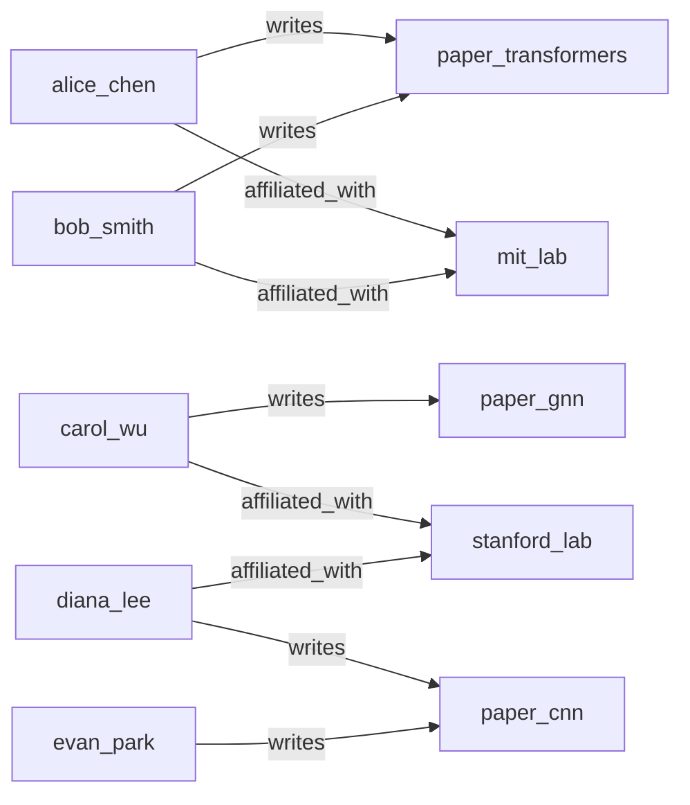

# Graph Versioning, Diffing, and Rollback

> **Audit-Trail Version Control for Knowledge Graphs with 3 Editing Sessions**

## 1. The Approach

Knowledge graphs evolve through editing sessions, and mistakes happen. A batch import might introduce incorrect relationships. A reasoning run might produce edges that should be reviewed before committing. Two curators might edit the same graph concurrently, producing conflicting changes. Without version control, there is no way to determine what changed, who changed it, or how to undo a bad edit.

The GraphDiffer provides version control for knowledge graphs: every change is tracked, every version is restorable, and any two versions can be compared. `capture_version()` snapshots the current graph state. `diff_from_version()` produces a typed delta listing every node and edge that was added, removed, or modified. `rollback_to_version()` restores the graph to a previous version by structurally undoing all changes since that version. `diff_from_snapshot()` enables comparison against externally stored state. This is git-for-knowledge-graphs — enabling collaborative curation with the safety net of rollback.

## 2. Key Concepts

| Term | Plain English Meaning |
|------|----------------------|
| **GraphVersion** | Point-in-time snapshot with version_id, timestamp, node count, edge count |
| **GraphDelta** | Complete diff between two versions: nodes/edges added, removed, modified |
| **NodeDelta** | Individual node change record with old/new data values |
| **EdgeDelta** | Individual edge change record with old/new label, weight, source/target |
| **Rollback** | Restore graph to a previous version, undoing all changes since that version |
| **Version history** | Timeline of all captured versions with growing node/edge counts |
| **Snapshot dict** | External graph state (dict of node/edge data) for comparison without stored versions |
| **Capture** | Snapshot the current graph into the version history |

## 3. Quick Start

```bash
.venv/bin/python examples/showcase/graph_versioning/graph_versioning.py
```

```
SECTION 1: BUILD INITIAL GRAPH AND CAPTURE BASELINE
v0 captured: version_id=0, nodes=12, edges=9

SECTION 2: FIRST EDIT SESSION - ADD COLLABORATIONS
v1 captured: version_id=1, nodes=13, edges=14
delta v0 -> v1:
  total changes: 6
  nodes added: 1, edges added: 5
    +node: paper_diffusion
    +edge: alice_chen -[collaborates_with]-> carol_wu
    +edge: alice_chen -[writes]-> paper_diffusion

SECTION 3: SECOND EDIT SESSION - CROSS-DOMAIN LINKS
v2 captured: version_id=2, nodes=13, edges=16
delta v1 -> v2:
  edges added: 2
    +edge: nlp -[cross_domain]-> computer_vision
    +edge: machine_learning -[subfield_of]-> nlp

SECTION 4: VERSION HISTORY
total versions: 3
  v0: nodes=12, edges=9
  v1: nodes=13, edges=14
  v2: nodes=13, edges=16

SECTION 5: ERRONEOUS EDIT AND ROLLBACK
before rollback: nodes=15, edges=19
rollback to v2...
after rollback: nodes=13, edges=16
bad nodes removed: True

SECTION 6: DIFF FROM ARBITRARY SNAPSHOT
nodes added: 13, edges added: 16
```

> Output is deterministic — version IDs and change counts are stable across runs.

## 4. The Scenario

A research knowledge graph with four node categories:

- **Topics** (3): machine_learning, nlp, computer_vision
- **Authors** (5): alice_chen, bob_smith, carol_wu, diana_lee, evan_park
- **Papers** (3): paper_transformers, paper_gnn, paper_cnn
- **Institutions** (2): mit_lab, stanford_lab

Three editing sessions add collaborations and cross-domain links, then a fourth session introduces erroneous edges that get rolled back.



Initial graph (v0): 12 nodes, 9 edges. Editing sessions add collaboration edges (v1), cross-domain links (v2), and erroneous data that gets rolled back.

## 5. Analysis Pipeline

**Section 1 — Build initial graph and capture baseline:** 12 nodes and 9 edges are created. Topics (machine_learning, nlp, computer_vision) are tagged with `data={"type": "topic"}`. Authors are tagged with `data={"type": "author"}`. Papers are tagged with `data={"type": "paper"}`. Institutions are tagged with `data={"type": "institution"}`. Nine edges connect authors to papers (`writes`), papers to topics (`about`), and authors to institutions (`affiliated_with`). `capture_version()` snapshots this as v0 (version_id=0, nodes=12, edges=9). Why this matters: the baseline version establishes the known-good state. Every subsequent change is measured against this snapshot, and rollback to v0 would restore the graph to its original state.

**Section 2 — First edit session — add collaborations:** The script adds 5 new edges and 1 new node. alice_chen and bob_smith get `collaborates_with` edges to carol_wu. A new paper node (paper_diffusion) is created with alice_chen and carol_wu as authors. paper_diffusion cites machine_learning. `capture_version()` snapshots this as v1 (version_id=1, nodes=13, edges=14). `diff_from_version(0)` produces a GraphDelta with 6 total changes: 1 node added (paper_diffusion) and 5 edges added (3 collaboration/writes edges + 1 cites edge + 1 cross-reference). Each change is a typed NodeDelta or EdgeDelta with the new values. Why this matters: the delta provides a complete audit trail of the first editing session. A reviewer can see exactly what was added without comparing the full graph manually. The delta shows not just counts but the specific nodes and edges that changed.

**Section 3 — Second edit session — cross-domain links:** The script adds 2 new edges: nlp -> computer_vision (`cross_domain`) and machine_learning -> nlp (`subfield_of`). `capture_version()` snapshots this as v2 (version_id=2, nodes=13, edges=16). `diff_from_version(1)` shows 2 total changes: 2 edges added, 0 nodes changed. The graph has grown from 14 to 16 edges while the node count remains at 13. Why this matters: this is a minimal edit — just 2 edges connecting existing topics. The delta captures this precisely, showing that no nodes were added or removed. A reviewer can approve this change quickly because the diff is small and focused.

**Section 4 — Version history:** `version_history()` returns 3 versions with growing node/edge counts. v0: 12 nodes, 9 edges. v1: 13 nodes, 14 edges (growth of 1 node and 5 edges from session 1). v2: 13 nodes, 16 edges (growth of 2 edges from session 2). The history provides a timeline of graph evolution with monotonically increasing version IDs. Why this matters: the version history is the audit log. It shows when each version was captured, how large the graph was at each point, and which versions are available for diffing or rollback. In a collaborative setting, each curator's session would produce a version, enabling attribution of changes.

**Section 5 — Erroneous edit and rollback:** The script simulates a bad import: 2 spurious nodes (bad_node_1, bad_node_2) and 3 spurious edges are added, growing the graph to 15 nodes and 19 edges. `diff_from_version(2)` shows 5 changes that need undoing: 2 nodes to remove and 3 edges to remove. `rollback_to_version(2)` structurally restores the graph: it removes bad_node_1 and bad_node_2, deletes the 3 spurious edges, and verifies the graph now matches v2. After rollback: 13 nodes, 16 edges. `has_node("bad_node_1")` returns False. Why this matters: rollback is structural — it does not just revert metadata flags. It physically removes the extra nodes and edges, restoring the graph to the exact state of v2. This means the graph is safe for continued editing after rollback, with no residual state from the erroneous session.

**Section 6 — Diff from arbitrary snapshot:** The script creates an external snapshot dict (a single node "external_ref" with no edges) and calls `diff_from_snapshot(snapshot)`. The result shows 13 nodes added and 16 edges added — everything in the current graph that is not in the external snapshot. This enables comparison against externally stored state without requiring the external graph to use Hyper3. Why this matters: `diff_from_snapshot()` enables integration with external systems. A curator can export a graph to a dict, store it externally, and later compare the current graph against that stored state. This is the bridge between Hyper3's version control and external persistence mechanisms.

## 6. Key Metrics

| Metric | Value |
|--------|-------|
| Total versions | 3 (v0, v1, v2) |
| v0 (baseline) | 12 nodes, 9 edges |
| v1 (after collaborations) | 13 nodes, 14 edges |
| v2 (after cross-domain) | 13 nodes, 16 edges |
| v0 -> v1 delta | 6 changes (1 node added, 5 edges added) |
| v1 -> v2 delta | 2 changes (2 edges added) |
| Pre-rollback graph | 15 nodes, 19 edges |
| Post-rollback graph | 13 nodes, 16 edges (matches v2) |
| Rollback changes undone | 5 (2 nodes removed, 3 edges removed) |
| Snapshot diff nodes added | 13 |
| Snapshot diff edges added | 16 |

## 7. What Makes This Different

**Typed deltas** provide complete change records, not just counts. Each change is a NodeDelta or EdgeDelta with old and new values. The v0 -> v1 delta shows not just "1 node added" but specifically that paper_diffusion was added with its data dict. This enables precise audit trails where every change can be reviewed, approved, or reverted individually.

**Structural rollback** restores the actual graph by removing extra nodes/edges and re-adding missing ones. It does not flag nodes as "soft-deleted" or revert metadata — it physically reconstructs the graph to match the target version. After rollback, the graph is identical to the target version, with no residual state from the undone changes. This makes post-rollback editing safe: new changes build on a clean foundation.

**Arbitrary snapshot comparison** via `diff_from_snapshot()` enables comparison against any externally stored graph state. The external state is provided as a dict (not a Hyper3 instance), making it compatible with any persistence mechanism — JSON files, databases, or other graph systems. This bridges Hyper3's version control with external tooling.

## 8. Code Implementation

**1. Build initial graph and capture version:**

```python
from hyper3 import HypergraphMemory

mem = HypergraphMemory(evolve_interval=0)

topics = ["machine_learning", "nlp", "computer_vision"]
authors = ["alice_chen", "bob_smith", "carol_wu", "diana_lee", "evan_park"]
papers = ["paper_transformers", "paper_gnn", "paper_cnn"]
institutions = ["mit_lab", "stanford_lab"]

for t in topics:
    mem.add(t, data={"type": "topic"})
for a in authors:
    mem.add(a, data={"type": "author"})
for p in papers:
    mem.add(p, data={"type": "paper"})
for i in institutions:
    mem.add(i, data={"type": "institution"})

mem.link("alice_chen", "paper_transformers", label="writes")
mem.link("alice_chen", "mit_lab", label="affiliated_with")

v0 = mem.capture_version()
print(f"v0: nodes={v0.node_count}, edges={v0.edge_count}")
```

**2. Edit and capture new version:**

```python
mem.add("paper_diffusion", data={"type": "paper"})
mem.link("alice_chen", "carol_wu", label="collaborates_with")
mem.link("alice_chen", "paper_diffusion", label="writes")

v1 = mem.capture_version()
delta = mem.diff_from_version(0)
print(f"total changes: {delta.total_changes}")
for node in delta.nodes_added:
    print(f"  +node: {node.label}")
```

**3. View version history:**

```python
history = mem.version_history()
for v in history.versions:
    print(f"  v{v.version_id}: nodes={v.node_count}, edges={v.edge_count}")
```

**4. Rollback to a previous version:**

```python
mem.add("bad_node_1", data={"type": "error"})
mem.link("bad_node_1", "alice_chen", label="spurious")

rollback = mem.rollback_to_version(2)
print(f"changes undone: {rollback.changes_undone}")
print(f"nodes after rollback: {mem.describe().node_count}")
```

**5. Diff from external snapshot:**

```python
snapshot = {"nodes": {"external_ref": {"data": {}}}, "edges": []}
diff = mem.diff_from_snapshot(snapshot)
print(f"nodes added: {len(diff.nodes_added)}")
print(f"edges added: {len(diff.edges_added)}")
```

## 9. Real-World Gap

This showcase demonstrates version control on a small research knowledge graph. Real-world adoption involves additional work:

- **Incremental storage:** Snapshots are in-memory dicts. Large graphs (10K+ nodes) require incremental storage that records only deltas, not full copies of each version.
- **Merge and rebase:** The showcase uses linear version history. Collaborative editing requires branch/merge semantics — merging two concurrent editing sessions, detecting conflicts, and resolving them.
- **Conflict resolution:** When two curators edit the same node or edge, the system needs a strategy for resolving conflicts (last-writer-wins, manual resolution, semantic merging).
- **Scale:** The showcase runs on 12-15 nodes. Rollback performance depends on the number of changes to undo; very large deltas may require batched restoration.
- **Persistence:** Version history is in-memory. Production use requires persisting versions to disk or a database, with efficient lookup by version_id.
- **Access control:** The showcase has no access control. Real collaborative systems need permissions (who can capture, who can rollback, who can view diffs).

## 10. Reference

| Method | Purpose |
|--------|---------|
| `mem.capture_version()` | Snapshot the current graph state into version history |
| `mem.diff_from_version(version_id)` | Compute typed delta between current graph and a stored version |
| `mem.rollback_to_version(version_id)` | Restore the graph to a previous version, undoing all changes |
| `mem.version_history()` | Return timeline of all captured versions |
| `mem.diff_from_snapshot(snapshot)` | Compute delta between current graph and an external snapshot dict |
| `mem.add(concept, data)` | Create a node with optional data dict |
| `mem.link(source, target, label, weight)` | Add a pairwise directed edge |
| `mem.describe()` | Return graph statistics (nodes, edges, density, components) |

### Related Examples

| Example | Connection |
|---------|-----------|
| `overlay_commit_rollback` | Overlay-based commit and rollback semantics |
| `provenance_and_retraction` | Cascading retraction of inferred edges |
| `construction_and_queries` | Graph construction patterns used in this showcase |
