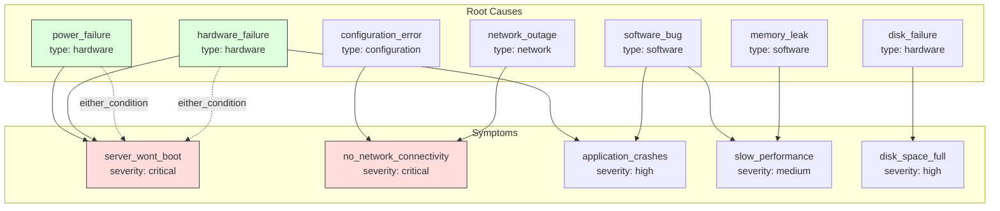
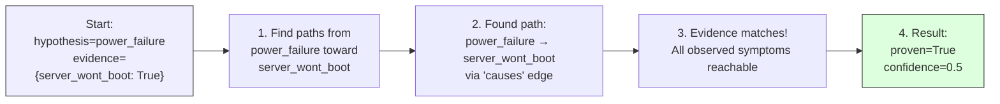
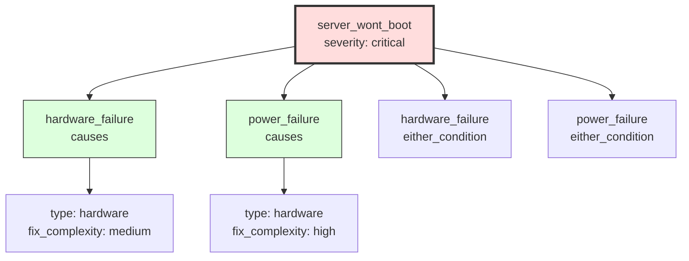

# IT Troubleshooting Engine

> Backward chaining reasoning for root cause analysis in IT systems.

## 1. The Approach

This showcase demonstrates Hyper3's **backward chaining** capability for IT troubleshooting. Unlike transitive reasoning (A→B→C), backward chaining is goal-directed: it proves or disproves whether a specific hypothesis (root cause) explains observed symptoms.

Traditional hypergraph traversal supports forward reasoning — finding chains like A→B→C given edges A→B and B→C. Real troubleshooting requires the inverse:

> "Given that server_wont_boot is true, is power_failure the root cause?"

Backward chaining starts with a hypothesis and works forward through the causal graph to find supporting or refuting evidence, accumulating confidence as it goes.

**Why this matters**: Forward traversal discovers what *could* be true. Backward chaining proves what *is* true given evidence. Diagnostic workflows need the latter — an engineer doesn't want to know every possible chain, they want to know whether a specific suspect actually explains the observed symptoms.

## 2. A Simple Analogy

Imagine a detective investigating a broken window. Forward reasoning lists everyone who walked past the house. Backward reasoning starts with a suspect ("was it the kid with the baseball?") and checks whether the evidence matches — ball found nearby, kid was outside at the time, no other ball marks. The second approach is faster when you have a hypothesis to test.

## 3. Key Concepts

| Term | Plain English |
|------|---------------|
| Backward chaining | Start with a hypothesis, check if it explains observed symptoms |
| Confidence score | How much evidence supports the hypothesis (0.0 to 1.0) |
| N-ary hyperedge | An edge connecting multiple source nodes to one target ("either A or B causes C") |
| Issue tree | Full upstream dependency graph from a symptom to all possible root causes |
| Proof chain | The path from hypothesis to each confirmed symptom |

## 4. Quick Start

```bash
.venv/bin/python examples/showcase/it_troubleshooting/demo.py
```

Expected output:

```
SECTION 1: Building troubleshooting graph...
  Total nodes: 13
  Total edges: 10

SECTION 2: Proving root cause: power_failure → server_wont_boot
  Result: PROVEN
  Confidence: 0.5

SECTION 4: Finding possible causes for 'no_network_connectivity'
  Found 2 possible cause(s):
    - configuration_error (confidence: 1.0)
    - network_outage (confidence: 1.0)

SECTION 6: Getting issue tree for 'server_wont_boot'
  Causes:
    - power_failure (causes)
    - hardware_failure (causes)
    - power_failure (either_condition)
    - hardware_failure (either_condition)
```

## 5. The Scenario

The engine models an IT infrastructure with 7 root causes and 5 observable symptoms:



**What this shows:**
- **Root Causes**: 7 possible root causes, each with type metadata (hardware, software, configuration, network)
- **Symptoms**: 5 observable symptoms with severity metadata
- **N-ary hyperedge**: The dashed `either_condition` edge represents "either power_failure OR hardware_failure can cause server_wont_boot" — a single hyperedge connecting two sources to one target

The graph has **13 nodes** and **10 edges**. The n-ary hyperedge connecting both `power_failure` and `hardware_failure` to `server_wont_boot` models the real-world scenario where multiple failure modes produce the same symptom.

**Why n-ary edges matter**: With pairwise edges, modeling "either A or B causes C" requires two separate edges and an explicit annotation that they're alternatives. The n-ary hyperedge captures this in a single edge, preserving the collective semantics — removing one source from the hyperedge updates the condition group directly.

## 6. Analysis Pipeline

### Section 1: Building the Graph

The engine creates 13 nodes (7 root causes, 5 symptoms, 1 derived node) and 10 edges (8 pairwise "causes" edges, 1 n-ary "either_condition" hyperedge counting as 2 source connections).

### Section 2: Proving a Root Cause

When we call `prove_root_cause("power_failure", {"server_wont_boot": True})`:



The algorithm performs BFS from the hypothesis node, following outgoing edges toward symptoms. If every observed symptom is reachable, the hypothesis is proven. Confidence starts at 0.0 and increases by 0.5 for each confirmed symptom — one symptom gives 0.5, two give 1.0.

**Why confidence matters**: A single confirmed symptom could be coincidence. Multiple independent paths from the hypothesis to different symptoms increase certainty. The 0.5-per-symptom increment makes this explicit — engineers can set thresholds (e.g., "only act on confidence >= 0.8") to control diagnostic sensitivity.

### Section 4: Finding Possible Causes

Given a symptom, the engine traverses incoming edges to find all upstream root causes. For `no_network_connectivity`, it finds `configuration_error` and `network_outage` — both with confidence 1.0 because each is a direct cause with no ambiguity.

### Section 6: Building the Issue Tree

The issue tree recursively traces all upstream causes from a symptom:



The tree shows 4 incoming edges: two "causes" edges and two "either_condition" hyperedge connections. Each cause carries metadata including `fix_complexity`, which helps engineers prioritize: fix the medium-complexity issues first (hardware_failure), save the high-complexity ones for later (power_failure).

**Why the full tree matters**: A simple "top cause" summary hides the fact that server_wont_boot has multiple failure modes arriving through different relationship types. The full tree surfaces both direct causes and alternative-condition groups, giving the engineer the complete picture.

### Section 7: Explaining a Hypothesis

The `explain_hypothesis` method shows all downstream effects of a root cause. For `hardware_failure`, it traces forward to find 3 downstream symptoms: `server_wont_boot` (via both "either_condition" and "causes") and `application_crashes` (via "causes").

## 7. Understanding Output

| Output Field | Meaning |
|-------------|---------|
| `proven=True` | The hypothesis connects to all observed symptoms via causal paths |
| `confidence=0.5` | One symptom confirmed (0.5 per symptom, max 1.0) |
| `confidence=1.0` | Two or more symptoms confirmed from the same hypothesis |
| `evidence_needed=[]` | All observed symptoms are reachable; no additional data required |
| `fix_complexity: high` | Fixing this root cause requires significant effort |

## 8. Key Metrics

| Metric | Value |
|--------|-------|
| Total nodes | 13 |
| Total edges | 10 |
| Root causes | 7 |
| Observable symptoms | 5 |
| power_failure → server_wont_boot confidence | 0.5 |
| hardware_failure → server_wont_boot + application_crashes confidence | 1.0 |
| Causes of no_network_connectivity | 2 (configuration_error, network_outage) |
| Causes of slow_performance | 2 (software_bug, memory_leak) |
| Incoming edges for server_wont_boot | 4 (2 direct causes, 2 either_condition) |
| Downstream effects of hardware_failure | 3 (2 edges to server_wont_boot, 1 to application_crashes) |

## 9. What Makes This Different

**Goal-directed reasoning** starts from a hypothesis and verifies it against evidence, rather than enumerating all possible chains. This produces a binary proven/not-proven result with a confidence score, which maps directly to how engineers actually troubleshoot.

**N-ary condition groups** model "either/or" failure modes in a single hyperedge. The `either_condition` edge connecting `{power_failure, hardware_failure} → {server_wont_boot}` captures the semantics that either root cause independently explains the symptom, without requiring two separate annotated edges.

**Confidence accumulation** quantifies diagnostic certainty. Each confirmed symptom adds evidence; the running total gives a numeric confidence that can be thresholded for automated alerting or escalation.

**Issue tree traversal** provides the full upstream dependency graph from any symptom, showing not just what caused it but through what relationship types and with what fix complexity.

## 10. Code Implementation

### Creating the Engine

```python
from hyper3 import HypergraphMemory

class ITTroubleshootingEngine:
    def __init__(self):
        self.mem = HypergraphMemory(evolve_interval=0)
        self._build_troubleshooting_graph()
```

### Modeling N-ary Failure Conditions

```python
self.mem.relate_hyperedge(
    sources={"power_failure", "hardware_failure"},
    targets={"server_wont_boot"},
    label="either_condition",
)
```

### Proving a Root Cause

```python
result = engine.prove_root_cause(
    hypothesis="power_failure",
    evidence={"server_wont_boot": True},
)
# result.proven = True, result.confidence = 0.5
```

### Getting the Issue Tree

```python
tree = engine.get_issue_tree("server_wont_boot")
# tree["causes"] lists all upstream nodes with relationship labels
```

## 11. Real-World Gap

- **Data pipeline**: This showcase constructs a synthetic IT graph. Production use requires ETL from monitoring systems, CMDBs, or log aggregators to populate the causal model.
- **Scale**: The showcase runs on 13 nodes. Performance at 10K+ nodes (typical enterprise infrastructure) is untested.
- **Causal model maintenance**: The graph assumes known causal relationships. In practice, the causal model must be updated as infrastructure changes, and new failure modes must be added as they're discovered.
- **Integration**: The engine produces diagnostic output but does not connect to ticketing systems, runbooks, or remediation automation.

## 12. Reference

| Feature | Hyper3 API |
|---------|------------|
| N-ary edges | `relate_hyperedge()` |
| Node metadata | `store(label, data={})` |
| Outgoing edges | `mem.neighbors(concept, edge_label=..., direction="out")` |
| Incoming edges | `mem.neighbors(concept, edge_label=..., direction="in")` |
| Edge weights | `relate(source, target, label=..., weight=...)` |
