# Iterative Frame Reasoning Showcase

> **Multi-Perspective Risk Assessment Across 4 Computational Frames**

## 1. The Approach

Enterprise infrastructure has too many interdependent components for a single analytical lens to capture every risk. A dependency audit finds one set of vulnerabilities; a compliance review finds a different set; an operational impact analysis finds yet another.

**The Approach:** Hyper3 analyzes the same infrastructure graph through four computational frames — classical, hypergraph, probabilistic, and quantum — each applying different traversal strategies to the same nodes and edges. Cross-frame analysis then identifies **invariants** (assets flagged by every frame) and **disagreements** (assets visible to some frames but invisible to others).

Why this matters: no single frame captures everything. The classical frame finds 32 reachable nodes from the same seeds that the quantum frame sees only 23 for. The difference — 9 nodes — contains datastores like `db_payments` and `db_sessions` that the quantum frame's dependency-only traversal misses. Cross-frame comparison surfaces these gaps.

## 2. A Simple Analogy

Imagine inspecting a building with four specialists: an electrician traces power lines, a plumber traces water pipes, a fire marshal traces evacuation routes, and an insurance assessor traces liability. Each specialist covers the same building but draws a different map. The things all four specialists flag (the main electrical panel, the water main shutoff) are your highest-priority items. The things only one specialist notices (a pipe only the plumber found) deserve targeted investigation.

## 3. Key Concepts

| Term | Plain English Meaning |
|------|----------------------|
| **Computational Frame** | A traversal strategy that filters the graph through a specific analytical lens |
| **Classical Frame** | BFS traversal — follows all edges regardless of type or label |
| **Hypergraph Frame** | Pattern-match traversal — filters by edge labels (`depends_on`, `routes_to`, `accesses`, `stores`) |
| **Probabilistic Frame** | Compliance-weighted traversal — follows sensitive data flows, filters to `confidential`/`restricted` nodes |
| **Quantum Frame** | Superposition traversal — follows dependency chains deeply (depth 6) but only `depends_on`/`routes_to` edges |
| **Invariant** | A node reachable from the seeds in every frame's built-in analysis |
| **Disagreement** | A node reachable in some frames but not others — a visibility gap |
| **RobustReachabilityDetector** | Engine that finds nodes reachable across all built-in frame traversals |

## 4. Quick Start

```bash
.venv/bin/python examples/showcase/iterative_frame_reasoning/09_iterative_frame_reasoning.py
```

### What You'll See

```
======================================================================
SECTION 1: Infrastructure Graph Construction
======================================================================
  Nodes: 80
  Edges: 183

======================================================================
SECTION 2: Multi-Perspective Analysis
======================================================================
  --- Standard Dependency Analysis (classical frame) ---
    Expansion: 30 edges, 31 states, 30 rule applications
    Algorithm: bfs, info_loss: 0.000
    Reachable nodes: 32

  --- Structural Risk Propagation (hypergraph frame) ---
    Expansion: 30 edges, 31 states, 30 rule applications
    Algorithm: pattern_match, info_loss: 0.000
    Reachable nodes: 32

  --- Compliance / Data Flow Analysis (probabilistic frame) ---
    Expansion: 30 edges, 31 states, 30 rule applications
    Algorithm: probabilistic, info_loss: 0.000
    Reachable nodes: 25

  --- Operational Impact Analysis (quantum frame) ---
    Expansion: 30 edges, 31 states, 30 rule applications
    Algorithm: superposition, info_loss: 0.000
    Reachable nodes: 23

======================================================================
SUMMARY
======================================================================
  Infrastructure: 80 nodes, 303 edges
  Inferred edges across all perspectives: 120
```

## 5. The Scenario

The showcase models an 80-node enterprise infrastructure across 6 asset categories:

| Category | Count | Examples |
|----------|-------|---------|
| **Services** | 30 | `api_gateway`, `auth_service`, `payment_service`, `config_vault` |
| **Data Stores** | 15 | `db_customers`, `db_payments`, `secrets_store`, `db_orders` |
| **Network Segments** | 5 | `seg_dmz`, `seg_app`, `seg_data`, `seg_mgmt`, `seg_public` |
| **Security Controls** | 13 | `fw_perimeter`, `waf`, `iam_provider`, `hsm`, `siem` |
| **User Groups** | 9 | `end_users`, `sysadmin`, `payment_processor`, `auditor` |
| **Data Flows** | 8 | `flow_login`, `flow_orders`, `flow_payments`, `flow_audit` |

Three seed services (`api_gateway`, `auth_service`, `payment_service`) are analyzed — chosen because they sit at the intersection of user traffic, authentication, and financial data.

### System Topology

Figure 1: The 80-node infrastructure graph. Seeds are highlighted in red.

```mermaid
graph TB
    subgraph "Public / DMZ"
        EU["end_users"]
        CDN["cdn_edge"]
        DNS["dns_resolver"]
        LB["load_balancer"]
        WAF["waf"]
        IDS["ids_sensor"]
        DLP["dlp_gateway"]
        MAIL["mail_relay"]
        VPN["vpn_concentrator"]
        GQL["graphql_endpoint"]
        RL["rate_limiter"]
        HC["health_check"]
    end

    subgraph "Application Layer"
        API["api_gateway<br/>SEED"]
        AUTH["auth_service<br/>SEED"]
        PAY["payment_service<br/>SEED"]
        USER["user_service"]
        ORDER["order_service"]
        INV["inventory_service"]
        SEARCH["search_service"]
        NOTIFY["notification_service"]
        CACHE["cache_redis"]
        MQ["queue_rabbitmq"]
        CFG["config_vault"]
        GRPC["grpc_internal"]
        DOC["doc_service"]
        BATCH["batch_processor"]
        ANALYTICS["analytics_service"]
        REPORT["reporting_service"]
        SCHED["scheduler"]
        FF["feature_flags"]
        BLOB["blob_storage"]
    end

    subgraph "Data Layer"
        DB_CUST["db_customers"]
        DB_ORD["db_orders"]
        DB_PAY["db_payments"]
        DB_PROD["db_products"]
        DB_SESS["db_sessions"]
        DB_AN["db_analytics"]
        DB_AUDIT["db_audit_log"]
        OBJ["object_storage"]
        SEC["secrets_store"]
        CFG_BAK["config_backup"]
    end

    subgraph "Security / Management"
        FW_P["fw_perimeter"]
        FW_I["fw_internal"]
        IAM["iam_provider"]
        CERT["cert_manager"]
        SIEM["siem"]
        HSM["hsm"]
        TOKEN["token_service"]
        BK_VAULT["backup_vault"]
    end

    EU --> CDN
    EU --> DNS
    CDN --> LB
    DNS --> LB
    LB --> WAF
    WAF --> API
    WAF --> GQL
    API --> AUTH
    API --> ORDER
    AUTH --> IAM
    AUTH --> CFG
    ORDER --> PAY
    PAY --> HSM
    PAY --> CFG
    CFG --> SEC
```



### Edge Label Taxonomy

| Category | Labels | Count | Meaning |
|----------|--------|-------|---------|
| **Containment** | `contains` | 40 | Network segment holds service/datastore |
| **Dependency** | `depends_on` | 45 | Service relies on another service |
| **Data Access** | `accesses`, `stores` | 28 | Read/write to data stores |
| **Routing** | `routes_to` | 12 | Traffic forwarding |
| **Protection** | `protects` | 7 | Security control guarding a segment |
| **Processing** | `processes` | 16 | Data flow handled by a service |
| **Inferred** | `indirect_depends_on`, `indirect_routes_to`, `indirect_accesses`, `depended_on_by`, `contained_in` | 120 | Derived by transitive and inverse rules |

## 6. Analysis Pipeline

### Phase 1: Graph Construction and Rule Registration

The 80 nodes and 183 edges are constructed from 6 entity categories. Five inference rules are registered:

- `TransitiveRule(depends_on)` → produces `indirect_depends_on` edges
- `TransitiveRule(routes_to)` → produces `indirect_routes_to` edges
- `TransitiveRule(accesses)` → produces `indirect_accesses` edges
- `InverseRule(depends_on)` → produces `depended_on_by` edges
- `InverseRule(contains)` → produces `contained_in` edges

Each frame's `reason_with_frame()` call applies all five rules, producing 30 inferred edges per frame (120 total across four frames). These inferred edges create multi-hop connections that change what each frame's traversal discovers.

### Phase 2: Four-Frame Analysis

Each frame runs the same reasoning rules (producing the same 30 inferred edges) but applies a different traversal strategy to determine which nodes are "reachable" and thus critical:

**Classical Frame (BFS, depth 4, all edges):**
Follows every edge type without filtering. Reaches 32 nodes. Produces the broadest view — sees datastores, services, network segments, and user groups equally. `auth_service` scores highest (2.405) because it has high criticality (10) and high degree centrality (many incident edges from its 5 dependents).

Why this matters: the classical frame is the baseline. It answers "what is connected to these seeds?" without bias. Without it, there is no reference for measuring what the other frames miss.

**Hypergraph Frame (pattern-match, depth 5, dependency/routing edges only):**
Filters to `depends_on`, `routes_to`, `accesses`, `stores`, and their inferred variants. Reaches 32 nodes but ranks them differently: `api_gateway` scores highest (3.304) because it sits at the center of the dependency graph — 7 services depend on it, and it routes to 7 more through the `depends_on` and `routes_to` edges.

Why this matters: the hypergraph frame reveals **structural bottlenecks** — nodes whose position in the dependency topology makes them single points of failure. Without this lens, a node like `api_gateway` appears important but its structural dominance is not quantified.

**Probabilistic Frame (compliance-weighted, depth 3, sensitive data flows):**
Filters to `accesses`, `stores`, `processes`, `depends_on`, `contains`, `protects` edges. Additionally filters nodes to those with `data_classification` of `confidential` or `restricted`. Reaches only 25 nodes — the smallest set. `api_gateway` scores highest (3.532) because it processes multiple data flows touching restricted data.

Why this matters: the probabilistic frame surfaces **compliance-relevant exposure** — nodes that handle restricted data and sit in the blast radius of the seeds. Without it, compliance auditors would need to manually trace data classification tags through the dependency graph.

**Quantum Frame (superposition, depth 6, dependency chains only):**
Filters to `depends_on` and `routes_to` edges (and their inferred variants) but explores to depth 6. Reaches 23 nodes — fewer than classical or hypergraph because the strict edge filter excludes data access and containment edges, but the deeper traversal catches long dependency chains. `api_gateway` scores highest (4.101) — the deepest reach and strictest filter amplifies its dominance as a dependency hub.

Why this matters: the quantum frame reveals **deep operational dependencies** — chains of 5-6 hops that would cause cascading failure. A shallow traversal stops at the immediate dependents; the depth-6 traversal discovers that `api_gateway` → `auth_service` → `config_vault` → `secrets_store` forms a four-hop chain ending at restricted data.

### Phase 3: Cross-Perspective Invariants

The `RobustReachabilityDetector` identifies nodes reachable from the seeds across all built-in frame traversals (independent of the four showcase frames). It finds 38 invariant nodes with confidence 0.792.

Per-frame unique nodes:
- **Quantum**: 10 unique (e.g., `cdn_edge`, `dlp_gateway`, `dns_resolver`) — these appear only in the quantum frame's deep traversal
- **Hypergraph**: 4 unique (e.g., `reporting_service`, `seg_dmz`, `seg_public`)
- **Probabilistic**: 4 unique (e.g., `reporting_service`, `seg_dmz`, `seg_public`)

The top invariant assets by criticality:

| Asset | Criticality | Type |
|-------|------------|------|
| `iam_provider` | 10 | security |
| `hsm` | 10 | security |
| `auth_service` | 10 | service |
| `db_payments` | 10 | datastore |
| `config_vault` | 10 | service |
| `secrets_store` | 10 | datastore |
| `payment_service` | 10 | service |
| `db_customers` | 10 | datastore |
| `db_orders` | 9 | datastore |
| `order_service` | 9 | service |

These are the assets to protect first — every analytical lens agrees they are in the blast radius.

### Phase 4: Disagreement Regions

The four showcase frames disagree on 12 out of 32 total reachable nodes (20 are seen by all four). The disagreement pattern reveals a clear split:

- **Missed by probabilistic only** (3 nodes): `blob_storage`, `mail_relay`, `object_storage` — these are `internal`-classification nodes filtered out by the probabilistic frame's sensitivity filter
- **Missed by quantum** (9 nodes): `db_customers`, `db_feature_flags`, `db_inventory`, `db_notifications`, `db_orders`, `db_payments`, `db_products`, `db_sessions`, `secrets_store` — the quantum frame's strict `depends_on`/`routes_to` filter excludes datastore access edges (`accesses`, `stores`), so it never reaches data stores

This split has operational implications: the quantum frame's focus on dependency chains means it underestimates data exposure risk. A security team using only the quantum frame would miss 9 datastores including `db_payments` (criticality 10, restricted data).

### Phase 5: Actionable Recommendations

The pipeline generates tiered recommendations by counting how many frames flag each asset in their top 8:

**Critical in 3+ frames (7 assets — prioritize hardening):**
`api_gateway`, `auth_service`, `config_vault`, `iam_provider`, `order_service`, `payment_service`, `user_service`

**Critical in 2 frames (1 asset — add monitoring):**
`hsm`

**Single-perspective concerns (2 assets — investigate):**
`cache_redis` (flagged only by probabilistic), `queue_rabbitmq` (flagged only by quantum)

**High-criticality dependency hubs (single points of failure):**

| Service | Criticality | Exposure | Dependents |
|---------|------------|----------|-----------|
| `auth_service` | 10 | internal | 5 |
| `api_gateway` | 9 | dmz | 3 |
| `config_vault` | 10 | internal | 3 |
| `order_service` | 9 | internal | 2 |
| `payment_service` | 10 | internal | 1 |

`auth_service` has 5 dependents (`api_gateway`, `graphql_endpoint`, `grpc_internal`, `vpn_concentrator`, `health_check`) and criticality 10 — it is the single highest-priority hardening target.

## 7. Understanding the Output

### Frame Score Interpretation

Each frame computes a risk score as `centrality × criticality` for reachable nodes. Higher scores mean the node is both structurally central (many connections) and operationally critical (high criticality rating).

| Score Range | Meaning |
|------------|---------|
| 3.0+ | High structural centrality and high criticality — top priority |
| 2.0-3.0 | Moderate centrality with high criticality, or vice versa |
| 1.0-2.0 | Present in the blast radius but not structurally dominant |
| < 1.0 | Peripheral — reachable but low impact |

### Invariant Confidence

The `RobustReachabilityDetector` reports confidence 0.792 for the 38 invariant nodes. This means 79.2% of the graph structure supports the invariance conclusion — some paths are weak or indirect, reducing certainty.

### Disagreement Classification

| Pattern | Meaning | Action |
|---------|---------|--------|
| Missed by probabilistic only | Node has non-sensitive classification | Lower priority for compliance |
| Missed by quantum only | Node is reachable via data access edges, not dependency edges | Important for data exposure, not for cascade failure |
| Seen by only 1-2 frames | Node is on the periphery of analysis | Verify with domain expert |

## 8. Key Metrics

| Metric | Value |
|--------|-------|
| Graph nodes | 80 |
| Graph edges (initial) | 183 |
| Graph edges (after reasoning) | 303 |
| Inferred edges per frame | 30 |
| Total inferred edges (4 frames) | 120 |
| Seed concepts | 3 (`api_gateway`, `auth_service`, `payment_service`) |
| Inference rules | 5 |
| States created per frame | 31 |
| Rule applications per frame | 30 |
| Reachable nodes (classical) | 32 |
| Reachable nodes (hypergraph) | 32 |
| Reachable nodes (probabilistic) | 25 |
| Reachable nodes (quantum) | 23 |
| Invariant nodes | 38 |
| Invariant confidence | 0.792 |
| Quantum unique nodes | 10 |
| Hypergraph unique nodes | 4 |
| Probabilistic unique nodes | 4 |
| Nodes seen by all 4 frames | 20 |
| Disagreement nodes | 12 |
| Assets critical in 3+ frames | 7 |
| Assets critical in 2 frames | 1 |
| Single-perspective concerns | 2 |
| Top invariant criticality | 10 (8 assets tied) |
| `auth_service` dependents | 5 |
| `api_gateway` dependents | 3 |
| `config_vault` dependents | 3 |

## 9. What Makes This Different

**Multi-frame traversal over single-lens analysis.** Each frame applies the same inference rules but filters the resulting graph differently. This is not running the same analysis four times — it is running four structurally different traversals on the same inferred graph. The classical frame sees 32 nodes; the quantum frame sees 23. The 9-node difference contains datastores holding restricted data.

**Invariant detection as prioritization.** Rather than averaging frame scores or taking the maximum, the pipeline identifies assets that are in the blast radius of every frame. These 38 invariants become the hardening priority list. Assets that only appear in one frame become investigation targets, not hardening targets.

**Disagreement as diagnostic signal.** The 12 disagreement nodes are not noise — they reveal frame-specific blind spots. The quantum frame's exclusion of `accesses`/`stores` edges means it systematically misses datastores. This is actionable: if you are performing operational impact analysis, supplement with a data-flow-aware frame.

**Tiered recommendations from frame agreement.** Counting how many frames flag an asset produces a natural priority tier: 3+ frames (harden now), 2 frames (monitor), 1 frame (investigate). This requires no manual scoring rubric — the frame agreement count is the priority signal.

## 10. Code Implementation

**1. Build the graph and register rules:**

```python
mem = HypergraphMemory(evolve_interval=0)

for name, data in all_entities.items():
    mem.store(name, data=data)

for src, tgt, label in relations:
    mem.relate(src, tgt, label=label)

mem.add_rules(
    TransitiveRule(edge_label="depends_on", new_label="indirect_depends_on"),
    TransitiveRule(edge_label="routes_to", new_label="indirect_routes_to"),
    TransitiveRule(edge_label="accesses", new_label="indirect_accesses"),
    InverseRule(edge_label="depends_on", inverse_label="depended_on_by"),
    InverseRule(edge_label="contains", inverse_label="contained_in"),
)
```

**2. Analyze from each frame:**

```python
seeds = {"api_gateway", "auth_service", "payment_service"}

result = mem.reason_with_frame(seeds, frame_name="classical")
expansion = result.get("expansion", {})
frame_config = result.get("frame_config", {})
```

**3. Find cross-frame invariants:**

```python
detector = RobustReachabilityDetector(mem.perspective)
inv = detector.find_invariants(list(seed_ids), mem.engine.graph)
print(f"Invariant nodes: {len(inv.invariant_nodes)}")
print(f"Confidence: {inv.confidence:.3f}")
```

**4. Identify disagreements:**

```python
union_all = set.union(*all_reachable.values())
intersection_all = set.intersection(*all_reachable.values())
disagreeing = union_all - intersection_all
```

## 11. Real-World Gap

**Data pipeline:** The showcase constructs a synthetic 80-node graph. Real adoption requires ETL from CMDBs, Terraform state, Kubernetes manifests, and service mesh telemetry to build the initial graph. This data engineering layer is out of scope for Hyper3.

**Scale:** The showcase runs on 80 nodes with 183 edges. Performance at 10K+ nodes is untested. The multi-frame traversal repeats for each frame, so wall-clock time scales linearly with frame count.

**Criticality scores:** Node criticality (1-10) and data classification (`public`/`internal`/`confidential`/`restricted`) are manually assigned in the showcase. In production, these would need to come from asset management databases or automated classification tools.

**Dynamic infrastructure:** The showcase analyzes a static snapshot. Real infrastructure changes continuously — services are added, removed, and reconfigured. Hyper3's `evolve()` mechanism handles graph maintenance, but the ETL pipeline feeding updates into Hyper3 is a separate concern.

**Remediation execution:** The showcase produces prioritized recommendations (harden `auth_service`, monitor `hsm`) but does not execute them. Integration with configuration management, patching systems, or alerting platforms is required for operational use.

## 12. Reference

### API Methods

| Method | Purpose |
|--------|---------|
| `mem.reason_with_frame(seed_labels, frame_name)` | Run reasoning within a specific computational frame |
| `RobustReachabilityDetector(perspective).find_invariants(seed_ids, graph)` | Find nodes reachable across all built-in frames |
| `mem.degree_centrality()` | Compute degree centrality for all nodes |
| `mem.neighbors(label, edge_label, direction)` | Get directed neighbor labels |
| `mem.query_nodes(type=...)` | Filter nodes by data attributes |
| `mem.engine.graph.incident_edges(node_id)` | Get all edges touching a node |

### Edge Label Reference

| Label | Direction | Semantics |
|-------|-----------|-----------|
| `depends_on` | A → B | A requires B to function |
| `routes_to` | A → B | A forwards traffic to B |
| `accesses` | A → B | A reads from B |
| `stores` | A → B | A writes to B |
| `contains` | A → B | A is a network segment holding B |
| `protects` | A → B | A is a security control guarding B |
| `processes` | A → B | A is a data flow handled by B |
| `indirect_depends_on` | A → B | Transitive dependency (derived) |
| `indirect_routes_to` | A → B | Transitive routing (derived) |
| `depended_on_by` | B → A | Inverse of `depends_on` (derived) |
| `contained_in` | B → A | Inverse of `contains` (derived) |

### Related Examples

| Example | Focus |
|---------|-------|
| `examples/showcase/multiway_reasoning/` | Multi-hypothesis reasoning via multiway expansion |
| `examples/showcase/microservices_reasoning/` | Transitive dependency analysis in microservice graphs |
| `examples/showcase/centrality_and_ranking/` | Degree, betweenness, and PageRank centrality |
| `examples/showcase/paths_and_connectivity/` | Shortest paths and reachability in directed hypergraphs |
