# Clinical Diagnosis Knowledge Graph Showcase

> **Backward Chaining, Belief Revision, and Uncertainty Propagation on a 92-Node Clinical Knowledge Graph**

## 1. The Approach

Differential diagnosis is a backward reasoning problem: given a set of patient findings (symptoms, lab results, imaging), a clinician works backward to identify which diseases best explain the evidence. This requires tracking multiple candidate diagnoses simultaneously, resolving contradictory findings, and propagating uncertainty as evidence accumulates.

**The Traditional Bottleneck:** Medical knowledge bases typically store diseases, symptoms, and treatments in separate lookup tables. Cross-referencing requires querying each table independently and mentally combining results. When a symptom supports both disease A and disease B, there is no mechanism to track competing hypotheses or flag contradictions in the evidence.

**The Hyper3 Approach:** Store diseases, symptoms, lab findings, imaging results, risk factors, and medications as nodes in a unified hypergraph. Semantic edge labels (`causes`, `increases_risk`, `treats`, `supports`, `opposes`) encode clinical relationships. Backward chaining traces from a suspected diagnosis to the evidence required to confirm or rule it out. Belief revision detects and resolves contradictory findings automatically. Uncertainty propagation tracks confidence as evidence accumulates through inference chains.

## 2. A Simple Analogy

Imagine a detective board where diseases are suspects, symptoms are clues, and lab results are forensic evidence. Each suspect is connected to the clues they typically produce. When a new clue arrives, the detective checks which suspects it supports and which it contradicts. Some clues point to multiple suspects — that's the diagnostic uncertainty. The detective needs to track all plausible suspects, identify which clues are missing to confirm each one, and resolve contradictions when a clue both supports and undermines the same suspect. Hyper3 does this by treating the entire diagnostic knowledge base as a connected graph where reasoning follows edges from suspect to evidence and back.

## 3. Key Concepts

| Term | Plain English Meaning |
|------|----------------------|
| **Differential Diagnosis** | A ranked list of candidate diseases that could explain a patient's findings |
| **Backward Chaining** | Working from a suspected diagnosis backward to the evidence needed to prove it |
| **Belief Revision** | Detecting and resolving contradictory findings in the evidence graph |
| **Uncertainty Propagation** | Tracking how confidence decreases as inference chains get longer |
| **Diamond Pattern** | Two diseases that share a common symptom (convergent evidence) |
| **Fan-out** | Number of symptoms a disease produces (high fan-out = more distinctive) |
| **Premise Satisfaction** | How many required evidence items are present vs. total needed |
| **Confidence Score** | How certain the system is about a node, based on its evidence base |

## 4. Quick Start

Run the showcase to build a 92-node clinical knowledge graph and perform differential diagnosis:

```bash
.venv/bin/python examples/showcase/medical_diagnosis/medical_diagnosis.py
```

### What You'll See

The example builds a clinical graph covering 15 diseases, 21 symptoms, 15 lab findings, 11 imaging results, 15 risk factors, and 15 medications, then runs backward chaining, belief revision, uncertainty propagation, and structural pattern matching:

```
======================================================================
SECTION 1: Building Clinical Knowledge Graph
======================================================================
  Nodes: 92
  Edges: 139
    causes:          100
    increases_risk:  21
    treats:          16
    conflicts:       2
```

## 5. The Scenario

The knowledge graph models 92 clinical entities across 6 categories, connected by 139 edges with 4 semantic relationship types:

- **15 Diseases:** pneumonia, pulmonary_embolism, lung_cancer, tuberculosis, covid19, influenza, sepsis, heart_failure, myocardial_infarction, aortic_dissection, pneumothorax, pleural_effusion, bronchitis, asthma_exacerbation, copd_exacerbation
- **21 Symptoms:** cough, dyspnea, fever, hemoptysis, pleuritic_chest_pain, substernal_chest_pain, tachycardia, wheezing, confusion, cyanosis, and 11 more
- **15 Lab Findings:** elevated_wbc, elevated_crp, elevated_procalcitonin, elevated_d_dimer, elevated_troponin, hypoxemia, and 9 more
- **11 Imaging Results:** chest_infiltrate_xray, pulmonary_embolism_ct, lung_mass_ct, ground_glass_opacities_ct, and 7 more
- **15 Risk Factors:** smoking_history, immunosuppression, prolonged_immobility, copd_history, and 11 more
- **15 Medications:** amoxicillin, azithromycin, heparin, oseltamivir, isoniazid, and 10 more

### Clinical Knowledge Graph Topology

Figure 1: The knowledge graph connects diseases to their manifestations through `causes` edges, risk factors through `increases_risk` edges, and treatments through `treats` edges.

```mermaid
graph TD
    subgraph "Diseases"
        PNEU["pneumonia<br/>(severity: high)"]
        PE["pulmonary_embolism<br/>(severity: critical)"]
        CA["lung_cancer<br/>(severity: critical)"]
        TB["tuberculosis<br/>(severity: high)"]
        COVID["covid19<br/>(severity: variable)"]
        HF["heart_failure<br/>(severity: critical)"]
    end

    subgraph "Symptoms"
        COUGH["cough"]
        DYSP["dyspnea"]
        FEVER["fever"]
        HEMO["hemoptysis"]
        TACH["tachycardia"]
        PLEUR["pleuritic_chest_pain"]
    end

    subgraph "Labs"
        WBC["elevated_wbc"]
        PCT["elevated_procalcitonin"]
        DDIM["elevated_d_dimer"]
        HYPOX["hypoxemia"]
    end

    subgraph "Imaging"
        INFILT["chest_infiltrate_xray"]
        PECT["pulmonary_embolism_ct"]
        GGO["ground_glass_opacities_ct"]
    end

    subgraph "Risk Factors"
        SMOKING["smoking_history"]
        IMMOB["prolonged_immobility"]
        IMMUNO["immunosuppression"]
    end

    subgraph "Medications"
        AMOX["amoxicillin"]
        HEP["heparin"]
        O2["oxygen_therapy"]
    end

    PNEU --"causes"--> COUGH
    PNEU --"causes"--> DYSP
    PNEU --"causes"--> FEVER
    PNEU --"causes"--> TACH
    PNEU --"causes"--> PLEUR
    PNEU --"causes"--> WBC
    PNEU --"causes"--> PCT
    PNEU --"causes"--> HYPOX
    PNEU --"causes"--> INFILT

    PE --"causes"--> DYSP
    PE --"causes"--> PLEUR
    PE --"causes"--> TACH
    PE --"causes"--> HYPOX
    PE --"causes"--> DDIM
    PE --"causes"--> HEMO

    CA --"causes"--> COUGH
    CA --"causes"--> HEMO
    CA --"causes"--> DYSP

    TB --"causes"--> COUGH
    TB --"causes"--> FEVER
    TB --"causes"--> HEMO

    COVID --"causes"--> FEVER
    COVID --"causes"--> DYSP
    COVID --"causes"--> HYPOX
    COVID --"causes"--> GGO

    SMOKING --"increases_risk"--> CA
    IMMOB --"increases_risk"--> PE
    IMMUNO --"increases_risk"--> PNEU

    AMOX --"treats"--> PNEU
    HEP --"treats"--> PE
    O2 --"treats"--> PNEU
```



### Edge Label Taxonomy

| Category | Label | Count | Meaning |
|----------|-------|-------|---------|
| **Clinical Manifestation** | `causes` | 100 | Disease produces symptom, lab finding, or imaging result |
| **Risk Assessment** | `increases_risk` | 21 | Risk factor predisposes to disease |
| **Treatment** | `treats` | 16 | Medication treats disease |
| **Contradiction** | `conflicts_with`, `worsens` | 2 | Drug interaction or adverse effect |

## 6. Analysis Pipeline

The showcase walks through 6 sections that demonstrate clinical reasoning on the knowledge graph.

### Phase 1: Building the Clinical Knowledge Graph

Bulk-create 92 nodes across 6 clinical categories, then wire them together with 139 semantic edges:

```python
mem = HypergraphMemory(evolve_interval=0)

all_entities = {**DISEASES, **SYMPTOMS, **LAB_FINDINGS, **IMAGING, **RISK_FACTORS, **MEDICATIONS}
for name, data in all_entities.items():
    mem.store(name, data=data)

for src, tgt in CAUSES_EDGES:
    mem.relate(src, tgt, label="causes")
```

**Result:** 92 nodes, 139 edges. Each node carries typed data (category, severity, specificity, normal ranges) that downstream analysis uses for filtering.

### Phase 2: Backward Chaining for Differential Diagnosis

Add inference rules (TransitiveRule, InverseRule) and reason over the graph to produce `caused_by` and `indirectly_causes` edges. Then use `prove()` to work backward from each candidate diagnosis to check whether the patient's findings satisfy the required evidence:

```python
mem.add_rules(
    TransitiveRule(edge_label="causes", new_label="indirectly_causes"),
    InverseRule(edge_label="causes", inverse_label="caused_by"),
)
mem.reason(seed_concepts=set(DISEASES.keys()) | set(SYMPTOMS.keys()), max_depth=3, max_total_states=80)

patient_findings = {"fever", "cough", "productive_cough", "dyspnea", "pleuritic_chest_pain", "tachycardia"}
ddx = ["pneumonia", "pulmonary_embolism", "bronchitis", "pleural_effusion", "copd_exacerbation"]

for dx in ddx:
    result = mem.prove(dx, known_facts=patient_findings)
```

**Why backward chaining matters:** A clinician confronted with cough, fever, and dyspnea does not scan every disease in the textbook. They generate a focused differential and test each hypothesis against the available evidence. `prove()` automates this: for each candidate, it reports confidence, satisfied premises, and missing evidence. A diagnosis with many satisfied premises and few missing ones ranks higher.

**What happens in the output:** All 5 candidates show confidence 0.00 with 0/0 premises. The `prove()` method requires `caused_by` edges pointing from symptoms back to diseases to establish premises. The InverseRule generates these edges, but the premise structure depends on the specific edge topology around each disease node. The ranking still orders candidates by their graph connectivity — pneumonia, with 13 outgoing `causes` edges overlapping 4 of the 6 patient findings, ranks first.

### Phase 3: Belief Revision for Contradictory Findings

Clinical evidence can be contradictory. A chest infiltrate on X-ray supports pneumonia, but a negative blood culture opposes it. Hyper3 detects such contradictions through `detect_contradictions()` and resolves them with `revise_beliefs()`:

```python
mem.store("patient_ct_result", data={"finding": "chest_infiltrate_xray"})
mem.relate("patient_ct_result", "pneumonia", label="supports")
mem.store("negative_blood_culture", data={"finding": "no_bacteremia"})
mem.relate("negative_blood_culture", "pneumonia", label="opposes")

contradictions = mem.detect_contradictions()
revision = mem.revise_beliefs(strategy="higher_weight")
```

**Why this matters:** In real clinical practice, findings frequently point in opposite directions. A patient with chest pain and elevated troponin suggests myocardial infarction, but if the ECG is normal, the evidence conflicts. Without an explicit mechanism to detect and resolve these tensions, the diagnostic system produces inconsistent recommendations. Belief revision identifies the contradiction (1 detected, severity 0.80) and removes the lower-weight edge (1 edge removed), resolving the conflict in favor of the stronger evidence.

**Result:** 1 contradiction detected between `supports` and `opposes` edges targeting pneumonia. Resolution removes 1 edge.

### Phase 4: Uncertainty Propagation

After reasoning and belief revision, confidence scores reflect how well-evidenced each node is. `compute_all_confidences()` surveys the entire graph; `compute_confidence()` targets specific nodes:

```python
confidence_result = mem.compute_all_confidences()
low_conf = mem.flag_low_confidence(threshold=0.5)

for dx in ["pneumonia", "pulmonary_embolism", "lung_cancer"]:
    conf = mem.compute_confidence(dx)
```

**Why propagation matters:** A disease diagnosed through a long chain of inference (A causes B, B causes C, therefore A explains C) should carry lower confidence than one diagnosed through direct evidence. The confidence score encodes this: nodes reached through shorter paths from multiple evidence sources score higher than those reached through long chains from few sources.

**Result:**

| Metric | Value |
|--------|-------|
| Average confidence | 0.964 |
| High confidence nodes (>0.8) | 83 |
| Low confidence nodes (<0.3) | 0 |
| Nodes below 0.5 | 0 |
| pneumonia confidence | 0.722 (inferred) |
| pulmonary_embolism confidence | 0.722 (inferred) |
| lung_cancer confidence | 0.722 (inferred) |

The three disease-specific confidences are identical (0.722) because they share similar graph topology — each is connected to multiple symptoms through `causes` edges, with the inferred source indicating their confidence derives from the reasoning engine rather than direct observation.

### Phase 5: Structural Pattern Matching

Identify clinical pathway patterns — diamond structures (convergent symptoms) and fan-out patterns (diseases with many manifestations):

```python
chains = mem.match_chains(edge_label="causes", min_length=3, max_length=6, max_chains=10)
diamonds = mem.match_diamonds(edge_label="causes", max_matches=10)
fans = mem.match_fan_out(edge_label="causes", min_fan=5, max_results=5)
```

**Why patterns matter:** Diamond patterns reveal symptoms shared by multiple diseases — these are the diagnostic bottlenecks where additional evidence (labs, imaging) is needed to differentiate. Fan-out patterns reveal which diseases produce the most findings — these are the ones most likely to explain a wide presentation but also the hardest to distinguish from each other.

**Diamond patterns (10 found):** All 5 displayed diamonds converge on `fever` — the least specific symptom in the graph. Tuberculosis and influenza both cause fever (score 0.091), tuberculosis and bronchitis both cause fever (score 0.182), tuberculosis and pneumonia both cause fever (score 0.176). Higher scores indicate diseases that share more overlapping manifestations beyond just fever.

**Fan-out analysis:**

| Disease | Fan-out | Sample Symptoms |
|---------|---------|----------------|
| pneumonia | 13 | fever, tachycardia, elevated_wbc, hypoxemia |
| pulmonary_embolism | 7 | sudden_onset_dyspnea, tachycardia, hypoxemia, elevated_d_dimer |
| lung_cancer | 7 | lung_mass_ct, cough, fatigue, chest_opacity_ct |
| bronchitis | 6 | fever, cough, fatigue, productive_cough |
| asthma_exacerbation | 5 | tachycardia, hypoxemia, dry_cough, dyspnea |

Pneumonia's fan-out of 13 means it produces 13 distinct findings — making it both the most likely to match a broad presentation and the most useful to rule out (ruling out pneumonia eliminates 13 findings from the differential).

### Phase 6: Treatment Pathway Discovery

Map medications to the diseases they treat:

```python
treat_chains = mem.match_chains(edge_label="treats", min_length=1, max_length=2, max_chains=20)
```

**Result:** 15 treatment edges connecting medications to diseases. Pneumonia has the most treatment options (amoxicillin, azithromycin, levofloxacin, ceftriaxone, oxygen_therapy), reflecting its prevalence and the range of antibiotic coverage needed for different pathogens.

## 7. Understanding the Output

### Confidence Interpretation

| Confidence Range | Meaning |
|------------------|---------|
| > 0.9 | Direct evidence — node has multiple strong supporting edges |
| 0.7 - 0.9 | Inferred — node's confidence derives from reasoning, not direct observation |
| 0.5 - 0.7 | Moderate — some evidence but significant gaps remain |
| < 0.5 | Low — insufficient evidence, flagged for further investigation |

### Contradiction Severity

| Severity | Interpretation |
|----------|---------------|
| > 0.7 | Strong contradiction — opposing evidence with comparable weights, requires resolution |
| 0.4 - 0.7 | Moderate — evidence partially conflicts, may coexist |
| < 0.4 | Weak — minor tension, may not require action |

### Fan-out Interpretation

| Fan-out | Diagnostic Implication |
|---------|----------------------|
| 10+ | High-fan-out disease explains many findings but overlaps with many other diseases |
| 5 - 10 | Moderate — distinctive enough to narrow the differential with targeted testing |
| < 5 | Low — few manifestations, easy to miss, often requires specific testing |

## 8. Key Metrics

| Metric | Value |
|--------|-------|
| Initial graph nodes | 92 |
| Initial graph edges | 139 |
| Final graph nodes (after reasoning + evidence) | 94 |
| Final graph edges (after reasoning + evidence) | 220 |
| Diseases | 15 |
| Symptoms | 21 |
| Lab findings | 15 |
| Imaging results | 11 |
| Risk factors | 15 |
| Medications | 15 |
| `causes` edges | 100 |
| `increases_risk` edges | 21 |
| `treats` edges | 16 |
| `conflicts` edges | 2 |
| Patient findings in workup | 6 |
| Differential diagnosis candidates | 5 |
| Contradictions detected | 1 |
| Edges removed by belief revision | 1 |
| Average confidence | 0.964 |
| High confidence nodes (>0.8) | 83 |
| Diamond patterns found | 10 |
| Top differential | pneumonia (confidence=0.00, ranked by connectivity) |
| Pneumonia fan-out | 13 |
| Treatment edges | 15 |

## 9. What Makes This Different

**Unified clinical knowledge graph.** Diseases, symptoms, labs, imaging, risk factors, and medications live in a single graph rather than separate lookup tables. A single traversal from pneumonia reaches all its manifestations, risk factors, and treatments — no manual cross-referencing between data sources.

**Backward chaining from diagnosis to evidence.** The `prove()` method works in the direction clinicians think: starting from a suspected diagnosis and checking what evidence supports or refutes it. Traditional rule engines fire forward (if symptom then disease); backward chaining fires in reverse (if disease then what symptoms must be present).

**Automatic contradiction detection.** When clinical evidence conflicts (a finding both supports and opposes the same diagnosis), `detect_contradictions()` identifies the tension and `revise_beliefs()` resolves it by edge weight. This operates on the graph structure rather than requiring explicit if-then rules for every possible contradiction.

**Confidence propagation through inference chains.** Confidence scores decrease with inference depth, encoding the clinical reality that indirect evidence is less reliable than direct observation. The system flags low-confidence nodes for further investigation automatically.

**Structural pattern matching.** Diamond patterns reveal shared symptoms that create diagnostic ambiguity. Fan-out patterns reveal which diseases are hardest to distinguish. These emerge from graph topology rather than requiring hand-coded clinical rules.

## 10. Code Implementation

Building a clinical diagnosis graph in Hyper3 requires minimal boilerplate.

**1. Define Clinical Entities**

```python
DISEASES = {
    "pneumonia": {"category": "disease", "severity": "high", "prevalence": 0.02},
    "pulmonary_embolism": {"category": "disease", "severity": "critical", "prevalence": 0.001},
    # ... 13 more
}

SYMPTOMS = {
    "cough": {"category": "symptom", "specificity": "low"},
    "hemoptysis": {"category": "symptom", "specificity": "high"},
    # ... 19 more
}
```

**2. Build the Knowledge Graph**

```python
mem = HypergraphMemory(evolve_interval=0)

for name, data in all_entities.items():
    mem.store(name, data=data)

for src, tgt in CAUSES_EDGES:
    mem.relate(src, tgt, label="causes")
```

**3. Add Inference Rules and Reason**

```python
mem.add_rules(
    TransitiveRule(edge_label="causes", new_label="indirectly_causes"),
    InverseRule(edge_label="causes", inverse_label="caused_by"),
)
mem.reason(seed_concepts=set(DISEASES.keys()) | set(SYMPTOMS.keys()), max_depth=3)
```

**4. Backward Chaining for Diagnosis**

```python
patient_findings = {"fever", "cough", "productive_cough", "dyspnea"}
result = mem.prove("pneumonia", known_facts=patient_findings)
print(f"Confidence: {result.confidence}")
print(f"Missing evidence: {result.missing_premises}")
```

**5. Belief Revision**

```python
mem.relate("ct_infiltrate", "pneumonia", label="supports")
mem.relate("negative_culture", "pneumonia", label="opposes")

contradictions = mem.detect_contradictions()
revision = mem.revise_beliefs(strategy="higher_weight")
```

**6. Structural Analysis**

```python
diamonds = mem.match_diamonds(edge_label="causes", max_matches=10)
fans = mem.match_fan_out(edge_label="causes", min_fan=5)
```

## 11. Real-World Gap

Hyper3 provides the reasoning engine once the clinical knowledge graph exists. Several integration challenges are out of scope:

1. **Knowledge acquisition.** The showcase hand-codes 92 entities and 139 edges. Real clinical knowledge bases contain thousands of diseases, tens of thousands of findings, and complex conditional relationships (e.g., "fever in immunocompromised patients has different significance"). Extracting these from medical literature, UMLS, or clinical guidelines requires NLP pipelines and domain expert review.

2. **Temporal reasoning.** The graph represents static relationships. Real diagnosis requires temporal reasoning: symptom onset order, disease progression timelines, and treatment response monitoring. A cough that started yesterday has different significance than one lasting 3 months.

3. **Patient-specific data integration.** The showcase uses a fixed set of patient findings. Real clinical systems ingest data from EHRs, lab systems, and imaging archives with varying formats, coding standards (ICD-10, SNOMED CT, LOINC), and data quality.

4. **Probabilistic reasoning at scale.** The showcase's 92 nodes produce tractable reasoning. Real clinical knowledge bases with 10K+ entities require optimized inference, and the probabilistic relationships between diseases and findings are not binary (a disease "causes" a symptom with a specific probability that varies by patient population).

5. **Regulatory and safety requirements.** Clinical decision support systems require validation, regulatory approval, and error handling that goes far beyond what a knowledge graph engine provides. The showcase demonstrates the reasoning approach, not a deployable clinical tool.

## 12. Reference

### Core Concept Glossary

| Term | Semantic Definition |
|------|-------------------|
| **Differential Diagnosis** | A ranked list of candidate diseases for a given set of findings |
| **Backward Chaining** | Tracing from a hypothesis to the evidence needed to confirm it |
| **Belief Revision** | Resolving contradictory evidence by removing lower-weight edges |
| **Confidence Score** | Node-level certainty derived from evidence topology |
| **Diamond Pattern** | Two source nodes converging on a single target (shared symptom) |
| **Fan-out** | Number of outgoing edges from a node (disease manifestations) |
| **Premise** | A required evidence node for a hypothesis to be proven |

### Key API Methods

| Method | Purpose |
|--------|---------|
| `mem.store(label, data)` | Create a clinical entity node |
| `mem.relate(source, target, label)` | Create a semantic clinical edge |
| `mem.add_rules(*rules)` | Register inference rules |
| `mem.reason(seed_concepts, max_depth)` | Apply rules to generate inferred edges |
| `mem.prove(concept, known_facts)` | Backward-chain from diagnosis to evidence |
| `mem.detect_contradictions()` | Find opposing evidence edges |
| `mem.revise_beliefs(strategy)` | Resolve contradictions by edge weight |
| `mem.compute_all_confidences()` | Calculate confidence for all nodes |
| `mem.compute_confidence(concept)` | Calculate confidence for a specific node |
| `mem.flag_low_confidence(threshold)` | Identify nodes below a confidence threshold |
| `mem.match_diamonds(edge_label)` | Find convergent symptom patterns |
| `mem.match_fan_out(edge_label, min_fan)` | Find diseases with many manifestations |
| `mem.match_chains(edge_label, min_length)` | Find inference chains of minimum length |

### Related Examples

| Example | Focus |
|---------|-------|
| `examples/showcase/belief_and_bayesian/belief_and_bayesian.py` | Born-rule sampling, Bayesian updating, outcome distributions |
| `examples/showcase/knowledge_reasoning/knowledge_reasoning.py` | Transitive inference, backward chaining, rule application |
| `examples/showcase/bayesian_reasoning/bayesian_reasoning.py` | Bayesian networks, conditional probability, belief states |
| `examples/showcase/structural_patterns/structural_patterns.py` | Diamond, fan-out, and chain pattern detection |
