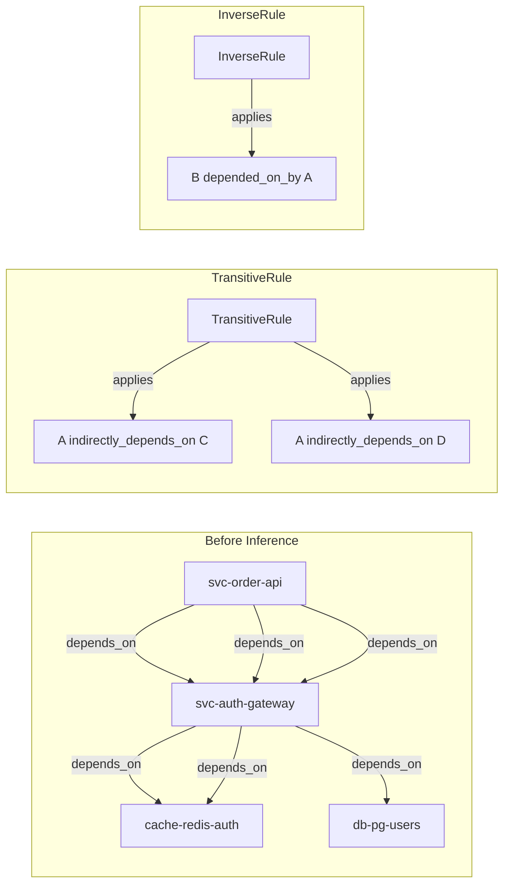
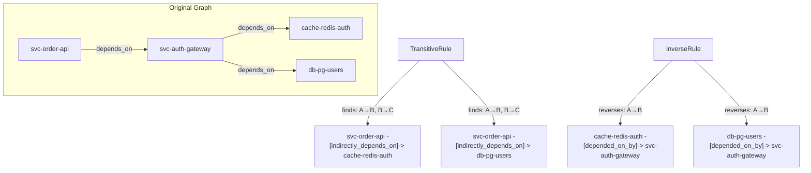
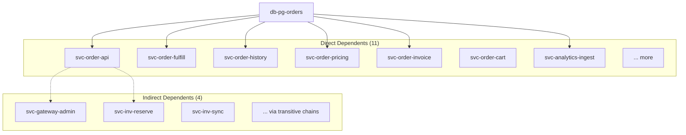
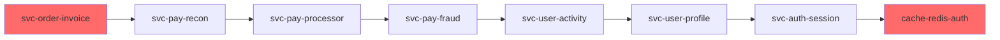

# Microservices Reasoning Showcase

> **Inferring Hidden Service Dependencies with TransitiveRule and InverseRule**

## 1. The Approach

Operations teams typically maintain static dependency maps: "service A depends on database B." But when an infrastructure outage hits, the *transitive* blast radius — all services that indirectly depend on the failed component through 2, 3, or 4 hops — is rarely obvious until it's too late.

**The Visibility Bottleneck:** Traditional monitoring shows immediate dependencies. When Redis auth cache fails, you know `svc-auth-gateway` is affected. But the transitive chain (`svc-user-profile` → `svc-order-api` → `svc-auth-gateway` → `cache-redis-auth`) reveals additional services at risk — hidden until customers start complaining.

**The Hyper3 Approach:** Apply inference rules to the dependency graph. `TransitiveRule` discovers chains: A depends_on B, B depends_on C → A indirectly_depends_on C. `InverseRule` reveals the reverse: A depends_on B → B depended_on_by A. One reasoning call exposes the full blast radius.

## 2. A Simple Analogy

Think of this like a family tree. You know your parents (direct dependencies), but without traversal, you don't know your great-grandparents (transitive dependencies). Inference rules are like genealogical algorithms that fill in: "If A is parent of B, and B is parent of C, then A is great-grandparent of C."

## 3. Key Concepts

| Term | Plain English Meaning |
|------|----------------------|
| **Microservice** | A domain service (e.g., `svc-order-api`, `svc-pay-processor`) |
| **Infrastructure** | Databases, caches, queues, proxies (e.g., `db-pg-orders`, `cache-redis-auth`) |
| **External Service** | Third-party APIs (e.g., `ext-stripe`, `ext-twilio`) |
| **TransitiveRule** | Discovers chains: A→B, B→C means A→C indirectly |
| **InverseRule** | Reverses edges: A depends_on B becomes B depended_on_by A |
| **Blast Radius** | All services affected by an infrastructure failure (direct + indirect) |
| **Betweenness Centrality** | Measures how many shortest paths pass through a node — high = single point of failure |
| **Critical Path** | The longest dependency chain from a service to infrastructure |

## 4. Quick Start

Run the showcase to build an 82-node microservices graph and discover hidden dependencies:

```bash
.venv/bin/python examples/showcase/microservices_reasoning/reasoning_walkthrough.py
```

### What You'll See

The example builds a realistic microservices architecture and runs 9 analysis sections:

```
======================================================================
SECTION 1: Building a Microservices Architecture Graph
======================================================================
  Microservices:      53
  Infrastructure:     17
  External services:  12
  Total nodes:        82
  Total edges created: 236
```

## 5. The Scenario & Topology

The example models a realistic e-commerce microservices architecture with **82 nodes and 236 edges**:

- **11 Service Domains:** auth, payments, orders, users, notifications, search, analytics, inventory, shipping, catalog, platform
- **53 Microservices:** 4-6 services per domain with ports, teams, criticality, language, region
- **17 Infrastructure Nodes:** PostgreSQL, MongoDB, MySQL, Redis, Memcached, Kafka, RabbitMQ, Nginx, Envoy, Consul
- **12 External Services:** Stripe, PayPal, SendGrid, Twilio, Firebase, CloudFront, S3, UPS, FedEx, USPS, Elasticsearch, Datadog

### Microservices Architecture Topology

Figure 1: The architecture with 10 domains, shared infrastructure, and external dependencies.

```mermaid
graph TB
    subgraph "Platform Layer"
        GW["svc-gateway-main<br/>(port 8000, Go)"]
        ADMIN["svc-gateway-admin<br/>(port 8001, Go)"]
        CONFIG["svc-config-server<br/>(port 8888, Java)"]
        FLAGS["svc-feature-flags<br/>(port 8100, Go)"]
        RATE["svc-rate-limiter<br/>(port 8101, Go)"]
    end

    subgraph "Auth Domain"
        AUTH_G["svc-auth-gateway<br/>(port 8443, Go)"]
        AUTH_T["svc-auth-token<br/>(port 8444, Go)"]
        AUTH_S["svc-auth-session<br/>(port 8445, Go)"]
        AUTH_M["svc-auth-mfa<br/>(port 8446, Python)"]
        AUTH_O["svc-auth-oauth<br/>(port 8447, Python)"]
        AUTH_R["svc-auth-rbac<br/>(port 8448, Go)"]
    end

    subgraph "Orders Domain"
        ORD_A["svc-order-api<br/>(port 8601, Java)"]
        ORD_F["svc-order-fulfill<br/>(port 8602, Java)"]
        ORD_H["svc-order-history<br/>(port 8603, Java)"]
        ORD_P["svc-order-pricing<br/>(port 8604, Java)"]
        ORD_I["svc-order-invoice<br/>(port 8605, Java)"]
        ORD_C["svc-order-cart<br/>(port 8606, Java)"]
    end

    subgraph "Payments Domain"
        PAY_P["svc-pay-processor<br/>(port 8501, Java)"]
        PAY_V["svc-pay-validator<br/>(port 8502, Java)"]
        PAY_R["svc-pay-refund<br/>(port 8503, Java)"]
        PAY_F["svc-pay-fraud<br/>(port 8504, Python)"]
        PAY_W["svc-pay-wallet<br/>(port 8505, Java)"]
    end

    subgraph "Shared Infrastructure"
        DB_ORD["db-pg-orders<br/>(PostgreSQL 15)"]
        DB_USR["db-pg-users<br/>(PostgreSQL 15)"]
        DB_PAY["db-pg-payments<br/>(PostgreSQL 15)"]
        CACHE_A["cache-redis-auth<br/>(Redis 7)"]
        CACHE_C["cache-redis-cart<br/>(Redis 7)"]
        CACHE_G["cache-redis-general<br/>(Redis 7)"]
        Q_KAFKA["queue-kafka-orders<br/>(Kafka 3.5)"]
        Q_EVENTS["queue-kafka-events<br/>(Kafka 3.5)"]
    end

    GW --> AUTH_G
    GW --> ORD_A
    GW --> PAY_P

    AUTH_G --> CACHE_A
    AUTH_G --> DB_USR

    ORD_A --> DB_ORD
    ORD_A --> CACHE_C
    ORD_A --> Q_KAFKA

    PAY_P --> DB_PAY
    PAY_P --> CACHE_G
    PAY_P --> Q_EVENTS
```



### Edge Label Taxonomy

| Category | Labels | Meaning |
|----------|---------|---------|
| **Service Dependencies** | `depends_on` | Service → infrastructure relationships |
| **Service-to-Service** | `depends_on` | Inter-service dependencies |
| **Data Access** | `reads_from`, `writes_to` | Database read/write operations |
| **Caching** | `caches_for` | Cache-to-database mappings |
| **Messaging** | `publishes_to`, `subscribes_to` | Kafka/RabbitMQ pub/sub |
| **Routing** | `routes_to` | Proxy routing rules |
| **External** | `depends_on` | Third-party service dependencies |

### Inference Rules Applied

Figure 2: Two rules operate on the graph to discover hidden relationships.



## 6. The Analysis Pipeline (Narrative Walkthrough)

The example walks through 9 sections that demonstrate progressively sophisticated reasoning.

### Phase 1: Building the Microservices Graph

Bulk-create 70 nodes across 3 entity types, then wire them with 291 semantic edges:

```python
# Store microservices with CONCEPTUAL modality
for domain_services in domains.values():
    for name, data in domain_services:
        mem.store(name, data={**data, "type": "microservice"}, modalities={Modality.CONCEPTUAL})

# Create dependency relationships
for src, tgt, label in svc_to_infra + svc_to_svc + reads + writes + ...:
    mem.relate(src, tgt, label=label)
```

**Result:** 82 nodes, 236 edges representing a complete microservices architecture.

### Phase 2: Direct vs Transitive Dependencies

Discover that direct dependencies are just the tip of the iceberg:

```python
direct_dep_map = defaultdict(list)
for le in mem.graph.labeled_edges:
    if le["label"] == "depends_on":
        direct_dep_map[le["target_labels"][0]].append(le["source_labels"][0])

for label in db_labels + queue_labels:
    print(f"{label}: {len(direct_dep_map[label])} direct dependents")
```

**The Discovery:** `db-pg-orders` has 11 direct dependents, and inference reveals 4 additional indirect dependents through 2-3 hop chains.

### Phase 3: Adding Reasoning Rules

Register inference rules to discover hidden relationships:

```python
mem.add_rules(
    TransitiveRule(edge_label="depends_on", new_label="indirectly_depends_on"),
    InverseRule(edge_label="depends_on", inverse_label="depended_on_by"),
)
```

Figure 3: Rules find patterns and create new edges in the graph.



### Phase 4: Running Reasoning on Critical Infrastructure

Apply rules to all 70 nodes to discover the full dependency graph:

```python
result = mem.reason(
    seed_concepts=all_labels,  # All 82 nodes
    max_depth=4,
    max_total_states=300,
)
```

**Result:** 301 states created, 300 rules applied, 300 inference edges produced.

### Phase 5: Blast Radius Analysis

For each database and queue, calculate the full blast radius (direct + indirect):

```python
indirect_reverse = defaultdict(set)
for le in mem.graph.labeled_edges:
    if le["label"] == "indirectly_depends_on":
        indirect_reverse[le["target_labels"][0]].add(le["source_labels"][0])

for label in db_labels + queue_labels:
    direct = set(direct_dep_map.get(label, []))
    transitive = indirect_reverse.get(label, set()) - direct
    total = direct | transitive
    print(f"{label}: {len(direct)} direct, {len(transitive)} indirect, {len(total)} total")
```

Figure 4: Blast radius visualization for `db-pg-orders`.



**Key Insight:** The blast radius can be significantly larger than direct dependencies. `db-pg-orders` directly serves 11 services, and inference reveals 4 additional indirect dependents through transitive chains. For some infrastructure nodes (e.g., `db-mongo-sessions` with 6 direct + 7 indirect), the transitive blast radius more than doubles.

### Phase 6: Single Points of Failure — Betweenness Centrality

Find infrastructure nodes that, if removed, fragment the dependency graph:

```python
bc = mem.betweenness_centrality()
top_spof = top_k(bc, k=15)
```

| Rank | Node | Betweenness | Interpretation |
|------|------|-------------|----------------|
| 1. | `cache-redis-general` | 0.247 | Shared cache — widely depended on across domains |
| 2. | `queue-kafka-events` | 0.128 | Event bus — critical for async processing |
| 3. | `svc-order-fulfill` | 0.104 | Order hub — central to fulfillment flow |
| 4. | `db-pg-orders` | 0.104 | Orders DB — core data store |
| 5. | `svc-order-cart` | 0.093 | Cart service — links to orders and payments |

**Key Insight:** High betweenness centrality means removing this node fragments the graph. `cache-redis-general` has the highest betweenness — it's a shared dependency across multiple service domains.

### Phase 7: Critical Dependency Chains

Find the longest dependency chains — these are the most fragile paths:

```python
def longest_chain(start, visited=None):
    if start in visited:
        return [start]
    visited = visited | {start}
    best = [start]
    for nxt in deps_forward.get(start, []):
        chain = [start] + longest_chain(nxt, visited)
        if len(chain) > len(best):
            best = chain
    return best

chains = [(len(chain), chain) for chain in all_chains if len(chain) > 2]
chains.sort(reverse=True)
```

Figure 5: Longest dependency chain (8+ hops).



**The Discovery:** The longest chain is 8 hops — `svc-order-invoice` → ... → `cache-redis-auth`. This is the most fragile path: a failure at any point cascades to the entire chain.

### Phase 8: Risk Assessment — Infrastructure Failure Scenarios

Simulate infrastructure outages and assess impact:

```python
failure_scenarios = [
    ("db-pg-orders", "PostgreSQL orders DB outage"),
    ("queue-kafka-events", "Kafka events bus outage"),
    ("cache-redis-auth", "Redis auth cache outage"),
    ("db-pg-payments", "PostgreSQL payments DB outage"),
]

for infra_label, scenario in failure_scenarios:
    direct = set(direct_dep_map.get(infra_label, []))
    transitive = indirect_reverse.get(infra_label, set()) - direct
    total = direct | transitive

    critical_count = sum(1 for d in svc_data_map.values() if d.get("criticality", 0) >= 4)
    print(f"Scenario: {scenario}")
    print(f"  Total blast radius: {len(total)} services")
    print(f"  Critical (4-5): {critical_count}")
```

| Scenario | Direct | Indirect | Total | Critical | Teams Affected |
|----------|--------|-----------|-------|----------|----------------|
| PostgreSQL orders DB outage | 11 | 4 | 15 | 9 | analytics, inventory, orders, platform, shipping |
| Kafka events bus outage | 13 | 2 | 15 | 4 | analytics, catalog, inventory, orders, payments, shipping, users |
| Redis auth cache outage | 7 | 6 | 13 | 12 | auth, orders, payments, platform, users |
| PostgreSQL payments DB outage | 6 | 1 | 7 | 5 | orders, payments |

**Key Insight:** The blast radius varies by infrastructure node. For `db-pg-orders`, inference reveals 4 hidden dependents (1.4x the direct count). For `cache-redis-auth`, indirect dependents nearly double the blast radius (1.9x).

### Phase 9: Summary Statistics

```
Nodes:            82
Edges:            536 (236 original + 300 inferred)
Active rules:      2 (TransitiveRule, InverseRule)
```

## 7. Understanding the Output

### Blast Radius Interpretation

| Ratio (Total / Direct) | Meaning |
|------------------------|---------|
| 1.0-1.2 | Mostly direct dependencies — simple architecture |
| 1.2-1.5 | Moderate chaining — some transitive dependencies |
| 1.5+ | Significant transitive chains — hidden dependencies |

### Betweenness Centrality Interpretation

| Centrality Range | Meaning |
|------------------|---------|
| 0.20+ | Critical shared dependency — high risk |
| 0.08-0.20 | Important hub — moderate risk |
| 0.03-0.08 | Moderate connector — lower risk |
| < 0.03 | Peripheral node — minimal risk |

### Critical Path Interpretation

| Chain Length | Meaning |
|--------------|---------|
| 1-3 hops | Short, resilient path |
| 4-6 hops | Moderate fragility |
| 7+ hops | Highly fragile — failure at any point cascades |

## 8. Key Metrics

| Metric | Value |
|--------|-------|
| Graph nodes | 82 |
| Graph edges (initial) | 236 |
| Graph edges (after reasoning) | 536 |
| Microservices | 53 |
| Infrastructure nodes | 17 |
| External services | 12 |
| Inference rules | 2 |
| States created | 301 |
| Rules applied | 300 |
| Inference edges produced | 300 |
| Longest chain | 8 hops |
| Most central node | `cache-redis-general` (betweenness 0.247) |

## 9. What Makes This Different

Traditional monitoring tools show static dependency maps:

```
Service A → depends_on → Database B
Service C → depends_on → Database B
```

When Database B fails, you know A and C are affected. But you don't know that Service D depends on A, Service E depends on D, and Service F depends on E — 4 hops away from the original failure.

**Hyper3's inference approach** discovers the full blast radius:

1. **TransitiveRule** finds chains: A→B, B→C, C→D means A indirectly depends on D
2. **InverseRule** reveals impact: D failed → C affected → B affected → A affected
3. **Betweenness centrality** identifies single points of failure before they break
4. **Longest chain analysis** finds the most fragile paths
5. **Blast radius calculation** quantifies the true impact of infrastructure failures

This matters in incident response: instead of discovering affected services one by one as they fail, inference rules reveal the transitive blast radius so teams can proactively assess impact.

## 10. Code Implementation

Building a microservices reasoning graph in Hyper3 requires minimal boilerplate.

**1. Define Your Service Architecture**

```python
domains = {
    "auth": [
        ("svc-auth-gateway", {"port": 8443, "team": "auth", "criticality": 5}),
        ("svc-auth-token", {"port": 8444, "team": "auth", "criticality": 5}),
        # ...
    ],
    "payments": [
        ("svc-pay-processor", {"port": 8501, "team": "payments", "criticality": 5}),
        # ...
    ],
}
```

**2. Store Nodes with Modalities**

```python
for domain_services in domains.values():
    for name, data in domain_services:
        mem.store(name, data={**data, "type": "microservice"},
                 modalities={Modality.CONCEPTUAL})
```

**3. Create Dependency Relationships**

```python
svc_to_infra = [
    ("svc-auth-gateway", "cache-redis-auth", "depends_on"),
    ("svc-order-api", "db-pg-orders", "depends_on"),
    # ...
]

for src, tgt, label in svc_to_infra:
    mem.relate(src, tgt, label=label)
```

**4. Add Inference Rules and Reason**

```python
mem.add_rules(
    TransitiveRule(edge_label="depends_on", new_label="indirectly_depends_on"),
    InverseRule(edge_label="depends_on", inverse_label="depended_on_by"),
)

result = mem.reason(seed_concepts=all_labels, max_depth=4, max_total_states=300)
```

**5. Analyze Blast Radius**

```python
# Find all indirectly_depends_on edges
indirect = mem.pattern_match(edge_label="indirectly_depends_on")

# Calculate blast radius
for infra in infrastructure_nodes:
    direct = direct_deps.get(infra, [])
    transitive = [e for e in indirect if e["target_labels"][0] == infra]
    print(f"{infra}: {len(direct)} direct, {len(transitive)} indirect")
```

## 11. The Observability Gap (Real-World Integration)

Hyper3 performs rule-based inference once the dependency graph exists. The real-world challenge is building and maintaining that graph:

1. **Service Discovery:** Ingesting service meshes (Istio, Linkerd), consul, or Kubernetes metadata
2. **Dependency Extraction:** Parsing distributed tracing (Jaeger, Zipkin) to find real call chains
3. **Infrastructure Mapping:** Correlating services to their databases, caches, queues
4. **Change Tracking:** Updating the graph as services scale, migrate, or get deprecated
5. **Health Correlation:** Connecting inferred blast radius to real-time health checks

**Theoretical pipeline:**

```
Service Mesh (Istio) / K8s Metadata
        ↓
  [Service Extraction] → nodes with ports, teams, criticality
        ↓
Distributed Traces (Jaeger)
        ↓
  [Dependency Inference] → direct edges (depends_on, calls)
        ↓
  [Infrastructure Mapping] → service-to-DB/cache/queue edges
        ↓
  [Health Monitoring] → real-time node status
        ↓
  [Change Tracking] → update graph on deployments
        ↓
    Hyper3 Graph (ready for reasoning)
        ↓
  [Blast Radius API] → "If DB fails, these 26 services affected"
```

**Current state in Hyper3:** The showcase demonstrates what's possible **once the graph exists**. The pipeline above is **out of scope** for Hyper3 core — it's the observability layer that feeds Hyper3.

**For real-world adoption**, organizations would need to integrate:
- Service mesh telemetry (Istio, Consul, Linkerd)
- Distributed tracing (Jaeger, Zipkin, TempO)
- Infrastructure discovery (Datadog, New Relic, Dynatrace)
- Change management (Spinnaker, ArgoCD, Flux)

Hyper3 provides the **reasoning engine**; the data engineering pipeline that feeds it is a separate concern.

## 12. Reference Taxonomy & API

### Core Concept Glossary

| Term | Semantic Definition |
| ----- | ----- |
| **Microservice** | A domain-scoped service with port, team, criticality |
| **Infrastructure Node** | Database, cache, queue, proxy, service discovery |
| **TransitiveRule** | Discovers A→B→C chains as A→C indirect dependencies |
| **InverseRule** | Reverses edge direction for impact analysis |
| **Blast Radius** | All services affected by an infrastructure failure |
| **Betweenness Centrality** | Measure of how many paths pass through a node |
| **Critical Path** | Longest dependency chain from service to infrastructure |

### Key API Methods

| Method | Purpose |
| ----- | ----- |
| `mem.store(label, data, modalities)` | Create a node with metadata |
| `mem.relate(source, target, label)` | Create a semantic edge |
| `mem.add_rules(*rules)` | Register inference rules |
| `mem.reason(seed_concepts, max_depth)` | Run multiway expansion with rules |
| `mem.betweenness_centrality()` | Compute centrality scores |
| `mem.pattern_match(edge_label)` | Find edges by label |
| `mem.stats()` | Get graph statistics |

### Related Examples

| Example | Focus |
|---------|-------|
| `examples/showcase/threat_intelligence/knowledge_basics.py` | Threat intel graph with pattern matching, centrality |
| `examples/intermediate/06_graph_analytics.py` | Centrality, cycles, components, risk scoring |
| `examples/advanced/13_self_evolving_cognition.py` | Feedback-driven evolution, metamorphosis |
| `examples/domain/infrastructure_self_healing.py` | Self-healing with feedback loops |
| `examples/domain/code_dependency_analysis.py` | Software architecture dependency analysis |
