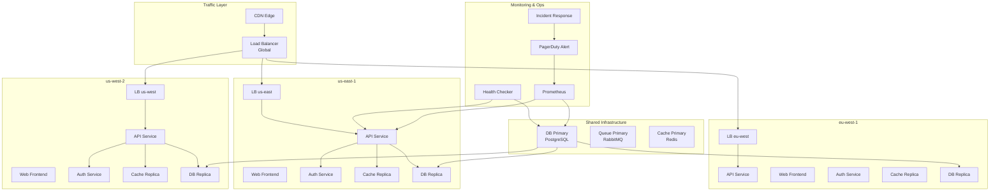
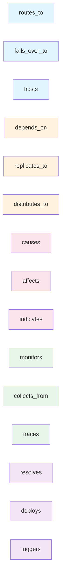
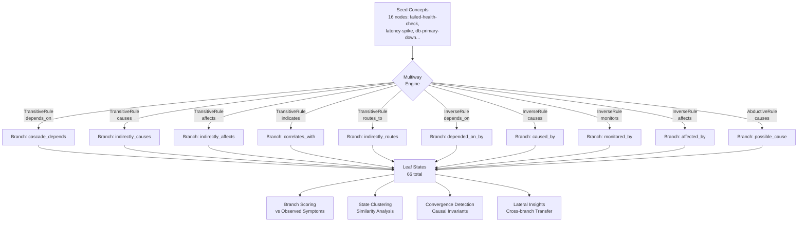
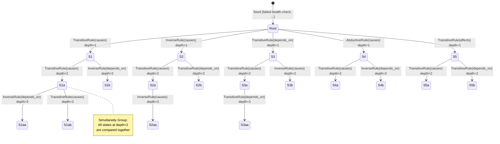
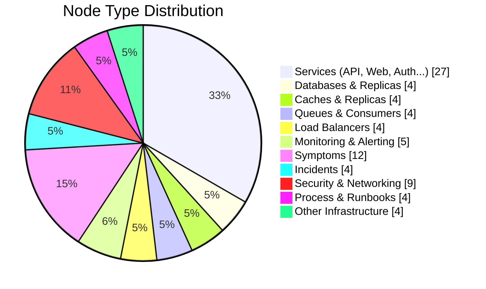
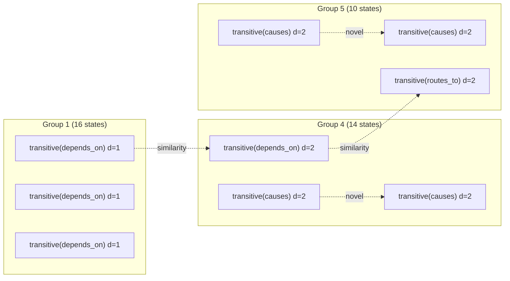
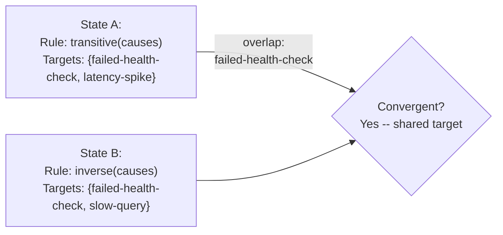
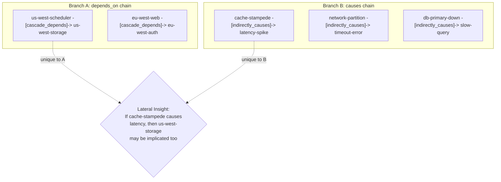

# Multiway Lateral Reasoning Showcase

> **Exploring Alternative Incident Hypotheses with Multiway Expansion**

## The Problem

A cloud infrastructure health check has failed. Multiple root causes are possible: database failure, network partition, bad deployment, or cache stampede.

**Traditional approach**: Pick one hypothesis (e.g., "it's the database") and investigate. If wrong, start over.

**Hyper3's approach**: Explore ALL hypotheses simultaneously through **multiway expansion**, then cross-compare the results to find the best explanation.

## Why This Matters

In critical incidents, time is money. Traditional troubleshooting chases one theory at a time — if you're wrong, you've wasted precious minutes. Hyper3 explores every possibility in parallel, giving you a ranked list of candidates and insights from across all hypotheses in a single pass.

## A Simple Analogy

Think of this like a doctor who simultaneously explores multiple possible diagnoses (flu, infection, allergy) rather than chasing one theory at a time. Each "branch" of reasoning represents a different diagnosis, and Hyper3 compares them to find which best explains the symptoms.

## Key Concepts

| Term | Plain English Meaning |
|------|----------------------|
| **Multiway Expansion** | Exploring multiple "what if" scenarios at the same time |
| **State** | One possible version of the truth (e.g., "what if the database is down") |
| **Branch** | A chain of reasoning from seed → conclusion |
| **Leaf State** | A final conclusion after applying rules |
| **Convergence** | When different paths lead to the same conclusion |
| **Simultaneity Group** | Hypotheses at the same "depth" that can be compared directly |
| **Lateral Insights** | Knowledge from one branch that applies to another |

## Quick Start

```bash
.venv/bin/python examples/showcase/multiway_reasoning/01_multiway_lateral_insights.py
```

## What You'll See

When you run the example, you'll see output like this:

```
======================================================================
SECTION 1: Cloud Infrastructure Graph
======================================================================
  Nodes: 81
  Edges: 203

======================================================================
SECTION 2: Multiway Expansion from Failed Health Check
======================================================================
  States created:    51
  Rules applied:     50
  New edges:         50
  New nodes:         0
  Max depth:         3
  Branches (leaves): 66
```

This tells you the engine explored 66 different hypothesis branches from a single failed health check.

## Scenario

The example models a realistic multi-region cloud infrastructure with:
- 3 geographic regions (us-east, us-west, eu-west)
- Shared databases, caches, and queues
- Monitoring and alerting systems
- A failed health check as the trigger event

### System Topology

Figure 1: The infrastructure we're analyzing — three regions with shared databases.



### Edge Label Taxonomy

Figure 2: How relationships are labeled in the graph.



| Category | Labels | Meaning |
|----------|---------|---------|
| **Routing** | `routes_to`, `fails_over_to`, `hosts`, `serves` | Network traffic flow |
| **Dependency** | `depends_on`, `replicates_to`, `distributes_to` | Service reliance |
| **Causality** | `causes`, `affects`, `indicates` | Cause-effect relationships |
| **Observation** | `monitors`, `collects_from`, `traces` | Telemetry links |
| **Resolution** | `resolves`, `deploys`, `triggers` | Remediation pathways |
| **Security** | `protects`, `secures`, `authenticates` | Security boundaries |

## How the Reasoning Engine Works

### Multiway Expansion

Figure 3: The engine takes seed concepts and applies multiple inference rules simultaneously, creating a branching tree of hypotheses.



Each application of a rule creates a new **state** in a directed acyclic graph (DAG). States at the same depth that share active nodes form **simultaneity groups** — these are hypotheses that can be compared directly.

Figure 4: States at the same depth form groups that can be directly compared.



### The 10 Inference Rules

Ten inference rules operate simultaneously on the graph:

| Rule | Edge Pattern | Produces | Purpose |
|------|-------------|----------|---------|
| `TransitiveRule(causes)` | A-[causes]->B, B-[causes]->C | A-[indirectly_causes]->C | Chain cause-effect |
| `TransitiveRule(depends_on)` | A-[depends_on]->B, B-[depends_on]->C | A-[cascade_depends]->C | Dependency chains |
| `TransitiveRule(affects)` | A-[affects]->B, B-[causes]->C | A-[indirectly_affects]->C | Impact propagation |
| `TransitiveRule(indicates)` | A-[indicates]->B, B-[indicates]->C | A-[correlates_with]->C | Symptom correlation |
| `TransitiveRule(routes_to)` | A-[routes_to]->B, B-[routes_to]->C | A-[indirectly_routes]->C | Network path tracing |
| `InverseRule(causes)` | A-[causes]->B | B-[caused_by]->A | Reverse causality |
| `InverseRule(depends_on)` | A-[depends_on]->B | B-[depended_on_by]->A | Reverse dependency |
| `InverseRule(monitors)` | A-[monitors]->B | B-[monitored_by]->A | Reverse telemetry |
| `InverseRule(affects)` | A-[affects]->B | B-[affected_by]->A | Reverse impact |
| `AbductiveRule(causes)` | A-[causes]->B (B observed) | B-[possible_cause]->A | Diagnostic inference |

## The Analysis Pipeline

### Phase 1: Graph Construction

The example builds an **81-node, 203-edge** hypergraph representing the infrastructure topology. Each node carries typed metadata (type, tier, category, severity). Edges are labeled with semantic relationship types.



### Phase 2: Multiway Expansion

From 16 seed concepts (the failed health check and related symptoms), the engine applies all 10 rules simultaneously, creating a branching structure:

```
                     ┌── transitive(causes)      ──> indirectly_causes chains
                     ├── transitive(depends_on)  ──> cascade_depends chains
                     ├── transitive(affects)     ──> indirectly_affects chains
Seed (16 nodes) ────├── transitive(indicates)   ──> correlates_with chains
                     ├── transitive(routes_to)   ──> indirectly_routes chains
                     ├── inverse(causes)         ──> caused_by reverse edges
                     ├── inverse(depends_on)     ──> depended_on_by reverse
                     ├── inverse(monitors)       ──> monitored_by reverse
                     ├── inverse(affects)        ──> affected_by reverse
                     └── abductive(causes)       ──> possible_cause diagnosis
```

**Result**: 51 states created, 50 rules applied, 50 inference edges produced, 66 leaf states.

### Phase 3: Branch Scoring

Each leaf state is scored against the **8 observed symptoms** using a composite metric:

```
score = (edge_hits + symptom_overlap) / (total_symptoms + produced_edges + 1)
```

This measures how well a branch explains the observed symptoms. Higher scores mean the branch's inferred edges and active nodes better cover the symptom set.

**Top-scoring branches** typically involve `transitive(causes)` rules that chain through the causal graph, connecting root causes (db-primary-down, network-partition, cache-stampede) to observed symptoms (failed-health-check, latency-spike, etc.).

### Phase 4: State Clustering

Figure 5: States are grouped by depth into simultaneity groups for comparison.



States are mapped into a coordinate space using multidimensional scaling. The engine identifies **simultaneity groups** — sets of states at the same depth that represent competing hypotheses.

### Phase 5: Convergence Detection

Figure 6: When different rules reach the same conclusion, that's a convergent insight.



The engine detects when **different rules reach overlapping conclusions** — this is a causal invariant. Two states that applied different rules but produced edges targeting the same nodes represent convergent reasoning paths.

**Result**: 20 causal invariants found and merged.

### Phase 6: Lateral Insights

Figure 7: Comparing branches within the same group reveals unique knowledge.



The most powerful feature: comparing branches within the same simultaneity group to find **novel knowledge** — nodes or edges present in one branch but absent in another.

## Understanding the Output

### Branch Score Interpretation

| Score Range | Meaning |
|------------|---------|
| 0.9+ | Branch explains most symptoms — strong candidate root cause |
| 0.7-0.9 | Branch explains a subset of symptoms — partial match |
| 0.5-0.7 | Branch touches some symptoms — weak signal |
| < 0.5 | Branch largely irrelevant to observed symptoms |

### Simultaneity Groups

States in the same simultaneity group are **at the same depth** in the multiway DAG and can be directly compared. The group number indicates which "wave" of reasoning the states belong to.

### Lateral Insight Types

| Type | Description | Example |
|------|-------------|---------|
| **Novel in source** | Nodes/edges in the reference branch not in the comparison | A dependency chain unique to one hypothesis |
| **Novel in lateral** | Nodes/edges in the comparison branch not in the reference | A causal link unique to another hypothesis |
| **Complementary** | Different branches that together cover more symptoms | One branch explains DB issues, another explains network |

## What Makes This Different

Traditional diagnostic systems follow a **single path**: pick the most likely hypothesis, pursue it, backtrack if wrong. Hyper3's multiway engine explores **all hypotheses in parallel** through a branching state space, then uses structural comparison to identify:

1. **Which branches best explain the evidence** (branch scoring)
2. **Which branches converge on the same conclusions** (causal invariants)
3. **What knowledge from one branch applies to another** (lateral insights)

This is particularly valuable in incident response where the root cause is unknown and time is critical — instead of chasing one hypothesis while the incident worsens, you get a ranked set of candidates with cross-hypothesis insights.

## Key Metrics

| Metric | Value |
|--------|-------|
| Graph nodes | 81 |
| Graph edges (initial) | 203 |
| Graph edges (after reasoning) | 253 |
| Seed concepts | 16 |
| Inference rules | 10 |
| States created | 51 |
| Rules applied | 50 |
| Inference edges produced | 50 |
| Leaf states | 66 |
| Simultaneity groups | 5 |
| Causal invariants merged | 20 |
| Lateral insights discovered | 6 |
| Best branch score | 0.909 |

## Code Walkthrough

### 1. Infrastructure Construction

```python
mem = HypergraphMemory(evolve_interval=0)
build_infrastructure(mem)  # 81 nodes, 203 edges
```

The `build_infrastructure()` function creates the full topology: 3 regions, each with API, web, auth, cache, worker, scheduler, storage, and k8s nodes, plus shared databases, queues, caches, load balancers, and monitoring infrastructure.

### 2. Register Inference Rules

```python
rules = [
    TransitiveRule(edge_label="depends_on", new_label="cascade_depends"),
    TransitiveRule(edge_label="causes", new_label="indirectly_causes"),
    TransitiveRule(edge_label="affects", new_label="indirectly_affects"),
    TransitiveRule(edge_label="indicates", new_label="correlates_with"),
    TransitiveRule(edge_label="routes_to", new_label="indirectly_routes"),
    InverseRule(edge_label="depends_on", inverse_label="depended_on_by"),
    InverseRule(edge_label="causes", inverse_label="caused_by"),
    InverseRule(edge_label="monitors", inverse_label="monitored_by"),
    InverseRule(edge_label="affects", inverse_label="affected_by"),
    AbductiveRule(effect_label="causes", cause_label="possible_cause"),
]
mem.add_rules(*rules)
```

### 3. Seed and Reason

```python
seed = {
    "failed-health-check", "latency-spike", "error-rate-spike",
    "connection-refused", "timeout-error", "slow-query",
    "db-primary-down", "network-partition", "bad-deploy",
    "us-east-api", "us-east-auth", "us-east-cache",
    "db-replica-us-east", "cache-replica-us-east",
    "lb-us-east", "lb-global",
}
result = mem.reason(seed_concepts=seed, max_depth=3, max_total_states=50)
```

### 4. Score Branches

```python
symptom_ids = {node.id for node in symptom_nodes}
leaves = mw_graph.get_leaves()
for leaf in leaves:
    score = score_branch_against_symptoms(mem, leaf, symptom_ids)
```

### 5. Analyze Clustering and Convergence

```python
clustering_report = result.clustering
convergence_report = result.state_convergence
groups = mem.state_clustering.simultaneity_groups
```

### 6. Extract Lateral Insights

```python
for concept in ["failed-health-check", "db-primary-down", "network-partition", "bad-deploy"]:
    insights = mem.lateral_insights(concept)
```

## Related Examples

| Example | Focus |
|---------|-------|
| `examples/advanced/13_self_evolving_cognition.py` | Feedback-driven evolution, metamorphosis validation |
| `examples/advanced/12_adaptive_learning.py` | Rule effectiveness learning, Thompson sampling |
| `examples/domain/infrastructure_self_healing.py` | Multiway reasoning + feedback loop integration |
| `examples/domain/medical_diagnosis.py` | Backward chaining for differential diagnosis |
| `examples/domain/fraud_detection_intelligence.py` | Cycle detection, funnel account identification |

## API Reference

| Method | Purpose |
|--------|---------|
| `mem.reason(seed_concepts, max_depth, max_total_states)` | Run multiway expansion from seed nodes |
| `mem.lateral_insights(concept)` | Find knowledge transferable across branches |
| `mem.state_clustering.simultaneity_groups` | Get groups of states at the same depth |
| `mem.state_clustering.coordinates` | Get state coordinate embeddings |
| `result.clustering` | State clustering report from reasoning |
| `result.state_convergence` | Merge report from state convergence |
| `result.expansion` | Expansion statistics (states, rules, edges) |
