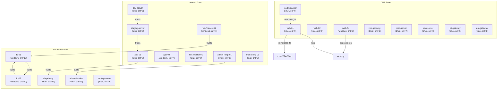

# Network Attack Surface Analysis Showcase

> **Graph Analytics on a 129-Node Enterprise Network: Centrality, Cycles, Segmentation, Composite Risk Scoring, Trust Inference, Community Detection, and Anomaly Detection**

## 1. The Approach

Networks have implicit structure that isn't visible from scanning individual hosts. A firewall rule allows traffic from DMZ to internal. A trust relationship lets a workstation authenticate to a domain controller. A routing table entry bridges two segments. Each connection is individually unremarkable, but together they form paths an attacker can follow from entry point to critical asset.

**The Silo Problem:** Security tools categorize assets by zone (DMZ, internal, restricted) and scan each zone independently. This misses cross-zone trust chains, routing paths that skip zones, and the compound risk of a highly-connected host with known vulnerabilities.

**The Graph Analytics Approach:** Model the entire network as a single hypergraph. Hosts, segments, services, controls, vulnerabilities, and users are all nodes. Relationships between them (connects_to, runs, trusts, routes_to, vulnerable_to, protected_by) are labeled edges. Centrality algorithms reveal which assets are most exposed. Betweenness identifies chokepoints. Connected components verify segmentation. Cycle detection finds circular trust. A composite risk score combines all of these signals into a single priority ranking. Transitive rule inference discovers indirect trust chains that are not explicitly documented. Community detection identifies network segments that span zone boundaries. Structural anomaly detection flags hosts with unusual connectivity patterns.

## 2. A Simple Analogy

Imagine a building with three security zones: a lobby (DMZ), office floors (internal), and a vault (restricted). Each door, badge reader, and intercom is a connection. Scanning each room individually tells you what's inside, but not how someone could walk from the lobby to the vault. Graph analytics draws the complete floor plan and highlights every path from the front door to the gold — including hidden corridors (inferred trust) and rooms that sit between multiple zones (community mixing).

## 3. Key Concepts

| Term | Meaning |
|------|---------|
| **Degree centrality** | Fraction of nodes a host is directly connected to — measures surface area / exposure |
| **Betweenness centrality** | How often a node appears on shortest paths between other nodes — measures chokepoint importance |
| **Cycle detection** | Finding loops in the graph — circular trust or circular dependency chains |
| **Cross-zone violation** | A trust or routing edge that jumps across security zones (e.g., internal trusting restricted) |
| **Composite risk score** | Weighted combination of vulnerability count, centrality, criticality, and patch level |
| **Connected components** | Isolated subgraphs — each component is a separately reachable network region |
| **Lateral movement path** | A shortest path from a low-trust host (DMZ) to a high-value target (restricted zone) |
| **Transitive inference** | Deriving indirect trust relationships from chains of direct trust edges (A trusts B, B trusts C implies A indirectly trusts C) |
| **Community detection** | Grouping nodes into clusters based on connection density — reveals natural network segments |
| **Modularity** | Measure of how well a community partition separates dense subgroups (range 0-1, higher = clearer separation) |
| **Structural anomaly** | A host whose connectivity pattern deviates significantly from typical nodes (cycles, unusually high centrality, contradictory labels) |

## 4. Quick Start

```bash
.venv/bin/python examples/showcase/network_analytics/graph_analytics.py
```

### Expected Output

```
======================================================================
SECTION 1: Building Enterprise Network Topology
======================================================================
  Hosts:             45
  Network segments:  22
  Security controls: 16
  Services:          18
  Vulnerabilities:   16
  Users/roles:       12
  Total nodes:       129
  Total edges:       356

======================================================================
SUMMARY
======================================================================
  Network: 129 nodes, 375 edges
  Connected components: 8
  Total cycles detected: 15
  Cross-zone violations: 18
  Most exposed host:     dc-01                     (degree=0.1875)
  Top chokepoint:        dc-01                     (betweenness=0.0108)
  Highest risk host:     web-04                    (risk=62.4)
  Segmentation:          ISOLATED
```

## 5. The Scenario

The example models an enterprise network with **129 nodes and 356 edges** across six entity types:

- **45 Hosts:** Web servers, app servers, databases, workstations, domain controllers, Kubernetes nodes, IoT gateway, CI runners
- **22 Network Segments:** DMZ subnets, internal ranges, restricted zones, VPN pool, wireless, IoT, Kubernetes pod network
- **16 Security Controls:** Firewalls, IDS/IPS, WAF, SIEM, DLP, EDR, NAC, secrets manager
- **18 Services:** SSH, HTTP(S), RDP, SMB, LDAP, MySQL, PostgreSQL, Redis, DNS, SMTP, FTP, Kerberos, WinRM, Kubernetes API, Prometheus, MQTT
- **16 Vulnerabilities:** CVEs with CVSS scores 3.7-9.8, some with known exploits
- **12 Users/Roles:** Root admin, network admin, security admin, DBA, developers, finance users, HR users, executives, contractors, service accounts

Each host carries metadata: OS, zone assignment, criticality rating (1-10), and patch level (0.0-1.0).

### Network Topology

Figure 1: The enterprise network spans three security zones connected through routing and trust edges.



### Edge Label Taxonomy

| Category | Labels | Meaning |
|----------|--------|---------|
| **Topology** | `connects_to` | Host assigned to a network segment |
| **Services** | `runs`, `exposed_on` | Service running on a host; service exposed externally |
| **Vulnerability** | `vulnerable_to` | Host affected by a CVE |
| **Defense** | `protected_by` | Host covered by a security control |
| **Trust** | `trusts`, `trusts_indirectly` | Direct authentication relationship; inferred transitive trust |
| **Access** | `has_access` | User account with access to a host |
| **Routing** | `routes_to` | Network segment routing rule |

## 6. Analysis Pipeline

The example walks through 12 sections, each applying a different graph algorithm.

### Section 1: Building the Topology

Six builder functions create 45 hosts, 22 segments, 16 controls, 18 services, 16 vulnerabilities, and 12 users. Edge construction wires 356 relationships across seven edge labels.

**Result:** 129 nodes, 356 edges.

### Section 2: Degree Centrality — Most Exposed Assets

Degree centrality counts the fraction of total nodes each host connects to. A high degree means the host touches many entities (services, segments, vulnerabilities, controls, trust targets), making it a large attack surface.

```python
degree = mem.analyze.centrality("degree", )
host_degree = {lbl: score for lbl, score in degree.items() if lbl in set(hosts)}
top_exposed = top_k(host_degree, k=10)
```

**Results:** `dc-01` has the highest degree centrality at 0.1875 — it connects to 4 services, 2 trust targets, 1 segment, and is trusted by 9 workstations and 1 bastion host. The next highest are `dc-02` (0.1016) and `db-primary` (0.0859).

| Host | Degree | Zone | Criticality |
|------|--------|------|-------------|
| dc-01 | 0.1875 | restricted | 10 |
| dc-02 | 0.1016 | restricted | 10 |
| db-primary | 0.0859 | restricted | 10 |
| dev-server | 0.0859 | internal | 5 |
| web-01 | 0.0781 | dmz | 9 |

**Why this matters:** `dev-server` (criticality 5, patch level 0.50) has the same degree as `db-primary` (criticality 10, patch level 0.95). Degree alone doesn't capture risk — the composite scoring in Section 8 factors in criticality and patch level.

### Section 3: Betweenness Centrality — Critical Chokepoints

Betweenness centrality measures how often a node appears on shortest paths between other node pairs. High betweenness means traffic (or an attacker) must pass through this node.

```python
betweenness = mem.analyze.centrality("betweenness", )
top_choke = top_k(betweenness, k=10)
```

**Results:** The top chokepoints are network segments, not hosts. `seg-internal-1` (0.0244) and `seg-restricted-1` (0.0127) sit between more zones than any individual host.

The top 5 host chokepoints:

| Rank | Host | Betweenness | Zone | Criticality |
|------|------|-------------|------|-------------|
| 1 | dc-01 | 0.0108 | restricted | 10 |
| 2 | staging-server | 0.0091 | internal | 6 |
| 3 | app-01 | 0.0089 | internal | 8 |
| 4 | dev-server | 0.0077 | internal | 5 |
| 5 | dc-02 | 0.0025 | restricted | 10 |

**Why this matters:** `staging-server` has the second-highest betweenness among hosts despite having criticality 6. It bridges the dev/CI chain to the production database through its trust relationship with `app-01`. Compromising `staging-server` puts an attacker one hop from `app-01`, which trusts `db-primary`.

### Section 4: Connected Components — Segmentation Verification

Connected components identify isolated network regions. Proper segmentation should produce separate components for each zone.

```python
components = mem.analyze.components()
```

**Results:** 8 connected components.

| Component | Size | Zone Breakdown |
|-----------|------|----------------|
| 1 | 122 nodes | dmz:18, internal:33, restricted:15, unknown:56 |
| 2-8 | 1 node each | Isolated entities |

The main component contains 122 nodes spanning all three zones. The remaining 7 components are single isolated nodes (controls or users with no access edges). The network reports as ISOLATED because there is more than one component, but the dominant component (122 of 129 nodes) shows that DMZ, internal, and restricted zones are connected through routing and trust edges.

### Section 5: Cycle Detection — Circular Trust Relationships

Cycles in the graph represent circular dependencies or circular trust. A trust cycle `A trusts B trusts A` means compromising either host grants access to the other.

```python
cycles = mem.detect_cycles(max_cycles=15)
```

**Results:** 15 cycles detected. None are pure trust cycles — the cycles traverse mixed edge types (connects_to, runs, trusts, routes_to). The bidirectional trust between `dc-01` and `dc-02` forms a 2-node loop, but cycle detection finds longer cycles through mixed-edge paths.

### Section 6: Cross-Zone Violations — Segmentation Policy Breaches

Cross-zone violations are trust or routing edges that jump from a lower-trust zone to a higher-trust zone. The check uses a zone ranking (dmz=0, internal=1, restricted=2) and flags edges where the target zone rank exceeds the source by 2 or more (for routes) or is strictly higher (for trusts).

**Results:** 18 cross-zone violations, all trust violations:

| Source | Source Zone | Target | Target Zone | Type |
|--------|-------------|--------|-------------|------|
| admin-jump-01 | internal | admin-bastion | restricted | trusts |
| ws-finance-01 | internal | dc-01 | restricted | trusts |
| ws-finance-02 | internal | dc-01 | restricted | trusts |
| ws-finance-03 | internal | dc-01 | restricted | trusts |
| ws-hr-01 | internal | dc-01 | restricted | trusts |
| ws-hr-02 | internal | dc-01 | restricted | trusts |
| ws-engineering-01 | internal | dc-01 | restricted | trusts |
| ws-engineering-02 | internal | dc-01 | restricted | trusts |
| ws-engineering-03 | internal | dc-01 | restricted | trusts |
| app-04 | internal | dc-01 | restricted | trusts |

9 of the 18 violations are internal workstations trusting `dc-01` (domain controller). This is expected in an Active Directory environment — domain-joined machines must trust the DC — but it also means any compromised workstation can authenticate to the restricted zone.

### Section 7: Degree Distribution

The degree distribution shows how many nodes have each degree value.

**Results:** The distribution is roughly bell-shaped around degree 2-3, with a long tail extending to degree 26 (dc-01). 7 nodes have degree 0 (isolated). Average degree is 5.5.

| Degree | Nodes |
|--------|-------|
| 0 | 7 |
| 1 | 8 |
| 2-3 | 22 each |
| 4-8 | 7-10 each |
| 9 | 11 |
| 10+ | 15 (long tail to 26) |

### Section 8: Composite Risk Scoring

The composite risk score combines multiple signals into a single priority metric:

```python
score = vuln_count * 10 + degree_centrality * 50 + betweenness * 80
        + criticality * 3 + (1.0 - patch_level) * 15
```

| Factor | Weight | What it captures |
|--------|--------|------------------|
| Vulnerability count | 10 per vuln | Known attack surface |
| Degree centrality | 50x | Connection exposure |
| Betweenness centrality | 80x | Chokepoint importance |
| Criticality | 3 per point | Business impact |
| Patch deficit | 15x (1 - patch_level) | Unpatched exposure |

**Results (top 15):**

| Host | Risk | Vulns | Degree | Betweenness | Zone |
|------|------|-------|--------|-------------|------|
| web-04 | 62.4 | 3 | 0.0781 | 0.0000 | dmz |
| ws-finance-01 | 60.6 | 3 | 0.0703 | 0.0006 | internal |
| ws-finance-03 | 58.2 | 3 | 0.0547 | 0.0000 | internal |
| iot-gateway | 57.5 | 3 | 0.0703 | 0.0000 | dmz |
| web-02 | 55.4 | 2 | 0.0781 | 0.0000 | dmz |
| web-01 | 53.9 | 2 | 0.0781 | 0.0000 | dmz |
| api-gateway | 51.3 | 2 | 0.0703 | 0.0000 | dmz |
| dc-01 | 51.0 | 1 | 0.1875 | 0.0108 | restricted |
| app-04 | 51.0 | 2 | 0.0781 | 0.0009 | internal |
| ws-hr-01 | 49.1 | 2 | 0.0547 | 0.0009 | internal |
| staging-server | 49.0 | 2 | 0.0703 | 0.0091 | internal |
| nas-01 | 48.6 | 2 | 0.0625 | 0.0003 | internal |
| ws-finance-02 | 48.3 | 2 | 0.0547 | 0.0005 | internal |
| ci-runner-01 | 47.6 | 2 | 0.0703 | 0.0007 | internal |
| dc-02 | 46.2 | 1 | 0.1016 | 0.0025 | restricted |

**Why composite scoring matters:** `dc-01` has the highest degree (0.1875) and highest betweenness (0.0108) of any host, but only 1 vulnerability and patch level 0.95 — so its composite risk is 51.0. `web-04` has lower centrality but 3 vulnerabilities and patch level 0.50, giving it the highest risk score at 62.4. A degree-only or vulnerability-only ranking would miss this inversion.

### Section 9: Attack Path Highlights

**Highest-risk DMZ hosts** (attacker entry points):

| Host | Risk | Vulnerabilities |
|------|------|----------------|
| web-04 | 62.4 | 3 |
| iot-gateway | 57.5 | 3 |
| web-02 | 55.4 | 2 |
| web-01 | 53.9 | 2 |
| api-gateway | 51.3 | 2 |

**Lateral movement paths** (shortest paths from lower-trust hosts to restricted targets):

| Path | Zone Traversal |
|------|---------------|
| staging-server -> app-01 -> db-primary | internal -> internal -> restricted |
| admin-jump-01 -> admin-bastion | internal -> restricted |
| admin-jump-01 -> admin-bastion -> dc-01 | internal -> restricted -> restricted |
| dev-server -> staging-server -> app-01 -> db-primary | internal -> internal -> internal -> restricted |
| ws-exec-01 -> dc-01 | restricted -> restricted |

The longest path (dev-server to db-primary) traverses 4 hops through the CI/CD chain: `dev-server` trusts `staging-server`, which trusts `app-01`, which trusts `db-primary`. An attacker who compromises a developer machine can reach the production database through three trust hops.

### Section 10: Trust Chain Inference with TransitiveRule

The 18 direct trust violations in Section 6 are only the explicitly documented relationships. A `TransitiveRule` applied to the `trusts` label infers indirect trust chains: if A trusts B and B trusts C, then A indirectly trusts C.

```python
mem.add_rules(TransitiveRule(edge_label="trusts", new_label="trusts_indirectly"))
reason_result = mem.reason(
    seeds={"admin-jump-01", "dev-server", "dc-01", "vpn-gateway"},
    depth=4,
)
```

**Results:** The reasoning expansion produced **19 inferred indirect trust edges**. These edges are labeled `trusts_indirectly` to distinguish them from direct trust.

Notable inferred chains:

| Inferred Edge | Chain |
|--------------|-------|
| admin-jump-01 -> dc-01 | admin-jump-01 trusts admin-bastion trusts dc-01 |
| admin-jump-01 -> dc-02 | admin-jump-01 trusts admin-bastion trusts dc-01 trusts dc-02 |
| dev-server -> app-01 | dev-server trusts staging-server trusts app-01 |
| staging-server -> db-primary | staging-server trusts app-01 trusts db-primary |
| staging-server -> db-replica | staging-server trusts app-01 trusts db-replica |
| ci-runner-01 -> staging-server | ci-runner-01 trusts dev-server trusts staging-server |

**6 restricted-zone hosts** are reachable via indirect trust: `db-primary`, `db-replica`, `dc-01`, `dc-02`, `ws-exec-01`, and `ws-exec-02`.

**Why this matters:** The direct trust analysis in Section 6 shows 18 violations — workstations and servers directly trusting restricted-zone hosts. The transitive inference reveals that the blast radius is wider: `admin-jump-01` indirectly trusts both domain controllers through a two-hop chain (`admin-jump-01` -> `admin-bastion` -> `dc-01` -> `dc-02`). A compromise of `admin-jump-01` gives indirect access not just to `admin-bastion` (direct trust) but to `dc-01` and `dc-02` through the inferred chain. Without transitive inference, these multi-hop escalation paths remain invisible.

### Section 11: Network Segment Detection with Community Detection

Community detection groups nodes into clusters based on connection density, independent of the explicit zone labels. This reveals whether the actual network topology matches the intended zone architecture.

```python
comm_result = mem.analyze.communities(seed=42)
```

**Results:** **11 communities** detected with modularity 0.3412 and coverage 0.8790.

| Community | Size | Host Zones | Description |
|-----------|------|------------|-------------|
| 33 | 79 | internal:19, restricted:10 | Large mixed community spanning internal and restricted |
| 85 | 32 | dmz:11 | DMZ-facing hosts and associated services |
| 99 | 6 | internal:2 | Monitoring cluster (monitoring-01, log-collector, SIEM) |
| 43 | 5 | internal:3 | Kubernetes cluster (master + 2 workers) |
| 52-82 | 1 each | non-host | Isolated entities (seg-wireless, security controls) |

**4 zone-mixing communities** contain hosts from multiple security zones:

| Community | Zone Breakdown |
|-----------|---------------|
| Community 33 | internal(19), restricted(10) |
| Community 85 | dmz(11) |
| Community 99 | internal(2) |
| Community 43 | internal(3) |

The most significant finding is Community 33, which contains 19 internal hosts and 10 restricted hosts in a single cluster. This confirms what the connected components analysis showed: internal and restricted zones are tightly coupled through trust and routing edges. The DMZ (Community 85) forms a separate cluster, but its 11 DMZ hosts are still connected to the main component through routing edges.

**Why this matters:** Zone labels on paper do not guarantee zone isolation in practice. The community detection algorithm has no knowledge of zone assignments — it clusters purely by connection density. The fact that Community 33 naturally groups 19 internal and 10 restricted hosts together means the actual traffic patterns and trust relationships create a unified cluster that ignores the internal/restricted boundary. This is a stronger signal than the connected components check in Section 4 because it accounts for connection density, not just reachability.

### Section 12: Structural Anomaly Detection on Critical Hosts

Structural anomaly detection examines a host's connectivity pattern — cycles, centrality, label consistency, and neighbor structure — to classify it as `low_risk`, `boundary`, or `anomalous`.

```python
result = mem.analyze.anomalies("dc-01")
```

**Results for 6 critical hosts:**

| Host | Status | Boundary Score | Insights |
|------|--------|---------------|----------|
| dc-01 | anomalous | 0.389 | Cyclic dependency structure identified |
| db-primary | low_risk | 0.135 | (none) |
| admin-jump-01 | low_risk | 0.133 | (none) |
| admin-bastion | low_risk | 0.129 | (none) |
| web-04 | low_risk | 0.012 | (none) |
| iot-gateway | low_risk | 0.011 | (none) |

Only `dc-01` is flagged as `anomalous` with a boundary score of 0.389. The anomaly stems from its cyclic dependency: `dc-01` trusts `dc-02` and `dc-02` trusts `dc-01`, forming a bidirectional trust loop. Combined with its high degree centrality (0.1875) and high betweenness (0.0108), the structural pattern deviates from typical hosts.

The remaining 5 hosts are classified as `low_risk`. `db-primary` and `admin-bastion` have scores around 0.13, reflecting their high criticality and connectivity but no structural anomalies. `web-04` and `iot-gateway` score near 0.01 — they are well-connected DMZ hosts but structurally unremarkable.

**Why this matters:** `dc-01` is the only host that triggers the anomalous classification. The bidirectional trust between `dc-01` and `dc-02` is architecturally correct for domain controller replication, but from a security analysis perspective it creates a cycle that amplifies compromise impact: taking either DC gives access to the other. The anomaly detection surfaces this without requiring a manual review of every trust edge. The other critical hosts (`db-primary` at criticality 10, `admin-bastion` at criticality 10) do not trigger anomalies, confirming that the detection distinguishes between high connectivity (normal for critical assets) and structurally unusual patterns.

## 7. Understanding Output

### Risk Score Interpretation

| Score Range | Severity |
|-------------|----------|
| 55+ | Critical — immediate patching or isolation needed |
| 48-55 | High — prioritize in next patch cycle |
| 40-48 | Medium — monitor, schedule remediation |
| < 40 | Low — standard maintenance |

### Degree Centrality Ranges

| Range | Meaning |
|-------|---------|
| 0.15+ | Hub — connects to many entities, high exposure |
| 0.07-0.15 | Well-connected — multiple services or trust targets |
| 0.03-0.07 | Moderate — typical workstation or secondary server |
| < 0.03 | Peripheral — limited connections |

### Betweenness Centrality Ranges

| Range | Meaning |
|-------|---------|
| 0.008+ | Critical chokepoint — appears on many shortest paths |
| 0.003-0.008 | Secondary bridge — important for specific paths |
| < 0.003 | Terminal node — rarely on shortest paths |

### Anomaly Status Interpretation

| Status | Boundary Score | Meaning |
|--------|---------------|---------|
| anomalous | 0.3+ | Structural pattern deviates significantly — cycles, unusual centrality, or contradictory labels |
| boundary | 0.15-0.3 | Approaching anomaly threshold — warrants monitoring |
| low_risk | < 0.15 | Normal connectivity pattern for its role |

### Community Metrics Interpretation

| Metric | Range | Meaning |
|--------|-------|---------|
| Modularity | 0-1 | Higher = clearer community separation; 0.34 indicates moderate structure |
| Coverage | 0-1 | Fraction of edges within communities; 0.88 means most edges stay within clusters |
| Zone mixing | — | Communities containing hosts from multiple security zones indicate cross-zone coupling |

## 8. Key Metrics

| Metric | Value |
|--------|-------|
| Total nodes | 129 |
| Total edges (initial) | 356 |
| Total edges (after inference) | 375 |
| Hosts | 45 |
| Network segments | 22 |
| Security controls | 16 |
| Services | 18 |
| Vulnerabilities | 16 |
| Users/roles | 12 |
| Connected components | 8 |
| Largest component | 122 nodes |
| Isolated nodes | 7 |
| Cycles detected | 15 |
| Cross-zone violations | 18 |
| Average degree | 5.5 |
| Highest degree centrality | dc-01 (0.1875) |
| Highest betweenness (host) | dc-01 (0.0108) |
| Highest betweenness (segment) | seg-internal-1 (0.0244) |
| Highest composite risk | web-04 (62.4) |
| Most vulnerable DMZ host | web-04 (3 CVEs, risk=62.4) |
| Longest lateral path | dev-server -> db-primary (4 hops) |
| Inferred indirect trust edges | 19 |
| Restricted hosts reachable via indirect trust | 6 |
| Communities detected | 11 |
| Modularity | 0.3412 |
| Community coverage | 0.8790 |
| Zone-mixing communities | 4 |
| Largest community | Community 33 (79 members) |
| Anomalous hosts | dc-01 (score=0.389) |
| Highest boundary score (non-anomalous) | db-primary (0.135) |

## 9. What Makes This Different

**Composite risk scoring** combines five independent signals into one priority metric. A vulnerability scanner produces a list of CVEs per host. A centrality algorithm produces connection scores. A trust auditor produces authorization paths. These are typically separate tools producing separate reports. The composite score in this example weights them together: vulnerability count (attack surface), degree centrality (exposure breadth), betweenness centrality (bridge importance), asset criticality (business impact), and patch deficit (maintenance gap). A host like `web-04` — moderate centrality, but 3 CVEs and low patch level — surfaces above `dc-01` despite `dc-01` having 2.4x higher degree centrality.

**Transitive trust inference** discovers escalation paths that are not explicitly documented. The `TransitiveRule` finds that `admin-jump-01` indirectly trusts both domain controllers through a two-hop chain, that `dev-server` indirectly trusts `app-01` through the CI/CD pipeline, and that `staging-server` indirectly reaches `db-primary` and `db-replica`. The 19 inferred edges represent trust relationships that exist structurally but were never explicitly configured. Traditional trust auditing examines direct relationships only — the transitive chains remain invisible without graph-based inference.

**Cross-zone violation detection** goes beyond simple firewall rule analysis. It traces trust and routing edges through the graph to find paths that violate zone boundaries. 18 violations were found, all trust relationships from internal workstations to restricted domain controllers — expected in Active Directory, but now quantified and visible in a single report.

**Community detection** identifies natural network segments based on connection density rather than administrative labels. The 11 communities reveal that internal and restricted zones form a single large cluster (Community 33, 79 members), confirming the cross-zone coupling that the trust analysis identified. This is a density-based signal that complements the reachability-based connected components analysis.

**Structural anomaly detection** flags hosts whose connectivity patterns deviate from the norm. `dc-01` was identified as anomalous (score 0.389) due to its cyclic dependency with `dc-02`. This surface uses graph structure (cycles, centrality outliers, label contradictions) rather than vulnerability data, providing a complementary risk signal to the composite scoring.

**Lateral path enumeration** uses shortest-path to trace attack chains. The 4-hop path from `dev-server` through the CI/CD chain to `db-primary` would be difficult to identify by manually reviewing trust relationships, but a single `shortest_path()` call reveals it.

**Segmentation verification** through connected components shows that 122 of 129 nodes form a single connected component spanning all three zones. Proper network segmentation would produce separate components for each zone — the current topology is connected through routing and trust edges.

## 10. Code Implementation

### Building the Network

```python
from hyper3 import HypergraphMemory, Modality, TransitiveRule, top_k

mem = HypergraphMemory(evolve_interval=0)

mem.add("dc-01", data={"os": "windows", "zone": "restricted", "criticality": 10, "patch_level": 0.95})
mem.link("dc-01", "seg-restricted-1", label="connects_to")
mem.link("dc-01", "svc-ldap", label="runs")
mem.link("dc-01", "dc-02", label="trusts")
mem.link("dc-01", "cve-2024-0016", label="vulnerable_to")
mem.link("dc-01", "fw-restricted", label="protected_by")
```

### Computing Centrality

```python
degree = mem.analyze.centrality("degree", )
betweenness = mem.analyze.centrality("betweenness", )
top_exposed = top_k(degree, k=10)
```

### Finding Violations and Paths

```python
components = mem.analyze.components()
cycles = mem.detect_cycles(max_cycles=15)
path = mem.shortest_path("dev-server", "db-primary")
```

### Composite Risk Scoring

```python
for label in host_labels:
    scores[label] = (
        vuln_count * 10
        + degree[label] * 50
        + betweenness[label] * 80
        + criticality * 3
        + (1.0 - patch_level) * 15
    )
```

### Transitive Trust Inference

```python
mem.add_rules(TransitiveRule(edge_label="trusts", new_label="trusts_indirectly"))
result = mem.reason(seeds={"admin-jump-01", "dev-server"}, depth=4)
indirect_edges = mem.edges_labeled(edge_label="trusts_indirectly")
```

### Community Detection

```python
comm_result = mem.analyze.communities(seed=42)
print(f"Communities: {comm_result.community_count}")
print(f"Modularity:  {comm_result.modularity:.4f}")
```

### Structural Anomaly Detection

```python
result = mem.analyze.anomalies("dc-01")
print(f"Status: {result.anomaly_status}, Score: {result.boundary_score:.3f}")
```

## 11. Real-World Gap

This showcase constructs a synthetic network graph from hardcoded data. Real-world deployment requires:

1. **Live network scanning:** Ingesting host inventories from tools like Nmap, Qualys, or Rapid7. The showcase hardcodes 45 hosts with metadata — production use requires automated discovery and continuous synchronization.

2. **Vulnerability feed integration:** The 16 CVEs are static. Production use requires ingesting NIST NVD feeds, correlating CPEs against installed software, and updating vulnerability edges as new CVEs are published.

3. **Firewall rule parsing:** Network segments and routing edges are hardcoded. Production use requires parsing firewall rule tables (iptables, Palo Alto, Cisco ACL) to derive `routes_to` and `protected_by` edges automatically.

4. **Scale testing:** The showcase runs on 129 nodes. Enterprise networks have thousands of hosts with tens of thousands of services and vulnerabilities. Performance at that scale is untested.

5. **Temporal tracking:** The composite risk score is a snapshot. Production use requires tracking how risk scores change over time as vulnerabilities are patched, new services are deployed, and trust relationships are modified.

6. **Active Directory integration:** The 18 cross-zone trust violations reflect an Active Directory environment where domain-joined workstations trust domain controllers. Production use requires querying actual AD trust relationships rather than hardcoding them.

7. **Transitive inference depth:** The showcase runs transitive inference to depth 4. In large networks with deep trust hierarchies, the number of inferred edges grows combinatorially. Production use requires pruning low-confidence inferred edges or limiting inference to specific seed concepts.

8. **Community detection determinism:** Label propagation (the algorithm behind `detect_communities`) is probabilistic. Results may vary across runs. The showcase fixes the seed to 42 for reproducibility; production use should run multiple seeds and report consensus communities.

## 12. Reference

### API Methods

| Method | Purpose |
|--------|---------|
| `mem.add(label, data, modalities)` | Create a node with typed metadata |
| `mem.link(source, target, label, weight)` | Create a labeled directed edge |
| `mem.analyze.centrality("degree", )` | Compute normalized degree centrality for all nodes |
| `mem.analyze.centrality("betweenness", )` | Compute betweenness centrality for all nodes |
| `mem.analyze.components()` | Find all connected components |
| `mem.detect_cycles(max_cycles)` | Detect cycles up to a limit |
| `mem.shortest_path(source, target)` | Find shortest path between two nodes |
| `mem.degree_distribution()` | Histogram of degree values |
| `mem.pattern_match(edge_label)` | Find all edges matching a label |
| `mem.query_nodes(data)` | Find nodes matching data attributes |
| `top_k(scores, k)` | Return top-k entries from a dict |
| `mem.neighbors(label, edge_label, direction)` | Get neighbors filtered by edge label and direction |
| `mem.engine.graph.get_node_by_label(label)` | Get node object by label |
| `mem.add_rules(rules)` | Register inference rules for reasoning |
| `mem.reason(seeds, depth)` | Apply rules to expand the graph, producing inferred edges |
| `mem.edges_labeled(edge_label)` | Return all edges with a given label |
| `mem.analyze.communities(seed)` | Detect communities via label propagation; returns `CommunityResult` |
| `mem.analyze.anomalies(concept)` | Analyze a host's connectivity for structural anomalies |

### Related Examples

| Example | Focus |
|---------|-------|
| `examples/showcase/threat_intelligence/` | Threat actor graph, pattern matching, attack paths |
| `examples/showcase/microservices_reasoning/` | Service dependency graph, blast radius analysis |
