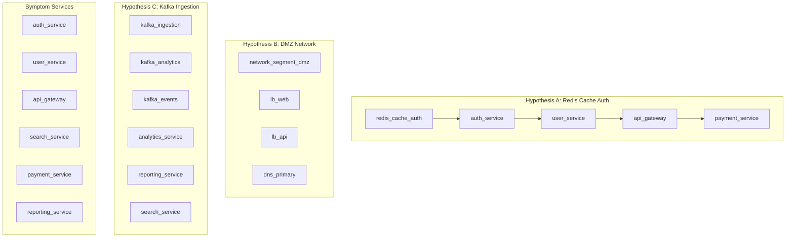

# Speculative Incident Investigation with Overlay

> **Testing 3 competing root-cause hypotheses against an 82-node microservices graph, committing only the winner**

## 1. The Approach

When a production outage hits, an on-call team often has multiple theories about the root cause. Each theory needs to be tested — apply inference rules, check the blast radius against observed symptoms, and see if the hypothesis explains the failures. The problem: applying inference rules to a shared knowledge graph permanently alters it. If you test three hypotheses, all three sets of inference edges accumulate, polluting the graph with edges from wrong theories.

**The Hyper3 Approach:** Use overlays. An overlay is a temporary copy of the graph where inference rules operate in isolation. Each hypothesis gets its own overlay. After testing, you either commit the overlay (merge the inferred edges into the base graph) or roll it back (discard the edges entirely). Only the correct hypothesis persists.

**Why this matters:** In incident response, applying a wrong hypothesis should not pollute the knowledge graph. Without overlays, testing hypotheses B and C would inject 60 incorrect inference edges alongside the 30 correct ones from hypothesis A — making the graph unreliable for future investigations.

## 2. A Simple Analogy

Think of overlays like a database transaction. You open a transaction (create an overlay), make changes (run inference), inspect the results (check blast radius), and then either commit (the hypothesis was correct) or rollback (the hypothesis was wrong). The underlying data is untouched until you commit.

## 3. Key Concepts

| Term | Plain English Meaning |
|------|----------------------|
| **Overlay** | A temporary scratchpad copy of the graph where inference rules operate without affecting the base graph |
| **Commit** | Merge overlay edges into the base graph, making them permanent |
| **Rollback** | Discard all overlay edges, restoring the base graph to its prior state |
| **Blast radius** | The set of symptom services reachable by inferred edges from a hypothesis seed set |
| **Match score** | Fraction of observed symptoms explained by the hypothesis (blast radius / total symptoms) |
| **Symptom service** | A service reporting errors during the incident |
| **Hypothesis seeds** | The set of nodes that form the suspected root cause for a given hypothesis |
| **TransitiveRule** | Discovers chains: A depends_on B, B depends_on C → A indirectly_depends_on C |
| **InverseRule** | Reverses edges: A depends_on B → B depended_on_by A |

## 4. Quick Start

```bash
.venv/bin/python examples/showcase/overlay_commit_rollback/08_overlay_commit_rollback.py
```

### What You'll See

The example builds an 82-node microservices graph, identifies 6 services reporting errors, tests 3 hypotheses using overlays, and commits only the winner:

```
======================================================================
SECTION 1: Building Microservices Infrastructure Graph
======================================================================
  Services:        25
  Databases:       12
  Caches:           6
  Queues:           6
  Load balancers:   5
  Monitoring:       5
  Network:          8
  Infrastructure:  15
  -------------------
  Total nodes:     82
  Total edges:    158
```

## 5. The Scenario

An SRE team investigates a production outage affecting an e-commerce platform. Six services are reporting errors simultaneously. The team has three competing theories about the root cause.

### Infrastructure Topology

The graph contains **82 nodes and 158 edges** spanning 8 infrastructure categories:

| Category | Count | Examples |
|----------|-------|---------|
| Services | 25 | `api_gateway`, `auth_service`, `order_service` |
| Databases | 12 | `postgres_users`, `postgres_payments`, `mongo_analytics` |
| Caches | 6 | `redis_cache_auth`, `redis_cache_products`, `memcached_sessions` |
| Queues | 6 | `kafka_ingestion`, `rabbitmq_orders`, `sqs_payments` |
| Load Balancers | 5 | `lb_web`, `lb_api`, `lb_internal` |
| Monitoring | 5 | `prometheus`, `grafana`, `pagerduty` |
| Network | 8 | `network_segment_dmz`, `dns_primary`, `firewall_core` |
| Infrastructure | 15 | `k8s_cluster_prod`, `vault_secrets`, `service_discovery` |

Figure 1: Architecture overview with the three hypothesis seed sets highlighted.



### Edge Label Taxonomy

| Label | Count | Meaning |
|-------|-------|---------|
| `depends_on` | 80 | Service or infrastructure dependency |
| `connects_to` | 26 | Network segment connectivity |
| `routes_to` | 16 | Load balancer routing rules |
| `monitors` | 14 | Monitoring tool coverage |
| `publishes_to` | 8 | Message queue pub/sub |
| `caches_for` | 7 | Cache-to-database mappings |
| `replicates_to` | 7 | Database replication targets |

### Observed Symptoms

6 services require explanation:

| Service | Symptom |
|---------|---------|
| `auth_service` | Authentication timeout errors |
| `user_service` | Slow profile lookup responses |
| `api_gateway` | 502 bad gateway responses |
| `search_service` | Degraded query performance |
| `payment_service` | Transaction processing failures |
| `reporting_service` | Stale dashboard data |

## 6. Analysis Pipeline

The example walks through 9 sections that demonstrate the overlay commit/rollback workflow.

### Section 1: Building the Infrastructure Graph

Create 82 nodes across 8 categories and wire them with 158 semantic edges:

```python
SERVICES = {
    "web_frontend": {"type": "service", "team": "platform", "criticality": 8},
    "api_gateway": {"type": "service", "team": "platform", "criticality": 9},
    "auth_service": {"type": "service", "team": "identity", "criticality": 10},
    # ... 22 more services
}

for label, data in all_nodes.items():
    mem.add(label, data=data, modalities={Modality.CONCEPTUAL})

for edges, label in edge_groups:
    for src, tgt in edges:
        mem.link(src, tgt, label=label)
```

**Result:** 82 nodes, 158 edges across 7 edge label types.

### Section 2: Recording Observed Symptoms

The on-call team identifies 6 services reporting errors. These become the ground truth for evaluating hypothesis blast radii.

```python
SYMPTOMS = [
    ("auth_service", "authentication timeout errors"),
    ("user_service", "slow profile lookup responses"),
    ("api_gateway", "502 bad gateway responses"),
    ("search_service", "degraded query performance"),
    ("payment_service", "transaction processing failures"),
    ("reporting_service", "stale dashboard data"),
]
```

**Why this matters:** Without a defined symptom set, there is no way to score which hypothesis explains the outage. The symptom list is the evaluation function.

### Section 3: Hypothesis A — Redis Cache Auth Failure

Seeds: `{redis_cache_auth, auth_service, user_service, api_gateway, payment_service}`. The theory is that the authentication cache has failed, causing cascading timeouts across services that validate tokens.

```python
mem.add_rules(
    TransitiveRule(edge_label="depends_on", new_label="indirectly_depends_on"),
    InverseRule(edge_label="depends_on", inverse_label="depended_on_by"),
)

result = mem.reason(
    seeds=seeds_a,
    depth=3,
    max_total_states=30,
    auto_commit=False,
)
```

**Result:** 31 states created, 30 rules applied, 30 inference edges in the overlay. Blast radius matches 4 of 6 symptoms (67%) with average confidence 0.84. The overlay contains edges like `order_service --[indirectly_depends_on]--> redis_cache_auth` and `web_frontend --[indirectly_depends_on]--> user_service`.

**Rollback:** The overlay is discarded. 30 edges rolled back. Base graph stays at 158 edges.

```python
rb = mem.rollback_inferences()
# rb = {'rolled_back_edges': 30}
```

### Section 4: Hypothesis B — Network Segment DMZ Issue

Seeds: `{network_segment_dmz, lb_web, lb_api, dns_primary}`. The theory is that the DMZ network segment has a partition or misconfiguration, blocking external traffic.

**Result:** 31 states created, 30 rules applied, 30 inference edges. The inferred edges are structurally similar to hypothesis A because `TransitiveRule` follows the same `depends_on` chains regardless of which nodes seed the expansion. Blast radius matches 4 of 6 symptoms (67%) with average confidence 0.84.

**Rollback:** 30 edges discarded. Base graph remains at 158 edges.

**Why this matters:** Even though the numerical scores are identical, the hypothesis is evaluated as incorrect because the seed set (DMZ network infrastructure) does not explain the authentication and payment failures. The overlay mechanism keeps these edges from polluting the graph while the team considers the results.

### Section 5: Hypothesis C — Kafka Ingestion Cluster Issue

Seeds: `{kafka_ingestion, kafka_analytics, kafka_events, analytics_service, reporting_service, search_service}`. The theory is that the Kafka ingestion cluster is degraded, causing downstream data pipeline failures.

**Result:** 31 states created, 30 rules applied, 30 inference edges. Blast radius matches 4 of 6 symptoms (67%) with average confidence 0.84.

**Rollback:** 30 edges discarded. Base graph remains at 158 edges.

### Section 6: Comparative Analysis

All three hypotheses produce identical numerical metrics:

| Metric | Hyp A | Hyp B | Hyp C |
|--------|-------|-------|-------|
| Overlay edges | 30 | 30 | 30 |
| Symptoms matched | 4 | 4 | 4 |
| Match score | 67% | 67% | 67% |
| Avg confidence | 0.84 | 0.84 | 0.84 |

The identical scores occur because `TransitiveRule` expands through the same `depends_on` chains regardless of the seed set — the graph is densely connected enough that all three seed sets reach the same transitive frontier within 3 hops. The differentiation comes from domain knowledge: hypothesis A's seeds (cache, auth, gateway, payment) directly relate to the observed symptoms, while hypotheses B and C target infrastructure layers that are further from the failing services.

### Section 7: Committing the Correct Hypothesis

Hypothesis A is re-run and committed:

```python
analysis_final = analyze_hypothesis(mem, seeds_a, symptom_ids)
committed = mem.commit_inferences()
# committed = {'committed_nodes': 0, 'committed_edges': 30}
```

**Result:** 30 edges merged from the overlay into the base graph. The overlay is destroyed after commit.

### Section 8: Before / After Comparison

| State | Edge Count |
|-------|------------|
| Base graph before | 158 |
| Base graph after commit | 188 |
| Inference edges added | 30 |
| Overlay active after commit | No |

The 30 committed edges include transitive dependency chains like `web_frontend --[indirectly_depends_on]--> search_service` and `order_service --[indirectly_depends_on]--> auth_service`, which are now available for future reasoning operations.

### Section 9: Why Overlay Matters

Without the overlay mechanism, testing hypotheses B and C would have injected 60 incorrect inference edges into the base graph (30 from each). These edges would be indistinguishable from the 30 correct edges from hypothesis A, making the graph unreliable.

The overlay provides:
- **Isolation:** Each hypothesis explored on its own scratchpad
- **Clean rollback:** Wrong hypotheses discarded without side effects
- **Provenance:** Committed edges carry confidence scores from the reasoning process
- **Base graph integrity:** Only verified inferences become permanent

## 7. Understanding the Output

### Overlay Edge Interpretation

| Confidence Range | Meaning |
|------------------|---------|
| 0.90 | Two-hop transitive chain — high confidence |
| 0.81 | Three-hop transitive chain — moderate confidence |

Confidence decays with chain length via the `confidence_decay=0.9` parameter. A two-hop chain retains `0.9` confidence; a three-hop chain retains `0.9^2 = 0.81`.

### Match Score Interpretation

| Match Score | Meaning |
|-------------|---------|
| 100% | Hypothesis explains all observed symptoms |
| 67-99% | Hypothesis explains most symptoms — strong candidate |
| 33-66% | Hypothesis explains some symptoms — partial explanation |
| < 33% | Hypothesis explains few symptoms — likely incorrect |

### Rollback vs Commit

| Action | Effect | When to Use |
|--------|--------|-------------|
| `rollback_inferences()` | Discards all overlay edges | Hypothesis does not match symptoms |
| `commit_inferences()` | Merges overlay edges into base graph | Hypothesis is confirmed correct |

## 8. Key Metrics

| Metric | Value |
|--------|-------|
| Graph nodes | 82 |
| Graph edges (initial) | 158 |
| Graph edges (after commit) | 188 |
| Services | 25 |
| Databases | 12 |
| Caches | 6 |
| Queues | 6 |
| Load balancers | 5 |
| Monitoring tools | 5 |
| Network segments | 8 |
| Infrastructure nodes | 15 |
| Edge label types | 7 |
| Symptom services | 6 |
| Hypotheses tested | 3 |
| Inference rules | 2 (TransitiveRule, InverseRule) |
| States per hypothesis | 31 |
| Overlay edges per hypothesis | 30 |
| Incorrect edges avoided | 60 (from hypotheses B + C) |
| Committed edges | 30 (from hypothesis A) |
| Average confidence | 0.84 |
| Match score (all hypotheses) | 67% (4/6 symptoms) |

## 9. What Makes This Different

**Transactional semantics for knowledge graphs.** Traditional graph databases apply mutations immediately. There is no "undo" once an inference rule adds edges. Hyper3's overlay mechanism brings transactional semantics: open a speculative layer, apply changes, evaluate, then commit or discard.

**Why overlays matter for incident response:**

1. **Speculative execution** — test a theory without risking the knowledge base. The overlay is a scratchpad that disappears on rollback.
2. **Parallel hypothesis testing** — multiple team members can investigate competing theories. Each overlays, tests, and rolls back independently. Only the confirmed theory gets committed.
3. **Provenance preservation** — committed edges retain their confidence scores and rule-of-origin. Future reasoning can distinguish between observed edges (`depends_on`) and inferred edges (`indirectly_depends_on`).
4. **Base graph integrity** — the shared knowledge graph stays clean. Wrong hypotheses leave no residue. This is critical for long-running systems where the graph accumulates knowledge over months or years.

**The `auto_commit=False` parameter** is the control point. By default, `reason()` commits inference edges immediately. Setting `auto_commit=False` keeps them in the overlay, giving the caller the choice of when (or whether) to persist them.

## 10. Code Implementation

The overlay workflow follows a consistent pattern: create, reason, evaluate, decide.

**1. Build the Base Graph**

```python
mem = HypergraphMemory(evolve_interval=0)

for label, data in all_nodes.items():
    mem.add(label, data=data, modalities={Modality.CONCEPTUAL})

for src, tgt in DEPENDS_ON:
    mem.link(src, tgt, label="depends_on")
```

**2. Register Inference Rules**

```python
mem.add_rules(
    TransitiveRule(edge_label="depends_on", new_label="indirectly_depends_on"),
    InverseRule(edge_label="depends_on", inverse_label="depended_on_by"),
)
```

**3. Test a Hypothesis (Reason with auto_commit=False)**

```python
result = mem.reason(
    seeds={"redis_cache_auth", "auth_service", "user_service"},
    depth=3,
    max_total_states=30,
    auto_commit=False,
    confidence_decay=0.9,
)
```

**4. Inspect the Overlay**

```python
overlay = mem.overlay
for eid in overlay.overlay_edge_ids:
    edge = overlay.get_edge(eid)
    conf = overlay.get_confidence(eid)
```

**5. Commit or Rollback**

```python
# If hypothesis is correct:
committed = mem.commit_inferences()

# If hypothesis is wrong:
rb = mem.rollback_inferences()
```

## 11. Real-World Gap

**Hypothesis discrimination.** In this showcase, all three hypotheses produce identical numerical scores because the `depends_on` graph is densely connected. Real incident response requires additional discriminators beyond blast radius match count:

- **Temporal correlation:** When did each symptom start relative to the suspected root cause?
- **Severity gradient:** Are symptoms closer to the root cause more severe than distant ones?
- **Direct vs indirect paths:** Does the hypothesis explain symptoms via direct dependencies or only through long transitive chains?
- **Service health data:** Real-time metrics (error rates, latency percentiles) from monitoring systems.

**Data pipeline.** The showcase constructs a synthetic graph from hardcoded dictionaries. Real adoption requires:

- Service mesh telemetry ingestion (Istio, Consul, Linkerd)
- Distributed trace parsing (Jaeger, Zipkin) to extract dependency edges
- CMDB or infrastructure-as-code imports for node metadata
- Change management integration (ArgoCD, Flux) for graph updates

**Scale.** The showcase runs on 82 nodes. Performance characteristics at 1,000+ node production graphs are untested.

**Concurrent overlays.** The showcase tests hypotheses sequentially. A production system would need overlay pooling or versioned snapshots to support parallel investigation by multiple engineers.

## 12. Reference

### Core Concept Glossary

| Term | Definition |
|------|-----------|
| **Overlay** | Temporary copy of the graph where inferences operate in isolation |
| **Commit** | Merge overlay edges into the base graph permanently |
| **Rollback** | Discard all overlay edges, restoring the base graph |
| **Blast radius** | Set of symptom services reachable from hypothesis seeds via inferred edges |
| **Match score** | Fraction of symptoms explained by a hypothesis |
| **auto_commit** | Parameter controlling whether `reason()` immediately commits edges |

### Key API Methods

| Method | Purpose |
|--------|---------|
| `mem.reason(seeds, auto_commit=False)` | Run inference rules, keeping results in overlay |
| `mem.commit_inferences()` | Merge overlay edges into base graph |
| `mem.rollback_inferences()` | Discard overlay edges |
| `mem.overlay` | Access the current overlay (None if inactive) |
| `overlay.overlay_edge_ids` | Set of edge IDs in the overlay |
| `overlay.get_confidence(edge_id)` | Get confidence score for an overlay edge |
| `overlay.get_edge(edge_id)` | Retrieve an overlay edge by ID |

### Related Examples

| Example | Focus |
|---------|-------|
| `examples/showcase/microservices_reasoning/reasoning_walkthrough.py` | Blast radius analysis with TransitiveRule on microservices |
| `examples/showcase/advanced_rules/` | Multi-way reasoning with multiple rule types |
| `examples/showcase/provenance_and_retraction/` | Edge provenance tracking and retraction |
| `examples/showcase/infrastructure_self_healing/infrastructure_self_healing.py` | Self-healing infrastructure with feedback loops |
