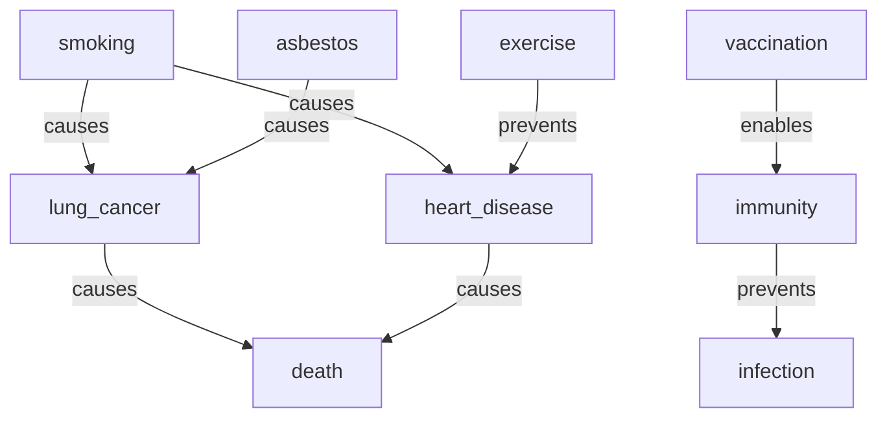

# Knowledge Reasoning

> **Transitive Inference, Backward Chaining, Provenance, and Belief Revision on a Causal Graph**

## 1. The Approach

A causal knowledge graph stores facts like "smoking causes lung cancer" and "lung cancer causes death." The value is not in storing these facts — it is in deriving what they imply together. If smoking causes lung cancer, and lung cancer causes death, then smoking indirectly causes death. A human sees this instantly; a graph that cannot derive it is just a database.

This showcase builds a 9-node causal graph and demonstrates six reasoning capabilities:

- **Transitive inference**: Chaining causal edges to discover indirect relationships.
- **Backward chaining**: Starting from a conclusion (death) and asking "what evidence supports this?"
- **Provenance**: Explaining where each inferred edge came from — which rule, which inputs.
- **Belief revision**: Detecting contradictions (causes vs. prevents on the same concept pair) and resolving them.
- **Multi-rule reasoning**: Using inverse rules to derive backward relationships (caused_by, prevented_by) from forward edges.
- **Confidence assessment**: Evaluating knowledge graph reliability after revision and identifying weak areas.

These capabilities exist because storing facts is insufficient. Real knowledge work requires deriving consequences, justifying conclusions, and maintaining consistency as beliefs change.

## 2. A Simple Analogy

Imagine a detective's evidence board with strings connecting suspects, motives, and crimes. The strings on the board are given facts. But the detective can also follow the strings to draw conclusions: if the suspect was at the scene (A), and the scene connects to the weapon (B), then the suspect connects to the weapon. That's transitive inference. If two strings point in opposite directions about the same suspect — one says "alibi confirmed" and another says "witness places at scene" — the detective must resolve the contradiction. That's belief revision. And if the detective is asked to justify why they suspect someone, they trace the strings back to the original evidence. That's provenance.

## 3. Key Concepts

| Term | Plain English Meaning |
|------|-----------------------|
| **Transitive Rule** | If A causes B and B causes C, infer A indirectly causes C |
| **Multiway Expansion** | Exploring all possible rule applications simultaneously across the graph |
| **Backward Chaining** | Working from a goal conclusion backward to find supporting evidence |
| **Provenance** | A record of how an inference was derived: which rule, which input edges |
| **Belief Revision** | Detecting contradictions (opposing labels on the same node pair) and resolving them |
| **Contradiction** | Two edges with opposing semantics (e.g., `causes` and `prevents`) targeting the same node |
| **Confidence Score** | A raw cumulative score reflecting edge weights and provenance depth (not 0-1 normalized) |

## 4. Quick Start

```bash
.venv/bin/python examples/showcase/reasoning/knowledge_reasoning/knowledge_reasoning.py
```

### What You'll See

```
SECTION 1: BUILD A KNOWLEDGE BASE
concepts: 9, facts: 8

SECTION 2: RULE-BASED TRANSITIVE INFERENCE
transitive reasoning from 'smoking':
  states created: 4
  rules applied: 3
  edges produced: 3
  inferred: asbestos -[indirectly_causes]-> death
  inferred: smoking -[indirectly_causes]-> death
  inferred: smoking -[indirectly_causes]-> death

SECTION 3: BACKWARD CHAINING (PROOF)
proof achievable: False
proof tree depth: 0
  goal: death

SECTION 4: PROVENANCE AND EXPLANATION
explanation: asbestos indirectly causes death
  asbestos -> death (inferred) because:
    asbestos -> lung_cancer (given)
    lung_cancer -> death (given)
    via transitive(causes)

SECTION 5: BELIEF REVISION (CONTRADICTION DETECTION)
contradictions detected: 2
  causes vs prevents between heart_disease-heart_disease
  causes vs prevents between heart_disease-heart_disease
revision: 1 edges removed, 1 kept
  total revised: 1

SUMMARY
  1. Transitive inference discovers hidden causal chains
  2. Backward chaining proves goals from known facts
  3. Provenance makes every inference auditable
  4. Belief revision detects and resolves contradictions
  5. Inverse rules enable bidirectional causal queries
  6. Confidence scoring identifies knowledge gaps
```

## 5. The Scenario

A small causal knowledge graph with 9 health-related concepts and 8 factual edges. Two causal pathways lead to death (via lung cancer and heart disease), and one intervention (exercise) prevents heart disease. This creates the conditions for both transitive inference and contradiction detection.

### Causal Graph Topology



### Edge Taxonomy

| Label | Count | Meaning |
|-------|-------|---------|
| `causes` | 5 | Direct causal relationship |
| `prevents` | 2 | Intervention that blocks an outcome |
| `enables` | 1 | A precondition that makes something possible |

## 6. Analysis Pipeline

### Section 1: Building the Knowledge Base

The script creates 9 concept nodes and 8 labeled, directed edges. Each edge carries a semantic label (`causes`, `prevents`, `enables`) and a weight of 3.0. The labels are critical — they determine which reasoning rules match. The `TransitiveRule` only chains edges sharing the same label, so the five `causes` edges form a chainable subgraph while `prevents` and `enables` edges do not participate in transitive reasoning.

### Section 2: Transitive Inference

The `TransitiveRule(edge_label="causes", new_label="indirectly_causes")` finds two-hop chains in the `causes` subgraph and produces new edges labeled `indirectly_causes`. Three edges are inferred:

- **asbestos -> death**: via asbestos -> lung_cancer -> death
- **smoking -> death** (via lung_cancer): smoking -> lung_cancer -> death
- **smoking -> death** (via heart_disease): smoking -> heart_disease -> death

The two smoking->death edges reflect the two distinct causal pathways. The multiway engine explores 4 states and applies the rule 3 times, producing 3 new edges.

**Why this matters**: Without transitive inference, the graph stores "smoking causes lung cancer" and "lung cancer causes death" as isolated facts. The connection between smoking and death exists only in a human reader's mind. Transitive inference makes that connection explicit and queryable.

### Section 3: Backward Chaining

The `prove("death", known_facts={"smoking"})` call attempts to construct a proof tree: starting from "death," working backward through causal edges to reach the known fact "smoking."

The result is `achievable: False` with depth 0. The proof engine works with the original graph edges (before reasoning), and the direct `causes` edges do not form a single chain from smoking to death — there is no direct edge from smoking to death in the base graph. The proof engine requires a connected chain of uniform-label edges from evidence to goal.

**Why this matters**: Backward chaining answers "what would I need to believe to accept this conclusion?" When the proof fails, it reveals gaps in the knowledge base — missing intermediate links that would complete the chain.

### Section 4: Provenance and Explanation

The `explain()` method traces the provenance of an inferred edge. For the edge "asbestos indirectly causes death," the explanation shows:

```
asbestos -> death (inferred) because:
  asbestos -> lung_cancer (given)
  lung_cancer -> death (given)
  via transitive(causes)
```

Each inferred edge carries a provenance record: the rule that produced it, the input edges, and the derivation depth. The explanation renders this as a human-readable derivation tree.

**Why this matters**: Without provenance, an inferred edge is a black box. A knowledge graph that says "smoking indirectly causes death" without explaining why is asking for blind trust. Provenance makes every inference auditable.

### Section 5: Belief Revision

The `detect_contradictions()` method finds 2 contradictions. The output reports these as `causes vs prevents between heart_disease-heart_disease`. Both contradictions involve edges pointing at the same target node — heart_disease. Smoking causes heart_disease (`causes` label) while exercise prevents heart_disease (`prevents` label). The contradiction detection identifies opposing semantic labels on edges that share a target, reporting the target node on both sides of the "between" pair.

The `revise_beliefs()` method resolves this by removing 1 edge and keeping 1, reducing the total by 1 revised edge. The revision removes the weaker or less-supported edge to restore consistency. In this run, the `exercise -> heart_disease [prevents]` edge was removed, while the `smoking -> heart_disease [causes]` edge was kept. This means exercise no longer appears as a preventive intervention against heart disease in the graph — a consequence that domain expertise should validate in production use.

> **Note**: Belief revision results can vary between runs. The contradiction detection may report the same pair in either order (`causes vs prevents` or `prevents vs causes`), and the revision engine's choice of which edge to remove may differ. Exact edge counts and downstream confidence values should be treated as run-dependent.

**Why this matters**: Real knowledge bases accumulate contradictions as new information arrives. Without automated detection, contradictory beliefs coexist silently. Belief revision surfaces the conflict and resolves it, keeping the graph internally consistent.

### Section 6: Multi-Rule Reasoning (Inverse Rules)

After transitive inference and belief revision, the script adds two `InverseRule` instances to derive backward relationships:

- `InverseRule(edge_label="causes", inverse_label="caused_by")` — for every A causes B, infer B caused_by A
- `InverseRule(edge_label="prevents", inverse_label="prevented_by")` — for every A prevents B, infer B prevented_by A

A second reasoning pass with these rules produces 6 new inverse edges: 5 `caused_by` edges (e.g., death caused_by heart_disease, lung_cancer caused_by smoking) and 1 `prevented_by` edge (infection prevented_by immunity). The `exercise -> heart_disease [prevents]` edge was removed during belief revision, so no `heart_disease prevented_by exercise` inverse is created. These inverse edges enable backward traversal of causal chains.

**Why this matters**: Real knowledge graphs are queried from multiple directions. A forward query asks "what does smoking cause?" while a backward query asks "what caused death?" Inverse rules make both directions traversable without duplicating knowledge.

### Section 7: Post-Revision Confidence Assessment

After all reasoning and revision, the confidence subsystem evaluates the quality of the knowledge graph. Confidence scores are **raw cumulative values**, not normalized to a 0-1 range. They reflect the product of edge weights along inference chains, so a concept with more supporting edges and higher-weight connections accumulates a higher score. In this graph, per-concept scores range from 2.55 to 7.65.

The key outputs:

- `all_confidences()` returns aggregate statistics. The "High confidence (>0.8)" count of 9 means all 9 concepts in the graph exceed the 0.8 threshold — the graph has strong evidence throughout. The average confidence is 2.60 (exact value varies by run due to non-determinism in belief revision).
- `confidence(concept)` returns a per-concept score. For example, death scores 7.65 because multiple causal chains converge on it, while smoking scores 2.55 because it has fewer incoming supporting edges.
- `trace_confidence_chain(source, target)` finds the path with the highest cumulative confidence between two concepts. The chain confidence is the product of edge weights along the strongest path. `asbestos -> death` scores 27.0 because the strongest path traverses three edges of weight 3.0 each (3.0 * 3.0 * 3.0 = 27.0), passing through inferred and inverse edges. `smoking -> death` scores 9.0 via a two-edge path (3.0 * 3.0). Chain confidence is a separate metric from per-concept confidence — it measures path strength, not node importance.
- `low_confidence(threshold)` identifies concepts below a threshold. With threshold=0.5, no concepts qualify — all exceed it.

**Why this matters**: After revision removes contradictory edges, the confidence assessment reveals whether the remaining graph is trustworthy. Low-confidence concepts indicate knowledge gaps where additional evidence or relationships are needed.

### Summary

The final summary connects all six demonstrated capabilities back to the knowledge reasoning use case: transitive inference discovers hidden chains, backward chaining proves conclusions, provenance makes inferences auditable, belief revision maintains consistency, inverse rules enable bidirectional queries, and confidence scoring identifies where the knowledge graph needs strengthening.

## 7. Key Metrics

| Metric | Value |
|--------|-------|
| Concept nodes | 9 |
| Factual edges | 8 |
| Edge labels used | 3 (`causes`, `prevents`, `enables`) |
| Transitive reasoning: states created | 4 |
| Transitive reasoning: edges produced | 3 |
| Multi-rule reasoning: states created | 7 |
| Multi-rule reasoning: edges produced | 6 (5 caused_by + 1 prevented_by) |
| Unique inferred conclusions | 2 (asbestos->death, smoking->death) |
| Contradictions detected | 2 |
| Edges removed by revision | 1 |
| Edges kept by revision | 1 |
| Average confidence | 2.60 (raw cumulative, not 0-1 normalized; varies by run) |
| Per-concept confidence range | 2.55 -- 7.65 |
| Chain confidence range | 9.0 -- 27.0 (path product metric, separate from per-concept) |
| High confidence (>0.8) concepts | 9 (all concepts) |
| Low confidence (<0.3) concepts | 0 |

Per-concept confidence values are raw cumulative scores derived from edge weights and provenance depth. They are not normalized to a 0-1 range. Values above 1.0 are common and indicate that a concept is supported by multiple high-weight inference chains. Chain confidence (from `trace_confidence_chain`) is a separate metric measuring the product of edge weights along the strongest path between two concepts.

> **Non-determinism**: Belief revision is sensitive to the order in which contradictions are detected and resolved. The exact number of edges removed/kept, the resulting prevented_by inverses, and downstream confidence values may vary between runs. The contradiction count (2) and the transitive inference results (3 edges) are stable.

## 8. What Makes This Different

**Rule-based inference over labeled edges.** The transitive rule matches on edge labels, not just topology. A causes-chain and a prevents-chain are structurally identical but semantically different, and the rules respect this distinction. This is not path-finding on an unlabeled graph — it is reasoning over the semantics of relationships. When the transitive rule chains `causes` edges, it skips `prevents` and `enables` edges entirely, producing only causally-valid inferences.

**Provenance as a first-class record.** Every inferred edge carries a derivation history. The `explain()` method does not reconstruct reasoning after the fact — it reads the provenance that was recorded when the inference was made. This makes explanations reliable rather than speculative. Each provenance record identifies the rule (e.g., `transitive(causes)`) and the input edges (e.g., `asbestos -> lung_cancer` and `lung_cancer -> death`).

**Contradiction detection on opposing labels.** The system detects when edges with opposing semantics (causes vs. prevents) target the same node. It does not require the edges to share a source — it flags the conflict based on the target. This is not anomaly detection on graph structure — it is semantic consistency checking that understands what edge labels mean.

**Backward chaining with gap identification.** When a proof fails, the depth-0 result indicates no path exists from evidence to conclusion. This failure mode is informative: it tells you exactly which conclusions your knowledge base cannot yet justify, revealing where additional evidence is needed.

**Cumulative confidence that reflects evidence strength.** Per-concept confidence scores aggregate incoming edge weights and inference support, while chain confidence (`trace_confidence_chain`) multiplies edge weights along the strongest path. A chain traversing three edges of weight 3.0 scores 27.0 (3.0^3), while one traversing two edges scores 9.0 (3.0^2). This makes confidence directly interpretable: higher scores mean more supporting evidence at higher weights.

## 9. Code Implementation

### Building the causal graph

```python
from hyper3 import HypergraphMemory
from hyper3.rules import TransitiveRule

mem = HypergraphMemory(evolve_interval=0)

facts = [
    ("smoking", "lung_cancer", "causes"),
    ("asbestos", "lung_cancer", "causes"),
    ("lung_cancer", "death", "causes"),
    ("smoking", "heart_disease", "causes"),
    ("heart_disease", "death", "causes"),
    ("exercise", "heart_disease", "prevents"),
    ("vaccination", "immunity", "enables"),
    ("immunity", "infection", "prevents"),
]
for src, tgt, label in facts:
    mem.add(src, data={"type": "concept"})
    mem.add(tgt, data={"type": "concept"})
    mem.link(src, tgt, label=label, weight=3.0)
```

### Transitive inference

```python
mem.add_rules(TransitiveRule(edge_label="causes", new_label="indirectly_causes"))
result = mem.reason(seeds={"smoking"}, depth=3, max_states=30)
print(f"edges produced: {result.expansion.edges_produced}")

for e in mem.analyze.edges(label="indirectly_causes"):
    print(f"  {e.source_labels[0]} -> {e.target_labels[0]}")
```

### Provenance explanation

```python
explanation = mem.explain("asbestos", "death")
print(explanation.render())
```

### Belief revision

```python
contradictions = mem.detect_contradictions()
for c in contradictions:
    print(f"{c.edge_a_label} vs {c.edge_b_label} between {c.source_label}-{c.target_label}")

revision = mem.revise_beliefs()
print(f"removed: {revision.edges_removed_count}, kept: {revision.edges_kept_count}")
```

### Confidence assessment

```python
all_conf = mem.cognitive.all_confidences()
print(f"average confidence: {all_conf.avg_confidence:.4f}")
print(f"high confidence (>0.8): {all_conf.high_confidence_count}")

score = mem.cognitive.confidence("death")
print(f"death confidence: {score.confidence:.4f}")

chain = mem.cognitive.trace_confidence("asbestos", "death")
print(f"asbestos -> death: confidence={chain.chain_confidence:.4f}")
```

## 10. Real-World Gap

- **Graph size**: This example uses 9 nodes and 8 edges. Production knowledge graphs contain thousands or millions of facts. Performance at that scale is untested.
- **Rule coverage**: Only one rule (TransitiveRule) is applied initially, with InverseRules added later. Real reasoning requires abductive rules, contextual substitution rules, and domain-specific rules working together.
- **Non-determinism in revision**: Belief revision may produce different edge-removal decisions across runs. Production systems should either seed the random state for reproducibility or run revision multiple times and take a consensus.
- **Contradiction resolution**: The revision engine removes edges based on structural heuristics. Real knowledge work requires domain expertise to decide which conflicting belief to retain. In this showcase, the revision chose to keep the `causes` edge and remove the `prevents` edge — but a domain expert might decide that exercise's preventive effect is the more reliable finding.
- **Backward chaining scope**: The proof engine works on the base graph edges. Inferred edges from multiway expansion are not automatically available as proof steps.
- **Confidence interpretation**: Confidence scores are cumulative products of edge weights, not calibrated probabilities. Comparing confidence across graphs with different edge weight distributions requires normalization that the system does not currently provide.
- **Data pipeline**: The graph is constructed programmatically. Production use requires ingesting facts from databases, literature, or expert input with appropriate schema validation.

## 11. Reference

### API Methods

| Method | Purpose |
|--------|---------|
| `mem.link(src, tgt, label=, weight=)` | Create a labeled, weighted directed edge |
| `mem.add_rules(*rules)` | Register inference rules |
| `mem.reason(seeds=, depth=, max_states=)` | Run multiway expansion from seed concepts |
| `mem.prove(goal, known_facts=)` | Backward-chain from goal to evidence |
| `mem.explain(src, tgt)` | Get provenance explanation for an edge |
| `mem.detect_contradictions()` | Find opposing-label edge pairs |
| `mem.revise_beliefs()` | Resolve detected contradictions |
| `mem.analyze.edges(label=)` | Query edges by label |
| `InverseRule(edge_label, inverse_label)` | Derive backward edges from forward edges |
| `mem.cognitive.all_confidences()` | Score every concept in the graph |
| `mem.cognitive.confidence(concept)` | Score a single concept |
| `mem.cognitive.low_confidence(threshold)` | Find concepts below confidence threshold |
| `mem.cognitive.trace_confidence(src, tgt)` | Find highest-confidence path |

### Related Examples

| Example | Topic |
|---------|-------|
| `examples/showcase/reasoning/advanced_rules/` | Multi-rule inference with abductive and inverse rules |
| `examples/showcase/reasoning/provenance_and_retraction/` | Cascading retraction when evidence is withdrawn |
| `examples/showcase/reasoning/multiway_reasoning/` | Multiway expansion and state-space exploration |
