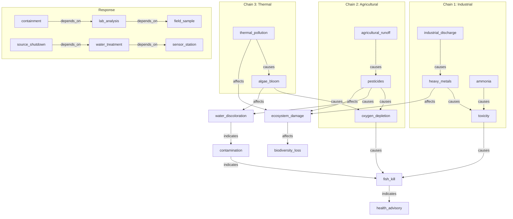
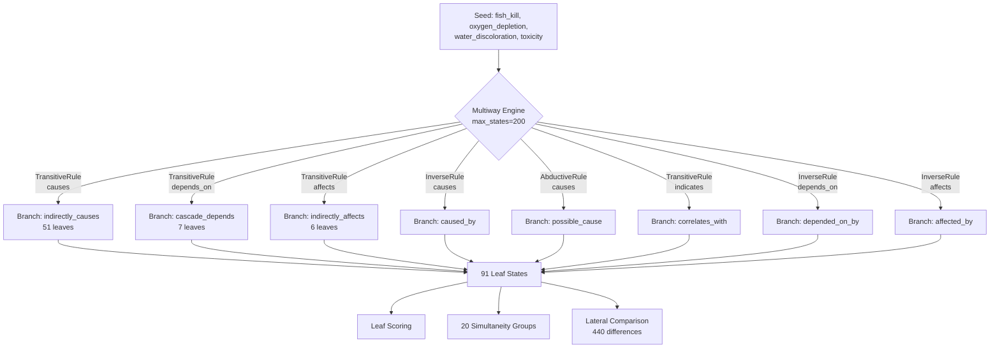

# Multiway Diverse Hypotheses Showcase

> **Diverse Rule Firing on a Compact Environmental Investigation Graph**

## 1. The Approach

A fish kill event is detected in a river system. Three root causes could explain it: industrial discharge, agricultural runoff, or thermal pollution. Each traces through a different causal chain, but they converge on the same symptoms.

**The problem:** With a large graph and limited state budget, a single rule type dominates (e.g., `TransitiveRule(depends_on)` fills the entire cap). The infrastructure showcase demonstrates this -- 81 nodes, `max_states=50`, and only one rule fires.

**This showcase's approach:** A deliberately compact graph (21 nodes, 22 edges) with balanced edge labels and a generous state budget (`max_states=200`) allows multiple rule types to fire simultaneously. The result: 7 distinct rule categories produce 91 leaf states, and lateral comparison finds 440 structural differences across hypothesis branches.

## 2. A Simple Analogy

Imagine three detectives independently investigating the same crime. One follows the money trail (dependency chains), another traces cause-and-effect (causal chains), and a third assesses collateral damage (impact chains). Each detective reaches conclusions the others miss. When they compare notes, they discover which findings are unique to their approach and which overlap.

## 3. Key Concepts

| Term | Plain English Meaning |
|------|----------------------|
| **Multiway Expansion** | Exploring multiple "what if" scenarios simultaneously |
| **Rule Diversity** | Multiple rule types producing hypothesis branches in the same expansion |
| **Simultaneity Group** | Hypotheses at the same depth that can be compared directly |
| **Lateral Comparison** | Finding edges unique to one branch vs. another within the same group |
| **Per-Branch Overlay** | Each state gets its own overlay, isolating branch inferences |
| **Overlay Deduplication** | Same logical edge from multiple branches appears only once after commit |

## 4. Quick Start

```bash
.venv/bin/python examples/showcase/reasoning/multiway_diversity/multiway_diverse_hypotheses.py
```

### What You'll See

```
======================================================================
SECTION 1: River Contamination Investigation Graph
======================================================================
  Nodes: 21
  Edges: 22
  Observed symptoms: fish_kill, oxygen_depletion, water_discoloration
    affects: 5 edges
    causes: 10 edges
    depends_on: 4 edges
    indicates: 3 edges

======================================================================
SECTION 4: Branch Analysis by Rule Type
======================================================================
  Total leaf states: 91
  Unique rule types: 7
    transitive(affects): 6 leaves
    transitive(affects) + transitive(causes): 9 leaves
    transitive(affects) + transitive(depends_on): 8 leaves
    transitive(causes): 51 leaves
    transitive(causes) + transitive(depends_on): 1 leaves
    transitive(depends_on): 7 leaves
    transitive(depends_on) + transitive(causes): 9 leaves
```

Note: exact lateral comparison examples vary across runs due to dict iteration order, but the structural counts (rule types, leaf counts, group sizes) are deterministic.

## 5. The Scenario & Topology

The example models a river contamination investigation with **21 nodes and 22 edges** across four relationship categories:

- **3 Root Causes:** industrial discharge, agricultural runoff, thermal pollution
- **4 Contaminants:** heavy metals, pesticides, algae bloom, ammonia
- **4 Effects:** toxicity, oxygen depletion, fish kill, water discoloration
- **2 Ecosystem impacts:** ecosystem damage, biodiversity loss
- **3 Monitoring/response:** sensor station, lab analysis, field sample
- **3 Response actions:** containment, water treatment, source shutdown
- **2 Indicators:** contamination, health advisory

### System Topology

Figure 1: Three causal chains converge at fish_kill through different mechanisms.



### Edge Label Taxonomy

| Category | Labels | Count |
|----------|--------|-------|
| **Causality** | `causes` | 10 |
| **Effects** | `affects` | 5 |
| **Dependency** | `depends_on` | 4 |
| **Indicators** | `indicates` | 3 |

The label distribution is deliberately balanced: causes dominates but not overwhelmingly (10 of 22 edges), and the other labels provide enough two-hop chains for their transitive rules to fire.

## 6. The Analysis Pipeline

### Phase 1: Multiway Expansion

Eight inference rules operate on the graph: four transitive (causes, depends_on, affects, indicates), three inverse (causes, depends_on, affects), and one abductive (causes).



**Result:** 201 states created, 200 rules applied, 181 branches (pre-convergence), 91 leaf states (post-convergence), max depth 3.

**Why this works here but not in the infrastructure showcase:** The infrastructure graph has ~70 `depends_on` edges that dominate the `max_states=50` budget. Here, the largest label (`causes` with 10 edges) is small enough that the expansion budget accommodates all rule types.

### Phase 2: Per-Branch Overlay Isolation

Each child state in the multiway DAG receives its own overlay inheriting from its parent. After expansion, the engine collects all branch overlays and deduplicates by (source_ids, target_ids, label) before committing.

In the contamination example:
- 200 of 291 multiway states carry per-branch overlays
- 480 total overlay edges exist across all branches
- After deduplication, 12 unique logical edges remain -- 468 were duplicates produced by multiple branches independently discovering the same inferences

**Why this matters:** The 468-to-12 dedup ratio (97% duplicates) shows that branches converge heavily on the same conclusions. Without per-branch isolation, branches would share state and produce fewer total edges. With isolation, each branch independently discovers inferences, and deduplication consolidates them afterward.

### Phase 3: Diverse Rule Firing

Seven distinct rule-type combinations produce leaf states:

| Rule Type | Leaves | Sample Inference |
|-----------|--------|-----------------|
| `transitive(causes)` | 51 | `industrial_discharge` -[indirectly_causes]-> `toxicity` |
| `transitive(depends_on)` | 7 | `containment` -[cascade_depends]-> `field_sample` |
| `transitive(affects)` | 6 | `heavy_metals` -[indirectly_affects]-> `biodiversity_loss` |
| `transitive(affects) + transitive(causes)` | 9 | Both affect and cause chains |
| `transitive(depends_on) + transitive(causes)` | 9 | Both dependency and cause chains |
| `transitive(affects) + transitive(depends_on)` | 8 | Both affect and dependency chains |
| `transitive(causes) + transitive(depends_on)` | 1 | Both cause and dependency chains |

Compound rule types (e.g., `transitive(affects) + transitive(causes)`) represent states where one rule fired at depth 1 and a different rule fired at depth 2, producing a mixed expansion path.

### Phase 4: State Clustering and Convergence

The 291 states organize into 20 simultaneity groups. Every group contains multiple rule types:

| Group | States | Rule Types |
|-------|--------|------------|
| Group 1 | 10 | `transitive(causes)`, `transitive(depends_on)` |
| Group 2 | 11 | 4 rule types |
| Group 3 | 19 | 5 rule types |
| ... | ... | ... |
| Group 20 | 10 | `transitive(affects)`, `transitive(causes)`, `transitive(depends_on)` |

**State convergence:** 90 structurally equivalent states were merged (causal invariants). These represent different expansion paths that arrived at the same set of active nodes.

**Cross-rule convergence:** No pairs of states from different rule types shared 2+ target nodes. The three transitive rule families (causes, depends_on, affects) explore genuinely different regions of the graph -- causes chains trace contamination pathways, depends_on chains trace response dependencies, and affects chains trace ecological impacts.

### Phase 5: Lateral Comparison Across Branches

Comparing states within the same simultaneity group reveals edges unique to each rule type. Across 5 sampled groups, the engine finds **440 structural differences**.

Representative examples:

| Group | Unique to `transitive(causes)` | Unique to `transitive(depends_on)` |
|-------|-------------------------------|-------------------------------------|
| Group 1 | `industrial_discharge` -[indirectly_causes]-> `toxicity` | `containment` -[cascade_depends]-> `field_sample` |
| Group 1 | `heavy_metals` -[indirectly_causes]-> `fish_kill` | `source_shutdown` -[cascade_depends]-> `sensor_station` |

| Group | Unique to `transitive(affects)` | Unique to `transitive(causes)` |
|-------|---------------------------------|-------------------------------|
| Group 4 | `heavy_metals` -[indirectly_affects]-> `biodiversity_loss` | `industrial_discharge` -[indirectly_causes]-> `toxicity` |

Note: specific examples vary across runs due to dict iteration order. The counts (440 total differences, 5 groups with diffs) are deterministic.

**Why this matters:** Each rule type produces edges the others cannot. The `transitive(causes)` branches discover indirect causal links (e.g., `industrial_discharge` causes `toxicity` via `heavy_metals`). The `transitive(depends_on)` branches discover response dependency chains. The `transitive(affects)` branches discover ecological impact pathways. No single rule type covers all three.

## 7. Understanding the Output

### Branches vs. Leaf States

| Metric | Value | Meaning |
|--------|-------|---------|
| `exp.branches` | 181 | Terminal states immediately after expansion |
| `get_leaves()` | 91 | All leaf states after convergence engine merges equivalents |
| States with overlay | 200 | States carrying their own per-branch overlay |

The 90 merged states create new leaves when their children are merged away, raising the leaf count from 181 to 91.

### Leaf Score Interpretation

All top-scoring leaves tie at 0.600. The scoring formula is:

```
score = (edge_hits + symptom_overlap) / (total_symptoms + produced_edges + 1)
```

With 3 observed symptoms and 1-2 produced edges per leaf, the maximum achievable score is 0.600. The tied scores indicate all three symptom nodes are reachable through multiple rule paths equally well.

### Simultaneity Groups

Groups with more rule types (e.g., Group 3 with 5 types) produce richer lateral comparison. Groups with only 2 types still show differences, but fewer unique edge categories.

## 8. Key Metrics

| Metric | Value |
|--------|-------|
| Graph nodes | 21 |
| Graph edges (initial) | 22 |
| Graph edges (after reasoning) | 34 |
| Seed concepts | 4 |
| Inference rules registered | 8 |
| Rule types that produced leaves | 7 |
| States created | 201 |
| Rules applied | 200 |
| Max depth reached | 3 |
| Branches (pre-convergence) | 181 |
| Leaf states (post-convergence) | 91 |
| Total multiway states | 291 |
| States with per-branch overlay | 200 |
| Total overlay edges | 480 |
| Unique logical edges (after dedup) | 12 |
| Duplicate edges removed | 468 |
| Simultaneity groups | 20 |
| Causal invariants merged | 90 |
| Cross-rule convergent pairs | 0 |
| Lateral differences (cross-rule) | 440 |
| Best leaf score | 0.600 (tied) |

## 9. What Makes This Different

This showcase demonstrates three capabilities that are invisible when only one rule type fires:

**Balanced rule firing** requires deliberate graph design. The edge label distribution (10 causes, 5 affects, 4 depends_on, 3 indicates) ensures no single label dominates the state budget. Real-world graphs may need pruning or budget tuning to achieve similar diversity.

**Cross-rule lateral comparison** identifies knowledge unique to each reasoning strategy. A `transitive(causes)` branch discovers `industrial_discharge` causes `toxicity` indirectly, while a `transitive(depends_on)` branch discovers that `containment` depends on `field_sample` transitively. These are different types of knowledge about the same system, and no single rule produces both.

**Per-branch overlay deduplication** at 97% duplicate rate (480 to 12) shows that independent branches converge heavily. The 12 unique edges represent the set of inferences that survive deduplication -- the conclusions the engine is confident about regardless of which expansion path produced them.

## 10. Code Implementation

**1. Build a Compact, Balanced Graph**

```python
mem = HypergraphMemory(evolve_interval=0)

mem.add("industrial_discharge", data={"type": "source"})
mem.add("heavy_metals", data={"type": "contaminant"})
mem.add("toxicity", data={"type": "effect"})
mem.add("fish_kill", data={"type": "effect", "observed": True})

mem.link("industrial_discharge", "heavy_metals", label="causes")
mem.link("heavy_metals", "toxicity", label="causes")
mem.link("toxicity", "fish_kill", label="causes")

mem.link("heavy_metals", "ecosystem_damage", label="affects")
mem.link("ecosystem_damage", "biodiversity_loss", label="affects")

mem.link("containment", "lab_analysis", label="depends_on")
mem.link("lab_analysis", "field_sample", label="depends_on")
```

**2. Register Diverse Rules**

```python
rules = [
    TransitiveRule(edge_label="causes", new_label="indirectly_causes"),
    TransitiveRule(edge_label="depends_on", new_label="cascade_depends"),
    TransitiveRule(edge_label="affects", new_label="indirectly_affects"),
    TransitiveRule(edge_label="indicates", new_label="correlates_with"),
    InverseRule(edge_label="causes", inverse_label="caused_by"),
    InverseRule(edge_label="depends_on", inverse_label="depended_on_by"),
    InverseRule(edge_label="affects", inverse_label="affected_by"),
    AbductiveRule(effect_label="causes", cause_label="possible_cause"),
]
mem.add_rules(*rules)
```

**3. Expand with Generous Budget**

```python
seeds = {"fish_kill", "oxygen_depletion", "water_discoloration", "toxicity"}
result = mem.reason(seeds=seeds, depth=3, max_states=200)
```

**4. Compare Across Simultaneity Groups**

```python
for group in mem.state_clustering.simultaneity_groups:
    for state_a, state_b in pairs(group.states):
        edges_a = overlay_edges(state_a)
        edges_b = overlay_edges(state_b)
        unique_a = edges_a - edges_b
        unique_b = edges_b - edges_a
```

## 11. Real-World Gap

**Graph construction:** The showcase manually constructs a balanced graph. Real environmental investigations require sensor data ingestion, causal inference from time-series, and ontology alignment across monitoring systems.

**Scale:** The graph has 21 nodes. Environmental monitoring networks may have thousands of sensors and measurement points. Performance at scale is untested.

**Non-determinism:** Specific lateral comparison examples vary across runs due to dict iteration order. The aggregate counts (rule types, leaf counts, group sizes, total differences) are deterministic.

**Domain expertise:** The edge labels (causes, affects, depends_on, indicates) encode domain knowledge. Production use requires domain experts to define and validate the label taxonomy.

Hyper3 provides the reasoning engine; the graph construction pipeline that feeds it is a separate concern.

## 12. Comparison with the Infrastructure Showcase

| Aspect | Infrastructure (`multiway_reasoning`) | Contamination (`multiway_diversity`) |
|--------|----------------------------------------|--------------------------------------|
| Graph size | 81 nodes, 203 edges | 21 nodes, 22 edges |
| `max_states` | 50 | 200 |
| Rules registered | 10 | 8 |
| Rule types that fired | 1 | 7 |
| Leaf states | 66 | 91 |
| Lateral differences | 0 | 440 |
| Overlay dedup | 90 to 11 (88%) | 480 to 12 (97%) |
| Use case | Realistic scale, single-rule deep dive | Diverse firing, cross-rule comparison |

The two examples are complementary: the infrastructure showcase demonstrates per-branch isolation at realistic scale, while this example demonstrates what the engine can do when the graph and budget allow multiple rule types to contribute.

## 13. Reference

### Core Concept Glossary

| Term | Semantic Definition |
|------|---------------------|
| **Rule Diversity** | Multiple rule types producing hypothesis branches in the same expansion |
| **Compound Rule Type** | A state expanded by different rules at different depths (e.g., affects at depth 1, causes at depth 2) |
| **Lateral Difference** | An edge present in one state's overlay but absent from another's within the same simultaneity group |
| **Overlay Dedup Ratio** | Fraction of total overlay edges removed as duplicates, measuring branch convergence |

### Key API Methods

| Method | Purpose |
|--------|---------|
| `mem.reason(seeds, depth, max_states)` | Run multiway expansion from seed nodes |
| `mem.add_rules(*rules)` | Register inference rules |
| `result.expansion` | Expansion statistics (states, rules, edges, branches) |
| `result.clustering` | State clustering report with simultaneity groups |
| `result.state_convergence` | Merge report from state convergence |
| `mem.state_clustering.simultaneity_groups` | Get groups of states at the same depth |
| `state.overlay._overlay_edges` | Edges accumulated by this branch |
| `state.rule_applied` | Which rule produced this state |

### Related Examples

| Example | Focus |
|---------|-------|
| `examples/showcase/reasoning/multiway_reasoning/multiway_lateral_insights.py` | Large-scale infrastructure, single-rule deep dive |
| `examples/showcase/domain/infrastructure_self_healing/infrastructure_self_healing.py` | Multiway reasoning with feedback loops |
| `examples/showcase/belief/adaptive_learning/adaptive_learning.py` | Rule effectiveness learning, Thompson sampling |
