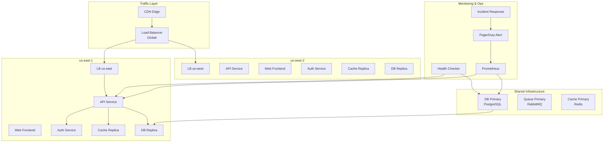
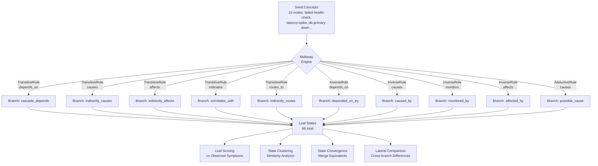
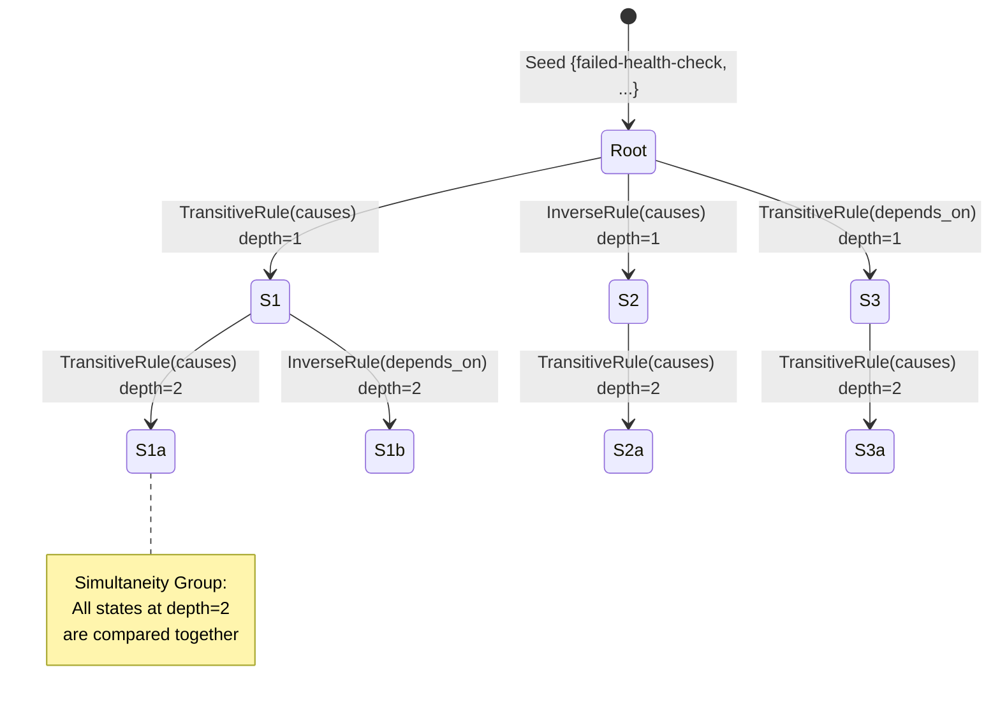
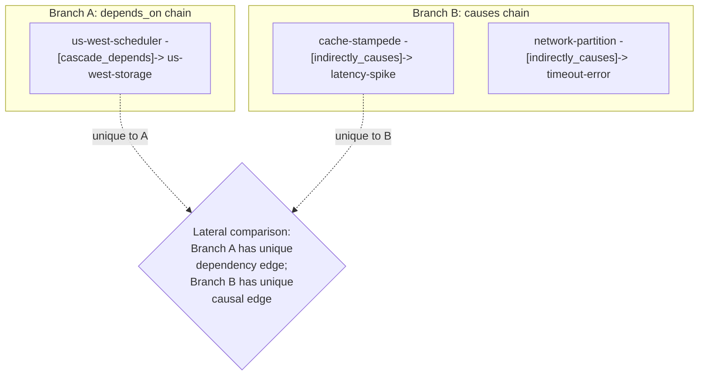

# Multiway Lateral Reasoning Showcase

> **Exploring Alternative Incident Hypotheses with Multiway Expansion**

## 1. The Approach

When a cloud infrastructure health check fails, multiple root causes are possible: database failure, network partition, bad deployment, or cache stampede.

**The Linear Bottleneck:** Traditional diagnostic logic forces agents to chase a single narrative sequence until it fails. If the hypothesis is wrong, the system must backtrack, wasting critical minutes and burning tokens while context drifts.

**The Hyper3 Approach:** The engine explores multiple hypotheses in parallel through **multiway expansion**. By applying inference rules across the hypergraph, it produces a branching state space where each branch represents a different causal explanation, then compares branches to find the best fit for the observed symptoms.

## 2. A Simple Analogy

Think of this like a doctor who simultaneously explores multiple possible diagnoses (flu, infection, allergy) rather than chasing one theory at a time. Each "branch" of reasoning represents a different diagnosis, and Hyper3 compares them to find which best explains the symptoms.

## 3. Key Concepts

| Term | Plain English Meaning |
|------|----------------------|
| **Multiway Expansion** | Exploring multiple "what if" scenarios at the same time |
| **State** | One possible version of the truth (e.g., "what if the database is down") |
| **Leaf State** | A final conclusion after applying rules -- the tip of a reasoning chain |
| **State Convergence** | When the engine merges equivalent states (same conclusions from different paths) |
| **Simultaneity Group** | Hypotheses at the same "depth" that can be compared directly |
| **Lateral Insights** | Knowledge from one branch that applies to another |

## 4. Quick Start

Run the flagship showcase to see multi-hypothesis reasoning in action:

```bash
.venv/bin/python examples/showcase/reasoning/multiway_reasoning/multiway_lateral_insights.py
```

### What You'll See

The engine explores 66 leaf states (distinct terminal hypotheses) from a single failed health check:

```
======================================================================
SECTION 2: Multiway Expansion from Failed Health Check
======================================================================
  States created:    51
  Rules applied:     50
  New edges:         50
  Branches:          46

======================================================================
SECTION 3: Branch-by-Branch Hypothesis Analysis
======================================================================
  Total leaf states: 66
```

> **Why two different numbers?** `exp.branches` (46) counts terminal states immediately after expansion. `get_leaves()` (66) returns all leaf states in the multiway graph after the state convergence engine has merged equivalent states. Convergence can cause previously internal (non-leaf) states to become leaves when their children are merged away. The 66 count is the post-convergence total and the more complete picture of distinct hypotheses. See Section 7 for a fuller explanation.

## 5. The Scenario & Topology

The example models a realistic, multi-region cloud infrastructure representing **81 nodes and 203 semantic edges**:

- **3 Geographic Regions:** `us-east`, `us-west`, `eu-west`
- **Service Mesh:** API, web, auth, cache, worker, and orchestration layers per region
- **Shared Core:** PostgreSQL primary databases, RabbitMQ queues, and Redis cache clusters
- **The Trigger:** A failed health check on `us-east-api` with associated symptoms (latency spike, connection refused)

### System Topology

Figure 1: The infrastructure we're analyzing -- three regions with shared databases.



### Edge Label Taxonomy

| Category | Labels | Meaning |
|----------|---------|---------|
| **Routing** | `routes_to`, `fails_over_to`, `hosts`, `serves` | Network traffic flow |
| **Dependency** | `depends_on`, `replicates_to`, `distributes_to` | Service reliance |
| **Causality** | `causes`, `affects`, `indicates` | Cause-effect relationships |
| **Observation** | `monitors`, `collects_from`, `traces` | Telemetry links |
| **Resolution** | `resolves`, `deploys`, `triggers` | Remediation pathways |
| **Security** | `protects`, `secures`, `authenticates` | Security boundaries |

## 6. The Analysis Pipeline (Narrative Walkthrough)

Instead of just listing technical steps, let's look at how the pipeline uncovers the story of the incident. We start with 16 seed concepts (symptoms and suspected origins) and let the engine expand.

### Phase 1: Multiway Expansion

Ten inference rules (transitive, inverse, abductive) operate simultaneously on the graph, creating a branching directed acyclic graph (DAG) of states.

Figure 2: The engine takes seed concepts and applies multiple inference rules simultaneously, creating a branching tree of hypotheses.



**Result:** 51 states created, 50 rules applied, 50 inference edges produced, 66 leaf states (after convergence).

### Phase 2: Leaf Scoring and the Tied Top Hypotheses

Each leaf state is scored against the 8 observed symptoms using a composite metric:

```
score = (edge_hits + symptom_overlap) / (total_symptoms + produced_edges + 1)
```

**The Discovery:** Multiple leaf states tie at the top score of **0.909**. These top-scoring leaves all trace back to the same set of root causes -- database failure, network partition, and cache stampede -- but reach that score through different rule chains (e.g., `transitive(causes)`, `inverse(causes)`, `abductive(causes)`).

Among the tied top hypotheses, one illustrative causal chain is:

```
db-primary-down -> db-replication-lag -> slow-query -> latency-spike -> failed-health-check
```

This chain is notable because it connects a concrete root cause (`db-primary-down`) to the observed health check failure through intermediate symptoms that are all present in the original graph edges. However, it is not THE answer -- it shares the top score with leaves arising from `network-partition` and `cache-stampede` chains.

**Key insight:** The tied scores are themselves informative. When multiple root causes produce the same explanatory power against the observed symptoms, it suggests either (a) the symptoms are insufficient to discriminate between causes, or (b) multiple root causes are contributing simultaneously. Both are realistic incident scenarios.

### Phase 3: State Clustering and Convergence

States at the same depth form **Simultaneity Groups** -- hypotheses that can be directly compared.

Figure 3: States at the same depth form groups that can be directly compared.



The 66 leaf states cluster into 5 simultaneity groups:

| Group | Dominant Rule | Hypothesis |
|-------|---------------|-----------|
| Group 1-3 | `transitive(causes)` | Database failure cascade |
| Group 4 | `transitive(depends_on)` | Dependency chain failure |
| Group 5 | `transitive(routes_to)` | Network routing issue |

#### Two Kinds of Convergence

This example reveals an important distinction between two types of convergence analysis:

**State convergence (automatic):** The `StateConvergenceEngine` merges structurally equivalent states -- states that reached the same set of graph nodes through different rule paths. This reduces redundancy in the state space. In this example, 20 states were merged. The engine reports this as "causal invariants" because each merge represents a conclusion that is invariant across different expansion paths.

**Cross-rule convergence (manual):** The showcase script also checks whether states produced by *different rule types* overlap in their target nodes. This asks: "did the `transitive(causes)` rule and the `inverse(causes)` rule independently arrive at the same conclusions?" In this example, the answer is **no** -- no pair of states from different rule types shared 2 or more target nodes. The rules explore genuinely different regions of the graph.

This is not a failure. It means the three root cause hypotheses (database, network, cache) explain *different* subsets of the observed symptoms, which is consistent with a multi-causal incident.

### Phase 4: Lateral Comparison Across Branches

By comparing states within the same simultaneity group, the engine identifies nodes and edges unique to each state, highlighting where hypotheses diverge.

Figure 4: Comparing states within the same group reveals unique knowledge.



#### The High-Level API vs. Manual Comparison

The `mem.lateral_insights(concept)` API returns **empty** for all four seed concepts tested in this example (`failed-health-check`, `db-primary-down`, `network-partition`, `bad-deploy`). This is because the API operates on the multiway state space and requires the concept to correspond to a state with sufficient clustering and coordinate data for distance-based neighbor lookup. Seed concepts are graph nodes, not multiway states -- the multiway states reference those nodes but are not themselves labeled by concept names. When the API cannot find a multiway state associated with the concept label, it returns no results.

The showcase script works around this with **manual lateral comparison** code that directly compares states within each simultaneity group. This manual comparison does produce meaningful differences:

- Some states produce `cache-stampede -> latency-spike` edges while others produce `network-partition -> timeout-error` edges
- These differences highlight which causal mechanisms each hypothesis state explores
- States within the same group that use different rules reveal genuinely distinct reasoning paths

**The Hidden Connection:** The manual comparison reveals that `cache-stampede` and `network-partition` both cause `latency-spike` through different paths. This suggests multiple root causes may be contributing simultaneously -- a pattern that linear, single-hypothesis reasoning would miss.

### The Conclusion

The evidence supports **multiple tied hypotheses** at score 0.909:

- **db-primary-down**: Causal chain through replication lag to observed symptoms, all present in original graph edges
- **network-partition**: Causal chain through DNS resolution failure to timeout errors
- **cache-stampede**: Causal chain through cache miss rate to latency spikes

No single hypothesis is THE answer. The tied scores and the structural differences across branches suggest this may be a multi-causal incident.

### Why This Matters

If we had pursued only the network-partition hypothesis, we'd have missed the database replication signal. If we had pursued only the database, we'd have missed the cache stampede path.

The multiway approach produces **multiple hypotheses ranked by evidence strength**, plus structural differences across branches. This means:
1. Start with the top-scoring hypotheses (database, network, cache -- all tied)
2. Investigate in parallel rather than sequentially
3. Use lateral comparison to watch for cascade effects between hypotheses

## 7. Understanding the Output

### Branches vs. Leaf States

The expansion report (`result.expansion`) includes a `branches` field and the multiway graph provides `get_leaves()`. These are different numbers:

| Metric | Value | When Computed | Meaning |
|--------|-------|---------------|---------|
| `exp.branches` | 46 | Immediately after expansion, before convergence | Count of terminal states in the raw expansion DAG |
| `get_leaves()` | 66 | After state convergence engine has merged equivalents | Count of all leaf states in the converged multiway graph |

The state convergence engine merges equivalent states (states that reached the same graph nodes via different rule paths). When a state is merged away, its parent may become a new leaf. This is why the post-convergence leaf count (66) is higher than the pre-convergence terminal count (46). The 66 count is the more complete picture of distinct hypotheses.

### Two Kinds of Convergence

| Type | What It Detects | Output in This Example |
|------|-----------------|----------------------|
| **State convergence** (automatic) | Structurally equivalent states produced by different expansion paths | 20 states merged (causal invariants) |
| **Cross-rule convergence** (manual) | Different rule types arriving at overlapping target nodes | No strong convergence detected |

State convergence reduces redundancy. Cross-rule convergence would indicate that different reasoning strategies independently reached the same conclusion. Both are informative but measure different things.

### Leaf Score Interpretation

| Score Range | Meaning |
|------------|---------|
| 0.9+ | Leaf explains most symptoms -- strong candidate root cause |
| 0.7-0.9 | Leaf explains a subset of symptoms -- partial match |
| 0.5-0.7 | Leaf touches some symptoms -- weak signal |
| < 0.5 | Leaf largely irrelevant to observed symptoms |

### Simultaneity Groups

States in the same simultaneity group are **at the same depth** in the multiway DAG and can be directly compared. The group number indicates which "wave" of reasoning the states belong to.

### Lateral Comparison Types

| Type | Description | Example |
|------|-------------|---------|
| **Unique edges in state A** | Inference edges present in one state but not the comparison state | A dependency chain unique to one hypothesis |
| **Unique edges in state B** | Inference edges present in the comparison state but not the reference | A causal link unique to another hypothesis |
| **Complementary** | Different states that together cover more ground | One state explains DB issues, another explains network |

## 8. Key Metrics

| Metric | Value |
|--------|-------|
| Graph nodes | 81 |
| Graph edges (initial) | 203 |
| Graph edges (after reasoning) | 253 |
| Seed concepts | 16 |
| Inference rules | 10 |
| States created | 51 |
| Rules applied | 50 |
| Inference edges produced | 50 |
| Leaf states (post-convergence) | 66 |
| Simultaneity groups | 5 |
| Causal invariants merged (state convergence) | 20 |
| Cross-rule convergent pairs | 0 |
| Cross-branch edge differences (manual) | 6 |
| Best leaf score | 0.909 (tied across multiple leaves) |

## 9. What Makes This Different

Traditional diagnostic systems follow a **single path**: pick the most likely hypothesis, pursue it, backtrack if wrong. Hyper3's multiway engine explores **multiple hypotheses in parallel** through a branching state space, then uses structural comparison to identify:

1. **Which leaves best explain the evidence** (leaf scoring)
2. **Which expansion paths converge on the same conclusions** (state convergence)
3. **What knowledge from one branch applies to another** (lateral comparison)

This approach is useful in incident response where the root cause is unknown -- instead of pursuing one hypothesis at a time, you get a ranked set of candidates with structural comparisons across branches.

## 10. The 10 Inference Rules

Ten inference rules operate simultaneously on the graph:

| Rule | Edge Pattern | Produces | Purpose |
|------|-------------|----------|---------|
| `TransitiveRule(causes)` | A-[causes]->B, B-[causes]->C | A-[indirectly_causes]->C | Chain cause-effect |
| `TransitiveRule(depends_on)` | A-[depends_on]->B, B-[depends_on]->C | A-[cascade_depends]->C | Dependency chains |
| `TransitiveRule(affects)` | A-[affects]->B, B-[causes]->C | A-[indirectly_affects]->C | Impact propagation |
| `TransitiveRule(indicates)` | A-[indicates]->B, B-[indicates]->C | A-[correlates_with]->C | Symptom correlation |
| `TransitiveRule(routes_to)` | A-[routes_to]->B, B-[routes_to]->C | A-[indirectly_routes]->C | Network path tracing |
| `InverseRule(causes)` | A-[causes]->B | B-[caused_by]->A | Reverse causality |
| `InverseRule(depends_on)` | A-[depends_on]->B | B-[depended_on_by]->A | Reverse dependency |
| `InverseRule(monitors)` | A-[monitors]->B | B-[monitored_by]->A | Reverse telemetry |
| `InverseRule(affects)` | A-[affects]->B | B-[affected_by]->A | Reverse impact |
| `AbductiveRule(causes)` | A-[causes]->B (B observed) | B-[possible_cause]->A | Diagnostic inference |

## 11. Code Implementation

Building this reasoning pipeline in Hyper3 requires minimal boilerplate.

**1. Register the Inference Rules**

```python
rules = [
    TransitiveRule(edge_label="depends_on", new_label="cascade_depends"),
    TransitiveRule(edge_label="causes", new_label="indirectly_causes"),
    InverseRule(edge_label="monitors", inverse_label="monitored_by"),
    AbductiveRule(effect_label="causes", cause_label="possible_cause"),
]
mem.add_rules(*rules)
```

**2. Seed and Reason**

```python
seed = {"failed-health-check", "latency-spike", "db-primary-down", "us-east-api"}
result = mem.reason(seeds=seed, depth=3, max_states=50)
```

**3. Extract Leaf States and Score**

```python
mw_graph = mem.multiway.multiway
leaves = mw_graph.get_leaves()

for leaf in leaves:
    score = score_branch_against_symptoms(mem, leaf, symptom_ids)
```

**4. Compare Across Simultaneity Groups**

```python
for group in mem.state_clustering.simultaneity_groups:
    for state_a, state_b in pairs(group.state_ids):
        unique_a = edges(state_a) - edges(state_b)
        unique_b = edges(state_b) - edges(state_a)
```

## 12. The Observability Gap (Real-World Integration)

Hyper3 performs rule-based inference once the semantic graph exists. The real-world challenge is the data engineering pipeline required to build and maintain that graph:

1. **Relationship Extraction:** Converting raw Terraform/K8s telemetry into semantic edges (`depends_on`)
2. **Causal Discovery:** Using time-series algorithms (Granger causality) to separate true causation from metric correlation
3. **Ontology Mapping:** Normalizing disparate vendor labels into a canonical schema
4. **Knowledge Construction:** Building a federated pipeline to ingest real-time events without contradicting state

**Theoretical pipeline:**

```
Terraform/ K8s manifests
        |
  [Entity Extraction] -> nodes with types
        |
Jaeger traces + Prometheus metrics
        |
  [Relationship Inference] -> raw edges
        |
  [Causal Discovery] -> causal edges (causes, affects)
        |
  [Semantic Labeling] -> canonical edge types
        |
  [Entity Resolution] -> merge duplicates
        |
  [Validation] -> check graph consistency
        |
    Hyper3 Graph (ready for multiway reasoning)
```

**Current state in Hyper3:** The showcase demonstrates what's possible **once the graph exists**. The pipeline above is **out of scope** for Hyper3 core -- it's the data engineering layer that feeds Hyper3.

**For real-world adoption**, organizations would need to build or buy:
- ETL tools for their specific stack (Terraform + Datadog + Jaeger)
- Semantic labeling rules tuned to their architecture
- Causal discovery tuned to their metric patterns

Hyper3 provides the **reasoning engine**; the data engineering pipeline that feeds it is a separate concern.

## 13. Reference Taxonomy and API

### Core Concept Glossary

| Term | Semantic Definition |
| ----- | ----- |
| **Multiway Expansion** | Exploring multiple "what if" scenarios simultaneously |
| **State** | One possible version of the truth within the graph |
| **Leaf State** | A terminal state in the multiway DAG after all rules have been applied |
| **State Convergence** | Merging structurally equivalent states from different expansion paths |
| **Simultaneity Group** | Hypotheses at the same logical depth compared directly |
| **Lateral Comparison** | Identifying structural differences between states in the same group |

### Key API Methods

| Method | Purpose |
| ----- | ----- |
| `mem.reason(seeds, depth, max_states)` | Run multiway expansion from seed nodes |
| `mem.lateral_insights(concept)` | Find knowledge transferable across branches (requires state-space association) |
| `mem.state_clustering.simultaneity_groups` | Get groups of states at the same depth |
| `mem.state_clustering.coordinates` | Get state coordinate embeddings |
| `result.clustering` | State clustering report from reasoning |
| `result.state_convergence` | Merge report from state convergence |
| `result.expansion` | Expansion statistics (states, rules, edges, branches) |

### Related Examples

| Example | Focus |
|---------|-------|
| `examples/showcase/workflow/self_evolving_cognition/self_evolving_cognition.py` | Feedback-driven evolution, metamorphosis validation |
| `examples/showcase/belief/adaptive_learning/adaptive_learning.py` | Rule effectiveness learning, Thompson sampling |
| `examples/showcase/domain/infrastructure_self_healing/infrastructure_self_healing.py` | Multiway reasoning + feedback loop integration |
| `examples/showcase/domain/medical_diagnosis/medical_diagnosis.py` | Backward chaining for differential diagnosis |
| `examples/showcase/domain/fraud_detection/fraud_detection_intelligence.py` | Cycle detection, funnel account identification |
