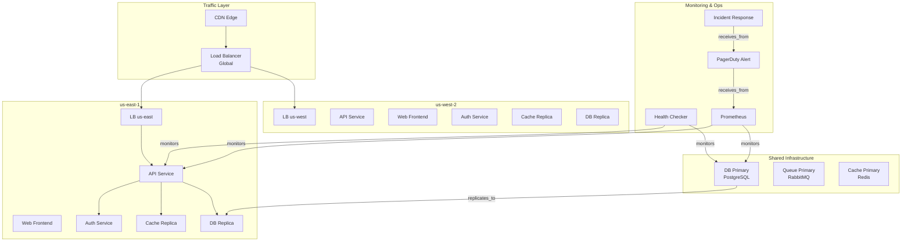
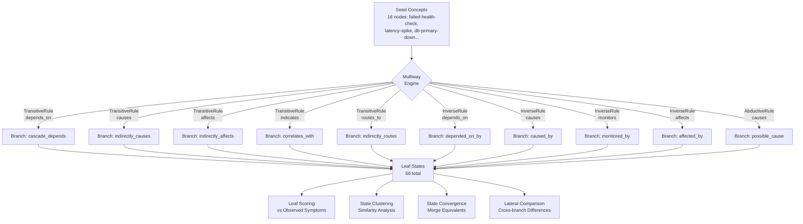
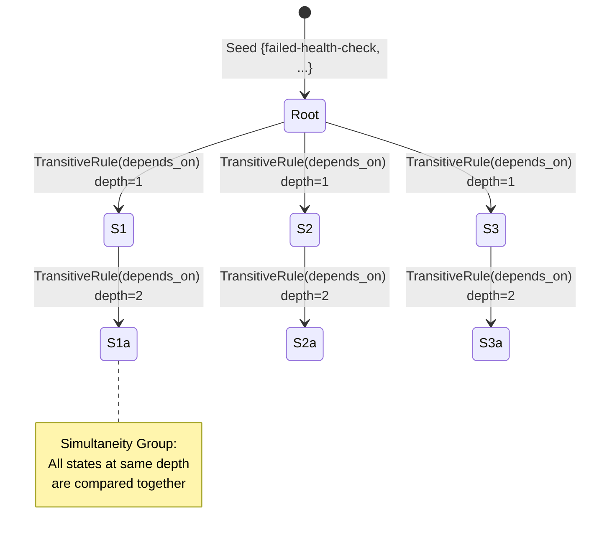
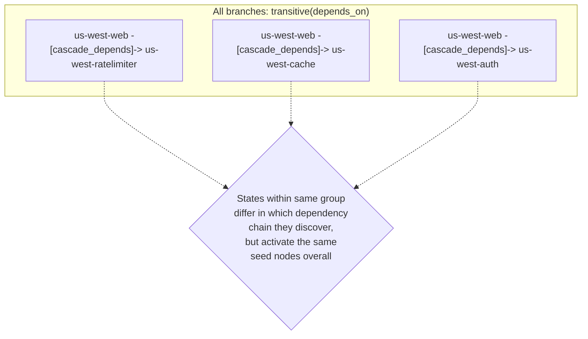

# Multiway Lateral Reasoning Showcase

> **Exploring Alternative Incident Hypotheses with Multiway Expansion**

## 1. The Approach

When a cloud infrastructure health check fails, multiple root causes are possible: database failure, network partition, bad deployment, or cache stampede.

**The Linear Bottleneck:** Traditional diagnostic logic forces agents to chase a single narrative sequence until it fails. If the hypothesis is wrong, the system must backtrack, wasting critical minutes and burning tokens while context drifts.

**The Hyper3 Approach:** The engine explores multiple hypotheses in parallel through **multiway expansion**. By applying inference rules across the hypergraph, it produces a branching state space where each branch represents a different causal explanation, then compares branches to find the best fit for the observed symptoms.

## 2. A Simple Analogy

Think of this like a doctor who simultaneously explores multiple possible diagnoses (flu, infection, allergy) rather than chasing one theory at a time. Each "branch" of reasoning represents a different diagnosis, and Hyper3 compares them to find which best explains the symptoms.

## 3. Key Concepts

| Term | Plain English Meaning |
|------|----------------------|
| **Multiway Expansion** | Exploring multiple "what if" scenarios at the same time |
| **State** | One possible version of the truth (e.g., "what if the database is down") |
| **Leaf State** | A final conclusion after applying rules -- the tip of a reasoning chain |
| **State Convergence** | When the engine merges equivalent states (same conclusions from different paths) |
| **Simultaneity Group** | Hypotheses at the same "depth" that can be compared directly |
| **Lateral Insights** | Knowledge from one branch that applies to another |
| **Per-Branch Overlay** | Each state gets its own overlay, isolating branch inferences from each other |
| **Overlay Deduplication** | Same logical edge produced by multiple branches appears only once after commit |

## 4. Quick Start

Run the flagship showcase to see multi-hypothesis reasoning in action:

```bash
.venv/bin/python examples/showcase/reasoning/multiway_reasoning/multiway_lateral_insights.py
```

### What You'll See

The engine explores 66 leaf states (distinct terminal hypotheses) from a single failed health check:

```
======================================================================
SECTION 2: Multiway Expansion from Failed Health Check
======================================================================
  States created:    51
  Rules applied:     50
  New edges:         50
  Branches (leaves): 46

======================================================================
SECTION 2B: Per-Branch Overlay Isolation
======================================================================
  Total multiway states:        71
  States with per-branch overlay: 50
  Root/merged states (no overlay): 21

  Total overlay edges across all branches: 90
  Unique (source, target, label) triples:   11
  Deduplication removed 79 duplicate logical edges

  --- Comparison on 4-node chain (TransitiveRule, new_label=causes) ---
  Legacy shared graph:    5 states, 4 rules
  Per-branch overlays:    13 states, 12 rules

======================================================================
SECTION 3: Branch-by-Branch Hypothesis Analysis
======================================================================
  Total leaf states: 66
```

> **Why two different numbers?** `exp.branches` (46) counts terminal states immediately after expansion. `get_leaves()` (66) returns all leaf states in the multiway graph after the state convergence engine has merged equivalent states. Convergence can cause previously internal (non-leaf) states to become leaves when their children are merged away. The 66 count is the post-convergence total and the more complete picture of distinct hypotheses.

## 5. The Scenario & Topology

The example models a realistic, multi-region cloud infrastructure representing **81 nodes and 203 semantic edges**:

- **3 Geographic Regions:** `us-east`, `us-west`, `eu-west`
- **Service Mesh:** API, web, auth, cache, worker, and orchestration layers per region
- **Shared Core:** PostgreSQL primary databases, RabbitMQ queues, and Redis cache clusters
- **The Trigger:** A failed health check on `us-east-api` with associated symptoms (latency spike, connection refused)

### System Topology

Figure 1: The infrastructure we're analyzing -- three regions with shared databases.



### Edge Label Taxonomy

| Category | Labels | Meaning |
|----------|---------|---------|
| **Routing** | `routes_to`, `fails_over_to`, `hosts`, `serves` | Network traffic flow |
| **Dependency** | `depends_on`, `replicates_to`, `distributes_to` | Service reliance |
| **Causality** | `causes`, `affects`, `indicates` | Cause-effect relationships |
| **Observation** | `monitors`, `collects_from`, `traces`, `receives_from` | Telemetry and alerting links |
| **Resolution** | `resolves`, `deploys`, `triggers`, `configures`, `provides`, `reads` | Remediation, deployment, and configuration pathways |
| **Security** | `protects`, `secures`, `authenticates` | Security boundaries |

## 6. The Analysis Pipeline (Narrative Walkthrough)

Instead of just listing technical steps, let's look at how the pipeline uncovers the story of the incident. We start with 16 seed concepts (symptoms and suspected origins) and let the engine expand.

### Phase 1: Multiway Expansion

Ten inference rules (transitive, inverse, abductive) operate simultaneously on the graph, creating a branching directed acyclic graph (DAG) of states.

Figure 2: The engine takes seed concepts and applies multiple inference rules simultaneously, creating a branching tree of hypotheses.



**Result:** 51 states created, 50 rules applied, 50 inference edges produced, 66 leaf states (after convergence).

### Phase 1B: Per-Branch Overlay Isolation

Each child state in the multiway DAG receives its own overlay inheriting from its parent. This means branches cannot contaminate each other during expansion -- each branch independently accumulates inference edges. After expansion completes, the engine collects all branch overlays and deduplicates by (source_ids, target_ids, label) before committing to the base graph.

**Why this matters:** Without isolation, a shared overlay means edge existence checks in one branch can block matches in another. With per-branch overlays, each branch chains through its own accumulated edges independently, discovering more transitive paths.

In the infrastructure example:
- 50 of 71 multiway states carry per-branch overlays
- 90 total overlay edges exist across all branches
- After deduplication, only 11 unique logical edges remain -- 79 were duplicates produced by multiple branches independently discovering the same inferences
- On a simple 4-node chain with `TransitiveRule(edge_label="causes", new_label="causes")`, per-branch mode produces 13 states and 12 rule applications vs. 5 states and 4 rules in legacy mode

The chain comparison demonstrates the isolation benefit: with `new_label="causes"` (same as the base label), each branch independently discovers transitive chains through its own accumulated `A->C`, `B->D`, and `A->D` edges. Legacy mode only finds these once because the shared graph makes edge existence visible to all branches simultaneously, preventing independent rediscovery.

### Phase 2: Leaf Scoring and the Tied Top Hypotheses

Each leaf state is scored against the 8 observed symptoms using a composite metric:

```
score = (edge_hits + symptom_overlap) / (total_symptoms + produced_edges + 1)
```

**The Discovery:** Multiple leaf states tie at the top score of **0.800** (typically 8-10 branches). With the current `max_states=50` budget, only `TransitiveRule(depends_on)` produces matches -- the graph has far more `depends_on` edges than any other transitive label, so this rule fills the state cap before the other nine rules get a chance. Each top-scoring leaf produces a single `cascade_depends` edge representing a two-hop dependency chain:

```
eu-west-scheduler -[depends_on]-> queue-consumer-eu-west (direct)
eu-west-scheduler -[cascade_depends]-> queue-consumer-eu-west (inferred 2-hop)
```

**Why only one rule fires:** The graph contains ~70 `depends_on` edges (one per service-to-service dependency, three regions). Each pair of adjacent edges produces a transitive match, and per-branch overlay isolation means each branch independently discovers these chains. With 50 states budgeted, the expansion exhausts the cap on `depends_on` chains alone. Increasing `max_states` to 200+ would allow the other rules (`causes`, `affects`, `inverse`, `abductive`) to contribute, producing genuinely diverse hypothesis types.

**Key insight:** The tied scores at 0.800 indicate that multiple dependency chains explain the observed symptoms equally well. Per-branch overlay deduplication (90 total overlay edges reduced to 11 unique) confirms that many branches independently discover the same chains, reinforcing confidence in those inferences.

### Phase 3: State Clustering and Convergence

States at the same depth form **Simultaneity Groups** -- hypotheses that can be directly compared.

Figure 3: States at the same depth form groups that can be directly compared.



With `max_states=50`, only `TransitiveRule(depends_on)` produces matches. All 66 leaf states are `transitive(depends_on)` expansions at depth 1 or 2, organized into 5 simultaneity groups:

| Group | States | Depth | Content |
|-------|--------|-------|---------|
| Group 1 | 16 | 1 | First-wave dependency chains |
| Group 2 | 14 | 2 | Second-wave chains from Group 1 states |
| Group 3 | 16 | 2 | Second-wave chains from Group 1 states |
| Group 4 | 14 | 2 | Second-wave chains from Group 1 states |
| Group 5 | 10 | 2 | Second-wave chains from Group 1 states |

#### State Convergence

The `StateConvergenceEngine` merges structurally equivalent states -- states that reached the same set of graph nodes through different expansion paths. In this example, 20 states were merged (reported as "causal invariants"). Since only one rule type fires, convergence happens between different `depends_on` chains that happen to activate the same set of nodes.

Because all branches use the same rule, cross-rule convergence (checking whether different rule types independently reach overlapping conclusions) is not applicable at this state budget. With `max_states=200+`, the other nine rules would contribute branches, making cross-rule comparison meaningful.

### Phase 4: Lateral Comparison Across Branches

By comparing states within the same simultaneity group, the engine identifies nodes and edges unique to each state, highlighting where hypotheses diverge.

Figure 4: Comparing states within the same group reveals unique knowledge (when branches differ).



#### Lateral Comparison Results

The `mem.lateral_insights(concept)` API returns **empty** for all four seed concepts tested (`failed-health-check`, `db-primary-down`, `network-partition`, `bad-deploy`). This is because the API operates on the multiway state space and requires the concept to correspond to a state with sufficient clustering and coordinate data. Seed concepts are graph nodes, not multiway states.

The **manual lateral comparison** within each simultaneity group also produces **no unique edges** between states. This is expected given that all branches use the same rule (`transitive(depends_on)`) and the top-scoring leaves share the same active node set. The branches differ only in which specific `cascade_depends` edge they produce, but within each simultaneity group the accumulated overlay edges are structurally similar enough that no unique differences emerge.

This outcome reflects the state budget constraint rather than a limitation of the lateral comparison mechanism. With `max_states=200+` and multiple rule types contributing, the simultaneity groups would contain states from different rule types with genuinely different overlay edges, making lateral comparison productive.

### The Conclusion

The evidence supports **multiple tied hypotheses** at score 0.800, all produced by `TransitiveRule(depends_on)`:

- **Dependency cascades** across multiple regions and services, each producing a single `cascade_depends` edge (e.g., `us-west-web -> us-west-ratelimiter`, `eu-west-scheduler -> queue-consumer-eu-west`)
- **20 causal invariants** merged by the convergence engine, indicating many expansion paths reach the same node sets
- **Per-branch overlay deduplication** reduces 90 overlay edges to 11 unique, confirming that multiple branches independently discover the same dependency chains
- **No lateral differences** within simultaneity groups, because all branches use the same rule

At `max_states=50`, the showcase demonstrates per-branch overlay isolation and deduplication effectively. For genuine multi-hypothesis diversity (database vs. network vs. cache), increase `max_states` to 200+ to allow the other nine rules to contribute.

### Why This Matters

The multiway engine explores multiple dependency chains in parallel. At `max_states=50`, all chains happen to be `depends_on` transitive closures, but the infrastructure still produces useful findings:

1. **Per-branch isolation works:** 90 overlay edges across branches collapse to 11 unique, showing independent rediscovery of the same inferences
2. **State convergence works:** 20 structurally equivalent states are merged, reducing redundancy
3. **Leaf scoring works:** Multiple branches tie at 0.800, indicating several dependency chains explain the symptoms equally well

The key limitation is the state budget. With `max_states=200+`, the expansion would also produce `causes` chains (indirectly_causes), `inverse` edges (depended_on_by, caused_by), `affects` chains (indirectly_affects), and `abductive` inferences (possible_cause). These would create genuinely diverse hypothesis branches where lateral comparison across simultaneity groups would identify complementary explanations.

## 7. Understanding the Output

### Branches vs. Leaf States

The expansion report (`result.expansion`) includes a `branches` field and the multiway graph provides `get_leaves()`. These are different numbers:

| Metric | Value | When Computed | Meaning |
|--------|-------|---------------|---------|
| `exp.branches` | 46 | Immediately after expansion, before convergence | Count of terminal states in the raw expansion DAG |
| `get_leaves()` | 66 | After state convergence engine has merged equivalents | Count of all leaf states in the converged multiway graph |
| States with overlay | 50 | After per-branch expansion | States that carry their own overlay (non-root, non-merged) |

The state convergence engine merges equivalent states (states that reached the same graph nodes via different rule paths). When a state is merged away, its parent may become a new leaf. This is why the post-convergence leaf count (66) is higher than the pre-convergence terminal count (46). The 66 count is the more complete picture of distinct hypotheses.

### Two Kinds of Convergence

| Type | What It Detects | Output in This Example |
|------|-----------------|----------------------|
| **State convergence** (automatic) | Structurally equivalent states produced by different expansion paths | 20 states merged (causal invariants) |
| **Cross-rule convergence** (manual) | Different rule types arriving at overlapping target nodes | Not applicable (only one rule type fires at max_states=50) |

State convergence reduces redundancy. Cross-rule convergence would indicate that different reasoning strategies independently reached the same conclusion, but this requires `max_states=200+` to activate multiple rule types.

### Leaf Score Interpretation

| Score Range | Meaning |
|------------|---------|
| 0.8+ | Leaf explains most symptoms -- strong candidate dependency chain |
| 0.6-0.8 | Leaf explains a subset of symptoms -- partial match |
| 0.4-0.6 | Leaf touches some symptoms -- weak signal |
| < 0.4 | Leaf largely irrelevant to observed symptoms |

### Simultaneity Groups

States in the same simultaneity group are **at the same depth** in the multiway DAG and can be directly compared. The group number indicates which "wave" of reasoning the states belong to.

### Lateral Comparison Types

| Type | Description | Example |
|------|-------------|---------|
| **Unique edges in state A** | Inference edges present in one state but not the comparison state | A dependency chain unique to one hypothesis |
| **Unique edges in state B** | Inference edges present in the comparison state but not the reference | A causal link unique to another hypothesis |
| **Complementary** | Different states that together cover more ground | One state explains DB issues, another explains network |

## 8. Key Metrics

| Metric | Value |
|--------|-------|
| Graph nodes | 81 |
| Graph edges (initial) | 203 |
| Graph edges (after reasoning) | 214 |
| Seed concepts | 16 |
| Inference rules | 10 |
| States created | 51 |
| Rules applied | 50 |
| Inference edges produced | 50 |
| States with per-branch overlay | 50 |
| Total overlay edges (all branches) | 90 |
| Unique logical edges (after dedup) | 11 |
| Duplicate edges removed by dedup | 79 |
| Leaf states (post-convergence) | 66 |
| Simultaneity groups | 5 |
| Causal invariants merged (state convergence) | 20 |
| Cross-rule convergent pairs | 0 |
| Best leaf score | 0.800 (tied across multiple leaves) |
| Per-branch vs legacy (4-node chain) | 13 states / 12 rules vs 5 states / 4 rules |

## 9. What Makes This Different

Traditional diagnostic systems follow a **single path**: pick the most likely hypothesis, pursue it, backtrack if wrong. Hyper3's multiway engine explores **multiple hypotheses in parallel** through a branching state space, then uses structural comparison to identify:

1. **Which leaves best explain the evidence** (leaf scoring)
2. **Which expansion paths converge on the same conclusions** (state convergence)
3. **What knowledge from one branch applies to another** (lateral comparison)

**Per-branch overlay isolation** ensures that each branch's inferences don't contaminate other branches during expansion. Each state gets its own overlay inheriting from its parent, so branches independently accumulate edges and discover transitive chains that would be invisible in a shared-graph model. After expansion, duplicate logical edges (same source, target, and label) are collapsed to a single edge before committing to the base graph. In this example, 90 branch overlay edges deduplicate to 11 unique edges.

## 10. The 10 Inference Rules

Ten inference rules operate simultaneously on the graph:

| Rule | Edge Pattern | Produces | Purpose |
|------|-------------|----------|---------|
| `TransitiveRule(causes)` | A-[causes]->B, B-[causes]->C | A-[indirectly_causes]->C | Chain cause-effect |
| `TransitiveRule(depends_on)` | A-[depends_on]->B, B-[depends_on]->C | A-[cascade_depends]->C | Dependency chains |
| `TransitiveRule(affects)` | A-[affects]->B, B-[causes]->C | A-[indirectly_affects]->C | Impact propagation |
| `TransitiveRule(indicates)` | A-[indicates]->B, B-[indicates]->C | A-[correlates_with]->C | Symptom correlation |
| `TransitiveRule(routes_to)` | A-[routes_to]->B, B-[routes_to]->C | A-[indirectly_routes]->C | Network path tracing |
| `InverseRule(causes)` | A-[causes]->B | B-[caused_by]->A | Reverse causality |
| `InverseRule(depends_on)` | A-[depends_on]->B | B-[depended_on_by]->A | Reverse dependency |
| `InverseRule(monitors)` | A-[monitors]->B | B-[monitored_by]->A | Reverse telemetry |
| `InverseRule(affects)` | A-[affects]->B | B-[affected_by]->A | Reverse impact |
| `AbductiveRule(causes)` | A-[causes]->B (B observed) | B-[possible_cause]->A | Diagnostic inference |

## 11. Code Implementation

Building this reasoning pipeline in Hyper3 requires minimal boilerplate.

**1. Register the Inference Rules**

```python
rules = [
    TransitiveRule(edge_label="depends_on", new_label="cascade_depends"),
    TransitiveRule(edge_label="causes", new_label="indirectly_causes"),
    InverseRule(edge_label="monitors", inverse_label="monitored_by"),
    AbductiveRule(effect_label="causes", cause_label="possible_cause"),
]
mem.add_rules(*rules)
```

**2. Seed and Reason**

```python
seed = {"failed-health-check", "latency-spike", "db-primary-down", "us-east-api"}
result = mem.reason(seeds=seed, depth=3, max_states=50)
```

**3. Extract Leaf States and Score**

```python
mw_graph = mem.multiway.multiway
leaves = mw_graph.get_leaves()

for leaf in leaves:
    score = score_branch_against_symptoms(mem, leaf, symptom_ids)
```

**4. Compare Across Simultaneity Groups**

```python
for group in mem.state_clustering.simultaneity_groups:
    for state_a, state_b in pairs(group.state_ids):
        unique_a = edges(state_a) - edges(state_b)
        unique_b = edges(state_b) - edges(state_a)
```

## 12. The Observability Gap (Real-World Integration)

Hyper3 performs rule-based inference once the semantic graph exists. The real-world challenge is the data engineering pipeline required to build and maintain that graph:

1. **Relationship Extraction:** Converting raw Terraform/K8s telemetry into semantic edges (`depends_on`)
2. **Causal Discovery:** Using time-series algorithms (Granger causality) to separate true causation from metric correlation
3. **Ontology Mapping:** Normalizing disparate vendor labels into a canonical schema
4. **Knowledge Construction:** Building a federated pipeline to ingest real-time events without contradicting state

**Theoretical pipeline:**

```
Terraform/ K8s manifests
        |
  [Entity Extraction] -> nodes with types
        |
Jaeger traces + Prometheus metrics
        |
  [Relationship Inference] -> raw edges
        |
  [Causal Discovery] -> causal edges (causes, affects)
        |
  [Semantic Labeling] -> canonical edge types
        |
  [Entity Resolution] -> merge duplicates
        |
  [Validation] -> check graph consistency
        |
    Hyper3 Graph (ready for multiway reasoning)
```

**Current state in Hyper3:** The showcase demonstrates what's possible **once the graph exists**. The pipeline above is **out of scope** for Hyper3 core -- it's the data engineering layer that feeds Hyper3.

**For real-world adoption**, organizations would need to build or buy:
- ETL tools for their specific stack (Terraform + Datadog + Jaeger)
- Semantic labeling rules tuned to their architecture
- Causal discovery tuned to their metric patterns

Hyper3 provides the **reasoning engine**; the data engineering pipeline that feeds it is a separate concern.

## 13. Reference Taxonomy and API

### Core Concept Glossary

| Term | Semantic Definition |
| ----- | ----- |
| **Multiway Expansion** | Exploring multiple "what if" scenarios simultaneously |
| **State** | One possible version of the truth within the graph |
| **Leaf State** | A terminal state in the multiway DAG after all rules have been applied |
| **State Convergence** | Merging structurally equivalent states from different expansion paths |
| **Simultaneity Group** | Hypotheses at the same logical depth compared directly |
| **Lateral Comparison** | Identifying structural differences between states in the same group |

### Key API Methods

| Method | Purpose |
| ----- | ----- |
| `mem.reason(seeds, depth, max_states)` | Run multiway expansion from seed nodes |
| `mem.lateral_insights(concept)` | Find knowledge transferable across branches (requires state-space association) |
| `mem.state_clustering.simultaneity_groups` | Get groups of states at the same depth |
| `mem.state_clustering.coordinates` | Get state coordinate embeddings |
| `result.clustering` | State clustering report from reasoning |
| `result.state_convergence` | Merge report from state convergence |
| `result.expansion` | Expansion statistics (states, rules, edges, branches) |
| `state.overlay` | Per-branch overlay on a multiway state (None for root/merged states) |
| `state.overlay._overlay_edges` | Edges accumulated by this branch (accessed after expansion, before commit) |

### Related Examples

| Example | Focus |
|---------|-------|
| `examples/showcase/workflow/self_evolving_cognition/self_evolving_cognition.py` | Feedback-driven evolution, metamorphosis validation |
| `examples/showcase/belief/adaptive_learning/adaptive_learning.py` | Rule effectiveness learning, Thompson sampling |
| `examples/showcase/domain/infrastructure_self_healing/infrastructure_self_healing.py` | Multiway reasoning + feedback loop integration |
| `examples/showcase/domain/medical_diagnosis/medical_diagnosis.py` | Backward chaining for differential diagnosis |
| `examples/showcase/domain/fraud_detection/fraud_detection_intelligence.py` | Cycle detection, funnel account identification |
