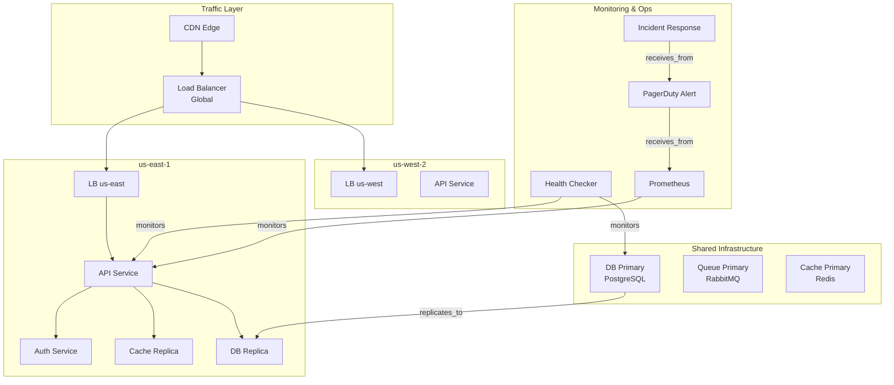
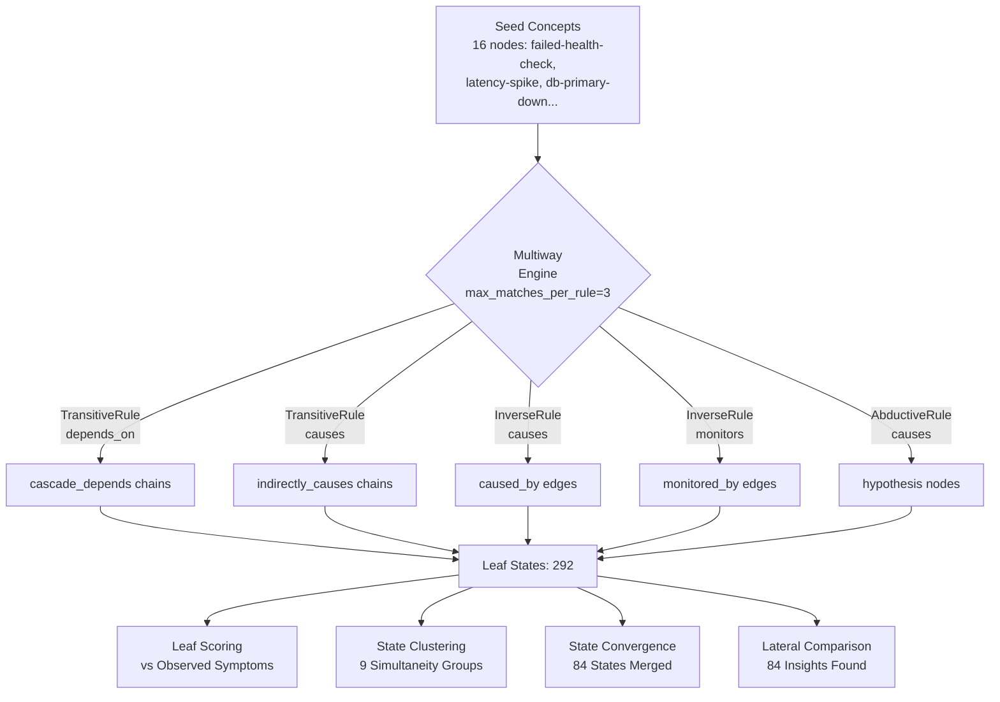

# Multiway Lateral Reasoning Showcase

> **Exploring Alternative Incident Hypotheses with Multiway Expansion**

## 1. The Approach

When a cloud infrastructure health check fails, multiple root causes are possible: database failure, network partition, bad deployment, or cache stampede.

**The Linear Bottleneck:** Traditional diagnostic logic forces agents to chase a single narrative sequence until it fails. If the hypothesis is wrong, the system must backtrack, wasting critical minutes.

**The Hyper3 Approach:** The engine explores multiple hypotheses in parallel through **multiway expansion**. Ten inference rules operate simultaneously on the hypergraph, producing a branching DAG where each leaf represents a different causal explanation. Branches are then compared to find the best fit for the observed symptoms.

## 2. A Simple Analogy

Think of this like a doctor who simultaneously explores multiple possible diagnoses (flu, infection, allergy) rather than chasing one theory at a time. Each "branch" of reasoning represents a different diagnosis, and Hyper3 compares them to find which best explains the symptoms.

## 3. Key Concepts

| Term | Plain English Meaning |
|------|----------------------|
| **Multiway Expansion** | Exploring multiple "what if" scenarios at the same time |
| **State** | One possible version of the truth (e.g., "what if the database is down") |
| **Leaf State** | A final conclusion after applying rules -- the tip of a reasoning chain |
| **State Convergence** | When the engine merges equivalent states (same conclusions from different paths) |
| **Simultaneity Group** | Hypotheses at the same "depth" that can be compared directly |
| **Lateral Insights** | Knowledge from one branch that applies to another |
| **Per-Branch Overlay** | Each state gets its own overlay, isolating branch inferences from each other |
| **Overlay Deduplication** | Same logical edge produced by multiple branches appears only once after commit |
| **`max_matches_per_rule`** | Caps how many matches each rule may contribute per state, ensuring all rule types get representation |

## 4. Quick Start

```bash
.venv/bin/python examples/showcase/reasoning/multiway_reasoning/multiway_lateral_insights.py
```

### What You'll See

```
======================================================================
SECTION 1: Cloud Infrastructure Graph
======================================================================
  Nodes: 81
  Edges: 203

======================================================================
SECTION 2: Multiway Expansion from Failed Health Check
======================================================================
  States created:    217
  Rules applied:     216
  New edges:         216
  New nodes:         27
  Max depth:         2
  Branches (leaves): 208

  Rule type distribution across states:
    inverse(monitors->monitored_by): 51
    inverse(affects->affected_by): 51
    inverse(causes->caused_by): 47
    inverse(depends_on->depended_on_by): 39
    transitive(routes_to): 31
    transitive(depends_on): 27
    transitive(causes): 27
    abductive(causes): 27

======================================================================
SECTION 3: Branch-by-Branch Hypothesis Analysis
======================================================================
  Total leaf states: 292

  Top branches by symptom explanation power (one per rule type):

  Branch 1: score=0.900  depth=1  rule=inverse(causes->caused_by)
    Inferred edges:
      failed-health-check-[caused_by]->bad-deploy

  Branch 2: score=0.900  depth=1  rule=abductive(causes)
    Inferred edges:
      hypothesis:connection-refused-[possible_cause]->failed-health-check

  Branch 3: score=0.900  depth=2  rule=transitive(causes)
    Inferred edges:
      db-primary-down-[indirectly_causes]->failed-health-check
```

> **Why two node counts?** The graph starts with 81 nodes. `mem.reason()` commits the overlay after expansion. The AbductiveRule creates hypothesis nodes (`hypothesis:bad-deploy`, `hypothesis:connection-refused`, `hypothesis:timeout-error`), so the summary shows 108 nodes and 254 edges after inference.

## 5. The Scenario & Topology

The example models a realistic, multi-region cloud infrastructure: **81 nodes and 203 semantic edges**.

- **3 Geographic Regions:** `us-east`, `us-west`, `eu-west`
- **Service Mesh:** API, web, auth, cache, worker, and orchestration layers per region
- **Shared Core:** PostgreSQL primary databases, RabbitMQ queues, and Redis cache clusters
- **The Trigger:** A health check failure with associated symptoms (latency spike, connection refused)

### System Topology

Figure 1: Three regions with shared databases and a central load balancer.



### Edge Label Taxonomy

| Category | Labels | Meaning |
|----------|---------|---------|
| **Routing** | `routes_to`, `fails_over_to`, `hosts`, `serves` | Network traffic flow |
| **Dependency** | `depends_on`, `replicates_to`, `distributes_to` | Service reliance |
| **Causality** | `causes`, `affects`, `indicates` | Cause-effect relationships |
| **Observation** | `monitors`, `collects_from`, `traces`, `receives_from` | Telemetry and alerting links |
| **Resolution** | `resolves`, `deploys`, `triggers`, `configures`, `provides`, `reads` | Remediation, deployment, and configuration |
| **Security** | `protects`, `secures`, `authenticates` | Security boundaries |

## 6. The Analysis Pipeline

### Phase 1: Multiway Expansion

Ten inference rules operate simultaneously on the graph. The `max_matches_per_rule=3` parameter ensures each rule contributes at most 3 matches per state, preventing any single high-productivity rule (like `TransitiveRule(depends_on)` with 55 candidate edges) from consuming the entire expansion budget.

Figure 2: The engine applies 10 rules in parallel, creating a branching hypothesis tree.



**Result:** 217 states created, 216 rules applied, 8 distinct rule types fired, 292 leaf states after convergence.

### Phase 1B: Per-Branch Overlay Isolation

Each child state receives its own `HypergraphOverlay` inheriting from its parent. Branches accumulate inferred edges independently. When two branches in the same group apply `TransitiveRule(causes)` and `InverseRule(monitors)` respectively, their inferences are computed against their own branch's graph -- not against a shared graph that would prevent independent re-discovery.

After expansion, `_collect_branch_overlays()` deduplicates by `(source_ids, target_ids, label)` before committing to the base graph:

- 408 total overlay edges across all branches
- 51 unique logical edges after deduplication
- 357 duplicate logical edges removed

**Per-branch vs legacy comparison** (4-node chain, `TransitiveRule(new_label=causes)`):

| Mode | States | Rules Applied |
|------|--------|---------------|
| Legacy shared graph | 4 | 3 |
| Per-branch overlays | 13 | 12 |

In legacy mode, once `alpha->gamma` is written to the shared graph, sibling branches see it and skip re-discovering the path. In per-branch mode, each branch chains through its own accumulated edges independently.

### Phase 2: Branch Scoring and Diverse Hypotheses

Each leaf state is scored against 8 observed symptoms:

```
score = (edge_hits + symptom_overlap) / (total_symptoms + produced_edges + 1)
```

With `max_matches_per_rule=3` and 200 state budget, all 8 rule types contribute branches. The top-scoring leaf (0.900) comes from `InverseRule(causes)`, which directly infers `failed-health-check -[caused_by]-> bad-deploy` -- the reverse of the causal edge already in the graph. `AbductiveRule` creates hypothesis nodes (`hypothesis:connection-refused`) as possible causes for observed effects.

Each rule type produces structurally different inferences:

| Rule | Sample Inferred Edge | Score |
|------|---------------------|-------|
| `inverse(causes->caused_by)` | `failed-health-check -[caused_by]-> bad-deploy` | 0.900 |
| `abductive(causes)` | `hypothesis:connection-refused -[possible_cause]-> failed-health-check` | 0.900 |
| `transitive(causes)` | `db-primary-down -[indirectly_causes]-> failed-health-check` | 0.900 |
| `transitive(routes_to)` | `lb-global -[indirectly_routes]-> us-west-web` | 0.800 |
| `inverse(depends_on)` | `iam-service -[depended_on_by]-> us-east-auth` | 0.800 |
| `inverse(monitors)` | `lb-global -[monitored_by]-> health-checker` | 0.800 |
| `transitive(depends_on)` | `us-east-auth -[cascade_depends]-> cache-replica-us-east` | 0.800 |

### Phase 3: State Clustering and Convergence

States sharing the same parent form **simultaneity groups** -- 9 groups with 32–37 states each. Each group contains states from multiple rule types, which is what makes lateral comparison productive.

The `StateConvergenceEngine` merged 84 structurally equivalent states -- states where different rule applications arrived at the same active-node set. Since multiple rules now fire, convergence happens between states from different rule types that happened to activate the same concepts.

**Structural distance between states** is computed as Jaccard distance over produced-edge sets (1 − |edges_A ∩ edges_B| / |edges_A ∪ edges_B|). States that produced the same inferred edge are structurally identical (distance 0). The tree-topology coordinates shown in Section 4 are separate: they encode branching order, not semantic similarity.

### Phase 4: Lateral Comparison Across Branches

The simultaneity groups contain states from different rule types. In Group 1, comparing `transitive(causes)` vs `transitive(routes_to)`:

```
[transitive(causes)] vs [transitive(routes_to)]:
  Unique to causes branch:    bad-deploy -indirectly_causes-> error-rate-spike
  Unique to routes_to branch: lb-global -indirectly_routes-> us-west-web
```

These are structurally different inferences: the causes branch is tracing the fault propagation path; the routes_to branch is tracing the network delivery path. At depth 1, these represent competing hypotheses about what the health check failure "means" at the infrastructure level.

The AbductiveRule hypothesis nodes (`hypothesis:bad-deploy`, `hypothesis:connection-refused`, `hypothesis:timeout-error`) produce lateral insights via the `mem.lateral_insights()` API: each hypothesis node appears in exactly one abductive leaf, and `lateral_inference()` compares that leaf to its simultaneity-group peers. With 23 peer comparisons per hypothesis node, the analysis confirms that the abductive branch is structurally novel -- none of the other 22 peers in the group produced a hypothesis node for the same observed effect.

### The Conclusion

The showcase produces:

- **8 distinct rule types** all contributing branches at `max_states=200, max_matches_per_rule=3`
- **Top score 0.900** from three different rule types independently, confirming the symptom set is well-explained by multiple causal paths
- **3 hypothesis nodes** from AbductiveRule, identifying `bad-deploy`, `connection-refused`, and `timeout-error` as abductively inferred root causes
- **84 causal invariants** merged by state convergence
- **84 lateral insights** discovered via simultaneity group comparison

## 7. Understanding the Output

### Branches vs. Leaf States

| Metric | Value | When Computed | Meaning |
|--------|-------|---------------|---------|
| `exp.branches` | 208 | Immediately after expansion | Terminal states in the raw expansion DAG |
| `get_leaves()` | 292 | After state convergence merges equivalents | All leaf states in the converged graph |

The post-convergence leaf count (292) exceeds the pre-convergence terminal count (208) because merging a state causes its parent to become a new leaf.

### `max_matches_per_rule` and Rule Diversity

Without a per-rule cap, a single rule with many matching edges (e.g., `TransitiveRule(depends_on)` against 55 `depends_on` edges) would fill the `max_branches_per_state` budget before other rules get a turn. `max_matches_per_rule=3` with 10 rules means each state expands to at most 30 children (3 per rule), ensuring all rule types contribute branches.

### Leaf Score Interpretation

| Score Range | Meaning |
|------------|---------|
| 0.9+ | Strong candidate -- inferred edge directly involves a symptom node |
| 0.8-0.9 | Good candidate -- active nodes overlap with symptoms |
| 0.6-0.8 | Partial match -- some symptom overlap |
| < 0.6 | Weak signal |

### Lateral Comparison Types

| Type | Description | Example |
|------|-------------|---------|
| **Unique edges in state A** | Inference unique to this branch | `bad-deploy -indirectly_causes-> error-rate-spike` |
| **Unique edges in state B** | Inference unique to the peer branch | `lb-global -indirectly_routes-> us-west-web` |
| **Novel hypothesis nodes** | Abductive hypotheses present in some branches but not others | `hypothesis:connection-refused` |

## 8. Key Metrics

| Metric | Value |
|--------|-------|
| Graph nodes (initial) | 81 |
| Graph edges (initial) | 203 |
| Graph nodes (after reasoning) | 108 |
| Graph edges (after reasoning) | 254 |
| Seed concepts | 16 |
| Inference rules registered | 10 |
| Distinct rule types fired | 8 |
| States created | 217 |
| Rules applied | 216 |
| Inference edges produced | 216 |
| Inference nodes produced (hypothesis nodes) | 27 |
| States with per-branch overlay | 216 |
| Total overlay edges (all branches) | 408 |
| Unique logical edges (after dedup) | 51 |
| Duplicate edges removed | 357 |
| Leaf states (post-convergence) | 292 |
| Simultaneity groups | 9 |
| Causal invariants merged (state convergence) | 84 |
| Cross-rule convergent pairs | 0 |
| Hypothesis nodes created | 3 |
| Best leaf score | 0.900 (three rule types tied) |
| Lateral insights discovered | 84 |
| Per-branch vs legacy (4-node chain) | 13 states / 12 rules vs 4 states / 3 rules |

## 9. What Makes This Different

Traditional diagnostic systems follow a **single path**: pick the most likely hypothesis, pursue it, backtrack if wrong. Hyper3's multiway engine explores **multiple hypotheses in parallel** through a branching state space, then uses structural comparison to identify:

1. **Which leaves best explain the evidence** (leaf scoring)
2. **Which expansion paths converge on the same conclusions** (state convergence)
3. **What knowledge from one branch applies to another** (lateral comparison)

**Per-branch overlay isolation** ensures each branch's inferences don't contaminate other branches during expansion. After expansion, duplicate logical edges (same source, target, label) are collapsed to a single edge before committing.

**`max_matches_per_rule`** is the key parameter that enables genuine multi-hypothesis diversity. Without it, a single high-productivity rule monopolizes the expansion budget, and all branches look identical. With it, every rule type gets representation, producing structurally different branches that can be meaningfully compared.

**AbductiveRule** creates explicit hypothesis nodes for possible root causes, giving the lateral insights API a concrete node to anchor on. This is the bridge between "rules produced edges" and "lateral_insights(concept) returns results."

## 10. The 10 Inference Rules

| Rule | Edge Pattern | Produces | Purpose |
|------|-------------|----------|---------|
| `TransitiveRule(causes)` | A-[causes]->B, B-[causes]->C | A-[indirectly_causes]->C | Chain cause-effect |
| `TransitiveRule(depends_on)` | A-[depends_on]->B, B-[depends_on]->C | A-[cascade_depends]->C | Dependency chains |
| `TransitiveRule(affects)` | A-[affects]->B, B-[affects]->C | A-[indirectly_affects]->C | Impact propagation |
| `TransitiveRule(indicates)` | A-[indicates]->B, B-[indicates]->C | A-[correlates_with]->C | Symptom correlation |
| `TransitiveRule(routes_to)` | A-[routes_to]->B, B-[routes_to]->C | A-[indirectly_routes]->C | Network path tracing |
| `InverseRule(causes)` | A-[causes]->B | B-[caused_by]->A | Reverse causality |
| `InverseRule(depends_on)` | A-[depends_on]->B | B-[depended_on_by]->A | Reverse dependency |
| `InverseRule(monitors)` | A-[monitors]->B | B-[monitored_by]->A | Reverse telemetry |
| `InverseRule(affects)` | A-[affects]->B | B-[affected_by]->A | Reverse impact |
| `AbductiveRule(causes)` | B observed, A-[causes]->B | hypothesis:A -[possible_cause]-> B | Diagnostic inference |

## 11. Code Implementation

**1. Register the Inference Rules**

```python
rules = [
    TransitiveRule(edge_label="depends_on", new_label="cascade_depends"),
    TransitiveRule(edge_label="causes", new_label="indirectly_causes"),
    InverseRule(edge_label="monitors", inverse_label="monitored_by"),
    InverseRule(edge_label="causes", inverse_label="caused_by"),
    AbductiveRule(effect_label="causes", cause_label="possible_cause"),
]
mem.add_rules(*rules)
```

**2. Seed and Reason with Per-Rule Budget Cap**

```python
seed = {"failed-health-check", "latency-spike", "db-primary-down", "us-east-api"}
result = mem.reason(seeds=seed, depth=3, max_states=200, max_matches_per_rule=3)
```

**3. Extract Leaf States and Score**

```python
mw_graph = mem.multiway.multiway
leaves = mw_graph.get_leaves()

for leaf in leaves:
    score = score_branch_against_symptoms(mem, leaf, symptom_ids)
```

**4. Lateral Insights via Hypothesis Nodes**

```python
# AbductiveRule creates hypothesis:X nodes as possible causes for observed effects
hyp_labels = [n.label for n in mem.engine.graph.nodes if n.label.startswith("hypothesis:")]

for hyp in hyp_labels:
    insights = mem.lateral_insights(hyp)
    # Returns comparisons between this abductive branch and peer branches
    # in the same simultaneity group
```

**5. Manual Lateral Comparison Across Simultaneity Groups**

```python
for group in mem.state_clustering.simultaneity_groups:
    group_states = [mw_graph.get_state(sid) for sid in group.state_ids]
    for state_a, state_b in pairs(group_states):
        if state_a.rule_applied == state_b.rule_applied:
            continue   # only compare different rule types
        edges_a = {edge_label(eid) for eid in state_a.produced_edge_ids}
        edges_b = {edge_label(eid) for eid in state_b.produced_edge_ids}
        unique_a = edges_a - edges_b
        unique_b = edges_b - edges_a
```

## 12. The Observability Gap (Real-World Integration)

Hyper3 performs rule-based inference once the semantic graph exists. The real-world challenge is the data engineering pipeline required to build and maintain that graph:

1. **Relationship Extraction:** Converting raw Terraform/K8s telemetry into semantic edges (`depends_on`)
2. **Causal Discovery:** Using time-series algorithms (Granger causality) to separate true causation from metric correlation
3. **Ontology Mapping:** Normalizing disparate vendor labels into a canonical schema
4. **Knowledge Construction:** Building a federated pipeline to ingest real-time events without contradicting state

**Current state in Hyper3:** The showcase demonstrates what's possible **once the graph exists**. The pipeline above is **out of scope** for Hyper3 core -- it's the data engineering layer that feeds Hyper3.

**For real-world adoption**, organizations would need to build or buy:
- ETL tools for their specific stack (Terraform + Datadog + Jaeger)
- Semantic labeling rules tuned to their architecture
- Causal discovery tuned to their metric patterns
- Scale testing: the showcase runs on 81 nodes; performance at 10K+ nodes is untested

## 13. Reference Taxonomy and API

### Core Concept Glossary

| Term | Semantic Definition |
| ----- | ----- |
| **Multiway Expansion** | Exploring multiple "what if" scenarios simultaneously |
| **State** | One possible version of the truth within the graph |
| **Leaf State** | A terminal state in the multiway DAG after all rules have been applied |
| **State Convergence** | Merging structurally equivalent states from different expansion paths |
| **Simultaneity Group** | Hypotheses at the same logical depth compared directly |
| **Lateral Comparison** | Identifying structural differences between states in the same group |
| **Structural Distance** | Jaccard distance over produced-edge sets (1 − \|A∩B\| / \|A∪B\|) |
| **Tree Distance** | Sum of edge hops from two states to their nearest common ancestor |

### Key API Methods

| Method | Purpose |
| ----- | ----- |
| `mem.reason(seeds, depth, max_states, max_matches_per_rule)` | Run multiway expansion with per-rule budget cap |
| `mem.lateral_insights(concept)` | Find lateral insights for a node that appears in produced edges |
| `mem.state_clustering.simultaneity_groups` | Get groups of states at the same depth |
| `mem.state_clustering.coordinates` | Get state coordinate embeddings (tree-topology-based) |
| `result.clustering` | State clustering report from reasoning |
| `result.state_convergence` | Merge report from state convergence |
| `result.expansion` | Expansion statistics (states, rules, edges, branches) |
| `state.overlay` | Per-branch overlay on a multiway state (None for root/merged states) |
| `state.overlay._overlay_edges` | Edges accumulated by this branch (accessed after expansion, before commit) |

### Related Examples

| Example | Focus |
|---------|-------|
| `examples/showcase/workflow/self_evolving_cognition/self_evolving_cognition.py` | Feedback-driven evolution, metamorphosis validation |
| `examples/showcase/belief/adaptive_learning/adaptive_learning.py` | Rule effectiveness learning, Thompson sampling |
| `examples/showcase/domain/infrastructure_self_healing/infrastructure_self_healing.py` | Multiway reasoning + feedback loop integration |
| `examples/showcase/domain/medical_diagnosis/medical_diagnosis.py` | Backward chaining for differential diagnosis |
| `examples/showcase/domain/fraud_detection/fraud_detection_intelligence.py` | Cycle detection, funnel account identification |
