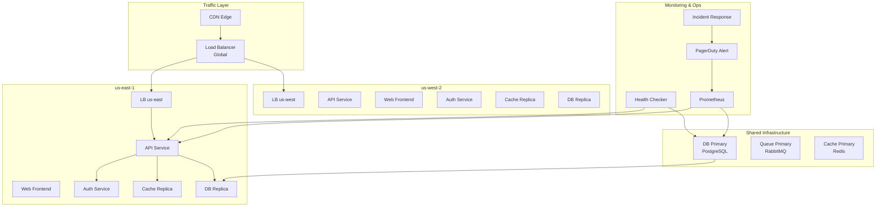
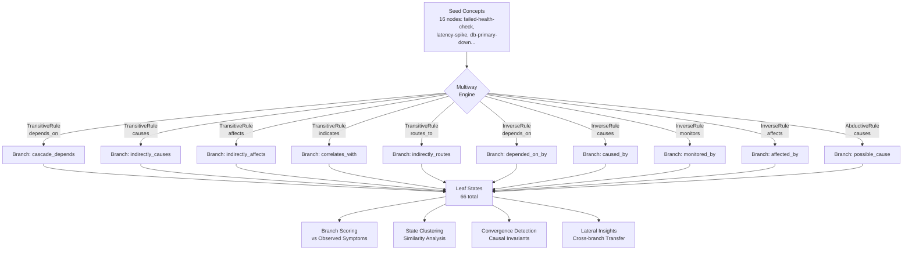
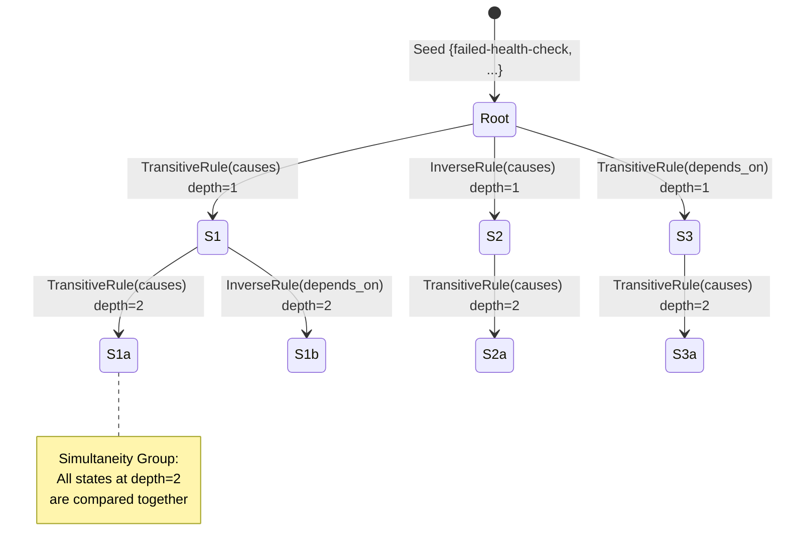
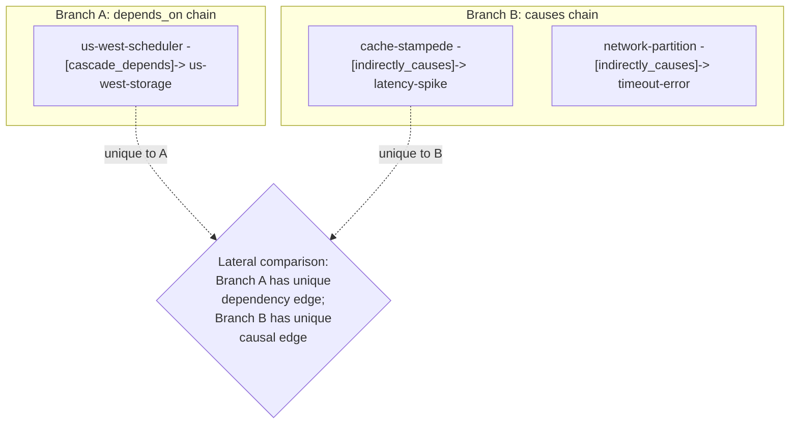

# Multiway Lateral Reasoning Showcase

> **Exploring Alternative Incident Hypotheses with Multiway Expansion**

## 1. The Approach

When a cloud infrastructure health check fails, multiple root causes are possible: database failure, network partition, bad deployment, or cache stampede.

**The Linear Bottleneck:** Traditional diagnostic logic forces agents to chase a single narrative sequence until it fails. If the hypothesis is wrong, the system must backtrack, wasting critical minutes and burning tokens while context drifts.

**The Hyper3 Approach:** The engine explores multiple hypotheses in parallel through **multiway expansion**. By applying inference rules across the hypergraph, it produces a branching state space where each branch represents a different causal explanation, then compares branches to find the best fit for the observed symptoms.

## 2. A Simple Analogy

Think of this like a doctor who simultaneously explores multiple possible diagnoses (flu, infection, allergy) rather than chasing one theory at a time. Each "branch" of reasoning represents a different diagnosis, and Hyper3 compares them to find which best explains the symptoms.

## 3. Key Concepts

| Term | Plain English Meaning |
|------|----------------------|
| **Multiway Expansion** | Exploring multiple "what if" scenarios at the same time |
| **State** | One possible version of the truth (e.g., "what if the database is down") |
| **Branch** | A chain of reasoning from seed → conclusion |
| **Leaf State** | A final conclusion after applying rules |
| **Convergence** | When different paths lead to the same conclusion |
| **Simultaneity Group** | Hypotheses at the same "depth" that can be compared directly |
| **Lateral Insights** | Knowledge from one branch that applies to another |

## 4. Quick Start

Run the flagship showcase to see multi-hypothesis reasoning in action:

```bash
.venv/bin/python examples/showcase/reasoning/multiway_reasoning/multiway_lateral_insights.py
```

### What You'll See

The engine explores 66 different hypothesis branches from a single failed health check:

```
======================================================================
SECTION 2: Multiway Expansion from Failed Health Check
======================================================================
  States created:    51
  Rules applied:     50
  New edges:         50
  Branches (leaves): 66
```

## 5. The Scenario & Topology

The example models a realistic, multi-region cloud infrastructure representing **81 nodes and 203 semantic edges**:

- **3 Geographic Regions:** `us-east`, `us-west`, `eu-west`
- **Service Mesh:** API, web, auth, cache, worker, and orchestration layers per region
- **Shared Core:** PostgreSQL primary databases, RabbitMQ queues, and Redis cache clusters
- **The Trigger:** A failed health check on `us-east-api` with associated symptoms (latency spike, connection refused)

### System Topology

Figure 1: The infrastructure we're analyzing — three regions with shared databases.



### Edge Label Taxonomy

| Category | Labels | Meaning |
|----------|---------|---------|
| **Routing** | `routes_to`, `fails_over_to`, `hosts`, `serves` | Network traffic flow |
| **Dependency** | `depends_on`, `replicates_to`, `distributes_to` | Service reliance |
| **Causality** | `causes`, `affects`, `indicates` | Cause-effect relationships |
| **Observation** | `monitors`, `collects_from`, `traces` | Telemetry links |
| **Resolution** | `resolves`, `deploys`, `triggers` | Remediation pathways |
| **Security** | `protects`, `secures`, `authenticates` | Security boundaries |

## 6. The Analysis Pipeline (Narrative Walkthrough)

Instead of just listing technical steps, let's look at how the pipeline uncovers the story of the incident. We start with 16 seed concepts (symptoms and suspected origins) and let the engine expand.

### Phase 1: Multiway Expansion

Ten inference rules (transitive, inverse, abductive) operate simultaneously on the graph, creating a branching directed acyclic graph (DAG) of states.

Figure 2: The engine takes seed concepts and applies multiple inference rules simultaneously, creating a branching tree of hypotheses.



**Result:** 51 states created, 50 rules applied, 50 inference edges produced, 66 leaf states.

### Phase 2: Branch Scoring & the Top Hypothesis

Each branch is scored against the 8 observed symptoms using a composite metric:

```
score = (edge_hits + symptom_overlap) / (total_symptoms + produced_edges + 1)
```

**The Discovery:** The top hypothesis (score **0.909**) is a database failure. The `transitive(causes)` chain connecting `db-primary-down` → `db-replication-lag` → `slow-query` → `latency-spike` → `failed-health-check` provides the strongest explanation, covering 6 out of 8 observed symptoms.

**Key insight:** The replication lag (`db-replication-lag`) is the smoking gun — it causes slow queries, which cause latency spikes, which trigger the health check failure.

### Phase 3: State Clustering & Convergence

States at the same depth form **Simultaneity Groups** — hypotheses that can be directly compared.

Figure 3: States at the same depth form groups that can be directly compared.



The 66 leaf states cluster into 5 simultaneity groups:

| Group | Dominant Rule | Hypothesis |
|-------|---------------|-----------|
| Group 1-3 | `transitive(causes)` | Database failure cascade |
| Group 4 | `transitive(depends_on)` | Dependency chain failure |
| Group 5 | `transitive(routes_to)` | Network routing issue |

**The Convergence Signal:** The engine found 20 causal invariants — situations where different rules led to the same conclusion. For example:
- `transitive(causes)` chain: db-primary-down → connection-refused → failed-health-check
- `inverse(causes)` chain: failed-health-check → connection-refused (reverse lookup)

Both paths converge on `connection-refused` as a key intermediate symptom. When multiple rule types reach the same node, that's a strong signal it's part of the real causal chain.

### Phase 4: Lateral Insights

By comparing branches within the same simultaneity group, the engine identifies nodes and edges unique to each branch, highlighting where hypotheses diverge.

Figure 4: Comparing branches within the same group reveals unique knowledge.



**The Hidden Connection:** By comparing states within the same simultaneity group, the engine identifies edges unique to each branch. For example, some branches produce `cache-stampede → latency-spike` edges while others produce `network-partition → timeout-error` edges. These differences highlight which causal mechanisms each hypothesis branch explores, revealing that multiple root causes (database, network, cache) may be contributing simultaneously.

### The Conclusion

The evidence strongest supports **db-primary-down** as the root cause:
- Highest branch score (0.909, tied with other branches)
- Causal chain through replication lag to observed symptoms present in original graph edges
- Multiple branches producing similar scores, with db-primary-down appearing in high-scoring branches

The structural comparison across branches reveals that **network-partition** and **cache-stampede** also appear in high-scoring branches, suggesting they may be contributing factors.

### Why This Matters

If we had pursued only the network-partition hypothesis, we'd have missed the database replication signal. If we had pursued only the database, we'd have missed the cache stampede path.

The multiway approach produces **multiple hypotheses ranked by evidence strength**, plus structural differences across branches. This means:
1. Start with the top hypothesis (database)
2. Monitor the second hypothesis (network) as a parallel track
3. Use lateral insights to watch for cascade effects (cache stampede)

## 7. Understanding the Output

### Branch Score Interpretation

| Score Range | Meaning |
|------------|---------|
| 0.9+ | Branch explains most symptoms — strong candidate root cause |
| 0.7-0.9 | Branch explains a subset of symptoms — partial match |
| 0.5-0.7 | Branch touches some symptoms — weak signal |
| < 0.5 | Branch largely irrelevant to observed symptoms |

### Simultaneity Groups

States in the same simultaneity group are **at the same depth** in the multiway DAG and can be directly compared. The group number indicates which "wave" of reasoning the states belong to.

### Lateral Insight Types

| Type | Description | Example |
|------|-------------|---------|
| **Novel in source** | Nodes/edges in the reference branch not in the comparison | A dependency chain unique to one hypothesis |
| **Novel in lateral** | Nodes/edges in the comparison branch not in the reference | A causal link unique to another hypothesis |
| **Complementary** | Different branches that together cover more ground | One branch explains DB issues, another explains network |

## 8. Key Metrics

| Metric | Value |
|--------|-------|
| Graph nodes | 81 |
| Graph edges (initial) | 203 |
| Graph edges (after reasoning) | 253 |
| Seed concepts | 16 |
| Inference rules | 10 |
| States created | 51 |
| Rules applied | 50 |
| Inference edges produced | 50 |
| Leaf states | 66 |
| Simultaneity groups | 5 |
| Causal invariants merged | 20 |
| Cross-branch edge differences | 6 |
| Best branch score | 0.909 |

## 9. What Makes This Different

Traditional diagnostic systems follow a **single path**: pick the most likely hypothesis, pursue it, backtrack if wrong. Hyper3's multiway engine explores **multiple hypotheses in parallel** through a branching state space, then uses structural comparison to identify:

1. **Which branches best explain the evidence** (branch scoring)
2. **Which branches converge on the same conclusions** (causal invariants)
3. **What knowledge from one branch applies to another** (lateral insights)

This approach is useful in incident response where the root cause is unknown — instead of pursuing one hypothesis at a time, you get a ranked set of candidates with structural comparisons across branches.

## 10. The 10 Inference Rules

Ten inference rules operate simultaneously on the graph:

| Rule | Edge Pattern | Produces | Purpose |
|------|-------------|----------|---------|
| `TransitiveRule(causes)` | A-[causes]->B, B-[causes]->C | A-[indirectly_causes]->C | Chain cause-effect |
| `TransitiveRule(depends_on)` | A-[depends_on]->B, B-[depends_on]->C | A-[cascade_depends]->C | Dependency chains |
| `TransitiveRule(affects)` | A-[affects]->B, B-[causes]->C | A-[indirectly_affects]->C | Impact propagation |
| `TransitiveRule(indicates)` | A-[indicates]->B, B-[indicates]->C | A-[correlates_with]->C | Symptom correlation |
| `TransitiveRule(routes_to)` | A-[routes_to]->B, B-[routes_to]->C | A-[indirectly_routes]->C | Network path tracing |
| `InverseRule(causes)` | A-[causes]->B | B-[caused_by]->A | Reverse causality |
| `InverseRule(depends_on)` | A-[depends_on]->B | B-[depended_on_by]->A | Reverse dependency |
| `InverseRule(monitors)` | A-[monitors]->B | B-[monitored_by]->A | Reverse telemetry |
| `InverseRule(affects)` | A-[affects]->B | B-[affected_by]->A | Reverse impact |
| `AbductiveRule(causes)` | A-[causes]->B (B observed) | B-[possible_cause]->A | Diagnostic inference |

## 11. Code Implementation

Building this reasoning pipeline in Hyper3 requires minimal boilerplate.

**1. Register the Inference Rules**

```python
rules = [
    TransitiveRule(edge_label="depends_on", new_label="cascade_depends"),
    TransitiveRule(edge_label="causes", new_label="indirectly_causes"),
    InverseRule(edge_label="monitors", inverse_label="monitored_by"),
    AbductiveRule(effect_label="causes", cause_label="possible_cause"),
    # ... additional rules
]
mem.add_rules(*rules)
```

**2. Seed and Reason**

```python
seed = {"failed-health-check", "latency-spike", "db-primary-down", "us-east-api"}
result = mem.reason(seeds=seed, depth=3, max_total_states=50)
```

**3. Extract Lateral Insights**

```python
for concept in ["failed-health-check", "db-primary-down", "network-partition"]:
    insights = mem.lateral_insights(concept)
```

## 12. The Observability Gap (Real-World Integration)

Hyper3 performs rule-based inference once the semantic graph exists. The real-world challenge is the data engineering pipeline required to build and maintain that graph:

1. **Relationship Extraction:** Converting raw Terraform/K8s telemetry into semantic edges (`depends_on`)
2. **Causal Discovery:** Using time-series algorithms (Granger causality) to separate true causation from metric correlation
3. **Ontology Mapping:** Normalizing disparate vendor labels into a canonical schema
4. **Knowledge Construction:** Building a federated pipeline to ingest real-time events without contradicting state

**Theoretical pipeline:**

```
Terraform/ K8s manifests
        ↓
  [Entity Extraction] → nodes with types
        ↓
Jaeger traces + Prometheus metrics
        ↓
  [Relationship Inference] → raw edges
        ↓
  [Causal Discovery] → causal edges (causes, affects)
        ↓
  [Semantic Labeling] → canonical edge types
        ↓
  [Entity Resolution] → merge duplicates
        ↓
  [Validation] → check graph consistency
        ↓
    Hyper3 Graph (ready for multiway reasoning)
```

**Current state in Hyper3:** The showcase demonstrates what's possible **once the graph exists**. The pipeline above is **out of scope** for Hyper3 core — it's the data engineering layer that feeds Hyper3.

**For real-world adoption**, organizations would need to build or buy:
- ETL tools for their specific stack (Terraform + Datadog + Jaeger)
- Semantic labeling rules tuned to their architecture
- Causal discovery tuned to their metric patterns

Hyper3 provides the **reasoning engine**; the data engineering pipeline that feeds it is a separate concern.

## 13. Reference Taxonomy & API

### Core Concept Glossary

| Term | Semantic Definition |
| ----- | ----- |
| **Multiway Expansion** | Exploring multiple "what if" scenarios simultaneously |
| **State** | One possible version of the truth within the graph |
| **Leaf State** | A final conclusion after applying rules |
| **Convergence** | When disparate logical paths lead to the same causal conclusion |
| **Simultaneity Group** | Hypotheses at the same logical depth compared directly |
| **Lateral Insights** | Knowledge from one branch that seamlessly applies to another |

### Key API Methods

| Method | Purpose |
| ----- | ----- |
| `mem.reason(seeds, depth, max_total_states)` | Run multiway expansion from seed nodes |
| `mem.lateral_insights(concept)` | Find knowledge transferable across branches |
| `mem.state_clustering.simultaneity_groups` | Get groups of states at the same depth |
| `mem.state_clustering.coordinates` | Get state coordinate embeddings |
| `result.clustering` | State clustering report from reasoning |
| `result.state_convergence` | Merge report from state convergence |
| `result.expansion` | Expansion statistics (states, rules, edges) |

### Related Examples

| Example | Focus |
|---------|-------|
| `examples/showcase/workflow/self_evolving_cognition/self_evolving_cognition.py` | Feedback-driven evolution, metamorphosis validation |
| `examples/showcase/belief/adaptive_learning/adaptive_learning.py` | Rule effectiveness learning, Thompson sampling |
| `examples/showcase/domain/infrastructure_self_healing/infrastructure_self_healing.py` | Multiway reasoning + feedback loop integration |
| `examples/showcase/domain/medical_diagnosis/medical_diagnosis.py` | Backward chaining for differential diagnosis |
| `examples/showcase/domain/fraud_detection/fraud_detection_intelligence.py` | Cycle detection, funnel account identification |
