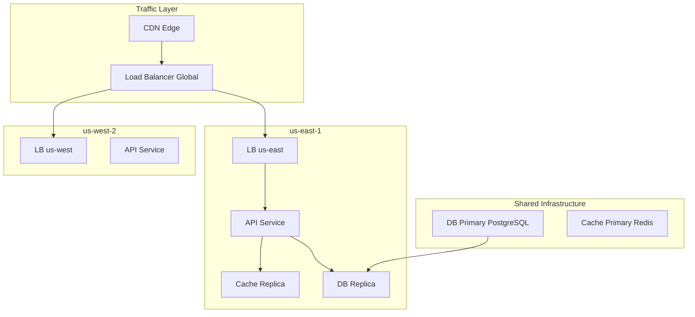
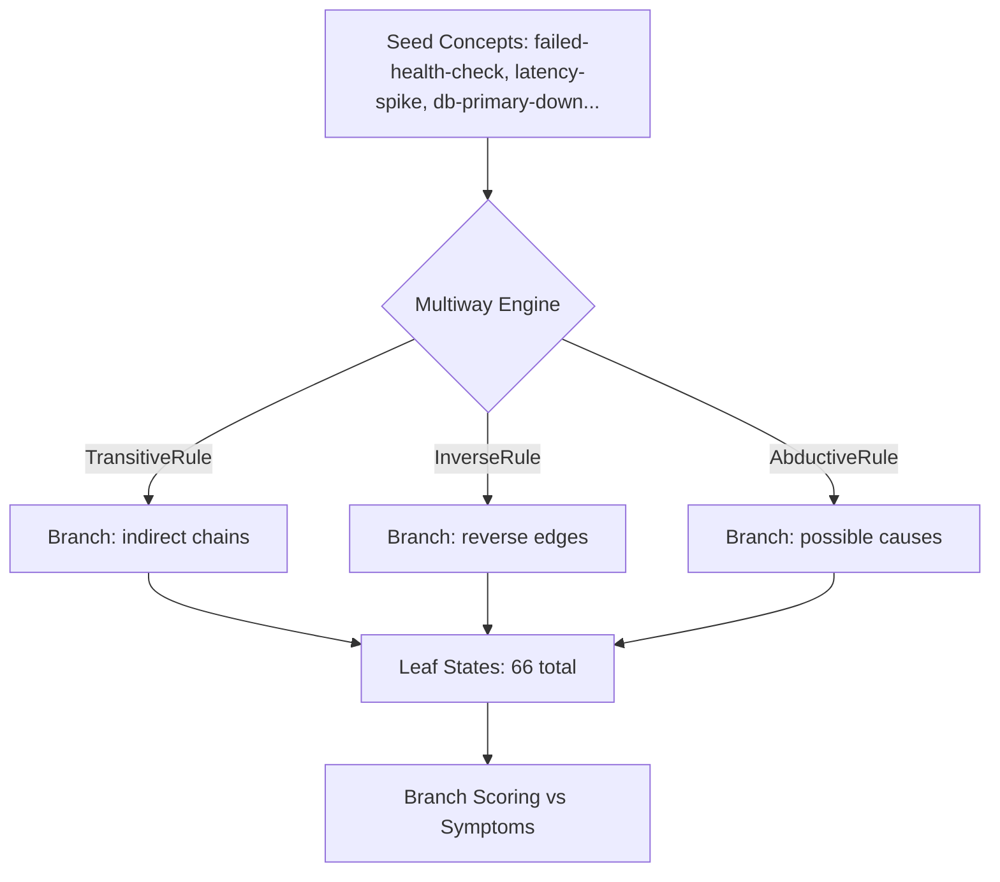

# Multiway Lateral Reasoning Showcase

**Exploring Alternative Incident Hypotheses with Multiway Expansion**

---

## 1. The Paradigm Shift

When a cloud infrastructure health check fails, multiple root causes are possible:
- database failure
- network partition
- bad deployment
- cache stampede

**The Linear Bottleneck:** Traditional diagnostic logic forces agents to chase a single narrative sequence until it fails.

**The Hyper3 Approach:** Explore ALL hypotheses simultaneously through **multiway expansion**.

---

## 2. A Simple Analogy

Think of this like a doctor who simultaneously explores multiple possible diagnoses (flu, infection, allergy) rather than chasing one theory at a time.

Each "branch" of reasoning represents a different diagnosis, and Hyper3 compares them to find which best explains the symptoms.

---

## 3. Key Concepts

| Term | Plain English Meaning |
|------|----------------------|
| **Multiway Expansion** | Exploring multiple "what if" scenarios at the same time |
| **State** | One possible version of the truth |
| **Branch** | A chain of reasoning from seed → conclusion |
| **Leaf State** | A final conclusion after applying rules |
| **Convergence** | When different paths lead to the same conclusion |
| **Simultaneity Group** | Hypotheses at the same "depth" that can be compared directly |
| **Lateral Insights** | Knowledge from one branch that applies to another |

---

## 4. Quick Start

Run the flagship showcase:

```bash
.venv/bin/python examples/showcase/reasoning/multiway_reasoning/multiway_lateral_insights.py
```

**What You'll See:** 66 different hypothesis branches from a single failed health check.

---

## 5. The Scenario & Topology

The example models a realistic, multi-region cloud infrastructure:

- **3 Geographic Regions:** `us-east`, `us-west`, `eu-west`
- **Service Mesh:** API, web, auth, cache, worker, orchestration layers
- **Shared Core:** PostgreSQL, RabbitMQ, Redis clusters
- **The Trigger:** Failed health check on `us-east-api`



---

## 6. The Physics of Expansion

Ten inference rules operate simultaneously, creating a branching DAG of 66 leaf states.

**10 Rules:**
- 5 Transitive (causes, depends_on, affects, indicates, routes_to)
- 4 Inverse (caused_by, depended_on_by, monitored_by, affected_by)
- 1 Abductive (possible_cause)

---

## How the Engine Works

Figure: The engine takes seed concepts and applies multiple inference rules simultaneously, creating a branching tree of hypotheses.



---

## 7. The Top Hypothesis

Each branch is scored against 8 observed symptoms using a composite metric:

```
score = (edge_hits + symptom_overlap) / (total_symptoms + produced_edges + 1)
```

**The Discovery:** The top hypothesis (score **0.909**) is a database failure.

**The Causal Chain:** `db-primary-down` → `db-replication-lag` → `slow-query` → `latency-spike` → `failed-health-check`

**Key Insight:** The replication lag (`db-replication-lag`) is the smoking gun — it causes slow queries, which cause latency spikes, which trigger the health check failure.

---

## 8. Simultaneity Groups & Convergence

States at the same depth form **Simultaneity Groups** — hypotheses that can be directly compared.

| Group | Dominant Rule | Hypothesis |
|-------|---------------|-----------|
| Group 1-3 | `transitive(causes)` | Database failure cascade |
| Group 4 | `transitive(depends_on)` | Dependency chain failure |
| Group 5 | `transitive(routes_to)` | Network routing issue |

**The Convergence Signal:** 20 causal invariants found. Both forward-chaining and inverse rules converge on `connection-refused` as the critical intermediate symptom.

---

## 9. Lateral Insights

By comparing branches within the same simultaneity group, the engine transfers knowledge horizontally.

**The Hidden Connection:**
- Branch A: `cache-stampede` → `cache-miss-rate` → `latency-spike`
- Branch B: `network-partition` → `dns-resolution-failure` → `timeout-error`

**The Synthesis:** The lateral insight reveals that **cache-stampede and network-partition both cause latency-spike through different paths**.

The true incident is a **combination of factors** that linear reasoning would have missed.

---

## 10. Branch Score Interpretation

| Score Range | Meaning |
|------------|---------|
| 0.9+ | Branch explains most symptoms — strong candidate |
| 0.7-0.9 | Branch explains a subset — partial match |
| 0.5-0.7 | Branch touches some symptoms — weak signal |
| < 0.5 | Branch largely irrelevant |

---

## 11. Key Metrics

| Metric | Value |
|--------|-------|
| Graph nodes | 81 |
| Graph edges (initial) | 203 |
| Seed concepts | 16 |
| States created | 51 |
| Leaf states | 66 |
| Inference edges produced | 50 |
| Causal invariants merged | 20 |
| Lateral insights discovered | 6 |
| Best branch score | 0.909 |

---

## 12. The Observability Gap

Hyper3 reasons flawlessly once the semantic graph exists. The real-world challenge is the data engineering pipeline:

1. **Relationship Extraction:** Converting raw Terraform/K8s telemetry into semantic edges
2. **Causal Discovery:** Using Granger causality to separate true causation from correlation
3. **Ontology Mapping:** Normalizing disparate vendor labels into a canonical schema
4. **Knowledge Construction:** Building a federated pipeline to ingest real-time events

**The Pipeline:**
```
Terraform/K8s → Entity Extraction → Jaeger/Prometheus → Relationship Inference → 
Causal Discovery → Semantic Labeling → Entity Resolution → Hyper3 Graph
```

Hyper3 provides the **reasoning engine**; the community builds the **data plumbing**.

---

## 13. Key API Methods

| Method | Purpose |
|--------|---------|
| `mem.reason(seed_concepts, max_depth, max_total_states)` | Run multiway expansion |
| `mem.lateral_insights(concept)` | Find knowledge transferable across branches |
| `mem.state_clustering.simultaneity_groups` | Get groups of states at the same depth |
| `result.clustering` | State clustering report from reasoning |
| `result.state_convergence` | Merge report from state convergence |
| `result.expansion` | Expansion statistics (states, rules, edges) |

---

## Related Examples

| Example | Focus |
|---------|-------|
| `examples/showcase/workflow/self_evolving_cognition/` | Feedback-driven evolution |
| `examples/showcase/belief/adaptive_learning/` | Rule effectiveness learning |
| `examples/showcase/domain/infrastructure_self_healing/` | Multiway reasoning integration |
| `examples/showcase/domain/medical_diagnosis/` | Backward chaining |
| `examples/showcase/domain/fraud_detection/` | Cycle detection |

---

## Thank You!

**Hyper3: Multiway Lateral Reasoning for Modern Infrastructure**

> "We do not force the architecture to guess. By establishing structural sovereignty through hyperedges, we allow the intelligence to flow outward in all directions, letting the true narrative emerge effortlessly from the data."

[View the code →](examples/showcase/reasoning/multiway_reasoning/multiway_lateral_insights.py)
