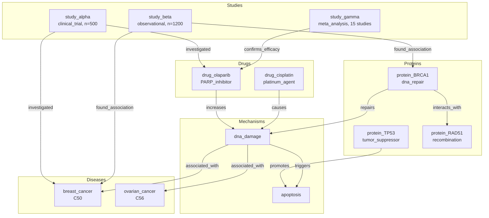

# Provenance Tracking and Cascading Retraction

> **Maintaining Knowledge Graph Integrity When Evidence Is Withdrawn**

## 1. The Approach

In a knowledge graph built from scientific literature, an inferred relationship is only as reliable as the evidence chain supporting it. When a source study is retracted or a premise is disproven, every conclusion that depends on it becomes unreliable.

**The Manual Approach:** When a paper is retracted, researchers must manually trace every citation and downstream claim, then individually remove or flag each affected conclusion. This is error-prone at scale — a single retracted meta-analysis might invalidate dozens of downstream inferences across multiple research groups.

**The Hyper3 Approach:** Every inferred edge records its **provenance**: which rule produced it, which input edges it used, and at what depth. When a premise is retracted via `retract_inference()`, the engine traces all dependent inferences and removes them in a single cascading operation, maintaining graph consistency.

## 2. A Simple Analogy

Think of this like a house of cards. Each card (inference) rests on other cards below it (premises). If you pull out a card near the bottom, every card resting on it falls too. Provenance tracking is like labeling each card with "this card rests on cards X, Y, Z" — so when card X is removed, you know exactly which other cards must come down.

## 3. Key Concepts

| Term | Plain English Meaning |
|------|----------------------|
| **Provenance** | A record of how an inference was derived: which rule, which inputs, what depth |
| **Cascading Retraction** | Removing an inference and all inferences that depend on it, recursively |
| **Explain** | Tracing the provenance chain to show *why* an edge exists |
| **Inference Chain** | A sequence of derived edges where each step depends on the previous one |
| **Depth** | How many rule-application steps from original (given) data an inference is |

## 4. Quick Start

```bash
.venv/bin/python examples/showcase/reasoning/provenance_and_retraction/provenance_and_retraction.py
```

### What You'll See

```
SECTION 1: Building Research Knowledge Graph
  12 entities, 13 relationships

SECTION 2: Reasoning with Provenance
  States explored: 3
  Rules applied: 2
  Edges inferred: 2
  Provenance records: 2

SECTION 3: Explaining Inferences
  2 inferred edges. Explaining each:

  drug_olaparib --[was_investigated_by]--> study_alpha
    Rule: inverse(investigated->was_investigated_by)
    Depth: 1

  breast_cancer --[was_investigated_by]--> study_alpha
    Rule: inverse(investigated->was_investigated_by)
    Depth: 1

SECTION 5: Cascading Retraction
  Graph before retraction: 15 edges
  Provenance records: 2

  Retracted: drug_olaparib --[was_investigated_by]--> study_alpha
  Cascading removals: 1

  Graph after retraction: 14 edges
  Provenance records: 1
```

## 5. The Scenario

The example models a biomedical research knowledge graph covering clinical trials, proteins, drugs, diseases, and mechanisms.

### Research Graph Topology



### Node and Edge Taxonomy

| Category | Examples | Count |
|----------|----------|-------|
| **Studies** | study_alpha, study_beta, study_gamma | 3 |
| **Proteins** | protein_BRCA1, protein_TP53, protein_RAD51 | 3 |
| **Drugs** | drug_olaparib, drug_cisplatin | 2 |
| **Diseases** | breast_cancer, ovarian_cancer | 2 |
| **Mechanisms** | dna_damage, apoptosis | 2 |
| **Evidence edges** | investigated, found_association, confirms_efficacy | 6 |
| **Biological edges** | repairs, interacts_with, promotes, triggers, increases, causes | 6 |
| **Association edges** | associated_with | 1 |

## 6. The Analysis Pipeline

### Phase 1: Building the Research Graph

The script creates 12 entities (studies, proteins, drugs, diseases, mechanisms) and 13 relationships connecting them. Each entity carries structured data — for example, `study_alpha` has `{"type": "clinical_trial", "year": 2023, "n_patients": 500}`, and `protein_BRCA1` has `{"type": "protein", "function": "dna_repair"}`.

Relationships use descriptive labels (`investigated`, `repairs`, `causes`) that become the vocabulary for inference rules.

### Phase 2: Reasoning with Provenance

Three inference rules are registered:

```python
mem.add_rules(
    TransitiveRule(edge_label="associated_with", new_label="indirectly_associated"),
    TransitiveRule(edge_label="investigated", new_label="indirectly_investigated"),
    InverseRule(edge_label="investigated", inverse_label="was_investigated_by"),
)
```

The `InverseRule` reverses `investigated` edges: since `study_alpha` investigated `drug_olaparib`, the rule infers that `drug_olaparib` `was_investigated_by` `study_alpha`. The same applies for `study_alpha` and `breast_cancer`.

**Why provenance matters here:** Without provenance records, an inferred edge is indistinguishable from a given edge. If a user asks "why does `drug_olaparib` link to `study_alpha`?", there would be no way to answer. With provenance, the system can report: "because `study_alpha` investigated `drug_olaparib` (given), and the inverse rule was applied at depth 1."

The reasoning engine explored 3 states, applied 2 rules, and produced 2 inferred edges — each with a provenance record.

### Phase 3: Explaining Inferences

The script retrieves all inferred edges and calls `provenance.explain()` on each. For the edge `drug_olaparib --[was_investigated_by]--> study_alpha`:

```
drug_olaparib -> study_alpha (inferred) because:
  study_alpha -> drug_olaparib (given)
  via inverse(investigated->was_investigated_by)
```

The explanation shows the rule name, depth, and the input edge that justified the inference. At depth 1, the input is always a given edge. In deeper inference chains, the explanation would trace back through multiple levels.

The high-level `mem.explain("drug_olaparib", "breast_cancer")` API was also called but returned no inferred relationship — `drug_olaparib` and `breast_cancer` are connected only through given edges (via `study_alpha`), not through inference. The `mem.explain("dna_damage", "ovarian_cancer")` call returned a given edge, not an inferred one.

### Phase 4: Cascading Retraction

This is the core demonstration. Before retraction, the graph has 15 edges (13 given + 2 inferred) and 2 provenance records.

The script retracts the inference `drug_olaparib --[was_investigated_by]--> study_alpha`:

```python
retracted_ids = mem.retract_inference(
    "drug_olaparib", "study_alpha", edge_label="was_investigated_by"
)
```

The retraction removes exactly 1 edge (the targeted inference itself). No further cascading occurs because the retracted edge had no dependent inferences — no other derived edges were built on top of `drug_olaparib --[was_investigated_by]--> study_alpha`. In a deeper inference chain, where edge A was derived from edge B, which was derived from edge C, retracting C would cascade through B to A, removing all three. Here the chain is only one level deep, so the retraction is limited to the single targeted edge.

After retraction: 14 edges remain, and 1 provenance record persists (for the `breast_cancer --[was_investigated_by]--> study_alpha` inference, which was not retracted).

## 7. Understanding Output

### Explanation Fields

| Field | Meaning |
|-------|---------|
| `rule_name` | Which inference rule produced this edge |
| `depth` | Number of rule-application steps from given data |
| `render()` | Human-readable trace showing the input edges and rule |

### Retraction Output

| Output | Meaning |
|--------|---------|
| `retracted_ids` | List of edge IDs removed (target + all dependents) |
| Edge count change | 15 → 14 confirms one edge was removed |
| Provenance count change | 2 → 1 confirms one provenance record was cleaned up |

## 8. Key Metrics

| Metric | Value |
|--------|-------|
| Entities (nodes) | 12 |
| Given relationships (edges) | 13 |
| Inference rules registered | 3 |
| States explored | 3 |
| Rules applied | 2 |
| Edges inferred | 2 |
| Provenance records created | 2 |
| Edges before retraction | 15 |
| Edges retracted (cascading) | 1 |
| Edges after retraction | 14 |
| Provenance records after retraction | 1 |

## 9. What Makes This Different

**Provenance as a first-class record**, not a log entry. Every inferred edge carries a structured provenance record that can be queried, rendered, and traversed. This is not logging — it is a derivable trace that the retraction engine uses to determine dependencies.

**Cascading retraction maintains consistency.** In a knowledge graph with multi-step inference chains (A was derived from B, which was derived from C), retracting C removes both B and A automatically. Without this, stale inferences would persist after their premises are removed, leading to a graph that claims support from edges that no longer exist.

**Explainability as a query.** The `explain()` method traces the full derivation chain on demand. This makes the graph auditable — any inferred relationship can be justified by showing the rule and inputs that produced it.

## 10. Code Implementation

**1. Register rules and reason with provenance tracking**

```python
from hyper3 import HypergraphMemory, TransitiveRule, InverseRule, Modality

mem = HypergraphMemory(evolve_interval=0)

mem.add("drug_olaparib", data={"type": "drug", "class": "PARP_inhibitor"})
mem.add("study_alpha", data={"type": "clinical_trial", "year": 2023})
mem.link("study_alpha", "drug_olaparib", label="investigated")

mem.add_rules(
    InverseRule(edge_label="investigated", inverse_label="was_investigated_by"),
)

result = mem.reason(
    {"study_alpha", "drug_olaparib"}, depth=3, max_states=40
)
```

**2. Explain an inferred edge**

```python
explanation = mem.provenance.explain(edge_id, graph=mem.engine.graph)
print(f"Rule: {explanation.rule_name}")
print(f"Depth: {explanation.depth}")
print(explanation.render())
```

**3. Retract an inference**

```python
retracted_ids = mem.retract_inference(
    "drug_olaparib", "study_alpha", edge_label="was_investigated_by"
)
print(f"Removed {len(retracted_ids)} edges")
```

## 11. Real-World Gap

**Automated literature monitoring.** The showcase uses a static, hand-built graph. In practice, the knowledge graph would need to be fed by a pipeline that monitors PubMed, CrossRef, and retraction watch databases for new publications and retractions. Building and maintaining that pipeline is out of scope for Hyper3.

**Confidence decay.** The current retraction model is binary — an edge either exists or it doesn't. Real scientific knowledge has varying confidence levels. A study with a small sample size might warrant a lower-confidence inference than a large meta-analysis. Hyper3 does not currently propagate confidence scores through inference chains; this would require a separate probabilistic layer.

**Partial retraction.** In practice, a retracted paper might invalidate some claims but not others (e.g., the main conclusion is retracted but a secondary finding stands). The current system retracts the entire inference chain. Modeling partial validity would require per-edge confidence scores and threshold-based retraction.

**Scale.** The showcase operates on 12 entities and 15 edges. Production biomedical knowledge graphs contain millions of entities (e.g., PubMed has 35M+ citations). The provenance lookup and cascading retraction algorithms would need index optimization to operate at that scale.

## 12. Reference

### API Methods

| Method | Purpose |
|--------|---------|
| `mem.reason(seeds, depth, max_states)` | Run inference, creating provenance records |
| `mem.provenance.explain(edge_id, graph)` | Get derivation chain for an inferred edge |
| `mem.explain(source_label, target_label)` | High-level explain between two concepts |
| `mem.retract_inference(source, target, edge_label)` | Retract inference and all dependents |
| `mem.provenance.record_count` | Number of provenance records currently tracked |

### Related Examples

| Example | Focus |
|---------|-------|
| `examples/showcase/reasoning/multiway_reasoning/` | Multi-hypothesis reasoning with branch scoring |
| `examples/showcase/reasoning/knowledge_reasoning/` | Transitive inference, belief revision, confidence scoring |
| `examples/showcase/domain/medical_diagnosis/` | Biomedical knowledge graph construction |
