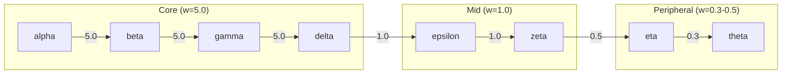

# Self-Evolving Knowledge Graph

> Decay, reinforcement, Hebbian learning, and feedback-driven evolution on a small graph

## The Approach

Most knowledge graph libraries treat the graph as a static data structure: you add nodes and edges, query them, and they stay exactly as you left them. Real knowledge changes. Some connections become stale, frequently-used paths strengthen, and co-occurring concepts form associations. Hyper3 builds self-evolution directly into the graph through four mechanisms: decay (reduce weights on inactive edges), reinforce (strengthen frequently-used paths), Hebbian learning (strengthen edges between co-activated nodes), and feedback-driven evolution (tune evolution parameters based on operation outcomes).

This showcase builds a small 8-node chain graph, runs each evolution mechanism, and shows what changes.

## Key Concepts

| Term | What it does |
|------|-------------|
| **Decay** | Reduces edge weights over time when edges are not used. Edges that nobody traverses gradually lose importance. |
| **Prune** | Removes nodes or edges that have dropped below a weight threshold after decay. |
| **Merge** | Combines nodes that the equivalence engine identifies as structurally similar. |
| **Reinforce** | Increases edge weights along paths that are frequently recalled or traversed. |
| **Hebbian learning** | Strengthens edges between nodes that are co-activated during activation spreading. Named after the neuroscience principle: "neurons that fire together wire together." |
| **Feedback-driven evolution** | Uses the history of operation outcomes (which recalls succeeded, which failed) to adjust evolution parameters. |

## Quick Start

```bash
.venv/bin/python examples/showcase/reasoning/self_evolution/self_evolution.py
```

Expected output (excerpt):

```
nodes: 8, edges: 7
evolve result:
  decays: 0
  prunes: 0
  merges: 4
  reinforced: 0

Hebbian reinforcement:
  edges strengthened: 3
  edges weakened: 0
  total co-activations: 3
  avg weight change: 0.2702

feedback summary:
  overall health: 0.5
  correlated nodes: 0
```

## Scenario

The script constructs an 8-node chain with graded edge weights:



A second 4-node graph (x, y, z, w) is used for the Hebbian learning demonstration.

## Analysis Pipeline

### Section 1: Build the graph

Eight nodes and seven edges are created. The weight gradient (5.0 down to 0.3) simulates a knowledge graph where core concepts have strong connections and peripheral concepts have weak ones. This matters because evolution mechanisms behave differently depending on starting weights: high-weight edges survive decay longer, while low-weight edges are candidates for pruning sooner.

### Section 2: Decay and merge

`mem.evolve()` runs the full evolution cycle. Result: 0 decays, 0 prunes, 4 merges, 0 reinforced.

**Why 0 decays**: All edge weights in the initial graph are at or above 0.3. The decay mechanism reduces weights on inactive edges, but none of the edges have been inactive long enough (or started low enough) for decay to push them below the threshold. With an older graph or lower starting weights, decay would reduce weights measurably.

**The 4 merges** are the significant outcome. The equivalence engine identified node pairs with sufficient structural and data similarity and merged them. After merging, the chain collapses -- source and target labels on some edges now point to the same merged node (e.g., `alpha->alpha`, `gamma->gamma`). These are self-loop edges: the merge combined nodes that were neighbors in the original chain, so the edge that connected node A to node B now connects the merged A+B node to itself. This is expected behavior -- when two adjacent nodes merge, any edge between them becomes self-referential.

**Merge thresholds matter**: Whether these merges happen at all depends on the equivalence engine's similarity threshold. The nodes in this graph share identical data (`{"type": "concept"}`) and have overlapping neighborhoods, so they score high on structural and data similarity. With a higher similarity threshold, fewer or none of these pairs would qualify for merging. With a lower threshold, even more pairs might merge. Production use requires tuning this threshold to match the data distribution -- too aggressive and genuinely distinct concepts get collapsed, too conservative and duplicates accumulate.

Why this matters: without merging, a graph that ingests data from multiple sources accumulates duplicate nodes for the same concept. Merging keeps the graph compact. The trade-off is that merges are based on heuristic similarity -- nodes with the same data and overlapping neighborhoods may be merged even when they represent genuinely distinct concepts.

### Section 3: Reinforcement

The script calls `mem.recall("alpha", max_depth=2)` and `mem.recall("beta", max_depth=2)` five times each, simulating heavy usage of the core path. After a second `evolve()`: 0 decays, 0 reinforced.

Reinforcement did not fire here because the Section 2 merges fundamentally changed the graph structure. The 4 merges collapsed alpha into beta and gamma into delta, so the `recall("alpha")` calls no longer traverse a chain of distinct nodes. Instead, the traversed paths include self-loop edges (like `alpha->alpha`) where source and target are the same merged node. Self-loops do not count as reinforcement candidates -- reinforcement targets edges along paths between distinct nodes that are frequently recalled. Since the original chain structure no longer exists, there is nothing meaningful to reinforce.

In a graph where the original paths survive intact, repeated recall increases edge weights along the traversed path, making those paths easier to find in future recalls.

Why this matters: a static knowledge graph treats every traversal identically. Reinforcement creates a feedback loop where frequently-queried paths become stronger, improving recall quality for the concepts you actually use.

### Section 4: Hebbian learning

A fresh 4-node graph (x, y, z, w) demonstrates Hebbian reinforcement:

1. Nodes `x` and `y` are stimulated, then activation spreads through the graph.
2. `hebbian_reinforce()` checks which nodes have overlapping activation and strengthens the edges between them.

Result: 3 edges strengthened, 0 weakened, 3 total co-activations, average weight change of 0.2677.

Why this matters: in a static graph, the only way to change edge weights is explicitly. Hebbian learning creates implicit weight adjustments based on usage patterns. Nodes that frequently activate together develop stronger connections, which reflects how real associative memory works.

### Section 5: Feedback-driven evolution

`evolve_with_feedback()` uses the history of past operations to decide which edges to reinforce or suppress. Result: 0 reinforced, 0 suppressed. The feedback summary reports overall health of 0.5 and 0 correlated nodes.

The neutral result is honest feedback. This is a small graph with limited operation history and a structure that has already been flattened by merges. Feedback-driven evolution tracks which recall operations succeeded, which edges consistently appear in successful traversals, and which are never used. With only self-loops and a handful of recent recall calls, there is not enough signal for the feedback mechanism to act on. On a larger graph with varied usage patterns and an intact chain structure, feedback-driven evolution would have meaningful data to work with.

Why this matters: without feedback, evolution operates on general rules (decay everything uniformly, reinforce what was recalled). Feedback-driven evolution personalizes the decay/reinforcement schedule to the actual usage pattern of the specific graph.

## Key Metrics

| Metric | Value |
|--------|-------|
| Initial nodes | 8 |
| Initial edges | 7 |
| Section 2 merges | 4 |
| Section 2 decays | 0 |
| Section 2 prunes | 0 |
| Section 3 reinforced | 0 |
| Hebbian edges strengthened | 3 |
| Hebbian edges weakened | 0 |
| Hebbian co-activations | 3 |
| Hebbian avg weight change | 0.2702 |
| Feedback reinforced | 0 |
| Feedback suppressed | 0 |
| Feedback overall health | 0.5 |
| Feedback correlated nodes | 0 |

## What Makes This Different

**Structural self-modification** is built into the graph itself, not applied as a separate post-processing step. Calling `evolve()` triggers decay, prune, merge, and reinforce in a single pass, and the graph emerges structurally different afterward.

**Hebbian learning** operates on activation state, not explicit weights. The graph must be stimulated and activation must spread before Hebbian reinforcement can identify co-activated node pairs. This is a two-step process (stimulate + spread, then reinforce) rather than a direct weight assignment.

**Feedback-driven evolution** tracks operation history. The evolution engine does not just apply uniform decay -- it uses which paths succeeded and which failed to make targeted reinforce/suppress decisions. On a small graph with limited history the effect is minimal, but the mechanism scales with usage.

## Code Implementation

Building a graph and running evolution:

```python
from hyper3 import HypergraphMemory

mem = HypergraphMemory(evolve_interval=0)

for node in ["alpha", "beta", "gamma", "delta", "epsilon", "zeta", "eta", "theta"]:
    mem.add(node, data={"type": "concept"})

mem.link("alpha", "beta", label="related", weight=5.0)
mem.link("beta", "gamma", label="related", weight=5.0)

result = mem.evolve()
print(f"decays: {result.decayed}, merges: {result.merged}")
```

Hebbian learning:

```python
mem2 = HypergraphMemory(evolve_interval=0)
for node in ["x", "y", "z", "w"]:
    mem2.add(node)

mem2.link("x", "y", label="linked", weight=1.0)
mem2.link("y", "z", label="linked", weight=1.0)

mem2.search.activate("x", energy=1.0)
mem2.search.activate("y", energy=1.0)

hebb_result = mem2.cognitive.hebbian_reinforce()
print(f"edges strengthened: {hebb_result.edges_strengthened}")
```

Feedback-driven evolution:

```python
fb_result = mem.evolve_with_feedback()
print(f"reinforced: {fb_result.reinforced}, suppressed: {fb_result.suppressed}")

summary = mem.feedback_summary()
print(f"overall health: {summary.overall_health}")
```

## Real-World Gap

- **Scale**: This showcase operates on 8 nodes and 7 edges. Evolution behavior at 10K+ nodes is untested -- merge decisions and decay sweeps take longer as the graph grows.
- **Data source**: The graph is constructed synthetically. Production use requires ETL from live knowledge sources, and merge thresholds would need tuning for the actual data distribution.
- **Merge accuracy**: The equivalence engine uses heuristic similarity. On real data with nuanced concepts, false merges are possible. Production use requires discriminative data fields (unique IDs, timestamps) to prevent merging genuinely distinct nodes.
- **Determinism**: Hebbian learning depends on activation spreading, which involves numerical operations. Results should be reproducible given the same operation sequence, but floating-point accumulation may cause minor variation.
- **Feedback history**: Feedback-driven evolution needs accumulated operation history to be effective. A freshly-loaded graph with no history will produce neutral results until sufficient operations have been recorded.

## Reference

### API methods

| Method | Purpose |
|--------|---------|
| `mem.evolve()` | Run decay, prune, merge, reinforce cycle |
| `mem.evolve_with_feedback()` | Run evolution using operation history |
| `mem.cognitive.hebbian_reinforce()` | Strengthen edges between co-activated nodes |
| `mem.search.activate(concept, energy=1.0)` | Inject activation into a node |
| `mem.feedback_summary()` | Report feedback-driven evolution state |
| `mem.recall(concept, max_depth=N)` | Retrieve related concepts (triggers usage tracking) |

### Related examples

- `examples/showcase/` -- other showcases demonstrating different Hyper3 capabilities
- `evolve_interval` constructor parameter -- enables automatic evolution after every N operations
