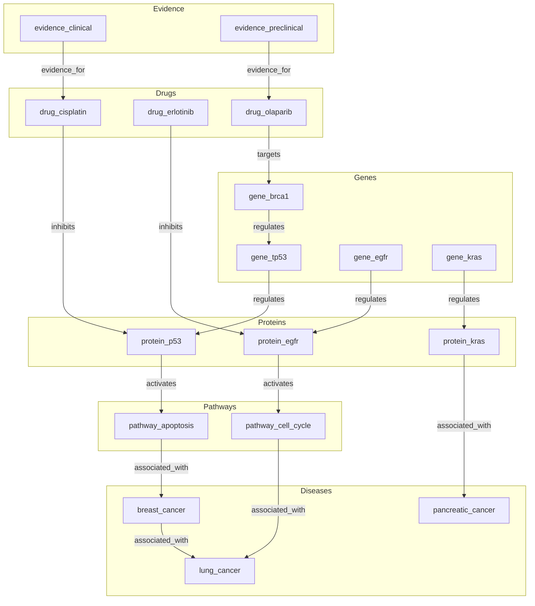
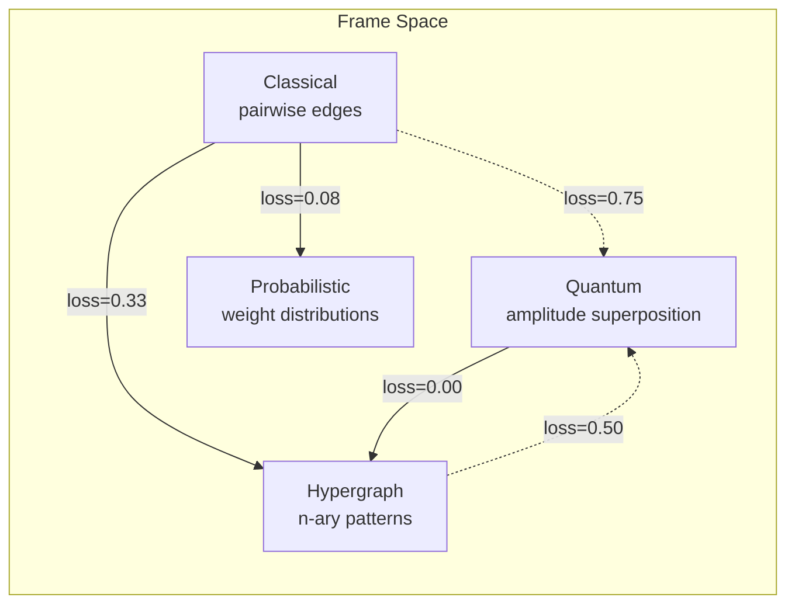

# Validation Engine and Frame Transformations

> **A/B Reasoning Comparison and Cross-Frame Information Loss on a 17-Node Biomedical Graph**

## 1. The Approach

Adding more inference rules is not always better. A single `TransitiveRule` on a well-structured graph produces clean, high-confidence inferences. Stack five rules together and you get more edges — but also noise, contradictions, and false leads that dilute the signal. Without measurement, "enhanced" reasoning is an article of faith. The ValidationEngine provides a principled framework for answering the question: does adding more rules actually improve results?

Alongside reasoning validation, computational frames offer different perspectives on the same problem. A classical frame sees pairwise edges; a quantum frame sees amplitude superpositions; a hypergraph frame sees n-ary patterns; a probabilistic frame sees weight distributions. The FrameTransformer quantifies the information cost of translating between these perspectives — which frame transitions preserve the most structure, and which require the most assumptions?

## 2. A Simple Analogy

Think of reasoning rules like kitchen tools. A sharp knife (single TransitiveRule) makes clean cuts. A food processor with five attachments (multi-rule reasoning) can do more — but also makes more mess. Before investing in the food processor, you'd want evidence that the extra output is worth the cleanup. The ValidationEngine is that evidence: it runs both approaches side-by-side and measures whether the added complexity produces better results or just more noise.

The frame transformation side is like translating a photograph between color spaces (RGB, CMYK, grayscale). Each space reveals different information, and the translation between them loses or preserves different qualities. The FrameTransformer measures exactly what survives each translation.

## 3. Key Concepts

| Term | Plain English Meaning |
|------|----------------------|
| **ValidationEngine** | Compares simple vs enhanced reasoning on the same seed concepts |
| **ValidationReport** | Contains simple/enhanced summaries, agreement metrics, novel findings, contradictions, and a recommendation |
| **AgreementMetrics** | Jaccard similarity (node, edge), consistency, precision, recall, F1 between simple and enhanced outputs |
| **ReasoningSummary** | Nodes/edges produced, avg confidence, coverage, and timing for one reasoning mode |
| **FrameTransformer** | Transforms parameters between computational frames (classical, quantum, hypergraph, probabilistic) |
| **TransformedConfig** | Target-frame algorithm, information loss score, and preserved properties |
| **Information loss** | [0,1] value measuring how much structure is lost in a frame transition (0 = perfect preservation, 1 = complete loss) |
| **run_validation_suite** | Batch validation across multiple seed sets, tracking cumulative reliability |

Information loss is not a fixed property of two frames — it depends on the parameters passed to `transform()`. The same frame pair (e.g., classical->hypergraph) can yield zero loss with one set of parameters and 0.33 with another. The matrix in Section 2 uses `parameters={"branching_factor": 4, "amplitudes": [0.5, 0.3, 0.2]}` for every cell, while the individual transforms in Section 6 use different parameters per pair (`{"branching_factor": 4}` for quantum, `{"weights": [3.0, 2.0, 1.0]}` for probabilistic, `{"max_arity": 3}` for hypergraph). This is why the Section 2 matrix shows `classical->hypergraph: loss=0.0000` but Section 6 shows `classical->hypergraph: loss=0.3333` — same frames, different parameters. When comparing frame transitions, always specify which parameters produced the loss values.

## 4. Quick Start

```bash
.venv/bin/python examples/showcase/reasoning/validation_engine/validation_engine.py
```

```
SECTION 1: BUILD BIOMEDICAL KNOWLEDGE GRAPH
nodes: 17, edges: 15
edge labels: ['activates', 'associated_with', 'evidence_for', 'inhibits', 'regulates', 'targets']

SECTION 2: FRAME TRANSFORMATIONS
information loss matrix:
        from\to   classical     quantum  hypergraph  probabilis
      classical      0.0000      0.7500      0.0000      0.0000
        quantum      0.7500      0.0000      0.0000      0.6200
     hypergraph      0.5000      0.5000      0.0000      0.0000
  probabilistic      0.5000      0.0000      0.0000      0.0000

SECTION 4: AGREEMENT METRICS ANALYSIS
recommendation: enhanced
novel findings: 1
contradictions: 0
```

Information loss values depend on the parameters passed to `FrameTransformer.transform()`. The matrix structure (which cells are zero vs nonzero) is stable.

## 5. Biomedical Graph Topology

The 17-node graph spans genes, proteins, diseases, drugs, pathways, and evidence nodes. The `regulates` label forms the inference chain that the ValidationEngine tests.



The transitive `regulates` chain (gene_brca1 -> gene_tp53 -> protein_p53) is the inference target for the validation comparison.



Dashed lines indicate high-loss transitions; solid lines indicate low-loss. Classical-origin values use Section 6 parameters; cross-frame values use Section 2 matrix parameters. Actual loss depends on parameters passed to `transform()`. The classical frame is the most "isolated" — moving to quantum loses 75% of expressible information.

## 6. Analysis Pipeline

**Section 1 — Build biomedical knowledge graph:** 17 nodes across 6 types — genes (brca1, tp53, egfr, kras), proteins (p53, egfr, kras), diseases (breast_cancer, lung_cancer, pancreatic_cancer), drugs (cisplatin, erlotinib, olaparib), pathways (apoptosis, cell_cycle), and evidence (clinical, preclinical). 15 edges connect them with 6 semantic labels (see topology diagram above). A `TransitiveRule` is registered for the `regulates` label. Why this matters: the biomedical domain naturally produces multi-hop chains — gene_brca1 regulates gene_tp53, gene_tp53 regulates protein_p53 — making it ideal for testing whether transitive inference produces useful edges (gene_brca1 indirectly regulates protein_p53) or noise.

**Section 2 — Frame transformations:** The 4x4 information loss matrix reveals which computational perspectives are "close" (low loss) and which require significant assumptions (high loss). Key observations: classical->classical has zero loss (identity transform). Classical->hypergraph has zero loss with the default parameters because pairwise edges are a subset of hyperedges — no information is lost by moving to a more general representation — but note that different parameters can yield different loss values (see Section 6). Quantum->hypergraph has zero loss because multi-source patterns are hypergraph-native. Classical->quantum has the highest loss (0.75) because amplitude superposition introduces phase information that classical pairwise edges cannot represent. Why this matters: the matrix tells you which frame transitions are "safe" (lossless or near-lossless) and which are "expensive" (high information loss requiring assumptions). If your analysis works in the classical frame and you need to move to the quantum frame, expect to lose 75% of the expressible information — the transform preserves reachability but discards weight magnitudes, label semantics, and structural patterns.

**Section 3 — Simple vs enhanced reasoning comparison:** The `ValidationEngine.run_comparison()` method applies the provided rules in two modes. Simple mode applies rules and then removes the results — it measures what rules *would* produce without committing. Enhanced mode runs full multiway expansion and commits new edges to the graph. Results: simple produces 0 new edges (applies then removes), enhanced produces 1 edge via full multiway expansion. Simple takes ~0.1ms vs enhanced's ~3.3ms (timing varies by run). Why this matters: the simple mode is a zero-cost preview — it tells you what the rules would produce without side effects. The enhanced mode commits the results and measures the full cost including multiway state creation, provenance tracking, and confidence propagation. The ~33x time difference (~0.1ms vs ~3.3ms) reflects the overhead of commitment.

**Section 4 — Agreement metrics analysis:** All agreement metrics (node Jaccard, edge Jaccard, consistency, precision, recall, F1) are zero. This is not a coincidence — it follows directly from how simple mode works. Simple mode applies rules then removes the results, producing zero edges. With no simple-mode edges to compare against, all overlap metrics (Jaccard, precision, recall) are zero by definition. The recommendation is "enhanced" because enhanced has strictly more coverage (1 edge > 0 edges). There is 1 novel finding — the single edge produced by enhanced reasoning — and 0 contradictions. The enhanced overhead is ~3.2ms (timing varies by run). Why this matters: the zero-agreement case is the "no baseline" scenario — when simple reasoning produces nothing, the engine cannot measure agreement and falls back to a coverage comparison. The recommendation of "enhanced" means "enhanced found something simple did not, with no evidence of harm." In graphs with richer inference chains, simple mode would produce edges too, and the agreement metrics would provide actual evidence for or against enhanced reasoning.

**Section 5 — Multi-case validation suite:** Three test cases (gene_brca1, drug_cisplatin, pathway_apoptosis) each run the comparison independently. All three recommend "enhanced" because none produce edges in simple mode. `is_enhanced_reliable()` returns False — not because enhanced is unreliable, but because the reliability check requires enough history with F1 >= 0.5, and all F1 scores are 0.0 (no simple-mode edges to compare against). Why this matters: reliability is earned, not assumed. A single comparison that happens to favor enhanced is not enough — the engine tracks cumulative performance across multiple test cases and only certifies enhanced as "reliable" when it consistently demonstrates high agreement with simple reasoning *plus* additional coverage. The False result here means "not enough evidence yet" rather than "enhanced is unreliable."

**Section 6 — Cross-frame comparison:** Identity transform (classical->classical) has zero information loss, confirming the baseline. Three out-of-classical transforms are detailed: classical->quantum uses "superposition" algorithm with loss 0.75, preserving only reachability. Classical->probabilistic uses "probabilistic" algorithm with loss 0.08, preserving reachability and weight ordering. Classical->hypergraph uses "pattern_match" algorithm with loss 0.33, preserving pairwise edges. Note that this classical->hypergraph loss (0.33) differs from the matrix value (0.00) because the individual transform uses `parameters={"max_arity": 3}` while the matrix uses `parameters={"branching_factor": 4, "amplitudes": [0.5, 0.3, 0.2]}` — information loss is parameter-dependent. Why this matters: the preserved properties tell you what survives the frame transition. Reachability preservation means you can still answer "can A reach B?" after moving to the quantum frame, but not "what is the strongest path from A to B?" Weight ordering preservation in the probabilistic frame means you can still rank paths by strength. Pairwise edge preservation in the hypergraph frame means no edges are lost, but the hypergraph may gain additional structure from higher-arity patterns.

## 7. Key Metrics

| Metric | Value |
|--------|-------|
| Nodes | 17 |
| Base edges | 15 |
| Edge labels | 6 |
| Computational frames | 4 |
| Frame transition pairs | 12 |
| Max information loss | 0.75 (classical->quantum) |
| Min information loss (non-identity) | 0.00 (classical->hypergraph, quantum->hypergraph, with matrix parameters) |
| Simple reasoning edges | 0 |
| Enhanced reasoning edges | 1 |
| Simple reasoning time | ~0.1 ms (timing varies by run) |
| Enhanced reasoning time | ~3.3 ms (timing varies by run) |
| Novel findings | 1 |
| Contradictions | 0 |
| Recommendation | enhanced |
| Validation test cases | 3 |
| Enhanced reliable | False |

The "Min information loss" value of 0.00 comes from the parameterized matrix in Section 2, which uses `parameters={"branching_factor": 4, "amplitudes": [0.5, 0.3, 0.2]}`. Individual transforms in Section 6 use different parameters per pair (e.g., `{"max_arity": 3}` for classical->hypergraph) and show loss=0.3333 for the same frame pair. Information loss is a property of frames plus parameters, not frames alone.

## 8. What Makes This Different

**Quantified agreement** provides numeric evidence for or against enhanced reasoning. The ValidationEngine computes node Jaccard (overlap of nodes touched), edge Jaccard (overlap of edges produced), consistency (fraction of shared edges with matching labels), precision (fraction of enhanced edges also found by simple), recall (fraction of simple edges also found by enhanced), and F1 (harmonic mean of precision and recall). These six metrics give a multi-dimensional view of agreement that a single "are they the same?" boolean cannot capture.

**Contradiction detection** finds three types of conflicts between simple and enhanced outputs: label conflicts (same edge with different labels), weight divergences (same edge with significantly different weights), and direction conflicts (same node pair with reversed direction). Each contradiction is logged with its type and details, enabling targeted rule refinement rather than blanket "enhanced is noisy" conclusions.

**Frame information loss** maps the 4x4 matrix of frame transitions, revealing which computational perspectives are "close" (classical->hypergraph, loss=0.0 with matrix parameters) and which require significant assumptions (classical->quantum, loss=0.75). The preserved properties list tells you exactly what survives each transition — reachability, weight ordering, pairwise edges, or multi-source patterns — enabling informed decisions about which frame to use for analysis. Remember that loss values depend on the parameters passed to `transform()`.

**Automatic recommendation** evaluates the agreement metrics and outputs "enhanced", "simple", or "equivalent" based on coverage, F1, and contradiction count. Enhanced gets the nod when it produces more coverage with no evidence of harm. Simple wins when enhanced introduces contradictions without coverage gains. Equivalent means both produce the same results. The recommendation is a starting point, not a final answer — the metrics provide the evidence for human judgment.

## 9. Code Implementation

**1. Build a biomedical graph with typed nodes:**

```python
from hyper3 import HypergraphMemory, TransitiveRule

mem = HypergraphMemory(evolve_interval=0, rules=[
    TransitiveRule(edge_label="regulates", new_label="indirect_regulation"),
])

for gene in ["gene_brca1", "gene_tp53", "gene_egfr", "gene_kras"]:
    mem.add(gene, data={"type": "gene"})

mem.link("gene_brca1", "gene_tp53", label="regulates", weight=3.0)
mem.link("gene_tp53", "protein_p53", label="regulates", weight=3.0)
```

**2. Run simple vs enhanced comparison:**

```python
from hyper3 import ValidationEngine

ve = ValidationEngine(mem)
report = ve.run_comparison(
    seed_concepts={"gene_brca1", "gene_tp53"},
    rules=[TransitiveRule(edge_label="regulates", new_label="indirect_regulation")],
)

print(f"simple edges: {len(report.simple_results.edges_produced)}")
print(f"enhanced edges: {len(report.enhanced_results.edges_produced)}")
print(f"recommendation: {report.recommendation}")
print(f"contradictions: {len(report.contradictions)}")
```

**3. Inspect agreement metrics:**

```python
a = report.agreement
print(f"node jaccard: {a.node_jaccard:.4f}")
print(f"edge jaccard: {a.edge_jaccard:.4f}")
print(f"precision: {a.precision:.4f}")
print(f"recall: {a.recall:.4f}")
print(f"f1: {a.f1:.4f}")
```

**4. Run a multi-case validation suite:**

```python
test_cases = [{"gene_brca1"}, {"drug_cisplatin"}, {"pathway_apoptosis"}]
reports = ve.run_validation_suite(test_cases)
print(f"enhanced reliable: {ve.is_enhanced_reliable()}")
```

**5. Compute frame information loss:**

```python
from hyper3 import FrameTransformer

ft = FrameTransformer()
loss = ft.information_loss("classical", "quantum", parameters={"branching_factor": 4})
config = ft.transform("classical", "hypergraph", parameters={"max_arity": 3})

print(f"algorithm: {config.algorithm}")
print(f"information_loss: {config.information_loss:.4f}")
print(f"preserved: {config.preserved_properties}")
```

## 10. Real-World Gap

This showcase validates reasoning on a 17-node biomedical graph with a single TransitiveRule. Real-world adoption involves additional considerations:

- **Simple mode applies then removes** — the `_run_simple()` method applies rules to the graph, collects results, then removes newly added edges. This does not clone the graph, so it is not safe to call from inside a running `reason()` call.
- **F1 threshold for reliability is arbitrary** — `is_enhanced_reliable()` requires history with F1 >= 0.5. This threshold is a heuristic; different domains may require different thresholds.
- **Frame transforms use fixed parameter mappings** — the `FrameTransformer` maps parameters between frames using predefined rules, not learned mappings. Domain-specific parameter tuning is not addressed.
- **Scale** — the showcase runs on 17 nodes. Validation overhead (running reasoning twice per test case, computing Jaccard over all edges) scales with graph size and rule count.

## 11. Reference

| Method | Purpose |
|--------|---------|
| `ValidationEngine(mem)` | Create a validation engine bound to a HypergraphMemory instance |
| `ve.run_comparison(seeds, rules)` | Compare simple vs enhanced reasoning, returning a ValidationReport |
| `ve.run_validation_suite(test_cases)` | Run comparison across multiple seed sets |
| `ve.is_enhanced_reliable()` | Check if enhanced reasoning has sufficient historical F1 >= 0.5 |
| `report.agreement` | AgreementMetrics with Jaccard, precision, recall, F1 |
| `report.recommendation` | "enhanced", "simple", or "equivalent" |
| `report.novel_findings` | Edges found by enhanced but not simple |
| `report.contradictions` | Label, weight, or direction conflicts |
| `FrameTransformer()` | Create a frame transformer |
| `ft.information_loss(src, tgt, parameters)` | Compute information loss [0,1] for a frame transition |
| `ft.transform(src, tgt, parameters)` | Compute TransformedConfig with algorithm, loss, and preserved properties |

| Related Example | Connection |
|----------------|------------|
| `knowledge_reasoning` | Inference rules used in the validation comparison |
| `multiway_reasoning` | Multiway expansion engine that enhanced mode uses |
| `iterative_frame_reasoning` | Multi-frame analysis across computational perspectives |
